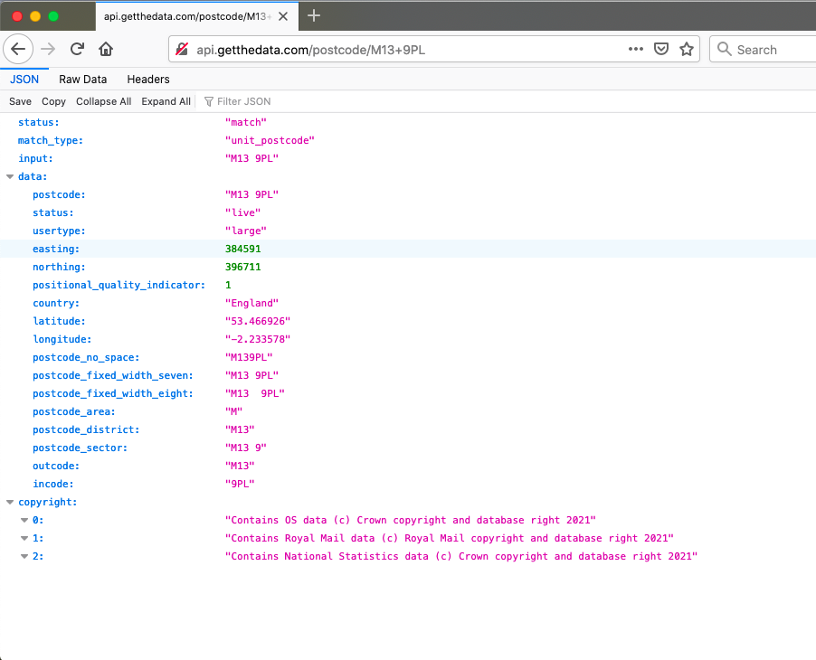

# Chapter 2: Basic geospatial operations in R

## Introduction

In this chapter we get your hands dirty with **spatial manipulation of your data**. Thus far, our data manipulation exercises (using `dplyr`) were such that you might be familiar with, from your earlier exposures to data analysis. For example, linking datasets using a common column is a task which you can perform on spatial or non-spatial data. However today we will explore some exercises in data manipulation which are specific to *spatial* data analysis. We will be learning some key spatial operations, a set of functions that allow you to create new and manipulate spatial data.

The main objectives for this session are that by the end you will have:

- used **geocoding** methods to translate postcodes into geographic coordinates 
- made interactive point map with leaflet
- met a new format of spatial shape file called **geojson**
- subset points that are within a certain area using a **spatial operation**
- created new polygons by generating **buffers** around points
- counted the number of points that fall within a polygon (known as **points in polygon**)
- measured distance between points in a map

These are all very useful tools for the spatial crime analyst, and we will hope to demonstrate this by working through an example project. 

The packages we will use in this chapter are: 

```{r, message=FALSE}
library(readr)
library(dplyr)
library(rjson)
library(purrr)
library(leaflet)
library(RColorBrewer)
library(sf)
library(janitor)
library(units)
```

## Exploring the relationship between alcohol outlets and crime

The main example we will work through most of the chapter considers the assumption that licenced premises which serve alcohol are associated with increased crimes. We might have some hypotheses about why this may be. 

One theory might be that some of these serve as *crime attractors*. 

> Crime attractors are particular places, areas, neighbourhoods, districts which create well-known criminal opportunities to which strongly motivated, intending criminal offenders are attracted because of the known opportunities for particular types of crime. Examples might include bar districts; prostitution areas; drug markets; large shopping malls, particularly those near major public transit exchanges; large, insecure parking lots in business or commercial areas. The intending offender goes to rough bars looking for fights or other kinds of 'action'. 

On the other hand, it is possible that these areas are *crime generators*. 

> Crime generators are particular areas to which large numbers of people are attracted for reasons unrelated to any particular level of criminal motivation they might have or to any particular crime they might end up committing. Typical examples might include shopping precincts; entertainment districts; office concentrations; or sports stadiums. 

(To read  further in crime attractors vs crime generators turn to your recommended reading of @Brantingham_1995. There have since been more developments, for example about crime radiators and absorbers as well ([watch this Risky Places lecture from Kate Bowers:](https://play.kth.se/media/Risky+PlacesA+Crime+absorbers,+crime+radiators+as+risky+places,+Prof+Kate+Bowers,+UCL/0_zya4j354) to learn more!)

It's possible that some licensed premises attract crimes, due to their reputation. However it is also possible that some of them are simply located in areas that are busy, attracts lots of people for lots of reasons, and crimes occur as a result of an abundance of opportunities instead. 

In any case, what we want to do is to examine whether certain outlets have more crimes near them than others. We can do this using open data, some R code, and the spatial operations discussed above. We will return to data from Manchester city for this example.

Manchester City Council have an [Open Data Catalogue](http://open.manchester.gov.uk/open/homepage/3/manchester_open_data_catalogue) on their website, which you can use to browse through what sorts of data they release to the public. There are a some more and some less interesting data sets made available here. It's not quite as impressive as the open data from some of the cities in the US such as [New York](https://opendata.cityofnewyork.us/) or [Dallas ](https://www.dallasopendata.com/) but we'll take it. 

One interesting data set, especially for our questions about the different alcohol outlets is the [Licensed Premises](http://www.manchester.gov.uk/open/downloads/file/169/licensed_premises) data set. This details all the currently active licenced premises in Manchester. You can see there is a link to download. 

As always, there are a few ways you can download this data set. On the manual side of things, you can simply right click on the download link from the website, save it to your computer, and read it in from there, by specifying the file path. Remember, if you save it in your *working directory*, then you just need to specify the file name, as the working directory folder is where R will first look for this file. 

So without dragging this on any further, let's read in the licensed premises data directly from the web: 

```{r, message=FALSE, warning=FALSE}

lic_prem <- read_csv("http://www.manchester.gov.uk/open/download/downloads/id/169/licensed_premises.csv")
```

You will likely get some warnings when reading this data, but you can safely ignore those.bYou can always check if this worked by looking to your global environment on the righ hand side and seeing if this *lic_prem* object has appeared. If it has, you should see it has `r I(nrow(lic_prem))` observations (rows), and `r I(ncol(lic_prem))` variables (columns).

Let's have a look at what this data set looks like. You can use the `View()` function for this: 

```{r, eval=FALSE}
View(lic_prem)
```

## Subsetting using pattern matching

We can see there are some interesting and perhaps less interesting columns in there. There are quite a lot of venues in this list as well. Let's think about subsetting them to make this example more manageable.  Let's say we're interested in city centre manchester. We can see that there is a column for postcodes. We know (from our local domain knowledge) that city centre postcodes in Manchester are M1-M4. So let's start by subsetting the data to include these. 

We could use spatial operations here, and geocode all the alcohol outlets at this point, then use a spatial file of city centre to select only the points contained in this area. In the next sections we will be introducing these spatial operations but before we do that we are going to find another way of subsetting the outlets located in the city centre to end up with a smaller collection of locations.

One reason sometimes this may be convenient is because (as we will see later) the geocode function takes a bit of time to geocode each address. Since we only need to precisely geocode the outlets in the city centre we may first subset the data to select only those outlets (as indicated by their postal code) and only then geocode rather than the entire 65535 of them. 

To do this we will be using the `grepl()` function. This function takes a **pattern** and looks for it in some text. If it finds the pattern, it returns TRUE, and if it does not, it returns FALSE. So you have to pass two parameters to the `grepl()` function, one of them being the pattern that you want it to look for, and the other being the object in which to search. 

So for example, if we have an object that is some text, and we want to find if it contains the letter "a", we would pass those inside the `grepl()` function, which would tell us TRUE (yes it's there) or FALSE (no it's not there):

```{r}
some_text <- "this is some text that has some letter 'a's"

grepl("a", some_text)

```

You can see this returns TRUE, because there is at least one occurrence of the letter a. If there wasn't, we'd get FALSE: 

```{r}
some_text <- "this is some text tht hs some letters"

grepl("a", some_text)

```

So we can use this, to select all the cases where we find the pattern "M1 " in the postcode. *NOTICE* the space in our search pattern. It's not "M1" it's "M1 ". Can you guess why?

Well, M1 will be found in M1 but also in M13, which is the University of Manchester's postcode, and not the part of city centre in which we are interested. 

So let's subset our data by creating a new object `city_centre_prems`, and using the piping (`%>%`) and `filter()` functions from the `dplyr` package:

```{r}

#create the city_centre_prems object:
city_centre_prems <- lic_prem %>%
  filter(grepl("M1 ", POSTCODE) )

```

Now we only have `r I(nrow(city_centre_prems))` observations (see your global environment), which is a much more manageable number. 

### Geocoding from an address

Great OK so we have this list of licensed premises, and we have their address, which is clearly *some* sort of spatial information, but how would you put this on a map?   

We can, at the most basic, geocode the postcode. This will put all the establisments to the centroid of the postcode. Postcodes are used in the United Kingdom as alphanumeric codes, that were devised by Royal Mail. A full postcode is known as a "postcode unit" and designates an area with a number of addresses or a single major delivery point. [You can search the Royal Mail for information on post codes here.](https://www.royalmail.com/business/search/google/POSTCODE). 

Here is a map of the postcode areas in Greater Manchester: 


Now the centroid of the post code area represents the central point of the shapefile. For example, here you can see some polygons with their centroids illustrated by points: 


This is not quite as precise as geocoding the actual address, but let's just stick with this approach for now.

So we need something that will help us get the coordinates for the relevant post code centroid. For this we can use the [Open postcode](https://data.gov.uk/dataset/091feb1c-aea6-45c9-82bf-768a15c65307/open-postcode-geo) geo from [data.gov.uk](data.gov.uk). Open Postcode Geo is a postcode dataset and API optimised for geocoding applications. You can use Open Postcode Geo to geocode a dataset, geocode user input, and therefore build a proximity search. Data is derived from the Office for National Statistics postcode database and is free to use, **subject to including attributions to ONS, OS (Ordinance Survey) and Royal Mail**.

Postcodes can be entered at area, district, sector, and unit level - see Postcode map for the geographical relationship between these. We can use the Application Programme Interface (API) to query postcodes and read them directly into R, attaching a latitude and a longitude to our dataframe. 

### Getting address from post code using an API

What is an API? I once gave an hour long demo on using APIs, if you would like to watch you can see here: [APIs demo](https://vimeo.com/438506088). 

But essentially, the way we use it here, an API is a way for us to query data from the web using an url. In this case, we will use the Open Postcode Geo API (detailed above), and give it an address. In the URL. Then, it will return to us the coordinates of that address. 

Try this in a browser. Open up chrome, or firefox, or whatever you use and type "http://api.getthedata.com/postcode/" plus your post code, but instead of the space add a plus sign. 

For example, the uni postcode is "M13 9PL". So to query the coordinates for the university we use the url: "http://api.getthedata.com/postcode/M13+9PL"

You should see a result like this: 



This is called a JSON file, you can see it has lots of info about this post code, for example it tells us the country is England, and it gives us a value for latitude and for longitude. 

It's all very well seeing this in a browser, but how can we get this into R? Well we can use a function called `fromJSON()` from the `rjson` package, which reads in JSON files and turns them into the nice dataframes we know and love. Inside the `fromJSON()` we use the `readlines()` function to get the data from the URL. We save all this into a geocode_result object: 

```{r}

library(rjson)

geocode_result <- fromJSON(readLines("http://api.getthedata.com/postcode/M13+9PL"))

```

We get a warning about an incomplete final line. For now ignore this, as it seems we get our data anyway. So what do we get? Well let's see this geocode_result object: 

```{r}

geocode_result

```

Ahh it contains all the information we saw earlier in the browser. How nice!

This is great for one postcode at a time, but remember what I said about being lazy, and automating. We want the computer to do the work for us. To do this, we need to set up our query (the url) in a way that lets us give many postcodes in, and get many results out.  For that we can use the `paste0()` function and the `gsub()` function. `paste0()` can be used to paste together different bits of text, while `gsub()` sustituse certain characters (in this case spaces) for other characters (in this case +). So to get from M13 9PL to M13+9PL we use `gsub(" ", "+", "M13 9PL")`, first saying what to replace, then what to replace it with, and finally in what object (or character string). 

So let's say we assign our postcode to an object called "address": 

```{r}

address <- "M13 9PL"

```

We can then use this in the combination of paste0 and gsub to build the URL for our query: 

```{r}
geocode_result <- fromJSON(readLines(paste0("http://api.getthedata.com/postcode/",gsub(" ", "+", address))))

```

You can see we get the same result as above. And if we want only the coordinates we can call them: 

```{r}
geocode_result$data$latitude
geocode_result$data$longitude
```

So how can we apply this to a whole dataframe? Well here I build two functions `geocode_addys_getlng()` to get the longitudes and `geocode_addys_getlat()` to get the latitudes. You can unpick this code if you like, but if you want, you're welcome to just run these to create the functions in your environment and use

```{r}

geocode_addys_getlng <- function(x){
  
  geocode_result <- fromJSON(readLines(paste0("http://api.getthedata.com/postcode/",gsub(" ", "", x))))
  return(ifelse(!is.null(geocode_result$data$longitude), geocode_result$data$longitude, NA))
}

geocode_addys_getlat <- function(x){
  
  geocode_result <- fromJSON(readLines(paste0("http://api.getthedata.com/postcode/",gsub(" ", "", x))))
  return(ifelse(!is.null(geocode_result$data$latitude), geocode_result$data$latitude, NA))
}

```

Now to apply these functions to the whole dataframe, we will use the `mutate()` function to create a new column for longitue and one for latitude, and for each one apply the relevant function with the `map_chr` function from the purr package. 

```{r, warning=FALSE, message=FALSE}

library(purrr)

city_centre_prems <- city_centre_prems %>% 
  mutate(longitude = map_chr(POSTCODE, geocode_addys_getlng),
         latitude = map_chr(POSTCODE, geocode_addys_getlat))

```


Be patient, this will take a while, each postcode has to be referenced against their database and the relevant  coordinates extracted. For each point you will see a note appear in red, and while R is working you will see the red stop sign on the top right corner of the Console window:


Also think about how incredibly fast and easy this actually is, if you consider a potential alternative where you have to manualy find some coordinates for each address. That sounds pretty awful, doesn't it? Compared to that, setting the above functions running, and stepping away to make a cup of tea is really a pretty excellent alternative, no?

Right so hopefully that is done now, and you can have a look at your data again to see what this new column looks like. Remember you can use the `View()` function to make your data appear in this screen.

```{r, eval=FALSE}
View(city_centre_prems)
```

And now we have a column called `longitude` for longitude and a column called `latitude` for latitude. Neat! I know there was a lot in there, so don't worry about asking lots of questions on this, but also don't worry too much if you just run the functions and get the coordinates, as long as you know where the coords come from!

## Making interactive maps with leaflet 

Thus far we have explored a few approaches to making maps. We made great use of the *tmaps* package for example in the past few weeks. 

But now, we are going to step up our game, and introduce [Leaflet](http://leafletjs.com/) as one way to easily make some neat maps. It is the leading open-source JavaScript library for mobile-friendly interactive maps. It is very most popular, used by websites ranging from The New York Times and The Washington Post to GitHub and Flickr, as well as GIS specialists like OpenStreetMap, Mapbox, and CartoDB, some of who's names you'll recognise from the various basemaps we played with in previous labs.

In this section of the lab we will learn how to make really flashy looking maps using leaflet. 

If you haven't already, you will need to have installed the following packages to follow along:

```{r, eval=FALSE}
install.packages("leaflet") #for mapping
install.packages("RColorBrewer") #for getting nice colours for your maps
```

Once you have them installed, load them up with the `library()` function:

To make a map, just load the leaflet library:

```{r}
library(leaflet)
```

You then create a map with this simple bit of code:

```{r}
m <- leaflet() %>%
  addTiles()  
```


And just print it:
```{r}
m  
```

Not a super usseful map, definitely won't win map of the week, but it was really easy to make!

You might of course want to add some content to your map. 


You can add a point manually:

```{r}
m <- leaflet() %>%
  addTiles()  %>% 
  addMarkers(lng=-2.230899, lat=53.464987, popup="You would be here if it weren't 2021")
m  
```

Or many points manually, with some popup text as well:

```{r}

latitudes = c(53.464987, 53.472726, 53.466649) 
longitudes = c(-2.230899, -2.245481, -2.243421) 
popups = c("You are (not) here", "Here is another point", "Here is another point") 
df = data.frame(latitudes, longitudes, popups)      

m <- leaflet(data = df) %>%
  addTiles()  %>%  
  addMarkers(lng=~longitudes, lat=~latitudes, popup=~popups)
m  
```

Last time around we added crime data to our map.  In this case, we want to be mapping our licensed premises in the city centre, right? So let's do this: 

```{r}

city_centre_prems$latitude <- as.numeric(city_centre_prems$latitude)
city_centre_prems$longitude <- as.numeric(city_centre_prems$longitude)

m <- leaflet(data = city_centre_prems) %>%
  addProviderTiles("Stamen.Toner") %>% 
  addMarkers(lng=~longitude, lat=~latitude, popup=~as.character(PREMISESNAME), label = ~as.character(PREMISESNAME))
m  
```

Should be looking familiar as well.  Now let's say you wanted to save this map. You can do this by clicking on the export button at the top of the plot viewer, and choose the *Save as Webpage* option saving this as a .html file: 


Then you can open this file with any type of web browser (safari, firefox, chrome) and share your map that way. You can send this to your friends not on this course, and make them jealous of your fancy map making skills.

One thing you might have noticed is that we still have some points that are not in Manchester. This should illustrate that the pattern matching approach is really just a work-around. Instead, what we really should be doing to subset our data spatially is to use spatial operations. So now we'll learn how to do some of these in the next section. 

## Spatial operations

Spatial operations are a vital part of geocomputation. Spatial objects can be modified in a multitude of ways based on their location and shape. For a comprehensive overview of spatial operations in R I would recommend the relevant chatper [Chapter 4: Spatial Operations](https://geocompr.robinlovelace.net/spatial-operations.html) from the project of Robin Lovelace and Jakub Nowosad, [Geocomputation with R](https://geocompr.robinlovelace.net/spatial-operations.html). 


> Spatial operations differ from non-spatial operations in some ways. To illustrate the point, imagine you are researching road safety. Spatial joins can be used to find road speed limits related with administrative zones, even when no zone ID is provided. But this raises the question: should the road completely fall inside a zone for its values to be joined? Or is simply crossing or being within a certain distance sufficent? When posing such questions it becomes apparent that spatial operations differ substantially from attribute operations on data frames: the type of spatial relationship between objects must be considered. 

- [(Lovelace & Nowosad, 2018)](https://geocompr.robinlovelace.net/spatial-operations.html)

So you can see we can do exciting spatial operations with our spatial data, which we cannot with the non-spatial stuff. 

For our spatial operations we will be using functions that belong to the `sf` package. So make sure you have this loaded up: 

```{r}
library(sf)
```

### Coordinate reference systems revisited

One important note before we begin to do this brings us back to some of the learning from the second session on map projections and coordinate reference systems, like we discussed in the lecture today. We spoke about all the ways of flattening out the earth, and ways of making sense what that means for the maps, and also how to be able to point to specific locations within these. The latter refers to the **Coordinate Reference System** or CRS the most common ones we will use are **WGS 84** and **British National Grid**. 

So why are we talking about this? 

***It is important to note that spatial operations that use two spatial objects rely on both objects having the same coordinate reference system***

If we are looking to carry out operations that involve two different spatial objects, they need to have the same CRS!!! Funky weird things happen when this condition is not met, so beware!

So how do we know what CRS our spatial objects are? Well the `sf` package contains a handy function called `st_crs()` which let's us check. All you need to pass into the brackets of this function is the name of the object you want to know the CRS of. 

So let's check what is the CRS of our licenced premises:

```{r}
st_crs(city_centre_prems)
```

You can see that we get the CRS returned as `NA`. Can you think of why? Have we made this into a spatial object? Or is this merely a dataframe with a latitude and longitude column? The answer is really in the question here. 

So we need to convert this to a sf object, or a spatial object, and make sure that R knows that the latitude and the longitude columns are, in fact, coordinates. 

In the `st_as_sf()` function we specify what we are transforming (the name of our dataframe), the column names that have the coordinates in them (longitude and latitude), the CRS we are using (4326 is the code for WGS 84, which is the CRS that uses latitude and longitude coordinates (remember BNG uses Easting and Northing)), and finally *agr*, the attribute-geometry-relationship, specifies for each non-geometry attribute column how it relates to the geometry, and can have one of following values: "constant", "aggregate", "identity". "constant" is used for attributes that are constant throughout the geometry (e.g. land use), "aggregate" where the attribute is an aggregate value over the geometry (e.g. population density or population count), "identity" when the attributes uniquely identifies the geometry of particular "thing", such as a building ID or a city name. The default value, NA_agr_, implies we don't know.

```{r}


cc_spatial <- st_as_sf(city_centre_prems, coords = c("longitude", "latitude"), 
                 crs = 4326, agr = "constant", na.fail = FALSE)

```

Now let's check the CRS of this spatial version of our licensed premises: 

```{r}
st_crs(cc_spatial)
```

We can now see that we have this coordinate system as WGS 84. We need to then make sure that any other spatial object with which we want to perform spatial operations is also in the same CRS. 

### Meet a new format: geojson

**GeoJSON** is an open standard format designed for representing simple geographical features, along with their non-spatial attributes. It is based on JSON, the JavaScript Object Notation. It is a format for encoding a variety of geographic data structures.

Geometries are shapes. All simple geometries in GeoJSON consist of a type and a collection of coordinates. The features include points (therefore addresses and locations), line strings (therefore streets, highways and boundaries), polygons (countries, provinces, tracts of land), and multi-part collections of these types. GeoJSON features need not represent entities of the physical world only; mobile routing and navigation apps, for example, might describe their service coverage using GeoJSON.

To tinker with GeoJSON and see how it relates to geographical features, try [geojson.io](geojson.io), a tool that shows code and visual representation in two panes.

Let's read in a geoJSON spatial file, again from the web. This particular geojson represents the wards of Greater Manchester. 

```{r}
manchester_ward <- st_read("https://raw.githubusercontent.com/RUMgroup/Spatial-data-in-R/master/rumgroup/data/wards.geojson")

```

Let's select only the city centre ward, using the `filter()` function from dplyr

```{r}
city_centre <- manchester_ward %>%
  filter(wd16nm == "City Centre")

```

Let's see how this looks, using the `plot()` function: 

```{r}
plot(st_geometry(city_centre))

```

Now we could use this to make sure that our points included in `cc_spatial` are in fact only licensed premises in the city centre. This will be your first spatial operation. Excited? Let's do this!

### Subseting points to those within a polygon

So we have our polygon, our spatial file of the city centre ward. We now want to subset our point data, the cc_spatial data, which has points representing licensed premises. 

First things first, we check whether they have the same crs. 

```{r}

st_crs(city_centre) == st_crs(cc_spatial)

```

Uh oh! They do not! So what can we do? Well we already know that cc_spatial is in WGS 84, because we made it so a little bit earlier. What about this new city_centre polygon?

```{r}

st_crs(city_centre) 
```

Aha, the key is in the `27700`. This code in fact stands for.... British National Grid...! 

So what can we do? We can **transform** our spatial object. Yepp, we can convert between CRS. 

So let's do this now. To do this, we can use the `st_transform()` function. 

```{r}

cc_WGS84 <- st_transform(city_centre, 4326)

```

Let's check that it worked: 

```{r}

st_crs(cc_WGS84) 
```

Looking good. Triple double check: 

```{r}

st_crs(cc_WGS84) == st_crs(cc_spatial)

```

YAY!

Now we can move on to our spatial operation, where we select only those points within the city centre polygon. To do this, we can use the st_intersects() function: 

```{r}

# intersection
cc_intersects <- st_intersects(cc_WGS84, cc_spatial)
# subsetting
cc_intersects <- cc_spatial[unlist(cc_intersects),]

```

have a look at this new `cc_intersects` object in your environment. How many observations does it have? Is this now fewer than the previous `cc_spatial` object? Why do you think this is? 

(hint: you're removing everything that is outside the city centre polygon)

We can plot this too to have a look: 

```{r}

# plot
plot(st_geometry(cc_WGS84), border="#aaaaaa")
plot(st_geometry(cc_intersects), col = "red", add=T)

```

COOL, we have successfully performed our first spatial operation, we managed to subset our points data set to include only those points which are inside the polgon for city centre. See how this was much easier, and more reliable than the hacky workaround using pattern matching? Yay!

### Building buffers

Right, but what we want to do really to go back to our original question. We want to know about crime in and around out areas of interest, in this case our licensed premises. But how can we count this? 

Well first we will need crime data. Let's use the same data set from last week. I'm not going over the detail of how to read this in, if you forgot, go back to the notes from last week. 

```{r}

crimes <- read_csv("data/2019-06-greater-manchester-street.csv")


```

Notice that in this case the columns are spelled with upper case "L". You should always familiarise yourself with your data set to make sure you are using the relevant column names. You can see just the column names using the `names()` function like so :

```{r}

names(crimes)
```

Arg so messy! Let's use our handy helpful `clean_names()` function from the janitor package:

```{r}
library(janitor)
crimes <- crimes %>% clean_names()
names(crimes)
```

Or you can have a look at the first 6 lines of your dataframe with the `head()` function: 

```{r}

head(crimes)


```

Or you can view, with the `View()` function. 

Now, we have our points that are crimes, right? Well... How do we connect them to our points that are licensed premises? 

First things first,  let's make sure again that R is aware that this is a spatial set of points, and that the columns latitude and longitude are used to create a geometry.

```{r}

crimes_spatial <- st_as_sf(crimes, coords = c("longitude", "latitude"), 
                 crs = 4326, agr = "constant")

```

Next, we should find a way to link each crime to the licenced premise which we might count it against. 

One approach is to build a buffer around our licensed premises, and say that we will count all the crimes which fall within a specific radius of this licensed premise. What should this radius be? Well this is where your domain knowledge as criminologist comes in. How far away would you consdier a crime to still be related to this pub? 400 meters? 500 meters? 900 meters? 1 km? What do you think? This is again one of them *it depends* questions. Whatever buffer you choose you should justify, and make sure that you can defend when someone might ask about it, as the further your reach obviously the more crimes you will include, and these might alter your results. 

So, let's say we are interested in all crimes that occur within 400 meters of each licensed premise. We chose 400m here as this is the recommended distance for accessible bus stop guidance, so basically as far as people should walk to get to a bus stop ([TfL, 2008](http://content.tfl.gov.uk/accessibile-bus-stop-design-guidance.pdf)). So in this case, we want to take our points, which represent the licensed premises, and build buffers of 400 meters around them. 

You can do with the `st_buffer()` function: 

```{r}

prem_buffer <- st_buffer(cc_intersects, 1)


```

You should get a warning here, like I did above. This message indicates that sf assumes a distance value is given in degrees. This is because we have lat/long data (WSG 48)

One quick fix to avoid this message, is to convert to BNG:

```{r}

prem_BNG <- st_transform(cc_intersects, 27700)

```

Now we can try again, with meters

```{r}

prem_buffer <- st_buffer(prem_BNG, 400)


```

Let's see how that looks: 

```{r}

plot(st_geometry(prem_buffer))
plot(st_geometry(prem_BNG), add = T)
```

That should look nice and squiggly. But also it looks like there is *quite* a lot of overlap here. Should we maybe consider smaller buffers? Let's look at 100 meter buffers: 

```{r}

prem_buffer_100 <- st_buffer(prem_BNG, 100)
plot(st_geometry(prem_buffer_100))
plot(st_geometry(prem_BNG), add = T)


```

Still quite a bit of overlap, but this is possibly down to all the licensed premises being very densely close together in the city centre. 

Well now let's have a look at our crimes. I think it might make sense (again using domain knowledge) to restrict the analysis to violent crime. So let's do this: 

```{r}

violent_spatial <- crimes_spatial %>%
  filter(crime_type=="Violence and sexual offences")

```

Now, remember the CRS is WGS 48 here, so we will need to convert our buffer layer back to this: 

```{r}

buffer_WGS84 <- st_transform(prem_buffer_100, 4326)


```

Now let's just have a look:

```{r}
plot(st_geometry(buffer_WGS84))
plot(st_geometry(violent_spatial), col = 'red', add = T)
```

OKAY, so some crimes fall inside some buffers, others not so much. Well, let's get to our last spatial operation of the day, the famous points in polygon, to get to answering which licensed premises have the most violent crimes near them. 

### Counting Points within a Polygon

When you have a polygon layer and a point layer - and want to know how many or which of the points fall within the bounds of each polygon, you can use this method of analysis. In computational geometry, the point-in-polygon (PIP) problem asks whether a given point in the plane lies inside, outside, or on the boundary of a polygon. As you can see, this is quite relevant to our problem, wanting to count how many crimes (points) fall within 100 meters of our licensed premises (our buffer polygons). 


```{r, warning=FALSE, message=FALSE}
crimes_per_prem <- violent_spatial %>% 
  st_join(buffer_WGS84, ., left = FALSE) %>% 
  count(PREMISESNAME)
```

You now have a new dataframe, `crimes_per_prem` which has a column for the name of the premises, a column for the number of violend crimes that fall within the buffer, and a column for the geometry. 

Take a moment to look at this table. Use the View() function. Which premises have the most violent crimes? Are you surprised? 

Now as a final step, let's plot this, going back to leaflet. We can shade by the number of crimes within the buffer, and include a little popup label with the name of the establishment: 

```{r}
pal <- colorBin("RdPu", domain = crimes_per_prem$n, bins = 5, pretty = TRUE)
leaflet(crimes_per_prem) %>% 
  addTiles() %>% 
  addPolygons(fillColor = ~pal(n), fillOpacity = 0.8,
              weight = 1, opacity = 1, color = "black",
              label = ~as.character(PREMISESNAME)) %>% 
  addLegend(pal = pal, values = ~n, opacity = 0.7, 
            title = 'Violend crimes', position = "bottomleft") 
```

It's not the neatest of maps, with all these overlaps, but we will talk about prettifying maps further down the line. 

## Measuring distance

Another spatial operation we may want to perform is to measure the distance between points. In crime science there is a whole area of research that, for example, focuses on studying the journey to crime by offenders and a common parameter studied is the average distance to crime from their home locations. In order to estimate these parameters, we first need to have a way to generate the distances. In this section, we will use a simpler example to look at the issue of geographical distance.

### How far are police stations in Madrid?

To illustrate how to measure distance we will download data from the city of Madrid in Spain. Specifically we will obtain a csv file with the latitute and longitud of the police stations and a geojson file with the administrative boundary for the city of Madrid. Both are stored in our GitHub repository and can be accessed with the code below. We will also turn the .csv into a sf object with the appropriate coordinate reference system for this data.

```{r}
#read csv data
comisarias <- read_csv("https://raw.githubusercontent.com/maczokni/crime_mapping/master/data/nationalpolice.csv")
#set crs, read into sf object, and double check crs
polCRS <- st_crs(4326)
comisarias_sf <- st_as_sf(comisarias, coords = c("X", "Y"), crs = polCRS)
st_crs(comisarias_sf)
#create unique id for each row
comisarias_sf$id <- as.numeric(rownames(comisarias_sf))

#Read as sf boundary data for Madrid city
madrid <- st_read("https://raw.githubusercontent.com/maczokni/crime_mapping/master/data/madrid.geojson") 

#plot with leaflet to check all is fine
leaflet(comisarias_sf) %>% 
  addTiles() %>%
  addMarkers(data = comisarias_sf) %>%
  addPolygons(data = madrid)

```

We can clearly see here that there are areas of the municipal term that are far away from any national police station, the North West part of the city which you can see is a green area but noticeably also the South East, which is mostly urban and in fact is the location of a known shanty town and open drug market ("Cañada Real", you can read about it in ...). 

### Distance in geographical space

There are many definitions of distance in data science and spatial data science. A common definition of distance is the Euclidean distance, which simply is the length of a segment connecting two points in a two dimensional place. Because of the distortions caused by projections on a flat surface, a straight line on a map is not necessarily the shortest distance. Thus, another common definition used in geography is the great circle distance, which corresponds to an arc linking two points on a sphere and takes into account the spherical shape of the world.The great circle distance is useful, for example, to evaluate the shortest path when intercontinental distances are concerned. We can compute both with the `st_distance` function of the `sf` package. This function can be used to measure the distance between two points, between one point and others or between all points. In the latter case we obtain a symmetric matrix of distances (NxN), taken pairwise between the points in our dataset. In the diagonal we find the combinations between the same points giving all null values.

Say we want to measure the distance between the main police headquarters ("Jefatura Superior de Policia", row 34) and three other stations (say row 1, row 10, and row 25 in our dataset). We could use the following code for that:

```{r}
# calculate distance
dist_headquarters <- st_distance(slice(comisarias_sf, 34), 
                              slice(comisarias_sf, c(1, 10, 25)))

dist_headquarters # distance in meters
```

The result is a matrix with a single row or column (depending on the order of the spatial objects) with a class of *units*.

Often we may want to reexpress these distances in a different unit. For this purpose the `units` package offers useful functionality.

```{r}
library(units)
set_units(dist_headquarters, "km")
```

We can compute the distance between all police stations as well.

```{r}

# calculate distance
m_distance <- st_distance(comisarias_sf)

# matrix dimensions
dim(m_distance)

```

If you want to preview the top of the matrix you can use:

```{r, eval = FALSE}
head(m_distance)
```

### A practical example to evaluate distance

For this practical example we will look at the Madrid data.

```{r}
plot(madrid, max.plot = 1)
```
We know this map is in EPSG 4326.

```{r}
st_crs(madrid)
```
The distance here is expressed in degrees and we may prefer to evaluate distance in metrical system. Another way of saying this is that the current CRS uses geographic coordinates that account for earth’s curvature, when we may prefer a flat surface to measure distances. For this we will transform and reproject to EPGS 2062, which is appropriate for Madrid (see here for details https://epsg.io/?q=Spain%20kind%3APROJCRS).

```{r}
madrid_meters <- st_transform(madrid, crs = 2062)

```

Before we saw that some areas of Madrid are nowhere near a police station. Let´s say we want to get precise about this and we want to know how far different parts of the city of Madrid are far from a police station, and we want to be able to show this in a map. Solving this means we have to define "parts of the city". What we will do is to divide the city of Madrid into different cells of 250 meters within a grid using the `st_make_grid` function of the `sf` package.
``

```{r}
madrid_grid <- st_make_grid(madrid_meters,  cellsize = 250)
plot(madrid_grid)
```
We are now going to just extract the cells within the perimeter of Madrid:

```{r}
#only extract the points in the limits of Iceland
madrid_grid <- st_intersection(madrid_grid, madrid_meters)   

#our fishnet now
plot(madrid_grid)

#Reproject to 4326 for later use
madrid_grid_wgs <- st_transform(madrid_grid, crs = 4326)

```

So how do we look at distance from police stations here? We will measure the distance between each grid cell to all 39 police stations. To estimate the distance to the nearest police station we will find the minimum distance value for each grid, i.e. the distance to the nearest station.

```{r}
comisarias_sf_meters <- st_transform(comisarias_sf, crs = 2062)

distances <- st_distance(comisarias_sf_meters, st_centroid(madrid_grid)) %>% 
as_tibble()

```

If you view the new object `distances` you will see there is a row for each police station and a column representing each of the 10082 cells in our grid. For using these distances in a leaflet map we will reproject back into 4326. And then will compute the shortes distance for each cell.

```{r}
# Compute distances
police_distances <- data.frame(
  # We want grids in a WGS 84 CRS:
  us = st_transform(madrid_grid, crs = 4326),
  # Extract minimum distance for each grid
  distance_km = map_dbl(distances, min)/1000,
  # Extract the value's index for joining with the ice-cream location info
  location_id = map_dbl(distances, function(x) match(min(x), x))) %>% 
  # Join with the police station table
  left_join(comisarias_sf, by = c("location_id" = "id"))

# Plot and examine distances

hist(police_distances$distance_km)
quantile(police_distances$distance_km)

```

Now we are ready to use this data to plot a map. First we will adjust some aesthetics.

```{r}
# Create more appropriate icon, taking it from Wikepedia commons and adjusting size
police_icon <- makeIcon("https://upload.wikimedia.org/wikipedia/commons/a/ad/189-woman-police-officer-1.svg", iconWidth = 12, iconHeight = 20)

# Bin ranges for a nicer color scale
bins <- c(0,0.02,1.74,3.82,7.95,18.18)
# Create a binned color palette
pal <- colorBin(c("#0868AC", "#43A2CA", "#7BCCC4", "#BAE4BC", "#F0F9E8"), 
                domain = police_distances$distance_km, bins = bins, 
                reverse = TRUE)

full_map <- leaflet() %>% 
  addTiles() %>% 
  addMarkers(data = comisarias_sf, icon = ~police_icon, 
             group = "Police stations") %>% 
  addPolygons(data = police_distances[[1]], 
              fillColor = pal(police_distances$distance_km), 
              fillOpacity = 0.8, weight =0,
              opacity =1, color = "transparent", group = "Distances",
              highlight = highlightOptions(weight = 2.5, color = "#666", bringToFront = TRUE, opacity= 1), popupOptions = popupOptions(autoPan = FALSE,
                                          closeOnClick = TRUE, textOnly = T)) %>% 
   addLegend(pal = pal, values = (police_distances$distance_km), opacity = 0.8, 
                         title = "Distance (Km)", position= "bottomright") %>% 
  addLayersControl(overlayGroups = c("Police Stations", "Distances"),
                   options = layersControlOptions(collapsed = FALSE))
full_map

```

And there you go. Just keep something. It is easy to misinterpret data and maps. You always need to care a great deal about measurement, quality of your data, and other potential issues affecting interpretation. When it comes to distance, and the movements of people and law enforcement personnel, for example, physical distance is not trivial, but time to arrival is also important and this is determined by factors other Euclidean distance (e.g., availability and speed of transport, physical barriers, etc.). Our representation is always as good as the data we have. In Spain there are two other police forces (Guardia Civil, that patrols rural areas, and municipal civil, with jurisdiction for local administrative enforcement) that we are not representing here (that is, our data is incomplete). And we are not plotting the police stations in the nearby municipalities that are part of Madrid metropolitan area.

## Summary

Today we learned to: 

- use **geocoding** methods to translate postcodes into geographic coordinates 
- make interactive point map with leaflet
- about a new format of spatial shape file called **geojson**
- subset points that are within a certain area using a **spatial operation**
- create new polygons by generating **buffers** around points
- count the number of points that fall within a polygon (known as **points in polygon**)

