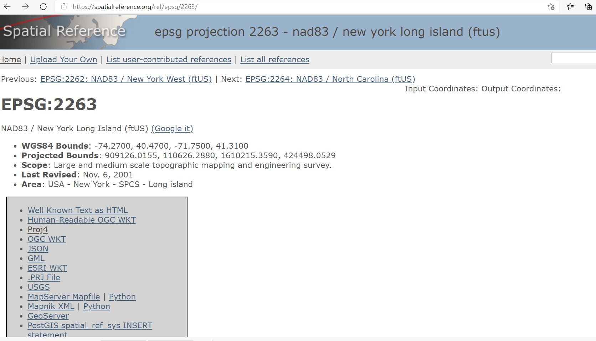

# Mapping hot spots of crime: spatial point patterns and isarithmic maps

## Introduction

A key piece of information we explore in environmental criminology is the "exact" location of crimes, typically in the form of street address in which a crime is recorded as having occurred. A key goal of the analysis of this type of mapped point data is to detect patterns, in particular to detect areas where crime locations appear as clustered and reflecting an increased likelihood of occurrence. 

In chapter 1, we generated some maps with point locations representing crimes in Greater Manchester (UK) and we saw how the large volume of events made it difficult to discern any spatial pattern. In previous chapters we saw how we could deal with this via aggregation of the point data to enumeration areas such census tracts or by virtue of binning. In this chapter we will introduce techniques that are used as an alternative visualisation for point patterns and that are based on the mathematics of density estimation. They are used to produce isarithmic maps, these are the kind of maps you often see in the weather reports displaying temperature. What we are doing is creating an interpolated surface from discrete data points. Or in simpler terms we are "effectively inventing data values for the areas on the map for which you don't have data or sample points" (http://cartonerd.blogspot.com/2015/02/when-is-heat-map-not-heat-map.html).

Before we get to the detail of how we produce these maps we will briefly and very generally introduce the field of spatial point pattern analysis. The analysis of discrete locations are a subfield of spatial statistics. In this chapter we will indeed introduce a new R package called `spatstat`, that was developed for spatial point pattern analysis and modelling. It was written by Adrian Baddeley and Rolf Turner. There is a [webpage](http://spatstat.org) dedicated to this package. The [thickest book](https://www.crcpress.com/Spatial-Point-Patterns-Methodology-and-Applications-with-R/Baddeley-Rubak-Turner/p/book/9781482210200) in our library, at 810 pages, is dedicated to this package. So as you can imagine the theory and practice of spatial pattern analysis is something one could devote an entire volume to. You can get a pdf document used in a course the authors of this package develop [here](https://research.csiro.au/software/wp-content/uploads/sites/6/2015/02/Rspatialcourse_CMIS_PDF-Standard.pdf). In our book we are only going to provide you with an introductory practical entry into this field of techniques. If this package is not installed in your machine, make sure you install it before we carry on. In this chapter we will also be using the package `crimedata` developed by our colleague Matt Ashby, which you would also need to install.

```{r, warnings=FALSE, message=FALSE}
library(readr)
library(sf)
library(tmap)
library(dplyr)
library(spatstat)
library(maptools)
library(crimedata)
library(ggplot2)
library(raster)
library(SpatialKDE)
library(leaflet)
```

## Getting the data: introducing "crimedata"

Dr. Ashby is the lead contributor to the **Crime Open Database (CODE)**, a service that makes it convenient to use crime data from multiple US cities in research on crime. All the data in CODE are available to use for free as long as you acknowledge the source of the data. The package `crimedata` was developed by Dr. Ashby to make it easier to read into R the data from this service.

The key function in `crimedata`  is `get_crime_data()`. We will be using the crime data from New York City police and for 2019, and we want the data to be in `sf` format. We will also filter the data to only include residential burglaries in Brooklyn. Equally we will download the geojson with the borough boundaries from the NYC open data portal. See the code below for details:

```{r, message=FALSE}
## Large dataset, so it will take a while
nyc_burg <- get_crime_data(
  cities = "New York", #specifies the city for which you want the data
  years = 2019,        #reads the appropriate year of data
  type = "extended",   #you can select core fields, extended (a fuller set of                          fields), or sample
  output = "sf"        #Specified whether you want a sf objet with WGS84 or a                          tibble
) %>%
  filter(offense_type == "residential burglary/breaking & entering" &
           nyc_boro_nm == "BROOKLYN")
brooklyn <- st_read("https://services5.arcgis.com/GfwWNkhOj9bNBqoJ/arcgis/rest/services/NYC_Borough_Boundary/FeatureServer/0/query?where=1=1&outFields=*&outSR=4326&f=pgeojson") %>%
  filter(BoroName == "Brooklyn")

```

Now we have all our data cleaned and all our files prepared. Let's see the results!

```{r}

tm_shape(brooklyn) + 
  tm_polygons() +
  tm_shape(nyc_burg) +
  tm_dots()

```

In the point pattern analysis literature each point is often referred to as an **event** and these events can have **marks**, attributes or characteristics that are also encoded in the data. In our spatial object one of these *marks* is the type of crime (although in this case it's of little interest since we have filtered on it). Others in this object include the date and time, the location category, victim sex and race, etc.

## Getting the data into spatstat: the problem with duplicates

So let's start using spatstat.The first thing we need to do is to transform our `sf` object into a `ppp` object which is how `spatstat` likes to store its point patterns. Unfortunately, `spatstat` and many other packages for analysis of spatial data precede `sf`, so the transformation is a bit awkard. 

Also before we do that, it is important to realise that a point pattern is defined as a series of events in a given area, or window, of observation. It is therefore extremely important to precisely define this window. In `spatstat` the function `owin()` is used to set the observation window. However, the standard function takes the coordinates of a rectangle or of a polygon from a matrix, and therefore it may be a bit tricky to use. Luckily the package `maptools` provides a way to transform a `SpatialPolygons` into an object of class `owin`, using the function `as.owin()`. Here are the steps: 

First we transform the CRS of our Brooklyn polygon into projected coordinates  as opposed to geographic coordinates (WGS84), since only projected coordinates may be converted to `spatstats` class objects. As we saw in chapter 2, measuring distance in metres is a bit easier, so since with points a good deal of the analysis we subject them to involve measuring their distance from each other, moving to a projected system makes sense. For NYC the recommended projection is the New York State Plane Long Island Zone (EPSG 2263), that provides a high degree of accuracy and balances size and shape well:

```{r}
brooklyn_proj <- st_transform(brooklyn, 2263)
```

Then we use the `as.owin()` function to define the window. 

```{r}

window <- spatstat.geom::as.owin(sf::st_geometry(brooklyn_proj))
plot(window) # owin similar to polygon

```

We can see this worked and created an `owin` object.

```{r}
class(window)
window

```

Now that we have created the window as an `owin` object let's get the points. In the first place we need to reproject to the same projected coordinate systems we have for our boundary data using the familiar `st_transform()` function from `sf`. Then we will extract the coordinates from our `sf` point data into a matrix using `unlist` from base R, so that the functions from `statspat` can read the coordinates. If you remember `sf` objets have a column called `geometry` that stores these coordinates as a list. By unlisting we are flattening this list, taking the elements out of the list.

```{r}

nyc_burg <- st_transform(nyc_burg, 2263) #we must transform these too to match our window 
sf_nyc_burg_coords <- matrix(unlist(nyc_burg$geometry), ncol = 2, byrow = T)

```

Then we use the `spatstat::ppp` function to create the object using the information from our matrix and the window that we created.

```{r}
bur_ppp <- ppp(x = sf_nyc_burg_coords[,1], y = sf_nyc_burg_coords[,2],
                   window = window, check = T)
plot(bur_ppp)
```

Notice the warning message about duplicates. In spatial point pattern analysis an issue of significance is the presence of duplicates. The statistical methodology used for spatial point pattern processes is based largely on the assumption that processes are *simple*, that is, that the points cannot be coincident. That assumption may be unreasonable in many contexts (for example, the literature on repeat victimisation indeed suggests that we should expect the same households to be at a higher risk of being hit again). Even so the point (no pun intended) is that *"when the data has coincidence points, some statistical procedures will be severely affected. So it is always strongly advisable to check for duplicate points and to decide on a strategy for dealing with them if they are present"* (Baddeley et al., 2016: 60).

We can check the duplication in a `ppp` object with the following syntax, it will return a logical indicating whether we have any duplication:

```{r}
any(duplicated(bur_ppp))
```

To count the number of coincidence points we use the `multiplicity()` function. This will return a vector of integers, with one entry for each observation in our dataset, giving the number of points that are identical to the point in question (including itself).

```{r, eval=FALSE}

multiplicity(bur_ppp)
```

If you suspect many duplicates, it may be better start asking how many there are. For this you can use:

```{r}
sum(multiplicity(bur_ppp) > 1)

```

That's quite something. 1047 points out of 2408 here share coordinates. And we can plot this if we want to see the distribution of duplicates:

```{r}

hist(multiplicity(bur_ppp))

```

In the case of crime, as we have hinted some of this may be linked to the nature of crime itself. Hint: repeat victimisation. We know that between 14% to 33% of all burglaries are repeat offences (@Chainey_2016). Our 43% is quite high by those standards. We are just relying on open data, so it is hard to figure out if these are repeats or whether some of this is to do with data quality or some other feature that artificially may create duplicates records for the same address. In some jurisdictions, like the UK, duplication may artificially result from the anonymisation process that follows from the release of open data in crime ^[This is due to the way in which spatial anonymisation of police.uk data is carried out. This is done using geomasking, whereby there exist a pre-determined list of points that each crime event gets "snapped" to its nearest one. So, the coordinates provided in the open data are not the exact locations of crimes, but they come from a list of points generated for purposes of data publication. You can see the details in their webstie (https://data.police.uk/about/#anonymisation). This process is likely inflating the amount of duplication we may observe, because each snap point might have many crimes near it, resulting in those crimes being geo-coded to the same exact location. So keep in mind when analysing and working with this data set that it is not the same as working with the real locations. If you are interested in the effects of this read the paper @Tompson_2015.]

What to do about duplicates in spatial point pattern analysis is not always clear. You could simply delete the duplicates, but of course that may ignore issues such as repeat victimisation. You could also use jittering, which will add a small perturbation to the duplicate points so that they do not occupy the exact same space. Which again, may ignore things like repeat victimisation. Another alternative is to make each point "unique" and then attach the multiplicites of the points to the patterns as *marks*, as attributes of the points. Then you would need analytical techniques that take into account these marks.

If you were to be doing this for real you would want access to the real thing, not this public version of the data, as well as access to the data producers to check that duplicates are not artificial, and then go for the latter solution suggested above. We don't have access to the source data, so for the sake of simplicity at this point and so that we can illustrate how `spatstat` works we will instead add some jittering to the data. The first argument for the function is the object, `retry` asks whether we want the algorithm to have another go if the jittering places a point outside the window (we want this so that we don't loose points), and the `drop` argument is used to ensure we get a `ppp` object as a result of running this function (which we do).

```{r}
jitter_bur <- rjitter(bur_ppp, retry=TRUE, nsim=1, drop=TRUE)
plot(jitter_bur)
```

And you can check duplicates with the resulting object:

```{r}
sum(multiplicity(jitter_bur) > 1)

```

## Inspecting our data with spatstat

This package supports all kind of exploratory point pattern analysis. One example of this is **quadrant counting**. One could divide the window of observation into quadrants and count the number of points into each of these quadrants. 
For example, if we want four quadrants along the X axis and 3 along the Y axis we could used those parameters in the `quadratcount()` function. Then we just use standard plotting functions from R base.

```{r}
Q <- quadratcount(jitter_bur, nx = 4, ny = 3)
plot(jitter_bur)
plot(Q, add = TRUE, cex = 2)

```

These quadrants do not have the same size, given the irregular shape of Brookly, but even so, it looks as if some quadrants have a larger concentration of incidents. A key concept in spatial point pattern analysis is the idea of  **complete spatial randomness** (or CSR for short). When we look at a point pattern process the first step in the process is to ask whether it has been generated in a random manner. Under CSR, points are independent of each other and have the same propensity to be found at any location. 

We can generate data that conform to complete spatial randomness using the `rpoispp()` function. The `r` at the beginning is used to denote we are simulating data (you will see this is common in R) and we are using a Poisson point process, a good probability distribution for these purposes. Let's generate 223 points in a random manner:

```{r}
plot(rpoispp(223))
```

You will notice that the points in a homogeneous Poisson process are not ‘uniformly spread’: there are empty gaps and clusters of points. This is very important. Random may look like what you may think non random should look. There seems to be places with clustering of points. Keep this in mind when observing maps of crime distributions. Run the previous command a few times. You will see the map generated is different each time.

In classical literature, the *homogeneous Poisson process* (CSR) is usually taken as the appropriate ‘null’ model for a point pattern. Our basic task in analysing a point pattern is to find evidence against CSR. We can run a Chi Square test to check this in our data. So, for example:

```{r}
quadrat.test(jitter_bur, nx = 3, ny = 2)

```

Observing the results we see that the p value is well below conventional standards for rejection of the null hypothesis. Observing our data of burglary in Brooklyn would be extremely rare if the null hypothesis was true. We can then conclude that the burglary data is not randomly distributed in the observed space. But no cop nor criminologist would really question this. They would rarely be surprised by your findings! We do know that crime is not randomly distributed in space. 

## Visualising hot spots of crime: intensity estimates with spatstat

One of the most common methods to visualise hot spots of crime, when we are working with point pattern data, is to use kernel density estimates.  **Kernel density estimation** involves applying a function (known as a “kernel”) to each data point, which averages the location of that point with respect to the location of other data points.  The surface that results from this model allows us to produce **isarithmic maps**.

Kernel density estimation maps are very popular among crime analysts. According to @Chainey_2013a, 9 out of 10 intelligence professionals prefer it to other techniques for hot spot analysis. As compared to visualisations of crime that relies on point maps or thematic maps of geographic administrative units (such as LSOAs), kernel density estimation maps are considered best for location, size, shape and orientation of the hotspot. @Chainey_2008 have also suggested that this method produces some of the best prediction accuracy. The areas identified as hotspots by KDE (using historical data) tend to be the ones that better identify the areas that will have high levels of crime in the future. Yet, producing these maps (as with any map, really) requires you to take a number of decisions that will significantly affect the resulting product and the conveyed message. Like any other data visualisation technique they can be powerful, but they have to be handled with great care.

Essentially this method uses a statistical technique (kernel density estimation) to generate a smooth continuous surface aiming to represent the intensity or volume of crimes across the target area. The technique, in one of its implementations (quartic kernel), is described in this way by @Chainey_2013b:

+ *“a fine grid is generated over the point distribution;*
+ *a moving three-dimensional function of a specified radius visits each cell and calculates weights for each point within the kernel’s radius. Points closer to the centre will receive a higher weight, and therefore contribute more to the cell’s total density value;*
+ *and final grid cell values are calculated by summing the values of all kernel estimates for each location”*


(Reproduced from Eck et al. 2012)

The values that we attribute to the cells in crime mapping will typically refer to the number of crimes within the area’s unit of measurement. 

Let's produce one of this density maps, just with the default arguments of the `density.ppp()` function:

```{r}
ds <- density.ppp(jitter_bur)
class(ds)
plot(ds, main='Burglary density in Brooklyn')
```

The density function is estimating a kernel density estimate. The result of `density.ppp` is not a probability density. It is an estimate of the intensity function of the point process that generated the point pattern. The units of intensity are “points per unit area”. Density, in this context, is nothing but the number of points per unit area. This method computes the intensity continuously across the study area and the object returns a raster image. 

The defaults in `density.ppp()` are not necessarily the optimal ones for your application. When doing spatial density analysis there are a number of things you have to decide upon (eg., bandwidth, kernel type, etc).

To perform this analysis in R we need to define the **bandwidth** of the density estimation, which basically determines the area of influence of the estimation. There is no general rule to determine the correct bandwidth; generally speaking if the bandwidth is too small the estimate is too noisy, while if bandwidth is too high the estimate may miss crucial elements of the point pattern due to oversmoothing. 

The key argument to pass to the density method for point patterm objects is `sigma=`, which determines the bandwidth of the kernel. In  the`spatstat.core` package the functions `bw.diggle()`, `bw.ppl()`, and `bw.scott()` can be used to estimate the bandwidth according to difference methods. The helpfiles recommend the use of the first two. These functions run algorithms that aim to select an appropriate bandwith.

```{r}
bw.diggle(jitter_bur)
bw.ppl(jitter_bur)
bw.scott(jitter_bur)
```

Scott´s rule generally provides larger bandwith than the other methods. Don´t be surprised if your results do not match exactly the ones we provide, the computation means that they will vary every time we run these functions. We can test how they work with our dataset using the following code:

```{r}

par(mfrow=c(2,2))
plot(density.ppp(jitter_bur, sigma = bw.diggle(jitter_bur),edge=T),
     main = paste("Diggle"))

plot(density.ppp(jitter_bur, sigma = bw.ppl(jitter_bur),edge=T),
     main=paste("PPL"))

plot(density.ppp(jitter_bur, sigma = bw.scott(jitter_bur) ,edge=T),
     main=paste("h = Scott"))


```

Baddeley et (2016) suggest the use of the `bw.ppl()` algorithm because in their experience it tends to produce the more appropriate values when the pattern consists predominantly of tight clusters. But they also insist that if your purpose it to detect a single tight cluster in the midst of random noise then the `bw.diggle()` method seems to work best.

Apart from selecting the bandwidth we also need to specify the particular kernel we will use. In density estimation there are different types of kernel (as illustrated below):


Source: wikepedia

You can read more about kernel types in the Wikipedia [entry](https://en.wikipedia.org/wiki/Kernel_(statistics)). This relates to the type of kernel drawn around each point in the process of counting points around each point. The use of these functions will result in slightly different estimations. They relate to the way we weight points within the radius: *“The normal distribution weighs all points in the study area, though near points are weighted more highly than distant points.  The other four techniques use a circumscribed circle around the grid cell.    The uniform distribution weighs all points within the circle equally.  The quartic function weighs near points more than far points, but the fall off is gradual. The triangular function weighs near points more than far points within the circle, but the fall off is more rapid. Finally, the negative exponential weighs near points much more highly than far points within the circle and the decay is very rapid.”* @Levine_2013 (Chapter 10, p. 10).

Which one to use? @Levine_2013 produces the following guidance: *“The use of any of one of these depends on how much the user wants to weigh near points relative to far points.  Using a kernel function which has a big difference in the weights of near versus far points (e.g., the negative exponential or the triangular) tends to produce finer variations within the surface than functions which weight more evenly (e.g., the normal distribution, the quartic, or the uniform); these latter ones tend to smooth the distribution more*. However, Silverman (1986) has argued that it does not make that much difference as long as the kernel is symmetrical. @Chainey_2013b suggests that in his experience most crime mappers prefer the quartic function, since it applies greater weight to crimes closer to the centre of the grid. The authors of the CrimeStat workbook @Smith_2008, on the other hand, suggest that the choice of the kernel should be based in our theoretical understanding of the data generating mechanisms. By this they mean that the processes behind spatial dependence may be different according to various crime patterns and that this is something that we may want to take into account when selecting a particular function. They provide a table with some examples that may help you to understand what they mean:


(Source: Smith and Bruce, 2008.)

The default kernel in `density.ppp()` is the `gaussian`. But there are other options. We can use the `epanechnikov`, `quartic` or `disc`. There are also further options for customisation. We can compare these kernels, whilst using the `ppl` algorithm:

```{r}
par(mfrow=c(2,2))
plot(density.ppp(jitter_bur, sigma = bw.ppl(jitter_bur),edge=T),
     main=paste("Gaussian"))
plot(density.ppp(jitter_bur, kernel = "epanechnikov", sigma = bw.ppl(jitter_bur),edge=T),
     main=paste("Epanechnikov"))
plot(density.ppp(jitter_bur, kernel = "quartic", sigma = bw.ppl(jitter_bur),edge=T),
     main=paste("Quartic"))
plot(density.ppp(jitter_bur, kernel = "disc", sigma = bw.ppl(jitter_bur),edge=T),
     main=paste("Disc"))
```

## Adding some context to our density.ppp objects

Often it is convenient to use a basemap to provide context. In order to do that we first need to turn the image object generated by the `spatstat` package into a raster object, a more generic format for raster image used in R. Remember rasters from the first chapter? Now we finally get to use them a bit! First we store the density estimates produced by `density.ppp()` into an object (which will be of class `im`, a two dimensional pixel image) and then using the `raster::raster()` function we generate a raster object.

```{r, message=FALSE}
dmap1 <- density.ppp(jitter_bur, sigma = bw.ppl(jitter_bur), kernel = "quartic", edge=T)

r1 <- raster(dmap1)
plot(r1)
```

We can remove the areas with very low density of burglaries:

```{r}
#remove very low density values
r1[r1 < 2e-06 ] <- NA

```

Now that we have the raster we can add it to a basemap. 

Two-dimensional `RasterLayer` objects (from the `raster` package) can be turned into images and added to `Leaflet` maps using the `addRasterImage()` function. The `addRasterImage()` function works by projecting the `RasterLayer` object to EPSG:3857 and encoding each cell to an RGBA color, to produce a PNG image. That image is then embedded in the map widget. This is only suitable for small to medium sized rasters.

It’s important that the `RasterLayer` object is tagged with a proper coordinate reference system. Many raster files contain this information, but some do not. Here is how you’d tag a raster layer object “r1” which contains the EPSG:2263 data:

```{r, message=FALSE}

#make sure we have right CRS, which in this case is the New York 2263

epsg2263 <- "+proj=lcc +lat_1=41.03333333333333 +lat_2=40.66666666666666 +lat_0=40.16666666666666 +lon_0=-74 +x_0=300000.0000000001 +y_0=0 +ellps=GRS80 +datum=NAD83 +to_meter=0.3048006096012192 +no_defs" 

crs(r1) <- sp::CRS(epsg2263) #use the CRS function from the sp package to assign coordinate system

```

You may be wondering what is all that gibberish that we are assigning to the "epsg2263" object. Remember when we talked about coordinate systems? There are different ways in which the information that identifies a CRS are stored. Three common formats include EPSG, PROJ4, and WKT formats. What you see above is the PROJ4 format. You can find how these different formats translate in the spatialreference.org online archive.



Now we are ready to plot, although first we will create a more suitable colour palette and, since the values in the scale are quite close to 0 will multiple by a constant, to make the labels more readable. For this we use the `setValues function()` from `raster` package that allows us to manipulate the values in a `raster` object

```{r}

vals <- values(r1)*100000 #read values from r1, multiple by constant, store in vals
r1 <-setValues(r1, vals) #change values in r1 by those we stored in vals

pal <- colorNumeric("Oranges", values(r1),
  na.color = "transparent") #Create color palette

#and then make map!
leaflet() %>% 
  addTiles() %>%
  addRasterImage(r1, colors = pal, opacity = 0.7) %>%
  addLegend(pal = pal, values = values(r1),
    title = "Burglary map")
  
```

And there you have it. Perhaps those familiar with Brooklyn have some guesses as to what may be going on there?

## Density maps using SpatialKDE with ggplot2

One thing it should be obvious to you by now is that there are many different ways of doing something in R. One of the difficulties for learning R is that we are spoiled for choice in terms of how we solve a particular problem. This can be overwhelming at first. As long as a solution works for you, you should not worry too much about the particular tools you use. 

The approach we followed above may be useful when you are exploring an issue, the interactivity that `leaflet` gives you can be quite handy in such context. You can move around, zoom in, zoom out. But say you want to produce a static map for primarily presentation purposes. In this case you may want to optimise some aesthetics aspects of the map design. For those kind of uses we particularly like `ggplot2`´s flexibility for customisation, but that´s just our personal choice. Here we will show you how to tackle the problem of mapping hotspots of burglary in Brooklyn using `ggplot2`. We will also use a different package for estimating the density of burglaries: `SpatialKDE`. This section could not have been written without the inspiration and code provided in Matthew Ashby awesome `crimemapping` tutorials (a highly recommended package, available in GitHub, that uses `learnr` to learn crime mapping with R): we are basically just changing the data but using most of the code he provides in Chapter 11 of his tutorial.

`SpatialKDE` implements kernel density estimation for spatial data with all the required settings, including the selection of bandwidth, kernel type, and cell size. It is based in an algorithm used in QGIS, the best free GIS system relying primarily on a point and click interface. Unlike `spatstat`, `SpatialKDE` can work with `sf` objects. But it also finds it more convenient to have the data on a projected coordinate systems, so that it can compute distances on metres rather than with decimal degrees. If you followed the steps in this chapter, our "nyc_burg" object already is in EPGS:2263, so we don´t need to do it again.

The next step for computing the density is to generate a grid for the area of study. Remember how with `spatstat` we first created a "window". The logic is the same, though there are some subtle differences. In `SpatialKDE` you use the `create_grid_rectangular()` function (there is also a `create_grid_hexagonal()` if you prefer to have the cells in the grid to have an hexagonal shape). This function takes as the first argument a `sf` object containing the geometry which needs to be covered by the grid. You can also provide as an argument the size of the cell.

The size of the cells does not affect the intensity value, only the spatial resolution of the grid. Think of it as pixels, smaller size, more cells, better resolution. At the same time, more cells, more computation is needed (not that this should be a major issue with today´s computer power). @Chainey_2005 suggests that a good starting point is to divide the shorter side of the study area´s **minimum bounding rectangle (MBR)** by 150, as experience suggests this works well. And then, if necessary, produce KDE maps with smaller cell sizes to improve aesthetics. The MBR is simply the smallest rectangle you can draw that includes your area of interest (in this case the borough of Brooklyn). We can obtain such a rectangle with the `spatstat::boundingbox()` function. If we plot this, we will see the shorter side of this rectangle goes from East to West, the X range. The values are inside the generated object, so we can easily substrace them and then divide them by 150.

```{r}
mbr_brooklyn <- boundingbox(window) #create bounding box
plot(mbr_brooklyn) #plot the box
(mbr_brooklyn$xrange[2] - mbr_brooklyn$xrange[1])/150 #compute the size as suggested by Chainey and Rattcliffe (2005)

```
Once we have settled in a value, this or some other, we just input it as an argument to create the grid.

```{r}
burgl_grid_chainey <- nyc_burg %>% 
  create_grid_rectangular(cell_size = 386)

ggplot() + geom_sf(data = burgl_grid_chainey)
```

Notice that the input we are using here is the object with the points (rather than the Brooklyn boundaries). This is what in geography is referred to as the **convex hull**, defined by the Wiki.GIS.com as "the boundary of the minimal convex set containing a given non-empty finite set of points in the plane". As @Ashby_XXXX notes : "This is the smallest shape that contains all the points in the data: if the crimes were represented by pins stuck into a board, the convex hull would be the shape made by an elastic band stretched around the outermost pins. This reduces (but doesn’t eliminate) the problem of calculating spurious density estimates for areas that are not covered by the data."

The next step is to create the density estimates. We do this with `SpatialKDE:kde()`. Here we need to pass as arguments the `sf` dataframe containing the points, the bandwidth, the kernel, and the grid.

```{r}
burglary_kde <- kde(nyc_burg, band_width = bw.ppl(jitter_bur),
                    grid = burgl_grid_chainey)

ggplot() + geom_sf(data = burglary_kde)
```

## Summary and further reading

When reading these maps you need to understand you are only looking at counts of crime in a smooth surface. Nothing more, nothing less. Unlike with choropleth maps we are not normalising the data. We are simply showing the areas where there is more crime, but we are not adjusting for anything (like number of people in the area, or number of houses to burgle). So, it is important you keep this in the back of your mind. As [this comic](https://xkcd.com/1138/) suggests you may end up reading too much into it if you don’t remember this. There are ways to produce density maps adjusting for a second variable, such as population size, but we do not have the time to cover this. 

There are also general considerations to keep in mind. Hot spots of crime are a simply a convenient perceptual construct. As Ned @Levine_2013 (Chapter 7, p. 1) highlights *“Hot spots do not exist in reality, but are areas where there is sufficient clustering of certain activities (in this case, crime) such that they get labeled such. There is not a border around these incidents, but a gradient where people draw an imaginary line to indicate the location at which the hot spot starts.”*  Equally, there is not a unique solution to the identification of hot spots. Different techniques and algorithms will give you different answers. As @Levine_2013 (Chapter 7, p. 7) emphasises: *“It would be very naive to expect that a single technique can reveal the existence of hot spots in a jurisdiction that are unequivocally clear. In most cases, analysts are not sure why there are hot spots in the first place. Until that is solved, it would be unreasonable to expect a mathematical or statistical routine to solve that problem.”* 

So, as with most data analysis exercises one has to try different approaches and use professional judgment to select a particular representation that may work best for a particular use. Equally, we should not reify what we produce and, instead, take the maps as a starting point for trying to understand the underlying patterns that are being revealed. Critically you want to try several different methods. You will be more persuaded a location is a hot spot if several methods for hot spot analysis point to the same location. We will discuss other approaches in subsequent chapters.


### Homework 1
*Ok, so see if you can do something like what we have done today, but for violent crime in the city centre. Produce the density estimates and then plot the density plot. In addition add a layer of points with the licenced premises we looked at last week.*

### Homework 2
*Produce a kernel density estimate for burglary across the whole of the city. Where is burglary more concentrated?*


