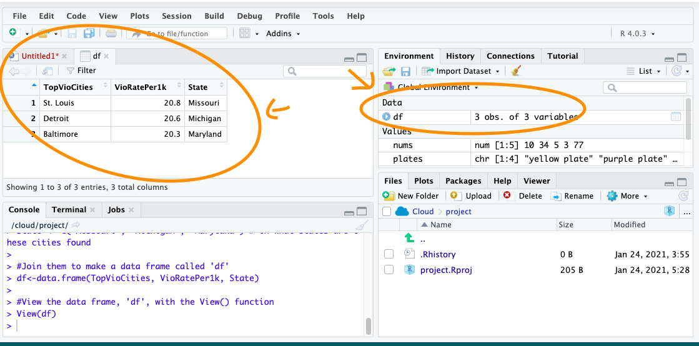

--- 
title: "Crime Mapping and Spatial Data Analysis using R"
author: "Juanjo Medina and Reka Solymosi"
date: "2021-02-03"
site: bookdown::bookdown_site
output: bookdown::gitbook
documentclass: book
bibliography: [book.bib, packages.bib]
biblio-style: apalike
link-citations: yes
github-repo: maczokni/crime_mapping
description: "Crime Mapping and Spatial Data Analysis using R"
always_allow_html: true
---
# Prelude  {-}

## Introduction 


This workbook contains the lab materials and homework assignments for an introduction to crime mapping course designed for LAWS31152 and 60142 Crime Mapping, an optional module open to  3rd year undergraduates on the BA Criminology programme as well as postgraduates on the MA and MRes Criminology programmes at the University of Manchester. 

It makes use of R, as it is a free, open source tool, that has tremendous community support, and great versatility in mapping applications. You can find more details about the advantages of R for geospatial work [here](https://geocompr.robinlovelace.net/intro.html)


Crime Mapping introduces students to the concepts of spatial data analysis. The aim is to familiarise students with basic concepts of GIS, and get acquainted with spatial statistics to be able to talk about data about crime, policing, and criminal justice topics situated in the places they occur. Details can be found in the Syllabus.


## Disclaimer 

Please beware that:


- In making these notes, while we briefly cover some concepts, students are expected to do the weekly reading, and attend the weekly lectures, as well as participate in lab disucssions to receive a complete course experience. These notes are *not* intended to be a stand-alone reference or textbook, rather a set of exercises to gain hands-on practice with the concepts introduced during the course.
- These pages are the content of the university course mentioned above. They are meant to (very gently) introduce students to the concept of spatial data analysis, and cover descriptive statsitics and the key concepts required to build an understanding of quantitative data analysis in crime research. 
- The handouts below use, among other data sets, dara from the UK data service such as the Crime Survey for England and Wales that is available under a Open Government Licence. This dataset is designed to be a learning resource and should not be used for research purposes or the production of summary statistics. 


<!--chapter:end:index.Rmd-->


# A first lesson about R

In this lesson, you will be introduced to the programming language, `R`. After installing the related software and getting a basic idea of the R Studio interface, you will learn three `R` basics: operators, objects, and packages. 

Unlike other statistical software like SPSS and STATA, `R` is a free, open-source software for performing statistical analysis and data visualization. In addition, `R` offers more analytical solutions, flexibility, and customization than these commonly used statistical software, and its popularity has increased substantially over the years. 

We learn `R` because we hope that this is an important tool that you will continue to use in future. As it is free and has a community feel to it where anyone can create and upload new techniques, the idea is that you can use `R` long after this course. Even if data analysis is not in the future for you, learning how to conduct and interpret statistical output is a good skill to have – much of our knowledge of the world includes statistics, so understanding the numbers and how they were derived are advantages. `R` uses a language called **object-oriented programming**, and though it may seem daunting at first, practice makes familiarity. Also, you can impress your friends with all your coding. 


## Install R & R Studio


As `R` and `R Studio` are free software, you should be able to install these on your own machines at home. You may be working with different IT, so there are different options to allow a successful install. Our first activity will be to decide what approach to working with `R` and `R Studio` will be best for you. 


### Activity 1: Identifying your operating system

In this activity, you need to answer a question about your computer/IT that you will be working with for this class. That question is: 

- **What is your operating system**? Operating system refers to the software that your computer is running to deliver the basic functions. You may have, for example: 

  + *Windows or Linux* - if you have these, you are most likely going to have an easy time installing `R` and `R Studio`, so you should give the installation instructions below a try
  + *Apple* - if you have a Mac, there are some extra steps to install `R` and `R Studio`. Specifically, there will be an additional programme to download called Xcode, and additional steps to take.  
  + *Chromebook* - Installing `R` and `R Studio` on a Chromebook involves installing Linux. Like with a Mac, there are some additional steps you will need to take, and some patience.
  
In your group google sheets, write down which operating system you have. This will guide which directions to follow later. 


### Activity 2: Install R & R Studio


#### Some notes specific to your operating system. 

Before you move on to the installation steps, look at your answer from Activity 1, and read or watch the advice specific to your operating system:

- Windows: click [here](https://www.youtube.com/watch?v=VLWaED9jTiA) for instructions 
- Chromebook: read the tutorial [here](https://blog.sellorm.com/2018/12/20/installing-r-and-rstudio-on-a-chromebook/)
- Mac, follow the guidance in the video [here](https://www.youtube.com/watch?v=cX532N_XLIs&list=PLqzoL9-eJTNDw71zWePXyHx3_cm_fMP8S) and then, you will also need to install command line tools, for that you can watch another video [here](https://www.youtube.com/watch?v=3Yd9J_dhSfY) 
- Linux: for ubuntu see the video [here](https://www.youtube.com/watch?v=kF0-FH-xBiE) and if you have questions, let the teaching team know!


Once you have watched or read the instructions for your relevant operating system, you are now ready to actually have a go at downloading the software for yourself. Before you start, write in the google doc any questions or concerns, and once ready, install! 


#### Install `R`: {-}

1. Go to [https://www.r-project.org/](https://www.r-project.org/) 

2. Click the [download R](https://cran.r-project.org/mirrors.html) link under the *Getting Started* heading 

3. You will be asked to select a Comprehensive R Archive Network (CRAN) mirror. Click the URL closest to your location

4. Click whichever download link is appropriate for your operating system (see above).

5. Then click the *install R for the first-time* link and proceed to install `R`


#### Install R Studio: {-}

1. Go to [https://rstudio.com/](https://rstudio.com/)

2. Click the *Download* link

3. Scroll down and then click the DOWNLOAD button for the free version of
`RStudio`

4. You will be taken to a website to download the free version of `RStudio` that is appropriate for your computer. Download and then install it.


#### Plan B: accessing R Studio remotely throught a web browser

It might be that the above does not work and you find that there are some issues specific to your computer, or something just is not working. In that case, you have two options: 


- *Option 1:* You can remotely access one of the university PCs from your browser (Firefox, Chrome, Safari, etc). You can find instructions how to do this [here](https://www.itservices.manchester.ac.uk/students/pc-on-campus/remote-cluster-access/) , and the university IT helpdesk can help you access this too. If you do this, you will be able to use the version of `RStudio` installed in the computer clusters. 

- *Option 2*: You can access an online version of `R Studio`, which you can access through any web browser (Firefox, Chrome, Safari, etc). To do this, you visit [https://rstudio.cloud/](https://rstudio.cloud/), click on 'get started for free', choose the free account, and click on 'sign up'. Then you can always visit this website and log in to use `R Studio` in the cloud. Note that you should start a `New Project` and name it *Modelling Crime Data*, and then all your work will be saved in this project. 


## Open up and explore RStudio

In this session we will focus in developing basic familiarity with R Studio. You can use R without using R Studio, but R Studio is an app that makes it easier to work with R. 

R Studio is what we call an IDE, an **integrated development environment**. It is a fancy way of saying that it is a cool interface designed to write programming code. Every time you open up R Studio you are in fact starting a R session. R Studio automatically runs R in the background. We will be interacting with R in this course unit via R Studio.

 

When you first open R Studio, you will see (as in the image above) that there are 3 main windows. The bigger one to your left is the console. If you read the text in the console you will see that R Studio is indeed opening R and you can see what version of R you are running. Depending on whether you are using the cluster machines or your own installation this may vary, but don't worry too much about it. R is constantly being updated.

#### Activity 3: Opening up the script pane

The view in R Studio is structured so that you have 4 open windows in a regular session. However when you first open, you might be starting with only 3. To open the script pane (the one missing) click in the *File* drop down Menu, select *New File*, then *R Script*.


You will now see the 4 window areas in display. On each of these areas you can shift between different views and panels. You can also use your mouse to re-size the different windows if that is convenient.


### The four panes of R Studio

The purposes of the four panes in Figure above are the following:

1. **Script and data view**: where you type your programming code that tells `R` what you want to do. These are essentially instructions that you type and save as a **script**, so that you can return to it later to remember what you did and to share it with others so that they can reproduce what you did.


2. **Environment and history view**: 
  i) *2.1 Environment* tab- gives you the names of all the (data) objects that you have defined during your current `R` session, including number of observations and rows in those objects. We learn more about objects later. 

  ii) *2.2 History* tab- shows you a history of all the code you have previously evaluated in the main console.


3. **Main console**: this is considered `R's` heart, and it is where `R` evaluates the codes that you run. You can type your codes directly in the console, but for the sake of good habits, type them in the script and data view so you can save a record of them. Only type and run code from here if you want to debug or do some quick analysis.


4. **File directory, Plots, Packages, Help**:
  i) *4.1 Files* tab-  allows you to see the files in the folder that is currently set as your working directory. 

  ii) *4.2 Plots* tab- you will see any data visualizations that you produce here. You have not produced any yet, so it is empty now.

  iii) *4.3 Packages* tab- you will see the packages that are currently available to install. We will explain what these are soon, but know that they are an essential feature when working with `R`.

  iv) *4.4 Help* tab- you can access further information on the various packages. 


  
#### Activity 4: Interacting with the 4 panes

In the previous activity, you opened up the 'script' pane. We now write some code in it, and see what happens. 

To do this, go to your open version of `R Studio`, and type in the script pane the following: 


```r
print("Hello world!")
```


When you have typed this, you will have typed your first bit of code. Yet nothing is happening? That is because you also have to **RUN** the code. 

You can do this by highlighting the code you wish to run, and clicking on 'run' in the top right hand corner: 


When you 'run' the code, it will print the text 'Hello World!' in the bottom pane, which is the **console**. That means you have written and executed your first line of code.

In the rest of the session, we will be unpacking how this all works, and getting more familiar and comfortable with using `R Studio`. 

To recap: the **script** is where you write your programming code. A script is nothing but a text file with some code on it. Unlike other programs for data analysis you may have used in the past (Excel, SPSS), you need to interact with R by means of writing down instructions and asking R to evaluate those instructions. R is an *interpreted* programming language: you write instructions (code) that the R engine has to interpret in order to do something. And all the instructions we write can and should be saved in a script, so that you can return later to what you did.

One of the key advantages of doing spatial data analysis this way - with code versus with a point and click interface like ArcGIS or MapInfo (or even QGIS) is that you are producing a written record of every step you take in the analysis. First time around it will take you time to write these instructions, it may be slower than pointing and clicking. And unlike with pointing and clicking you need to know the "words" and "grammar" of this language. 

The advantage of doing analysis this way is that once you have written your instructions and saved them in a file, you will be able to share it with others and run it every time you want in a matter of seconds. This creates a *reproducible* record of your analysis: something that your collaborators or someone else anywhere (including your future self, the one that will have forgotten how to do the stuff) could run and get the same results than you did at some point earlier. This makes science more transparent and transparency brings with it many advantages. For example, it makes your research more trustworthy. Don't underestimate how critical this is. **Reproducibility** is becoming a key criteria to assess good quality research. The University of Manchester [just joined the UK Reproducibility Network](https://www.staffnet.manchester.ac.uk/news/display/?id=25496), and is promoting this good practice. If you're interested you can join [the Open Science working group](https://research-it.manchester.ac.uk/news/2019/05/30/uom-open-science-working-group/) or the reading club [ReproducibiliTea](https://reproducibilitea.org/journal-clubs/#Manchester). You can read up on reproducibility and its importance [here](http://theconversation.com/the-science-reproducibility-crisis-and-what-can-be-done-about-it-74198) or get Stuart Richie's book [Science Fictions](https://www.goodreads.com/book/show/52199285-science-fictions) for an engaging further read.


## Customising the RStudio look

R Studio allows you to customise the way it looks. Working with white backgrounds is not generally a good idea if you care about your eyesight. If you don't want to end up with dry eyes not only it is good you follow the 20-20-20 rule (every 20 minutes look for 20 seconds to an object located 20 feet away from you), but it may also be a good idea to use more eye friendly screen displays. 

Click in the *Tools* menu and select *Global options*. This will open up a pop up window with various options. Select *Appearance*. In this section you can change the font type and size, but also the kind of theme background that R will use in the various windows. 


You can make any changes you'd like to here, including the theme background that `R` will use as the interface.

For example, you may choose a darker theme like 'tomorrow night bright'.


## Functions and Objects

### Functions

**Functions**  *do* things. They are called by a certain name, usually a name which represents what they do, and they are followed by brackets `()`. Within the brackets, you can put whatever it is that you want the function to work with. For example, the code we wrote in Activity 4 was the `print()` function. This function told `R` to print into the console whatever we put in the brackets ("Hello World!"). 

Same idea with a personalised greeting: if you want to print 'Hello Reka', you will need to have "Hello Reka" inside the brackets:


```r
print("Hello Reka")
```

```
## [1] "Hello Reka"
```


There are so many functions in `R`. We will be learning many of them throughout our class. `Print` is fun, but most of the time, we will be using functions to help us with our data analysis. For example, getting the minimum, maximum, or mean of a list of numbers. `R` does this using functions in a very similar way. 

For example, if we have a bunch of numbers, we just find the appropriate function to get the summary we want: 


```r
mean(10, 34, 5, 3, 77)
```

```
## [1] 10
```

```r
min(10, 34, 5, 3, 77)
```

```
## [1] 3
```

```r
max(10, 34, 5, 3, 77)
```

```
## [1] 77
```


How can you find the function you need? Throughout this class, you will learn a list that appears at the top of each lesson. A recommendation is to also create a 'function cookbook', where you write down a list of functions, what the functions do, and some examples. Here is an example: 


You can use google to make your cookbook, and the website [stackoverflow](https://stackoverflow.com/), in particular, can help you find the function you need. But be wary, especially in the beginning, that you understand what the function does. There can be several different functions for the same action. One good approach is to add a function of interest to your cookbook and ask the teaching team about what it does, and how it might be different to other functions that do the same thing.


#### Activity 5: Play around with functions

Have a guess (or google) about what you think is the function to get the median. Once you have your answer, write it in the shared google docs. Then, use it to get the median of the numbers 10, 34, 5, 3, 77. 

Write the answer in your shared google doc (or note it down for yourself if in the quiet room).

The answer is further below, after the note: 


**NOTE:** `R` is case-sensitive! For example:


```r
# Calculating the logarithm 
Log(100)

# ERROR!
```


```r
# Instead, it should be:
log(100)
```

```
## [1] 4.60517
```


 Okay, now you know these, the answer to Activity 6 was...
 
 
 

```r
median(10, 34, 5, 3, 77)
```

```
## [1] 10
```


 
Now let us move on to our second key topic: objects! 


### Objects 


Everything that exists in `R` is an **object**. Think of objects as boxes where you put things in. Imagine a big, empty cardboard box. We can create this big empty box in R by simply giving it a name. Usually, you want your object/box to have a good descriptive name, which will tell people what is in it. Imagine moving house. If you have a cardboard box full of places, you might want to label it "plates". That way, when carrying, you know to be careful, and when unpacking, you know its contents will go in the kitchen. On the other hand, if you named it "box1", then this is a lot less helpful when it comes to unpacking. 


#### Activity 6: Creating an object

Let us create an object called 'plates'. To do this, you go to your script, and type 'plates'. 


But if you run this code, you will get an error. Let's see: 


You see the error 'Error! Object plates not found'. This is because you have not yet put anything inside the plates 'box'. Remember objects are like boxes,so there must be something inside our object 'plates'. In order for this object to exist, you have to put something inside it, or in `R`-speak *assign it some value*.

Therefore, we make an object by using an *assignment operator* ( `<-` ). In other words, we assign something to an object (i.e., put something in the box). For example:


```r
plates <- "yellow plate"
```


Now if we run this, we will see no error message, but instead, we will see the `plates` object appear in our *environment pane*: 


Here are some more examples to illustrate: 


```r
# Putting '10' in the 'a' box
a <- 10

# Putting 'Hello!' in the 'abc123' box
abc123 <- "Hello!"
```


In these examples, we are putting the value of `10` into the object `a`, and the value of 'Hello!' into the object `abc123`. 

Earlier, we introduced you to the Environment and History pane. We mentioned that it lists objects you defined. After making the 'a' and 'abc123' objects, they should appear in that very pane under the `Environment` tab. 


#### Types of objects


Why are objects important? We will be storing everything in our data analysis process in these objects. Depending on what is inside them, they can become a different type of object. Here are some examples: 

**Data structures** are important objects that store your data, and there are five main types but we focus on three for this course:

1. *(atomic) vector*: an ordered set of elements that are of the same *class*. Vectors are a basic data structure in `R`. Below are five different classes of vectors:


```r
# 1. numeric vector with three elements
my_1st_vector <- c(0.5, 8.9, 0.6) 

# 2. integer vector with addition of L at the end of the value
my_2nd_vector <- c(1L, 2L, 3L)  

# 3. logical vector
my_3rd_vector <- c(TRUE, FALSE, FALSE) 
# 'my_4th_vector' creates a logical vector using abbreviations of True and False, but you should use the full words instead
my_4th_vector <- c(T, F) 

# 4. character vector
my_5th_vector <- c("a", "b", "c") 

# 5. complex vector (we will not use this for our class)
my_6th_vector <- c(1+0i, 2+4i) 
```


2. *lists*: technically they, too, are vectors but they are more complex because they are not restricted on the length, structure, or class of the included elements. For example, to create a list containing strings, numbers, vectors and a logical, use the `list()` function, and inside the brackets, put everything tat you want to combine into a list:


```r
list_data <- list("teal", "sky blue", c(10, 5, 10), TRUE, 68.26, 95.46, 99.7) 
```


Above, we created `list_data`, an object that contains all those things that we put inside the `list()` function. This function serves to create a list from combining everything that is put inside its brackets. 

Use the `class()` function to confirm that the objects have been defined as a list


```r
class(list_data)
```

```
## [1] "list"
```


3. *data frames*: also stores elements but differ from lists because they are defined by their number of columns and rows; the vectors (columns) must be of the same length. Data frames can contain different classes but each column must be of the same class. For example, if you want to combine some related vectors to make a data frame on violent American cities, use the function `data.frame()`:


```r
# Making some relevant vectors
TopVioCities <- c("St. Louis", "Detroit", "Baltimore") # some violent US cities
VioRatePer1k = c(20.8, 20.6, 20.3) # their violence rates per 1,000 persons
State <- c("Missouri", "Michigan", "Maryland") # in what states are these cities found

#Join them to make a data frame called 'df'
df<-data.frame(TopVioCities, VioRatePer1k, State)
```


We can then view the data frame, 'df', with the `View()` function:


```r
View(df)
```


#### Activity 7: Doing things to objects

We have learned what functions are (i.e., things that do things) and what are objects (i.e., the boxes that hold things). We also saw some functions which helped us create objects. Functions can also do things to objects. For example, we saw the function `class()` that told us about what kind of object list_data was, and `View()` which allowed us to have a look at our dataframe we called `df`.

Let us look back at our `plates` object. Remember it was the object that held our kitchen items. We added 'yellow plate' to it. Now let us add some more items and let us use the concatenate `c()` function for this again: 


```r
plates <- c("yellow plate", "purple plate", "silver plate", "orange bowl")
```


Let us say that we suddenly forgot what was in our object called 'plates'. Like what we learned earlier, we use the function `print()` to see what is inside this object:


```r
print(plates)
```

```
## [1] "yellow plate" "purple plate" "silver plate" "orange bowl"
```


This can apply to obtaining the mean, the minimum, and maximum. You could assign those statistics to an object this time:


```r
nums <- c(10, 34, 5, 3, 77)
```


Now if we want to know the mean, we can take the mean of the object `nums`, which we just created:


```r
mean(nums)
```

```
## [1] 25.8
```


The object we will use most frequently though is data frames. These hold your data in a format whereby each column represents a variable, and each row an observation. 

Just earlier, we had created a dataframe called `df` previously. If you have not yet copied this over into your own `R Studio`, do this now. You should have the object `df` in your environment. When you run `View(df)`, you should see this dataset:



To do something to an entire dataframe, we would use the name of the object (`df`) to refer to it. In the case of the `View()` function, we want to see the whole thing, so we will call `View(df)`. On the other hand, if we want to refer to only one variable in the data, (remember back to term 1 - each varible is held in each column) there is a special notation to do this. 

To refer to a variable (column) inside a dataframe, you use:


$dataframe name + \$ + variable name$


For example, to refer to the variable `VioRatePer1k`, we use the notation `df$VioRatePer1k`. 

And if we wanted to View only that column, we use: 


```r
View(df$VioRatePer1k)
```

You should see: 


Say we wanted to know the mean violence rate across our units of analysis, the cities, for example, we would take the numeric column to calculate this: 


```r
mean(df$VioRatePer1k)
```

```
## [1] 20.56667
```


## Packages 


**Packages** are a very important element of `R`. 


Packages are elements that add the functionality of R. What most packages do is they introduce new functions that allow you to ask R to do new different things. Anybody can write a package, so consequently R packages vary on quality and complexity. You can find packages in different places, as well, from official repositories (which means they have passed a minimum of quality control), something called Git Hub (a webpage where software developers post work in progress), to personal webpages (danger danger!). 


Throughout the course, and hopefully afterwards, you will find yourself installing numerous open source software packages that allow `R` to do new and different things. There are loads of packages out there. In early 2020, there were over 150,000 packages available. Anyone can write one, so you will need to be careful on which ones you use as the quality can vary. Official repositories, like [CRAN](https://cran.r-project.org/), are your best bet for packages as they will have passed some quality controls. 

You can see what packages are available in your local install by looking at the *packages* tab in the *File directory, Plots, Packages* pane. 


{width=35%}


A number of the packages we will use belong to a set of packages called **tidyverse**. These packages help make your data tidy. According to Statistician and Chief Scientist at `RStudio`, Hadley Wickham, transforming your data into *tidy data* is one of the most important steps of the data analysis process. It will ensure your data are in the format you need to conduct your analyses. We will also be using the simple features package **sf** and many more associated with spatial data analysis. 

Packages can be installed using the `install.packages()` function. Remember that while you only need to install packages once, they need to be loaded with the `library()`function each time you open up `RStudio`. Let us install the package `dplyr` from `tidyverse` and load it:


```r
library(dplyr)
```

```
## 
## Attaching package: 'dplyr'
```

```
## The following objects are masked from 'package:stats':
## 
##     filter, lag
```

```
## The following objects are masked from 'package:base':
## 
##     intersect, setdiff, setequal, union
```


A lot of code and activity appears in the console. Warnings may manifest. Most of the time, the warnings explain what is being loaded and confirm that the package is successfully loaded. If there is an error, you will have to figure out what the warnings are telling you to successfully load the package. This happens and is normal.

To double check that you have actually installed `dplyr`, go to that *File Directory, Plots, Packages* pane and click on the *Packages* tab. The list of packages is in alphabetical order and `dplyr` should be there. If there is a tick in its box, it means that this package is currently loaded and you can use it; if there is no tick, it means that it is inactive, and you will have to bring it up with `library()`, or just tick its box (Figure 1.6). 


{width=35%}


 
On *masking*:  sometimes packages introduce functions that have the same name as those that are already loaded into your session. When that happens, the newly loaded ones will override the previous ones. You can still use them but you will have to refer to them explicitly by bringing them up by specifying to which package they belong with `library()`.


How do you find out what a package does? You look at the relevant documentation. In the Packages window scroll down until you find the new package we installed listed. Here you will see the name of the package (dplyr), a brief description of what the program is about, and the version you have installed (an indication that a package is a good package is that it has gone through several versions, that means that someone is making sure the package gets regular updates and improvements). 

Click in the name *dplyr*. You will see that R Studio has now brought you to the Help tab. Here is where you find the help files for this package, including all the available documentation.

Every beginner in R will find these help files a bit confusing. But after a while, their format and structure will begin to make sense to you. Click where it says *User guides, package vignettes, and other documentation*. Documentation in R has become much better since people started to write **vignettes** for their packages. They are little tutorials that explain with examples what each package does. Click in the *cowsay::cowsay_tutorial* that you see listed here (the html link). What you will find there is an html file that gives you a detailed tutorial on this package. You don't need to read it now, but remember that this is one way to find help when using R. You will learn to love vignettes.


## Exploring data

Now that we know the basic component, let's play around with using R as we will throughout the course, for some data analysis. 

We will get some data by installing a package which has data in it as well as functions, and then go on to produce some basic summaries. This should give some practice!

### Activity 8: Playing around with data


We are going to look at some data that are part of the *fivethirtyeight* package. This package contains data sets and code behind the stories in [this particular online newspaper](http://fivethirtyeight.com/). This package is not part of the base installation of R, so you will need to install it first. I won't give you the code for it. See if you can figure it out by looking at previous examples. Discuss and write in the google doc what you think the code will be. 


Done? Ok, now we are going to look at the data sets that are included in this package. Remember first we have to load the package if we want to use it:


```r
library("fivethirtyeight")
```

```
## Some larger datasets need to be installed separately, like senators and
## house_district_forecast. To install these, we recommend you install the
## fivethirtyeightdata package by running:
## install.packages('fivethirtyeightdata', repos =
## 'https://fivethirtyeightdata.github.io/drat/', type = 'source')
```

```r
data(package="fivethirtyeight") #This function will return all the data frames that are available in the named package.
```

Notice that this package has some data sets that relate to stories covered in this journal that had a criminological angle. Let's look for example at the hate_crimes data set. How do you that? First we have to load the data frame into our global environment. To do so use the following code:


```r
data("hate_crimes")
```

This function will search among all the *loaded* packages and locate the hate_crimes data set. Notice that it now appears in the global environment, although it also says "promise" next to it. To see the data in full you need to do something to it first. So let's do that.

Every object in R can have **attributes**. These are: names; dimensions (for matrices and arrays: number of rows and columns) and dimensions names; class of object (numeric, character, etc.); length (for a vector this will be the number of elements in the vector); and other user-defined. You can access the attributes of an object using the `attributes()` function. Let's query R for the attributes of this data frame.


```r
attributes(hate_crimes)
```

```
## $row.names
##  [1]  1  2  3  4  5  6  7  8  9 10 11 12 13 14 15 16 17 18 19 20 21 22 23 24 25
## [26] 26 27 28 29 30 31 32 33 34 35 36 37 38 39 40 41 42 43 44 45 46 47 48 49 50
## [51] 51
## 
## $class
## [1] "tbl_df"     "tbl"        "data.frame"
## 
## $names
##  [1] "state"                       "state_abbrev"               
##  [3] "median_house_inc"            "share_unemp_seas"           
##  [5] "share_pop_metro"             "share_pop_hs"               
##  [7] "share_non_citizen"           "share_white_poverty"        
##  [9] "gini_index"                  "share_non_white"            
## [11] "share_vote_trump"            "hate_crimes_per_100k_splc"  
## [13] "avg_hatecrimes_per_100k_fbi"
```

This prints out the row names (not very exciting here..) the class (see above when we used `class()` function) and the names, which are the column headers - or the *names of the variables within this data set*. You can see there are things like state, and share who voted trump (in the 2016 election, not most recent!). 

Now use the `View()` function to glance at your data frame. What you get there is a spreadsheet with 12 variables and 51 observations. Each variable in this case is providing you with information (demographics, voting patterns, and hate crime) about each of the US states.  


Ok, let's now have a quick look at the data. There are so many different ways of producing summary stats for data stored in R that is impossible to cover them all! We will just introduce a few functions that you may find useful for summarising data. Before we do any of that it is important you get a sense for what is available in this data set. Go to the help tab and in the search box input the name of the data frame, this will take you to the documentation for this data frame. Here you can see a list of the available variables.


Let's start with the *mean*. This function takes as an argument the numeric variable for which you want to obtain the mean. You have done this above, so it should be familiar now! If you want to obtain the mean of the variable that gives us the proportion of people that voted for Donald Trump you can use the following expression:


```r
mean(hate_crimes$share_vote_trump)
```

```
## [1] 0.49
```

Another function you may want to use with numeric variables is `summary()`:


```r
summary(hate_crimes$share_vote_trump)
```

```
##    Min. 1st Qu.  Median    Mean 3rd Qu.    Max. 
##   0.040   0.415   0.490   0.490   0.575   0.700
```

This gives you the five number summary (minimum, first quartile, median, third quartile, and maximum, plus the mean and the count of missing values if there are any). 

You don't have to specify a variable you can ask for these summaries from the whole data frame:


```r
summary(hate_crimes)
```

```
##     state           state_abbrev       median_house_inc share_unemp_seas 
##  Length:51          Length:51          Min.   :35521    Min.   :0.02800  
##  Class :character   Class :character   1st Qu.:48657    1st Qu.:0.04200  
##  Mode  :character   Mode  :character   Median :54916    Median :0.05100  
##                                        Mean   :55224    Mean   :0.04957  
##                                        3rd Qu.:60719    3rd Qu.:0.05750  
##                                        Max.   :76165    Max.   :0.07300  
##                                                                          
##  share_pop_metro   share_pop_hs    share_non_citizen share_white_poverty
##  Min.   :0.3100   Min.   :0.7990   Min.   :0.01000   Min.   :0.04000    
##  1st Qu.:0.6300   1st Qu.:0.8405   1st Qu.:0.03000   1st Qu.:0.07500    
##  Median :0.7900   Median :0.8740   Median :0.04500   Median :0.09000    
##  Mean   :0.7502   Mean   :0.8691   Mean   :0.05458   Mean   :0.09176    
##  3rd Qu.:0.8950   3rd Qu.:0.8980   3rd Qu.:0.08000   3rd Qu.:0.10000    
##  Max.   :1.0000   Max.   :0.9180   Max.   :0.13000   Max.   :0.17000    
##                                    NA's   :3                            
##    gini_index     share_non_white  share_vote_trump hate_crimes_per_100k_splc
##  Min.   :0.4190   Min.   :0.0600   Min.   :0.040    Min.   :0.06745          
##  1st Qu.:0.4400   1st Qu.:0.1950   1st Qu.:0.415    1st Qu.:0.14271          
##  Median :0.4540   Median :0.2800   Median :0.490    Median :0.22620          
##  Mean   :0.4538   Mean   :0.3157   Mean   :0.490    Mean   :0.30409          
##  3rd Qu.:0.4665   3rd Qu.:0.4200   3rd Qu.:0.575    3rd Qu.:0.35694          
##  Max.   :0.5320   Max.   :0.8100   Max.   :0.700    Max.   :1.52230          
##                                                     NA's   :4                
##  avg_hatecrimes_per_100k_fbi
##  Min.   : 0.2669            
##  1st Qu.: 1.2931            
##  Median : 1.9871            
##  Mean   : 2.3676            
##  3rd Qu.: 3.1843            
##  Max.   :10.9535            
##  NA's   :1
```


There are multiple ways of getting results in R. Particularly for basic and intermediate-level statistical analysis many core functions and packages can give you the answer that you are looking for. For example, there are a variety of packages that allow you to look at summary statistics using functions defined within those packages. You will need to install these packages before you can use them. 

I am only going to introduce one of them here *skimr*. It is neat and is maintained by one of my former stats teachers, the criminologist Elin Waring. You will need to install it before anything else. Use the code you have learnt to do so and then load it. I won't be providing you the code for it, by now you should now how to do this.


Once you have loaded the *skimr* package you can use it. Its main function is *skim*. Like *summary* for data frames, skim presents results for all the columns and the statistics will depend on the class of the variable. 


```r
skim(hate_crimes)
```


Hopefully in your statistical modules you had taken previously, you have learned some things about how to graphically display variables. So you may have some memory about the amount of work involved with this. Hopefully R will offer some respite. Of course, there are many different ways of producing graphics in R. In this course we rely on a package called *ggplot2*, which is part of the tidyverse set of packages mentioned earlier. 


```r
library(ggplot2)
```

Then we will use one of its functions to create a scatterplot. 


```r
ggplot(hate_crimes, aes(x=share_vote_trump, y=avg_hatecrimes_per_100k_fbi)) +
    geom_point(shape=1) +
     geom_smooth(method=lm)
```

```
## `geom_smooth()` using formula 'y ~ x'
```

```
## Warning: Removed 1 rows containing non-finite values (stat_smooth).
```

```
## Warning: Removed 1 rows containing missing values (geom_point).
```


What do you think this graphic is telling you? Discuss and write in your shared google docs. 


Graphing is very powerful in R, and much of the spatial visualisation we will produce throughout the module will build on this. If you are not already familiar with this, I recommend a read of the data visualisation chapter of R for Data Science [https://r4ds.had.co.nz/data-visualisation.html](https://r4ds.had.co.nz/data-visualisation.html)


## Getting organised: R Projects

One thing that can help you tremendously throughout this module is keeping your code organised.R Studio helps with this by virtue of something called **R Projects**.

Technically, a R Studio project is just a directory with the name of the project, and a few files and folders created by R Studio for internal purposes. This is where you should hold your scripts, your data, and reports. You can manage this folder with your own operating system manager (discussed earlier, e.g., Windows) or through the R Studio file manager (that you access in the bottom right corner set of windows in R Studio).

When a project is reopened, R Studio opens every file and data view that was open when the project was closed last time around. Trust me, this is a really helpful thing! If you create a project for this module, you can keep everything in once place, and refer back to your old code and your learnings throughout the module. 


#### Activity 9: Saving your work and projects

First things first, hopefully you have already created a separate folder on your desktop, or dropbox, or something like this. Now save the script you've been working on into this folder. By clicking on "File" and "Save as...".


Then navigate to your folder for this module, and for your script make sure to give it some meaningful name like week1lab.R or something like this. Then click 'save'.


Now, go back to "File" and select "New project..."


Then in the options that appear choose "Existing Directory". This is because you already have a folder for this work, this is where you saved your script just before. For me this was my folder called 'crime_mapping' you saw above.


So select 'Existing Directory', and on the next page use the "Browse" button to select this folder (the directory) where you saved the script earlier. Once you have done this, click on 'Create Project' on the bottom.


This will now open up a new R Studio window with your project. In the future, you can start right back up where you finished last time by navigating to the .Rproj file, and double clicking it. It helps you keep everything in one place, and lets R read everything from that folder.


With simple projects a single script file and a data file is all you may have. But with more complex projects, things can rapidly become messy. So you may want to create subdirectories within this project folder. I typically use the following structure in my own work to put all files of a certain type in the same subdirectory:

+ *Scripts and code*: Here I put all the text files with my analytic code, including rmarkdown files which is something we will introduce much later in the semester.

+ *Source data*: Here I put the original data. I tend not to touch this once I have obtained the original data.

+ *Documentation*: This is the subdirectory where I place all the data documentation (e.g., codebooks, questionnaires, etc.)

+ *Modified data*: All analysis involve doing transformations and changing things in the original data files. You don't want to mess up the original data files, so what you should do is create new data files as soon as you start changing your source data. I go so far as to place them in a different subdirectory.

+ *Literature*: Analysis is all about answering research questions. There is always a literature about these questions. I place the relevant literature for the analytic project I am conducting in this subdirectory.

+ *Reports and write up*: Here is where I file all the reports and data visualisations that are associated with my analysis.

If you come to my office, you will see it is a very messy place. But my computer is, in contrast, a very tidy environment. You should aim for your computer workspace to be very organised as well. 


You can read up here on why projects are useful here: [https://www.r-bloggers.com/2020/01/rstudio-projects-and-working-directories-a-beginners-guide/](https://www.r-bloggers.com/2020/01/rstudio-projects-and-working-directories-a-beginners-guide/)


<!--chapter:end:01-intro.Rmd-->

---
always_allow_html: true
---


# Making your first maps in R

This week we will start making some maps in R, and learn about how we can take regular crime data, and assign the appropriate geometry for our chosen unit of analysis. We will produce some maps, using possibly familiar ggplot notation, and learn some key terms around projectsion and coordinate reference systems which will be essential for your work in the coming weeks. 


Today we will use the following packages, so make sure you have them downloaded: 


- `reader`
- `tibble`
- `janitor`
- `sf`
- `ggplot2`
- `ggspatial`
- `dplyr`


## A quick introduction of terms

### Geospatial Perspective - The Basics

Geospatial analysis provides a distinct perspective on the world, a unique lens through which to examine events, patterns, and processes that operate on or near the surface of our planet. Ultimately geospatial analysis concerns what happens where, and makes use of geographic information that links features and phenomena on the Earth's surface to their locations. 

We can talk about a few different concepts when it comes to spatial information. These are: 

- Place
- Attributes
- Objects


#### Place

At the center of all spatial analysis is the concept of *place*. People identify with places of various sizes and shapes, from the room with the parcel of land, to the neighbourhood, to the city, the country, the state or the nation state. Places often have names, and people use these to talk about and distinguish names. Names can be official. Places also change continually as people move. The basis of rigorous and precise definition of place is a coordinate system, a set of measurements that allows place to be specified unambiguously and in a way that is meaningful to everyone. 

#### Attributes

Attribute has become the preferred term for any recorded characteristic or property of a place. A place's name is an obvious example of an attribute. But there can be other pieces of information, such as number of crimes in a neighbourhood, or the GDP of a country. Within GIS the term 'attributes' usually refers to records in a data table associated with individual elements in a vector map or cells in a grid (raster or image file). These data behave exactly as data you have encountered in your data analysis courses. The rows represent observations, and the columns represent variables. The variables can be numeric or categorical, and depending on what they are, you can apply different methods to making sense of them. The difference with other kind of data table is that the observations, your rows, correspond to places or locations.

#### Objects

In spatial analysis it is customary to refer to places as objects. These objects can be a whole country, or a road. In forestry, the objects of interest might be trees, and their location will be represented as points. On the other hand, studies of social or economic patterns may need to consider the two-dimensional extent of places, which will therefore be represented as areas. These representations of the world are part of what is called the vector data model: A representation of the world using points, lines, and polygons. Vector models are useful for storing data that have discrete boundaries, such as country borders, land parcels, and streets. This is made up of points, lines, and areas (polygons): 

- Points
    + Points are pairs of coordinates, in latitude/longitude or some other standard system
- Lines
    + Lines are ordered sequences of points connected by straight lines
- Areas (polygons)
    + Areas are ordered rings of points, also connected by straight lines to form polygons. It can contain holes, or be linked with separate islands. 
    


Objects can also be Raster data. Raster data is made up of pixels (or cells), and each pixel has an associated value. Simplifying slightly, a digital photograph is an example of a raster dataset where each pixel value corresponds to a particular colour. In GIS, the pixel values may represent elevation above sea level, or chemical concentrations, or rainfall etc. The key point is that all of this data is represented as a grid of (usually square) cells. 

#### Maps

Historically maps have been the primary means to store and communicate spatial data. Objects and their attributes can be readily depicted, and the human eye can quickly discern patterns and anomalies in a well-designed map. 


#### Map projections

Map projections try to portray the surface of the earth or a portion of the earth on a flat piece of paper or computer screen. A coordinate reference system (CRS) then defines, with the help of coordinates, how the two-dimensional, projected map in your GIS is related to real places on the earth. The decision as to which map projection and coordinate reference system to use, depends on the regional extent of the area you want to work in, on the analysis you want to do and often on the availability of data. 

A traditional method of representing the earth’s shape is the use of globes. When viewed at close range the earth appears to be relatively flat. However when viewed from space, we can see that the earth is relatively spherical. Maps, are representations of reality. They are designed to not only represent features, but also their shape and spatial arrangement. Each map projection has advantages and disadvantages. The best projection for a map depends on the scale of the map, and on the purposes for which it will be used. For your purposes, you just need to understand that essentially there are different ways to flatten out the earth, in order to get it into a 2-dimensional map. 

The process of creating map projections can be visualised by positioning a light source inside a transparent globe on which opaque earth features are placed. Then project the feature outlines onto a two-dimensional flat piece of paper. Different ways of projecting can be produced by surrounding the globe in a cylindrical fashion, as a cone, or even as a flat surface. Each of these methods produces what is called a map projection family. Therefore, there is a family of planar projections, a family of cylindrical projections, and another called conical projections [see figure_projection_families](http://docs.qgis.org/2.8/en/_images/projection_families.png)


With the help of **coordinate reference systems** (CRS) every place on the earth can be specified by a set of three numbers, called coordinates. In general CRS can be divided into **projected coordinate reference systems** (also called Cartesian or rectangular coordinate reference systems) and **geographic coordinate reference systems**.

The use of Geographic Coordinate Reference Systems is very common. They use degrees of latitude and longitude and sometimes also a height value to describe a location on the earth’s surface. The most popular is called **WGS 84**. This is the one you will most likely be using, and if you get your data in latitude and longitude, then this is the CRS you are working in. It is also possible that you will be using a projected CRS. This two-dimensional coordinate reference system is commonly defined by two axes. At right angles to each other, they form a so called XY-plane. The horizontal axis is normally labelled X, and the vertical axis is normally labelled Y. 

Working with data in the UK, on the other hand, you are most likely to be using **British National Grid (BNG)**. The Ordnance Survey National Grid reference system is a system of geographic grid references used in Great Britain, different from using Latitude and Longitude. In this case, points will be defined by "Easting" and "Northing" rather than "Longitude" and "Latitude".  It basically divides the UK into a series of squares, and uses references to these to locate something. The most common usage is the six figure grid reference, employing three digits in each coordinate to determine a 100 m square. For example, the grid reference of the 100 m square containing the summit of Ben Nevis is NN 166 712. Grid references may also be quoted as a pair of numbers: eastings then northings in meters, measured from the southwest corner of the SV square. For example, the grid reference for Sullom Voe oil terminal in the Shetland Islands may be given as HU396753 or 439668,1175316


This will be important later on when we are linking data from different projections, or when you look at your map and you try to figure out why it might look "squished". 

#### Networks

We already mentioned lines that constitute objects of spatial data, such as streets, roads, railroads, etc. Networks constitute one-dimensional structures embedded in two or three dimensions. Discrete point objects may be distributed on the network, representing phenomena such as landmarks, or observation points. Mathematically, a network forms a graph, and many techniques developed for graphs have application to networks. These include various ways of measuring a network's connectivity, or of finding the shortest path between pairs of points on a network. You can have a look at the [lesson on network analysis in the QGIS documentation](https://docs.qgis.org/2.18/en/docs/training_manual/vector_analysis/network_analysis.html)

#### Density estimation

One of the more useful concepts in spatial analysis is density - the density of humans in a crowded city, or the density of retail stores in a shopping centre. Mathematically, the density of some kind of object is calculated by counting the number of such objects in an area, and dividing by the size of the area. To read more about this, I recommend [Silverman, Bernard W. Density estimation for statistics and data analysis. Vol. 26. CRC press, 1986.](https://books.google.co.uk/books?id=e-xsrjsL7WkC&dq=silverman+density+estimation+for+statistics&lr=&source=gbs_navlinks_s)

### Summary

Right so hopefully this gives you a few things to think about. Be sure that you are confident to know about: 

 - Spatial objects - what they are and how they are represented
 - Attributes - the bits of information that belong to your spatial objects
 - Maps and projections - especially what WSG84 and BNG mean, and why it's important that you know what CRS your data have
 
## Getting some spatial data to put on a map

Alright let's get some practical experience where we take some crime data, and find out how we can put it on the map!

### Find some relevant data to show: obtaining data on crime

For your first crime map, we better get some real world crime data. This can be done for the UK easily, as anonymised open crime data are released for the public to use. We can play around with police recorded crime data, which can be downloaded from the [police.uk](https://data.police.uk/data/) website. 

Let's download some data for crime in Manchester.

### Activity 1: Get some crime data

To do acquire the data, open the [data.police.uk/data](https://data.police.uk/data/) website. Choose the data tab, in order to download some data. 

- In `Date range` just select one month of data. Choose whatever month you like EXCEPT nothing more recent than June 2019. Unfortunately, for GMP there is no more recent data available than that. This is because they are having some serious IT issues [see this article](https://www.manchestereveningnews.co.uk/news/greater-manchester-news/gmp-finally-switches-new-27m-16632975) which apparently have disrupted this flow of data.
- In `Force` find `Greater Manchester Police`, and tick the box next to it. 
- In `Data sets` tick `Include crime data`.
- Finally click on `Generate File` button.

This will take you to a download page, where you have to click the `Download now` button. This will open a dialogue to save a .zip file. Navigate to the project directory folder you've created and save it there, ideally in a subfolder. I call my subfolder 'data'. 


Unzip the file. You can use the unzip function for this. A cool function you may want to use as well is file.choose(). If we pass this function as an argument to unzip(), we will get a pop window where we will be able to select our file using familiar point and click. Ideally, you want to rather write down the path to your file. But sometimes these shortcuts are convenient.


```r
unzip(file.choose())
```

If you look at the *Files* window in the bottom right corner of RStudio you should see now a new subdirectory that contains a .csv file with the data that we need. Since I downloaded the data from June 2019 in my case this subdirectory is called 2019-06.

Before we can use this data we need to read it or import it into R and turn it into a dataframe object. To read in the .csv file, which is the format we just downloaded, the command is `read_csv()` from the `readr` package. You'll need to load this package first. 


```r
library(readr)
```

Again there are two ways to read in the data, if you want to open a window where you can manually navigate and open the file, you can pass `file.choose()` argument to the `read_csv()` function as illustrated earlier. 


```r
#This code creates a dataframe object called crimes which will include the spreadsheet in the file we have downloaded. In my case, that is 2007-11-greater-manchester-street.csv.

crimes <- read_csv(file.choose())
```

Or, if you know the path to your file, you can code it in there, within quotation marks:


```r
crimes <- read_csv("data/2019-06-greater-manchester-street.csv")
```

```
## 
## ── Column specification ────────────────────────────────────────────────────────
## cols(
##   `Crime ID` = col_character(),
##   Month = col_character(),
##   `Reported by` = col_character(),
##   `Falls within` = col_character(),
##   Longitude = col_double(),
##   Latitude = col_double(),
##   Location = col_character(),
##   `LSOA code` = col_character(),
##   `LSOA name` = col_character(),
##   `Crime type` = col_character(),
##   `Last outcome category` = col_character(),
##   Context = col_logical()
## )
```


You might notice that the object `crimes` has appeared in your work environment window. It will tell you how many observations (rows - and incidentally the number of recorded crimes in June 2019 within the GMP jurisdiction) and how many variables (columns) your data has.

Let's have a look at the crimes dataframe with the `View()` function. This will open the data browser in RStudio


```r
View(crimes)
```

If you rather just want your results in the console, you can use the glimpse() function from the tibble package. This function does just that, it gives you a quick glimpse of the first few cases in the dataframe. Notice that there are two columns (Longitude and Latitude) that provide the require geographical coordinates that we need to plot this data.


```r
library(tibble)
glimpse(crimes)
```

```
## Rows: 32,058
## Columns: 12
## $ `Crime ID`              <chr> NA, "aa1cc4cb0c436f463635890bcb4ff2cba08f5992…
## $ Month                   <chr> "2019-06", "2019-06", "2019-06", "2019-06", "…
## $ `Reported by`           <chr> "Greater Manchester Police", "Greater Manches…
## $ `Falls within`          <chr> "Greater Manchester Police", "Greater Manches…
## $ Longitude               <dbl> -2.464422, -2.441166, -2.444807, -2.444807, -…
## $ Latitude                <dbl> 53.61250, 53.61604, 53.61151, 53.61151, 53.60…
## $ Location                <chr> "On or near Parking Area", "On or near Pitcom…
## $ `LSOA code`             <chr> "E01004768", "E01004768", "E01004768", "E0100…
## $ `LSOA name`             <chr> "Bolton 001A", "Bolton 001A", "Bolton 001A", …
## $ `Crime type`            <chr> "Anti-social behaviour", "Violence and sexual…
## $ `Last outcome category` <chr> NA, "Unable to prosecute suspect", "Unable to…
## $ Context                 <lgl> NA, NA, NA, NA, NA, NA, NA, NA, NA, NA, NA, N…
```
You may notice that a lot of the variable names are messy in that they have a space in them - this can cause issues, so before playing around too much with the data we want to clean this up. 

Luckily there is a very handy package you can use for this called `janitor` which contains the function `clean_names()`. 


```r
library(janitor)
```

```
## 
## Attaching package: 'janitor'
```

```
## The following objects are masked from 'package:stats':
## 
##     chisq.test, fisher.test
```

```r
crimes <- clean_names(crimes)
```

Now the names are much neater. You can print them all for a view using the `names()` function: 


```r
names(crimes)
```

```
##  [1] "crime_id"              "month"                 "reported_by"          
##  [4] "falls_within"          "longitude"             "latitude"             
##  [7] "location"              "lsoa_code"             "lsoa_name"            
## [10] "crime_type"            "last_outcome_category" "context"
```


## From dataframes to spatial objects: finding spatial information in our data

Having had a chance to inspect the data set you've downloaded, let's consider what sort of spatial information we might be able to use. 


### Activity 2: Find the spatial data


If you have a look at the column names, what are some of the variables which you think might have some spatial component? Have a think about each column, and how you think it may help to put these crimes on the map. Discuss in your groups, and add the answer to the shared google doc. Once you are done, read on. 


So what did you decide in your discussion? There are a few answers here. 

In fact there are one each to map onto point, line, and polygon, which we read about earlier. 


### The point

First, and possibly most obvious, are the coordinates provided with each crime incident recorded. You can find this in the two columns - Longitude and Latitude. These two column help put each crime incident on a specific point on a map. For example, let's take the very first crime incident. Here we use the head() function and specify that we want the first 1 rows only with `n=1` parameter. 


```r
head(crimes, n = 1)
```

```
## # A tibble: 1 x 12
##   crime_id month reported_by falls_within longitude latitude location lsoa_code
##   <chr>    <chr> <chr>       <chr>            <dbl>    <dbl> <chr>    <chr>    
## 1 <NA>     2019… Greater Ma… Greater Man…     -2.46     53.6 On or n… E01004768
## # … with 4 more variables: lsoa_name <chr>, crime_type <chr>,
## #   last_outcome_category <chr>, context <lgl>
```

You can see that the values are  for Longitude and  for Latitude. These two numbers allow us to put this point on a map. 

### The line

Another column which contains information about *where* the crime happened is the aptly named `location` variable. This shows you a list of locations related to where the crimes happened. You may see a few values such as on or near XYZ street. Let's look again at the first entry.


```r
head(crimes, n = 1)
```

```
## # A tibble: 1 x 12
##   crime_id month reported_by falls_within longitude latitude location lsoa_code
##   <chr>    <chr> <chr>       <chr>            <dbl>    <dbl> <chr>    <chr>    
## 1 <NA>     2019… Greater Ma… Greater Man…     -2.46     53.6 On or n… E01004768
## # … with 4 more variables: lsoa_name <chr>, crime_type <chr>,
## #   last_outcome_category <chr>, context <lgl>
```

You can see that the value is  this isn't great, as we might struggle to identify *which* parking area... Some other ones are more useful, let's look at the last entry for example with the `tail()` function.


```r
tail(crimes, n = 1)
```

```
## # A tibble: 1 x 12
##   crime_id month reported_by falls_within longitude latitude location lsoa_code
##   <chr>    <chr> <chr>       <chr>            <dbl>    <dbl> <chr>    <chr>    
## 1 75e215f… 2019… Greater Ma… Greater Man…     -2.57     53.5 On or n… E01006347
## # … with 4 more variables: lsoa_name <chr>, crime_type <chr>,
## #   last_outcome_category <chr>, context <lgl>
```
You can see that the value is . This makes our crime much easier to find, we just need to locate where is . We might have a shapefile of lines of all the roads of Manchester, and if we did, we can link the crime to that particular road, in order to map it. 

### The polygon 

What more? You may also have seen the column `lsao_name` seems to have some spatial component, Let's have a look at the first crime again. 


```r
head(crimes, n = 1)
```

```
## # A tibble: 1 x 12
##   crime_id month reported_by falls_within longitude latitude location lsoa_code
##   <chr>    <chr> <chr>       <chr>            <dbl>    <dbl> <chr>    <chr>    
## 1 <NA>     2019… Greater Ma… Greater Man…     -2.46     53.6 On or n… E01004768
## # … with 4 more variables: lsoa_name <chr>, crime_type <chr>,
## #   last_outcome_category <chr>, context <lgl>
```


You see the value for LSOA name is  - Bolton we know is a Borough of Greater Manchester, but what is the 001 for ?


Well it denotes a sparticular geographical sub-unit within Bolton called a **Lower Layer Super Output Area**. This is a unit of [UK Census Geography](https://www.ons.gov.uk/methodology/geography/ukgeographies/censusgeography). The basic unit for Census Geography is an 'Outout area' - this is the resolution at which we can access data from the UK Census. We will be making use of census data later in the course. The Ourput Area (OA) is therefore the smallest unit we could use. Normally, in this module, we will be using a slightly larger version - the Lower Super Output Area (LSOA). 


There are now 181,408 OAs, 34,753 lower layer super output areas (LSOA) and 7,201 middle layer super output areas (MSOA) in England and Wales. The neat thing about these Census geographies is the idea is that they don't change (unlike administrative boundaries such as wards) and were created with statistical analysis in mind. The less neat thing is that although we use them to operationalise the concept of neighbourhood a lot, they may not bear much resemblance to what residesnts might think of as their neighbourhood. Think for a minute - do you know what LSOA you live in? Most likely you answered no. If you answered yes, I am impressed and you get geography nerd cred. Well done. 


Anyway back to our crime data. You see we have two columns that reference LSOAs, `lsoa_name` and `lsoa_code`. We can use these to *link* our crime data to a *shapefile* of a *polygon* which contains the geometries needed to put the crime data on the map. 


## Putting crime on the map - simple features


So how can we use these spatial details to put our crimes on the map? We need to somehow specify a geometry for our data, which links each unit of analysis (whether that is the point, line, or polygon) to a relevant geographical representation, which allows us to put this thing on the map. 


How you add geographical information will vary with the type of information we have, but in all of these, we will use the simple features framework. 


What are simple features? sf package author Edzer Pebesma describes simple features as a standardized way of encoding spatial vector data (points, lines, polygons) in computers. The sf package is an R package for reading, writing, handling, and manipulating simple features in R, implementing the vector (points, lines, polygons) data handling functionality. 

Traditionally spatial analysis in R were done using the `sp` package which creates a particular way of storing spatial objects in R. When most packages for spatial data analysis in R and for thematic cartography were first developed `sp` was the only way to work with spatial data in R. There are more than 450 packages rely on `sp`, making it an important part of the R ecosystem. More recently a new package, `sf` (which stands for "simple features"), is revolutionising the way that R does spatial analysis. This new package provides a new way of storing spatial objects in R and most recent R packages for spatial analysis and cartography are using it as the new default. It is easy to transform `sf` objects into `sp` objects, so that those packages that still don't use this new format can be used. But in this course we will emphasise the use of `sf` whenever possible. You can read more about the history of spatial packages and the `sf` package in the first two chapters of [this book](https://geocompr.robinlovelace.net).


Features can be thought of as “things” or objects that have a spatial location or extent; they may be physical objects like a building, or social conventions like a political state. Feature geometry refers to the spatial properties (location or extent) of a feature, and can be described by a point, a point set, a linestring, a set of linestrings, a polygon, a set of polygons, or a combination of these. The simple adjective of simple features refers to the property that linestrings and polygons are built from points connected by straight line segments. Features typically also have other properties (temporal properties, color, name, measured quantity), which are called feature attributes. 

For more detailed insight I recommend reading the paper [Simple Features for R: Standardized Support for Spatial Vector Data](https://journal.r-project.org/archive/2018/RJ-2018-009/RJ-2018-009.pdf)


### Mapping points with sf


Let's get started with making some maps using `sf`. First, make sure you install the package, and then load with `library()` function. 


**On Mac and Linux a few requirements must be met to install sf. These are described in the package’s README at [github.com/r-spatial/sf](github.com/r-spatial/sf).**


```r
library(sf)
```

```
## Linking to GEOS 3.8.1, GDAL 3.1.4, PROJ 6.3.1
```


Now we can use the functions of sf in order to introduce geometries. Let's start with the points


#### Activity 3: Creating a sf object of points

WE know that we have two columns one for Longitude and one for Latitude, which pinpoint each crime event to a specific point, close to where it happened. Not *quite* where it happened, as the data are anonymised (more on this later), but for our purposes here, we can assume this is the location of the crime. 


To map these points, we can transform our ordinary dataframe into a simple features object. 


To do so, we can use the `st_as_sf()` function, into which we need to specify what we are to transform (our dataframe), where the spatial data can be found (our columns which hold the latitude and longidude information), and also what coordinate reference system the object has (see above our discussion about projections and coordinate reference systems).

Latitude longitude coordinates specify location on the **WGS 84** CRS (remember I said to keep this one in mind!). We can tell R that this is our CRS of choice by including it's [EPSG identifier]
(https://en.wikipedia.org/wiki/EPSG_Geodetic_Parameter_Dataset) as a parameter in our function. It is handy to know the more common EPSG identifiers. For example, for WGS84 the EPSG identifier is *4326*. For British National Grid, the identifier is *27700*. We will be making use of these numbers, so do note them down somewhere. 


Putting it all together in practice, we can create a simple features object from our dataframe using the latitude and longitude columns: 


```r
crimes_sf <- st_as_sf(crimes,                                     #dataframe
                      coords = c("longitude", "latitude"),        #columns with coordinates
                      crs = 4326)                                 #crs is WGS84
```


We can see that this is now a simple features object using the class() function the we see the result "sf":


```r
class(crimes_sf)
```

```
## [1] "sf"         "tbl_df"     "tbl"        "data.frame"
```


You might also notice something else that is different between crimes and crimes_sf. Have a look at the dimension (hint look in your 'Environment' tab). Do you see? Discuss what you think is different, and write your answers in the shared google doc. 


#### Activity 4: Mapping our points


Now that we have this sf object, how can we map it? I mentioned before about the graphical package `ggplot2`. We can use this, and its syntax, in order to map spatial data using the `geom_sf()` geometry. 

First, a quick refresher on ggplot and the grammar of graphics. The grammar of graphics upon which this package is based on defines various components of a graphic. Some of the most important are:

-**The data**: For using `ggplot2` the data has to be stored as a data frame or tibble.

-**The geoms**: They describe the objects that represent the data (e.g., points, lines, polygons, etc..). This is what gets drawn. And you can have various different types layered over each other in the same visualisation.

-**The aesthetics**: They describe the visual characteristics that represent data (e.g., position, size, colour, shape, transparency).

-**Facets**: They describe how data is split into subsets and displayed as multiple small graphs.

-**Stats**: They describe statistical transformations that typically summarise data.

Let's take it one step at the time.

Essentially the philosophy behind this is that all graphics are made up of layers. The package `ggplot2` is based on the grammar of graphics, the idea that you can build every graph from the same few components: a data set, a set of geoms—visual marks that represent data points, and a coordinate system.

Take this example (all taken from *Wickham, H. (2010). A layered grammar of graphics. Journal of Computational and Graphical Statistics, 19(1), 3-28.*)

You have a table such as: 


You then want to plot this. To do so, you want to create a plot that combines the following layers: 


This will result in a final plot: 


Taking our crime data as an example, we would build up our plot as follows: 

Load ggplot2 package


```r
library(ggplot2)
```


Data: 

```r
ggplot(crimes, aes(x = crime_type))
```


Geometry: 


```r
ggplot(crimes, aes(x = crime_type)) + 
  geom_bar()
```


Aesthetics:


```r
ggplot(crimes, aes(x = crime_type, fill = last_outcome_category)) + 
  geom_bar()
```


And then you could add any facets (for example if we had more than one month of data) or any statistics (for example error bars) with facet and stats layers. One more thing I do want to show is tidying up your chart, you can add theme and clean up your labels and titles and colour scheme. 


```r
ggplot(crimes, aes(x = crime_type, fill = last_outcome_category)) + 
  geom_bar() + 
  coord_flip() + 
  theme_minimal() + 
  xlab("Crime Type") + 
  ylab("Number of cases") + 
  scale_fill_brewer(type = "qual", palette = 3, name = "Outcome")
```


This is not the greatest graph you'll ever see, but it illustrates the process. Do read up on ggplot2 for example in Hadley Wickham's book R4DS [chapter on data visualisation](https://r4ds.had.co.nz/data-visualisation.html). 


So how can we use this for spatial data? We can use the `geom_sf()` function to do so. 

#### Activity 5: Mapping our points

Using geom_sf is slightly different to other geometries, for example how we used `geom_bar()` above. First we initiate the plot with the `ggplot()` function but don't include the data in there. Instead, it is in the geometry where we add the data. And second we don't need to specify the mapping of x and y. Since this is in the geometry column of our spatial object. Like so:


```r
ggplot() + 
  geom_sf(data = crimes_sf)
```


And here we have a map of each point in our data set, each recorded crime in June 2019 in Greater Manchester. 


Would you call this a map though? While it is presenting spatial data, there is not a lot of meaning being communicated. Point maps generally can be messy and their uses are specific to certain situations and cases, usually when you have fewer points, but here, these points are especially devoid of any meaning, as they are floating in a graph grid. SO let's give it a basemap. 

We can do this by adding a layer to our graph object. Specifically we will use the `annotation_map_tile()` from the `ggspatial` package. This provides us with a static Open Street Map layer behind our data, giving it (some) more context. 

Remember to load the package (and install if you haven't already)


```r
library(ggspatial)
```


And then use the `annotation_map_tile()` function, making sure to place it before the geom_sf points layer, so the background map is placed first, and the points on top of that:  


```r
ggplot() + 
 annotation_map_tile() +
  geom_sf(data = crimes_sf)
```

```
## Zoom: 9
```


So what you see above is what we can call a **basemap**. The term basemap is seen often in GIS and refers to a collection of GIS data and/or orthorectified imagery that form the background setting for a map. The function of the basemap is to provide background detail necessary to orient the location of the map. Basemaps also add to the aesthetic appeal of a map. 

In the lecture and some readings these are described as *reference maps*. We often may want to use these reference maps as **basemaps** for our thematic and point maps. They may give us context and help with the interpretation. You can see above that you are seeing the *Open Street Map* Basemap. This is one option but there are others.

Anyway let's leave out points for now, and move on to how we might map our lines and polygons. 

### Mapping data by joining it to sf objects

What about our other two columnds, location, and LSOAs? Well to put these on the map, we need a geometry representation of them. We will learn in this section where you may find these, how to download them, turn them into sf objects, and how to link your data to them to be able to map them. 

#### Activity 6: Finding shapefiles

In this section you are going to learn how you take one of the most popular data formats for spatial objects, the  **shapefile**, and read it into R. The shapefile was developed by ESRI, the developers and vendors or ArcGIS. And although many other formats have developed since and ESRI no longer holds the same market position it once occupied (though they're still the player to beat), shapefiles continue to be one of the most popular formats you will encounter in your work. You can read more about shapefiles [here](https://en.wikipedia.org/wiki/Shapefile).

We are going to learn here how to obtain shapefiles for British census geographies. In the class today we talked about the idea of neighborhouds and we explained how a good deal of sociological and criminological work traditionally used census geographies as proxies for neighbourhouds. As of today, they still are the geographical subdivisions for which we can obtain a greater number of attribute information (e.g., sociodemographics, etc.).

For this activity we will focus on the polygon (the LSOA) rather than the lines of the streets, but the logic is more or less the same. Remember above we talked about what is a census geography. You can read more about census boundary data [here](https://census.ukdataservice.ac.uk/use-data/guides/boundary-data). "Boundary data are a digitised representation of the underlying geography of the census". Census Geography is often used in research and spatial analysis because it is divided into units based on population counts, created to form comparable units, rather than other administrative boundaries such as wards or police force areas. However depending on your research question and the context for your analysis, you might be using different units. The hierarchy of the census geographies goes from Country to Local Authority to Middle Layer Super Output Area (MSOA) to Lower Layer Super Output Area (LSOA) to Output Area: 


Here we will get some boundaries for Manchester. Let's use the LSOA level, so that we can link back to our crime data earily. These are geographical regions designed to be more stable over time and consistent in size than existing administrative and political boundaries. LSOAs comprise, on average, 600 households that are combined on the basis of spatial proximity and homogeneity of dwelling type and tenure. 

So to get some boundary data, you can use the UK Data Service website. There is a simple [Boundary Data Selector](https://borders.ukdataservice.ac.uk/bds.html) tool which we can use.

When you get to the link, you will see on the top there is some notification to help you with the boundary data selector. If in the future you are looking for boundary data and you are feeling unsure at any point, feel free to click on that note "**How to use Boundary Data Selector**" which will help to guide you. 

For now, let's focus on the selector options. Here you can choose the country you want to select shapefiles for. We select "England". You can also choose the type of geography we want to use. Here we select "Statistical Building Block", as discussed above. And finally you can select when you want it for. If you are working with historical data, it makes sense to find boundaries that match the timescale for your data. Here we will be dealing with contemporary data, and therefore we want to be able to use the newest available boundary data. 

***

 

Once you have selected these options, click on the "Find" button. That will populate the box below: 

***


***

Here you can select the boundaries we want. As discussed, we want the census lower super output areas. But again, your future choices here will depend on what data you want to be mapping. 

Once you've made your choice, click on "List Areas". This will now populate the box below. We are here concerned with Manchester. However you can select more than one if you want boundaries for more than one area as well. Just hold down "ctrl" to select multiple areas individually, or the shift key to select everything in between. 

***

 

***

Once you've made your decision click on the "Extract Boundary Data" button. You will see the following message: 

***


***

You can bookmark, or just stay on the page and wait. How long you have to wait will depend on how much data you have requested to download. 

When your data is read, you will see the following message: 


***


  


***


You have to right click on the "BoundaryData.zip", and hit Save Target as on a PC or Save Link As on a Mac: 


***


 


***

Navigate to the folder you have created for this analysis, and save the .zip file there. Extract the file contents using whatever you like to use to unzip compressed files. 


```r
#For example,
unzip("BoundaryData.zip", exdir="BoundaryData")
```

You should end up with a folder called "BoundaryData". Have a look at its contents: 


***


***


So you can see immediately that there are some documentations around the usage of this shapefile, in the readme and the terms and conditions. Have a look at these as they will contain information about how you can use this map. For example, all your maps will have to mention where you got all the data from. So since you got this boundary data from the UKDS, you will have to note the following: 

"Contains National Statistics data © Crown copyright and database right [year]
    Contains OS data © Crown copyright [and database right] (year)"

You can read more about this in the terms and conditions document. 

But then you will also notice that there are 4 files with the same name "england_oac_2011". **It is important that you keep all these files in the same location as each other!** They all contain different bits of information about your shapefile (and they are all needed): 

- .shp — shape format; the feature geometry itself - this is what you see on the map
- .shx — shape index format; a positional index of the feature geometry to allow seeking forwards and backwards quickly
- .dbf — attribute format; columnar attributes for each shape, in dBase IV format. 
- .prj — projection format; the coordinate system and projection information, a plain text file describing the projection using well-known text format

Sometimes there might be more files associated with your shapefile as well, but we will not cover them here. So unlike when you work with spreadsheets and data in tabular form, which typically is just all included in one file; when you work with spatial data, you have to live with the required information living in separate files that need to be stored together. So, being tidy and organised is even more important when you carry out projects that involve spatial data. Please do remember the suggestions we provided last week as to how to organise your RStudio project directories.

#### Activity 7: Reading shapefiles into R


<!-- ### **HOMEWORK 2** -->

<!-- Read Section 2.1 of the Geocomputation book linked above. Answer the following questions: -->
<!-- 1. What are some strengths/advantages of the sf package? -->
<!-- 2. What code do you need to transform a sf object into a sp object. -->
<!-- 3  What is simply a sf object? -->
 


To read in your data, you will need to know the path to where you have saved it. Ideally this will be in your data folder in your project directory. 

Let's create an object and assign it our shapefile's name:


```r
#Remember to use the appropriate pathfile in your case
shp_name <- "data/BoundaryData/england_lsoa_2011.shp"
```


Make sure that this is saved in your working directory, and you have set your working directory. 

Now use the `st_read()` function to read in the shapefile: 


```r
manchester_lsoa <- st_read(shp_name)
```

```
## Reading layer `england_lsoa_2011' from data source `/Users/reka/Desktop/crime_mapping/data/BoundaryData/england_lsoa_2011.shp' using driver `ESRI Shapefile'
## Simple feature collection with 282 features and 3 fields
## geometry type:  POLYGON
## dimension:      XY
## bbox:           xmin: 378833.2 ymin: 382620.6 xmax: 390350.2 ymax: 405357.1
## projected CRS:  OSGB 1936 / British National Grid
```

Now you have your spatial data file. You can have a look at what sort of data it contains, the same way you would view a dataframe, with the `View()` function: 


```r
View(manchester_lsoa)
```


```
## Rows: 282
## Columns: 4
## $ label    <chr> "E08000003E02001062E01005066", "E08000003E02001092E01005073"…
## $ name     <chr> "Manchester 018E", "Manchester 048C", "Manchester 018A", "Ma…
## $ code     <chr> "E01005066", "E01005073", "E01005061", "E01005062", "E010050…
## $ geometry <POLYGON [m]> POLYGON ((384850 397432, 38..., POLYGON ((382221.1 3…
```

And of course, since it's spatial data, you can map it using the geom_sf() function, as we did with our points:  


```r
ggplot() + 
  geom_sf(data = manchester_lsoa)
```


Great, we now have an outline of the LSOAs in Manchester. Notice how the shape is different to that of the points in our crime data. Why do you think this is? Discuss and write your thoughts in the shared google doc. 


#### Activity 8: Data wrangling with dplyr


In order to map crimes to LSOAs we might want to take a step back and think about unit of analysis at which our data are collected. In our original dataframe of crimes, we saw that each crime incident is one row. So the unit of anlysis is each crime. Since we were looking to map each crime at the location it happened, we used the latitude and longitude supplied with each one, and this supplied a geometry each for each crime type. 


However, when we are looking to map our data to LSOA level, we need to match the crime data to the geometry we wish to display. 


Have a look at the manchester_lsoa object we mapped above. How many rows (observations) does it have? You can check this by looking in the Environment pane, or by using the `nrow()` function. 


```r
nrow(manchester_lsoa)
```

```
## [1] 282
```

You can see this has 282 rows. This means we have geometries for  282 LSOAs. 


On the other hand, our crimes dataframe has 32058 rows, one for each crime (observation). So how can we match these up? The answer lies in thinking about what it is that our map using LSOAs as our unit of analysis will be able to tell us. Think of other maps of areas - what are they usually telling you? Usually we expect to see crimes per neighbourhood - something like this. So our unit of analysis needs to be LSOA, and for each one we need to know how many crimes occurred in that area. 


To achieve this, we will wrangle our data using functions from the `dplyr` package. This is a package for conducting all sorts of operations with data frames. We are not going to cover the full functionality of dplyr (which you can consult in [this tutorial](https://cran.r-project.org/web/packages/dplyr/vignettes/dplyr.html)), but we are going to cover three different very useful elements of dplyr: the select function, the group_by function, and the piping operator.

First load the library:


```r
library(dplyr)
```

```
## 
## Attaching package: 'dplyr'
```

```
## The following objects are masked from 'package:stats':
## 
##     filter, lag
```

```
## The following objects are masked from 'package:base':
## 
##     intersect, setdiff, setequal, union
```

The `select()` function provides you with a simple way of subsetting columns from a data frame. So, say we just want to use one variable, lsoa_code, from the crimes dataframe and store it in a new object we could write the following code:


```r
new_object <- select(crimes, lsoa_code)
```

We can also use the `group_by()` function for performing group operations. Essentially this function ask R to group cases within categories and then do something with those grouped cases. So, say, we want to count the number of cases within each LSOA, we could use the following code:


```r
#First we group the cases by LSOA code and stored this organised data into a new object
grouped_crimes <- group_by(new_object, lsoa_code)

#Then we could count the number of cases within each category and use the summarise function to print the results
summarise(grouped_crimes, count = n())

#We could infact create a new dataframe with these results
crime_per_LSOA <- summarise(grouped_crimes, count = n())
```

As you can see we can do what we wanted, create a new dataframe with the required info, but if we do this we are creating many objects that we don't need, one at each step. Instead there is a more efficient way of doing this, without so many intermediate steps clogging up our environment with unnecessary objects. That's where the piping operator comes handy. The piping operator is written like `%>%` and it can be read as "and then". Look at the code below:


```r
#First we say create a new object called crime_per_lsoa, and then select only the LSOA.code column to exist in this object, and then group this object by the LSOA.code, and then count the number of cases within each category, this is what I want in the new object.

crimes_per_lsoa <- crimes %>%
  group_by(lsoa_code) %>%
  summarise(count=n())
```

Essentially we obtain the same results but with more streamlined and elegant code, and not needing additional objects in our environment.


And now we have a new object, *crimes_per_lsoa* if we have a look at this one, we can now see what each row represents one LSOA, and next to it we have a variable for the number of crimes from each area. We created a new dataframe from a frequency table, and as each row of the crimes data was one crime, the frequency table tells us the number of crimes which occurred in each LSOA.


Those of you playing close attention might note that there are still more observations in this dataframe (1671) than in the manchester_lsoas one  (282). Why do you think that might be? Look back at how you answered the final question for the previous activity for a hint. 


#### Activity 9: Join data to sf object

Our next task is to link our crimes data to our sf spatial object to help us map this. Notice anything similar between the data from the shapefile and the frequency table data we just created? Do they share a column? 

Yes! You might notice that the `lsoa_code` field in the crimes data matches the values in the `code` field in the spatial data. In theory we could join these two data tables.

So how do we do this? Well what you can do is to link one data set with another.  Data linking is used to bring together information from different sources in order to create a new, richer dataset. This involves identifying and combining information from corresponding records on each of the different source datasets. The records in the resulting linked dataset contain some data from each of the source datasets. Most linking techniques combine records from different datasets if they refer to the same entity (an entity may be a person, organisation, household or even a geographic region.) 

You can merge (combine) rows from one table into another just by pasting them in the first empty cells below the target table—the table grows in size to include the new rows. And if the rows in both tables match up, you can merge columns from one table with another by pasting them in the first empty cells to the right of the table—again, the table grows, this time to include the new columns.

Merging rows is pretty straightforward, but merging columns can be tricky if the rows of one table don't always line up with the rows in the other table. By using `left_join()` from the `dplyr` package, you can avoid some of the alignment problems.

`left_join()` will return all rows from x, and all columns from x and y. Rows in x with no match in y will have NA values in the new columns. If there are multiple matches between x and y, all combinations of the matches are returned.

So we've already identified that both our crimes data, and the spatial data contain a column with matching values, the codes for the LSOA that each row represents. 


**You need a unique identifier to be present** for each row in all the data sets that you wish to join. This is how R knows what values belong to what row! What you are doing is matching each value from one table to the next, using this unique identified column, that exists in both tables. For example, let's say we have two data sets from some people in Hawkins, Indiana. In one data set we collected information about their age. In another one, we collected information about their hair colour. If we collected some information that is unique to each observation, and this is the *same* in both sets of data, for example their names, then we can link them up, based on this information.  Something like this: 


And by doing so, we produce a final table that contains all values, lined up *correctly* for each individual observation, like this: 


This is all we are doing, when merging tables, is we are making use that we line up the correct value for all the variables, for all our observations. 


Why are we using *left* join though? There is a [whole family of join functions as part of dplyr](http://stat545.com/bit001_dplyr-cheatsheet.html) which join data sets. There is also a right_join, and an inner_join and an outer_join and a full_join. But here we use left join, because that way we keep all the rows in x (the left-hand side dataframe), and join to it all the matched columns in y (the right-hand side dataframe). 

So let's join the crimes data to the spatial data, using left_join():

We have to tell left_join what are the dataframes we want to join, as well as the names of the columns that contain the matching values in each one. This is "code" in the manchester_lsoa dataframe and "lsoa_code" in the crimes_per_lsoa dataframe. Like so: 


```r
manchester_lsoa <- left_join(manchester_lsoa, crimes_per_lsoa, by = c("code"="lsoa_code"))
```

Now if you have a look at the data again, you will see that the column of number of crimes (n) has been added on. 


#### Activity 10: Mapping our data at polygon level


Now that we have joined the crimes data to the geometry, you can use this to make our map!

Remember our original empty map: 


```r
ggplot() + 
geom_sf(data = manchester_lsoa)
```


Well now, since we have the column (varaible) for number of crimes here, we can use that to share the polygons based on how many crimes there are in each LSOA. We can do this by specifying the `fill=` parameter of the `geom_sf` function. 


```r
ggplot() + 
geom_sf(data = manchester_lsoa, aes(fill = count))
```


We can add a basemap, and adjust the colour scheme, and even the opacity to see under our shape files. 


```r
ggplot() + 
  annotation_map_tile() +  # add basemap
geom_sf(data = manchester_lsoa, aes(fill = count), alpha = 0.7) + # alpha sets the opacity
  scale_fill_gradient2(name ="Number of crimes") #use scale_fill_gradient2() for a different palette and name the variable on the legend
```

```
## Zoom: 10
```


<!-- And we can even add some interactivity! -->

<!-- ```{r} -->
<!-- tmap_mode("view") -->
<!-- tmap_last() -->
<!-- ``` -->

## Summary

In this session we had a play around with some regular old crime data and discovered how we can use the sf package in R to assign it a geometry (both at point and polygon level), and how that can help us visualise our results. We covered some very important concepts such as projections and coordinate reference systems, and we had a play at acquiring shapefiles which can help us visualise our data. We had a think about units of analysis, and how that will affect how we visualise our data. 

Make sure to complete the homework tasks available on Blackboard, and once you have done that, and read all the readings and watched all the videos, complete your homework quiz. 


Next week we will spend a bit of more time discussing how to make good choices when producing maps.

<!--chapter:end:02-week2.Rmd-->


# Thematic maps in R

## Intro and recap

Last week we showed you fairly quickly how to create maps by understanding how data may have spatial elements, and how that can be linked to geometries. 

This week we will get to know how to think about thematic maps, and how to apply your learning to creating your own maps of this variety. In our lecture videos this week we discuss in detail issues with choropleth maps. So the focus of today's lab is going to be around thematic maps and some of the choices we discussed. 

We will also introduce faceting and **small multiples**, which is a format for comparing the geographical distribution of different social phenomena. For this session we will be using the spatial object that you created last week and complement it with additional information from the census. So first of all you will have to rerun the code you used to create the *manchester_lsoa* `sf` object. Apart from doing so, you want to start your session loading the libraries you know for sure you will need:


```r
library(readr)
library(sf)
library(janitor)
library(tmap)
library(dplyr)
```

You may not remember all of what you did to generate that file so let's not waste time and just cut and paste from below (but try to remember what each of the lines of code is doing and if you are not clear look at the notes from last week). Imagine you had to do all of this again by pointing and clicking in a graphical user interface rather than just sending the code to the console! As you will see time and time again, code in the end is a much more efficient way of talking to a computer.


```r
crimes <- read_csv("data/2019-06-greater-manchester-street.csv")

#The following assumes you have a subdirectory called BoundaryData in your data folder, if not then you will need to change to the pathfile where you store your LSOA shapefile
shp_name <- "data/BoundaryData/england_lsoa_2011.shp"
manchester_lsoa <- st_read(shp_name)
```

```
## Reading layer `england_lsoa_2011' from data source `/Users/reka/Desktop/crime_mapping/data/BoundaryData/england_lsoa_2011.shp' using driver `ESRI Shapefile'
## Simple feature collection with 282 features and 3 fields
## geometry type:  POLYGON
## dimension:      XY
## bbox:           xmin: 378833.2 ymin: 382620.6 xmax: 390350.2 ymax: 405357.1
## projected CRS:  OSGB 1936 / British National Grid
```

```r
crimes_per_lsoa <- crimes %>%
  clean_names() %>% 
  select(lsoa_code) %>%
  group_by(lsoa_code) %>%
  summarise(count=n())

manchester_lsoa <- left_join(manchester_lsoa, crimes_per_lsoa, by = c("code"="lsoa_code"))
```

You may not want to have to go through this process all the time. One thing you could do is to save the *manchester_lsoa* object as a physical file in your machine. You can use the `st_write()` function from the `sf` package to do this. If we want to write into a shapefile format we would do as shown below:


```r
st_write(manchester_lsoa, "data/BoundaryData/manchester_crime_lsoa.shp")
```

Notice how four files have appeared in your working directory, in your "BoundaryData"" subdirectory or whatever you called it. Remember what we said last week about shapefiles, there are a collection of files that need to be kept together.

If you wanted to bring this shapefile back into R at any future point, you would only need to use the `st_read()` function.


```r
manchester_crime_lsoa <- st_read("data/BoundaryData/manchester_crime_lsoa.shp")
```

```
## Reading layer `manchester_crime_lsoa' from data source `/Users/reka/Desktop/crime_mapping/data/BoundaryData/manchester_crime_lsoa.shp' using driver `ESRI Shapefile'
## Simple feature collection with 282 features and 4 fields
## geometry type:  POLYGON
## dimension:      XY
## bbox:           xmin: 378833.2 ymin: 382620.6 xmax: 390350.2 ymax: 405357.1
## projected CRS:  Transverse_Mercator
```

#### Activity 1: Spot the difference


Before we carry on, can you tell what is different between *manchester_lsoa.shp* and *manchester_crime_lsoa.shp* that you now have saved for working with? Discuss in your groups, and write your thoughts on the shared google doc.  

## Creating thematic maps

Today we are going to introduce the `tmap` package. This package was developed to easily produce thematic maps. It is inspired by the `ggplot2` package and the layered grammar of graphics. It was written by Martjin Tennekes a Dutch data scientist. There are a number of [vignettes in the CRAN repository](https://cran.r-project.org/web/packages/tmap/index.html) and the [GitHub repo for this package](https://github.com/mtennekes/tmap) that you can explore. GitHub is a collaborative website used by software developers and data scientist, also contains a useful *readme* section with additional resources to familiarise yourself with this package. Each map can be plotted as a static map (*plot mode*) and shown interactively (*view mode*) as we briefly saw last week. We will start by focusing on static maps.

Every time you use this package you will need a line of code that specifies the spatial object you will be using. Although originally developed to handle `sp` objects only, it now also has support for `sf` objects. For specifying the spatial object we use the `tm_shape()` function and inside we specify the name of the spatial object we are using. On its own, this will do nothing apparent. No map will be created. We need to add additional functions to specify what we are doing with that spatial object. If you try to run this line on its own, you'll get an error telling you you must "Specify at least one layer after each tm_shape". 


```r
tm_shape(manchester_crime_lsoa)
```

The main plotting method consists of elements that we can add. The first element is the `tm_shape()` function specifying the spatial object, and then we can add a series of elements specifying layers in the visualisation. They can include polygons, symbols, polylines, raster, and text labels as base layers. We will add a polygon using `tm_polygon()`. As noted, with `tmap` you can produce both static and interactive maps. The interactive maps rely on `leaflet`. You can control whether the map is static or interactive with the `tmap_mode()` function. If you want a static map you pass `plot` as an argument, if you want an interactive map you pass `view` as an argument. Let's create a static map first. 


```r
tmap_mode("plot")
```

```
## tmap mode set to plotting
```

```r
tm_shape(manchester_crime_lsoa) + 
  tm_polygons()
```


Given that we are not passing any additional arguments all we are getting is a map with the shape of the geographies that we are representing, the census LSOAs for Manchester city. We can, however, ask R to produce a choropleth map by mapping the values of a variable in our data table using colour.  In tmap we need to denote our variables between quotes. The first argument we pass then would be the name of the variable we want to visualise. If you remember we have a count for crimes ("count"), so let's visualise that by creating a thematic map.


```r
tm_shape(manchester_crime_lsoa) + 
  tm_polygons("count")
```


We have been using `tm_polygons()` but we can also add the elements of a polygon map using different functions that break down what we represent here. In the map above you see the polygons have a dual representation, the borders are represented by lines and the colour is mapped to the intensity of the quantitative variable we are representing. With darker colours representing more of the variable, the areas with more crimes. Instead of using `tm_polygon()` we can use the related functions `tm_fill()`, for the colour inside the polygons, and `tm_borders()`, for the aesthetics representing the border of the polygons. Say we find the borders distracting and we want to set them to be transparent. In that case we could just use `tm_fill()`.


```r
tm_shape(manchester_crime_lsoa) + 
  tm_fill("count")
```


As you can see here, the look is a bit cleaner. We don't need to get rid of the borders completely. Perhaps we want to make them a bit more translucent. We could do that by adding the border element but making the drawing of the borders less pronounced. 


```r
tm_shape(manchester_crime_lsoa) + 
  tm_fill("count") +
  tm_borders(alpha = 0.1)
```


The alpha parameter that we are inserting within `tm_borders()` controls the transparency of the borders, we can go from 0 (totally transparent) to 1 (not transparent). You can play around with this value and see the results.

Notice in the last few maps we did not have to specify whether we wanted the map to be static or interactive. When you use `tmap`, R will remember the mode you want to use. So once you specify `tmap_mode("plot")`, all the subsequent maps will be static. It is only when you want to change this behaviour that you would need another `tmap_mode` call.

Notice as well that the legend in this map is (a) not very informative and (b) located in a place that is less than optimal, since it covers part of the map. We can add a title within the `tm_fill` to clarify what count is and we can use the `tm_layout()` function to control the appearance of the legend. This later function `tm_layout` allows you to think about many of the more general cosmetics of the map.


```r
tm_shape(manchester_crime_lsoa) + 
  tm_fill("count", title = "Crime counts") +
  tm_borders(alpha = 0.1) +
  tm_layout(main.title = "Crime in Manchester City, Nov/2017", main.title.size = 0.7 ,
            legend.position = c("right", "bottom"), legend.title.size = 0.8)
```


We are also going to change the current style of the maps by making them more friendly to colour blind people. We can use the tmap_style() function to do so.


```r
current_style <- tmap_style("col_blind")
```

```
## tmap style set to "col_blind"
```

```
## other available styles are: "white", "gray", "natural", "cobalt", "albatross", "beaver", "bw", "classic", "watercolor"
```


See how the map changes.


```r
tm_shape(manchester_crime_lsoa) + 
  tm_fill("count", title = "Crime counts") +
  tm_borders(alpha = 0.1) +
  tm_layout(main.title = "Crime in Manchester City, Nov/2017", main.title.size = 0.7 ,
            legend.position = c("right", "bottom"), legend.title.size = 0.8)
```


## Classification systems for thematic maps

In thematic mapping, you have to make some key decisions, the most important one being how to display your data. When mapping a quantitative varaible, we have to "bin" this variable into groups. For example in the map we made below, the default binning applied was to display LSOAs grouped into those with 1 -200, 201-400, 401-600 and 601-800 crimes. But why these? How were these groupings decided upon?


The quantitative information, being directly measured (e.g. total population) or derived (e.g. population density), is usually classified before its symbolization in a thematic map. Theoretically, accurate classes that best reflect the distributional character of the data set can be calculated.


**The equal interval** (or equal step) classification method divides the range of attribute values into equally sized classes. What this means is that the values are divided into equal groups. This approach is best for continuous data. 


**The quantile map** bin the same count of features into each of its classes. This classification method places equal numbers of observations into each class. This method is best for data that is evenly distributed across its range. 

**The natural breaks (or Jenks)** classification method utilizes an algorithm to group values in classes that are separated by distinct break points. It is an optimisation method which takes an iterative approach to its groupings to achieve least variation within each class. This method is best used with data that is unevenly distributed but not skewed toward either end of the distribution. 

**The standard deviation** map uses the standard deviation (standardised measure of observations' deviation from the mean) to bin the observations into classes. This classification method forms each class by adding and subtracting the standard deviation from the mean of the dataset. It is best suited to be used with data that conforms to a normal distribution. 


The above should be familiar from your reading, but if you would like another angle I recommend a browse of [this guide](https://gisgeography.com/choropleth-maps-data-classification/) which has some nice visualisations. 


#### Activity 2: Comparing classifications 


For comparing the effects of using different methods we can use small multiples. Small multiples is simply a way of reproducing side by sides similar maps for comparative purposes. To be more precise small multiples are *sets of charts of the same type, with the same scale, presented together at a small size and with minimal detail, usually in a grid of some kind*. The term was at least popularized by Edward Tufte, appearing first in his *Visual Display of Quantitative Information* in 1983.

There are different ways of creating small multiples with `tmap` as you could see in the vignettes for the package, some of which are quicker but a bit more restricted. Here we are going to use `tmap_arrange()`. With `tmap_arrange()` first we need to create the maps we want and then we arrange them together.

Let's make four maps, each one using a different classification method: Equal interval, QUantile, Natural breaks (Jenks), and Standard Deviation. 

For each map, instead of visualising them one by one, just assign them to a new object. Let's call them *map1*, *map2*, *map3* and *map4*. 

So let's make *map1*. This will create a thematic map using equal intervals:


```r
map1 <- tm_shape(manchester_crime_lsoa) +                   #use tm_shape function to specify spatial object
  tm_fill("count", style="equal", title = "Equal") +  #use tm_fill to specify variable, classification method, and give the map a title
  tm_layout(legend.position = c("right", "bottom"),   #use tm_layout to make the legend look nice
            legend.title.size = 0.8,
            legend.text.size = 0.5)
```

Now create *map2*, with the jenks method often preferred by geographers:


```r
map2 <- tm_shape(manchester_crime_lsoa) + 
  tm_fill("count", style="jenks", title = "Jenks") +
  tm_layout(legend.position = c("right", "bottom"), 
            legend.title.size = 0.8,
            legend.text.size = 0.5)
```

Now create *map3*, with the quantile method often preferred by epidemiologists:


```r
map3 <- tm_shape(manchester_crime_lsoa) + 
  tm_fill("count", style="quantile", title = "Quantile") +
  tm_layout(legend.position = c("right", "bottom"), 
            legend.title.size = 0.8,
            legend.text.size = 0.5)
```

And finally make *map4*, standard deviation map, which maps the values of our variable to distance to the mean value.


```r
map4 <- tm_shape(manchester_crime_lsoa) + 
  tm_fill("count", style="sd", title = "Standard Deviation") +
  tm_borders(alpha=0.1) +
  tm_layout(legend.position = c("right", "bottom"), 
            legend.title.size = 0.8,
            legend.text.size = 0.5)
```

Notice that we are not plotting the maps, we are storing them into R objects (map1 to map4). This way they are saved, and you can call them later, which is what we need in order to plot them together using the `tmap_arrange()` function. 

So if you wanted to map just *map3* for example, all you need to do, is call the map3 object. Like so: 


```r
map3
```


But now we will plot all 4 maps together, arranged using the `tmap_arrange()` function. Like so: 


```r
#And now we deploy tmap_arrange to plot these maps together
tmap_arrange(map1, map2, map3, map4) 
```


There are some other classification methods built into tmap which you can experiment with if you'd like. Your discrete gradient options are "cat", "fixed", "sd", "equal", "pretty", "quantile", "kmeans", "hclust", "bclust", "fisher", "jenks", "dpih", "headtails", and "log10_pretty". A numeric variable is processed as a categorical variable when using "cat", i.e. each unique value will correspond to a distinct category.


Taken from the help file we can find more information about these, for example the "kmeans" style uses kmeans clustering technique (a form of unsupervised statistical learning) to generate the breaks. The "hclust" style uses hclust to generate the breaks using hierarchical clustering and the "bclust" style uses bclust to generate the breaks using bagged clustering. These approaches are outisde the scope of what we cover, but just keep in mind that there are many different ways to classify your data, and you must think carefully about the choice you make, as it may affect your readers' conclusions from your map. 


## Using graduated symbols

Some of the literature on thematic cartography highlights how counts, like the ones above, are best represented using graduated symbols rather than choropleth maps (using colour, as we did above). So let's try to go for a more appropriate representation. In `tmap` you can use tm_symbols for this. We will use `tm_borders` to provide some context.


```r
tm_shape(manchester_crime_lsoa) + 
  tm_bubbles("count")
```


First thing you see is that we loose the context (provided by the polygon borders) that we had earlier. The `border.lwd` argument set to NA in the `tm_symbols()` is asking R not to draw a border to the circles. Whereas `tm_borders()` brings back a layer with the borders of the polygons representing the different LSOAs in Manchester city. Notice how I am modifying the transparency of the borders with the alpha parameter.


```r
tm_shape(manchester_crime_lsoa) +                         #use tm_shape function to specify spatial object
  tm_bubbles("count", border.lwd=NA) +              #use tm_bubbles to add the bubble visualisation, but set the 'border.lwd' parameter to NA, meaning no symbol borders are drawn
  tm_borders(alpha=0.1) +                           #add the LSOA border outlines using tm_borders, but set their transparency using the alpha parameter (0 is totally transparent, 1 is not at all)
  tm_layout(legend.position = c("right", "bottom"), #use tm_layout to make the legend look nice
            legend.title.size = 0.8,
            legend.text.size = 0.5)
```


## Mapping rates rather than counts


In much of our readings we have now seen the importance to map rates rather than counts of things, and that is for the simple reason that population is not equally distributed in space. That means that if we do not account for how many people are somewhere, we end up mapping population size rather than our topic of interest. As always, there is a relevant xkcd for that: 


In specific to crime mapping, there is an ongoing issue of the *denominators dilemma* which has been cropping up in your reading. This is concerned with choosing the most appropriate measure for calculating crime rates. The best measure is one which captures opportunities. You read about some approaches to capturing ambient population for example to estimate risk for on-street crimes. Whatever denominator you choose, you will usually want to make a case as to why that is the best representation of the opportunities for the crime type you're interested in. 


#### Activity 3: Getting population data from the census


Last week you learned how to obtain crime data from the police UK website and you also developed the skills to obtain shapefiles with the boundaries for the UK census geographies. Specifically you learnt how to obtain LSOAs boundaries. Then we taught you how to join these data tables using `dplyr`. If you open your *manchester_lsoa* object you will see that at the moment you only have one field in this dataframe providing you with statistical information. However, there is a great deal of additional information that you could add to these data frame. Given that you are using census geographies you could add to it all kind of socio demographic variables available from the census. 

You may want to watch [this 4 minute video](https://www.youtube.com/watch?v=AzK04BOFd_s#t=17) to get a sense for how to obtain the data. If you don't have headphones make sure you read [this brief tutorial](http://infuse.ukdataservice.ac.uk/help/tutorial.html) before carrying on. We are going to get some data for Manchester city LSOAs. Let me warn you though, the census data portal is one of the closest things to hell you are going to come across on the internet. Using it will be a good reminder of why point and click interfaces can suck the life out of you.  

From the main Infuse portal select the 2011 census data then when queried pick selection by geography:


Expand the local authorities and select Manchester. Expand Manchester and select LSOAs:


At the bottom of the page click in *Add* and then where it says *Next*. Now big tip. Do not press back in your browser. If you need to navigate back once you get to that point use the *previous* button at the bottom of the screen. You will regret it if you don't do this. 

Now you will need to practice navigating the Infuse system to generate a data table that has a number of relevant fields we are going to use today and at a later point this semester. I want you to create a file with information about: the resident population, the workday population, and the number of deprivation households. This will involve some trial and error but you should end up with a selection like the one below:


Once you have those fields click next to get the data and download the file. Unzip them and see you have your .csv file. Save this into your data subfolder in your project directory. Use `read_csv()` function from the `readr` package to import this data.


```
## Warning: Missing column names filled in: 'X14' [14]
```


```r
library(readr)
census_lsoa_m <- read_csv("data/Data_AGE_APPSOCG_DAYPOP_UNIT_URESPOP.csv?dl=1")
```

Notice that even all the variables that begin with "f" are numbers they have been read into R as characters. This is to do with the fact the first two lines do not represent cases and do have characters. R is coercing everything into character vectors. Let's clean this a bit.

First we will get rid of the first two rows. In particular we will use the *slice()* function from *dplyr*. We can use slice to select cases based on row number. We don't need the first two rows so we can select rows 3 to 284.


```r
census_lsoa_m <- slice(census_lsoa_m, 3:284)
```

There are also fields that we don't need. We only need the variables beginning with F for those have the information about population and deprivation, and the *GEO_CODE* tag which will allow us to link this table to the *manchester_lsoa* file.


```r
census_lsoa_m <- select(census_lsoa_m, GEO_CODE, F996:F323339)
```

We also want to convert the character variables into numeric ones, whilst preserving the *id* as a character variable. For this we will use the `lapply` function. This is a convenient function that will administer a function to the elements we pass as an argument. In this case we are asking to apply the `as.numeric()` function to the columns 2 to 9 of the *census_lsoa_m* data frame. This is turning into numeric all those character columns.


```r
census_lsoa_m[2:9] <- lapply(census_lsoa_m[2:9], as.numeric)
```

The only problem we have now is that the variable names are not very informative. If you look at the metadata file that came along you can see that there is a key there to understand what these variables mean. We could use that information to create more meaningful names for the variables we have. We will use the `rename()` function from the `dplyr` package to do the renaming:


```r
census_lsoa_m <- rename(census_lsoa_m, tothouse = F996, notdepr = F997, depriv1 = F998,
                        depriv2 = F999, depriv3 = F1000, depriv4 = F1001, respop = F2384,
                        wkdpop = F323339)
```

The rename function takes as the first argument the name of the dataframe. Then for each variable you want to change you write down the new name followed by the old name. Now that we have the file ready we can link it to our *manchester_lsoa* file using code we learned last week. We use again the `left_join()` function to add to the *manchester_lsoa* dataframe the variables that are present in the *census_lsoa_m*. The first argument in the function is the name of the dataframe to which we want to add fields, the second argument the name of the dataframe from which those fields come, and then you need to specify using "by" the name of the variables on each of these two dataframes that have the id variable that will allow us to ensure that we are linking the information across the same observations.


```r
manchester_crime_lsoa <- left_join(manchester_crime_lsoa, census_lsoa_m, by = c("code"="GEO_CODE"))
```

And there you go... Now you have a datafile with quite a few pieces of additional information about LSOAs in Manchester. The next step is to use this information.

#### Activity 4: Computing crime rates

Ok, so now we have a field that provides us with the number of crimes and two alternative counts of population for each LSOA in Manchester in the same dataframe. We could compute the rate of crime in each using the population counts as our denominator. Let's see how the maps may compare using these different denominators. 

But first we need to create new variables. For this we can use the `mutate()` function from the `dplyr` package. This is a very helpful function to create new variables in a dataframe based on transformations or mathematical operations performed in other variables within the dataframe. In this function, the first argument is the name of the data frame, and then we can pass as arguments all new variables we want to create as well as the instructions as to how we are creating those variables. 

First we want to create a rate using the usual residents, since crime rates are often expressed by 100,000 inhabitants we will multiply the division of the number of crimes by the number of usual residents by 100,000. We will then create another variable, *crimr2*, using the workday population as the denominator. We will store this new variables in our existing *manchester_lsoa* dataset. You can see that below then I specify the name of a new variable *crimr1* and then I tell the function I want that variable to equal (for each case) the division of the values in the variable *count* (number of crimes) by the variable *respop* (number of people residing in the area) and then we multiply the result of this division by 100,000 to obtain a rate expressed in those terms. Then we do likewise for the alternative measure of crime.


```r
manchester_crime_lsoa <- mutate(manchester_crime_lsoa, crimr1 = (count/respop)*100000, crimr2 = (count/wkdpop)*100000)
```


And now we have two new variables, one for crime rate with residential population as a denominator, and another with workplace population as a denominator. 


#### Activity 5: Mapping crime rates

Now that we have our variables for crime rate per population, we can use this to produce our crime maps!

Let's first map crime count, next to residential population, and then the crime rate. We can do this by creating two maps, and then using our trusty `tmap_arrange()` to put them next to one another. 

Let's also use a different palette for each map, that is a different fill colour. To change the colours for the fill of the polygons you can use the palette argument within the `tm_fill()` function. You can explore different palettes running the following code:


```r
tmaptools::palette_explorer()
```


Pick the ones you like, and use them. Here I will use Blues, Greens and Reds


```r
crime_count_map <- tm_shape(manchester_crime_lsoa) + 
  tm_fill("count", style="quantile", palette= "Blues", title = "Crime count") +
  tm_layout(panel.labels = "Crime count", legend.position = c("right", "bottom"),
            legend.title.size = 0.8, legend.text.size = 0.5)

res_pop_map <- tm_shape(manchester_crime_lsoa) + 
  tm_fill("respop", style="quantile", palette= "Greens", title = "Residential population") +
  tm_layout(panel.labels = "Residential population", legend.position = c("right", "bottom"),
            legend.title.size = 0.8, legend.text.size = 0.5)

crime_rate_map <- tm_shape(manchester_crime_lsoa) + 
  tm_fill("crimr1", style="quantile", palette= "Reds", title = "Crime rate") +
  tm_layout(panel.labels = "Crime per 100,00 population", legend.position = c("right", "bottom"),
            legend.title.size = 0.8, legend.text.size = 0.5)

tmap_arrange(crime_count_map, res_pop_map, crime_rate_map)
```


What do you think about these three maps? How do you think this might be different if we were to look at workday population instead of residential population as a denominator? Discuss in your groups and make notes in your shared google doc. 

<!-- ### Homework 2  -->

<!-- *Reproduce the map below, you will need to include the code you used as part of your homework submission. Discuss the results. What are the most notable differences? Which denominator do you think is more appropriate (you will need to think about this quite carefully). Are you comparing like with like? Why? Why not? Could you make these comparisons more equivalent if you think you are not comparing like with like?*  -->

Once you have completed this activity, let's explore your map with the crime rate using the usual residents as the denominator using the interactive way. Assuming you name that visualisation map5 you could use the following code.


```r
tmap_mode("view")
map5
```

You may find it useful to shift to the OpenStreetMap view by clicking in the box to the left, since it will give you a bit more contextual information than the default CartoDB basemap.

In the first lecture we spoke a bit about Open Street Map, but if you're interested it's definitely worth reading up on. As I mentioned, Open Street Map is a non-profit foundation whose aim is to support and enable the development of freely-reusable geospatial data, and relies heavily on volunteers participating in this project to map their local areas. You can have a look [here](https://www.hotosm.org/get-involved/disaster-mapping) for ongoing humanitarian projects, or read [here](https://wiki.openstreetmap.org/wiki/Mapping_parties) about the mapping parties I told you about. At the very least though, in the spirit of open source and crowdsourcing, take a moment to appreciate that all these volunteers of people just like you have contributed to creating such a detailed geographical database of our world. That's definitely something kinda cool to think about! 


## Summary

This week we learned some basic principles of thematic maps. We learned how to make them using the tmap package, we learned about the importance of classification schemes, and how each one may produce a different looking map, which may tell a different story. We learned how to access population data from the UK census, and how we can use that to calculate crime rates instead of crime counts. Taking this forward, make sure to think critically about the decisions that go into producing your thematic maps


<!-- ### Homework 3 -->

<!-- *What areas of the city seem to have the largest concentration of crime? Why? Does deprivation help you to understand the patterns? What's going on in the LSOA farthest to the South? Why does it look like a crime hotspot in this map and not in the one using the workday population?* -->

<!-- ## More on small multiples and point pattern maps -->

<!-- Last week we showed you how to visualise points using data from the Police UK website. One issue with such point maps is that it is impossible to tell how many points are in  -->


<!-- One of the problems with that map was that you had so many levels within that variable that it was very difficult to tell what was what. Even some of the colors in different categories were not that different from each other. That's a typical situation where faceting or using small multiples would have been a better solution. -->

<!-- What we are going to do require our data to be stored as a spatial object -as it is the case with `tmap`. So first we need to turn our data into a spatial object. For this we will use the `st_as_sf()` function. The `st_as_sf` will return a `sf` object using the geographical coordinates we specify, below you can see we also specify the coordinate system we are using. Since we didn't modify the `tmap_mode` from our last call we would still be running on the view rather than the plot format. We can go back to the plot format with a new `tmap_mode` call. -->

<!-- ```{r} -->


<!-- crime_sf <- st_as_sf(x = crimes,  -->
<!--                         coords = c("Longitude", "Latitude"), -->
<!--                         crs = "+proj=longlat +datum=WGS84") -->
<!-- #For a simple map with all the points -->
<!-- tmap_mode("plot") -->
<!-- tm_shape(crime_sf) +  -->
<!--   tm_dots()  -->
<!-- ``` -->

<!-- Here we are getting all the data points in the "crime_sf" object, which includes the whole of Greater Manchester. Also, since there are so many crimes, dots, it is hard to see patterns. We can add some transparency with the alpha argument as part of the `tm_dots` call. -->

<!-- ```{r} -->
<!-- tm_shape(crime_sf) +  -->
<!--   tm_dots(alpha=0.1)  -->
<!-- ``` -->

<!-- Straight away you can start seeing some patterns, like the concentration of crimes in the town centres of all the different local authorities that conform Greater Manchester. This would be easier for you to see, if you are not familiar with the geography of Greater Manchester, if you place a basemap as a layer. -->

<!-- You can also use basemaps when working on the plot mode of `tmap`. We could for example use OpenStreet maps. We use the read_osm function from `tmaptools` package to do that, by passing *crime_sf* as an argument we will be bounding the scope of the basemap to the area covered by our point pattern of crimes. We will also need to load the OpenStreetMap package for this to work.  -->

<!-- Remember that the first time you use a package you always have to install it, using the `install.packages()` function! -->

<!-- Now load the OpenStreetMap library into your working environment with the `library()` function:  -->

<!-- ```{r, eval=FALSE} -->

<!-- library(OpenStreetMap) -->

<!-- ``` -->

<!-- **Mac Users's Note**: *So if you're on a Mac, it's possible that at this point (or when trying to install the package) you've experienced an error. It might look something like this:*  -->

<!-- `Error: package or namespace load failed for ‘OpenStreetMap’: -->
<!--  .onLoad failed in loadNamespace() for 'rJava', details: -->
<!--   call: dyn.load(file, DLLpath = DLLpath, ...) -->
<!--   error: unable to load shared object '/Library/Frameworks/R.framework/Versions/3.4/Resources/library/rJava/libs/rJava.so': -->
<!--   dlopen(/Library/Frameworks/R.framework/Versions/3.4/Resources/library/rJava/libs/rJava.so, 6): Library not loaded: @rpath/libjvm.dylib -->
<!--   Referenced from: /Library/Frameworks/R.framework/Versions/3.4/Resources/library/rJava/libs/rJava.so -->
<!--   Reason: image not found` -->

<!-- *This is because of some drama between the rJava and your Mac OS's dealing with Java. Do not despair though, the solution is simple. Open up your `Terminal` app. This is your command line for Mac. You might have used before for other things, or you might not. If you don't know what I'm on about with `Terminal` have a look at this [helpful tutorial](https://www.macworld.co.uk/feature/mac-software/how-use-terminal-on-mac-3608274/).* -->


<!-- *Now, once you have Terminal open, all you have to do is copy and paste the code below, and press Enter to run it:* -->


<!-- `sudo ln -f -s $(/usr/libexec/java_home)/jre/lib/server/libjvm.dylib /usr/local/lib` -->


<!-- *After you press Enter, Terminal will ask you for your password. This is the password to your laptop. Type in your password, and hit enter again. Once that's all done, you can go back to R, and you will have to load a package called `rJava()`. Like so:*  -->


<!-- ```{r} -->
<!-- library(rJava) -->
<!-- ``` -->

<!-- *Now you can again try loading the OpenStreetMap package.*  -->

<!-- ```{r} -->

<!-- library(OpenStreetMap) -->

<!-- ``` -->

<!-- *Hopefully should all work smoothly now!* -->

<!-- **Back to everybody here!** -->

<!-- You will also need another package called `tmaptools`. This gets installed when you installed tmap, but you still have to load it up.  -->

<!-- ```{r} -->
<!-- library(tmaptools) -->

<!-- ``` -->

<!-- We will then add the basemap layer using the `qtm()` function that is a function provided by tmap for quick plotting. -->

<!-- First, create an object, let's call it `gm_osm`, by reading Open Street Map (OSM) data with the `read_osm()` function. This function reads and returns OSM tiles are read and returns as a spatial raster, or queries vectorized OSM data and returns as spatial polygons, lines, and/or points.    -->

<!-- ```{r} -->

<!-- gm_osm <- read_osm(crime_sf) -->
<!-- ``` -->

<!-- It might take a while to get this data, as it is quite a large set of data, being extracted from the open street map database. Just think how long it took all the volunteers to map these areas. Compared to that, the little waiting time to get this onto your computer for your map should be nothing! -->

<!-- Now you can use the `qtm()` function to draw a quick thematic map. Any ideas as to why it's called qtm yet? Let's try again. You can draw a **Q**uick **T**hematic **M**ap.  -->

<!-- Again we use the `tm_shape()` and `tm_dots()` functions to specify the presentation of the map, with `tm_shape()` specifying the shape object (in this case crime_sf), and `tm_dots()` to draw symbols, including specifying the color, size, and shape of the symbols. In this case we adjust the transparency with the `alpha` parameter.  -->

<!-- ```{r} -->

<!-- qtm(gm_osm) +  -->
<!--   tm_shape(crime_sf) +  -->
<!--   tm_dots(alpha=0.1)  -->
<!-- ``` -->

<!-- Let's zoom in into Manchester city, for which we can use our manchester_lsoa map. -->

<!-- ```{r} -->
<!-- mc_osm <- read_osm(manchester_lsoa, type = "stamen-toner") -->

<!-- qtm(mc_osm) +  -->
<!--   tm_shape(crime_sf) +  -->
<!--   tm_dots(alpha=0.1)  -->
<!-- ``` -->

<!-- We can use the `bb()` function from `tmaptols` to create a bounding box around the University of Manchester, the width and height parameters I am using determine the degree of zoom in (I got these experimenting with different ones until I got the right zooming around the University location). Once you have this bounding box you can pass it as an argument to the `read_osm()` function that will look for the basemap around that location.  -->

<!-- ```{r} -->
<!-- #Create the bounding box -->
<!-- UoM_bb <- bb("University of Manchester", width=.03, height=.02) -->
<!-- #Read the basemap from using the stamen toner background -->
<!-- UoM_osm <- read_osm(UoM_bb, type = "stamen-toner") -->
<!-- #Plot the basemap -->
<!-- qtm(UoM_osm) -->
<!-- ``` -->

<!-- Now that we have our basemap we can run our small multiples. Because we have a variable that determines the types we can use a different way to `tmap_arrange()` explained above, we can essentially ask `tmap` to create a map for each of the levels in our organising variable (in this case Crime.type). So instead of `tmap_arrange()` that requires the creation of each map, when each map simply represents different levels of an organising variable we can simplify the syntax using `tm_facets()` and within this function we specify as the first argument the name of the variable that has the different categories we want to map out. The second argument you see below `free.coords` set to FALSE simply ensures that the map gets bounded to the basemap, if you want to see what happens if you change it, just set it to TRUE instead. -->

<!-- ```{r} -->
<!-- qtm(UoM_osm) +  -->
<!--   tm_shape(crime_sf) +  -->
<!--   tm_dots(size=0.5, col = "Crime.type") +  -->
<!--   tm_facets("Crime.type", free.coords=FALSE) + -->
<!--   tm_layout(legend.show=FALSE) -->
<!-- ``` -->

<!-- We could do some further tweaking around for ensuring things look a bit neater. But we have covered a lot of ground today, and you should all give yourself a congratulatory "well done". -->

<!--chapter:end:03-week3.Rmd-->

---
always_allow_html: true
---

# Performing spatial operations in R

By now you have come a long way in terms of taking your spatial data, and visualising it using maps, and being able to present the values of a variable using thematic maps. You have had some practice in taking data which has a spatial component, and joining it to a shapefile, using the common column, in order to be able to visually demonstrate variation on something, such as the crime rate, across space. 

I hope that you are finding this to be really exciting stuff, and an opportunity to get yourselves accustomed to spatial data. If there is anything you are unsure about, or want to catch up on, please do not hesitate to revisit older material, and ask us questions about it. We build on each week acquiring knowledge umulatively, so don't let yourself get stuck anywhere down the line. But, if you're ready, today we will go a step further, and get your hands dirty with **spatial manipulation of your data**. 

Thus far, our data manipulation exercises were such that you might be familiar with, from your earlier exposures to data analysis. Linking datasets using a common column, calculating a new variable (new column) from values of existing variables, these are all tasks which you can perform on spatial or non-spatial data. However today we will explore some exercises in data manipulation which are specific to *spatial* data analysis. After this session you can truly say you are masters of spatial data manipulation. So let's get started with that!

The main objectives for this session are that by the end you will have:

- used **geocoding** methods to translate postcodes into geographic coordinates 
- made interactive point map with leaflet
- met a new format of spatial shape file called **geojson**
- subset points that are within a certain area using a **spatial operation**
- created new polygons by generating **buffers** around points
- counted the number of points that fall within a polygon (known as **points in polygon**)

These are all very useful tools for the spatial crime analyst, and we will hope to demonstrate this by working through an example project, where you would make use of all of these tools. 

Let's consider the assumption that licenced premises which serve alcohol are associated with increased crimes. We might have some hypotheses about why this may be. 

One theory might be that some of these serve as *crime attractors*. 

> Crime attractors are particular places, areas, neighbourhoods, districts which create well-known criminal opportunities to which strongly motivated, intending criminal offenders are attracted because of the known opportunities for particular types of crime. Examples might include bar districts; prostitution areas; drug markets; large shopping malls, particularly those near major public transit exchanges; large, insecure parking lots in business or commercial areas. The intending offender goes to rough bars looking for fights or other kinds of 'action'. 

On the other hand, it is possible that these areas are *crime generators*. 

> Crime generators are particular areas to which large numbers of people are attracted for reasons unrelated to any particular level of criminal motivation they might have or to any particular crime they might end up committing. Typical examples might include shopping precincts; entertainment districts; office concentrations; or sports stadiums. 

(If you are interested further in crime attractors vs crime generators I recommend a read of [Brantingham, P., & Brantingham, P. (1995). Criminality of place. European journal on criminal policy and research, 3(3), 5-26.](https://link.springer.com/content/pdf/10.1007/BF02242925.pdf))


It's possible that some licensed premises attract crimes, due to their reputation. However it is also possible that some of them are simply located in areas that are busy, attracts lots of people for lots of reasons, and crimes occurr as a result of an abundance of opportunities instead. 

In any case, what we want to do is to examine whether certain outlets have more crimes near them than others. We can do this using open data, some R code, and the spatial operations discussed above. So let's get to it!


## Getting some (more) data

Manchester City Council have an [Open Data Catalogue](http://open.manchester.gov.uk/open/homepage/3/manchester_open_data_catalogue) on their website, which you can use to browse through what sorts of data they release to the public. There are a some more and some less interesting data sets made available here. It's not quite as impressive as the open data from some of the cities in the US such as [New York](https://opendata.cityofnewyork.us/) or [Dallas ](https://www.dallasopendata.com/) but we'll take it. 


One interesting data set, especially for our questions about the different alcohol outlets is the [Licensed Premises](http://www.manchester.gov.uk/open/downloads/file/169/licensed_premises) data set. This details all the currently active licenced premises in Manchester. You can see there is a link to download now. 


As always, there are a few ways you can download this data set. On the manual side of things, you can simply right click on the download link from the website, save it to your computer, and read it in from there, by specifying the file path. Remember, if you save it in your *working directory*, then you just need to specify the file name, as the working directory folder is where R will first look for this file. If however you've saved this elsewhere, you will need to work out the file path. 


*Note* my favourite shortcut to finding the file path is to simply run the `file.choose()` function, and use the popup window to navigate to the file. When you open this file through the popup window, if you're not assigning this to an object, it will simply print out the filepath to your console window. Like so: 


You can then copy and paste this path to whatever fuction you are assigning it to, to read in your data. 


### Reading data in from the web


But, programmers are lazy, and the whole point of using code-based interfaces is that we get to avoid doing unneccessary work, like point-and-click downloading of files. And when data exists online in a suitable format, we can tell R to read the data in from the web directly, and cut out the middle man (that being ourseves in our pointing-and-clicking activity). 


How can we do this? Well think about what we do when we read in a file. We say, hello R, i would like to create a new object please and I will call this new object `my_data`. We do this by typing the name we are giving the object and the assignment function `<-`. Right? Then on the right hand side of the assignment function, there is the value that we are assigning the variable. So it could be a bit of text (such as when you're creating a `shp_name` object and you pass it the string `"path to my file"`), or it could be some function, for example when you read a csv file with the `read.csv()` function. 


So if we're reading a csv, we also need to specity *where* to read the csv from. Where should R look to find this data? This is where normally you are putting in the path to your file, right? Something like: 


```r
my_data <- read.csv("path to my file here")
```


Well what if your data does not live on your laptop or PC? Well, if there is a way that R can still access this data just by following a path, then this approach will still work! So how can we apply this to getting the Licensed Premises data from the web? 


You know when you right click on the link, and select "Save As..." or whatever you click on to save? You could, also select "Copy Link Address". This just copies the webpage where this data is stored. Give it a go! Copy the address, and then paste it into your browser. It will take you to a blank page where a forced download of the data will begin. So what if you pasted this into the `read.csv()` function? 


```r
my_data <- read.csv("www.data.com/the_data_i_want")
```


Well in this case, the my_data object would be assigned the value returned from the read.csv() function reading in the file from the url you provided. File path is no mysterious thing, file path is simply the *path* to the *file* you want to read. If this is a website, then so be it. 


So without dragging this on any further, let's read in the licensed premises data directly from the web: 


```r
lic_prem <- read.csv("http://www.manchester.gov.uk/open/download/downloads/id/169/licensed_premises.csv")
```


You can always check if this worked by looking to your global environment on the righ hand side and seeing if this 'lic_prem' object has appeared. If it has, you should see it has 65535 observations (rows), and 36 variables (columns). 


Let's have a look at what this data set looks like. You can use the `View()` function for this: 


```r
View(lic_prem)
```


We can see there are some interesting and perhaps less interesting columns in there. There are quite a lot of venues in this list as well. Let's think about subsetting them.  Let's say we're interested in city centre manchester. We can see that there is a column for postcodes. We know (from our local domain knowledge) That city centre postcodes are M1-M4. So let's start by subsetting the data to include these. 


### Subsetting using pattern matching

We could use spatial operations here, and geocode all the postcodes at this point, then use a spatial file of city centre to select only the points contained in this area. The only reason we're not doing this is because the geocode function takes a bit of time to geocode each address. It would only be about 10 - 15 minutes, but we don't want to leave you sitting around in the lab for this long, so instead we will try to subset the data using pattern matching in text. In particular we will be using the `grepl()` function. This function takes a **pattern** and looks for it in some text. If it finds the pattern, it returns TRUE, and if it does not, it returns FALSE. So you have to pass two parameters to the `grepl()` function, one of them being the pattern that you want it to look for, and the other being the object in which to search. 

So for example, if we have an object that is some text, and we want to find if it contains the letter "a", we would pass those inside the grepl() function, which would tell us TRUE (yes it's there) or FALSE (no it's not there):


```r
some_text <- "this is some text that has some letter 'a's"

grepl("a", some_text)
```

```
## [1] TRUE
```


You can see this returns TRUE, because there is at least one occurrence of the letter a. If there wasn't, we'd get FALSE: 


```r
some_text <- "this is some text tht hs some letters"

grepl("a", some_text)
```

```
## [1] FALSE
```


So we can use this, to select all the cases where we find the pattern "M1 " in the postcode. *NOTICE* the space in our search pattern. It's not "M1" it's "M1 ". Can you guess why?


Well, M1 will be found in M1 but also in M13, which is the University of Manchester's postcode, and not the part of city centre in which we are interested. 


So let's subset our data by creating a new object `city_centre_prems`, and using the piping (`%>%`) and `filter()` functions from the `dplyr` package:


```r
#remember to load dplyr package if you haven't already: 
library(dplyr)
```

```
## 
## Attaching package: 'dplyr'
```

```
## The following objects are masked from 'package:stats':
## 
##     filter, lag
```

```
## The following objects are masked from 'package:base':
## 
##     intersect, setdiff, setequal, union
```

```r
#then create the city_centre_prems object:
city_centre_prems <- lic_prem %>%
  filter(grepl("M1 ", POSTCODE) )
```


Now we only have 353 observations (see your global environment), which is a much more manageable number. 


### Geocoding from an address


Great OK so we have this list of licensed premises, and we have their address, which is clearly *some* sort of spatial information, but how would you put this on a map? 


Any ideas? 


We can, at the most basic, geocode the postcode. This will put all the establisments to the centroid of the postcode. Postcodes are used in the United Kingdom as alphanumeric codes, that were devised by Royal Mail. A full postcode is known as a "postcode unit" and designates an area with a number of addresses or a single major delivery point. [You can search the Royal Mail for information on post codes here.](https://www.royalmail.com/business/search/google/POSTCODE). 

Here is a map of the postcode areas in Greater Manchester: 


Now the centroid of the post code area represents the central point of the shapefile. For example, here you can see some polygons with their centroids illustrated by points: 


This is not quite as precise as geocoding the actual address, but let's just stick with this approach for now.


So we need something that will help us get the coordinates for the relevant post code centroid. For this we can use the [Open postcode](https://data.gov.uk/dataset/091feb1c-aea6-45c9-82bf-768a15c65307/open-postcode-geo) geo from [data.gov.uk](data.gov.uk). Open Postcode Geo is a postcode dataset and API optimised for geocoding applications. You can use Open Postcode Geo to geocode a dataset, geocode user input, and therefore build a proximity search. Data is derived from the Office for National Statistics postcode database and is free to use, **subject to including attributions to ONS, OS (Ordinance Survey) and Royal Mail**.


Postcodes can be entered at area, district, sector, and unit level - see Postcode map for the geographical relationship between these. We can use the Application Programme Interface (API) to query postcodes and read them directly into R, attaching a latitude and a longitude to our dataframe. 


DETAIL AN EXAMPLE ONE HERE


```r
library(rjson)

address <- "M13 9PL"
geocode_result <- fromJSON(readLines(paste0("http://api.getthedata.com/postcode/",gsub(" ", "+", address))))
```

```
## Warning in readLines(paste0("http://api.getthedata.com/postcode/", gsub(" ", :
## incomplete final line found on 'http://api.getthedata.com/postcode/M13+9PL'
```

```r
geocode_result$data$latitude
```

```
## [1] "53.466926"
```

```r
geocode_result$data$longitude
```

```
## [1] "-2.233578"
```

Wrap into functions to apply to dataframe


```r
geocode_addys_getlng <- function(x){
  
  geocode_result <- fromJSON(readLines(paste0("http://api.getthedata.com/postcode/",gsub(" ", "", x))))
  return(geocode_result$data$longitude)
}

geocode_addys_getlat <- function(x){
  
  geocode_result <- fromJSON(readLines(paste0("http://api.getthedata.com/postcode/",gsub(" ", "", x))))
  return(geocode_result$data$latitude)
}
```


apply to df - describe more and figure out why it falls over on whole df


```r
library(purrr)

city_centre_prems <- head(city_centre_prems, n = 100) %>% 
  mutate(longitude = map_chr(POSTCODE, geocode_addys_getlng),
         latitude = map_chr(POSTCODE, geocode_addys_getlat))
```

```
## Warning: Problem with `mutate()` input `longitude`.
## ℹ incomplete final line found on 'http://api.getthedata.com/postcode/M15JG'
## ℹ Input `longitude` is `map_chr(POSTCODE, geocode_addys_getlng)`.
```

```
## Warning: Problem with `mutate()` input `longitude`.
## ℹ incomplete final line found on 'http://api.getthedata.com/postcode/M15QA'
## ℹ Input `longitude` is `map_chr(POSTCODE, geocode_addys_getlng)`.
```

```
## Warning: Problem with `mutate()` input `longitude`.
## ℹ incomplete final line found on 'http://api.getthedata.com/postcode/M13WD'
## ℹ Input `longitude` is `map_chr(POSTCODE, geocode_addys_getlng)`.
```

```
## Warning: Problem with `mutate()` input `longitude`.
## ℹ incomplete final line found on 'http://api.getthedata.com/postcode/M16DE'
## ℹ Input `longitude` is `map_chr(POSTCODE, geocode_addys_getlng)`.
```

```
## Warning: Problem with `mutate()` input `longitude`.
## ℹ incomplete final line found on 'http://api.getthedata.com/postcode/M17AG'
## ℹ Input `longitude` is `map_chr(POSTCODE, geocode_addys_getlng)`.
```

```
## Warning: Problem with `mutate()` input `longitude`.
## ℹ incomplete final line found on 'http://api.getthedata.com/postcode/M12EQ'
## ℹ Input `longitude` is `map_chr(POSTCODE, geocode_addys_getlng)`.
```

```
## Warning: Problem with `mutate()` input `longitude`.
## ℹ incomplete final line found on 'http://api.getthedata.com/postcode/M13AQ'
## ℹ Input `longitude` is `map_chr(POSTCODE, geocode_addys_getlng)`.
```

```
## Warning: Problem with `mutate()` input `longitude`.
## ℹ incomplete final line found on 'http://api.getthedata.com/postcode/M13EF'
## ℹ Input `longitude` is `map_chr(POSTCODE, geocode_addys_getlng)`.
```

```
## Warning: Problem with `mutate()` input `longitude`.
## ℹ incomplete final line found on 'http://api.getthedata.com/postcode/M13HN'
## ℹ Input `longitude` is `map_chr(POSTCODE, geocode_addys_getlng)`.
```

```
## Warning: Problem with `mutate()` input `longitude`.
## ℹ incomplete final line found on 'http://api.getthedata.com/postcode/M16DD'
## ℹ Input `longitude` is `map_chr(POSTCODE, geocode_addys_getlng)`.
```

```
## Warning: Problem with `mutate()` input `longitude`.
## ℹ incomplete final line found on 'http://api.getthedata.com/postcode/M11HP'
## ℹ Input `longitude` is `map_chr(POSTCODE, geocode_addys_getlng)`.
```

```
## Warning: Problem with `mutate()` input `longitude`.
## ℹ incomplete final line found on 'http://api.getthedata.com/postcode/M17DE'
## ℹ Input `longitude` is `map_chr(POSTCODE, geocode_addys_getlng)`.
```

```
## Warning: Problem with `mutate()` input `longitude`.
## ℹ incomplete final line found on 'http://api.getthedata.com/postcode/M14EE'
## ℹ Input `longitude` is `map_chr(POSTCODE, geocode_addys_getlng)`.
```

```
## Warning: Problem with `mutate()` input `longitude`.
## ℹ incomplete final line found on 'http://api.getthedata.com/postcode/M14AH'
## ℹ Input `longitude` is `map_chr(POSTCODE, geocode_addys_getlng)`.
```

```
## Warning: Problem with `mutate()` input `longitude`.
## ℹ incomplete final line found on 'http://api.getthedata.com/postcode/M14HL'
## ℹ Input `longitude` is `map_chr(POSTCODE, geocode_addys_getlng)`.
```

```
## Warning: Problem with `mutate()` input `longitude`.
## ℹ incomplete final line found on 'http://api.getthedata.com/postcode/M15NJ'
## ℹ Input `longitude` is `map_chr(POSTCODE, geocode_addys_getlng)`.
```

```
## Warning: Problem with `mutate()` input `longitude`.
## ℹ incomplete final line found on 'http://api.getthedata.com/postcode/M14HE'
## ℹ Input `longitude` is `map_chr(POSTCODE, geocode_addys_getlng)`.
```

```
## Warning: Problem with `mutate()` input `longitude`.
## ℹ incomplete final line found on 'http://api.getthedata.com/postcode/M12DA'
## ℹ Input `longitude` is `map_chr(POSTCODE, geocode_addys_getlng)`.
```

```
## Warning: Problem with `mutate()` input `longitude`.
## ℹ incomplete final line found on 'http://api.getthedata.com/postcode/M12AP'
## ℹ Input `longitude` is `map_chr(POSTCODE, geocode_addys_getlng)`.
```

```
## Warning: Problem with `mutate()` input `longitude`.
## ℹ incomplete final line found on 'http://api.getthedata.com/postcode/M14RL'
## ℹ Input `longitude` is `map_chr(POSTCODE, geocode_addys_getlng)`.
```

```
## Warning: Problem with `mutate()` input `longitude`.
## ℹ incomplete final line found on 'http://api.getthedata.com/postcode/M17AG'
## ℹ Input `longitude` is `map_chr(POSTCODE, geocode_addys_getlng)`.
```

```
## Warning: Problem with `mutate()` input `longitude`.
## ℹ incomplete final line found on 'http://api.getthedata.com/postcode/M13JE'
## ℹ Input `longitude` is `map_chr(POSTCODE, geocode_addys_getlng)`.
```

```
## Warning: Problem with `mutate()` input `longitude`.
## ℹ incomplete final line found on 'http://api.getthedata.com/postcode/M15JQ'
## ℹ Input `longitude` is `map_chr(POSTCODE, geocode_addys_getlng)`.
```

```
## Warning: Problem with `mutate()` input `longitude`.
## ℹ incomplete final line found on 'http://api.getthedata.com/postcode/M13BH'
## ℹ Input `longitude` is `map_chr(POSTCODE, geocode_addys_getlng)`.
```

```
## Warning: Problem with `mutate()` input `longitude`.
## ℹ incomplete final line found on 'http://api.getthedata.com/postcode/M16NF'
## ℹ Input `longitude` is `map_chr(POSTCODE, geocode_addys_getlng)`.
```

```
## Warning: Problem with `mutate()` input `longitude`.
## ℹ incomplete final line found on 'http://api.getthedata.com/postcode/M17DZ'
## ℹ Input `longitude` is `map_chr(POSTCODE, geocode_addys_getlng)`.
```

```
## Warning: Problem with `mutate()` input `longitude`.
## ℹ incomplete final line found on 'http://api.getthedata.com/postcode/M11PE'
## ℹ Input `longitude` is `map_chr(POSTCODE, geocode_addys_getlng)`.
```

```
## Warning: Problem with `mutate()` input `longitude`.
## ℹ incomplete final line found on 'http://api.getthedata.com/postcode/M14HF'
## ℹ Input `longitude` is `map_chr(POSTCODE, geocode_addys_getlng)`.
```

```
## Warning: Problem with `mutate()` input `longitude`.
## ℹ incomplete final line found on 'http://api.getthedata.com/postcode/M11NA'
## ℹ Input `longitude` is `map_chr(POSTCODE, geocode_addys_getlng)`.
```

```
## Warning: Problem with `mutate()` input `longitude`.
## ℹ incomplete final line found on 'http://api.getthedata.com/postcode/M15LE'
## ℹ Input `longitude` is `map_chr(POSTCODE, geocode_addys_getlng)`.
```

```
## Warning: Problem with `mutate()` input `longitude`.
## ℹ incomplete final line found on 'http://api.getthedata.com/postcode/M13LY'
## ℹ Input `longitude` is `map_chr(POSTCODE, geocode_addys_getlng)`.
```

```
## Warning: Problem with `mutate()` input `longitude`.
## ℹ incomplete final line found on 'http://api.getthedata.com/postcode/M13HW'
## ℹ Input `longitude` is `map_chr(POSTCODE, geocode_addys_getlng)`.
```

```
## Warning: Problem with `mutate()` input `longitude`.
## ℹ incomplete final line found on 'http://api.getthedata.com/postcode/M11LY'
## ℹ Input `longitude` is `map_chr(POSTCODE, geocode_addys_getlng)`.
```

```
## Warning: Problem with `mutate()` input `longitude`.
## ℹ incomplete final line found on 'http://api.getthedata.com/postcode/M14BH'
## ℹ Input `longitude` is `map_chr(POSTCODE, geocode_addys_getlng)`.
```

```
## Warning: Problem with `mutate()` input `longitude`.
## ℹ incomplete final line found on 'http://api.getthedata.com/postcode/M15LH'
## ℹ Input `longitude` is `map_chr(POSTCODE, geocode_addys_getlng)`.
```

```
## Warning: Problem with `mutate()` input `longitude`.
## ℹ incomplete final line found on 'http://api.getthedata.com/postcode/M13WB'
## ℹ Input `longitude` is `map_chr(POSTCODE, geocode_addys_getlng)`.
```

```
## Warning: Problem with `mutate()` input `longitude`.
## ℹ incomplete final line found on 'http://api.getthedata.com/postcode/M13NR'
## ℹ Input `longitude` is `map_chr(POSTCODE, geocode_addys_getlng)`.

## Warning: Problem with `mutate()` input `longitude`.
## ℹ incomplete final line found on 'http://api.getthedata.com/postcode/M13NR'
## ℹ Input `longitude` is `map_chr(POSTCODE, geocode_addys_getlng)`.
```

```
## Warning: Problem with `mutate()` input `longitude`.
## ℹ incomplete final line found on 'http://api.getthedata.com/postcode/M14QU'
## ℹ Input `longitude` is `map_chr(POSTCODE, geocode_addys_getlng)`.
```

```
## Warning: Problem with `mutate()` input `longitude`.
## ℹ incomplete final line found on 'http://api.getthedata.com/postcode/M13HB'
## ℹ Input `longitude` is `map_chr(POSTCODE, geocode_addys_getlng)`.

## Warning: Problem with `mutate()` input `longitude`.
## ℹ incomplete final line found on 'http://api.getthedata.com/postcode/M13HB'
## ℹ Input `longitude` is `map_chr(POSTCODE, geocode_addys_getlng)`.
```

```
## Warning: Problem with `mutate()` input `longitude`.
## ℹ incomplete final line found on 'http://api.getthedata.com/postcode/M15LH'
## ℹ Input `longitude` is `map_chr(POSTCODE, geocode_addys_getlng)`.
```

```
## Warning: Problem with `mutate()` input `longitude`.
## ℹ incomplete final line found on 'http://api.getthedata.com/postcode/M14PY'
## ℹ Input `longitude` is `map_chr(POSTCODE, geocode_addys_getlng)`.
```

```
## Warning: Problem with `mutate()` input `longitude`.
## ℹ incomplete final line found on 'http://api.getthedata.com/postcode/M17DY'
## ℹ Input `longitude` is `map_chr(POSTCODE, geocode_addys_getlng)`.
```

```
## Warning: Problem with `mutate()` input `longitude`.
## ℹ incomplete final line found on 'http://api.getthedata.com/postcode/M14GX'
## ℹ Input `longitude` is `map_chr(POSTCODE, geocode_addys_getlng)`.
```

```
## Warning: Problem with `mutate()` input `longitude`.
## ℹ incomplete final line found on 'http://api.getthedata.com/postcode/M14HE'
## ℹ Input `longitude` is `map_chr(POSTCODE, geocode_addys_getlng)`.
```

```
## Warning: Problem with `mutate()` input `longitude`.
## ℹ incomplete final line found on 'http://api.getthedata.com/postcode/M11WT'
## ℹ Input `longitude` is `map_chr(POSTCODE, geocode_addys_getlng)`.
```

```
## Warning: Problem with `mutate()` input `longitude`.
## ℹ incomplete final line found on 'http://api.getthedata.com/postcode/M13LZ'
## ℹ Input `longitude` is `map_chr(POSTCODE, geocode_addys_getlng)`.
```

```
## Warning: Problem with `mutate()` input `longitude`.
## ℹ incomplete final line found on 'http://api.getthedata.com/postcode/M13GF'
## ℹ Input `longitude` is `map_chr(POSTCODE, geocode_addys_getlng)`.
```

```
## Warning: Problem with `mutate()` input `longitude`.
## ℹ incomplete final line found on 'http://api.getthedata.com/postcode/M15NZ'
## ℹ Input `longitude` is `map_chr(POSTCODE, geocode_addys_getlng)`.
```

```
## Warning: Problem with `mutate()` input `longitude`.
## ℹ incomplete final line found on 'http://api.getthedata.com/postcode/M13LQ'
## ℹ Input `longitude` is `map_chr(POSTCODE, geocode_addys_getlng)`.
```

```
## Warning: Problem with `mutate()` input `longitude`.
## ℹ incomplete final line found on 'http://api.getthedata.com/postcode/M13HU'
## ℹ Input `longitude` is `map_chr(POSTCODE, geocode_addys_getlng)`.
```

```
## Warning: Problem with `mutate()` input `longitude`.
## ℹ incomplete final line found on 'http://api.getthedata.com/postcode/M17DU'
## ℹ Input `longitude` is `map_chr(POSTCODE, geocode_addys_getlng)`.
```

```
## Warning: Problem with `mutate()` input `longitude`.
## ℹ incomplete final line found on 'http://api.getthedata.com/postcode/M12JW'
## ℹ Input `longitude` is `map_chr(POSTCODE, geocode_addys_getlng)`.
```

```
## Warning: Problem with `mutate()` input `longitude`.
## ℹ incomplete final line found on 'http://api.getthedata.com/postcode/M11RG'
## ℹ Input `longitude` is `map_chr(POSTCODE, geocode_addys_getlng)`.
```

```
## Warning: Problem with `mutate()` input `longitude`.
## ℹ incomplete final line found on 'http://api.getthedata.com/postcode/M14QX'
## ℹ Input `longitude` is `map_chr(POSTCODE, geocode_addys_getlng)`.
```

```
## Warning: Problem with `mutate()` input `longitude`.
## ℹ incomplete final line found on 'http://api.getthedata.com/postcode/M13LA'
## ℹ Input `longitude` is `map_chr(POSTCODE, geocode_addys_getlng)`.
```

```
## Warning: Problem with `mutate()` input `longitude`.
## ℹ incomplete final line found on 'http://api.getthedata.com/postcode/M12BS'
## ℹ Input `longitude` is `map_chr(POSTCODE, geocode_addys_getlng)`.
```

```
## Warning: Problem with `mutate()` input `longitude`.
## ℹ incomplete final line found on 'http://api.getthedata.com/postcode/M15SH'
## ℹ Input `longitude` is `map_chr(POSTCODE, geocode_addys_getlng)`.
```

```
## Warning: Problem with `mutate()` input `longitude`.
## ℹ incomplete final line found on 'http://api.getthedata.com/postcode/M14LY'
## ℹ Input `longitude` is `map_chr(POSTCODE, geocode_addys_getlng)`.
```

```
## Warning: Problem with `mutate()` input `longitude`.
## ℹ incomplete final line found on 'http://api.getthedata.com/postcode/M14GS'
## ℹ Input `longitude` is `map_chr(POSTCODE, geocode_addys_getlng)`.
```

```
## Warning: Problem with `mutate()` input `longitude`.
## ℹ incomplete final line found on 'http://api.getthedata.com/postcode/M13NJ'
## ℹ Input `longitude` is `map_chr(POSTCODE, geocode_addys_getlng)`.
```

```
## Warning: Problem with `mutate()` input `longitude`.
## ℹ incomplete final line found on 'http://api.getthedata.com/postcode/M15LE'
## ℹ Input `longitude` is `map_chr(POSTCODE, geocode_addys_getlng)`.
```

```
## Warning: Problem with `mutate()` input `longitude`.
## ℹ incomplete final line found on 'http://api.getthedata.com/postcode/M13AQ'
## ℹ Input `longitude` is `map_chr(POSTCODE, geocode_addys_getlng)`.
```

```
## Warning: Problem with `mutate()` input `longitude`.
## ℹ incomplete final line found on 'http://api.getthedata.com/postcode/M16NG'
## ℹ Input `longitude` is `map_chr(POSTCODE, geocode_addys_getlng)`.
```

```
## Warning: Problem with `mutate()` input `longitude`.
## ℹ incomplete final line found on 'http://api.getthedata.com/postcode/M13WD'
## ℹ Input `longitude` is `map_chr(POSTCODE, geocode_addys_getlng)`.
```

```
## Warning: Problem with `mutate()` input `longitude`.
## ℹ incomplete final line found on 'http://api.getthedata.com/postcode/M13HE'
## ℹ Input `longitude` is `map_chr(POSTCODE, geocode_addys_getlng)`.
```

```
## Warning: Problem with `mutate()` input `longitude`.
## ℹ incomplete final line found on 'http://api.getthedata.com/postcode/M12AP'
## ℹ Input `longitude` is `map_chr(POSTCODE, geocode_addys_getlng)`.
```

```
## Warning: Problem with `mutate()` input `longitude`.
## ℹ incomplete final line found on 'http://api.getthedata.com/postcode/M13WB'
## ℹ Input `longitude` is `map_chr(POSTCODE, geocode_addys_getlng)`.
```

```
## Warning: Problem with `mutate()` input `longitude`.
## ℹ incomplete final line found on 'http://api.getthedata.com/postcode/M14FD'
## ℹ Input `longitude` is `map_chr(POSTCODE, geocode_addys_getlng)`.
```

```
## Warning: Problem with `mutate()` input `longitude`.
## ℹ incomplete final line found on 'http://api.getthedata.com/postcode/M13LZ'
## ℹ Input `longitude` is `map_chr(POSTCODE, geocode_addys_getlng)`.
```

```
## Warning: Problem with `mutate()` input `longitude`.
## ℹ incomplete final line found on 'http://api.getthedata.com/postcode/M17EN'
## ℹ Input `longitude` is `map_chr(POSTCODE, geocode_addys_getlng)`.
```

```
## Warning: Problem with `mutate()` input `longitude`.
## ℹ incomplete final line found on 'http://api.getthedata.com/postcode/M14GX'
## ℹ Input `longitude` is `map_chr(POSTCODE, geocode_addys_getlng)`.
```

```
## Warning: Problem with `mutate()` input `longitude`.
## ℹ incomplete final line found on 'http://api.getthedata.com/postcode/M13LY'
## ℹ Input `longitude` is `map_chr(POSTCODE, geocode_addys_getlng)`.
```

```
## Warning: Problem with `mutate()` input `longitude`.
## ℹ incomplete final line found on 'http://api.getthedata.com/postcode/M16DD'
## ℹ Input `longitude` is `map_chr(POSTCODE, geocode_addys_getlng)`.
```

```
## Warning: Problem with `mutate()` input `longitude`.
## ℹ incomplete final line found on 'http://api.getthedata.com/postcode/M15WW'
## ℹ Input `longitude` is `map_chr(POSTCODE, geocode_addys_getlng)`.
```

```
## Warning: Problem with `mutate()` input `longitude`.
## ℹ incomplete final line found on 'http://api.getthedata.com/postcode/M13WF'
## ℹ Input `longitude` is `map_chr(POSTCODE, geocode_addys_getlng)`.
```

```
## Warning: Problem with `mutate()` input `longitude`.
## ℹ incomplete final line found on 'http://api.getthedata.com/postcode/M16FT'
## ℹ Input `longitude` is `map_chr(POSTCODE, geocode_addys_getlng)`.
```

```
## Warning: Problem with `mutate()` input `longitude`.
## ℹ incomplete final line found on 'http://api.getthedata.com/postcode/M17HL'
## ℹ Input `longitude` is `map_chr(POSTCODE, geocode_addys_getlng)`.
```

```
## Warning: Problem with `mutate()` input `longitude`.
## ℹ incomplete final line found on 'http://api.getthedata.com/postcode/M15LH'
## ℹ Input `longitude` is `map_chr(POSTCODE, geocode_addys_getlng)`.
```

```
## Warning: Problem with `mutate()` input `longitude`.
## ℹ incomplete final line found on 'http://api.getthedata.com/postcode/M13NB'
## ℹ Input `longitude` is `map_chr(POSTCODE, geocode_addys_getlng)`.
```

```
## Warning: Problem with `mutate()` input `longitude`.
## ℹ incomplete final line found on 'http://api.getthedata.com/postcode/M11JN'
## ℹ Input `longitude` is `map_chr(POSTCODE, geocode_addys_getlng)`.
```

```
## Warning: Problem with `mutate()` input `longitude`.
## ℹ incomplete final line found on 'http://api.getthedata.com/postcode/M11PW'
## ℹ Input `longitude` is `map_chr(POSTCODE, geocode_addys_getlng)`.
```

```
## Warning: Problem with `mutate()` input `longitude`.
## ℹ incomplete final line found on 'http://api.getthedata.com/postcode/M14HQ'
## ℹ Input `longitude` is `map_chr(POSTCODE, geocode_addys_getlng)`.
```

```
## Warning: Problem with `mutate()` input `longitude`.
## ℹ incomplete final line found on 'http://api.getthedata.com/postcode/M14FH'
## ℹ Input `longitude` is `map_chr(POSTCODE, geocode_addys_getlng)`.
```

```
## Warning: Problem with `mutate()` input `longitude`.
## ℹ incomplete final line found on 'http://api.getthedata.com/postcode/M12AN'
## ℹ Input `longitude` is `map_chr(POSTCODE, geocode_addys_getlng)`.
```

```
## Warning: Problem with `mutate()` input `longitude`.
## ℹ incomplete final line found on 'http://api.getthedata.com/postcode/M17DL'
## ℹ Input `longitude` is `map_chr(POSTCODE, geocode_addys_getlng)`.
```

```
## Warning: Problem with `mutate()` input `longitude`.
## ℹ incomplete final line found on 'http://api.getthedata.com/postcode/M13EZ'
## ℹ Input `longitude` is `map_chr(POSTCODE, geocode_addys_getlng)`.
```

```
## Warning: Problem with `mutate()` input `longitude`.
## ℹ incomplete final line found on 'http://api.getthedata.com/postcode/M17EL'
## ℹ Input `longitude` is `map_chr(POSTCODE, geocode_addys_getlng)`.
```

```
## Warning: Problem with `mutate()` input `longitude`.
## ℹ incomplete final line found on 'http://api.getthedata.com/postcode/M15NH'
## ℹ Input `longitude` is `map_chr(POSTCODE, geocode_addys_getlng)`.
```

```
## Warning: Problem with `mutate()` input `longitude`.
## ℹ incomplete final line found on 'http://api.getthedata.com/postcode/M16JB'
## ℹ Input `longitude` is `map_chr(POSTCODE, geocode_addys_getlng)`.
```

```
## Warning: Problem with `mutate()` input `longitude`.
## ℹ incomplete final line found on 'http://api.getthedata.com/postcode/M12EE'
## ℹ Input `longitude` is `map_chr(POSTCODE, geocode_addys_getlng)`.
```

```
## Warning: Problem with `mutate()` input `longitude`.
## ℹ incomplete final line found on 'http://api.getthedata.com/postcode/M17HL'
## ℹ Input `longitude` is `map_chr(POSTCODE, geocode_addys_getlng)`.
```

```
## Warning: Problem with `mutate()` input `longitude`.
## ℹ incomplete final line found on 'http://api.getthedata.com/postcode/M13PJ'
## ℹ Input `longitude` is `map_chr(POSTCODE, geocode_addys_getlng)`.
```

```
## Warning: Problem with `mutate()` input `longitude`.
## ℹ incomplete final line found on 'http://api.getthedata.com/postcode/M16FU'
## ℹ Input `longitude` is `map_chr(POSTCODE, geocode_addys_getlng)`.
```

```
## Warning: Problem with `mutate()` input `longitude`.
## ℹ incomplete final line found on 'http://api.getthedata.com/postcode/M12DB'
## ℹ Input `longitude` is `map_chr(POSTCODE, geocode_addys_getlng)`.
```

```
## Warning: Problem with `mutate()` input `longitude`.
## ℹ incomplete final line found on 'http://api.getthedata.com/postcode/M13EF'
## ℹ Input `longitude` is `map_chr(POSTCODE, geocode_addys_getlng)`.
```

```
## Warning: Problem with `mutate()` input `longitude`.
## ℹ incomplete final line found on 'http://api.getthedata.com/postcode/M13LY'
## ℹ Input `longitude` is `map_chr(POSTCODE, geocode_addys_getlng)`.
```

```
## Warning: Problem with `mutate()` input `longitude`.
## ℹ incomplete final line found on 'http://api.getthedata.com/postcode/M16HY'
## ℹ Input `longitude` is `map_chr(POSTCODE, geocode_addys_getlng)`.
```

```
## Warning: Problem with `mutate()` input `longitude`.
## ℹ incomplete final line found on 'http://api.getthedata.com/postcode/M16DD'
## ℹ Input `longitude` is `map_chr(POSTCODE, geocode_addys_getlng)`.
```

```
## Warning: Problem with `mutate()` input `latitude`.
## ℹ incomplete final line found on 'http://api.getthedata.com/postcode/M15JG'
## ℹ Input `latitude` is `map_chr(POSTCODE, geocode_addys_getlat)`.
```

```
## Warning: Problem with `mutate()` input `latitude`.
## ℹ incomplete final line found on 'http://api.getthedata.com/postcode/M15QA'
## ℹ Input `latitude` is `map_chr(POSTCODE, geocode_addys_getlat)`.
```

```
## Warning: Problem with `mutate()` input `latitude`.
## ℹ incomplete final line found on 'http://api.getthedata.com/postcode/M13WD'
## ℹ Input `latitude` is `map_chr(POSTCODE, geocode_addys_getlat)`.
```

```
## Warning: Problem with `mutate()` input `latitude`.
## ℹ incomplete final line found on 'http://api.getthedata.com/postcode/M16DE'
## ℹ Input `latitude` is `map_chr(POSTCODE, geocode_addys_getlat)`.
```

```
## Warning: Problem with `mutate()` input `latitude`.
## ℹ incomplete final line found on 'http://api.getthedata.com/postcode/M17AG'
## ℹ Input `latitude` is `map_chr(POSTCODE, geocode_addys_getlat)`.
```

```
## Warning: Problem with `mutate()` input `latitude`.
## ℹ incomplete final line found on 'http://api.getthedata.com/postcode/M12EQ'
## ℹ Input `latitude` is `map_chr(POSTCODE, geocode_addys_getlat)`.
```

```
## Warning: Problem with `mutate()` input `latitude`.
## ℹ incomplete final line found on 'http://api.getthedata.com/postcode/M13AQ'
## ℹ Input `latitude` is `map_chr(POSTCODE, geocode_addys_getlat)`.
```

```
## Warning: Problem with `mutate()` input `latitude`.
## ℹ incomplete final line found on 'http://api.getthedata.com/postcode/M13EF'
## ℹ Input `latitude` is `map_chr(POSTCODE, geocode_addys_getlat)`.
```

```
## Warning: Problem with `mutate()` input `latitude`.
## ℹ incomplete final line found on 'http://api.getthedata.com/postcode/M13HN'
## ℹ Input `latitude` is `map_chr(POSTCODE, geocode_addys_getlat)`.
```

```
## Warning: Problem with `mutate()` input `latitude`.
## ℹ incomplete final line found on 'http://api.getthedata.com/postcode/M16DD'
## ℹ Input `latitude` is `map_chr(POSTCODE, geocode_addys_getlat)`.
```

```
## Warning: Problem with `mutate()` input `latitude`.
## ℹ incomplete final line found on 'http://api.getthedata.com/postcode/M11HP'
## ℹ Input `latitude` is `map_chr(POSTCODE, geocode_addys_getlat)`.
```

```
## Warning: Problem with `mutate()` input `latitude`.
## ℹ incomplete final line found on 'http://api.getthedata.com/postcode/M17DE'
## ℹ Input `latitude` is `map_chr(POSTCODE, geocode_addys_getlat)`.
```

```
## Warning: Problem with `mutate()` input `latitude`.
## ℹ incomplete final line found on 'http://api.getthedata.com/postcode/M14EE'
## ℹ Input `latitude` is `map_chr(POSTCODE, geocode_addys_getlat)`.
```

```
## Warning: Problem with `mutate()` input `latitude`.
## ℹ incomplete final line found on 'http://api.getthedata.com/postcode/M14AH'
## ℹ Input `latitude` is `map_chr(POSTCODE, geocode_addys_getlat)`.
```

```
## Warning: Problem with `mutate()` input `latitude`.
## ℹ incomplete final line found on 'http://api.getthedata.com/postcode/M14HL'
## ℹ Input `latitude` is `map_chr(POSTCODE, geocode_addys_getlat)`.
```

```
## Warning: Problem with `mutate()` input `latitude`.
## ℹ incomplete final line found on 'http://api.getthedata.com/postcode/M15NJ'
## ℹ Input `latitude` is `map_chr(POSTCODE, geocode_addys_getlat)`.
```

```
## Warning: Problem with `mutate()` input `latitude`.
## ℹ incomplete final line found on 'http://api.getthedata.com/postcode/M14HE'
## ℹ Input `latitude` is `map_chr(POSTCODE, geocode_addys_getlat)`.
```

```
## Warning: Problem with `mutate()` input `latitude`.
## ℹ incomplete final line found on 'http://api.getthedata.com/postcode/M12DA'
## ℹ Input `latitude` is `map_chr(POSTCODE, geocode_addys_getlat)`.
```

```
## Warning: Problem with `mutate()` input `latitude`.
## ℹ incomplete final line found on 'http://api.getthedata.com/postcode/M12AP'
## ℹ Input `latitude` is `map_chr(POSTCODE, geocode_addys_getlat)`.
```

```
## Warning: Problem with `mutate()` input `latitude`.
## ℹ incomplete final line found on 'http://api.getthedata.com/postcode/M14RL'
## ℹ Input `latitude` is `map_chr(POSTCODE, geocode_addys_getlat)`.
```

```
## Warning: Problem with `mutate()` input `latitude`.
## ℹ incomplete final line found on 'http://api.getthedata.com/postcode/M17AG'
## ℹ Input `latitude` is `map_chr(POSTCODE, geocode_addys_getlat)`.
```

```
## Warning: Problem with `mutate()` input `latitude`.
## ℹ incomplete final line found on 'http://api.getthedata.com/postcode/M13JE'
## ℹ Input `latitude` is `map_chr(POSTCODE, geocode_addys_getlat)`.
```

```
## Warning: Problem with `mutate()` input `latitude`.
## ℹ incomplete final line found on 'http://api.getthedata.com/postcode/M15JQ'
## ℹ Input `latitude` is `map_chr(POSTCODE, geocode_addys_getlat)`.
```

```
## Warning: Problem with `mutate()` input `latitude`.
## ℹ incomplete final line found on 'http://api.getthedata.com/postcode/M13BH'
## ℹ Input `latitude` is `map_chr(POSTCODE, geocode_addys_getlat)`.
```

```
## Warning: Problem with `mutate()` input `latitude`.
## ℹ incomplete final line found on 'http://api.getthedata.com/postcode/M16NF'
## ℹ Input `latitude` is `map_chr(POSTCODE, geocode_addys_getlat)`.
```

```
## Warning: Problem with `mutate()` input `latitude`.
## ℹ incomplete final line found on 'http://api.getthedata.com/postcode/M17DZ'
## ℹ Input `latitude` is `map_chr(POSTCODE, geocode_addys_getlat)`.
```

```
## Warning: Problem with `mutate()` input `latitude`.
## ℹ incomplete final line found on 'http://api.getthedata.com/postcode/M11PE'
## ℹ Input `latitude` is `map_chr(POSTCODE, geocode_addys_getlat)`.
```

```
## Warning: Problem with `mutate()` input `latitude`.
## ℹ incomplete final line found on 'http://api.getthedata.com/postcode/M14HF'
## ℹ Input `latitude` is `map_chr(POSTCODE, geocode_addys_getlat)`.
```

```
## Warning: Problem with `mutate()` input `latitude`.
## ℹ incomplete final line found on 'http://api.getthedata.com/postcode/M11NA'
## ℹ Input `latitude` is `map_chr(POSTCODE, geocode_addys_getlat)`.
```

```
## Warning: Problem with `mutate()` input `latitude`.
## ℹ incomplete final line found on 'http://api.getthedata.com/postcode/M15LE'
## ℹ Input `latitude` is `map_chr(POSTCODE, geocode_addys_getlat)`.
```

```
## Warning: Problem with `mutate()` input `latitude`.
## ℹ incomplete final line found on 'http://api.getthedata.com/postcode/M13LY'
## ℹ Input `latitude` is `map_chr(POSTCODE, geocode_addys_getlat)`.
```

```
## Warning: Problem with `mutate()` input `latitude`.
## ℹ incomplete final line found on 'http://api.getthedata.com/postcode/M13HW'
## ℹ Input `latitude` is `map_chr(POSTCODE, geocode_addys_getlat)`.
```

```
## Warning: Problem with `mutate()` input `latitude`.
## ℹ incomplete final line found on 'http://api.getthedata.com/postcode/M11LY'
## ℹ Input `latitude` is `map_chr(POSTCODE, geocode_addys_getlat)`.
```

```
## Warning: Problem with `mutate()` input `latitude`.
## ℹ incomplete final line found on 'http://api.getthedata.com/postcode/M14BH'
## ℹ Input `latitude` is `map_chr(POSTCODE, geocode_addys_getlat)`.
```

```
## Warning: Problem with `mutate()` input `latitude`.
## ℹ incomplete final line found on 'http://api.getthedata.com/postcode/M15LH'
## ℹ Input `latitude` is `map_chr(POSTCODE, geocode_addys_getlat)`.
```

```
## Warning: Problem with `mutate()` input `latitude`.
## ℹ incomplete final line found on 'http://api.getthedata.com/postcode/M13WB'
## ℹ Input `latitude` is `map_chr(POSTCODE, geocode_addys_getlat)`.
```

```
## Warning: Problem with `mutate()` input `latitude`.
## ℹ incomplete final line found on 'http://api.getthedata.com/postcode/M13NR'
## ℹ Input `latitude` is `map_chr(POSTCODE, geocode_addys_getlat)`.

## Warning: Problem with `mutate()` input `latitude`.
## ℹ incomplete final line found on 'http://api.getthedata.com/postcode/M13NR'
## ℹ Input `latitude` is `map_chr(POSTCODE, geocode_addys_getlat)`.
```

```
## Warning: Problem with `mutate()` input `latitude`.
## ℹ incomplete final line found on 'http://api.getthedata.com/postcode/M14QU'
## ℹ Input `latitude` is `map_chr(POSTCODE, geocode_addys_getlat)`.
```

```
## Warning: Problem with `mutate()` input `latitude`.
## ℹ incomplete final line found on 'http://api.getthedata.com/postcode/M13HB'
## ℹ Input `latitude` is `map_chr(POSTCODE, geocode_addys_getlat)`.

## Warning: Problem with `mutate()` input `latitude`.
## ℹ incomplete final line found on 'http://api.getthedata.com/postcode/M13HB'
## ℹ Input `latitude` is `map_chr(POSTCODE, geocode_addys_getlat)`.
```

```
## Warning: Problem with `mutate()` input `latitude`.
## ℹ incomplete final line found on 'http://api.getthedata.com/postcode/M15LH'
## ℹ Input `latitude` is `map_chr(POSTCODE, geocode_addys_getlat)`.
```

```
## Warning: Problem with `mutate()` input `latitude`.
## ℹ incomplete final line found on 'http://api.getthedata.com/postcode/M14PY'
## ℹ Input `latitude` is `map_chr(POSTCODE, geocode_addys_getlat)`.
```

```
## Warning: Problem with `mutate()` input `latitude`.
## ℹ incomplete final line found on 'http://api.getthedata.com/postcode/M17DY'
## ℹ Input `latitude` is `map_chr(POSTCODE, geocode_addys_getlat)`.
```

```
## Warning: Problem with `mutate()` input `latitude`.
## ℹ incomplete final line found on 'http://api.getthedata.com/postcode/M14GX'
## ℹ Input `latitude` is `map_chr(POSTCODE, geocode_addys_getlat)`.
```

```
## Warning: Problem with `mutate()` input `latitude`.
## ℹ incomplete final line found on 'http://api.getthedata.com/postcode/M14HE'
## ℹ Input `latitude` is `map_chr(POSTCODE, geocode_addys_getlat)`.
```

```
## Warning: Problem with `mutate()` input `latitude`.
## ℹ incomplete final line found on 'http://api.getthedata.com/postcode/M11WT'
## ℹ Input `latitude` is `map_chr(POSTCODE, geocode_addys_getlat)`.
```

```
## Warning: Problem with `mutate()` input `latitude`.
## ℹ incomplete final line found on 'http://api.getthedata.com/postcode/M13LZ'
## ℹ Input `latitude` is `map_chr(POSTCODE, geocode_addys_getlat)`.
```

```
## Warning: Problem with `mutate()` input `latitude`.
## ℹ incomplete final line found on 'http://api.getthedata.com/postcode/M13GF'
## ℹ Input `latitude` is `map_chr(POSTCODE, geocode_addys_getlat)`.
```

```
## Warning: Problem with `mutate()` input `latitude`.
## ℹ incomplete final line found on 'http://api.getthedata.com/postcode/M15NZ'
## ℹ Input `latitude` is `map_chr(POSTCODE, geocode_addys_getlat)`.
```

```
## Warning: Problem with `mutate()` input `latitude`.
## ℹ incomplete final line found on 'http://api.getthedata.com/postcode/M13LQ'
## ℹ Input `latitude` is `map_chr(POSTCODE, geocode_addys_getlat)`.
```

```
## Warning: Problem with `mutate()` input `latitude`.
## ℹ incomplete final line found on 'http://api.getthedata.com/postcode/M13HU'
## ℹ Input `latitude` is `map_chr(POSTCODE, geocode_addys_getlat)`.
```

```
## Warning: Problem with `mutate()` input `latitude`.
## ℹ incomplete final line found on 'http://api.getthedata.com/postcode/M17DU'
## ℹ Input `latitude` is `map_chr(POSTCODE, geocode_addys_getlat)`.
```

```
## Warning: Problem with `mutate()` input `latitude`.
## ℹ incomplete final line found on 'http://api.getthedata.com/postcode/M12JW'
## ℹ Input `latitude` is `map_chr(POSTCODE, geocode_addys_getlat)`.
```

```
## Warning: Problem with `mutate()` input `latitude`.
## ℹ incomplete final line found on 'http://api.getthedata.com/postcode/M11RG'
## ℹ Input `latitude` is `map_chr(POSTCODE, geocode_addys_getlat)`.
```

```
## Warning: Problem with `mutate()` input `latitude`.
## ℹ incomplete final line found on 'http://api.getthedata.com/postcode/M14QX'
## ℹ Input `latitude` is `map_chr(POSTCODE, geocode_addys_getlat)`.
```

```
## Warning: Problem with `mutate()` input `latitude`.
## ℹ incomplete final line found on 'http://api.getthedata.com/postcode/M13LA'
## ℹ Input `latitude` is `map_chr(POSTCODE, geocode_addys_getlat)`.
```

```
## Warning: Problem with `mutate()` input `latitude`.
## ℹ incomplete final line found on 'http://api.getthedata.com/postcode/M12BS'
## ℹ Input `latitude` is `map_chr(POSTCODE, geocode_addys_getlat)`.
```

```
## Warning: Problem with `mutate()` input `latitude`.
## ℹ incomplete final line found on 'http://api.getthedata.com/postcode/M15SH'
## ℹ Input `latitude` is `map_chr(POSTCODE, geocode_addys_getlat)`.
```

```
## Warning: Problem with `mutate()` input `latitude`.
## ℹ incomplete final line found on 'http://api.getthedata.com/postcode/M14LY'
## ℹ Input `latitude` is `map_chr(POSTCODE, geocode_addys_getlat)`.
```

```
## Warning: Problem with `mutate()` input `latitude`.
## ℹ incomplete final line found on 'http://api.getthedata.com/postcode/M14GS'
## ℹ Input `latitude` is `map_chr(POSTCODE, geocode_addys_getlat)`.
```

```
## Warning: Problem with `mutate()` input `latitude`.
## ℹ incomplete final line found on 'http://api.getthedata.com/postcode/M13NJ'
## ℹ Input `latitude` is `map_chr(POSTCODE, geocode_addys_getlat)`.
```

```
## Warning: Problem with `mutate()` input `latitude`.
## ℹ incomplete final line found on 'http://api.getthedata.com/postcode/M15LE'
## ℹ Input `latitude` is `map_chr(POSTCODE, geocode_addys_getlat)`.
```

```
## Warning: Problem with `mutate()` input `latitude`.
## ℹ incomplete final line found on 'http://api.getthedata.com/postcode/M13AQ'
## ℹ Input `latitude` is `map_chr(POSTCODE, geocode_addys_getlat)`.
```

```
## Warning: Problem with `mutate()` input `latitude`.
## ℹ incomplete final line found on 'http://api.getthedata.com/postcode/M16NG'
## ℹ Input `latitude` is `map_chr(POSTCODE, geocode_addys_getlat)`.
```

```
## Warning: Problem with `mutate()` input `latitude`.
## ℹ incomplete final line found on 'http://api.getthedata.com/postcode/M13WD'
## ℹ Input `latitude` is `map_chr(POSTCODE, geocode_addys_getlat)`.
```

```
## Warning: Problem with `mutate()` input `latitude`.
## ℹ incomplete final line found on 'http://api.getthedata.com/postcode/M13HE'
## ℹ Input `latitude` is `map_chr(POSTCODE, geocode_addys_getlat)`.
```

```
## Warning: Problem with `mutate()` input `latitude`.
## ℹ incomplete final line found on 'http://api.getthedata.com/postcode/M12AP'
## ℹ Input `latitude` is `map_chr(POSTCODE, geocode_addys_getlat)`.
```

```
## Warning: Problem with `mutate()` input `latitude`.
## ℹ incomplete final line found on 'http://api.getthedata.com/postcode/M13WB'
## ℹ Input `latitude` is `map_chr(POSTCODE, geocode_addys_getlat)`.
```

```
## Warning: Problem with `mutate()` input `latitude`.
## ℹ incomplete final line found on 'http://api.getthedata.com/postcode/M14FD'
## ℹ Input `latitude` is `map_chr(POSTCODE, geocode_addys_getlat)`.
```

```
## Warning: Problem with `mutate()` input `latitude`.
## ℹ incomplete final line found on 'http://api.getthedata.com/postcode/M13LZ'
## ℹ Input `latitude` is `map_chr(POSTCODE, geocode_addys_getlat)`.
```

```
## Warning: Problem with `mutate()` input `latitude`.
## ℹ incomplete final line found on 'http://api.getthedata.com/postcode/M17EN'
## ℹ Input `latitude` is `map_chr(POSTCODE, geocode_addys_getlat)`.
```

```
## Warning: Problem with `mutate()` input `latitude`.
## ℹ incomplete final line found on 'http://api.getthedata.com/postcode/M14GX'
## ℹ Input `latitude` is `map_chr(POSTCODE, geocode_addys_getlat)`.
```

```
## Warning: Problem with `mutate()` input `latitude`.
## ℹ incomplete final line found on 'http://api.getthedata.com/postcode/M13LY'
## ℹ Input `latitude` is `map_chr(POSTCODE, geocode_addys_getlat)`.
```

```
## Warning: Problem with `mutate()` input `latitude`.
## ℹ incomplete final line found on 'http://api.getthedata.com/postcode/M16DD'
## ℹ Input `latitude` is `map_chr(POSTCODE, geocode_addys_getlat)`.
```

```
## Warning: Problem with `mutate()` input `latitude`.
## ℹ incomplete final line found on 'http://api.getthedata.com/postcode/M15WW'
## ℹ Input `latitude` is `map_chr(POSTCODE, geocode_addys_getlat)`.
```

```
## Warning: Problem with `mutate()` input `latitude`.
## ℹ incomplete final line found on 'http://api.getthedata.com/postcode/M13WF'
## ℹ Input `latitude` is `map_chr(POSTCODE, geocode_addys_getlat)`.
```

```
## Warning: Problem with `mutate()` input `latitude`.
## ℹ incomplete final line found on 'http://api.getthedata.com/postcode/M16FT'
## ℹ Input `latitude` is `map_chr(POSTCODE, geocode_addys_getlat)`.
```

```
## Warning: Problem with `mutate()` input `latitude`.
## ℹ incomplete final line found on 'http://api.getthedata.com/postcode/M17HL'
## ℹ Input `latitude` is `map_chr(POSTCODE, geocode_addys_getlat)`.
```

```
## Warning: Problem with `mutate()` input `latitude`.
## ℹ incomplete final line found on 'http://api.getthedata.com/postcode/M15LH'
## ℹ Input `latitude` is `map_chr(POSTCODE, geocode_addys_getlat)`.
```

```
## Warning: Problem with `mutate()` input `latitude`.
## ℹ incomplete final line found on 'http://api.getthedata.com/postcode/M13NB'
## ℹ Input `latitude` is `map_chr(POSTCODE, geocode_addys_getlat)`.
```

```
## Warning: Problem with `mutate()` input `latitude`.
## ℹ incomplete final line found on 'http://api.getthedata.com/postcode/M11JN'
## ℹ Input `latitude` is `map_chr(POSTCODE, geocode_addys_getlat)`.
```

```
## Warning: Problem with `mutate()` input `latitude`.
## ℹ incomplete final line found on 'http://api.getthedata.com/postcode/M11PW'
## ℹ Input `latitude` is `map_chr(POSTCODE, geocode_addys_getlat)`.
```

```
## Warning: Problem with `mutate()` input `latitude`.
## ℹ incomplete final line found on 'http://api.getthedata.com/postcode/M14HQ'
## ℹ Input `latitude` is `map_chr(POSTCODE, geocode_addys_getlat)`.
```

```
## Warning: Problem with `mutate()` input `latitude`.
## ℹ incomplete final line found on 'http://api.getthedata.com/postcode/M14FH'
## ℹ Input `latitude` is `map_chr(POSTCODE, geocode_addys_getlat)`.
```

```
## Warning: Problem with `mutate()` input `latitude`.
## ℹ incomplete final line found on 'http://api.getthedata.com/postcode/M12AN'
## ℹ Input `latitude` is `map_chr(POSTCODE, geocode_addys_getlat)`.
```

```
## Warning: Problem with `mutate()` input `latitude`.
## ℹ incomplete final line found on 'http://api.getthedata.com/postcode/M17DL'
## ℹ Input `latitude` is `map_chr(POSTCODE, geocode_addys_getlat)`.
```

```
## Warning: Problem with `mutate()` input `latitude`.
## ℹ incomplete final line found on 'http://api.getthedata.com/postcode/M13EZ'
## ℹ Input `latitude` is `map_chr(POSTCODE, geocode_addys_getlat)`.
```

```
## Warning: Problem with `mutate()` input `latitude`.
## ℹ incomplete final line found on 'http://api.getthedata.com/postcode/M17EL'
## ℹ Input `latitude` is `map_chr(POSTCODE, geocode_addys_getlat)`.
```

```
## Warning: Problem with `mutate()` input `latitude`.
## ℹ incomplete final line found on 'http://api.getthedata.com/postcode/M15NH'
## ℹ Input `latitude` is `map_chr(POSTCODE, geocode_addys_getlat)`.
```

```
## Warning: Problem with `mutate()` input `latitude`.
## ℹ incomplete final line found on 'http://api.getthedata.com/postcode/M16JB'
## ℹ Input `latitude` is `map_chr(POSTCODE, geocode_addys_getlat)`.
```

```
## Warning: Problem with `mutate()` input `latitude`.
## ℹ incomplete final line found on 'http://api.getthedata.com/postcode/M12EE'
## ℹ Input `latitude` is `map_chr(POSTCODE, geocode_addys_getlat)`.
```

```
## Warning: Problem with `mutate()` input `latitude`.
## ℹ incomplete final line found on 'http://api.getthedata.com/postcode/M17HL'
## ℹ Input `latitude` is `map_chr(POSTCODE, geocode_addys_getlat)`.
```

```
## Warning: Problem with `mutate()` input `latitude`.
## ℹ incomplete final line found on 'http://api.getthedata.com/postcode/M13PJ'
## ℹ Input `latitude` is `map_chr(POSTCODE, geocode_addys_getlat)`.
```

```
## Warning: Problem with `mutate()` input `latitude`.
## ℹ incomplete final line found on 'http://api.getthedata.com/postcode/M16FU'
## ℹ Input `latitude` is `map_chr(POSTCODE, geocode_addys_getlat)`.
```

```
## Warning: Problem with `mutate()` input `latitude`.
## ℹ incomplete final line found on 'http://api.getthedata.com/postcode/M12DB'
## ℹ Input `latitude` is `map_chr(POSTCODE, geocode_addys_getlat)`.
```

```
## Warning: Problem with `mutate()` input `latitude`.
## ℹ incomplete final line found on 'http://api.getthedata.com/postcode/M13EF'
## ℹ Input `latitude` is `map_chr(POSTCODE, geocode_addys_getlat)`.
```

```
## Warning: Problem with `mutate()` input `latitude`.
## ℹ incomplete final line found on 'http://api.getthedata.com/postcode/M13LY'
## ℹ Input `latitude` is `map_chr(POSTCODE, geocode_addys_getlat)`.
```

```
## Warning: Problem with `mutate()` input `latitude`.
## ℹ incomplete final line found on 'http://api.getthedata.com/postcode/M16HY'
## ℹ Input `latitude` is `map_chr(POSTCODE, geocode_addys_getlat)`.
```

```
## Warning: Problem with `mutate()` input `latitude`.
## ℹ incomplete final line found on 'http://api.getthedata.com/postcode/M16DD'
## ℹ Input `latitude` is `map_chr(POSTCODE, geocode_addys_getlat)`.
```


Be patient, this will take a while, each postcode has to be referenced against their database and the relevant  coordinates extracted. For each point you will see a note appear in red, and while R is working you will see the red stop sign on the top right corner of the Console window:


Also think about how incredibly fast and easy this actually is, if you consider a potential alternative where you have to manualy find some coordinates for each address. That sounds pretty awful, doesn't it? Compared to that, setting the above functions running, and stepping away to make a cup of tea is really a pretty excellend alternative, no?


Right so hopefully that is done now, and you can have a look at your data again to see what this new column looks like. Remember you can use the `View()` function to make your data appear in this screen.


```r
View(city_centre_prems)
```


And now we have a column called `longitude` for longitude and a column called `latitude` for latitude. Neat!

## Making interactive maps with leaflet 


Thus far we have explored a few approaches to making maps. We made great use of the *tmaps* package for example in the past few weeks. 


As we saw in earlier sessions, [Leaflet](http://leafletjs.com/) is one way to easily make some neat maps. It is the leading open-source JavaScript library for mobile-friendly interactive maps. It is very most popular, used by websites ranging from The New York Times and The Washington Post to GitHub and Flickr, as well as GIS specialists like OpenStreetMap, Mapbox, and CartoDB, some of who's names you'll recognise from the various basemaps we played with in previous labs.


In this section of the lab we will learn how to make really flashy looking maps using leaflet. 

If you haven't already, you will need to have installed the following packages to follow along:


```r
install.packages("leaflet") #for mapping
install.packages("RColorBrewer") #for getting nice colours for your maps
```


Once you have them installed, load them up with the `library()` function:

### Making a map

To make a map, just load the leaflet library:


```r
library(leaflet)
```

You then create a map with this simple bit of code:


```r
m <- leaflet() %>%
  addTiles()  
```


And just print it:

```r
m  
```

```{=html}
<div id="htmlwidget-aec4afb50294e235e44e" style="width:672px;height:480px;" class="leaflet html-widget"></div>
<script type="application/json" data-for="htmlwidget-aec4afb50294e235e44e">{"x":{"options":{"crs":{"crsClass":"L.CRS.EPSG3857","code":null,"proj4def":null,"projectedBounds":null,"options":{}}},"calls":[{"method":"addTiles","args":["//{s}.tile.openstreetmap.org/{z}/{x}/{y}.png",null,null,{"minZoom":0,"maxZoom":18,"tileSize":256,"subdomains":"abc","errorTileUrl":"","tms":false,"noWrap":false,"zoomOffset":0,"zoomReverse":false,"opacity":1,"zIndex":1,"detectRetina":false,"attribution":"&copy; <a href=\"http://openstreetmap.org\">OpenStreetMap<\/a> contributors, <a href=\"http://creativecommons.org/licenses/by-sa/2.0/\">CC-BY-SA<\/a>"}]}]},"evals":[],"jsHooks":[]}</script>
```

This should all be familiar from earlier. 

### Adding some content:

You might of course want to add some content to your map. 

## Adding points manually:

You can add a point manually:


```r
m <- leaflet() %>%
  addTiles()  %>% 
  addMarkers(lng=-2.230899, lat=53.464987, popup="You are here")
m  
```

```{=html}
<div id="htmlwidget-746faf4b511f5fc75490" style="width:672px;height:480px;" class="leaflet html-widget"></div>
<script type="application/json" data-for="htmlwidget-746faf4b511f5fc75490">{"x":{"options":{"crs":{"crsClass":"L.CRS.EPSG3857","code":null,"proj4def":null,"projectedBounds":null,"options":{}}},"calls":[{"method":"addTiles","args":["//{s}.tile.openstreetmap.org/{z}/{x}/{y}.png",null,null,{"minZoom":0,"maxZoom":18,"tileSize":256,"subdomains":"abc","errorTileUrl":"","tms":false,"noWrap":false,"zoomOffset":0,"zoomReverse":false,"opacity":1,"zIndex":1,"detectRetina":false,"attribution":"&copy; <a href=\"http://openstreetmap.org\">OpenStreetMap<\/a> contributors, <a href=\"http://creativecommons.org/licenses/by-sa/2.0/\">CC-BY-SA<\/a>"}]},{"method":"addMarkers","args":[53.464987,-2.230899,null,null,null,{"interactive":true,"draggable":false,"keyboard":true,"title":"","alt":"","zIndexOffset":0,"opacity":1,"riseOnHover":false,"riseOffset":250},"You are here",null,null,null,null,{"interactive":false,"permanent":false,"direction":"auto","opacity":1,"offset":[0,0],"textsize":"10px","textOnly":false,"className":"","sticky":true},null]}],"limits":{"lat":[53.464987,53.464987],"lng":[-2.230899,-2.230899]}},"evals":[],"jsHooks":[]}</script>
```


Or many points manually, with some popup text as well:


```r
latitudes = c(53.464987, 53.472726, 53.466649) 
longitudes = c(-2.230899, -2.245481, -2.243421) 
popups = c("You are here", "Here is another point", "Here is another point") 
df = data.frame(latitudes, longitudes, popups)      

m <- leaflet(data = df) %>%
  addTiles()  %>%  
  addMarkers(lng=~longitudes, lat=~latitudes, popup=~popups)
m  
```

```{=html}
<div id="htmlwidget-1bb71bc37020422942a5" style="width:672px;height:480px;" class="leaflet html-widget"></div>
<script type="application/json" data-for="htmlwidget-1bb71bc37020422942a5">{"x":{"options":{"crs":{"crsClass":"L.CRS.EPSG3857","code":null,"proj4def":null,"projectedBounds":null,"options":{}}},"calls":[{"method":"addTiles","args":["//{s}.tile.openstreetmap.org/{z}/{x}/{y}.png",null,null,{"minZoom":0,"maxZoom":18,"tileSize":256,"subdomains":"abc","errorTileUrl":"","tms":false,"noWrap":false,"zoomOffset":0,"zoomReverse":false,"opacity":1,"zIndex":1,"detectRetina":false,"attribution":"&copy; <a href=\"http://openstreetmap.org\">OpenStreetMap<\/a> contributors, <a href=\"http://creativecommons.org/licenses/by-sa/2.0/\">CC-BY-SA<\/a>"}]},{"method":"addMarkers","args":[[53.464987,53.472726,53.466649],[-2.230899,-2.245481,-2.243421],null,null,null,{"interactive":true,"draggable":false,"keyboard":true,"title":"","alt":"","zIndexOffset":0,"opacity":1,"riseOnHover":false,"riseOffset":250},["You are here","Here is another point","Here is another point"],null,null,null,null,{"interactive":false,"permanent":false,"direction":"auto","opacity":1,"offset":[0,0],"textsize":"10px","textOnly":false,"className":"","sticky":true},null]}],"limits":{"lat":[53.464987,53.472726],"lng":[-2.245481,-2.230899]}},"evals":[],"jsHooks":[]}</script>
```


### Adding data from elsewhere

Last time around we added crime data to our map.  In this case, we want to be mapping our licensed premises in the city centre, right? So let's do this: 


```r
city_centre_prems$latitude <- as.numeric(city_centre_prems$latitude)
city_centre_prems$longitude <- as.numeric(city_centre_prems$longitude)

m <- leaflet(data = city_centre_prems) %>%
  addProviderTiles("Stamen.Toner") %>% 
  addMarkers(lng=~longitude, lat=~latitude, popup=~as.character(PREMISESNAME), label = ~as.character(PREMISESNAME))
m  
```

```{=html}
<div id="htmlwidget-ec82c728a137a45734eb" style="width:672px;height:480px;" class="leaflet html-widget"></div>
<script type="application/json" data-for="htmlwidget-ec82c728a137a45734eb">{"x":{"options":{"crs":{"crsClass":"L.CRS.EPSG3857","code":null,"proj4def":null,"projectedBounds":null,"options":{}}},"calls":[{"method":"addProviderTiles","args":["Stamen.Toner",null,null,{"errorTileUrl":"","noWrap":false,"detectRetina":false}]},{"method":"addMarkers","args":[[53.474636,53.472893,53.476727,53.477081,53.475423,53.481834,53.479617,53.478375,53.477754,53.477226,53.481395,53.474036,53.47826,53.480481,53.478976,53.473321,53.478949,53.480249,53.481125,53.476716,53.475423,53.477399,53.474977,53.480507,53.475215,53.470131,53.482077,53.479047,53.481181,53.474872,53.476932,53.477134,53.481806,53.476544,53.474633,53.476789,53.476252,53.476252,53.478341,53.476678,53.476678,53.474633,53.476131,53.470479,53.477755,53.478949,53.483374,53.477266,53.476358,53.474033,53.473996,53.479587,53.470929,53.480411,53.480441,53.47789,53.478848,53.480751,53.471989,53.478174,53.478801,53.475075,53.474872,53.479617,53.474567,53.476727,53.478005,53.481125,53.476789,53.478914,53.477266,53.473959,53.477755,53.476932,53.477226,53.473973,53.476268,53.47512,53.471049,53.474633,53.477321,53.482601,53.482496,53.478534,53.478195,53.480995,53.474795,53.477276,53.471486,53.474203,53.476338,53.481932,53.471049,53.476494,53.473983,53.479996,53.478375,53.476932,53.476629,53.477226],[-2.24462,-2.23997,-2.237566,-2.239979,-2.237559,-2.231899,-2.234009,-2.235556,-2.236095,-2.239422,-2.234696,-2.239073,-2.239579,-2.239109,-2.240878,-2.241645,-2.239972,-2.233487,-2.234921,-2.242024,-2.237559,-2.237296,-2.244637,-2.234739,-2.238537,-2.236746,-2.241062,-2.24056,-2.23955,-2.24685,-2.238064,-2.236031,-2.237293,-2.242505,-2.250406,-2.237657,-2.236539,-2.236539,-2.239142,-2.234824,-2.234824,-2.250406,-2.242111,-2.237062,-2.240133,-2.239972,-2.244023,-2.237448,-2.232773,-2.248397,-2.236496,-2.236437,-2.237564,-2.228606,-2.236306,-2.239938,-2.237503,-2.234108,-2.24227,-2.241823,-2.238376,-2.235295,-2.24685,-2.234009,-2.237793,-2.237566,-2.235627,-2.234921,-2.237657,-2.239414,-2.237448,-2.237309,-2.240133,-2.238064,-2.239422,-2.243336,-2.236537,-2.240872,-2.235726,-2.250406,-2.237193,-2.235278,-2.24239,-2.240602,-2.240407,-2.233687,-2.237073,-2.236771,-2.237582,-2.241032,-2.238347,-2.2322,-2.235726,-2.237143,-2.242219,-2.233152,-2.235556,-2.238064,-2.24026,-2.239422],null,null,null,{"interactive":true,"draggable":false,"keyboard":true,"title":"","alt":"","zIndexOffset":0,"opacity":1,"riseOnHover":false,"riseOffset":250},["Rain Bar","Spar","Oscars Bar","Bangkok Bar","Fifth Avenue Nightclub","Cuba Cafe","Malmaison Hotel","Madisons","Churchills","Mechanics Centre Ltd","Mother Macs","Browns","Pan Asia","Marks & Spencer Simply Food","Seven Oaks","Font Bar","The Little Yang Sing","Spar","Wetherspoons","Genting Club Manchester","Downtown","Goose","Peveril of The Peak","Yates Wine Lodge","O'Sheas","The Footage","Monroes","New Emperor","The Bay Horse","Britons Protection","New York New York","View","Co-op","The Paramount","Home","Vanilla","Olive Delicatessen","New Samsi Japanese Restaurant","Tokyo Season","Sackville Theatre","Waterside Theatre","Comedy Store","Giorgio One Ltd","Khimji's Off Licence","Ibis","Hunan Restaurant","Marks and Spencer","Baa Bar","Star And Garter","City Road Inn","The Thompsons Arms","Missoula","Pizza Co","The Jolly Angler","Kro Piccadilly","Grey Horse","Britannia Hotel","Piccadilly Tavern","The Courtyard","Arora International Hotel","Bella Roma","Retro Bar & Basement","Jury's Inn","Waldorf Hotel","Bouzouki By Night","Manto","Taurus Cafe Bar & Restaurant","Gardens Hotel","GAY","Royal Orchid","Rembrandt Hotel","The Factory","Circus Tavern","Napoleons","Cruz 101","Sixxis","Tribeca","Palace Theatre","Sandbar","Baa Bar","Company","Night & Day Cafe Bar","Tesco Metro","Grosvenor Casino","China City","The Roadhouse","Ibis Hotel","Via","Manchester Metropolitan Students Union","The Grand Central","The New Union","Crown and Anchor","The Zoo/The Pub","Eden Bar & Grill","Pumpkin","B Lounge","Essential","Foo Foos","Charlies Night Club","Alter Ego"],null,null,null,["Rain Bar","Spar","Oscars Bar","Bangkok Bar","Fifth Avenue Nightclub","Cuba Cafe","Malmaison Hotel","Madisons","Churchills","Mechanics Centre Ltd","Mother Macs","Browns","Pan Asia","Marks &amp; Spencer Simply Food","Seven Oaks","Font Bar","The Little Yang Sing","Spar","Wetherspoons","Genting Club Manchester","Downtown","Goose","Peveril of The Peak","Yates Wine Lodge","O'Sheas","The Footage","Monroes","New Emperor","The Bay Horse","Britons Protection","New York New York","View","Co-op","The Paramount","Home","Vanilla","Olive Delicatessen","New Samsi Japanese Restaurant","Tokyo Season","Sackville Theatre","Waterside Theatre","Comedy Store","Giorgio One Ltd","Khimji's Off Licence","Ibis","Hunan Restaurant","Marks and Spencer","Baa Bar","Star And Garter","City Road Inn","The Thompsons Arms","Missoula","Pizza Co","The Jolly Angler","Kro Piccadilly","Grey Horse","Britannia Hotel","Piccadilly Tavern","The Courtyard","Arora International Hotel","Bella Roma","Retro Bar &amp; Basement","Jury's Inn","Waldorf Hotel","Bouzouki By Night","Manto","Taurus Cafe Bar &amp; Restaurant","Gardens Hotel","GAY","Royal Orchid","Rembrandt Hotel","The Factory","Circus Tavern","Napoleons","Cruz 101","Sixxis","Tribeca","Palace Theatre","Sandbar","Baa Bar","Company","Night &amp; Day Cafe Bar","Tesco Metro","Grosvenor Casino","China City","The Roadhouse","Ibis Hotel","Via","Manchester Metropolitan Students Union","The Grand Central","The New Union","Crown and Anchor","The Zoo/The Pub","Eden Bar &amp; Grill","Pumpkin","B Lounge","Essential","Foo Foos","Charlies Night Club","Alter Ego"],{"interactive":false,"permanent":false,"direction":"auto","opacity":1,"offset":[0,0],"textsize":"10px","textOnly":false,"className":"","sticky":true},null]}],"limits":{"lat":[53.470131,53.483374],"lng":[-2.250406,-2.228606]}},"evals":[],"jsHooks":[]}</script>
```


Should be looking familiar as well.  Now let's say you wanted to save this map. You can do this by clicking on the export button at the top of the plot viewer, and choose the *Save as Webpage* option saving this as a .html file: 


Then you can open this file with any type of web browser (safari, firefox, chrome) and share your map that way. You can send this to your friends not on this course, and make them jealous of your fancy map making skills.


One thing you might have noticed is that we still have some points that are not in Manchester. This should illustrate that the pattern matching approach is really just a work-around. Instead, what we really should be doing to subset our data spatially is to use spatial operations. So now we'll learn how to do some of these in the next section. 


## Spatial operations

Spatial operations are a vital part of geocomputation. Spatial objects can be modified in a multitude of ways based on their location and shape. For a comprehensive overview of spatial operations in R I would recommend the relevant chatper [Chapter 4: Spatial Operations](https://geocompr.robinlovelace.net/spatial-operations.html) from the project of Robin Lovelace and Jakub Nowosad, [Geocomputation with R](https://geocompr.robinlovelace.net/spatial-operations.html). 


> Spatial operations differ from non-spatial operations in some ways. To illustrate the point, imagine you are researching road safety. Spatial joins can be used to find road speed limits related with administrative zones, even when no zone ID is provided. But this raises the question: should the road completely fall inside a zone for its values to be joined? Or is simply crossing or being within a certain distance sufficent? When posing such questions it becomes apparent that spatial operations differ substantially from attribute operations on data frames: the type of spatial relationship between objects must be considered. 

- [(Lovelace & Nowosad, 2018)](https://geocompr.robinlovelace.net/spatial-operations.html)


So you can see we can do exciting spatial operations with our spatial data, which we cannot with the non-spatial stuff. 


For our spatial operations we will be using functions that belong to the `sf` package. So make sure you have this loaded up: 


```r
library(sf)
```

```
## Linking to GEOS 3.8.1, GDAL 3.1.4, PROJ 6.3.1
```

### Coordinate reference systems revisited

One important note before we begin to do this brings us back to some of the learning from the second session on map projections and coordinate reference systems, like we discussed in the lecture today. We spoke about all the ways of flattening out the earth, and ways of making sense what that means for the maps, and also how to be able to point to specific locations within these. The latter refers to the **Coordinate Reference System** or CRS the most common ones we will use are **WGS 84** and **British National Grid**. 


So why are we talking about this? 


***It is important to note that spatial operations that use two spatial objects rely on both objects having the same coordinate reference system***


If we are looking to carry out operations that involve two different spatial objects, they need to have the same CRS!!! Funky weird things happen when this condition is not met, so beware!


So how do we know what CRS our spatial objects are? Well the `sf` package contains a handy function called `st_crs()` which let's us check. All you need to pass into the brackets of this function is the name of the object you want to know the CRS of. 


So let's check what is the CRS of our licenced premises:


```r
st_crs(city_centre_prems)
```

```
## Coordinate Reference System: NA
```


You can see that we get the CRS returned as `NA`. Can you think of why? Have we made this into a spatial object? Or is this merely a dataframe with a latitude and longitude column? The answer is really in the question here. 


So we need to convert this to a sf object, or a spatial object, and make sure that R knows that the latitude and the longitude columns are, in fact, coordinates. 

In the `st_as_sf()` function we specify what we are transforming (the name of our dataframe), the column names that have the coordinates in them (longitude and latitude), the CRS we are using (4326 is the code for WGS 84, which is the CRS that uses latitude and longitude coordinates (remember BNG uses Easting and Northing)), and finally *agr*, the attribute-geometry-relationship, specifies for each non-geometry attribute column how it relates to the geometry, and can have one of following values: "constant", "aggregate", "identity". "constant" is used for attributes that are constant throughout the geometry (e.g. land use), "aggregate" where the attribute is an aggregate value over the geometry (e.g. population density or population count), "identity" when the attributes uniquely identifies the geometry of particular "thing", such as a building ID or a city name. The default value, NA_agr_, implies we don't know.


```r
cc_spatial = st_as_sf(city_centre_prems, coords = c("longitude", "latitude"), 
                 crs = 4326, agr = "constant")
```


Now let's check the CRS of this spatial version of our licensed premises: 


```r
st_crs(cc_spatial)
```

```
## Coordinate Reference System:
##   User input: EPSG:4326 
##   wkt:
## GEOGCRS["WGS 84",
##     DATUM["World Geodetic System 1984",
##         ELLIPSOID["WGS 84",6378137,298.257223563,
##             LENGTHUNIT["metre",1]]],
##     PRIMEM["Greenwich",0,
##         ANGLEUNIT["degree",0.0174532925199433]],
##     CS[ellipsoidal,2],
##         AXIS["geodetic latitude (Lat)",north,
##             ORDER[1],
##             ANGLEUNIT["degree",0.0174532925199433]],
##         AXIS["geodetic longitude (Lon)",east,
##             ORDER[2],
##             ANGLEUNIT["degree",0.0174532925199433]],
##     USAGE[
##         SCOPE["unknown"],
##         AREA["World"],
##         BBOX[-90,-180,90,180]],
##     ID["EPSG",4326]]
```


We can now see that we have this coordinate system as WGS 84. We need to then make sure that any other spatial object with which we want to perform spatial operations is also in the same CRS. 


### Meet a new format of shapefile: geojson

**GeoJSON** is an open standard format designed for representing simple geographical features, along with their non-spatial attributes. It is based on JSON, the JavaScript Object Notation. It is a format for encoding a variety of geographic data structures.

Geometries are shapes. All simple geometries in GeoJSON consist of a type and a collection of coordinates. The features include points (therefore addresses and locations), line strings (therefore streets, highways and boundaries), polygons (countries, provinces, tracts of land), and multi-part collections of these types. GeoJSON features need not represent entities of the physical world only; mobile routing and navigation apps, for example, might describe their service coverage using GeoJSON.

To tinker with GeoJSON and see how it relates to geographical features, try [geojson.io](geojson.io), a tool that shows code and visual representation in two panes.


Let's read in a geoJSON spatial file, again from the web. This particular geojson represents the wards of Greater Manchester. 


```r
manchester_ward <- st_read("https://raw.githubusercontent.com/RUMgroup/Spatial-data-in-R/master/rumgroup/data/wards.geojson")
```

```
## Reading layer `wards' from data source `https://raw.githubusercontent.com/RUMgroup/Spatial-data-in-R/master/rumgroup/data/wards.geojson' using driver `GeoJSON'
## Simple feature collection with 215 features and 12 fields
## geometry type:  POLYGON
## dimension:      XY
## bbox:           xmin: 351664 ymin: 381168.6 xmax: 406087.5 ymax: 421039.8
## projected CRS:  OSGB 1936 / British National Grid
```


Let's select only the city centre ward, using the `filter()` function from dplyr


```r
city_centre <- manchester_ward %>%
  filter(wd16nm == "City Centre")
```


Let's see how this looks, using the `plot()` function: 


```r
plot(st_geometry(city_centre))
```


Now we could use this to make sure that our points included in `cc_spatial` are in fact only licensed premises in the city centre. This will be your first spatial operation. Excited? Let's do this!


### Subset points to those within a polygon


So we have our polygon, our spatial file of the city centre ward. We now want to subset our point data, the cc_spatial data, which has points representing licensed premises. 


First things first, we check whether they have the same crs. 


```r
st_crs(city_centre) == st_crs(cc_spatial)
```

```
## [1] FALSE
```


Uh oh! They do not! So what can we do? Well we already know that cc_spatial is in WGS 84, because we made it so a little bit earlier. What about this new city_centre polygon?


```r
st_crs(city_centre) 
```

```
## Coordinate Reference System:
##   User input: OSGB 1936 / British National Grid 
##   wkt:
## PROJCRS["OSGB 1936 / British National Grid",
##     BASEGEOGCRS["OSGB 1936",
##         DATUM["OSGB 1936",
##             ELLIPSOID["Airy 1830",6377563.396,299.3249646,
##                 LENGTHUNIT["metre",1]]],
##         PRIMEM["Greenwich",0,
##             ANGLEUNIT["degree",0.0174532925199433]],
##         ID["EPSG",4277]],
##     CONVERSION["British National Grid",
##         METHOD["Transverse Mercator",
##             ID["EPSG",9807]],
##         PARAMETER["Latitude of natural origin",49,
##             ANGLEUNIT["degree",0.0174532925199433],
##             ID["EPSG",8801]],
##         PARAMETER["Longitude of natural origin",-2,
##             ANGLEUNIT["degree",0.0174532925199433],
##             ID["EPSG",8802]],
##         PARAMETER["Scale factor at natural origin",0.9996012717,
##             SCALEUNIT["unity",1],
##             ID["EPSG",8805]],
##         PARAMETER["False easting",400000,
##             LENGTHUNIT["metre",1],
##             ID["EPSG",8806]],
##         PARAMETER["False northing",-100000,
##             LENGTHUNIT["metre",1],
##             ID["EPSG",8807]]],
##     CS[Cartesian,2],
##         AXIS["(E)",east,
##             ORDER[1],
##             LENGTHUNIT["metre",1]],
##         AXIS["(N)",north,
##             ORDER[2],
##             LENGTHUNIT["metre",1]],
##     USAGE[
##         SCOPE["unknown"],
##         AREA["UK - Britain and UKCS 49°46'N to 61°01'N, 7°33'W to 3°33'E"],
##         BBOX[49.75,-9.2,61.14,2.88]],
##     ID["EPSG",27700]]
```


Aha, the key is in the `27700`. This code in fact stands for.... British National Grid...! 

So what can we do? We can **transform** our spatial object. Yepp, we can convert between CRS. 


So let's do this now. To do this, we can use the `st_transform()` function. 


```r
cc_WGS84 <- st_transform(city_centre, 4326)
```

Let's check that it worked: 


```r
st_crs(cc_WGS84) 
```

```
## Coordinate Reference System:
##   User input: EPSG:4326 
##   wkt:
## GEOGCRS["WGS 84",
##     DATUM["World Geodetic System 1984",
##         ELLIPSOID["WGS 84",6378137,298.257223563,
##             LENGTHUNIT["metre",1]]],
##     PRIMEM["Greenwich",0,
##         ANGLEUNIT["degree",0.0174532925199433]],
##     CS[ellipsoidal,2],
##         AXIS["geodetic latitude (Lat)",north,
##             ORDER[1],
##             ANGLEUNIT["degree",0.0174532925199433]],
##         AXIS["geodetic longitude (Lon)",east,
##             ORDER[2],
##             ANGLEUNIT["degree",0.0174532925199433]],
##     USAGE[
##         SCOPE["unknown"],
##         AREA["World"],
##         BBOX[-90,-180,90,180]],
##     ID["EPSG",4326]]
```


Looking good. Triple double check: 


```r
st_crs(cc_WGS84) == st_crs(cc_spatial)
```

```
## [1] TRUE
```


YAY!


Now we can move on to our spatial operation, where we select only those points within the city centre polygon. To do this, we can use the st_intersects() function: 


```r
# intersection
cc_intersects <- st_intersects(cc_WGS84, cc_spatial)
```

```
## although coordinates are longitude/latitude, st_intersects assumes that they are planar
```

```r
# subsetting
cc_intersects <- cc_spatial[unlist(cc_intersects),]
```


have a look at this new `cc_intersects` object in your environment. How many observations does it have? Is this now fewer than the previous `cc_spatial` object? Why do you think this is? 


(hint: you're removing everything that is outside the city centre polygon)


We can plot this too to have a look: 


```r
# plot
plot(st_geometry(cc_WGS84), border="#aaaaaa")
plot(st_geometry(cc_intersects), col = "red", add=T)
```


COOL, we have successfully performed our first spatial operation, we managed to subset our points data set to include only those points which are inside the polgon for city centre. See how this was much easier, and more reliable than the hacky workaround using pattern matching? Yay!


### Spatial operations two: building buffers


Right, but what we want to do really to go back to our original question. We want to know about crime in and around out areas of interest, in this case our licensed premises. But how can we count this? 


Well first we will need crime data. Let's use the same data set from last week. I'm not going over the detail of how to read this in, if you forgot, go back to the notes from last week. 


```r
crimes <- read.csv("data/2017-11-greater-manchester-street.csv")
```


Now let's make sure again that R is aware that this is a spatial set of points, and that the columns 


```r
crimes_spatial = st_as_sf(crimes, coords = c("Longitude", "Latitude"), 
                 crs = 4326, agr = "constant")
```


Notice that in this case the columns are spelled with upper case "L". You should always familiarise yourself with your data set to make sure you are using the relevant column names. You can see just the column names using the `names()` function like so :


```r
names(crimes)
```

```
##  [1] "Crime.ID"              "Month"                 "Reported.by"          
##  [4] "Falls.within"          "Longitude"             "Latitude"             
##  [7] "Location"              "LSOA.code"             "LSOA.name"            
## [10] "Crime.type"            "Last.outcome.category" "Context"
```


Or you can have a look at the first 6 lines of your dataframe with the `head()` function: 


```r
head(crimes)
```

```
##                                                           Crime.ID   Month
## 1                                                                  2017-11
## 2 f892dce3e7a4c45fe4f8f09f24d6a494f2b49783a976afba3d6f51e01f72521f 2017-11
## 3 f48d18a3e88eaeba043807cd95642dccb2a2e007021de06e55956c3ee7bad0a4 2017-11
## 4                                                                  2017-11
## 5 bee6bb133a8ae0b35cf19d2d994ad2bdc3852d1d0d560ce8510359dd02d2e503 2017-11
## 6 7f5838988383f952ec1445fb266cd731d5fa32831c3cc27c234f2a3696dfc2d7 2017-11
##                 Reported.by              Falls.within Longitude Latitude
## 1 Greater Manchester Police Greater Manchester Police -2.462774 53.62210
## 2 Greater Manchester Police Greater Manchester Police -2.462774 53.62210
## 3 Greater Manchester Police Greater Manchester Police -2.462774 53.62210
## 4 Greater Manchester Police Greater Manchester Police -2.464422 53.61250
## 5 Greater Manchester Police Greater Manchester Police -2.444807 53.61151
## 6 Greater Manchester Police Greater Manchester Police -2.444043 53.62939
##                  Location LSOA.code                  LSOA.name
## 1   On or near Scout Road E01012628 Blackburn with Darwen 018D
## 2   On or near Scout Road E01012628 Blackburn with Darwen 018D
## 3   On or near Scout Road E01012628 Blackburn with Darwen 018D
## 4 On or near Parking Area E01004768                Bolton 001A
## 5 On or near Belmont Road E01004768                Bolton 001A
## 6    On or near West Walk E01004803                Bolton 001B
##                     Crime.type                         Last.outcome.category
## 1        Anti-social behaviour                                              
## 2    Criminal damage and arson Investigation complete; no suspect identified
## 3    Criminal damage and arson                   Unable to prosecute suspect
## 4        Anti-social behaviour                                              
## 5 Violence and sexual offences                           Under investigation
## 6                  Other theft Investigation complete; no suspect identified
##   Context
## 1      NA
## 2      NA
## 3      NA
## 4      NA
## 5      NA
## 6      NA
```


Or you can view, with the `View()` function. 


Now, we have our points that are crimes, right? Well... How do we connect them to our points that are licensed premises? 


One approach is to build a buffer around our licensed premises, and say that we will count all the crimes which fall within a specific radius of this licensed premise. What should this radius be? Well this is where your domain knowledge as criminologist comes in. How far away would you consdier a crime to still be related to this pub? 400 meters? 500 meters? 900 meters? 1 km? What do you think? This is again one of them *it depends* questions. Whatever buffer you choose you should justify, and make sure that you can defend when someone might ask about it, as the further your reach obviously the more crimes you will include, and these might alter your results. 


So, let's say we are interested in all crimes that occur within 400 meters of each licensed premise. We chose 400m here as this is the recommended distance for accessible bus stop guidance, so basically as far as people should walk to get to a bus stop ([TfL, 2008](http://content.tfl.gov.uk/accessibile-bus-stop-design-guidance.pdf)). So in this case, we want to take our points, which represent the licensed premises, and build buffers of 400 meters around them. 


You can do with the `st_buffer()` function: 


```r
prem_buffer <- st_buffer(cc_intersects, 1)
```

```
## Warning in st_buffer.sfc(st_geometry(x), dist, nQuadSegs, endCapStyle =
## endCapStyle, : st_buffer does not correctly buffer longitude/latitude data
```

```
## dist is assumed to be in decimal degrees (arc_degrees).
```


You should get a warning here, like I did above. This message indicates that sf assumes a distance value is given in degrees. This is because we have lat/long data (WSG 48)


One quick fix to avoid this message, is to convert to BNG:


```r
prem_BNG <- st_transform(cc_intersects, 27700)
```


Now we can try again, with meters


```r
prem_buffer <- st_buffer(prem_BNG, 400)
```


Let's see how that looks: 


```r
plot(st_geometry(prem_buffer))
plot(st_geometry(prem_BNG), add = T)
```


That should look nice and squiggly. But also it looks like there is *quite* a lot of overlap here. Should we maybe consider smaller buffers? Let's look at 100 meter buffers: 


```r
prem_buffer_100 <- st_buffer(prem_BNG, 100)
plot(st_geometry(prem_buffer_100))
plot(st_geometry(prem_BNG), add = T)
```


Still quite a bit of overlap, but this is possibly down to all the licensed premises being very densely close together in the city centre. 

Well now let's have a look at our crimes. I think it might make sense (again using domain knowledge) to restrict the analysis to violent crime. So let's do this: 


```r
violent_spatial <- crimes_spatial %>%
  filter(Crime.type=="Violence and sexual offences")
```


Now, remember the CRS is WGS 48 here, so we will need to convert our buffer layer back to this: 


```r
buffer_WGS84 <- st_transform(prem_buffer_100, 4326)
```

Now let's just have a look:


```r
plot(st_geometry(buffer_WGS84))
plot(st_geometry(violent_spatial), add = T)
```


OKAY, so some crimes fall inside some buffers, others not so much. Well, let's get to our last spatial operation of the day, the famous points in polygon, to get to answering which licensed premises have the most violent crimes near them. 


### Points in Polygon

When you have a polygon layer and a point layer - and want to know how many or which of the points fall within the bounds of each polygon, you can use this method of analysis. In computational geometry, the point-in-polygon (PIP) problem asks whether a given point in the plane lies inside, outside, or on the boundary of a polygon. As you can see, this is quite relevant to our problem, wanting to count how many crimes (points) fall within 100 meters of our licensed premises (our buffer polygons). 


```r
crimes_per_prem <- violent_spatial %>% 
  st_join(buffer_WGS84, ., left = FALSE) %>% 
  count(PREMISESNAME)
```

```
## although coordinates are longitude/latitude, st_intersects assumes that they are planar
```

```
## although coordinates are longitude/latitude, st_union assumes that they are planar
## although coordinates are longitude/latitude, st_union assumes that they are planar
## although coordinates are longitude/latitude, st_union assumes that they are planar
## although coordinates are longitude/latitude, st_union assumes that they are planar
## although coordinates are longitude/latitude, st_union assumes that they are planar
## although coordinates are longitude/latitude, st_union assumes that they are planar
## although coordinates are longitude/latitude, st_union assumes that they are planar
## although coordinates are longitude/latitude, st_union assumes that they are planar
## although coordinates are longitude/latitude, st_union assumes that they are planar
## although coordinates are longitude/latitude, st_union assumes that they are planar
## although coordinates are longitude/latitude, st_union assumes that they are planar
## although coordinates are longitude/latitude, st_union assumes that they are planar
## although coordinates are longitude/latitude, st_union assumes that they are planar
## although coordinates are longitude/latitude, st_union assumes that they are planar
## although coordinates are longitude/latitude, st_union assumes that they are planar
## although coordinates are longitude/latitude, st_union assumes that they are planar
## although coordinates are longitude/latitude, st_union assumes that they are planar
## although coordinates are longitude/latitude, st_union assumes that they are planar
## although coordinates are longitude/latitude, st_union assumes that they are planar
## although coordinates are longitude/latitude, st_union assumes that they are planar
## although coordinates are longitude/latitude, st_union assumes that they are planar
## although coordinates are longitude/latitude, st_union assumes that they are planar
## although coordinates are longitude/latitude, st_union assumes that they are planar
## although coordinates are longitude/latitude, st_union assumes that they are planar
## although coordinates are longitude/latitude, st_union assumes that they are planar
## although coordinates are longitude/latitude, st_union assumes that they are planar
## although coordinates are longitude/latitude, st_union assumes that they are planar
## although coordinates are longitude/latitude, st_union assumes that they are planar
## although coordinates are longitude/latitude, st_union assumes that they are planar
## although coordinates are longitude/latitude, st_union assumes that they are planar
## although coordinates are longitude/latitude, st_union assumes that they are planar
## although coordinates are longitude/latitude, st_union assumes that they are planar
## although coordinates are longitude/latitude, st_union assumes that they are planar
## although coordinates are longitude/latitude, st_union assumes that they are planar
## although coordinates are longitude/latitude, st_union assumes that they are planar
## although coordinates are longitude/latitude, st_union assumes that they are planar
## although coordinates are longitude/latitude, st_union assumes that they are planar
## although coordinates are longitude/latitude, st_union assumes that they are planar
## although coordinates are longitude/latitude, st_union assumes that they are planar
## although coordinates are longitude/latitude, st_union assumes that they are planar
## although coordinates are longitude/latitude, st_union assumes that they are planar
## although coordinates are longitude/latitude, st_union assumes that they are planar
## although coordinates are longitude/latitude, st_union assumes that they are planar
## although coordinates are longitude/latitude, st_union assumes that they are planar
## although coordinates are longitude/latitude, st_union assumes that they are planar
## although coordinates are longitude/latitude, st_union assumes that they are planar
## although coordinates are longitude/latitude, st_union assumes that they are planar
## although coordinates are longitude/latitude, st_union assumes that they are planar
## although coordinates are longitude/latitude, st_union assumes that they are planar
## although coordinates are longitude/latitude, st_union assumes that they are planar
## although coordinates are longitude/latitude, st_union assumes that they are planar
## although coordinates are longitude/latitude, st_union assumes that they are planar
## although coordinates are longitude/latitude, st_union assumes that they are planar
## although coordinates are longitude/latitude, st_union assumes that they are planar
## although coordinates are longitude/latitude, st_union assumes that they are planar
## although coordinates are longitude/latitude, st_union assumes that they are planar
## although coordinates are longitude/latitude, st_union assumes that they are planar
## although coordinates are longitude/latitude, st_union assumes that they are planar
## although coordinates are longitude/latitude, st_union assumes that they are planar
## although coordinates are longitude/latitude, st_union assumes that they are planar
## although coordinates are longitude/latitude, st_union assumes that they are planar
## although coordinates are longitude/latitude, st_union assumes that they are planar
## although coordinates are longitude/latitude, st_union assumes that they are planar
## although coordinates are longitude/latitude, st_union assumes that they are planar
## although coordinates are longitude/latitude, st_union assumes that they are planar
## although coordinates are longitude/latitude, st_union assumes that they are planar
## although coordinates are longitude/latitude, st_union assumes that they are planar
## although coordinates are longitude/latitude, st_union assumes that they are planar
## although coordinates are longitude/latitude, st_union assumes that they are planar
## although coordinates are longitude/latitude, st_union assumes that they are planar
## although coordinates are longitude/latitude, st_union assumes that they are planar
## although coordinates are longitude/latitude, st_union assumes that they are planar
## although coordinates are longitude/latitude, st_union assumes that they are planar
## although coordinates are longitude/latitude, st_union assumes that they are planar
## although coordinates are longitude/latitude, st_union assumes that they are planar
## although coordinates are longitude/latitude, st_union assumes that they are planar
## although coordinates are longitude/latitude, st_union assumes that they are planar
## although coordinates are longitude/latitude, st_union assumes that they are planar
## although coordinates are longitude/latitude, st_union assumes that they are planar
## although coordinates are longitude/latitude, st_union assumes that they are planar
## although coordinates are longitude/latitude, st_union assumes that they are planar
## although coordinates are longitude/latitude, st_union assumes that they are planar
## although coordinates are longitude/latitude, st_union assumes that they are planar
## although coordinates are longitude/latitude, st_union assumes that they are planar
## although coordinates are longitude/latitude, st_union assumes that they are planar
## although coordinates are longitude/latitude, st_union assumes that they are planar
```


You now have a new dataframe, `crimes_per_prem` which has a column for the name of the premises, a column for the number of violend crimes that fall within the buffer, and a column for the geometry. 


Take a moment to look at this table. Use the View() function. Which premises have the most violent crimes? Are you surprised? 


Now as a final step, let's plot this, going back to leaflet. We can shade by the number of crimes within the buffer, and include a little popup label with the name of the establishment: 


```r
pal <- colorBin("RdPu", domain = crimes_per_prem$n, bins = 5, pretty = TRUE)
leaflet(crimes_per_prem) %>% 
  addTiles() %>% 
  addPolygons(fillColor = ~pal(n), fillOpacity = 0.8,
              weight = 1, opacity = 1, color = "black",
              label = ~as.character(PREMISESNAME)) %>% 
  addLegend(pal = pal, values = ~n, opacity = 0.7, 
            title = 'Violend crimes', position = "bottomleft") 
```

```{=html}
<div id="htmlwidget-a6e753585dd12c511e97" style="width:672px;height:480px;" class="leaflet html-widget"></div>
<script type="application/json" data-for="htmlwidget-a6e753585dd12c511e97">{"x":{"options":{"crs":{"crsClass":"L.CRS.EPSG3857","code":null,"proj4def":null,"projectedBounds":null,"options":{}}},"calls":[{"method":"addTiles","args":["//{s}.tile.openstreetmap.org/{z}/{x}/{y}.png",null,null,{"minZoom":0,"maxZoom":18,"tileSize":256,"subdomains":"abc","errorTileUrl":"","tms":false,"noWrap":false,"zoomOffset":0,"zoomReverse":false,"opacity":1,"zIndex":1,"detectRetina":false,"attribution":"&copy; <a href=\"http://openstreetmap.org\">OpenStreetMap<\/a> contributors, <a href=\"http://creativecommons.org/licenses/by-sa/2.0/\">CC-BY-SA<\/a>"}]},{"method":"addPolygons","args":[[[[{"lng":[-2.23791529624326,-2.23791709768555,-2.23792302391405,-2.23793305867184,-2.23794717444108,-2.23796533251862,-2.23798748312218,-2.23801356552694,-2.23804350823215,-2.23807722915715,-2.23811463586654,-2.23815562582357,-2.23820008667129,-2.23824789654061,-2.23829892438434,-2.23835303033645,-2.23841006609544,-2.23846987533088,-2.23853229411183,-2.23859715135618,-2.23866426929953,-2.23873346398236,-2.23880454575423,-2.23887731979346,-2.23895158664107,-2.23902714274734,-2.23910378102967,-2.23918129143999,-2.23925946154039,-2.23933807708525,-2.23941692260833,-2.2394957820132,-2.23957443916538,-2.23965267848463,-2.23973028553565,-2.23980704761575,-2.23988275433764,-2.23995719820602,-2.24003017518611,-2.24010148526285,-2.24017093298899,-2.24023832802069,-2.24030348563918,-2.24036622725695,-2.24042638090727,-2.24048378171541,-2.24053827235057,-2.24058970345713,-2.24063793406396,-2.2406828319709,-2.24072427411111,-2.24076214688845,-2.24079634648892,-2.24082677916527,-2.24085336149404,-2.24087602060436,-2.24089469437778,-2.24090933161862,-2.24091989219449,-2.2409263471464,-2.24092867876826,-2.2409268806556,-2.24092095772325,-2.24091092619201,-2.24089681354436,-2.24087865844925,-2.2408565106563,-2.24083043085952,-2.2408004905311,-2.24076677172564,-2.24072936685533,-2.24068837843677,-2.24064391881005,-2.24059610983089,-2.24054508253673,-2.24049097678757,-2.24043394088268,-2.24037413115411,-2.24031171153818,-2.24024685312617,-2.24017973369525,-2.24011053722125,-2.24003945337424,-2.23996667699863,-2.239892407579,-2.23981684869323,-2.23974020745441,-2.23966269394297,-2.23958452063081,-2.23950590179874,-2.23942705294901,-2.23934819021451,-2.23926952976618,-2.23919128722039,-2.23911367704777,-2.23903691198524,-2.23896120245274,-2.23888675597639,-2.23881377661951,-2.23874246442323,-2.238673014858,-2.23860561828783,-2.23854045944834,-2.2384777169404,-2.23841756274052,-2.23836016172944,-2.23830567124016,-2.23825424062674,-2.23820601085489,-2.23816111411561,-2.23811967346297,-2.2380818024768,-2.23804760495147,-2.23801717461151,-2.23799059485476,-2.23796793852392,-2.23794926770701,-2.23793463356729,-2.23792407620317,-2.23791762453848,-2.23791529624326],"lat":[53.4772290092742,53.477181963706,53.4771350388557,53.4770883633405,53.4770420650936,53.4769962710139,53.476951106618,53.4769066956963,53.4768631599733,53.4768206187748,53.4767791887,53.4767389833025,53.476700112779,53.4766626836669,53.4766267985532,53.4765925557923,53.4765600492372,53.4765293679821,53.4765005961182,53.4764738125031,53.4764490905453,53.4764264980021,53.4764060967947,53.4763879428383,53.4763720858888,53.4763585694062,53.4763474304361,53.4763386995079,53.4763324005507,53.4763285508286,53.4763271608928,53.4763282345526,53.4763317688654,53.4763377541445,53.4763461739857,53.4763570053121,53.4763702184378,53.4763857771485,53.4764036388015,53.4764237544421,53.4764460689377,53.4764705211294,53.4764970439989,53.4765255648526,53.4765560055208,53.4765882825718,53.4766223075404,53.4766579871706,53.476695223671,53.4767339149828,53.4767739550598,53.4768152341585,53.476857639139,53.4769010537756,53.4769453590746,53.4769904336009,53.4770361538105,53.4770823943894,53.4771290285969,53.477175928613,53.4772229658885,53.477270011498,53.4773169364926,53.4773636122533,53.4774099108443,53.4774557053628,53.4775008702876,53.4775452818225,53.477588818236,53.477631360195,53.4776727910919,53.4777129973641,53.4777518688054,53.4777892988681,53.477825184955,53.477859428701,53.4778919362422,53.4779226184737,53.4779513912937,53.4779781758338,53.4780028986757,53.4780254920523,53.4780458940331,53.4780640486947,53.4780799062734,53.4780934233021,53.4781045627294,53.478113294021,53.4781195932436,53.4781234431302,53.478124833128,53.4781237594269,53.4781202249699,53.4781142394453,53.47810581926,53.4780949874947,53.4780817738401,53.4780662145163,53.4780483521727,53.4780282357716,53.4780059204538,53.4779814673875,53.4779549436003,53.4779264217959,53.4778959801545,53.4778637021184,53.4778296761637,53.4777939955571,53.4777567581007,53.4777180658638,53.4776780249027,53.4776367449707,53.4775943392167,53.4775509238749,53.4775066179468,53.4774615428743,53.4774158222075,53.4773695812653,53.4773229467924,53.4772760466117,53.4772290092742]}]],[[{"lng":[-2.24031626292602,-2.24031806174935,-2.2403239854574,-2.24033401780015,-2.24034813126639,-2.24036628715929,-2.24038843570253,-2.24041451617696,-2.24044445708711,-2.24047817635724,-2.24051558155649,-2.24055657015223,-2.24060102979127,-2.24064883860781,-2.24069986555754,-2.24075397077689,-2.24081100596637,-2.2408708147971,-2.24093323333925,-2.24099809051136,-2.24106520854924,-2.24113440349311,-2.24120548569181,-2.24127826032247,-2.24135252792451,-2.24142808494615,-2.24150472430226,-2.24158223594184,-2.2416604074236,-2.24173902449815,-2.24181787169504,-2.24189673291326,-2.24197539201337,-2.24205363340978,-2.24213124266151,-2.24220800705982,-2.24228371621109,-2.24235816261333,-2.24243114222485,-2.24250245502337,-2.24257190555417,-2.24263930346574,-2.24270446403139,-2.24276720865557,-2.24282736536328,-2.24288476927143,-2.24293926304073,-2.24299069730694,-2.24303893109031,-2.24308383218194,-2.24312527750627,-2.24316315345845,-2.24319735621577,-2.24322779202231,-2.24325437744607,-2.24327703960766,-2.24329571638027,-2.24331035656003,-2.24332092000646,-2.24332737775271,-2.24332971208505,-2.24332791659157,-2.2433219961799,-2.24331196706395,-2.24329785671957,-2.24327970380941,-2.24325755807708,-2.24323148021096,-2.24320154167793,-2.24316782452768,-2.24313042116786,-2.24308943411093,-2.24304497569323,-2.24299716776718,-2.24294614136733,-2.24289203635123,-2.24283500101613,-2.24277519169252,-2.24271277231562,-2.24264791397604,-2.24258079445077,-2.24251159771587,-2.24244051344214,-2.24236773647516,-2.24229346630113,-2.24221790650001,-2.24214126418736,-2.2420637494466,-2.24198557475297,-2.24190695439107,-2.24182810386736,-2.2417492393193,-2.24167057692281,-2.2415923322996,-2.24151471992601,-2.24143795254496,-2.24136224058278,-2.24128779157223,-2.24121480958359,-2.24114349466518,-2.24107404229496,-2.24100664284458,-2.24094148105759,-2.24087873554292,-2.24081857828533,-2.24076117417393,-2.24070668055025,-2.24065524677692,-2.2406070138283,-2.24056211390414,-2.24052067006719,-2.24048279590604,-2.24044859522376,-2.24041816175353,-2.24039157890177,-2.24036891951966,-2.24035024570358,-2.24033560862502,-2.24032504839045,-2.24031859393154,-2.24031626292602],"lat":[53.4781770395808,53.4781299939869,53.4780830690278,53.4780363933211,53.4779900948005,53.4779443003658,53.4778991355344,53.4778547240979,53.4778111877824,53.4777686459151,53.4777272150971,53.477687008884,53.4776481374748,53.4776107074095,53.4775748212773,53.4775405774357,53.4775080697406,53.4774773872893,53.4774486141763,53.4774218292627,53.4773971059603,53.4773745120303,53.4773541093977,53.4773359539816,53.4773200955417,53.4773065775424,53.4772954370333,53.4772867045479,53.4772804040198,53.4772765527172,53.4772751611958,53.4772762332691,53.477279765999,53.477285749703,53.4772941679813,53.4773049977613,53.4773182093612,53.4773337665711,53.4773516267522,53.4773717409539,53.4773940540476,53.4774185048782,53.4774450264311,53.4774735460165,53.4775039854679,53.4775362613571,53.477570285222,53.4776059638097,53.4776431993317,53.4776818897318,53.4777219289663,53.4777632072939,53.4778056115771,53.4778490255918,53.4778933303462,53.4779384044067,53.4779841242304,53.4780303645046,53.4780769984893,53.478123898365,53.4781709355832,53.4782179812184,53.4782649063216,53.4783115822737,53.4783578811382,53.4784036760118,53.4784488413719,53.4784932534215,53.4785367904276,53.4785793330554,53.4786207646955,53.4786609717832,53.4786998441101,53.4787372751261,53.4787731622315,53.4788074070582,53.4788399157395,53.4788705991672,53.4788993732363,53.4789261590751,53.4789508832616,53.478973478025,53.4789938814312,53.4790120375526,53.4790278966217,53.4790414151673,53.4790525561338,53.4790612889826,53.4790675897762,53.4790714412434,53.479072832827,53.4790717607124,53.4790682278384,53.479062243889,53.4790538252667,53.4790429950479,53.4790297829192,53.4790142250963,53.4789963642246,53.4789762492624,53.4789539353466,53.4789294836413,53.4789029611707,53.4788744406347,53.47884400021,53.4788117233358,53.4787776984847,53.4787420189205,53.4787047824425,53.4786660911172,53.4786260509986,53.4785847718375,53.4785423667808,53.4784989520607,53.4784546466771,53.4784095720704,53.4783638517893,53.4783176111517,53.4782709769015,53.4782240768611,53.4781770395808]}]],[[{"lng":[-2.23164519742824,-2.23164700591471,-2.23165293943888,-2.23166298172383,-2.2316771052311,-2.23169527123631,-2.23171742993546,-2.23174352058155,-2.23177347165122,-2.2318072010409,-2.23184461629198,-2.23188561484431,-2.23193008431739,-2.23197790281846,-2.23202893927669,-2.23208305380245,-2.23214009807073,-2.23219991572779,-2.2322623428196,-2.23232720824127,-2.23239433420601,-2.23246353673231,-2.23253462614823,-2.23260740761114,-2.23268168164172,-2.23275724467057,-2.23283388959611,-2.23291140635207,-2.23298958248315,-2.23306820372721,-2.23314705460239,-2.23322591899757,-2.23330458076463,-2.23338282431065,-2.23346043518877,-2.2335372006858,-2.23361291040509,-2.23368735684311,-2.23376033595806,-2.23383164772902,-2.23390109670409,-2.233968492536,-2.23403365050379,-2.234096392019,-2.23415654511517,-2.23421394491908,-2.23426843410271,-2.23431986331437,-2.23436809158816,-2.23441298673028,-2.23445442568148,-2.23449229485437,-2.2345264904448,-2.23455691871651,-2.23458349625814,-2.23460615021191,-2.23462481847349,-2.23463944986233,-2.23465000426207,-2.23465645273064,-2.23465877757972,-2.2346569724234,-2.23465104219582,-2.23464100313776,-2.23462688275234,-2.23460871972972,-2.23458656384124,-2.2345604758031,-2.23453052711009,-2.23449679983972,-2.2344593864274,-2.23441838941314,-2.23437392116057,-2.23432610354909,-2.23427506763978,-2.23422095331626,-2.23416390890131,-2.2341040907503,-2.23404166282265,-2.23397679623241,-2.23390966877919,-2.23384046446079,-2.23376937296881,-2.23369658916859,-2.23362231256509,-2.23354674675587,-2.233470098873,-2.23339257901513,-2.23331439967156,-2.23323577513962,-2.2331569209372,-2.23307805321185,-2.23299938814822,-2.2329211413753,-2.23284352737533,-2.23276675889571,-2.23269104636575,-2.23261659731978,-2.23254361582818,-2.2324723019379,-2.23240285112407,-2.23233545375409,-2.23227029456579,-2.23220755216099,-2.2321473985159,-2.23208999850975,-2.23203550947279,-2.23198408075509,-2.23193585331714,-2.23189095934358,-2.23184952188086,-2.23181165450007,-2.23177746098571,-2.2317470350513,-2.2317204600826,-2.2316978089092,-2.23167914360495,-2.23166451531801,-2.23165396413076,-2.23164751895007,-2.23164519742824],"lat":[53.4799989303343,53.4799518848752,53.47990496035,53.479858285375,53.4798119878821,53.479766194768,53.4797210315467,53.4796766220053,53.4796330878647,53.4795905484462,53.4795491203441,53.4795089171068,53.4794700489247,53.4794326223293,53.4793967399002,53.4793624999847,53.479329996428,53.4792993183161,53.4792705497314,53.4792437695228,53.4792190510891,53.4791964621782,53.4791760647014,53.4791579145635,53.4791420615099,53.4791285489901,53.4791174140388,53.4791086871742,53.4791023923146,53.4790985467125,53.479097160908,53.4790982386991,53.4791017771319,53.4791077665083,53.4791161904129,53.4791270257577,53.4791402428457,53.4791558054519,53.4791736709228,53.4791937902932,53.4792161084204,53.4792405641355,53.4792670904105,53.4792956145426,53.4793260583529,53.4793583384012,53.4793923662142,53.4794280485279,53.4794652875437,53.4795039811959,53.4795440234317,53.4795853045018,53.4796277112611,53.4796711274787,53.4797154341567,53.4797605098562,53.47980623103,53.4798524723615,53.4798991071079,53.4799460074476,53.4799930448309,53.4800400903317,53.4800870150013,53.4801336902221,53.4801799880594,53.4802257816126,53.4802709453631,53.4803153555179,53.4803588903493,53.4804014305286,53.480442859453,53.4804830635653,53.4805219326652,53.4805593602115,53.4805952436139,53.4806294845146,53.4806619890575,53.4806926681459,53.4807214376866,53.4807482188204,53.4807729381381,53.4807955278822,53.4808159261325,53.4808340769754,53.480849930658,53.4808634437238,53.4808745791322,53.4808833063599,53.4808896014847,53.480893447251,53.4808948331172,53.4808937552845,53.4808902167072,53.4808842270851,53.4808758028362,53.4808649670521,53.480851749435,53.4808361862154,53.4808183200536,53.4807981999225,53.4807758809729,53.4807514243829,53.48072489719,53.4806963721071,53.4806659273234,53.4806336462899,53.4805996174908,53.4805639342006,53.4805266942288,53.4804879996515,53.4804479565316,53.4804066746282,53.4803642670955,53.4803208501729,53.4802765428659,53.4802314666204,53.4801857449895,53.4801395032949,53.4800928682833,53.4800459677792,53.4799989303343]}]],[[{"lng":[-2.24889938932887,-2.24890117852137,-2.24890709227859,-2.2489171143778,-2.24893121733585,-2.2489493624847,-2.24897150007752,-2.24899756942514,-2.24902749906259,-2.24906120694505,-2.24909860067284,-2.24913957774481,-2.24918402583932,-2.24923182312221,-2.24928283858081,-2.24933693238301,-2.24939395626063,-2.24945375391577,-2.24951616144925,-2.24958100780978,-2.24964811526277,-2.24971729987748,-2.24978837203103,-2.2498611369281,-2.24993539513477,-2.25001094312501,-2.25008757383845,-2.25016507724775,-2.2502432409342,-2.25032185066976,-2.2504006910041,-2.25047954585501,-2.25055819910049,-2.25063643517101,-2.25071403964019,-2.25079079981238,-2.25086650530556,-2.25094094862775,-2.25101392574572,-2.25108523664401,-2.25115468587312,-2.2512220830851,-2.25128724355519,-2.2513499886881,-2.25141014650744,-2.25146755212707,-2.25152204820303,-2.25157348536475,-2.25162172262453,-2.25166662776399,-2.25170807769645,-2.25174595880444,-2.25178016725111,-2.25181060926498,-2.25183720139701,-2.25185987074946,-2.2518785551758,-2.25189320345117,-2.25190377541293,-2.25191024207089,-2.25191258568688,-2.25191079982355,-2.25190488936216,-2.25189487048933,-2.25188077065284,-2.25186262848654,-2.2518404937046,-2.25181442696537,-2.25178449970525,-2.25175079394301,-2.25171340205511,-2.25167242652253,-2.25162797965006,-2.25158018325845,-2.25152916835063,-2.25147507475265,-2.25141805073047,-2.25135825258356,-2.2512958442165,-2.25123099668971,-2.25116388775055,-2.25109470134606,-2.25102362711872,-2.25095085988656,-2.2508765991091,-2.25080104834052,-2.25072441467165,-2.2506469081622,-2.25056874126483,-2.25049012824279,-2.2504112845824,-2.25033242640231,-2.250253769861,-2.25017553056411,-2.25009792297337,-2.25002115981862,-2.24994545151457,-2.24987100558399,-2.24979802608869,-2.24972671307017,-2.24965726200118,-2.2495898632498,-2.24952470155768,-2.24946195553348,-2.24940179716337,-2.24934439133951,-2.24928989540812,-2.24923845873817,-2.24919022231196,-2.24914531833877,-2.24910386989247,-2.24906599057427,-2.24903178420139,-2.2490013445226,-2.24897475496136,-2.24895208838725,-2.24893340691635,-2.24891876174113,-2.24890819299028,-2.24890172961881,-2.24889938932887],"lat":[53.4746361476425,53.4745891019025,53.4745421765017,53.4744955000585,53.474449200509,53.4744034047556,53.4743582383194,53.4743138249963,53.4742702865176,53.4742277422165,53.4741863087008,53.4741460995335,53.4741072249216,53.4740697914138,53.474033901609,53.4739996538746,53.4739671420772,53.4739364553253,53.4739076777252,53.4738808881504,53.4738561600253,53.4738335611246,53.4738131533866,53.4737949927446,53.4737791289725,53.4737656055494,53.4737544595397,53.4737457214921,53.4737394153553,53.4737355584131,53.4737341612362,53.4737352276541,53.4737387547439,53.4737447328387,53.473753145554,53.4737639698324,53.4737771760073,53.4737927278836,53.4738105828371,53.4738306919316,53.4738530000525,53.4738774460582,53.4739039629475,53.4739324780431,53.4739629131912,53.473995184975,53.474029204944,53.4740648798557,53.4741021119318,53.4741407991256,53.474180835402,53.4742221110281,53.4742645128735,53.4743079247211,53.4743522275847,53.474397300036,53.4744430185367,53.4744892577775,53.4745358910213,53.4745827904508,53.4746298275184,53.4746768732993,53.4747237988439,53.474770475532,53.4748167754251,53.474862571617,53.4749077385816,53.4749521525174,53.4749956916862,53.4750382367475,53.475079671085,53.4751198811267,53.475158756656,53.4751961911142,53.4752320818921,53.4752663306114,53.4752988433949,53.4753295311232,53.4753583096793,53.4753851001793,53.4754098291885,53.4754324289229,53.4754528374345,53.475470998782,53.4754868631835,53.4755003871531,53.4755115336204,53.4755202720318,53.4755265784344,53.4755304355417,53.4755318327809,53.4755307663222,53.4755272390886,53.4755212607488,53.47551284769,53.4755020229731,53.4754888162698,53.4754732637808,53.4754554081371,53.4754352982825,53.4754129893398,53.4753885424597,53.475362024653,53.4753335086069,53.4753030724858,53.475270799717,53.475236778762,53.4752011028739,53.4751638698418,53.4751251817228,53.4750851445621,53.4750438681026,53.4750014654834,53.4749580529304,53.4749137494373,53.4748686764395,53.4748229574812,53.4747767178767,53.474730084367,53.4746831847726,53.4746361476425]}],[{"lng":[-2.2359412946097,-2.23594309823707,-2.23594902664912,-2.23595906358295,-2.23597318151477,-2.23599134173547,-2.23601349445693,-2.23603957894851,-2.23606952370372,-2.23610324663633,-2.2361406553054,-2.23618164716882,-2.23622610986443,-2.23627392151805,-2.23632495107761,-2.23637905867238,-2.23643609599638,-2.23649590671485,-2.23655832689281,-2.23662318544432,-2.23669030460139,-2.2367595004012,-2.23683058319022,-2.23690335814399,-2.23697762580102,-2.23705318260939,-2.23712982148456,-2.23720733237684,-2.237285502847,-2.23736411864842,-2.23744296431413,-2.23752182374732,-2.23760048081344,-2.23767871993248,-2.2377563266697,-2.23783308832325,-2.23790879450702,-2.23798323772718,-2.23805621395073,-2.23812752316468,-2.23819696992415,-2.23826436388795,-2.23832952034021,-2.23839226069666,-2.23845241299399,-2.23850981236119,-2.23856430147142,-2.23861573097322,-2.23866395989987,-2.2387088560558,-2.23875029637898,-2.23878816727825,-2.23882236494476,-2.23885279563654,-2.2388793759356,-2.23890203297661,-2.23892070464679,-2.23893533975623,-2.23894589817839,-2.23895235096018,-2.23895468040145,-2.23895288010372,-2.23894695498778,-2.23893692128045,-2.23892280647015,-2.23890464923178,-2.23888249932081,-2.23885641743707,-2.23882647505847,-2.23879275424524,-2.23875534741506,-2.2387143570899,-2.23866989561508,-2.2386220848514,-2.23857105584117,-2.23851694844911,-2.23845991097899,-2.23840009976715,-2.23833767875398,-2.23827281903458,-2.23820569838973,-2.23813650079855,-2.2380654159342,-2.23799263864388,-2.23791836841467,-2.23784280882667,-2.23776616699489,-2.23768865300139,-2.2376104793194,-2.23753186023074,-2.23745301123835,-2.23737414847552,-2.23729548811328,-2.23721724576775,-2.23713963590902,-2.23706287127313,-2.23698716227887,-2.23691271645088,-2.2368397378507,-2.23676842651738,-2.23669897791902,-2.23663158241696,-2.2365664247439,-2.23650368349752,-2.23644353065085,-2.23638613108094,-2.23633164211684,-2.23628021310841,-2.23623198501697,-2.23618709002893,-2.23614565119353,-2.23610778208562,-2.23607358649445,-2.23604315813922,-2.23601658041235,-2.23599392615096,-2.2359752574374,-2.23596062542916,-2.23595007021883,-2.2359436207243,-2.2359412946097],"lat":[53.4772689843897,53.4772219388492,53.4771750140948,53.4771283387432,53.4770820407275,53.4770362469457,53.4769910829137,53.4769466724208,53.4769031371905,53.476860596547,53.4768191670882,53.476778962366,53.476740092575,53.476702664251,53.4766667799784,53.4766325381097,53.4766000324951,53.4765693522265,53.4765405813922,53.4765137988472,53.4764890779968,53.4764664865954,53.4764460865612,53.4764279338059,53.4764120780822,53.4763985628469,53.4763874251421,53.4763786954936,53.4763723978272,53.4763685494034,53.4763671607697,53.4763682357319,53.476371771344,53.4763777579156,53.4763861790389,53.4763970116336,53.4764102260102,53.4764257859511,53.4764436488102,53.4764637656294,53.476486081273,53.4765105345788,53.4765370585256,53.4765655804168,53.4765960220799,53.4766283000803,53.4766623259503,53.4766980064315,53.4767352437301,53.4767739357852,53.4768139765484,53.4768552562744,53.4768976618217,53.4769410769628,53.4769853827028,53.4770304576053,53.4770761781253,53.477122418948,53.477169053332,53.4772159534567,53.4772629907729,53.4773100363548,53.4773569612535,53.4774036368506,53.4774499352106,53.4774957294313,53.4775408939923,53.4775853050984,53.4776288410193,53.4776713824233,53.4777128127043,53.4777530183013,53.47779188901,53.4778293182847,53.4778652035304,53.4778994463843,53.4779319529849,53.47796263423,53.4779914060203,53.4780181894903,53.4780429112248,53.4780655034595,53.4780859042672,53.4781040577275,53.4781199140803,53.4781334298617,53.4781445680237,53.4781532980354,53.4781595959671,53.4781634445555,53.478164833251,53.4781637582473,53.478160222491,53.4781542356738,53.4781458142064,53.4781349811727,53.4781217662672,53.4781062057131,53.4780883421634,53.4780682245836,53.4780459081178,53.4780214539373,53.4779949290727,53.4779664062308,53.4779359635945,53.4779036846091,53.4778696577529,53.4778339762953,53.4777967380407,53.4777580450605,53.4777180034133,53.477676722854,53.4776343165333,53.477590900687,53.477546594318,53.4775015188694,53.4774557978922,53.4774095567062,53.477362922057,53.4773160217677,53.4772689843897]}]],[[{"lng":[-2.23847230144118,-2.23847410226171,-2.2384800278559,-2.23849006196858,-2.23850417708368,-2.23852233449984,-2.23854448443659,-2.23857056617095,-2.23860050820399,-2.23863422845691,-2.23867163449613,-2.23871262378676,-2.23875708397367,-2.23880489318957,-2.23885592038907,-2.2389100257079,-2.23896706084631,-2.23902686947555,-2.23908928766634,-2.23915414433821,-2.23922126172831,-2.23929045587866,-2.23936153714025,-2.23943431069281,-2.2395085770787,-2.23958413274946,-2.23966077062367,-2.2397382806544,-2.23981645040478,-2.23989506563013,-2.2399739108651,-2.24005277001404,-2.24013142694318,-2.24020966607289,-2.2402872729684,-2.24036403492742,-2.24043974156301,-2.2405141853801,-2.24058716234405,-2.24065847243986,-2.24072792022021,-2.24079531534112,-2.24086047308356,-2.24092321485971,-2.24098336870238,-2.24104076973632,-2.24109526063013,-2.24114669202745,-2.24119492295637,-2.24123982121585,-2.24128126373808,-2.24131913692587,-2.2413533369641,-2.24138377010431,-2.24141035292179,-2.24143301254432,-2.24145168685204,-2.24146632464781,-2.24147688579772,-2.2414833413412,-2.24148567357056,-2.24148387607965,-2.24147795378158,-2.24146792289544,-2.24145381090192,-2.2414356564682,-2.24141350934207,-2.24138743021571,-2.24135749055948,-2.24132377242614,-2.24128636822603,-2.24124538047392,-2.24120092150807,-2.24115311318238,-2.24110208653252,-2.2410479814167,-2.24099094613246,-2.24093113701016,-2.24086871798446,-2.24080386014499,-2.2407367412674,-2.24066754532595,-2.24059646198929,-2.24052368610041,-2.24044941714257,-2.24037385869238,-2.24029721786172,-2.24021970472993,-2.24014153176785,-2.24006291325532,-2.23998406469373,-2.23990520221518,-2.23982654198991,-2.23974829963367,-2.23967068961658,-2.23959392467511,-2.23951821522891,-2.23944376880382,-2.23937078946306,-2.23929947724767,-2.2392300276282,-2.23916263096878,-2.23909747200528,-2.23903472933891,-2.23897457494662,-2.23891717370966,-2.23886268296168,-2.23881125205743,-2.23876302196341,-2.23871812487153,-2.23867668383679,-2.23863881244009,-2.23860461447694,-2.23857418367304,-2.23854760342752,-2.23852494658442,-2.23850627523315,-2.23849164053844,-2.23848108260024,-2.23847463034393,-2.23847230144118],"lat":[53.4770840162905,53.4770369707135,53.4769900458352,53.4769433702727,53.4768970719596,53.4768512777949,53.4768061132954,53.4767617022518,53.476718166389,53.476675625033,53.4766341947836,53.4765939891948,53.4765551184638,53.4765176891288,53.476481803777,53.4764475607638,53.4764150539428,53.4763843724089,53.476355600254,53.4763288163366,53.476304094066,53.4762815012003,53.4762610996618,53.4762429453663,53.4762270880707,53.4762135712362,53.4762024319091,53.4761937006198,53.4761874012986,53.4761835512104,53.4761821609073,53.4761832341999,53.4761867681465,53.4761927530613,53.4762011725412,53.4762120035103,53.4762252162835,53.4762407746477,53.4762586359611,53.4762787512698,53.4763010654422,53.4763255173203,53.4763520398866,53.4763805604485,53.4764110008369,53.4764432776208,53.476477302336,53.476512981727,53.4765502180032,53.4765889091064,53.4766289489908,53.4766702279135,53.4767126327352,53.4767560472305,53.4768003524062,53.4768454268273,53.4768911469504,53.4769373874616,53.4769840216204,53.4770309216069,53.4770779588721,53.4771250044904,53.477171929513,53.4772186053209,53.477264903978,53.4773106985816,53.4773558636099,53.4774002752667,53.47744381182,53.4774863539365,53.477527785008,53.4775679914715,53.4776068631202,53.4776442934058,53.4776801797308,53.4777144237291,53.4777469315362,53.4777776140466,53.4778063871575,53.4778331719999,53.4778578951546,53.4778804888536,53.4779008911657,53.4779190461663,53.477934904091,53.4779484214718,53.4779595612561,53.4779682929088,53.4779745924954,53.4779784427482,53.4779798331133,53.4779787597793,53.4779752256886,53.4779692405283,53.4779608207044,53.4779499892964,53.4779367759943,53.477921217017,53.4779033550131,53.4778832389439,53.4778609239494,53.4778364711966,53.4778099477126,53.4777814262001,53.4777509848385,53.4777187070695,53.4776846813682,53.4776490010007,53.4776117637686,53.4775730717403,53.4775330309718,53.4774917512158,53.4774493456205,53.47740593042,53.4773616246152,53.4773165496479,53.4772708290675,53.477224588193,53.4771779537688,53.4771310536177,53.4770840162905]}]],[[{"lng":[-2.23686924033251,-2.2368710429933,-2.23687697059019,-2.23688700686251,-2.23690112428829,-2.23691928415982,-2.2369414366899,-2.23696752114843,-2.23699746602903,-2.23703118924509,-2.23706859835491,-2.23710959081517,-2.23715405426207,-2.23720186681938,-2.23725289743254,-2.23730700622794,-2.23736404489629,-2.23742385709917,-2.23748627889752,-2.23755113920096,-2.23761826023669,-2.23768745803675,-2.23775854294213,-2.23783132012256,-2.23790559011046,-2.23798114934751,-2.23805779074252,-2.23813530423889,-2.23821347739026,-2.23829209594265,-2.23837094442156,-2.23844980672248,-2.23852846670298,-2.23860670877508,-2.23868431849594,-2.23876108315553,-2.23883679235951,-2.23891123860577,-2.23898421785301,-2.23905553007998,-2.2391249798335,-2.2391923767642,-2.23925753614809,-2.23932027939284,-2.23938043452724,-2.2394378366725,-2.23949232849416,-2.23954376063334,-2.23959199211608,-2.23963689073982,-2.23967833343575,-2.23971620660622,-2.23975040643613,-2.23978083917761,-2.23980742140704,-2.23983008025379,-2.23984875360014,-2.23986339025158,-2.23987395007735,-2.23988040412049,-2.23988273467742,-2.23988093534657,-2.23987501104612,-2.23986497800061,-2.23985086369668,-2.23983270680781,-2.23981055708854,-2.23978447523815,-2.23975453273447,-2.23972081163806,-2.23968340436739,-2.23964241344564,-2.23959795121974,-2.23955013955256,-2.23949910948889,-2.23944500089634,-2.23938796208195,-2.23932814938576,-2.23926572675224,-2.23920086528091,-2.23913374275735,-2.23906454316585,-2.23899345618504,-2.23892067666792,-2.23884640410767,-2.2387708420908,-2.23869419773896,-2.23861668114113,-2.23853850477767,-2.23845988293774,-2.23838103113185,-2.23830216550099,-2.23822350222404,-2.23814525692513,-2.23806764408243,-2.23799087644018,-2.23791516442539,-2.23784071557099,-2.23776773394682,-2.23769641960021,-2.23762696800753,-2.23755956953833,-2.23749440893344,-2.23743166479856,-2.23737150911467,-2.23731410676657,-2.23725961509094,-2.23720818344507,-2.2371599527975,-2.23711505534165,-2.23707361413354,-2.23703574275451,-2.23700154500003,-2.23697111459525,-2.23694453493817,-2.23692187887124,-2.23690320848173,-2.23688857493173,-2.23687801831806,-2.23687156756246,-2.23686924033251],"lat":[53.4788039961487,53.4787569506074,53.47871002582,53.4786633504032,53.4786170522903,53.4785712583798,53.4785260941877,53.4784816835037,53.478438148052,53.4783956071574,53.4783541774184,53.4783139723876,53.4782751022606,53.4782376735741,53.4782017889134,53.478167546632,53.4781350405816,53.4781043598548,53.4780755885416,53.4780488054979,53.4780240841307,53.4780014921957,53.4779810916124,53.4779629382944,53.4779470819956,53.4779335661744,53.4779224278747,53.4779136976237,53.4779073993491,53.4779035503128,53.4779021610641,53.4779032354106,53.4779067704078,53.477912756367,53.4779211768823,53.4779320088749,53.4779452226569,53.4779607820124,53.4779786442969,53.4779987605538,53.4780210756491,53.4780455284221,53.4780720518528,53.4781005732463,53.4781310144313,53.4781632919746,53.4781973174097,53.4782329974794,53.4782702343911,53.4783089260849,53.4783489665133,53.478390245932,53.4784326512004,53.4784760660918,53.4785203716118,53.4785654463247,53.4786111666861,53.4786574073815,53.4787040416699,53.478750941731,53.4787979790157,53.4788450245984,53.4788919495301,53.4789386251924,53.4789849236494,53.4790307179989,53.47907588272,53.4791202940171,53.4791638301594,53.4792063718146,53.4792478023759,53.4792880082814,53.4793268793262,53.4793643089634,53.4794001945974,53.4794344378639,53.4794669449005,53.4794976266037,53.479526398873,53.4795531828418,53.4795779050931,53.4796004978615,53.4796208992183,53.4796390532415,53.4796549101695,53.4796684265368,53.4796795652938,53.479688295908,53.479694594448,53.4796984436489,53.4796998329595,53.4796987585716,53.4796952234301,53.4796892372253,53.4796808163659,53.4796699839344,53.4796567696234,53.4796412096547,53.4796233466796,53.479603229662,53.4795809137445,53.4795564600969,53.4795299357483,53.4795014134041,53.4794709712459,53.4794386927175,53.4794046662961,53.4793689852499,53.4793317473822,53.4792930547633,53.4792530134508,53.4792117331987,53.4791693271568,53.4791259115602,53.4790816054111,53.479036530152,53.4789908093334,53.4789445682747,53.4788979337209,53.4788510334953,53.4788039961487]}]],[[{"lng":[-2.23628639024982,-2.23628819339018,-2.23629412105441,-2.23630415698168,-2.23631827365094,-2.23633643235657,-2.23635858331457,-2.23638466579917,-2.23641460830937,-2.23644832876508,-2.23648573473217,-2.23652672367593,-2.2365711832422,-2.23661899156539,-2.23667001760254,-2.23672412149259,-2.2367811549397,-2.23684096161976,-2.23690337760883,-2.23696823183247,-2.23703534653455,-2.23710453776445,-2.23717561588117,-2.23724838607306,-2.23732264889167,-2.23739820079835,-2.23747483472199,-2.23755234062646,-2.23763050608622,-2.23770911686835,-2.23778795751967,-2.23786681195709,-2.23794546405976,-2.23802369826126,-2.23810130014034,-2.23817805700846,-2.23825375849262,-2.23832819711187,-2.23840116884584,-2.23847247369382,-2.2385419162229,-2.23860930610347,-2.23867445863089,-2.23873719523161,-2.23879734395264,-2.23885473993275,-2.2389092258544,-2.23896065237486,-2.23900887853558,-2.23905377214859,-2.23909521015882,-2.23913307898144,-2.2391672748133,-2.23919770391748,-2.23922428288031,-2.23924693884015,-2.23926560968717,-2.23928024423374,-2.23929080235484,-2.2392972550982,-2.23929958476381,-2.23929778495256,-2.23929186058392,-2.23928182788263,-2.2392677143344,-2.23924955861064,-2.23922741046269,-2.23920133058554,-2.2391713904516,-2.23913767211495,-2.23910026798649,-2.23905928058078,-2.23901482223514,-2.23896701480179,-2.23891598931392,-2.23886188562659,-2.23880485203342,-2.23874504486011,-2.23868262803601,-2.2386177726447,-2.23855065645512,-2.23848146343418,-2.2384103832425,-2.23833761071446,-2.23826334532411,-2.23818779063828,-2.23811115375852,-2.23803364475335,-2.2379554760823,-2.23787686201345,-2.237798018036,-2.23771916026948,-2.23764050487122,-2.23756226744374,-2.23748466244363,-2.23740790259364,-2.23733219829942,-2.23725775707273,-2.2371847829625,-2.23711347599546,-2.23704403162776,-2.23697664020913,-2.23691148646108,-2.23684874897052,-2.23678859970021,-2.23673120351738,-2.23667671774179,-2.23662529171459,-2.23657706638889,-2.23653217394354,-2.23649073742082,-2.23645287038924,-2.23641867663234,-2.23638824986432,-2.23636167347322,-2.23633902029253,-2.23632035240163,-2.23630572095576,-2.23629516604595,-2.23628871658931,-2.23628639024982],"lat":[53.4745699886342,53.4745229430677,53.4744760182757,53.474429342875,53.4743830447988,53.4743372509455,53.4742920868309,53.4742476762447,53.4742041409107,53.4741616001532,53.4741201705705,53.4740799657148,53.4740410957813,53.4740036673058,53.4739677828735,53.4739335408369,53.4739010350472,53.4738703545964,53.4738415835733,53.4738148008336,53.4737900797831,53.4737674881766,53.473747087933,53.4737289349646,53.4737130790246,53.4736995635704,53.4736884256447,53.473679695774,53.4736733978845,53.4736695492375,53.473668160381,53.4736692351216,53.4736727705137,53.4736787568675,53.4736871777759,53.4736980101592,53.4737112243285,53.4737267840666,53.4737446467281,53.4737647633554,53.4737870788133,53.4738115319402,53.4738380557153,53.4738665774425,53.4738970189497,53.4739292968028,53.4739633225346,53.4739990028868,53.4740362400662,53.4740749320121,53.4741149726764,53.4741562523141,53.474198657784,53.4742420728588,53.4742863785436,53.4743314534024,53.4743771738902,53.4744234146923,53.4744700490673,53.4745169491947,53.4745639865253,53.4746110321332,53.4746579570696,53.4747046327157,53.474750931136,53.4747967254283,53.4748418900717,53.4748863012711,53.4749298372957,53.4749723788136,53.4750138092184,53.4750540149487,53.4750928857999,53.4751303152259,53.4751662006314,53.4752004436529,53.4752329504287,53.4752636318558,53.4752924038347,53.4753191874994,53.475343909434,53.4753665018736,53.4753869028906,53.4754050565641,53.4754209131331,53.4754344291334,53.4754455675162,53.4754542977502,53.4754605959049,53.4754644447165,53.4754658336348,53.4754647588528,53.4754612233165,53.4754552367171,53.4754468154646,53.4754359826424,53.4754227679442,53.475407207593,53.4753893442409,53.4753692268532,53.4753469105731,53.4753224565716,53.4752959318789,53.4752674092011,53.4752369667207,53.4752046878827,53.4751706611649,53.4751349798363,53.4750977417011,53.4750590488302,53.4750190072819,53.474977726811,53.4749353205677,53.4748919047879,53.474847598474,53.4748025230692,53.4747568021242,53.4747105609589,53.4746639263186,53.4746170260267,53.4745699886342]}]],[[{"lng":[-2.23599623857181,-2.23599804220015,-2.23600397076676,-2.23601400800832,-2.23602812640018,-2.23604628723199,-2.23606844071393,-2.23609452611329,-2.2361244719211,-2.23615819604822,-2.23619560605045,-2.23623659938202,-2.23628106367675,-2.23632887705607,-2.23637990846319,-2.23643401802231,-2.23649105742205,-2.23655087032199,-2.23661329278115,-2.23667815370734,-2.23674527532608,-2.23681447366777,-2.23688555907194,-2.23695833670696,-2.23703260710399,-2.23710816670359,-2.23718480841358,-2.2372623221765,-2.23734049554526,-2.23741911426527,-2.2374979628616,-2.23757682522938,-2.23765548522603,-2.2377337272635,-2.23781133689906,-2.23788810142292,-2.23796381044109,-2.23803825645198,-2.23811123541495,-2.23818254730951,-2.2382519966834,-2.23831939318828,-2.23838455210133,-2.23844729483152,-2.23850744940904,-2.23856485095663,-2.23861934214147,-2.23867077360641,-2.23871900437937,-2.2387639022597,-2.23880534418065,-2.23884321654667,-2.2388774155449,-2.23890784742972,-2.23893442877986,-2.23895708672712,-2.23897575915622,-2.23899039487519,-2.2390009537558,-2.2390074068437,-2.23900973643792,-2.23900793613953,-2.23900201086935,-2.2389919768546,-2.23897786158455,-2.23895970373536,-2.23893755306418,-2.23891147027291,-2.23888152684195,-2.23884780483441,-2.23881039667125,-2.23876940487809,-2.23872494180428,-2.23867712931498,-2.23862609845725,-2.23857198910088,-2.238514949555,-2.23845513616165,-2.23839271286721,-2.23832785077302,-2.23826072766637,-2.23819152753314,-2.23812044005345,-2.23804766008166,-2.23797338711221,-2.23789782473272,-2.23782118006584,-2.23774366320142,-2.23766548662053,-2.23758686461295,-2.23750801268964,-2.2374291469919,-2.23735048369882,-2.23727223843455,-2.23719462567717,-2.23711785817069,-2.23704214634176,-2.23696769772278,-2.23689471638296,-2.23682340236883,-2.23675395115587,-2.23668655311257,-2.23662139297861,-2.23655864935839,-2.23649849423148,-2.23644109248115,-2.23638660144245,-2.23633517047091,-2.23628694053324,-2.2362420438209,-2.23620060338787,-2.23616273281337,-2.23612853589067,-2.23609810634263,-2.2360715275649,-2.23604887239753,-2.23603020292532,-2.23601557030785,-2.23600501463937,-2.23599856483904,-2.23599623857181],"lat":[53.4788509851444,53.4788039396157,53.4787570148708,53.4787103395267,53.4786640415163,53.4786182477377,53.4785730837067,53.4785286732126,53.478485137979,53.4784425973301,53.4784011678637,53.4783609631317,53.4783220933289,53.478284664991,53.4782487807025,53.4782145388158,53.4781820331814,53.4781513528911,53.4781225820333,53.478095799463,53.4780710785855,53.4780484871556,53.4780280870912,53.4780099343044,53.4779940785478,53.4779805632783,53.4779694255381,53.4779606958531,53.4779543981493,53.4779505496871,53.4779491610142,53.4779502359367,53.4779537715084,53.4779597580392,53.4779681791214,53.4779790116747,53.4779922260098,53.4780077859093,53.478025648727,53.4780457655051,53.4780680811079,53.4780925343734,53.4781190582804,53.4781475801326,53.4781780217573,53.4782102997203,53.4782443255539,53.4782800059997,53.4783172432642,53.4783559352865,53.4783959760182,53.4784372557141,53.4784796612329,53.4785230763471,53.4785673820619,53.478612456941,53.4786581774394,53.4787044182423,53.4787510526085,53.4787979527175,53.4788449900199,53.4788920355901,53.4789389604793,53.4789856360689,53.4790319344235,53.4790777286411,53.4791228932011,53.4791673043084,53.4792108402327,53.4792533816422,53.4792948119309,53.4793350175376,53.4793738882582,53.4794113175469,53.4794472028086,53.4794814456805,53.479513952301,53.4795446335678,53.4795734053817,53.4796001888771,53.4796249106386,53.4796475029019,53.4796679037398,53.4796860572317,53.4797019136174,53.4797154294331,53.4797265676305,53.4797352976788,53.4797415956479,53.4797454442746,53.4797468330093,53.4797457580454,53.4797422223294,53.4797362355531,53.4797278141267,53.4797169811344,53.4797037662702,53.4796882057576,53.4796703422492,53.4796502247105,53.4796279082855,53.4796034541452,53.4795769293204,53.4795484065175,53.4795179639195,53.4794856849714,53.4794516581516,53.4794159767292,53.4793787385088,53.4793400455614,53.4793000039456,53.4792587234163,53.4792163171241,53.4791729013047,53.4791285949608,53.4790835195356,53.4790377985799,53.4789915574137,53.4789449227822,53.4788980225087,53.4788509851444]}]],[[{"lng":[-2.24534338045695,-2.24534517359177,-2.24535109130479,-2.24536111736245,-2.24537522427075,-2.24539337335082,-2.24541551484504,-2.24544158805358,-2.24547152150086,-2.24550523313163,-2.24554263053595,-2.24558361120256,-2.2456280628,-2.2456758634845,-2.24572688223406,-2.24578097920757,-2.24583800612814,-2.24589780668955,-2.24596021698464,-2.24602506595455,-2.24609217585756,-2.24616136275619,-2.24623243702133,-2.24630520385185,-2.24637946380855,-2.24645501336058,-2.24653164544331,-2.24660915002565,-2.24668731468567,-2.24676592519266,-2.24684476609418,-2.24692362130645,-2.24700227470651,-2.24708051072438,-2.24715811493383,-2.24723487463994,-2.24731057946193,-2.2473850219097,-2.24745799795239,-2.24752930757749,-2.24759875533899,-2.24766615089296,-2.24773130951919,-2.24779405262744,-2.24785420824686,-2.24791161149735,-2.24796610504143,-2.24801753951547,-2.24806577393915,-2.24811067610184,-2.24815212292503,-2.24819000079977,-2.24822420589807,-2.24825464445763,-2.24828123303886,-2.24830389875377,-2.24832257946579,-2.24833722396024,-2.24834779208485,-2.24835425485993,-2.24835659455797,-2.24835480475236,-2.24834889033515,-2.24833886750381,-2.24832476371697,-2.24830661761931,-2.24828447893577,-2.24825840833539,-2.24822847726517,-2.24819476775433,-2.24815737218958,-2.248116393062,-2.24807194268622,-2.24802414289261,-2.24797312469341,-2.24791902792371,-2.24786200085815,-2.24780219980455,-2.24773978867546,-2.24767493853887,-2.2476078271493,-2.2475386384605,-2.24746756212121,-2.24739479295526,-2.24732053042747,-2.24724497809682,-2.24716834305842,-2.24709083537573,-2.24701266750464,-2.24693405371105,-2.24685520948341,-2.24677635094192,-2.24669769424605,-2.24661945500187,-2.24654184767096,-2.24646508498244,-2.24638937734976,-2.24631493229383,-2.24624195387408,-2.24617064212905,-2.24610119252799,-2.24603379543498,-2.24596863558709,-2.24590589158795,-2.24584573541817,-2.24578833196388,-2.24573383856479,-2.24568240458294,-2.24563417099326,-2.24558926999724,-2.24554782466061,-2.24550994857604,-2.2454757455519,-2.24544530932777,-2.24541872331763,-2.24539606038133,-2.24537738262498,-2.24536274123089,-2.24535217631735,-2.24534571682886,-2.24534338045695],"lat":[53.4748751028234,53.4748280571342,53.4747811319067,53.4747344557592,53.4746881566268,53.4746423614107,53.4745971956306,53.4745527830806,53.47450924549,53.4744667021894,53.4744252697839,53.4743850618334,53.4743461885417,53.4743087564538,53.4742728681647,53.4742386220376,53.4742061119348,53.4741754269602,53.4741466512151,53.4741198635678,53.4740951374378,53.4740725405939,53.4740521349692,53.4740339764908,53.4740181149269,53.4740045937505,53.4739934500199,53.4739847142773,53.4739784104655,53.4739745558615,53.4739731610299,53.4739742297937,53.4739777592235,53.473983739646,53.4739921546703,53.4740029812328,53.4740161896605,53.4740317437522,53.4740496008777,53.4740697120946,53.4740920222827,53.4741164702947,53.4741429891238,53.4741715060876,53.4742019430269,53.4742342165202,53.4742682381122,53.474303914556,53.4743411480691,53.4743798366009,53.4744198741126,53.4744611508678,53.4745035537332,53.4745469664887,53.4745912701459,53.474636343274,53.4746820623331,53.4747283020122,53.474774935573,53.4748218351974,53.4748688723374,53.4749159180677,53.474962843439,53.4750095198317,53.4750558193079,53.4751016149625,53.4751467812712,53.4751911944339,53.4752347327149,53.4752772767757,53.4753187100031,53.475358918828,53.4753977930373,53.4754352260757,53.4754711153378,53.4755053624499,53.4755378735387,53.4755685594897,53.4755973361909,53.4756241247632,53.4756488517774,53.4756714494547,53.4756918558531,53.4757100150368,53.47572587723,53.4757393989528,53.475750543141,53.4757592792471,53.4757655833246,53.4757694380935,53.4757708329873,53.4757697641825,53.4757662346089,53.4757602539412,53.4757518385732,53.475741011572,53.4757278026158,53.4757122479113,53.4756943900955,53.4756742781183,53.4756519671084,53.4756275182219,53.4756009984753,53.475572480561,53.4755420426486,53.4755097681703,53.4754757455923,53.4754400681721,53.475402833703,53.4753641442461,53.4753241058503,53.4752828282616,53.4752404246226,53.4751970111617,53.4751527068752,53.4751076332007,53.4750619136841,53.4750156736415,53.4749690398149,53.4749221400257,53.4748751028234]}]],[[{"lng":[-2.2375664091972,-2.23756821090113,-2.23757413708096,-2.23758417147989,-2.2375982865811,-2.23761644368324,-2.23763859300672,-2.23766467383023,-2.23769461465735,-2.23772833341259,-2.23776573766648,-2.23780672488901,-2.23785118273073,-2.23789898933078,-2.23795001365092,-2.23800411583481,-2.23806114759127,-2.23812095260082,-2.23818336694412,-2.23824821955122,-2.23831533267042,-2.23838452235545,-2.23845559896954,-2.23852836770515,-2.23860262911783,-2.23867817967278,-2.23875481230259,-2.23883231697469,-2.23891048126689,-2.2389890909495,-2.23906793057233,-2.23914678405512,-2.23922543527963,-2.23930366868186,-2.23938126984274,-2.23945802607569,-2.23953372700948,-2.23960816516463,-2.23968113652206,-2.2397524410821,-2.23982188341262,-2.23988927318457,-2.23995442569358,-2.24001716236617,-2.24007731124914,-2.24013470748084,-2.24018919374302,-2.24024062069203,-2.24028884736814,-2.24033374158197,-2.24037518027679,-2.24041304986592,-2.2404472465441,-2.24047767657207,-2.24050425653366,-2.24052691356448,-2.24054558555176,-2.24056022130475,-2.24057078069512,-2.24057723476714,-2.24057956581713,-2.2405777674422,-2.24057184455789,-2.24056181338487,-2.24054770140465,-2.24052954728435,-2.24050740077092,-2.24048132255486,-2.24045138410404,-2.24041766746791,-2.24038026505271,-2.24033927936833,-2.24029482274734,-2.24024701703724,-2.24019599326651,-2.2401418912855,-2.24008485938313,-2.2400250538805,-2.23996263870234,-2.23989778492776,-2.23983067032124,-2.23976147884535,-2.23969040015649,-2.23961762908491,-2.23954336510067,-2.23946781176674,-2.23939117618098,-2.23931366840834,-2.23923550090498,-2.23915688793579,-2.23907804498694,-2.23899918817515,-2.23892053365512,-2.23884229702698,-2.23876469274512,-2.23868793353032,-2.23861222978649,-2.23853778902388,-2.23846481529016,-2.23839350861101,-2.23832406444179,-2.23825667313171,-2.23819151940196,-2.23812878183942,-2.23806863240702,-2.23801123597246,-2.23795674985618,-2.23790532340026,-2.237857097559,-2.23781220451266,-2.23777076730515,-2.23773289950688,-2.23769870490349,-2.23766827721148,-2.23764169982145,-2.23761904556961,-2.23760037653828,-2.23758574388583,-2.23757518770661,-2.23756873692119,-2.2375664091972],"lat":[53.4740390047498,53.4739919591614,53.4739450343032,53.4738983587926,53.4738520605628,53.4738062665126,53.4737611021586,53.4737166912909,53.473673155634,53.4736306145135,53.4735891845284,53.4735489792319,53.4735101088206,53.4734726798317,53.4734367948515,53.4734025522343,53.4733700458326,53.4733393647403,53.4733105930481,53.4732838096131,53.4732590878432,53.4732364954954,53.4732160944904,53.4731979407425,53.4731820840073,53.4731685677442,53.4731574289981,53.4731486982978,53.4731423995719,53.4731385500838,53.4731371603839,53.4731382342811,53.473141768832,53.4731477543493,53.4731561744282,53.4731670059911,53.4731802193513,53.4731957782941,53.473213640176,53.4732337560417,53.4732560707582,53.4732805231656,53.4733070462452,53.473335567303,53.4733660081685,53.4733982854095,53.4734323105604,53.4734679903645,53.4735052270301,53.473543918498,53.4735839587213,53.4736252379563,53.4736676430628,53.4737110578145,53.4737553632175,53.4738004378365,53.4738461581271,53.4738923987752,53.4739390330399,53.473985933101,53.4740329704093,53.4740800160391,53.4741269410414,53.4741736167975,53.4742199153714,53.4742657098604,53.4743108747433,53.474355286224,53.4743988225714,53.4744413644524,53.4744827952595,53.4745230014305,53.4745618727595,53.474599302699,53.4746351886523,53.4746694322544,53.4747019396421,53.4747326217107,53.4747613943588,53.4747881787188,53.4748129013726,53.4748354945536,53.4748558963321,53.474874050785,53.4748899081493,53.4749034249585,53.4749145641618,53.4749232952254,53.4749295942166,53.4749334438693,53.4749348336311,53.4749337596925,53.4749302249974,53.4749242392346,53.4749158188117,53.47490498681,53.4748917729209,53.4748762133651,53.4748583507926,53.4748382341665,53.474815918628,53.474791465346,53.4747649413487,53.4747364193404,53.4747059775018,53.4746736992758,53.474639673139,53.4746039923585,53.474566754737,53.4745280623442,53.4744880212369,53.4744467411687,53.4744043352888,53.474360919832,53.4743166137999,53.4742715386349,53.474225817887,53.4741795768757,53.4741329423456,53.47408604212,53.4740390047498]}]],[[{"lng":[-2.23875331748361,-2.23875511797571,-2.2387610431984,-2.23877107689753,-2.23878519155817,-2.2388033484802,-2.2388254978845,-2.23885157904956,-2.23888152047799,-2.23891524009267,-2.23895264546177,-2.23899363405222,-2.23903809351083,-2.23908590197228,-2.23913692839326,-2.23919103291165,-2.23924806722987,-2.23930787502143,-2.23937029235935,-2.23943514816548,-2.23950226467936,-2.2395714579454,-2.23964253831702,-2.23971531097639,-2.23978957646831,-2.23986513124678,-2.23994176823283,-2.24001927738194,-2.24009744625967,-2.24017606062374,-2.24025490501115,-2.24033376332857,-2.24041241944452,-2.24049065778159,-2.24056826390718,-2.24064502512112,-2.24072073103851,-2.24079517416623,-2.24086815047157,-2.24093945994129,-2.24100890712981,-2.24107630169476,-2.24114145891865,-2.24120420021507,-2.24126435361814,-2.24132175425383,-2.24137624479182,-2.24142767587674,-2.24147590653752,-2.24152080457386,-2.24156224691856,-2.24160011997492,-2.24163431992818,-2.24166475303012,-2.24169133585613,-2.24171399553396,-2.24173266994359,-2.24174730788764,-2.24175786923176,-2.24176432501486,-2.24176665752859,-2.24176486036601,-2.24175893843937,-2.24174890796669,-2.24173479642756,-2.24171664248791,-2.24169449589417,-2.24166841733706,-2.24163847828539,-2.24160476079026,-2.24156735726026,-2.24152637020831,-2.24148191197076,-2.24143410439953,-2.24138307852819,-2.24132897421285,-2.24127193974885,-2.24121213146427,-2.24114971329149,-2.24108485631783,-2.24101773831653,-2.24094854325947,-2.24087746081286,-2.24080468581726,-2.24073041775347,-2.24065486019567,-2.24057822025328,-2.24050070800319,-2.24042253591385,-2.2403439182627,-2.24026507054877,-2.24018620890182,-2.24010754948983,-2.24002930792631,-2.2399516986792,-2.23987493448289,-2.23979922575494,-2.23972478001927,-2.23965180133717,-2.2395804897479,-2.23951104072028,-2.23944364461682,-2.23937848617188,-2.23931574398523,-2.23925559003252,-2.23919818919379,-2.23914369880158,-2.23909226820969,-2.23904403838376,-2.23899914151495,-2.23895770065768,-2.23891982939233,-2.23888563151406,-2.23885520074835,-2.23882862049421,-2.23880596359571,-2.23878729214242,-2.23877265729935,-2.23876209916684,-2.23875564667082,-2.23875331748361],"lat":[53.4766320198153,53.4765849742309,53.4765380493354,53.4764913737463,53.476445075397,53.4763992811866,53.4763541166322,53.4763097055245,53.4762661695886,53.4762236281508,53.476182197811,53.4761419921236,53.4761031212859,53.4760656918364,53.4760298063628,53.4759955632207,53.475963056264,53.475932374588,53.4759036022851,53.4758768182142,53.4758520957848,53.4758295027557,53.4758091010495,53.4757909465825,53.4757750891121,53.4757615720999,53.4757504325928,53.4757417011215,53.475735401617,53.4757315513446,53.475730160857,53.4757312339652,53.4757347677279,53.4757407524602,53.475749171759,53.4757600025493,53.4757732151464,53.4757887733375,53.4758066344814,53.4758267496246,53.4758490636361,53.4758735153582,53.4759000377739,53.475928558191,53.4759589984408,53.4759912750927,53.4760252996827,53.4760609789559,53.4760982151218,53.4761369061226,53.4761769459128,53.4762182247497,53.4762606294944,53.4763040439215,53.476348349038,53.4763934234092,53.4764391434918,53.4764853839719,53.4765320181092,53.4765789180838,53.4766259553468,53.4766730009726,53.4767199260122,53.4767666018468,53.4768129005401,53.4768586951893,53.4769038602725,53.4769482719933,53.4769918086197,53.477034350818,53.4770757819799,53.477115988542,53.4771548602974,53.4771922906974,53.4772281771442,53.4772624212714,53.4772949292142,53.4773256118666,53.4773543851255,53.4773811701215,53.4774058934349,53.4774284872973,53.4774488897771,53.4774670449493,53.4774829030488,53.4774964206073,53.4775075605717,53.4775162924062,53.4775225921762,53.4775264426132,53.4775278331628,53.4775267600133,53.4775232261063,53.4775172411287,53.4775088214858,53.4774979902566,53.4774847771308,53.4774692183266,53.4774513564921,53.4774312405884,53.4774089257548,53.4773844731581,53.4773579498247,53.477329428457,53.4772989872341,53.4772667095971,53.4772326840209,53.4771970037714,53.4771597666495,53.4771210747236,53.4770810340493,53.477039754379,53.4769973488609,53.4769539337286,53.476909627983,53.4768645530655,53.4768188325257,53.4767725916822,53.4767259572795,53.4766790571403,53.4766320198153]}]],[[{"lng":[-2.23890026202496,-2.23890206241545,-2.23890798768882,-2.23891802159078,-2.23893213660583,-2.23895029403289,-2.23897244409144,-2.23899852605819,-2.23902846843355,-2.2390621891378,-2.23909959573612,-2.23914058569207,-2.23918504664872,-2.23923285673665,-2.23928388490808,-2.23933799129609,-2.23939502759798,-2.23945483748183,-2.23951725701493,-2.23958211511309,-2.23964923400959,-2.23971842974229,-2.23978951265787,-2.23986228793152,-2.23993655610086,-2.24001211361258,-2.2400887533802,-2.24016626535158,-2.24024443708455,-2.24032305432901,-2.24040190161405,-2.24048076283842,-2.24055942186266,-2.24063766310138,-2.24071527211405,-2.24079203619258,-2.24086774494421,-2.24094219086807,-2.24101516992377,-2.24108648209054,-2.24115593191541,-2.24122332904879,-2.24128848876613,-2.24135123247421,-2.24141138820053,-2.24146879106469,-2.24152328373027,-2.24157471683605,-2.24162294940544,-2.2416678492329,-2.24170929324633,-2.24174716784445,-2.24178136920826,-2.24181180358569,-2.24183838754863,-2.24186104822171,-2.24187972348218,-2.24189436213033,-2.24190492402988,-2.24191138021821,-2.24191371298586,-2.2419119159252,-2.24190599394819,-2.24189596327299,-2.24188185137975,-2.24186369693536,-2.24184154968764,-2.24181547032909,-2.24178553033073,-2.24175181174624,-2.24171440698721,-2.24167341856992,-2.24162895883446,-2.24158114963686,-2.24153012201514,-2.24147601583021,-2.24141897938253,-2.24135916900563,-2.24129674863762,-2.24123188937183,-2.24116476898779,-2.24109557146391,-2.24102448647316,-2.24095170886308,-2.24087743812164,-2.24080187783034,-2.2407252351061,-2.24064772003346,-2.24056954508858,-2.24049092455674,-2.24041207394486,-2.24033320939066,-2.24025454707007,-2.24017630260458,-2.2400986904701,-2.24002192340891,-2.23994621184644,-2.23987176331438,-2.23979878188168,-2.23972746759515,-2.239658015931,-2.23959061725895,-2.23952545632042,-2.23946271172202,-2.23940255544598,-2.23934515237875,-2.23929065985896,-2.23923922724623,-2.23919099551174,-2.23914609685191,-2.23910465432603,-2.23906678151908,-2.23903258223044,-2.23900215018944,-2.23897556879861,-2.23895291090511,-2.23893423860125,-2.23891960305436,-2.23890904436672,-2.23890259146577,-2.23890026202496],"lat":[53.47819802173,53.4781509761559,53.4781040512654,53.478057375676,53.4780110773212,53.4779652831,53.4779201185296,53.4778757074006,53.4778321714383,53.477789629969,53.4777481995929,53.4777079938641,53.4776691229803,53.4776316934801,53.4775958079513,53.4775615647496,53.4775290577291,53.4774983759854,53.4774696036109,53.4774428194648,53.4774180969568,53.4773955038458,53.4773751020547,53.4773569475002,53.4773410899396,53.477327572835,53.4773164332335,53.4773077016661,53.4773014020639,53.4772975516927,53.4772961611053,53.4772972341129,53.4773007677748,53.477306752406,53.477315171604,53.4773260022938,53.4773392147911,53.4773547728835,53.4773726339298,53.477392748977,53.4774150628943,53.4774395145242,53.47746603685,53.4774945571797,53.4775249973448,53.4775572739152,53.4775912984268,53.4776269776251,53.4776642137197,53.4777029046531,53.4777429443799,53.4777842231576,53.4778266278475,53.4778700422242,53.4779143472951,53.4779594216255,53.4780051416721,53.4780513821212,53.4780980162326,53.4781449161864,53.4781919534339,53.4782389990494,53.478285924084,53.4783325999188,53.4783788986177,53.4784246932777,53.4784698583771,53.4785142701191,53.478557806772,53.4786003490018,53.4786417802001,53.4786819868035,53.478720858605,53.4787582890559,53.4787941755579,53.4788284197448,53.4788609277514,53.4788916104716,53.4789203838021,53.4789471688734,53.4789718922655,53.4789944862099,53.4790148887745,53.4790330440343,53.479048902224,53.4790624198749,53.4790735599337,53.4790822918645,53.4790885917321,53.479092442268,53.4790938329174,53.4790927598684,53.4790892260624,53.4790832411857,53.4790748216437,53.479063990515,53.4790507774888,53.4790352187834,53.4790173570464,53.4789972412387,53.4789749264993,53.4789504739947,53.4789239507512,53.4788954294708,53.4788649883324,53.478832710777,53.4787986852792,53.4787630051045,53.4787257680538,53.4786870761953,53.4786470355843,53.4786057559732,53.4785633505098,53.4785199354278,53.4784756297278,53.4784305548511,53.4783848343473,53.4783385935347,53.4782919591579,53.4782450590394,53.47819802173]}]],[[{"lng":[-2.23458827717497,-2.23459008231804,-2.23459601228941,-2.23460605082191,-2.23462017038736,-2.23463833227219,-2.23466048668369,-2.23468657288662,-2.23471651936979,-2.23475024404222,-2.23478765445821,-2.23482864807087,-2.23487311251323,-2.23492092590634,-2.23497195719335,-2.2350260664988,-2.23508310551201,-2.23514291789362,-2.23520533970406,-2.23527019985294,-2.23533732056788,-2.23540651788179,-2.23547760213699,-2.23555037850502,-2.23562464752049,-2.23570020562778,-2.23577684573877,-2.2358543578004,-2.23593252937022,-2.2360111461986,-2.23608999281577,-2.2361688531223,-2.23624751098124,-2.23632575081042,-2.23640335817315,-2.23648012036587,-2.23655582700099,-2.23663027058343,-2.23670324707922,-2.23677455647461,-2.23684400332422,-2.23691139728661,-2.23697655364593,-2.23703929381814,-2.23709944584046,-2.23715684484262,-2.23721133349878,-2.23726276245872,-2.23731099075721,-2.23735588620041,-2.23739732572824,-2.2374351957517,-2.23746939246435,-2.23749982212684,-2.237526401324,-2.23754905719352,-2.23756772762582,-2.23758236143439,-2.23759291849626,-2.23759936986205,-2.23760169783551,-2.23759989602217,-2.23759396934699,-2.23758393404104,-2.23756981759714,-2.23755165869466,-2.23752950709363,-2.23750342349852,-2.23747347939193,-2.23743975683881,-2.23740234826162,-2.23736135618713,-2.23731689296545,-2.23726908046215,-2.23721804972433,-2.23716394062144,-2.23710690146193,-2.23704708858678,-2.23698466594095,-2.236919804624,-2.23685268242109,-2.23678348331562,-2.2367123969849,-2.23663961828014,-2.2365653466923,-2.23648978580522,-2.23641314273745,-2.23633562757447,-2.23625745279268,-2.23617883267692,-2.23609998273298,-2.23602111909672,-2.23594245794158,-2.23586421488585,-2.23578660440157,-2.2357098392265,-2.2356341297809,-2.23555968359065,-2.23548670471828,-2.23541539320358,-2.23534594451517,-2.23527854901461,-2.23521339143461,-2.23515065037259,-2.23509049780108,-2.23503309859637,-2.2349786100865,-2.2349271816201,-2.23487895415699,-2.23483405988187,-2.23479262184202,-2.23475475361011,-2.23472055897298,-2.23469013164722,-2.23466355502243,-2.2346409019327,-2.23462223445718,-2.23460760374996,-2.23459704990006,-2.23459060182165,-2.23458827717497],"lat":[53.4777569673513,53.4777099218335,53.4776629971484,53.4776163219126,53.4775700240586,53.4775242304844,53.4774790667051,53.4774346565093,53.4773911216197,53.4773485813597,53.4773071523259,53.4772669480691,53.4772280787829,53.4771906510013,53.4771547673075,53.4771205260523,53.4770880210843,53.4770573414935,53.4770285713665,53.4770017895562,53.476977069466,53.4769544788482,53.4769340796187,53.4769159276873,53.4769000728042,53.476886558424,53.4768754215864,53.4768666928148,53.4768603960327,53.4768565484981,53.476855160756,53.47685623661,53.4768597731114,53.4768657605674,53.4768741825679,53.4768850160302,53.4768982312623,53.4769137920443,53.4769316557277,53.4769517733523,53.4769740897802,53.476998543847,53.4770250685293,53.4770535911287,53.4770840334705,53.4771163121185,53.4771503386031,53.4771860196641,53.4772232575063,53.4772619500673,53.4773019912972,53.4773432714495,53.4773856773815,53.4774290928647,53.4774733989032,53.4775184740597,53.4775641947887,53.4776104357747,53.4776570702758,53.4777039704714,53.4777510078116,53.4777980533709,53.4778449782005,53.4778916536819,53.47793795188,53.4779837458933,53.4780289102016,53.4780733210106,53.4781168565909,53.4781593976116,53.4782008274676,53.4782410325991,53.4782799028032,53.4783173315355,53.4783532162024,53.4783874584428,53.4784199643969,53.4784506449641,53.4784794160472,53.4785061987825,53.4785309197567,53.4785535112078,53.4785739112107,53.4785920638472,53.4786079193593,53.4786214342856,53.4786325715803,53.4786413007151,53.4786475977625,53.4786514454615,53.4786528332654,53.4786517573699,53.4786482207242,53.4786422330225,53.4786338106778,53.4786229767765,53.4786097610154,53.4785941996202,53.478576335246,53.4785562168608,53.4785338996107,53.4785094446692,53.4784829190691,53.478454395519,53.4784239522039,53.4783916725709,53.4783576451001,53.4783219630627,53.4782847242644,53.4782460307784,53.4782059886644,53.4781647076789,53.4781223009735,53.4780788847852,53.4780345781177,53.4779895024151,53.477943781229,53.4778975398798,53.4778509051133,53.4778040047534,53.4777569673513]}]],[[{"lng":[-2.23862627758201,-2.23862807825845,-2.23863400377435,-2.23864403787474,-2.23865815304359,-2.23867631057939,-2.23869846070134,-2.23872454268596,-2.23875448503362,-2.23878820566466,-2.23882561214448,-2.23886660193696,-2.23891106268561,-2.23895887252159,-2.23900990039781,-2.23906400644815,-2.23912104237086,-2.23918085183503,-2.23924327090911,-2.23930812851018,-2.23937524687286,-2.2394444420365,-2.23951552434932,-2.23958829898816,-2.2396625664924,-2.23973812331053,-2.23981476235799,-2.23989227358461,-2.23997044455024,-2.24004906100691,-2.24012790748586,-2.24020676788804,-2.24028542607625,-2.2403636664674,-2.24044127462327,-2.24051803783812,-2.24059374572156,-2.2406681907751,-2.24074116896073,-2.24081248026007,-2.24088192922253,-2.24094932550087,-2.2410144843729,-2.2410772272477,-2.24113738215507,-2.24119478421685,-2.2412492760988,-2.24130070844188,-2.24134894027157,-2.24139383938436,-2.24143528271011,-2.24147315664942,-2.24150735738512,-2.24153779116683,-2.24156437456808,-2.24158703471505,-2.24160570948644,-2.24162034768385,-2.24163090917226,-2.24163736499018,-2.24163969742915,-2.24163790008246,-2.24163197786283,-2.24162194698911,-2.24160783494197,-2.24158968038874,-2.24156753307753,-2.24154145370103,-2.24151151373029,-2.24147779521892,-2.24144039057831,-2.24139940232443,-2.2413549427969,-2.24130713385119,-2.24125610652464,-2.24120200067733,-2.24114496460882,-2.24108515465158,-2.24102273474258,-2.24095787597388,-2.24089075612366,-2.24082155916887,-2.24075047478091,-2.24067769780567,-2.24060342772938,-2.24052786813172,-2.24045122612771,-2.24037371179991,-2.24029553762243,-2.24021691787847,-2.24013806807277,-2.24005920434084,-2.23998054285637,-2.23990229923855,-2.23982468796096,-2.23974792176354,-2.23967221106936,-2.2395977634077,-2.23952478284516,-2.23945346942614,-2.23938401862447,-2.23931662080754,-2.23925146071438,-2.23918871694931,-2.23912856149227,-2.23907115922746,-2.23901666749132,-2.23896523564131,-2.23891700464654,-2.23887210670137,-2.23883066486316,-2.238792792715,-2.23875859405445,-2.23872816260913,-2.23870158177994,-2.23867892441249,-2.23866025259766,-2.23864561750143,-2.23863505922485,-2.23862860669424,-2.23862627758201],"lat":[53.4777580182584,53.4777109726846,53.477664047804,53.4776173722339,53.4775710739078,53.4775252797248,53.4774801152017,53.4774357041292,53.4773921682324,53.4773496268374,53.477308196544,53.4772679909064,53.4772291201219,53.4771916907289,53.4771558053147,53.4771215622349,53.4770890553432,53.4770583737347,53.4770296015017,53.4770028175029,53.4769780951474,53.4769555021941,53.4769351005651,53.4769169461767,53.476901088786,53.4768875718544,53.4768764324285,53.476867701039,53.4768614016165,53.476857551426,53.4768561610202,53.4768572342096,53.476860768053,53.476866752865,53.4768751722425,53.4768860031101,53.4768992157829,53.476914774048,53.4769326352639,53.4769527504771,53.4769750645562,53.4769995163434,53.4770260388215,53.477054559298,53.4770849996043,53.4771172763095,53.4771513009495,53.4771869802691,53.4772242164779,53.4772629075179,53.4773029473435,53.4773442262118,53.4773866309839,53.4774300454343,53.4774743505701,53.4775194249563,53.4775651450496,53.4776113855363,53.4776580196758,53.4777049196483,53.477751956905,53.4777990025201,53.4778459275449,53.4778926033604,53.4779389020306,53.4779846966525,53.4780298617044,53.47807427339,53.4781178099774,53.4781603521329,53.4782017832484,53.4782419897607,53.4782808614629,53.4783182918067,53.478354178194,53.478388422259,53.4784209301368,53.4784516127217,53.4784803859107,53.4785071708347,53.4785318940742,53.478554487861,53.4785748902635,53.4785930453571,53.4786089033769,53.4786224208548,53.4786335607379,53.4786422924908,53.4786485921788,53.4786524425338,53.4786538330017,53.4786527597709,53.4786492257833,53.4786432407259,53.4786348210044,53.4786239896979,53.4786107764962,53.478595217618,53.4785773557115,53.4785572397378,53.4785349248365,53.4785104721747,53.4784839487789,53.4784554273516,53.4784249860722,53.4783927083819,53.4783586827558,53.4783230024597,53.4782857652949,53.4782470733297,53.4782070326201,53.4781657529183,53.4781233473728,53.4780799322171,53.4780356264522,53.4779905515197,53.4779448309691,53.4778985901191,53.4778519557142,53.4778050555771,53.4777580182584]}]],[[{"lng":[-2.24689041034914,-2.2468922017405,-2.24689811763293,-2.24690814179783,-2.24692224674642,-2.24694039380518,-2.24696253322205,-2.24698860430288,-2.24701853557792,-2.24705224499789,-2.24708964015888,-2.24713061855581,-2.24717506786343,-2.24722286624424,-2.24727388268256,-2.2473279773436,-2.24738500195683,-2.24744480022235,-2.24750720823927,-2.247572054955,-2.24763916263398,-2.24770834734484,-2.24777941946444,-2.24785218419756,-2.24792644211072,-2.2480019896787,-2.24807861984228,-2.24815612257565,-2.24823428546193,-2.24831289427528,-2.2483917335679,-2.24847058726043,-2.24854923923405,-2.2486274739227,-2.2487050769038,-2.2487818354858,-2.24885753929098,-2.24893198083205,-2.24900495608062,-2.24907626502636,-2.24914571222513,-2.24921310733453,-2.24927826563559,-2.24934100853893,-2.24940116407429,-2.24945856736179,-2.24951306106383,-2.24956449581639,-2.24961273063836,-2.24965763331802,-2.24969908077546,-2.24973695939996,-2.24977116536151,-2.24980160489543,-2.24982819455947,-2.24985086146265,-2.24986954346516,-2.24988418934879,-2.24989475895746,-2.2499012233074,-2.2499035646668,-2.24990177660449,-2.24989586400774,-2.24988584306903,-2.24987174124181,-2.24985359716539,-2.24983146055916,-2.24980539208648,-2.24977546318851,-2.24974175588851,-2.24970436256714,-2.24966338570933,-2.24961893762349,-2.24957114013369,-2.2495201242459,-2.24946602978883,-2.2494090050308,-2.2493492062733,-2.2492867974226,-2.24922194954043,-2.24915484037512,-2.24908565387434,-2.24901457968083,-2.24894181261254,-2.24886755212853,-2.24879200178218,-2.24871536866316,-2.24863786282966,-2.24855969673252,-2.24848108463277,-2.2484022420142,-2.24832338499263,-2.24824472972333,-2.24816649180848,-2.24808888570601,-2.24801212414168,-2.24793641752585,-2.24786197337663,-2.24778899575099,-2.24771768468528,-2.24764823564689,-2.24758083899836,-2.24751567947554,-2.24745293568117,-2.2473927795953,-2.24733537610383,-2.24728088254657,-2.247229448286,-2.24718121429781,-2.24713631278459,-2.24709486681348,-2.2470569899789,-2.24702278609125,-2.24699234889251,-2.24696576179933,-2.24694309767451,-2.24692441862744,-2.24690977584394,-2.24689920944613,-2.24689274838259,-2.24689041034914],"lat":[53.4740361222917,53.4739890765746,53.473942151266,53.4738954749843,53.4738491756649,53.4738033802097,53.473758214139,53.4737138012477,53.4736702632659,53.4736277195254,53.4735862866325,53.4735460781485,53.4735072042784,53.4734697715691,53.4734338826172,53.4733996357877,53.4733671249447,53.4733364391942,53.4733076626398,53.4732808741519,53.4732561471522,53.4732335494121,53.4732131428668,53.4731949834463,53.4731791209213,53.4731655987673,53.4731544540453,53.4731457173004,53.4731394124779,53.4731355568577,53.4731341610073,53.4731352287521,53.4731387571659,53.4731447365781,53.4731531506005,53.4731639761722,53.473177183623,53.4731927367543,53.4732105929386,53.4732307032361,53.473253012529,53.4732774596725,53.4733039776623,53.4733324938182,53.4733629299832,53.473395202738,53.4734292236292,53.473464899412,53.4735021323055,53.473540820261,53.4735808572411,53.4736221335109,53.4736645359386,53.4737079483051,53.4737522516231,53.4737973244628,53.473843043285,53.4738892827794,53.4739359162084,53.4739828157539,53.4740298528683,53.4740768986264,53.4741238240788,53.4741705006056,53.4742168002687,53.4742625961623,53.4743077627615,53.4743521762656,53.4743957149376,53.4744382594383,53.474479693153,53.4745199025114,53.4745587772989,53.4745962109587,53.4746321008837,53.4746663486981,53.4746988605271,53.4747295472539,53.4747583247644,53.4747851141774,53.4748098420612,53.4748324406348,53.4748528479536,53.4748710080795,53.4748868712339,53.4749003939343,53.4749115391139,53.4749202762224,53.4749265813107,53.4749304370958,53.4749318330086,53.4749307652227,53.4749272366651,53.4749212570079,53.4749128426418,53.4749020166316,53.4748888086523,53.4748732549083,53.4748553980338,53.4748352869761,53.4748129768614,53.4747885288434,53.4747620099362,53.4747334928298,53.4747030556918,53.4746707819521,53.4746367600748,53.4746010833157,53.4745638494662,53.4745251605856,53.4744851227214,53.4744438456181,53.4744014424168,53.4743580293449,53.4743137253976,53.4742686520114,53.4742229327317,53.4741766928736,53.4741300591789,53.4740831594684,53.4740361222917]}]],[[{"lng":[-2.23578613374453,-2.23578793772078,-2.23579386692166,-2.23580390508211,-2.23581802467496,-2.23583618698658,-2.23585834222307,-2.23588442964692,-2.23591437774361,-2.23594810441772,-2.23598551721807,-2.23602651359122,-2.23607098116265,-2.23611879804481,-2.2361698331713,-2.23622394665614,-2.23628099017718,-2.23634080738271,-2.23640323431995,-2.23646809988443,-2.23653522628895,-2.23660442955081,-2.23667551999605,-2.23674830277922,-2.23682257841738,-2.23689814333672,-2.23697479043048,-2.23705230962645,-2.23713048846264,-2.2372091126695,-2.23728796675703,-2.23736683460535,-2.23744550005682,-2.23752374750848,-2.23760136250273,-2.23767813231511,-2.23775384653715,-2.23782829765297,-2.23790128160796,-2.23797259836793,-2.23804205246731,-2.23810945354479,-2.23817461686503,-2.23823736382491,-2.23829752244303,-2.23835492783106,-2.23840942264566,-2.23846085751972,-2.23850909147181,-2.23855399229258,-2.23859543690721,-2.23863331171278,-2.23866751288972,-2.23869794668645,-2.23872452967645,-2.23874718898703,-2.23876586249918,-2.23878049901794,-2.23879105841289,-2.23879751172827,-2.23879984126249,-2.23879804061679,-2.23879211471292,-2.23878207977984,-2.23876796330935,-2.23874980398087,-2.23872765155562,-2.23870156674031,-2.23867162102088,-2.2386378964667,-2.23860048550572,-2.23855949067124,-2.23851502432092,-2.23846720832891,-2.23841617375189,-2.2383620604698,-2.23830501680257,-2.23824519910352,-2.23818277133083,-2.23811790459812,-2.2380507767054,-2.23798157165166,-2.23791047913051,-2.23783769401014,-2.23776341579909,-2.23768784809936,-2.23761119804817,-2.23753367575014,-2.23745549370124,-2.23737686620623,-2.23729800879111,-2.23721913761226,-2.23714046886377,-2.23706221818475,-2.23698460006813,-2.23690782727261,-2.23683211023933,-2.23675765651497,-2.23668467018273,-2.23661335130283,-2.23654389536408,-2.23647649274793,-2.23641132820659,-2.23634858035655,-2.23628842118896,-2.23623101559818,-2.23617652092977,-2.23612508654923,-2.23607685343259,-2.23603195378004,-2.23599051065362,-2.23595263763992,-2.2359184385389,-2.23588800707937,-2.23586142666226,-2.23583877013207,-2.23582009957735,-2.23580546616065,-2.23579490997841,-2.23578845995118,-2.23578613374453],"lat":[53.4818089826116,53.481761937109,53.4817150123973,53.481668337093,53.4816220391292,53.4815762454037,53.4815310814322,53.4814866710039,53.4814431358421,53.4814005952709,53.4813591658878,53.4813189612445,53.4812800915357,53.4812426632967,53.4812067791117,53.4811725373329,53.4811400318105,53.4811093516358,53.4810805808972,53.4810537984491,53.4810290776968,53.4810064863944,53.4809860864596,53.4809679338041,53.4809520781801,53.4809385630444,53.4809274254385,53.4809186958882,53.4809123983189,53.4809085499907,53.4809071614511,53.4809082365057,53.4809117722079,53.4809177588672,53.4809261800757,53.4809370127527,53.4809502272086,53.4809657872255,53.4809836501571,53.4810037670451,53.4810260827536,53.4810505361203,53.4810770601238,53.4811055820673,53.4811360237781,53.4811683018217,53.4812023277301,53.4812380082447,53.4812752455719,53.4813139376505,53.4813539784321,53.4813952581713,53.4814376637267,53.4814810788707,53.4815253846083,53.4815704595032,53.4816161800105,53.4816624208153,53.4817090551762,53.4817559552729,53.4818029925561,53.4818500381001,53.4818969629562,53.481943638506,53.4819899368141,53.4820357309787,53.4820808954792,53.4821253065208,53.4821688423734,53.4822113837053,53.4822528139107,53.4822930194288,53.4823318900555,53.4823693192454,53.4824052044038,53.4824394471678,53.4824719536765,53.4825026348277,53.4825314065225,53.4825581898958,53.4825829115323,53.4826055036682,53.4826259043765,53.4826440577372,53.4826599139903,53.4826734296723,53.4826845677354,53.4826932976491,53.4826995954837,53.4827034439763,53.4827048325778,53.4827037574818,53.4827002216353,53.4826942347304,53.4826858131777,53.4826749800616,53.4826617650767,53.4826462044465,53.4826283408241,53.4826082231754,53.4825859066446,53.482561452403,53.4825349274816,53.4825064045873,53.4824759619031,53.4824436828743,53.4824096559796,53.4823739744883,53.482336736205,53.4822980432012,53.4822580015354,53.4822167209628,53.4821743146339,53.4821308987847,53.4820865924179,53.4820415169768,53.4819957960122,53.4819495548441,53.4819029202178,53.4818560199566,53.4818089826116]}]],[[{"lng":[-2.24889938932887,-2.24890117852137,-2.24890709227859,-2.2489171143778,-2.24893121733585,-2.2489493624847,-2.24897150007752,-2.24899756942514,-2.24902749906259,-2.24906120694505,-2.24909860067284,-2.24913957774481,-2.24918402583932,-2.24923182312221,-2.24928283858081,-2.24933693238301,-2.24939395626063,-2.24945375391577,-2.24951616144925,-2.24958100780978,-2.24964811526277,-2.24971729987748,-2.24978837203103,-2.2498611369281,-2.24993539513477,-2.25001094312501,-2.25008757383845,-2.25016507724775,-2.2502432409342,-2.25032185066976,-2.2504006910041,-2.25047954585501,-2.25055819910049,-2.25063643517101,-2.25071403964019,-2.25079079981238,-2.25086650530556,-2.25094094862775,-2.25101392574572,-2.25108523664401,-2.25115468587312,-2.2512220830851,-2.25128724355519,-2.2513499886881,-2.25141014650744,-2.25146755212707,-2.25152204820303,-2.25157348536475,-2.25162172262453,-2.25166662776399,-2.25170807769645,-2.25174595880444,-2.25178016725111,-2.25181060926498,-2.25183720139701,-2.25185987074946,-2.2518785551758,-2.25189320345117,-2.25190377541293,-2.25191024207089,-2.25191258568688,-2.25191079982355,-2.25190488936216,-2.25189487048933,-2.25188077065284,-2.25186262848654,-2.2518404937046,-2.25181442696537,-2.25178449970525,-2.25175079394301,-2.25171340205511,-2.25167242652253,-2.25162797965006,-2.25158018325845,-2.25152916835063,-2.25147507475265,-2.25141805073047,-2.25135825258356,-2.2512958442165,-2.25123099668971,-2.25116388775055,-2.25109470134606,-2.25102362711872,-2.25095085988656,-2.2508765991091,-2.25080104834052,-2.25072441467165,-2.2506469081622,-2.25056874126483,-2.25049012824279,-2.2504112845824,-2.25033242640231,-2.250253769861,-2.25017553056411,-2.25009792297337,-2.25002115981862,-2.24994545151457,-2.24987100558399,-2.24979802608869,-2.24972671307017,-2.24965726200118,-2.2495898632498,-2.24952470155768,-2.24946195553348,-2.24940179716337,-2.24934439133951,-2.24928989540812,-2.24923845873817,-2.24919022231196,-2.24914531833877,-2.24910386989247,-2.24906599057427,-2.24903178420139,-2.2490013445226,-2.24897475496136,-2.24895208838725,-2.24893340691635,-2.24891876174113,-2.24890819299028,-2.24890172961881,-2.24889938932887],"lat":[53.4746361476425,53.4745891019025,53.4745421765017,53.4744955000585,53.474449200509,53.4744034047556,53.4743582383194,53.4743138249963,53.4742702865176,53.4742277422165,53.4741863087008,53.4741460995335,53.4741072249216,53.4740697914138,53.474033901609,53.4739996538746,53.4739671420772,53.4739364553253,53.4739076777252,53.4738808881504,53.4738561600253,53.4738335611246,53.4738131533866,53.4737949927446,53.4737791289725,53.4737656055494,53.4737544595397,53.4737457214921,53.4737394153553,53.4737355584131,53.4737341612362,53.4737352276541,53.4737387547439,53.4737447328387,53.473753145554,53.4737639698324,53.4737771760073,53.4737927278836,53.4738105828371,53.4738306919316,53.4738530000525,53.4738774460582,53.4739039629475,53.4739324780431,53.4739629131912,53.473995184975,53.474029204944,53.4740648798557,53.4741021119318,53.4741407991256,53.474180835402,53.4742221110281,53.4742645128735,53.4743079247211,53.4743522275847,53.474397300036,53.4744430185367,53.4744892577775,53.4745358910213,53.4745827904508,53.4746298275184,53.4746768732993,53.4747237988439,53.474770475532,53.4748167754251,53.474862571617,53.4749077385816,53.4749521525174,53.4749956916862,53.4750382367475,53.475079671085,53.4751198811267,53.475158756656,53.4751961911142,53.4752320818921,53.4752663306114,53.4752988433949,53.4753295311232,53.4753583096793,53.4753851001793,53.4754098291885,53.4754324289229,53.4754528374345,53.475470998782,53.4754868631835,53.4755003871531,53.4755115336204,53.4755202720318,53.4755265784344,53.4755304355417,53.4755318327809,53.4755307663222,53.4755272390886,53.4755212607488,53.47551284769,53.4755020229731,53.4754888162698,53.4754732637808,53.4754554081371,53.4754352982825,53.4754129893398,53.4753885424597,53.475362024653,53.4753335086069,53.4753030724858,53.475270799717,53.475236778762,53.4752011028739,53.4751638698418,53.4751251817228,53.4750851445621,53.4750438681026,53.4750014654834,53.4749580529304,53.4749137494373,53.4748686764395,53.4748229574812,53.4747767178767,53.474730084367,53.4746831847726,53.4746361476425]}]],[[{"lng":[-2.23568629263351,-2.23568809654509,-2.235694025246,-2.23570406247252,-2.23571818070007,-2.23573634121875,-2.23575849423958,-2.23578457903114,-2.2358145240861,-2.23584824731741,-2.23588565628331,-2.23592664844088,-2.23597111142714,-2.23601892336714,-2.23606995320801,-2.23612406107825,-2.23618109867111,-2.23624090965112,-2.23630333008257,-2.23636818887882,-2.23643530827123,-2.23650450429631,-2.23657558729992,-2.23664836245702,-2.23672263030556,-2.2367981872931,-2.2368748263346,-2.23695233737991,-2.23703050798939,-2.23710912391603,-2.23718796969253,-2.23726682922177,-2.23734548636893,-2.23742372555379,-2.23750133234142,-2.23757809402983,-2.23765380023283,-2.23772824345651,-2.23780121966789,-2.237872528854,-2.23794197557004,-2.23800936947492,-2.23807452585296,-2.23813726612008,-2.23819741831321,-2.23825481756163,-2.23830930653883,-2.2383607358937,-2.23840896465994,-2.23845386064242,-2.23849530077957,-2.23853317148075,-2.23856736893765,-2.23859779940887,-2.23862437947703,-2.23864703627744,-2.23866570769797,-2.23868034254939,-2.23869090070588,-2.23869735321506,-2.23869968237755,-2.2386978817956,-2.23869195639083,-2.2386819223908,-2.23866780728477,-2.23864964974842,-2.23862749953807,-2.23860141735434,-2.23857147467598,-2.23853775356403,-2.238500346437,-2.23845935581768,-2.23841489405217,-2.23836708300209,-2.23831605371053,-2.23826194604297,-2.23820490830395,-2.23814509683054,-2.23808267556385,-2.23801781559967,-2.23795069471946,-2.23788149690298,-2.237810411824,-2.23773763433031,-2.23766336390956,-2.23758780414238,-2.23751116214424,-2.2374336479977,-2.23735547417637,-2.23727685496246,-2.23719800585927,-2.23711914300039,-2.2370404825571,-2.23696224014575,-2.2368846302366,-2.23680786556586,-2.23673215655238,-2.23665771072087,-2.23658473213288,-2.23651342082742,-2.23644397227251,-2.23637657682938,-2.23631141923058,-2.23624867807355,-2.23618852533111,-2.23613112588001,-2.23607663704897,-2.2360252081875,-2.2359769802565,-2.23593208544194,-2.2358906467926,-2.23585277788282,-2.23581858250129,-2.23578815436665,-2.2357615768707,-2.23573892284994,-2.23572025438605,-2.23570562263586,-2.23569506769122,-2.23568861846931,-2.23568629263351],"lat":[53.477323981177,53.4772769356406,53.4772300108989,53.4771833355689,53.4771370375833,53.4770912438404,53.4770460798558,53.4770016694186,53.4769581342522,53.4769155936808,53.4768741643019,53.4768339596672,53.4767950899711,53.4767576617492,53.4767217775855,53.4766875358322,53.4766550303394,53.4766243501984,53.4765955794972,53.4765687970906,53.4765440763834,53.4765214851296,53.476501085247,53.4764829326469,53.4764670770816,53.4764535620075,53.4764424244661,53.4764336949829,53.4764273974832,53.476423549227,53.4764221607614,53.4764232358918,53.4764267716716,53.47643275841,53.4764411796987,53.4764520124571,53.4764652269951,53.4764807870947,53.4764986501093,53.4765187670805,53.4765410828721,53.4765655363216,53.4765920604072,53.4766205824321,53.4766510242234,53.4766833023461,53.4767173283322,53.4767530089229,53.4767902463243,53.476828938475,53.4768689793265,53.4769102591331,53.4769526647532,53.4769960799591,53.4770403857556,53.4770854607063,53.477131181266,53.4771774221198,53.4772240565261,53.4772709566645,53.4773179939855,53.4773650395635,53.4774119644495,53.4774586400251,53.4775049383548,53.4775507325367,53.4775958970503,53.4776403081006,53.4776838439576,53.4777263852896,53.4777678154907,53.4778080210002,53.477846891614,53.4778843207866,53.4779202059235,53.4779544486619,53.4779869551408,53.4780176362583,53.4780464079154,53.4780731912471,53.4780979128384,53.4781205049254,53.4781409055815,53.4781590588866,53.478174915081,53.4781884307012,53.4781995686997,53.4782082985462,53.4782145963112,53.4782184447319,53.4782198332593,53.4782187580875,53.4782152221634,53.4782092351794,53.4782008135465,53.4781899803492,53.4781767652822,53.4781612045695,53.4781433408642,53.4781232231324,53.4781009065186,53.4780764521944,53.478049927191,53.4780214042154,53.477990961451,53.4779586823432,53.4779246553709,53.4778889738038,53.4778517354464,53.4778130423706,53.4777730006351,53.4777317199952,53.4776893136017,53.4776458976907,53.4776015912651,53.4775565157683,53.4775107947514,53.4774645535344,53.4774179188628,53.4773710185599,53.477323981177]}]],[[{"lng":[-2.23791529624326,-2.23791709768555,-2.23792302391405,-2.23793305867184,-2.23794717444108,-2.23796533251862,-2.23798748312218,-2.23801356552694,-2.23804350823215,-2.23807722915715,-2.23811463586654,-2.23815562582357,-2.23820008667129,-2.23824789654061,-2.23829892438434,-2.23835303033645,-2.23841006609544,-2.23846987533088,-2.23853229411183,-2.23859715135618,-2.23866426929953,-2.23873346398236,-2.23880454575423,-2.23887731979346,-2.23895158664107,-2.23902714274734,-2.23910378102967,-2.23918129143999,-2.23925946154039,-2.23933807708525,-2.23941692260833,-2.2394957820132,-2.23957443916538,-2.23965267848463,-2.23973028553565,-2.23980704761575,-2.23988275433764,-2.23995719820602,-2.24003017518611,-2.24010148526285,-2.24017093298899,-2.24023832802069,-2.24030348563918,-2.24036622725695,-2.24042638090727,-2.24048378171541,-2.24053827235057,-2.24058970345713,-2.24063793406396,-2.2406828319709,-2.24072427411111,-2.24076214688845,-2.24079634648892,-2.24082677916527,-2.24085336149404,-2.24087602060436,-2.24089469437778,-2.24090933161862,-2.24091989219449,-2.2409263471464,-2.24092867876826,-2.2409268806556,-2.24092095772325,-2.24091092619201,-2.24089681354436,-2.24087865844925,-2.2408565106563,-2.24083043085952,-2.2408004905311,-2.24076677172564,-2.24072936685533,-2.24068837843677,-2.24064391881005,-2.24059610983089,-2.24054508253673,-2.24049097678757,-2.24043394088268,-2.24037413115411,-2.24031171153818,-2.24024685312617,-2.24017973369525,-2.24011053722125,-2.24003945337424,-2.23996667699863,-2.239892407579,-2.23981684869323,-2.23974020745441,-2.23966269394297,-2.23958452063081,-2.23950590179874,-2.23942705294901,-2.23934819021451,-2.23926952976618,-2.23919128722039,-2.23911367704777,-2.23903691198524,-2.23896120245274,-2.23888675597639,-2.23881377661951,-2.23874246442323,-2.238673014858,-2.23860561828783,-2.23854045944834,-2.2384777169404,-2.23841756274052,-2.23836016172944,-2.23830567124016,-2.23825424062674,-2.23820601085489,-2.23816111411561,-2.23811967346297,-2.2380818024768,-2.23804760495147,-2.23801717461151,-2.23799059485476,-2.23796793852392,-2.23794926770701,-2.23793463356729,-2.23792407620317,-2.23791762453848,-2.23791529624326],"lat":[53.4772290092742,53.477181963706,53.4771350388557,53.4770883633405,53.4770420650936,53.4769962710139,53.476951106618,53.4769066956963,53.4768631599733,53.4768206187748,53.4767791887,53.4767389833025,53.476700112779,53.4766626836669,53.4766267985532,53.4765925557923,53.4765600492372,53.4765293679821,53.4765005961182,53.4764738125031,53.4764490905453,53.4764264980021,53.4764060967947,53.4763879428383,53.4763720858888,53.4763585694062,53.4763474304361,53.4763386995079,53.4763324005507,53.4763285508286,53.4763271608928,53.4763282345526,53.4763317688654,53.4763377541445,53.4763461739857,53.4763570053121,53.4763702184378,53.4763857771485,53.4764036388015,53.4764237544421,53.4764460689377,53.4764705211294,53.4764970439989,53.4765255648526,53.4765560055208,53.4765882825718,53.4766223075404,53.4766579871706,53.476695223671,53.4767339149828,53.4767739550598,53.4768152341585,53.476857639139,53.4769010537756,53.4769453590746,53.4769904336009,53.4770361538105,53.4770823943894,53.4771290285969,53.477175928613,53.4772229658885,53.477270011498,53.4773169364926,53.4773636122533,53.4774099108443,53.4774557053628,53.4775008702876,53.4775452818225,53.477588818236,53.477631360195,53.4776727910919,53.4777129973641,53.4777518688054,53.4777892988681,53.477825184955,53.477859428701,53.4778919362422,53.4779226184737,53.4779513912937,53.4779781758338,53.4780028986757,53.4780254920523,53.4780458940331,53.4780640486947,53.4780799062734,53.4780934233021,53.4781045627294,53.478113294021,53.4781195932436,53.4781234431302,53.478124833128,53.4781237594269,53.4781202249699,53.4781142394453,53.47810581926,53.4780949874947,53.4780817738401,53.4780662145163,53.4780483521727,53.4780282357716,53.4780059204538,53.4779814673875,53.4779549436003,53.4779264217959,53.4778959801545,53.4778637021184,53.4778296761637,53.4777939955571,53.4777567581007,53.4777180658638,53.4776780249027,53.4776367449707,53.4775943392167,53.4775509238749,53.4775066179468,53.4774615428743,53.4774158222075,53.4773695812653,53.4773229467924,53.4772760466117,53.4772290092742]}]],[[{"lng":[-2.23563632192331,-2.23563812585788,-2.23564405450143,-2.23565409159042,-2.23566820960062,-2.23568636982274,-2.23570852246861,-2.23573460680784,-2.23576455133436,-2.23579827396252,-2.23583568225226,-2.2358766736625,-2.23592113583231,-2.23596894688896,-2.23601997578202,-2.23607408264259,-2.23613111916668,-2.23619092902174,-2.23625334827516,-2.23631820584353,-2.23638532396156,-2.23645451866926,-2.2365256003161,-2.23659837408077,-2.23667264050502,-2.23674819604031,-2.23682483360559,-2.23690234315477,-2.23698051225228,-2.23705912665527,-2.23713797090062,-2.2372168288954,-2.23729548450899,-2.23737372216538,-2.23745132743382,-2.2375280876165,-2.23760379233134,-2.23767823408852,-2.23775120885908,-2.23782251663398,-2.2378919619723,-2.23795935453673,-2.23802450961527,-2.23808724862737,-2.23814739961343,-2.23820479770604,-2.23825928558183,-2.23831071389274,-2.23835894167531,-2.23840383673712,-2.23844527601911,-2.238483145933,-2.23851734267262,-2.23854777249856,-2.23857435199518,-2.23859700829938,-2.23861567930038,-2.23863031381012,-2.23864087170368,-2.23864732402943,-2.23864965308848,-2.23864785248339,-2.2386419271358,-2.23863189327315,-2.23861777838431,-2.23859962114437,-2.23857747130883,-2.2385513895773,-2.23852144742727,-2.23848772691835,-2.23845032046738,-2.23840933059531,-2.2383648696462,-2.23831705947941,-2.23826603113562,-2.23821192447772,-2.23815488780748,-2.23809507745902,-2.2380326573704,-2.23796779863416,-2.23790067902839,-2.23783148252938,-2.23776039880727,-2.23768762270613,-2.23761335370979,-2.23753779539499,-2.23746115487321,-2.23738364222296,-2.23730546991375,-2.23722685222365,-2.23714800465178,-2.23706914332753,-2.23699048441797,-2.23691224353525,-2.23683463514545,-2.23675787198058,-2.23668216445541,-2.23660772009053,-2.23653474294349,-2.23646343304934,-2.23639398587225,-2.23632659176965,-2.23626143547042,-2.23619869556846,-2.23613854403312,-2.23608114573785,-2.23602665800821,-2.23597523019069,-2.23592700324332,-2.23588210934938,-2.23584067155513,-2.23580280343256,-2.23576860876821,-2.23573818127874,-2.2357116043542,-2.23568895082952,-2.23567028278502,-2.23565565137636,-2.23564509669448,-2.23563864765584,-2.23563632192331],"lat":[53.4764969805147,53.4764499349724,53.4764030102267,53.4763563348945,53.4763100369087,53.4762642431673,53.4762190791861,53.4761746687541,53.4761311335948,53.4760885930322,53.4760471636639,53.4760069590416,53.4759680893596,53.4759306611534,53.4758947770071,53.4758605352727,53.4758280298004,53.4757973496814,53.4757685790036,53.4757417966217,53.4757170759405,53.4756944847139,53.4756740848597,53.4756559322891,53.4756400767542,53.4756265617114,53.4756154242021,53.4756066947517,53.4756003972855,53.4755965490633,53.4755951606322,53.4755962357974,53.4755997716123,53.4756057583859,53.4756141797099,53.4756250125036,53.4756382270767,53.4756537872112,53.4756716502605,53.4756917672658,53.4757140830911,53.4757385365737,53.4757650606917,53.4757935827482,53.4758240245702,53.4758563027227,53.4758903287375,53.4759260093559,53.4759632467837,53.4760019389596,53.4760419798349,53.476083259664,53.4761256653051,53.4761690805305,53.476213386345,53.4762584613119,53.4763041818863,53.476350422753,53.4763970571706,53.4764439573183,53.476490994647,53.4765380402308,53.4765849651207,53.4766316406985,53.4766779390285,53.4767237332088,53.476768897719,53.4768133087641,53.4768568446141,53.4768993859372,53.4769408161277,53.4769810216248,53.4770198922245,53.4770573213813,53.4770932065008,53.4771274492202,53.4771599556786,53.4771906367741,53.4772194084078,53.4772461917147,53.4772709132799,53.4772935053397,53.4773139059674,53.4773320592431,53.477347915407,53.4773614309959,53.4773725689623,53.4773812987759,53.4773875965074,53.4773914448941,53.4773928333871,53.4773917581804,53.4773882222213,53.4773822352021,53.4773738135339,53.4773629803013,53.4773497651992,53.4773342044515,53.4773163407116,53.4772962229457,53.4772739062982,53.477249451941,53.4772229269053,53.4771944038981,53.4771639611029,53.4771316819654,53.4770976549644,53.4770619733696,53.4770247349859,53.4769860418849,53.4769460001256,53.4769047194633,53.4768623130488,53.4768188971183,53.4767745906748,53.4767295151618,53.4766837941302,53.4766375529003,53.4765909182175,53.4765440179052,53.4764969805147]}]],[[{"lng":[-2.23404925511693,-2.23405106088053,-2.23405699153118,-2.23406703079985,-2.23408115115635,-2.23409931388494,-2.23412146919059,-2.2341475563356,-2.23417750380621,-2.23421122950873,-2.23424864099465,-2.23428963571413,-2.23433410129717,-2.23438191586169,-2.23443294834764,-2.23448705887627,-2.23454409913355,-2.2346039127767,-2.2346663358627,-2.23473119729766,-2.23479831930569,-2.23486751791614,-2.23493860346778,-2.23501138112859,-2.23508565142966,-2.23516121081183,-2.23523785218348,-2.23531536548811,-2.23539353827986,-2.23547215630574,-2.23555100409272,-2.23562986553814,-2.23570852450195,-2.23578676539894,-2.2358643737895,-2.23594113696724,-2.23601684454188,-2.23609128901577,-2.23616426635248,-2.23623557653598,-2.23630502411871,-2.23637241875723,-2.23643757573383,-2.2365003164628,-2.2365604689798,-2.23661786841322,-2.23667235743604,-2.23672378669704,-2.23677201523015,-2.23681691084089,-2.23685835046872,-2.23689622052438,-2.23693041720133,-2.23696084676032,-2.23698742578645,-2.2370100814179,-2.23702875154572,-2.23704338498426,-2.23705394161154,-2.23706039247938,-2.2370627198929,-2.23706091745915,-2.2370549901048,-2.23704495406278,-2.23703083682792,-2.23701267708177,-2.23699052458667,-2.23696444004953,-2.23693449495554,-2.23690077137235,-2.23686336172526,-2.23682236854395,-2.23677790418157,-2.23673009050683,-2.23667905857003,-2.2366249482439,-2.23656790784026,-2.23650809370348,-2.236445669782,-2.23638080717886,-2.23631368368275,-2.23624448328063,-2.23617339565334,-2.23610061565565,-2.23602634278208,-2.23595078061999,-2.23587413629142,-2.23579661988529,-2.23571844388144,-2.23563982256805,-2.23556097145417,-2.23548210667889,-2.23540344441878,-2.23532520029514,-2.23524758878294,-2.23517082262276,-2.23509511223757,-2.23502066515581,-2.23494768544247,-2.23487637313964,-2.23480692371809,-2.2347395275414,-2.23467436934413,-2.23461162772539,-2.23455147465924,-2.23449407502332,-2.23443958614686,-2.23438815737949,-2.23433992968186,-2.23429503523929,-2.23425359709954,-2.23421572883556,-2.23418153423426,-2.23415110701214,-2.23412453055851,-2.234101877707,-2.23408321053608,-2.23406858019904,-2.23405802678387,-2.23405157920354,-2.23404925511693],"lat":[53.47837796058,53.4783309150746,53.4782839904204,53.4782373152339,53.4781910174477,53.4781452239593,53.4781000602836,53.4780556502091,53.4780121154581,53.4779695753534,53.4779281464916,53.4778879424227,53.4778490733398,53.4778116457765,53.4777757623154,53.4777415213064,53.4777090165977,53.4776783372785,53.4776495674347,53.4776227859183,53.477598066132,53.4775754758272,53.4775550769191,53.4775369253164,53.4775210707685,53.4775075567291,53.477496420237,53.4774876918145,53.4774813953843,53.4774775482033,53.4774761608157,53.477477237024,53.4774807738786,53.4774867616857,53.4774951840342,53.4775060178404,53.4775192334115,53.4775347945267,53.4775526585365,53.4775727764797,53.4775950932177,53.477619547585,53.4776460725578,53.4776745954365,53.4777050380459,53.4777373169489,53.4777713436752,53.4778070249642,53.4778442630198,53.477882955779,53.4779229971915,53.4779642775102,53.478006683592,53.478050099208,53.4780944053619,53.4781394806162,53.4781852014249,53.4782314424725,53.4782780770169,53.4783249772371,53.4783720145836,53.4784190601305,53.4784659849291,53.4785126603612,53.4785589584917,53.4786047524192,53.4786499166239,53.4786943273117,53.4787378627534,53.4787804036187,53.4788218333028,53.4788620382465,53.4789009082472,53.4789383367612,53.4789742211957,53.4790084631898,53.4790409688846,53.4790716491802,53.4791004199801,53.4791272024215,53.4791519230919,53.4791745142299,53.4791949139115,53.4792130662193,53.4792289213961,53.4792424359816,53.4792535729309,53.4792623017165,53.479268598412,53.4792724457574,53.4792738332068,53.4792727569569,53.479269219958,53.4792632319053,53.4792548092125,53.4792439749672,53.4792307588671,53.4792151971387,53.4791973324382,53.4791772137343,53.4791548961741,53.4791304409318,53.4791039150413,53.4790753912118,53.4790449476292,53.4790126677411,53.4789786400286,53.4789429577632,53.4789057187516,53.4788670250673,53.4788269827708,53.4787857016188,53.4787432947635,53.4786998784424,53.4786555716595,53.4786104958592,53.4785647745933,53.4785185331826,53.478471898373,53.4784249979883,53.47837796058]}]],[[{"lng":[-2.24013843480456,-2.24014023363603,-2.24014615688109,-2.24015618829102,-2.24017030035715,-2.24018845438648,-2.24021060060783,-2.2402366783084,-2.24026661600031,-2.24030033161669,-2.24033773273665,-2.24037871683878,-2.24042317158219,-2.24047097511449,-2.24052199640587,-2.24057609560827,-2.24063312443869,-2.24069292658568,-2.24075533813773,-2.24082018803254,-2.24088729852586,-2.24095648567859,-2.24102755986091,-2.24110032627195,-2.24117458547363,-2.2412501339372,-2.24132676460098,-2.2414042674378,-2.24148243003049,-2.24156103815402,-2.24163987636248,-2.24171872857948,-2.24179737869024,-2.24187561113383,-2.24195321149378,-2.24202996708574,-2.24210566754021,-2.24218010537904,-2.242253076584,-2.24232438115586,-2.24239382366244,-2.24246121377422,-2.2425263667859,-2.24258910412261,-2.24264925382935,-2.24270665104219,-2.24276113844021,-2.24281256667663,-2.24286079478822,-2.24290569058165,-2.24294713099586,-2.24298500243946,-2.24301920110211,-2.24304963323912,-2.24307621542853,-2.24309887479984,-2.24311754923388,-2.24313218753319,-2.24314274956247,-2.24314920635873,-2.24315154021086,-2.24314974470826,-2.24314382475862,-2.24313379657455,-2.24311968762937,-2.2431015365819,-2.24307939317064,-2.2430533180776,-2.2430233827621,-2.24298966926497,-2.24295226998388,-2.2429112874201,-2.24286683389766,-2.24281903125557,-2.24276801051388,-2.24271391151465,-2.24265688253863,-2.24259707989889,-2.24253466751231,-2.24246981645036,-2.24240270447006,-2.24233351552681,-2.24226243927004,-2.24218967052335,-2.24211540875042,-2.24203985750816,-2.24196322388869,-2.24188571795158,-2.24180755214795,-2.24172894073802,-2.24165009920371,-2.24157124365784,-2.24149259025166,-2.24141435458222,-2.24133675110131,-2.24125999252749,-2.24118428926294,-2.24110984881657,-2.2410368752352,-2.24096556854409,-2.24089612419863,-2.24082873254851,-2.24076357831587,-2.24070084008894,-2.24064068983251,-2.2405832924165,-2.24052880516408,-2.24047737742041,-2.24042915014334,-2.24038425551707,-2.24034281658983,-2.24030494693675,-2.24027075034856,-2.24024032054719,-2.24021374092904,-2.24019108433642,-2.24017241285806,-2.24015777765904,-2.24014721884071,-2.24014076533084,-2.24013843480456],"lat":[53.4733240371452,53.4732769915155,53.4732300665275,53.4731833907986,53.4731370922628,53.4730912978198,53.4730461329871,53.4730017215562,53.4729581852532,53.4729156434054,53.4728742126137,53.4728340064338,53.4727951350645,53.4727577050455,53.4727218189663,53.4726875751839,53.4726550675542,53.4726243851743,53.4725956121384,53.4725688273075,53.4725441040932,53.4725215102565,53.472501107722,53.4724829524085,53.4724670940756,53.4724535761872,53.4724424357928,53.4724337034254,53.4724274030185,53.4724235518399,53.4724221604447,53.4724232326464,53.4724267655063,53.4724327493417,53.4724411677524,53.4724519976654,53.4724652093986,53.4724807667416,53.4724986270554,53.472518741389,53.4725410546134,53.472565505573,53.4725920272532,53.4726205469634,53.4726509865372,53.4726832625458,53.4727172865268,53.472752965227,53.4727902008576,53.4728288913622,53.4728689306966,53.4729102091194,53.4729526134928,53.4729960275925,53.4730403324263,53.4730854065604,53.473131126452,53.4731773667878,53.4732240008279,53.4732709007527,53.4733179380133,53.4733649836842,53.4734119088164,53.4734585847906,53.4735048836703,53.4735506785521,53.4735958439135,53.4736402559574,53.4736837929507,53.473726335559,53.4737677671726,53.473807974227,53.4738468465139,53.4738842774833,53.4739201645356,53.4739544093029,53.4739869179186,53.4740176012748,53.4740463752665,53.4740731610224,53.4740978851207,53.4741204797907,53.4741408830987,53.4741590391173,53.4741748980794,53.4741884165139,53.4741995573656,53.4742082900963,53.4742145907687,53.474218442112,53.4742198335692,53.4742187613263,53.4742152283222,53.4742092442415,53.4742008254869,53.4741899951351,53.4741767828732,53.4741612249172,53.474143363913,53.4741232488191,53.4741009347728,53.4740764829386,53.4740499603409,53.4740214396801,53.4739909991333,53.4739587221398,53.4739246971728,53.4738890174963,53.4738517809098,53.4738130894802,53.4737730492618,53.4737317700057,53.4736893648589,53.4736459500541,53.4736016445911,53.4735565699108,53.473510849562,53.4734646088628,53.4734179745573,53.4733710744679,53.4733240371452]}]],[[{"lng":[-2.23655730650869,-2.23655910944164,-2.23656503712856,-2.23657507330855,-2.23658919045986,-2.23660734987556,-2.23662950176969,-2.23665558541392,-2.23668552930407,-2.23671925135625,-2.23675665913198,-2.23679765009157,-2.23684211187534,-2.23688992261161,-2.23694095125084,-2.23699505792481,-2.23705209433004,-2.23711190413433,-2.23717432340519,-2.23723918105915,-2.23730629933071,-2.23737549425944,-2.23744657619422,-2.23751935031293,-2.23759361715637,-2.23766917317484,-2.23774581128597,-2.23782332144217,-2.23790149120622,-2.23798010633342,-2.23805895135868,-2.23813781018692,-2.23821646668527,-2.23829470527525,-2.23837231152358,-2.23844907272976,-2.2385247785089,-2.23859922136826,-2.23867219727586,-2.23874350621957,-2.23881295275524,-2.23888034654228,-2.23894550286534,-2.23900824314048,-2.23906839540461,-2.23912579478683,-2.23918028396024,-2.23923171357322,-2.23927994265874,-2.23932483902081,-2.23936627959681,-2.2394041507949,-2.23943834880541,-2.23946877988543,-2.2394953606159,-2.23951801813032,-2.2395366903146,-2.23955132597744,-2.23956188499076,-2.23956833839985,-2.23957066850287,-2.23956886889949,-2.23956294450863,-2.23955291155509,-2.23953879752526,-2.23952064109187,-2.2394984920082,-2.23947241097181,-2.23944246945829,-2.23940874952549,-2.23937134358868,-2.23933035416739,-2.23928589360445,-2.23923808375816,-2.23918705566833,-2.23913294919715,-2.23907591264586,-2.23901610234828,-2.23895368224231,-2.23888882342055,-2.23882170366131,-2.2387525069413,-2.23868142293129,-2.23860864647612,-2.2385343770606,-2.2384588182626,-2.23838217719495,-2.23830466393763,-2.23822649096184,-2.23814787254746,-2.2380690241956,-2.23799016203778,-2.23791150224337,-2.23783326042695,-2.23775565105713,-2.23767888686865,-2.23760317827904,-2.23752873281184,-2.23745575452761,-2.23738444346452,-2.23731499508994,-2.2372475997646,-2.23718244222071,-2.23711970105558,-2.23705954824205,-2.23700214865705,-2.23694765962969,-2.23689623051,-2.23684800225959,-2.23680310706533,-2.23676166797701,-2.23672379857019,-2.23668960263491,-2.23665917389135,-2.23663259573296,-2.23660994099807,-2.23659127177031,-2.23657663920859,-2.23656608340702,-2.2365596332851,-2.23655730650869],"lat":[53.4769349921425,53.4768879465909,53.4768410218041,53.476794346399,53.4767480483087,53.4767022544316,53.4766570902838,53.4766126796548,53.4765691442687,53.47652660345,53.476485173797,53.4764449688622,53.4764060988409,53.4763686702694,53.4763327857328,53.4762985435842,53.4762660376749,53.4762353570972,53.4762065859406,53.4761798030607,53.4761550818639,53.4761324901056,53.4761120897047,53.4760939365743,53.4760780804678,53.4760645648432,53.4760534267436,53.4760446966959,53.476038398627,53.4760345497985,53.476033160759,53.4760342353155,53.476037770523,53.4760437566922,53.4760521774165,53.4760630096167,53.4760762236043,53.4760917831628,53.4761096456471,53.4761297621001,53.4761520773873,53.4761765303473,53.4762030539599,53.4762315755295,53.4762620168842,53.4762942945906,53.4763283201816,53.4763640003996,53.4764012374516,53.4764399292772,53.4764799698288,53.4765212493616,53.4765636547346,53.4766070697209,53.4766513753259,53.4766964501136,53.4767421705394,53.4767884112887,53.4768350456202,53.4768819457136,53.4769289830197,53.4769760286127,53.4770229535439,53.4770696291945,53.4771159276289,53.4771617219449,53.4772068866217,53.4772512978637,53.4772948339405,53.4773373755198,53.4773788059949,53.4774190118044,53.4774578827434,53.4774953122656,53.4775311977754,53.4775654409091,53.4775979478045,53.4776286293586,53.4776574014712,53.4776841852761,53.4777089073569,53.4777314999486,53.4777519011229,53.4777700549584,53.477785911694,53.4777994278648,53.4778105664216,53.4778192968325,53.4778255951667,53.4778294441598,53.4778308332612,53.4778297586632,53.4778262233115,53.4778202368967,53.4778118158283,53.4778009831892,53.4777877686727,53.477772208501,53.4777543453261,53.4777342281125,53.4777119120032,53.4776874581684,53.4776609336381,53.4776324111179,53.4776019687899,53.4775696900985,53.4775356635214,53.477499982327,53.4774627443191,53.4774240515683,53.4773840101327,53.4773427297666,53.4773003236202,53.4772569079287,53.4772126016947,53.4771675263608,53.4771218054778,53.4770755643653,53.4770289297685,53.4769820295105,53.4769349921425]}]],[[{"lng":[-2.23341415761682,-2.23341596419058,-2.2334218959164,-2.2334319365223,-2.23344605847443,-2.23346422305266,-2.23348638045691,-2.23351246994371,-2.23354241999288,-2.23357614850367,-2.23361356301985,-2.2336545609833,-2.23369903001511,-2.23374684822376,-2.23379788453921,-2.2338519990722,-2.23390904349773,-2.2339688614616,-2.23403128900896,-2.23409615503366,-2.23416328174725,-2.23423248516619,-2.23430357561607,-2.23437635825144,-2.23445063358975,-2.23452619805804,-2.23460284455077,-2.23468036299738,-2.23475854093793,-2.23483716410532,-2.23491601701242,-2.23499488354256,-2.23507354754173,-2.23515179341094,-2.23522940669693,-2.23530617467993,-2.23538188695646,-2.235456336016,-2.23552931780955,-2.23560063230885,-2.23567008405454,-2.23573748269175,-2.23580264349182,-2.23586538785855,-2.23592554381763,-2.23598294648804,-2.23603743853386,-2.23608887059559,-2.23613710169949,-2.23618199964403,-2.23622344136227,-2.23626131325923,-2.23629551152329,-2.23632594241088,-2.23635252250345,-2.23637517893624,-2.23639384959813,-2.23640848330198,-2.23641903992508,-2.23642549051927,-2.23642781739042,-2.23642601414706,-2.23642008571807,-2.23641004833933,-2.23639592950933,-2.23637776791399,-2.23635561332073,-2.23632952644218,-2.23629957876997,-2.2362658523788,-2.23622843970168,-2.2361874432766,-2.23614297546557,-2.23609515814677,-2.23604412238049,-2.23599000804996,-2.23593296347796,-2.23587314502031,-2.23581071663726,-2.23574584944411,-2.23567872124213,-2.23560951603115,-2.23553842350523,-2.23546563853255,-2.23539136062126,-2.23531579337254,-2.23523914392237,-2.23516162237373,-2.23508344122053,-2.23500481476507,-2.23492595853051,-2.23484708866998,-2.23476842137397,-2.2346901722776,-2.23461255586947,-2.23453578490358,-2.23446006981608,-2.23438561814829,-2.23431263397777,-2.23424131735884,-2.23417186377409,-2.23410446359853,-2.23403930157767,-2.23397655632109,-2.23391639981284,-2.23385899693998,-2.23380450504062,-2.23375307347267,-2.23370484320446,-2.23365994642836,-2.23361850619851,-2.2335806360936,-2.23354643990558,-2.2335160113553,-2.2334894338357,-2.23346678018334,-2.23344811247889,-2.23343348187708,-2.23342292846663,-2.2334164811605,-2.23341415761682],"lat":[53.4811279526801,53.4810809072052,53.481033982603,53.48098730749,53.4809410097985,53.4808952164258,53.4808500528866,53.4808056429687,53.4807621083942,53.4807195684854,53.4806781398383,53.4806379360024,53.48059906717,53.4805616398742,53.4805257566967,53.4804915159868,53.4804590115918,53.4804283326,53.4803995630963,53.480372781932,53.4803480625087,53.4803254725769,53.4803050740507,53.4802869228377,53.4802710686864,53.4802575550492,53.4802464189639,53.4802376909518,53.4802313949343,53.4802275481672,53.4802261611937,53.480227237815,53.4802307750803,53.480236763295,53.4802451860466,53.4802560202505,53.4802692362126,53.4802847977111,53.4803026620955,53.4803227804036,53.4803450974957,53.4803695522055,53.4803960775079,53.4804246007028,53.4804550436139,53.4804873228034,53.4805213498002,53.4805570313428,53.4805942696346,53.4806329626119,53.4806730042238,53.4807142847225,53.4807566909647,53.4808001067208,53.4808444129942,53.4808894883471,53.4809352092333,53.4809814503369,53.4810280849158,53.4810749851489,53.4811220224866,53.4811690680031,53.4812159927497,53.4812626681083,53.4813089661441,53.4813547599559,53.4813999240244,53.4814443345556,53.4814878698209,53.4815304104904,53.4815718399599,53.4816120446707,53.481650914421,53.4816883426676,53.4817242268185,53.4817584685136,53.4817909738949,53.4818216538633,53.481850424323,53.4818772064124,53.4819019267199,53.481924517485,53.4819449167848,53.4819630687029,53.4819789234833,53.4819924376665,53.482003574209,53.4820123025843,53.4820185988671,53.4820224457985,53.4820238328338,53.482022756171,53.4820192187612,53.4820132303008,53.4820048072049,53.4819939725619,53.4819807560707,53.4819651939588,53.4819473288836,53.4819272098147,53.4819048919003,53.4818804363156,53.4818539100952,53.4818253859495,53.481794942065,53.4817626618903,53.4817286339073,53.4816929513881,53.4816557121403,53.4816170182378,53.4815769757418,53.4815356944097,53.4814932873941,53.4814498709328,53.4814055640303,53.4813604881313,53.481314766788,53.4812685253212,53.481221890477,53.4811749900795,53.4811279526801]}]],[[{"lng":[-2.23615031152969,-2.23615211490725,-2.23615804302379,-2.23616807961724,-2.23618219716473,-2.23620035695822,-2.23622250921072,-2.23624859319293,-2.23627853739973,-2.23631225974638,-2.23634966779357,-2.23639065900089,-2.23643512100797,-2.23648293194252,-2.23653396075444,-2.23658806757506,-2.2366451041005,-2.23670491399821,-2.23676733333545,-2.23683219102858,-2.23689930931198,-2.2369685042252,-2.23703958611716,-2.23711236016584,-2.23718662691226,-2.23726218280696,-2.23733882076793,-2.23741633074797,-2.23749450031036,-2.23757311521095,-2.23765195998527,-2.23773081853893,-2.2378094747398,-2.23788771301023,-2.23796531891781,-2.23804207976297,-2.23811778516181,-2.23819222762265,-2.23826520311457,-2.23833651162661,-2.23840595771577,-2.23847335104272,-2.23853850689335,-2.23860124668502,-2.23866139845596,-2.23871879733663,-2.2387732860015,-2.23882471510034,-2.23887294366753,-2.2389178395085,-2.23895927956207,-2.23899715023782,-2.2390313477275,-2.23906177828966,-2.23908835850664,-2.23911101551334,-2.23912968719708,-2.23914432236791,-2.23915488089912,-2.23916133383731,-2.23916366348192,-2.23916186343391,-2.23915593861339,-2.23914590524635,-2.2391317908203,-2.23911363400908,-2.23909148456698,-2.23906540319256,-2.23903546136233,-2.239001741135,-2.23896433492667,-2.2389233452576,-2.2388788844713,-2.23883107442668,-2.2387800461641,-2.23872593954622,-2.23866890287468,-2.23860909248364,-2.23854667231124,-2.23848181345027,-2.23841469367916,-2.23834549697464,-2.23827441300744,-2.23820163662227,-2.23812736730377,-2.23805180862953,-2.23797516771205,-2.2378976546309,-2.23781948185678,-2.23774086366903,-2.23766201556813,-2.23758315368493,-2.23750449418804,-2.2374262526912,-2.23734864366218,-2.23727187983476,-2.2371961716255,-2.23712172655688,-2.23704874868838,-2.23697743805703,-2.236907990129,-2.2368405952638,-2.2367754381924,-2.2367126975108,-2.23665254519051,-2.23659514610711,-2.23654065758834,-2.23648922898283,-2.2364410012508,-2.23639610657766,-2.23635466801181,-2.23631679912736,-2.23628260371292,-2.23625217548724,-2.23622559784235,-2.23620294361518,-2.23618427488796,-2.23616964281824,-2.23615908749876,-2.23615263784773,-2.23615031152969],"lat":[53.476791987006,53.4767449414589,53.4766980166906,53.4766513413181,53.4766050432744,53.4765592494576,53.4765140853838,53.4764696748422,53.4764261395567,53.4763835988515,53.4763421693246,53.4763019645282,53.4762630946571,53.4762256662472,53.4761897818834,53.476155539918,53.476123034202,53.4760923538272,53.4760635828824,53.4760368002227,53.4760120792539,53.4759894877307,53.4759690875714,53.4759509346884,53.4759350788346,53.4759215634671,53.4759104256284,53.4759016958446,53.475895398042,53.4758915494814,53.4758901607106,53.475891235536,53.4758947710118,53.4759007574479,53.4759091784371,53.4759200108994,53.4759332251455,53.4759487849583,53.475966647692,53.4759867643888,53.4760090799136,53.4760335331042,53.4760600569398,53.4760885787242,53.4761190202852,53.4761512981883,53.4761853239663,53.4762210043608,53.4762582415785,53.4762969335586,53.4763369742528,53.4763782539161,53.4764206594072,53.4764640744987,53.4765083801959,53.4765534550624,53.4765991755534,53.4766454163542,53.4766920507233,53.4767389508404,53.476785988156,53.4768330337446,53.4768799586571,53.4769266342751,53.4769729326631,53.4770187269187,53.4770638915215,53.4771083026762,53.4771518386524,53.4771943801182,53.4772358104672,53.4772760161384,53.4773148869272,53.4773523162877,53.4773882016247,53.4774224445751,53.4774549512773,53.4774856326284,53.4775144045293,53.477541188114,53.4775659099668,53.4775885023233,53.477608903256,53.4776270568441,53.477642913327,53.4776564292406,53.4776675675365,53.4776762976835,53.4776825957514,53.4776864444766,53.4776878333092,53.4776867584424,53.4776832228223,53.4776772361406,53.4776688148073,53.4776579819061,53.4776447671311,53.4776292067051,53.4776113432808,53.4775912258233,53.4775689094765,53.4775444554111,53.4775179306578,53.4774894079227,53.4774589653886,53.4774266865004,53.4773926597363,53.4773569783653,53.4773197401917,53.4772810472866,53.4772410057083,53.4771997252117,53.4771573189472,53.4771139031506,53.4770695968244,53.4770245214117,53.4769788004635,53.4769325592995,53.4768859246651,53.4768390243835,53.476791987006]}]],[[{"lng":[-2.24051731459756,-2.24051911314185,-2.24052503643,-2.24053506821315,-2.24054918098162,-2.24056733604048,-2.24058948361572,-2.24061556299084,-2.24064550267336,-2.24067922059093,-2.24071662431639,-2.24075761132115,-2.24080206925639,-2.24084987626096,-2.24090090129553,-2.24095500450178,-2.24101203758574,-2.24107184422429,-2.24113426049362,-2.2411991153185,-2.24126623094116,-2.24133542340845,-2.24140650307598,-2.24147927512786,-2.24155354011053,-2.24162909447941,-2.24170573115663,-2.24178324009854,-2.24186140887125,-2.24194002323279,-2.24201886772013,-2.2420977262397,-2.24217638265945,-2.24225462140114,-2.24233222803106,-2.24240898984766,-2.24248469646439,-2.24255914038622,-2.24263211757824,-2.2427034280248,-2.24277287627765,-2.24284027199149,-2.24290543044568,-2.24296817305044,-2.24302832783632,-2.24308572992548,-2.24314022198363,-2.24319165465122,-2.24323988695286,-2.24328478668375,-2.24332623077204,-2.24336410561626,-2.24339830739674,-2.24342874236025,-2.24345532707709,-2.24347798866982,-2.24349666501319,-2.24351130490448,-2.24352186820404,-2.24352832594541,-2.24353066041487,-2.24352886520013,-2.24352294520807,-2.24351291665145,-2.24349880700458,-2.2434806549282,-2.24345851016364,-2.24343243339662,-2.24340249609103,-2.24336878029317,-2.243331378407,-2.24329039294093,-2.24324593622696,-2.24319813011282,-2.2431471056281,-2.24309300262511,-2.24303596939557,-2.2429761622642,-2.24291374516022,-2.242848889168,-2.2427817720581,-2.24271257779996,-2.24264149605759,-2.24256872166962,-2.2424944541152,-2.24241889696709,-2.2423422573336,-2.24226474529078,-2.24218657330649,-2.2421079556579,-2.24202910784403,-2.24195024599491,-2.24187158627906,-2.24179334431085,-2.24171573455933,-2.24163896976024,-2.24156326033283,-2.24148881380291,-2.24141583423397,-2.24134452166768,-2.24127507157555,-2.24120767432302,-2.24114251464757,-2.24107977115237,-2.24101961581664,-2.24096221352422,-2.24090772161166,-2.24085628943688,-2.24080805796988,-2.24076315940634,-2.2407217168053,-2.24068384375193,-2.24064964404628,-2.24061921141886,-2.24059262927377,-2.24056997046027,-2.24055129707317,-2.24053666028278,-2.24052610019479,-2.24051964574048,-2.24051731459756],"lat":[53.4767190420572,53.476671996449,53.476625071469,53.4765783957345,53.4765320971797,53.4764863027041,53.4764411378254,53.4763967263354,53.4763531899602,53.4763106480272,53.4762692171377,53.4762290108477,53.476190139356,53.4761527092031,53.4761168229784,53.4760825790396,53.4760500712429,53.4760193886859,53.4759906154634,53.4759638304367,53.475939107018,53.4759165129689,53.4758961102146,53.4758779546744,53.4758620961087,53.4758485779819,53.4758374373441,53.4758287047292,53.4758224040711,53.4758185526385,53.475817160987,53.475818232931,53.4758217655325,53.4758277491093,53.4758361672621,53.4758469969186,53.4758602083972,53.4758757654885,53.4758936255539,53.4759137396433,53.4759360526283,53.4759605033539,53.4759870248062,53.4760155442953,53.4760459836552,53.4760782594578,53.4761122832413,53.4761479617531,53.4761851972047,53.4762238875404,53.4762639267163,53.4763052049916,53.4763476092288,53.476391023204,53.4764353279254,53.4764804019593,53.4765261217634,53.4765723620246,53.4766189960032,53.4766658958796,53.4767129331052,53.4767599787546,53.4768069038788,53.4768535798586,53.4768998787574,53.4769456736718,53.4769908390792,53.4770352511823,53.477078788248,53.4771213309414,53.4771627626529,53.4772029698176,53.4772418422269,53.4772792733305,53.4773151605283,53.4773494054521,53.4773819142349,53.4774125977683,53.4774413719469,53.4774681578987,53.4774928822015,53.477515477084,53.4775358806119,53.4775540368572,53.4775698960522,53.4775834147252,53.4775945558204,53.4776032887987,53.4776095897223,53.4776134413196,53.4776148330331,53.4776137610479,53.4776102283023,53.4776042444801,53.4775958259834,53.4775849958882,53.4775717838807,53.4775562261765,53.4775383654205,53.4775182505707,53.4774959367637,53.4774714851634,53.4774449627935,53.4774164423538,53.4773860020207,53.4773537252331,53.4773197004634,53.4772840209753,53.4772467845676,53.4772080933068,53.4771680532468,53.4771267741381,53.4770843691273,53.4770409544469,53.4769966490963,53.4769515745161,53.4769058542547,53.4768596136301,53.476812979386,53.4767660793449,53.4767190420572]}]],[[{"lng":[-2.2406043353294,-2.24060613375472,-2.24061205686739,-2.24062208841905,-2.24063620090066,-2.24065435561806,-2.24067650279818,-2.2407025817256,-2.24073252090908,-2.24076623827764,-2.2408036414056,-2.24084462776604,-2.24088908501188,-2.24093689128387,-2.2409879155447,-2.24104201793815,-2.24109905017249,-2.24115885592693,-2.24122127128007,-2.24128612515921,-2.24135323980916,-2.24142243127943,-2.24149350992839,-2.2415662809429,-2.24164054487227,-2.24171609817481,-2.24179273377556,-2.24187024163383,-2.24194840931868,-2.24202702259114,-2.24210586599117,-2.24218472342816,-2.24226337877304,-2.2423416164505,-2.24241922202977,-2.24249598281217,-2.24257168841398,-2.24264613134294,-2.24271910756689,-2.24279041707282,-2.24285986441504,-2.24292725925077,-2.24299241686177,-2.24305515866057,-2.24311531267992,-2.2431727140441,-2.24322720542079,-2.24327863745231,-2.24332686916503,-2.24337176835574,-2.24341321195408,-2.24345108635993,-2.24348528775482,-2.24351572238658,-2.24354230682641,-2.24356496819763,-2.2435836443756,-2.24359828415807,-2.24360884740567,-2.24361530515208,-2.24361763968357,-2.24361584458769,-2.24360992477099,-2.24359989644574,-2.24358578708563,-2.24356763535062,-2.24354549098109,-2.24351941466167,-2.24348947785504,-2.24345576260614,-2.24341836131741,-2.24337737649562,-2.24333292047101,-2.24328511508943,-2.24323409137844,-2.24317998918825,-2.24312295680834,-2.24306315056112,-2.24300073437336,-2.24293587932694,-2.24286876318981,-2.24279956992875,-2.24272848920505,-2.24265571585453,-2.24258144935351,-2.24250589327184,-2.24242925471493,-2.24235174375587,-2.24227357285955,-2.24219495630016,-2.24211610957372,-2.24203724880729,-2.24195859016643,-2.24188034926256,-2.24180274056179,-2.24172597679701,-2.24165026838461,-2.24157582284763,-2.24150284424684,-2.24143153262126,-2.24136208343981,-2.24129468706542,-2.2412295282332,-2.24116678554398,-2.24110663097479,-2.24104922940735,-2.24099473817623,-2.24094330663749,-2.24089507575939,-2.24085017773597,-2.24080873562481,-2.24077086300973,-2.2407366636896,-2.24070623139384,-2.24067964952567,-2.24065699093357,-2.24063831771176,-2.24062368103009,-2.24061312099395,-2.24060666653448,-2.2406043353294],"lat":[53.4761340431309,53.4760869975169,53.4760400725281,53.475993396782,53.4759470982126,53.4759013037197,53.4758561388209,53.475811727308,53.4757681909073,53.4757256489461,53.475684218026,53.4756440117029,53.4756051401758,53.4755677099851,53.4755318237207,53.47549757974,53.4754650718996,53.475434389297,53.4754056160272,53.4753788309517,53.4753541074828,53.4753315133822,53.4753111105752,53.4752929549815,53.4752770963613,53.4752635781794,53.4752524374859,53.4752437048149,53.4752374041005,53.4752335526114,53.4752321609037,53.4752332327916,53.4752367653373,53.475242748859,53.4752511669573,53.4752619965601,53.475275207986,53.4752907650257,53.475308625041,53.4753287390814,53.4753510520191,53.4753755026991,53.4754020241074,53.4754305435546,53.4754609828746,53.4754932586394,53.4755272823874,53.4755629608659,53.4756001962868,53.4756388865941,53.4756789257445,53.4757202039967,53.4757626082136,53.4758060221713,53.475850326878,53.4758954009002,53.4759411206953,53.4759873609506,53.476033994926,53.4760808948024,53.4761279320309,53.4761749776861,53.476221902819,53.4762685788105,53.4763148777238,53.4763606726555,53.476405838083,53.4764502502089,53.4764937873001,53.4765363300217,53.4765777617638,53.4766179689616,53.4766568414063,53.4766942725475,53.4767301597851,53.4767644047508,53.4767969135774,53.4768275971563,53.4768563713821,53.4768831573827,53.4769078817357,53.4769304766697,53.4769508802502,53.4769690365491,53.4769848957985,53.4769984145267,53.4770095556775,53.4770182887119,53.4770245896918,53.4770284413456,53.4770298331154,53.4770287611862,53.4770252284964,53.4770192447293,53.4770108262871,53.4769999962456,53.4769867842908,53.4769712266382,53.4769533659325,53.4769332511316,53.4769109373719,53.4768864858173,53.4768599634913,53.4768314430936,53.4768010028004,53.4767687260506,53.4767347013165,53.4766990218616,53.4766617854848,53.4766230942523,53.4765830542179,53.4765417751322,53.4764993701418,53.4764559554789,53.476411650143,53.4763665755746,53.4763208553221,53.4762746147034,53.4762279804625,53.4761810804215,53.4761340431309]}]],[[{"lng":[-2.23578928988164,-2.23579109368234,-2.23579702228021,-2.23580705941183,-2.23582117755286,-2.23583933799364,-2.23586149094542,-2.23588757567696,-2.2359175206811,-2.2359512438709,-2.23598865280475,-2.2360296449398,-2.23607410791315,-2.23612191984986,-2.23617294969708,-2.23622705758329,-2.23628409520171,-2.23634390621678,-2.23640632669271,-2.23647118554273,-2.23653830499804,-2.236607501095,-2.23667858417927,-2.23675135942558,-2.23682562737163,-2.23690118446473,-2.23697782361953,-2.23705533478559,-2.23713350552293,-2.23721212158419,-2.2372909675017,-2.23736982717796,-2.23744848447774,-2.23752672382039,-2.23760433077057,-2.23768109262584,-2.23775679899954,-2.23783124239731,-2.23790421878568,-2.2379755281512,-2.23804497504856,-2.23811236913621,-2.23817752569794,-2.23824026614917,-2.23830041852634,-2.23835781795822,-2.23841230711779,-2.23846373665344,-2.23851196559838,-2.23855686175699,-2.23859830206722,-2.23863617293794,-2.23867037056039,-2.23870080119272,-2.2387273814171,-2.23875003836841,-2.2387687099341,-2.23878334492457,-2.23879390321359,-2.23880035584843,-2.23880268512936,-2.23880088465832,-2.2387949593566,-2.2387849254515,-2.238770810432,-2.23875265297357,-2.23873050283228,-2.2387044207086,-2.23867447808109,-2.23864075701065,-2.23860334991569,-2.2385623593189,-2.23851789756634,-2.23847008651955,-2.23841905722165,-2.23836494953814,-2.23830791177358,-2.23824810026511,-2.23818567895396,-2.23812081893602,-2.2380536979929,-2.23798450010454,-2.23791341494491,-2.23784063736201,-2.23776636684374,-2.237690806971,-2.23761416485955,-2.23753665059224,-2.23745847664304,-2.2373798572945,-2.23730100805029,-2.23722214504437,-2.23714348444845,-2.23706524187928,-2.23698763180757,-2.23691086696994,-2.23683515778575,-2.23676071178013,-2.23668773301513,-2.23661642153024,-2.23654697279399,-2.23647957716808,-2.23641441938556,-2.2363516780444,-2.23629152511791,-2.23623412548334,-2.23617963646992,-2.23612820742766,-2.23607997931795,-2.23603508432726,-2.23599364550484,-2.23595577642551,-2.23592158087843,-2.23589115258268,-2.23586457493052,-2.23584192075887,-2.23582325214982,-2.23580862026059,-2.23579806518343,-2.23579161583588,-2.23578928988164],"lat":[53.4774019824786,53.4773549369413,53.4773080121952,53.4772613368573,53.4772150388602,53.4771692451024,53.4771240810993,53.4770796706403,53.4770361354488,53.4769935948489,53.4769521654383,53.4769119607688,53.476873091035,53.4768356627723,53.4767997785652,53.4767655367656,53.4767330312241,53.4767023510319,53.4766735802773,53.476646797815,53.4766220770502,53.476599485737,53.4765790857933,53.4765609331307,53.4765450775015,53.4765315623623,53.4765204247549,53.4765116952049,53.4765053976378,53.4765015493137,53.47650016078,53.4765012358423,53.4765047715541,53.4765107582247,53.4765191794463,53.4765300121382,53.4765432266106,53.4765587866456,53.4765766495969,53.4765967665062,53.4766190822375,53.4766435356283,53.4766700596573,53.4766985816275,53.4767290233663,53.4767613014389,53.4767953273775,53.4768310079232,53.4768682452823,53.4769069373937,53.4769469782087,53.4769882579819,53.4770306635718,53.4770740787507,53.4771183845236,53.477163459454,53.4772091799969,53.4772554208373,53.4773020552338,53.4773489553658,53.4773959926841,53.4774430382628,53.4774899631532,53.4775366387368,53.4775829370779,53.4776287312748,53.4776738958068,53.477718306879,53.4777618427611,53.4778043841216,53.4778458143544,53.4778860198986,53.4779248905502,53.4779623197636,53.477998204944,53.4780324477286,53.4780649542563,53.4780956354249,53.4781244071354,53.4781511905228,53.4781759121716,53.4781985043181,53.4782189050353,53.478237058403,53.4782529146612,53.4782664303465,53.4782775684111,53.4782862983244,53.4782925961568,53.4782964446453,53.4782978332409,53.4782967581372,53.4782932222811,53.4782872353648,53.4782788137991,53.4782679806682,53.4782547656669,53.4782392050187,53.4782213413767,53.4782012237069,53.4781789071534,53.4781544528878,53.4781279279411,53.4780994050202,53.4780689623082,53.4780366832505,53.4780026563258,53.4779669748036,53.4779297364886,53.4778910434521,53.4778510017531,53.4778097211465,53.4777673147832,53.4777238988992,53.4776795924972,53.4776345170207,53.4775887960207,53.4775425548171,53.4774959201552,53.4774490198587,53.4774019824786]}]],[[{"lng":[-2.23843127277803,-2.23843307367544,-2.23843899942486,-2.23844903377069,-2.23846314919623,-2.23848130699926,-2.23850345739826,-2.23852953966897,-2.23855948231099,-2.23859320324386,-2.23863061003213,-2.23867160013886,-2.23871606120668,-2.23876387136588,-2.23881489956849,-2.2388690059475,-2.23892604220023,-2.2389858519949,-2.23904827139904,-2.23911312932882,-2.23918024801797,-2.23924944350494,-2.23932052613706,-2.23939330109031,-2.23946756890319,-2.23954312602335,-2.2396197653654,-2.23969727687838,-2.23977544812134,-2.23985406484554,-2.23993291158151,-2.24001177222948,-2.24009043065158,-2.24016867126408,-2.24024627962816,-2.24032304303749,-2.24039875110117,-2.2404731963202,-2.24054617465613,-2.24061748609016,-2.24068693517132,-2.24075433155206,-2.24081949050991,-2.24088223345371,-2.24094238841306,-2.24099979050967,-2.24105428240921,-2.24110571475258,-2.24115394656527,-2.2411988456438,-2.24124028891814,-2.24127816278902,-2.24131236343946,-2.24134279711932,-2.2413693804024,-2.24139204041521,-2.24141071503682,-2.24142535306923,-2.24143591437788,-2.24144237000177,-2.24144470223298,-2.24144290466535,-2.24143698221222,-2.24142695109307,-2.24141283878927,-2.24139468396882,-2.24137253638057,-2.24134645671798,-2.24131651645288,-2.24128279763969,-2.24124539269062,-2.24120440412248,-2.24115994427577,-2.24111213500682,-2.24106110735386,-2.24100700117787,-2.2409499647793,-2.24089015449153,-2.24082773425245,-2.24076287515501,-2.24069575497829,-2.24062655770013,-2.24055547299284,-2.24048269570316,-2.24040842531819,-2.24033286541846,-2.24025622311982,-2.24017870850563,-2.2401005340508,-2.24002191403927,-2.23994306397652,-2.23986419999878,-2.23978553828039,-2.2397072944412,-2.23962968295539,-2.23955291656347,-2.23947720568904,-2.23940275786189,-2.23932977714905,-2.23925846359534,-2.23918901267497,-2.23912161475564,-2.23905645457668,-2.23899371074263,-2.23893355523362,-2.238876152934,-2.23882166118029,-2.23877022933002,-2.23872199835228,-2.23867710044141,-2.23863565865464,-2.23859778657494,-2.23856358799968,-2.23853315665626,-2.23850657594526,-2.23848391871201,-2.238465247047,-2.2384506121158,-2.23844005401902,-2.23843360168246,-2.23843127277803],"lat":[53.4778930158054,53.4778459702353,53.4777990453652,53.4777523698123,53.47770607151,53.4776602773573,53.4776151128711,53.4775707018418,53.4775271659946,53.4774846246552,53.4774431944235,53.4774029888533,53.4773641181419,53.4773266888274,53.4772908034969,53.4772565605057,53.4772240537075,53.477193372197,53.4771646000661,53.4771378161733,53.4771130939276,53.4770905010873,53.4770700995744,53.4770519453049,53.4770360880353,53.477022571227,53.4770114319261,53.4770027006629,53.4769964013677,53.4769925513053,53.4769911610279,53.4769922343457,53.4769957683171,53.4770017532563,53.4770101727601,53.4770210037524,53.4770342165482,53.4770497749343,53.4770676362688,53.4770877515977,53.4771100657895,53.4771345176859,53.4771610402696,53.4771895608478,53.4772200012515,53.4772522780496,53.4772863027777,53.4773219821804,53.4773592184671,53.4773979095795,53.4774379494718,53.4774792284011,53.4775216332281,53.4775650477273,53.4776093529055,53.4776544273279,53.4777001474508,53.4777463879605,53.4777930221164,53.4778399220986,53.4778869593582,53.4779340049696,53.4779809299839,53.4780276057823,53.4780739044286,53.4781196990201,53.4781648640353,53.4782092756776,53.4782528122155,53.4782953543153,53.4783367853692,53.4783769918141,53.4784158634432,53.4784532937085,53.4784891800121,53.4785234239884,53.4785559317728,53.4785866142597,53.4786153873467,53.4786421721646,53.4786668952944,53.478689488968,53.4787098912545,53.4787280462292,53.4787439041279,53.4787574214825,53.4787685612406,53.4787772928672,53.4787835924278,53.4787874426548,53.4787888329942,53.478787759635,53.4787842255194,53.4787782403348,53.478769820487,53.4787589890557,53.478745775731,53.4787302167318,53.4787123547068,53.4786922386174,53.4786699236035,53.4786454708323,53.4786189473309,53.478590425802,53.4785599844251,53.478527706642,53.4784936809277,53.4784580005485,53.4784207633058,53.4783820712683,53.4783420304919,53.4783007507292,53.4782583451286,53.4782149299242,53.4781706241168,53.4781255491483,53.478079828568,53.478033587695,53.4779869532737,53.477940053127,53.4778930158054]}]],[[{"lng":[-2.23909525003692,-2.2390970502249,-2.23910297532919,-2.23911300909593,-2.23912712401002,-2.23914528137064,-2.23916743139746,-2.23919351336726,-2.23922345578047,-2.23925717655724,-2.23929458326256,-2.2393355733597,-2.23938003449134,-2.23942784478758,-2.23947887320007,-2.23953297986123,-2.23959001646761,-2.23964982668645,-2.23971224658412,-2.23977710507546,-2.23984422439263,-2.23991342057236,-2.23998450396011,-2.24005727972975,-2.24013154841757,-2.24020710646882,-2.24028374679556,-2.2403612593441,-2.2404394316707,-2.24051804952361,-2.24059689743029,-2.24067575928776,-2.24075441895482,-2.24083266084435,-2.240910270514,-2.2409870352539,-2.24106274466948,-2.24113719125804,-2.24121017097736,-2.24128148380488,-2.2413509342858,-2.24141833206872,-2.24148349242735,-2.24154623676667,-2.24160639311247,-2.24166379658265,-2.24171828983912,-2.24176972351905,-2.24181795664429,-2.24186285700775,-2.24190430153587,-2.24194217662597,-2.2419763784577,-2.24200681327769,-2.24203339765662,-2.24205605871799,-2.242074734338,-2.24208937331591,-2.24209993551458,-2.24210639197055,-2.24210872497363,-2.24210692811555,-2.24210100630769,-2.24209097576778,-2.24207686397557,-2.24205870959769,-2.24203656238177,-2.24201048302024,-2.2419805429841,-2.24194682432715,-2.24190941946117,-2.24186843090274,-2.24182397099234,-2.24177616158646,-2.24172513372372,-2.24167102726567,-2.24161399051352,-2.24155417980164,-2.24149175906907,-2.24142689941011,-2.24135977860538,-2.24129058063445,-2.24121949517152,-2.2411467170654,-2.24107244580544,-2.24099688497456,-2.24092024169117,-2.24084272604131,-2.24076455050275,-2.24068592936239,-2.24060707812881,-2.24052821294144,-2.24044954997794,-2.24037130486159,-2.24029369207005,-2.24021692434742,-2.24014121212094,-2.24006676292411,-2.23999378082772,-2.23992246588038,-2.23985301356012,-2.23978561423848,-2.23972045265862,-2.23965770742894,-2.23959755053339,-2.2395401468601,-2.2394856537494,-2.2394342205625,-2.23938598827216,-2.23934108907633,-2.23929964603577,-2.23926177273686,-2.23922757298033,-2.2391971404968,-2.23917055869001,-2.23914790040826,-2.23912922774492,-2.23911459186831,-2.23910403288162,-2.23909757971309,-2.23909525003692],"lat":[53.4785370242017,53.4784899786276,53.4784430537303,53.4783963781274,53.4783500797522,53.4783042855041,53.4782591209001,53.4782147097311,53.4781711737225,53.4781286322005,53.4780872017655,53.4780469959721,53.4780081250178,53.4779706954415,53.4779348098312,53.4779005665428,53.4778680594309,53.4778373775909,53.4778086051158,53.477781820865,53.4777570982484,53.4777345050253,53.4777141031189,53.4776959484461,53.4776800907647,53.477666573537,53.4776554338105,53.4776467021165,53.4776404023864,53.4776365518865,53.4776351611698,53.477636234048,53.4776397675807,53.4776457520831,53.4776541711533,53.4776650017165,53.4776782140888,53.4776937720581,53.4777116329836,53.4777317479126,53.4777540617145,53.4777785132323,53.4778050354496,53.4778335556745,53.4778639957391,53.4778962722133,53.4779302966334,53.4779659757451,53.4780032117582,53.4780419026156,53.4780819422719,53.4781232209849,53.478165625616,53.4782090399402,53.4782533449647,53.4782984192551,53.4783441392682,53.4783903796904,53.4784370137816,53.4784839137219,53.4785309509626,53.4785779965781,53.4786249216195,53.4786715974679,53.4787178961871,53.478763690874,53.4788088560069,53.478853267789,53.4788968044882,53.4789393467707,53.4789807780278,53.479020984696,53.4790598565681,53.479097287095,53.4791331736785,53.479167417952,53.4791999260502,53.4792306088666,53.4792593822977,53.4792861674737,53.4793108909745,53.4793334850309,53.4793538877109,53.479372043089,53.4793879013996,53.4794014191735,53.4794125593574,53.4794212914148,53.4794275914103,53.4794314420749,53.4794328328535,53.479431759934,53.4794282262572,53.4794222415093,53.4794138220951,53.479402991093,53.4793897781919,53.4793742196095,53.4793563579934,53.4793362423039,53.4793139276798,53.4792894752873,53.4792629521523,53.4792344309766,53.4792039899388,53.4791717124796,53.4791376870732,53.4791020069851,53.4790647700159,53.4790260782334,53.4789860376929,53.4789447581465,53.4789023527418,53.4788589377124,53.4788146320587,53.4787695572221,53.4787238367516,53.478677595966,53.4786309616094,53.4785840615044,53.4785370242017]}]],[[{"lng":[-2.24889938932887,-2.24890117852137,-2.24890709227859,-2.2489171143778,-2.24893121733585,-2.2489493624847,-2.24897150007752,-2.24899756942514,-2.24902749906259,-2.24906120694505,-2.24909860067284,-2.24913957774481,-2.24918402583932,-2.24923182312221,-2.24928283858081,-2.24933693238301,-2.24939395626063,-2.24945375391577,-2.24951616144925,-2.24958100780978,-2.24964811526277,-2.24971729987748,-2.24978837203103,-2.2498611369281,-2.24993539513477,-2.25001094312501,-2.25008757383845,-2.25016507724775,-2.2502432409342,-2.25032185066976,-2.2504006910041,-2.25047954585501,-2.25055819910049,-2.25063643517101,-2.25071403964019,-2.25079079981238,-2.25086650530556,-2.25094094862775,-2.25101392574572,-2.25108523664401,-2.25115468587312,-2.2512220830851,-2.25128724355519,-2.2513499886881,-2.25141014650744,-2.25146755212707,-2.25152204820303,-2.25157348536475,-2.25162172262453,-2.25166662776399,-2.25170807769645,-2.25174595880444,-2.25178016725111,-2.25181060926498,-2.25183720139701,-2.25185987074946,-2.2518785551758,-2.25189320345117,-2.25190377541293,-2.25191024207089,-2.25191258568688,-2.25191079982355,-2.25190488936216,-2.25189487048933,-2.25188077065284,-2.25186262848654,-2.2518404937046,-2.25181442696537,-2.25178449970525,-2.25175079394301,-2.25171340205511,-2.25167242652253,-2.25162797965006,-2.25158018325845,-2.25152916835063,-2.25147507475265,-2.25141805073047,-2.25135825258356,-2.2512958442165,-2.25123099668971,-2.25116388775055,-2.25109470134606,-2.25102362711872,-2.25095085988656,-2.2508765991091,-2.25080104834052,-2.25072441467165,-2.2506469081622,-2.25056874126483,-2.25049012824279,-2.2504112845824,-2.25033242640231,-2.250253769861,-2.25017553056411,-2.25009792297337,-2.25002115981862,-2.24994545151457,-2.24987100558399,-2.24979802608869,-2.24972671307017,-2.24965726200118,-2.2495898632498,-2.24952470155768,-2.24946195553348,-2.24940179716337,-2.24934439133951,-2.24928989540812,-2.24923845873817,-2.24919022231196,-2.24914531833877,-2.24910386989247,-2.24906599057427,-2.24903178420139,-2.2490013445226,-2.24897475496136,-2.24895208838725,-2.24893340691635,-2.24891876174113,-2.24890819299028,-2.24890172961881,-2.24889938932887],"lat":[53.4746361476425,53.4745891019025,53.4745421765017,53.4744955000585,53.474449200509,53.4744034047556,53.4743582383194,53.4743138249963,53.4742702865176,53.4742277422165,53.4741863087008,53.4741460995335,53.4741072249216,53.4740697914138,53.474033901609,53.4739996538746,53.4739671420772,53.4739364553253,53.4739076777252,53.4738808881504,53.4738561600253,53.4738335611246,53.4738131533866,53.4737949927446,53.4737791289725,53.4737656055494,53.4737544595397,53.4737457214921,53.4737394153553,53.4737355584131,53.4737341612362,53.4737352276541,53.4737387547439,53.4737447328387,53.473753145554,53.4737639698324,53.4737771760073,53.4737927278836,53.4738105828371,53.4738306919316,53.4738530000525,53.4738774460582,53.4739039629475,53.4739324780431,53.4739629131912,53.473995184975,53.474029204944,53.4740648798557,53.4741021119318,53.4741407991256,53.474180835402,53.4742221110281,53.4742645128735,53.4743079247211,53.4743522275847,53.474397300036,53.4744430185367,53.4744892577775,53.4745358910213,53.4745827904508,53.4746298275184,53.4746768732993,53.4747237988439,53.474770475532,53.4748167754251,53.474862571617,53.4749077385816,53.4749521525174,53.4749956916862,53.4750382367475,53.475079671085,53.4751198811267,53.475158756656,53.4751961911142,53.4752320818921,53.4752663306114,53.4752988433949,53.4753295311232,53.4753583096793,53.4753851001793,53.4754098291885,53.4754324289229,53.4754528374345,53.475470998782,53.4754868631835,53.4755003871531,53.4755115336204,53.4755202720318,53.4755265784344,53.4755304355417,53.4755318327809,53.4755307663222,53.4755272390886,53.4755212607488,53.47551284769,53.4755020229731,53.4754888162698,53.4754732637808,53.4754554081371,53.4754352982825,53.4754129893398,53.4753885424597,53.475362024653,53.4753335086069,53.4753030724858,53.475270799717,53.475236778762,53.4752011028739,53.4751638698418,53.4751251817228,53.4750851445621,53.4750438681026,53.4750014654834,53.4749580529304,53.4749137494373,53.4748686764395,53.4748229574812,53.4747767178767,53.474730084367,53.4746831847726,53.4746361476425]}]],[[{"lng":[-2.23846523526487,-2.23846703616593,-2.23847296202182,-2.23848299657663,-2.2384971123131,-2.23851527052815,-2.23853742143913,-2.23856350432037,-2.2385934476698,-2.23862716940503,-2.2386645770884,-2.23870556818051,-2.2387500303213,-2.23879784163813,-2.23884887107983,-2.238902978776,-2.23896001642037,-2.23901982767732,-2.23908224861038,-2.23914710813154,-2.23921422847017,-2.23928342566018,-2.23935451004424,-2.23942728679354,-2.23950155644164,-2.23957711543118,-2.23965375667164,-2.23973127010684,-2.23980944329058,-2.23988806196881,-2.23996691066668,-2.24004577327906,-2.24012443366269,-2.24020267622847,-2.24028028653222,-2.24035705186231,-2.24043276182256,-2.24050720890877,-2.24058018907738,-2.24065150230457,-2.24072095313445,-2.24078835121469,-2.24085351181814,-2.24091625634915,-2.24097641283296,-2.24103381638711,-2.24108830967326,-2.24113974332852,-2.24118797637478,-2.24123287660519,-2.24127432094654,-2.24131219579666,-2.24134639733587,-2.24137683181159,-2.24140341579546,-2.24142607641205,-2.24144475153877,-2.24145938997625,-2.24146995158881,-2.24147640741462,-2.24147873974519,-2.24147694217412,-2.24147101961473,-2.24146098828681,-2.24144687567227,-2.24142872043999,-2.24140657233995,-2.241380492067,-2.24135055109464,-2.24131683147923,-2.24127942563518,-2.24123843608176,-2.24119397516216,-2.24114616473565,-2.24109513584364,-2.2410410283505,-2.24098399056029,-2.24092417881022,-2.24086175704216,-2.24079689635327,-2.24072977452698,-2.24066057554567,-2.2405894890863,-2.24051671000043,-2.24044243778008,-2.2403668760108,-2.24029023181357,-2.24021271527696,-2.24013453888114,-2.24005591691538,-2.23997706489052,-2.23989819894815,-2.23981953526802,-2.23974128947534,-2.23966367604966,-2.2395869077368,-2.23951119496562,-2.23943674527112,-2.23936376272544,-2.23929244737844,-2.23922299470923,-2.2391555950903,-2.23909043326565,-2.23902768784433,-2.23896753081083,-2.23891012705365,-2.23885563391334,-2.23880420075121,-2.23875596853994,-2.23871106947726,-2.23866962662357,-2.23863175356475,-2.23859755410085,-2.2385671219617,-2.23854054055008,-2.23851788271323,-2.23849921054328,-2.23848457520722,-2.23847401680672,-2.23846756426846,-2.23846523526487],"lat":[53.4789520162755,53.4789049707133,53.4788580458497,53.4788113703021,53.4787650720037,53.4787192778536,53.4786741133685,53.4786297023391,53.4785861664903,53.478543625148,53.478502194912,53.4784619893364,53.4784231186181,53.4783856892953,53.4783498039554,53.4783155609535,53.4782830541433,53.4782523726197,53.4782236004745,53.4781968165663,53.478172094304,53.4781495014462,53.4781290999148,53.4781109456258,53.478095088336,53.4780815715065,53.4780704321837,53.4780617008979,53.4780554015794,53.4780515514933,53.4780501611914,53.4780512344845,53.4780547684307,53.4780607533444,53.4780691728224,53.4780800037889,53.4780932165587,53.4781087749188,53.4781266362272,53.4781467515303,53.4781690656964,53.4781935175674,53.478220040126,53.4782485606795,53.4782790010589,53.4783112778333,53.4783453025383,53.4783809819186,53.4784182181835,53.478456909275,53.4784969491472,53.4785382280572,53.4785806328659,53.4786240473479,53.4786683525099,53.4787134269171,53.478759147026,53.4788053875228,53.478852021667,53.4788989216388,53.4789459588892,53.4789930044928,53.4790399295005,53.4790866052937,53.4791329039361,53.4791786985251,53.4792238635391,53.4792682751816,53.479311811721,53.4793543538238,53.479395784882,53.4794359913324,53.4794748629685,53.479512293242,53.4795481795551,53.4795824235421,53.4796149313385,53.4796456138387,53.4796743869399,53.4797011717733,53.4797258949196,53.4797484886109,53.4797688909158,53.4797870459101,53.4798029038291,53.4798164212049,53.4798275609849,53.4798362926341,53.479842592218,53.4798464424688,53.4798478328326,53.4798467594982,53.4798432254078,53.4798372402486,53.4798288204265,53.4798179890212,53.4798047757224,53.4797892167492,53.4797713547502,53.4797512386866,53.4797289236983,53.4797044709525,53.4796779474762,53.4796494259719,53.4796189846193,53.4795867068598,53.4795526811686,53.4795170008118,53.4794797635909,53.4794410715742,53.4794010308179,53.4793597510744,53.4793173454921,53.479273930305,53.4792296245138,53.4791845495603,53.4791388289941,53.479092588134,53.4790459537243,53.4789990535879,53.4789520162755]}]],[[{"lng":[-2.23862627758201,-2.23862807825845,-2.23863400377435,-2.23864403787474,-2.23865815304359,-2.23867631057939,-2.23869846070134,-2.23872454268596,-2.23875448503362,-2.23878820566466,-2.23882561214448,-2.23886660193696,-2.23891106268561,-2.23895887252159,-2.23900990039781,-2.23906400644815,-2.23912104237086,-2.23918085183503,-2.23924327090911,-2.23930812851018,-2.23937524687286,-2.2394444420365,-2.23951552434932,-2.23958829898816,-2.2396625664924,-2.23973812331053,-2.23981476235799,-2.23989227358461,-2.23997044455024,-2.24004906100691,-2.24012790748586,-2.24020676788804,-2.24028542607625,-2.2403636664674,-2.24044127462327,-2.24051803783812,-2.24059374572156,-2.2406681907751,-2.24074116896073,-2.24081248026007,-2.24088192922253,-2.24094932550087,-2.2410144843729,-2.2410772272477,-2.24113738215507,-2.24119478421685,-2.2412492760988,-2.24130070844188,-2.24134894027157,-2.24139383938436,-2.24143528271011,-2.24147315664942,-2.24150735738512,-2.24153779116683,-2.24156437456808,-2.24158703471505,-2.24160570948644,-2.24162034768385,-2.24163090917226,-2.24163736499018,-2.24163969742915,-2.24163790008246,-2.24163197786283,-2.24162194698911,-2.24160783494197,-2.24158968038874,-2.24156753307753,-2.24154145370103,-2.24151151373029,-2.24147779521892,-2.24144039057831,-2.24139940232443,-2.2413549427969,-2.24130713385119,-2.24125610652464,-2.24120200067733,-2.24114496460882,-2.24108515465158,-2.24102273474258,-2.24095787597388,-2.24089075612366,-2.24082155916887,-2.24075047478091,-2.24067769780567,-2.24060342772938,-2.24052786813172,-2.24045122612771,-2.24037371179991,-2.24029553762243,-2.24021691787847,-2.24013806807277,-2.24005920434084,-2.23998054285637,-2.23990229923855,-2.23982468796096,-2.23974792176354,-2.23967221106936,-2.2395977634077,-2.23952478284516,-2.23945346942614,-2.23938401862447,-2.23931662080754,-2.23925146071438,-2.23918871694931,-2.23912856149227,-2.23907115922746,-2.23901666749132,-2.23896523564131,-2.23891700464654,-2.23887210670137,-2.23883066486316,-2.238792792715,-2.23875859405445,-2.23872816260913,-2.23870158177994,-2.23867892441249,-2.23866025259766,-2.23864561750143,-2.23863505922485,-2.23862860669424,-2.23862627758201],"lat":[53.4777580182584,53.4777109726846,53.477664047804,53.4776173722339,53.4775710739078,53.4775252797248,53.4774801152017,53.4774357041292,53.4773921682324,53.4773496268374,53.477308196544,53.4772679909064,53.4772291201219,53.4771916907289,53.4771558053147,53.4771215622349,53.4770890553432,53.4770583737347,53.4770296015017,53.4770028175029,53.4769780951474,53.4769555021941,53.4769351005651,53.4769169461767,53.476901088786,53.4768875718544,53.4768764324285,53.476867701039,53.4768614016165,53.476857551426,53.4768561610202,53.4768572342096,53.476860768053,53.476866752865,53.4768751722425,53.4768860031101,53.4768992157829,53.476914774048,53.4769326352639,53.4769527504771,53.4769750645562,53.4769995163434,53.4770260388215,53.477054559298,53.4770849996043,53.4771172763095,53.4771513009495,53.4771869802691,53.4772242164779,53.4772629075179,53.4773029473435,53.4773442262118,53.4773866309839,53.4774300454343,53.4774743505701,53.4775194249563,53.4775651450496,53.4776113855363,53.4776580196758,53.4777049196483,53.477751956905,53.4777990025201,53.4778459275449,53.4778926033604,53.4779389020306,53.4779846966525,53.4780298617044,53.47807427339,53.4781178099774,53.4781603521329,53.4782017832484,53.4782419897607,53.4782808614629,53.4783182918067,53.478354178194,53.478388422259,53.4784209301368,53.4784516127217,53.4784803859107,53.4785071708347,53.4785318940742,53.478554487861,53.4785748902635,53.4785930453571,53.4786089033769,53.4786224208548,53.4786335607379,53.4786422924908,53.4786485921788,53.4786524425338,53.4786538330017,53.4786527597709,53.4786492257833,53.4786432407259,53.4786348210044,53.4786239896979,53.4786107764962,53.478595217618,53.4785773557115,53.4785572397378,53.4785349248365,53.4785104721747,53.4784839487789,53.4784554273516,53.4784249860722,53.4783927083819,53.4783586827558,53.4783230024597,53.4782857652949,53.4782470733297,53.4782070326201,53.4781657529183,53.4781233473728,53.4780799322171,53.4780356264522,53.4779905515197,53.4779448309691,53.4778985901191,53.4778519557142,53.4778050555771,53.4777580182584]}]],[[{"lng":[-2.23556638209568,-2.23556818604128,-2.23557411453091,-2.23558415130143,-2.23559826882952,-2.23561642840719,-2.23563858024805,-2.23566466362391,-2.23569460703132,-2.23572832838774,-2.23576573525657,-2.23580672510063,-2.23585118556329,-2.2358989947765,-2.23595002169487,-2.23600412645492,-2.23606116075842,-2.23612096827891,-2.23618338509018,-2.23624824011549,-2.23631535559654,-2.23638454758057,-2.23645562642452,-2.23652839731473,-2.23660266080086,-2.23667821334241,-2.23675484786654,-2.23683235433548,-2.23691052032212,-2.23698913159212,-2.23706797269095,-2.23714682753431,-2.23722548000022,-2.23730371452127,-2.23738131667533,-2.23745807377311,-2.237533775441,-2.23760821419751,-2.23768118602191,-2.23775249091325,-2.23782193343849,-2.23788932326804,-2.2379544756974,-2.23801721215327,-2.23807736068307,-2.23813475642611,-2.23818924206547,-2.2382406682592,-2.23828889404967,-2.2383337872499,-2.23837522480595,-2.23841309313425,-2.23844728843299,-2.23847771696671,-2.23850429532333,-2.23852695064284,-2.23854562081718,-2.23856025466055,-2.23857081204987,-2.23857726403488,-2.23857959291763,-2.23857779230117,-2.23857186710717,-2.23856183356265,-2.2385477191556,-2.2385295625598,-2.23850741352899,-2.23848133276056,-2.23845139172939,-2.23841767249198,-2.23838026746173,-2.23833927915567,-2.23829481991358,-2.23824701159014,-2.23819598522097,-2.23814188066356,-2.23808484621391,-2.23802503820007,-2.23796262055369,-2.23789776436061,-2.23783064739196,-2.23776145361679,-2.23769037269778,-2.23761759947133,-2.23754333341337,-2.23746777809258,-2.23739114061226,-2.23731363104256,-2.23723546184455,-2.23715684728777,-2.23707800286276,-2.23699914469026,-2.23692048892873,-2.23684225118168,-2.23676464590657,-2.23668788582691,-2.23661218134899,-2.23653773998505,-2.23646476578441,-2.23639345877405,-2.23632401441023,-2.23625662304268,-2.23619146939276,-2.23612873204712,-2.23606858296811,-2.23601118702244,-2.23595670152923,-2.23590527582883,-2.23585705087349,-2.23581215884102,-2.23577072277257,-2.23573285623541,-2.23569866301173,-2.23566823681425,-2.23564166102946,-2.23561900848919,-2.23560034127105,-2.23558571052844,-2.23557515635049,-2.23556870765225,-2.23556638209568],"lat":[53.4747979795664,53.4747509340117,53.4747040092562,53.474657333917,53.4746110359266,53.4745652421835,53.4745200782032,53.4744756677748,53.4744321326218,53.4743895920682,53.4743481627115,53.4743079581033,53.4742690884381,53.4742316602512,53.4741957761267,53.4741615344165,53.4741290289707,53.4740983488804,53.4740695782336,53.4740427958848,53.4740180752387,53.4739954840491,53.4739750842337,53.4739569317037,53.4739410762109,53.4739275612118,53.4739164237475,53.4739076943434,53.4739013969246,53.4738975487507,53.4738961603688,53.473897235584,53.4739007714494,53.4739067582739,53.4739151796492,53.4739260124943,53.4739392271189,53.4739547873048,53.4739726504051,53.4739927674611,53.4740150833366,53.4740395368686,53.4740660610353,53.4740945831395,53.4741250250081,53.4741573032061,53.4741913292651,53.4742270099261,53.474264247395,53.4743029396104,53.4743429805233,53.4743842603881,53.4744266660629,53.47447008132,53.474514387164,53.4745594621582,53.4746051827574,53.4746514236467,53.4746980580843,53.4747449582497,53.4747919955934,53.4748390411895,53.4748859660892,53.4749326416741,53.4749789400085,53.4750247341906,53.4750698986999,53.4751143097413,53.4751578455849,53.4752003868991,53.4752418170779,53.4752820225607,53.4753208931436,53.4753583222811,53.4753942073788,53.4754284500739,53.4754609565058,53.4754916375724,53.475520409175,53.4755471924489,53.4755719139789,53.4755945060016,53.4756149065905,53.4756330598255,53.4756489159473,53.4756624314925,53.4756735694139,53.4756822991812,53.4756885968653,53.4756924452036,53.4756938336473,53.4756927583907,53.4756892223811,53.4756832353109,53.4756748135915,53.4756639803074,53.4756507651539,53.4756352043549,53.475617340564,53.4755972227475,53.4755749060499,53.4755504516433,53.4755239265589,53.475495403504,53.4754649606623,53.4754326814794,53.4753986544343,53.475362972797,53.4753257343722,53.4752870412319,53.475246999435,53.475205718737,53.4751633122888,53.4751198963267,53.4750755898537,53.4750305143135,53.4749847932571,53.4749385520046,53.4748919173017,53.4748450169719,53.4747979795664]}]],[[{"lng":[-2.24534338045695,-2.24534517359177,-2.24535109130479,-2.24536111736245,-2.24537522427075,-2.24539337335082,-2.24541551484504,-2.24544158805358,-2.24547152150086,-2.24550523313163,-2.24554263053595,-2.24558361120256,-2.2456280628,-2.2456758634845,-2.24572688223406,-2.24578097920757,-2.24583800612814,-2.24589780668955,-2.24596021698464,-2.24602506595455,-2.24609217585756,-2.24616136275619,-2.24623243702133,-2.24630520385185,-2.24637946380855,-2.24645501336058,-2.24653164544331,-2.24660915002565,-2.24668731468567,-2.24676592519266,-2.24684476609418,-2.24692362130645,-2.24700227470651,-2.24708051072438,-2.24715811493383,-2.24723487463994,-2.24731057946193,-2.2473850219097,-2.24745799795239,-2.24752930757749,-2.24759875533899,-2.24766615089296,-2.24773130951919,-2.24779405262744,-2.24785420824686,-2.24791161149735,-2.24796610504143,-2.24801753951547,-2.24806577393915,-2.24811067610184,-2.24815212292503,-2.24819000079977,-2.24822420589807,-2.24825464445763,-2.24828123303886,-2.24830389875377,-2.24832257946579,-2.24833722396024,-2.24834779208485,-2.24835425485993,-2.24835659455797,-2.24835480475236,-2.24834889033515,-2.24833886750381,-2.24832476371697,-2.24830661761931,-2.24828447893577,-2.24825840833539,-2.24822847726517,-2.24819476775433,-2.24815737218958,-2.248116393062,-2.24807194268622,-2.24802414289261,-2.24797312469341,-2.24791902792371,-2.24786200085815,-2.24780219980455,-2.24773978867546,-2.24767493853887,-2.2476078271493,-2.2475386384605,-2.24746756212121,-2.24739479295526,-2.24732053042747,-2.24724497809682,-2.24716834305842,-2.24709083537573,-2.24701266750464,-2.24693405371105,-2.24685520948341,-2.24677635094192,-2.24669769424605,-2.24661945500187,-2.24654184767096,-2.24646508498244,-2.24638937734976,-2.24631493229383,-2.24624195387408,-2.24617064212905,-2.24610119252799,-2.24603379543498,-2.24596863558709,-2.24590589158795,-2.24584573541817,-2.24578833196388,-2.24573383856479,-2.24568240458294,-2.24563417099326,-2.24558926999724,-2.24554782466061,-2.24550994857604,-2.2454757455519,-2.24544530932777,-2.24541872331763,-2.24539606038133,-2.24537738262498,-2.24536274123089,-2.24535217631735,-2.24534571682886,-2.24534338045695],"lat":[53.4748751028234,53.4748280571342,53.4747811319067,53.4747344557592,53.4746881566268,53.4746423614107,53.4745971956306,53.4745527830806,53.47450924549,53.4744667021894,53.4744252697839,53.4743850618334,53.4743461885417,53.4743087564538,53.4742728681647,53.4742386220376,53.4742061119348,53.4741754269602,53.4741466512151,53.4741198635678,53.4740951374378,53.4740725405939,53.4740521349692,53.4740339764908,53.4740181149269,53.4740045937505,53.4739934500199,53.4739847142773,53.4739784104655,53.4739745558615,53.4739731610299,53.4739742297937,53.4739777592235,53.473983739646,53.4739921546703,53.4740029812328,53.4740161896605,53.4740317437522,53.4740496008777,53.4740697120946,53.4740920222827,53.4741164702947,53.4741429891238,53.4741715060876,53.4742019430269,53.4742342165202,53.4742682381122,53.474303914556,53.4743411480691,53.4743798366009,53.4744198741126,53.4744611508678,53.4745035537332,53.4745469664887,53.4745912701459,53.474636343274,53.4746820623331,53.4747283020122,53.474774935573,53.4748218351974,53.4748688723374,53.4749159180677,53.474962843439,53.4750095198317,53.4750558193079,53.4751016149625,53.4751467812712,53.4751911944339,53.4752347327149,53.4752772767757,53.4753187100031,53.475358918828,53.4753977930373,53.4754352260757,53.4754711153378,53.4755053624499,53.4755378735387,53.4755685594897,53.4755973361909,53.4756241247632,53.4756488517774,53.4756714494547,53.4756918558531,53.4757100150368,53.47572587723,53.4757393989528,53.475750543141,53.4757592792471,53.4757655833246,53.4757694380935,53.4757708329873,53.4757697641825,53.4757662346089,53.4757602539412,53.4757518385732,53.475741011572,53.4757278026158,53.4757122479113,53.4756943900955,53.4756742781183,53.4756519671084,53.4756275182219,53.4756009984753,53.475572480561,53.4755420426486,53.4755097681703,53.4754757455923,53.4754400681721,53.475402833703,53.4753641442461,53.4753241058503,53.4752828282616,53.4752404246226,53.4751970111617,53.4751527068752,53.4751076332007,53.4750619136841,53.4750156736415,53.4749690398149,53.4749221400257,53.4748751028234]}]],[[{"lng":[-2.23479918200234,-2.23480098701713,-2.23480691712142,-2.23481695604768,-2.23483107626666,-2.23484923906299,-2.23487139464145,-2.23489748226361,-2.23492743041439,-2.23496115699822,-2.23499856956418,-2.23503956555948,-2.23508403261061,-2.23513184883148,-2.23518288315748,-2.23523699570482,-2.23529403815395,-2.23535385415607,-2.2354162797617,-2.23548114387004,-2.23554826869787,-2.23561747026682,-2.23568855890755,-2.23576133977957,-2.23583561340517,-2.23591117621606,-2.23598782111127,-2.2360653380246,-2.23614351450032,-2.23622213627534,-2.23630098786635,-2.23637985316028,-2.23645851600652,-2.23653676080922,-2.23661437311807,-2.23669114021595,-2.23676685170183,-2.23684130006733,-2.23691428126538,-2.23698559526934,-2.2370550466212,-2.23712244496718,-2.23718760557942,-2.23725034986222,-2.23731050584153,-2.23736790863624,-2.23742240091012,-2.23747383330303,-2.23752206484033,-2.23756696331929,-2.23760840567152,-2.23764627830028,-2.23768047739199,-2.23771090920077,-2.23773749030556,-2.23776014783884,-2.23777881968645,-2.23779345465801,-2.23780401262735,-2.2378104646426,-2.23781279300575,-2.23781099132123,-2.23780506451366,-2.23779502881447,-2.23778091171756,-2.23776275190407,-2.23774059913656,-2.23771451412265,-2.23768456834885,-2.23765084388469,-2.23761343315785,-2.23757243870099,-2.23752797287075,-2.23748015753986,-2.23742912376317,-2.23737501141844,-2.23731796882302,-2.2372581523273,-2.23719572588617,-2.23713086060959,-2.23706373429357,-2.2369945309328,-2.23692344021624,-2.23685065700712,-2.23677638080877,-2.23670081521764,-2.2366241673652,-2.23654664735002,-2.23646846766182,-2.23638984259889,-2.23631098768057,-2.23623211905638,-2.23615345291341,-2.23607520488363,-2.23599758945272,-2.235920819372,-2.23584510507518,-2.23577065410142,-2.2356976705264,-2.23562635440277,-2.23555690121178,-2.23548950132736,-2.23542433949423,-2.23536159432145,-2.23530143779284,-2.23524403479551,-2.23518954266792,-2.23513811076862,-2.23508988006681,-2.23504498275609,-2.23500354189205,-2.23496567105511,-2.23493147403924,-2.23490104456755,-2.23487446603552,-2.23485181128247,-2.2348331423921,-2.23481851052239,-2.23480795576553,-2.23480150703818,-2.23479918200234],"lat":[53.4804439701151,53.4803969246155,53.480349999941,53.4803033247081,53.4802570268495,53.480211233263,53.4801660694637,53.4801216592404,53.4800781243159,53.4800355840135,53.4799941549301,53.4799539506166,53.4799150812666,53.4798776534145,53.4798417696436,53.4798075283048,53.4797750232471,53.4797443435607,53.4797155733324,53.4796887914155,53.4796640712135,53.4796414804791,53.4796210811287,53.4796029290721,53.4795870740601,53.4795735595475,53.4795624225745,53.4795536936647,53.4795473967422,53.4795435490651,53.479542161179,53.4795432368879,53.4795467732434,53.4795527605531,53.4795611824074,53.4795720157239,53.479585230811,53.4796007914493,53.4796186549907,53.4796387724753,53.4796610887655,53.4796855426975,53.4797120672481,53.4797405897193,53.4797710319368,53.4798033104646,53.4798373368337,53.479873017784,53.4799102555207,53.4799489479816,53.4799889891171,53.480030269181,53.4800726750308,53.4801160904383,53.4801603964077,53.480205471502,53.4802511921758,53.4802974331138,53.4803440675742,53.4803909677364,53.4804380050509,53.480485050592,53.4805319754109,53.4805786508894,53.4806249490922,53.4806707431178,53.4807159074461,53.4807603182827,53.480803853898,53.4808463949611,53.4808878248668,53.4809280300552,53.4809669003231,53.481004329126,53.4810402138702,53.4810744561942,53.4811069622381,53.481137642901,53.4811664140854,53.4811931969275,53.4812179180136,53.4812405095813,53.4812609097053,53.481279062467,53.4812949181081,53.4813084331668,53.4813195705971,53.48132829987,53.4813345970579,53.4813384448995,53.4813398328473,53.481338757097,53.4813352205971,53.4813292330417,53.4813208108432,53.4813099770877,53.4812967614715,53.4812812002199,53.4812633359877,53.4812432177425,53.4812209006299,53.4811964458231,53.4811699203546,53.4811413969327,53.4811109537418,53.4810786742288,53.4810446468735,53.4810089649466,53.4809717262539,53.4809330328678,53.4808929908482,53.4808517099509,53.4808093033276,53.480765887215,53.4807215806165,53.480676504976,53.480630783845,53.4805845425438,53.4805379078181,53.4804910074915,53.4804439701151]}]],[[{"lng":[-2.23404925511693,-2.23405106088053,-2.23405699153118,-2.23406703079985,-2.23408115115635,-2.23409931388494,-2.23412146919059,-2.2341475563356,-2.23417750380621,-2.23421122950873,-2.23424864099465,-2.23428963571413,-2.23433410129717,-2.23438191586169,-2.23443294834764,-2.23448705887627,-2.23454409913355,-2.2346039127767,-2.2346663358627,-2.23473119729766,-2.23479831930569,-2.23486751791614,-2.23493860346778,-2.23501138112859,-2.23508565142966,-2.23516121081183,-2.23523785218348,-2.23531536548811,-2.23539353827986,-2.23547215630574,-2.23555100409272,-2.23562986553814,-2.23570852450195,-2.23578676539894,-2.2358643737895,-2.23594113696724,-2.23601684454188,-2.23609128901577,-2.23616426635248,-2.23623557653598,-2.23630502411871,-2.23637241875723,-2.23643757573383,-2.2365003164628,-2.2365604689798,-2.23661786841322,-2.23667235743604,-2.23672378669704,-2.23677201523015,-2.23681691084089,-2.23685835046872,-2.23689622052438,-2.23693041720133,-2.23696084676032,-2.23698742578645,-2.2370100814179,-2.23702875154572,-2.23704338498426,-2.23705394161154,-2.23706039247938,-2.2370627198929,-2.23706091745915,-2.2370549901048,-2.23704495406278,-2.23703083682792,-2.23701267708177,-2.23699052458667,-2.23696444004953,-2.23693449495554,-2.23690077137235,-2.23686336172526,-2.23682236854395,-2.23677790418157,-2.23673009050683,-2.23667905857003,-2.2366249482439,-2.23656790784026,-2.23650809370348,-2.236445669782,-2.23638080717886,-2.23631368368275,-2.23624448328063,-2.23617339565334,-2.23610061565565,-2.23602634278208,-2.23595078061999,-2.23587413629142,-2.23579661988529,-2.23571844388144,-2.23563982256805,-2.23556097145417,-2.23548210667889,-2.23540344441878,-2.23532520029514,-2.23524758878294,-2.23517082262276,-2.23509511223757,-2.23502066515581,-2.23494768544247,-2.23487637313964,-2.23480692371809,-2.2347395275414,-2.23467436934413,-2.23461162772539,-2.23455147465924,-2.23449407502332,-2.23443958614686,-2.23438815737949,-2.23433992968186,-2.23429503523929,-2.23425359709954,-2.23421572883556,-2.23418153423426,-2.23415110701214,-2.23412453055851,-2.234101877707,-2.23408321053608,-2.23406858019904,-2.23405802678387,-2.23405157920354,-2.23404925511693],"lat":[53.47837796058,53.4783309150746,53.4782839904204,53.4782373152339,53.4781910174477,53.4781452239593,53.4781000602836,53.4780556502091,53.4780121154581,53.4779695753534,53.4779281464916,53.4778879424227,53.4778490733398,53.4778116457765,53.4777757623154,53.4777415213064,53.4777090165977,53.4776783372785,53.4776495674347,53.4776227859183,53.477598066132,53.4775754758272,53.4775550769191,53.4775369253164,53.4775210707685,53.4775075567291,53.477496420237,53.4774876918145,53.4774813953843,53.4774775482033,53.4774761608157,53.477477237024,53.4774807738786,53.4774867616857,53.4774951840342,53.4775060178404,53.4775192334115,53.4775347945267,53.4775526585365,53.4775727764797,53.4775950932177,53.477619547585,53.4776460725578,53.4776745954365,53.4777050380459,53.4777373169489,53.4777713436752,53.4778070249642,53.4778442630198,53.477882955779,53.4779229971915,53.4779642775102,53.478006683592,53.478050099208,53.4780944053619,53.4781394806162,53.4781852014249,53.4782314424725,53.4782780770169,53.4783249772371,53.4783720145836,53.4784190601305,53.4784659849291,53.4785126603612,53.4785589584917,53.4786047524192,53.4786499166239,53.4786943273117,53.4787378627534,53.4787804036187,53.4788218333028,53.4788620382465,53.4789009082472,53.4789383367612,53.4789742211957,53.4790084631898,53.4790409688846,53.4790716491802,53.4791004199801,53.4791272024215,53.4791519230919,53.4791745142299,53.4791949139115,53.4792130662193,53.4792289213961,53.4792424359816,53.4792535729309,53.4792623017165,53.479268598412,53.4792724457574,53.4792738332068,53.4792727569569,53.479269219958,53.4792632319053,53.4792548092125,53.4792439749672,53.4792307588671,53.4792151971387,53.4791973324382,53.4791772137343,53.4791548961741,53.4791304409318,53.4791039150413,53.4790753912118,53.4790449476292,53.4790126677411,53.4789786400286,53.4789429577632,53.4789057187516,53.4788670250673,53.4788269827708,53.4787857016188,53.4787432947635,53.4786998784424,53.4786555716595,53.4786104958592,53.4785647745933,53.4785185331826,53.478471898373,53.4784249979883,53.47837796058]}]],[[{"lng":[-2.23250221094822,-2.23250401847178,-2.23250995099863,-2.23251999225457,-2.23253411470398,-2.23255227962537,-2.23257443721772,-2.23260052673705,-2.23263047666309,-2.23266420489542,-2.23270161897859,-2.23274261635564,-2.23278708464931,-2.23283490197008,-2.23288593725033,-2.23294005060367,-2.23299709370831,-2.23305691021368,-2.23311933616892,-2.23318420047226,-2.23325132533996,-2.23332052679353,-2.23339161516396,-2.23346439561149,-2.23353866865957,-2.23361423074152,-2.23369087475834,-2.23376839064624,-2.23384656595231,-2.23392518641667,-2.23400403655959,-2.23408290027197,-2.23416156140754,-2.23423980437513,-2.23431741472947,-2.23439417975879,-2.23446988906772,-2.23454433515386,-2.23461731397638,-2.23468862551516,-2.23475807431893,-2.2348254700409,-2.23489062796039,-2.23495336948911,-2.23501352266052,-2.23507092260123,-2.23512541198282,-2.23517684145308,-2.23522507004537,-2.23526996556506,-2.23531140495184,-2.23534927461711,-2.23538347075541,-2.23541389962896,-2.23544047782474,-2.23546313248319,-2.23548180149806,-2.23549643368671,-2.23550698893061,-2.23551343828535,-2.23551576406022,-2.23551395986675,-2.23550803063643,-2.23549799260733,-2.23548387327973,-2.23546571134091,-2.23544355655923,-2.23541746964785,-2.23538752209848,-2.2353537959855,-2.23531638374114,-2.2352753879022,-2.23523092082911,-2.23518310439801,-2.23513206966676,-2.23507795651576,-2.23502091326456,-2.23496109626535,-2.23489866947439,-2.2348338040026,-2.23476667764655,-2.23469747440101,-2.23462638395464,-2.23455360116993,-2.23447932554904,-2.23440376068685,-2.23432711371282,-2.23424959472312,-2.23417141620465,-2.23409279245251,-2.23401393898243,-2.23393507193996,-2.23385640750786,-2.23377816131342,-2.23370054783727,-2.23362377982538,-2.23354806770579,-2.23347361901169,-2.2334006378125,-2.23332932415438,-2.2332598735118,-2.23319247625172,-2.23312731711164,-2.23306457469326,-2.23300442097284,-2.23294702082979,-2.23289253159476,-2.23284110261835,-2.23279287486178,-2.23274798051053,-2.23270654261211,-2.2326686747388,-2.23263448067645,-2.23260405414008,-2.2325774785171,-2.23255482663889,-2.23253616058125,-2.23252153149439,-2.23251097946288,-2.23250453339592,-2.23250221094822],"lat":[53.4796199411243,53.4795728956503,53.4795259710806,53.4794792960317,53.4794329984357,53.4793872051896,53.4793420418077,53.4792976320776,53.4792540977207,53.4792115580589,53.4791701296871,53.4791299261545,53.4790910576523,53.4790536307129,53.4790177479168,53.4789835076124,53.4789510036458,53.4789203251042,53.4788915560713,53.478864775397,53.4788400564816,53.4788174670742,53.4787970690875,53.4787789184276,53.4787630648415,53.4787495517801,53.4787384162794,53.4787296888594,53.4787233934396,53.4787195472745,53.4787181609052,53.4787192381316,53.4787227760013,53.4787287648176,53.4787371881668,53.4787480229624,53.4787612395088,53.4787768015825,53.4787946665316,53.4788147853922,53.4788371030231,53.4788615582565,53.4788880840661,53.4789166077501,53.478947051131,53.4789793307696,53.4790133581938,53.4790490401407,53.4790862788127,53.479124972145,53.4791650140858,53.4792062948865,53.4792487014027,53.4792921174042,53.4793364238937,53.4793814994329,53.479427220475,53.4794734617036,53.4795200963764,53.4795669966719,53.4796140340405,53.4796610795562,53.4797080042703,53.4797546795649,53.4798009775053,53.4798467711905,53.4798919351015,53.4799363454449,53.4799798804926,53.4800224209153,53.4800638501093,53.4801040545169,53.4801429239368,53.4801803518271,53.4802162355965,53.4802504768861,53.4802829818389,53.480313661357,53.4803424313459,53.4803692129452,53.4803939327447,53.4804165229854,53.4804369217455,53.4804550731105,53.4804709273256,53.4804844409331,53.4804955768908,53.480504304674,53.4805106003589,53.4805144466885,53.4805158331194,53.4805147558514,53.4805112178373,53.4805052287752,53.4804968050817,53.480485969847,53.4804727527715,53.4804571900844,53.4804393244445,53.4804192048232,53.48039688637,53.4803724302616,53.4803459035342,53.4803173788994,53.4802869345452,53.4802546539214,53.480220625511,53.4801849425876,53.4801477029596,53.4801090087022,53.4800689658774,53.4800276842434,53.4799852769538,53.4799418602472,53.4798975531287,53.4798524770435,53.4798067555443,53.4797605139525,53.4797138790145,53.4796669785546,53.4796199411243]}]],[[{"lng":[-2.23605931371598,-2.23606111719177,-2.23606704540029,-2.2360770820792,-2.23609119970539,-2.23610935957063,-2.23613151188772,-2.23615759592717,-2.23618754018373,-2.23622126257251,-2.23625867065407,-2.23629966188793,-2.23634412391363,-2.23639193485884,-2.23644296367343,-2.23649707048871,-2.23655410700083,-2.23661391687727,-2.23667633618535,-2.23674119384151,-2.23680831208023,-2.23687750694118,-2.23694858877343,-2.23702136275512,-2.23709562942745,-2.23717118524117,-2.23724782311449,-2.23732533300044,-2.23740350246258,-2.23748211725701,-2.23756096191957,-2.23763982035616,-2.23771847643498,-2.23779671457872,-2.23787432035531,-2.23795108106554,-2.23802678632588,-2.23810122864502,-2.23817420399246,-2.23824551235759,-2.23831495829785,-2.23838235147431,-2.23844750717325,-2.23851024681246,-2.23857039843061,-2.23862779715854,-2.23868228567117,-2.23873371461867,-2.23878194303584,-2.23882683872852,-2.23886827863594,-2.23890614916807,-2.23894034651708,-2.23897077694187,-2.23899735702518,-2.23902001390227,-2.2390386854608,-2.2390533205112,-2.23906387892705,-2.2390703317553,-2.23907266129568,-2.23907086114941,-2.23906493623691,-2.2390549027844,-2.23904078827962,-2.23902263139663,-2.23900048188994,-2.23897440045825,-2.23894445857825,-2.23891073830879,-2.23887333206606,-2.23883234237044,-2.2387878815655,-2.23874007151021,-2.23868904324495,-2.23863493663239,-2.23857789997416,-2.23851808960438,-2.23845566946113,-2.23839081063713,-2.2383236909107,-2.23825449425844,-2.23818341035095,-2.23811063403278,-2.23803636478837,-2.23796080619511,-2.23788416536529,-2.23780665237823,-2.23772847970437,-2.23764986162279,-2.23757101363367,-2.23749215186755,-2.23741349249271,-2.23733525112258,-2.23725764222457,-2.2371808785321,-2.23710517046135,-2.23703072553444,-2.23695774781045,-2.23688643732601,-2.23681698954691,-2.23674959483222,-2.23668443791252,-2.23662169738338,-2.2365615452159,-2.23650414628525,-2.23644965791873,-2.23639822946458,-2.23635000188257,-2.23630510735773,-2.23626366893803,-2.23622580019719,-2.23619160492344,-2.23616117683512,-2.2361345993239,-2.23611194522634,-2.23609327662432,-2.23607864467503,-2.23606808947089,-2.23606163992979,-2.23605931371598],"lat":[53.4767299858564,53.47668294031,53.4766360155457,53.4765893401803,53.4765430421467,53.4764972483432,53.4764520842857,53.4764076737635,53.4763641385002,53.4763215978202,53.4762801683213,53.4762399635556,53.476201093718,53.4761636653441,53.4761277810187,53.4760935390943,53.4760610334214,53.4760303530918,53.4760015821942,53.4759747995837,53.4759500786658,53.4759274871951,53.4759070870898,53.4758889342621,53.4758730784647,53.4758595631547,53.4758484253743,53.4758396956496,53.4758333979065,53.4758295494058,53.4758281606952,53.4758292355808,53.4758327711166,53.4758387576126,53.475847178661,53.475858011182,53.4758712254861,53.4758867853559,53.4759046481455,53.475924764897,53.475947080475,53.4759715337174,53.4759980576031,53.4760265794358,53.4760570210429,53.4760892989903,53.4761233248103,53.4761590052445,53.4761962424994,53.4762349345143,53.4762749752406,53.4763162549334,53.4763586604511,53.4764020755664,53.4764463812844,53.4764914561688,53.4765371766747,53.4765834174872,53.476630051865,53.4766769519875,53.4767239893056,53.4767710348933,53.476817959802,53.476864635413,53.4769109337907,53.4769567280331,53.4770018926196,53.4770463037549,53.4770898397088,53.4771323811494,53.4771738114704,53.4772140171108,53.4772528878662,53.4772903171907,53.4773262024893,53.4773604453988,53.4773929520578,53.4774236333638,53.4774524052173,53.4774791887529,53.4775039105549,53.4775265028589,53.4775469037375,53.4775650572703,53.4775809136968,53.4775944295529,53.4776055677905,53.4776142978784,53.4776205958868,53.477624444552,53.4776258333245,53.4776247583974,53.4776212227174,53.4776152359758,53.4776068145832,53.4775959816233,53.4775827667903,53.4775672063073,53.4775493428271,53.477529225315,53.4775069089149,53.4774824547978,53.4774559299944,53.4774274072111,53.4773969646307,53.4773646856983,53.4773306588922,53.4772949774815,53.4772577392706,53.4772190463308,53.4771790047204,53.4771377241943,53.4770953179032,53.4770519020828,53.4770075957357,53.4769625203052,53.4769167993422,53.4768705581664,53.4768239235233,53.4767770232363,53.4767299858564]}]],[[{"lng":[-2.23760218089174,-2.23760398280722,-2.23760990982377,-2.2376199456823,-2.23763406286198,-2.23765222265577,-2.23767437527668,-2.23770045999438,-2.23773040530175,-2.23776412911102,-2.23780153897887,-2.23784253235989,-2.23788699688777,-2.23793481068329,-2.23798584268853,-2.23803995302603,-2.2380969933823,-2.23815680741428,-2.2382192311779,-2.23828409357739,-2.23835121683421,-2.23842041697431,-2.23849150433225,-2.23856428407107,-2.23863855671616,-2.23871411870192,-2.23879076292962,-2.23886827933491,-2.23894645546345,-2.23902507705311,-2.23910392862106,-2.23918279405431,-2.23926145720187,-2.23933970246707,-2.23941731539831,-2.23949408327679,-2.23956979569932,-2.23964424515497,-2.23971722759367,-2.2397885429854,-2.23985799586832,-2.23992539588448,-2.23999055830142,-2.24005330451852,-2.24011346255641,-2.24017086752835,-2.24022536209213,-2.24027679688135,-2.24032503091479,-2.2403699319829,-2.24041137701017,-2.24044925239254,-2.24048345430889,-2.24051388900559,-2.24054047305368,-2.24056313357754,-2.24058180845485,-2.24059644648691,-2.24060700753916,-2.2406134626513,-2.24061579411679,-2.2406139955316,-2.24060807181184,-2.24059803918047,-2.24058392512298,-2.24056576831219,-2.24054361850241,-2.24051753639318,-2.24048759346303,-2.24045387177369,-2.24041646374525,-2.24037547190296,-2.24033100859629,-2.24028319569107,-2.24023216423547,-2.24017805410091,-2.24012101359868,-2.24006119907343,-2.23999877447464,-2.23993391090722,-2.23986678616251,-2.23979758423087,-2.23972649479734,-2.23965371272166,-2.23957943750402,-2.23950387273821,-2.23942722555341,-2.23934970604639,-2.23927152670545,-2.23919290182794,-2.23911404693269,-2.23903517816915,-2.2389565117248,-2.23887826323244,-2.23880064717901,-2.23872387631754,-2.23864816108387,-2.23857370901976,-2.23850072420383,-2.23842940669218,-2.23835995196985,-2.23829255041495,-2.2382273867768,-2.2381646396694,-2.23810448108188,-2.23804707590699,-2.23799258148917,-2.23794114719322,-2.23789291399495,-2.23784801409477,-2.2378065705554,-2.23776869696456,-2.2377344971238,-2.23770406476396,-2.23767748328843,-2.23765482554461,-2.2376361536244,-2.23762151869407,-2.23761096085421,-2.23760450902994,-2.23760218089174],"lat":[53.4804840054553,53.4804369599171,53.4803900351072,53.4803433596426,53.4802970614565,53.4802512674476,53.4802061031323,53.4801616923006,53.4801181566772,53.4800756155871,53.4800341856295,53.4799939803577,53.4799551099679,53.4799176809973,53.4798817960323,53.4798475534271,53.4798150470342,53.4797843659473,53.4797555942572,53.4797288108211,53.4797040890467,53.4796814966911,53.479661095675,53.4796429419129,53.4796270851602,53.4796135688765,53.4796024301067,53.4795936993796,53.479587400624,53.4795835511033,53.4795821613681,53.4795832352272,53.4795867697374,53.4795927552116,53.4796011752449,53.4796120067601,53.4796252200705,53.4796407789614,53.4796586407897,53.4796787566002,53.4797010712597,53.479725523609,53.4797520466292,53.4797805676266,53.4798110084308,53.4798432856097,53.479877310698,53.4799129904392,53.4799502270417,53.4799889184465,53.4800289586068,53.4800702377792,53.4801126428235,53.4801560575137,53.4802003628562,53.4802454374155,53.4802911576477,53.4803373982387,53.4803840324478,53.4804309324549,53.480477969711,53.4805250152906,53.4805719402448,53.4806186159549,53.4806649144851,53.480710708933,53.4807558737773,53.4808002852221,53.4808438215363,53.4808863633869,53.4809277941667,53.4809680003134,53.481006871621,53.4810443015424,53.4810801874807,53.4811144310711,53.4811469384503,53.4811776205137,53.4812063931599,53.4812331775212,53.4812579001797,53.4812804933687,53.4813008951584,53.4813190496258,53.4813349070077,53.4813484238376,53.4813595630647,53.4813682941551,53.4813745931761,53.4813784428614,53.4813798326587,53.4813787587582,53.4813752241037,53.481369238384,53.4813608180065,53.4813499860524,53.4813367722131,53.4813212127089,53.4813033501899,53.4812832336189,53.4812609181371,53.481236464913,53.4812099409749,53.4811814190268,53.4811509772493,53.4811186990852,53.4810846730106,53.4810489922929,53.4810117547343,53.4809730624043,53.4809330213598,53.480891741354,53.4808493355361,53.4808059201406,53.480761614169,53.4807165390635,53.4806708183739,53.4806245774196,53.4805779429451,53.4805310427734,53.4804840054553]}]],[[{"lng":[-2.24251607892688,-2.24251787551844,-2.24252379750516,-2.24253382864176,-2.24254794142031,-2.24256609714586,-2.24258824604256,-2.24261432739028,-2.24264426969113,-2.24267799086559,-2.24271539847755,-2.24275638998779,-2.24280085303511,-2.24284866574436,-2.24289969706056,-2.24295380710819,-2.24301084757451,-2.24307066211617,-2.2431330867877,-2.24319795049084,-2.24326507544348,-2.2433342776669,-2.24340536748999,-2.243478150069,-2.24355242592153,-2.24362799147322,-2.24370463961554,-2.24378216027342,-2.24386034098087,-2.2439389674632,-2.24401782422418,-2.2440966951366,-2.24417536403443,-2.24425361530525,-2.24433123448101,-2.24440800882578,-2.24448372791868,-2.24455818423047,-2.24463117369231,-2.24470249625492,-2.24477195643682,-2.24483936386004,-2.24490453377185,-2.24496728755107,-2.2450274531976,-2.24508486580386,-2.24513936800672,-2.24519081041883,-2.2452390520381,-2.24528396063417,-2.2453254131109,-2.24536329584383,-2.24539750499166,-2.24542794678098,-2.24545453776335,-2.24547720504417,-2.2454958864826,-2.24551053086194,-2.24552109803024,-2.24552755901042,-2.24552989607989,-2.24552810281922,-2.24552218412994,-2.24551215622122,-2.24549804656559,-2.24547989382383,-2.24545774773906,-2.24543166900063,-2.24540172907782,-2.2453680100241,-2.24533060425236,-2.24528961428164,-2.2452451524563,-2.24519734063807,-2.24514630987217,-2.24509220002811,-2.24503515941639,-2.24497534438196,-2.24491291887567,-2.24484805400495,-2.24478092756469,-2.24471172354989,-2.24464063165133,-2.24456784673547,-2.24449356831031,-2.24441799997842,-2.24434134887876,-2.24426382511881,-2.24418564119857,-2.24410701142791,-2.24402815133908,-2.24394927709578,-2.2438706049005,-2.24379235040182,-2.24371472810312,-2.24363795077457,-2.24356222886974,-2.24348776994866,-2.24341477810878,-2.24334345342542,-2.2432739914033,-2.24320658244055,-2.24314141130678,-2.24307865663655,-2.2430184904397,-2.24296107762987,-2.24290657557241,-2.24285513365308,-2.24280689286857,-2.24276198544008,-2.24272053445097,-2.24268265350941,-2.24264844643706,-2.24261800698459,-2.24259141857485,-2.24256875407423,-2.24255007559315,-2.24253543431586,-2.24252487036036,-2.2425184126685,-2.24251607892688],"lat":[53.4833770675235,53.4833300219401,53.483283096915,53.4832364210658,53.4831901223268,53.4831443275981,53.4830991623982,53.4830547505195,53.4830112136894,53.4829686712366,53.4829272397636,53.4828870328281,53.4828481606307,53.4828107297138,53.4827748426689,53.482740597856,53.4827080891336,53.4826774056019,53.4826486313582,53.4826218452669,53.482597120743,53.4825745255509,53.4825541216193,53.4825359648705,53.4825201050682,53.4825065856804,53.4824954437604,53.4824867098457,53.4824804078739,53.482476555117,53.4824751621346,53.4824762327444,53.4824797640123,53.4824857462597,53.4824941630908,53.4825049914371,53.4825182016206,53.4825337574352,53.4825516162462,53.4825717291066,53.4825940408915,53.4826184904492,53.4826450107689,53.4826735291639,53.4827039674712,53.4827362422656,53.4827702650881,53.4828059426885,53.4828431772811,53.4828818668123,53.4829219052407,53.4829631828273,53.4830055864365,53.4830489998462,53.4830933040662,53.4831383776642,53.4831840970988,53.4832303370583,53.4832769708035,53.4833238705156,53.4833709076466,53.4834179532712,53.4834648784403,53.4835115545349,53.4835578536179,53.4836036487853,53.4836488145141,53.4836932270059,53.4837367645266,53.48377930774,53.4838207400351,53.4838609478455,53.4838998209607,53.4839372528285,53.4839731408467,53.4840073866449,53.4840398963537,53.4840705808621,53.484099356062,53.4841261430787,53.484150868487,53.4841734645126,53.4841938692181,53.4842120266723,53.484227887104,53.4842414070384,53.4842525494158,53.4842612836941,53.4842675859316,53.4842714388533,53.4842728318979,53.4842717612468,53.484268229835,53.4842622473422,53.4842538301671,53.484243001382,53.4842297906697,53.484214234242,53.4841963747403,53.4841762611195,53.4841539485124,53.4841294980798,53.4841029768423,53.4840744574964,53.4840440182157,53.4840117424361,53.4839777186272,53.4839420400502,53.4839048045013,53.4838661140447,53.483826074732,53.4837847963118,53.4837423919287,53.4836989778136,53.4836546729642,53.4836095988197,53.4835638789275,53.4835176386045,53.4834710045937,53.4834241047167,53.4833770675235]}]],[[{"lng":[-2.23791529624326,-2.23791709768555,-2.23792302391405,-2.23793305867184,-2.23794717444108,-2.23796533251862,-2.23798748312218,-2.23801356552694,-2.23804350823215,-2.23807722915715,-2.23811463586654,-2.23815562582357,-2.23820008667129,-2.23824789654061,-2.23829892438434,-2.23835303033645,-2.23841006609544,-2.23846987533088,-2.23853229411183,-2.23859715135618,-2.23866426929953,-2.23873346398236,-2.23880454575423,-2.23887731979346,-2.23895158664107,-2.23902714274734,-2.23910378102967,-2.23918129143999,-2.23925946154039,-2.23933807708525,-2.23941692260833,-2.2394957820132,-2.23957443916538,-2.23965267848463,-2.23973028553565,-2.23980704761575,-2.23988275433764,-2.23995719820602,-2.24003017518611,-2.24010148526285,-2.24017093298899,-2.24023832802069,-2.24030348563918,-2.24036622725695,-2.24042638090727,-2.24048378171541,-2.24053827235057,-2.24058970345713,-2.24063793406396,-2.2406828319709,-2.24072427411111,-2.24076214688845,-2.24079634648892,-2.24082677916527,-2.24085336149404,-2.24087602060436,-2.24089469437778,-2.24090933161862,-2.24091989219449,-2.2409263471464,-2.24092867876826,-2.2409268806556,-2.24092095772325,-2.24091092619201,-2.24089681354436,-2.24087865844925,-2.2408565106563,-2.24083043085952,-2.2408004905311,-2.24076677172564,-2.24072936685533,-2.24068837843677,-2.24064391881005,-2.24059610983089,-2.24054508253673,-2.24049097678757,-2.24043394088268,-2.24037413115411,-2.24031171153818,-2.24024685312617,-2.24017973369525,-2.24011053722125,-2.24003945337424,-2.23996667699863,-2.239892407579,-2.23981684869323,-2.23974020745441,-2.23966269394297,-2.23958452063081,-2.23950590179874,-2.23942705294901,-2.23934819021451,-2.23926952976618,-2.23919128722039,-2.23911367704777,-2.23903691198524,-2.23896120245274,-2.23888675597639,-2.23881377661951,-2.23874246442323,-2.238673014858,-2.23860561828783,-2.23854045944834,-2.2384777169404,-2.23841756274052,-2.23836016172944,-2.23830567124016,-2.23825424062674,-2.23820601085489,-2.23816111411561,-2.23811967346297,-2.2380818024768,-2.23804760495147,-2.23801717461151,-2.23799059485476,-2.23796793852392,-2.23794926770701,-2.23793463356729,-2.23792407620317,-2.23791762453848,-2.23791529624326],"lat":[53.4772290092742,53.477181963706,53.4771350388557,53.4770883633405,53.4770420650936,53.4769962710139,53.476951106618,53.4769066956963,53.4768631599733,53.4768206187748,53.4767791887,53.4767389833025,53.476700112779,53.4766626836669,53.4766267985532,53.4765925557923,53.4765600492372,53.4765293679821,53.4765005961182,53.4764738125031,53.4764490905453,53.4764264980021,53.4764060967947,53.4763879428383,53.4763720858888,53.4763585694062,53.4763474304361,53.4763386995079,53.4763324005507,53.4763285508286,53.4763271608928,53.4763282345526,53.4763317688654,53.4763377541445,53.4763461739857,53.4763570053121,53.4763702184378,53.4763857771485,53.4764036388015,53.4764237544421,53.4764460689377,53.4764705211294,53.4764970439989,53.4765255648526,53.4765560055208,53.4765882825718,53.4766223075404,53.4766579871706,53.476695223671,53.4767339149828,53.4767739550598,53.4768152341585,53.476857639139,53.4769010537756,53.4769453590746,53.4769904336009,53.4770361538105,53.4770823943894,53.4771290285969,53.477175928613,53.4772229658885,53.477270011498,53.4773169364926,53.4773636122533,53.4774099108443,53.4774557053628,53.4775008702876,53.4775452818225,53.477588818236,53.477631360195,53.4776727910919,53.4777129973641,53.4777518688054,53.4777892988681,53.477825184955,53.477859428701,53.4778919362422,53.4779226184737,53.4779513912937,53.4779781758338,53.4780028986757,53.4780254920523,53.4780458940331,53.4780640486947,53.4780799062734,53.4780934233021,53.4781045627294,53.478113294021,53.4781195932436,53.4781234431302,53.478124833128,53.4781237594269,53.4781202249699,53.4781142394453,53.47810581926,53.4780949874947,53.4780817738401,53.4780662145163,53.4780483521727,53.4780282357716,53.4780059204538,53.4779814673875,53.4779549436003,53.4779264217959,53.4778959801545,53.4778637021184,53.4778296761637,53.4777939955571,53.4777567581007,53.4777180658638,53.4776780249027,53.4776367449707,53.4775943392167,53.4775509238749,53.4775066179468,53.4774615428743,53.4774158222075,53.4773695812653,53.4773229467924,53.4772760466117,53.4772290092742]}]],[[{"lng":[-2.23493021227394,-2.2349320171104,-2.23493794695388,-2.23494798553757,-2.23496210533315,-2.23498026762642,-2.23500242262354,-2.23502850958765,-2.2350584570055,-2.23509218278353,-2.23512959447302,-2.23517058952358,-2.23521505556429,-2.23526287071184,-2.23531390390455,-2.23536801526175,-2.23542505646714,-2.23548487117533,-2.23554729544039,-2.2356121581652,-2.23567928157032,-2.23574848168127,-2.23581956883274,-2.23589234818829,-2.23596662027439,-2.23604218152695,-2.23611882484927,-2.23619634017948,-2.23627451506617,-2.23635313525061,-2.23643198525386,-2.23651084896718,-2.23658951024431,-2.23666775349369,-2.23674536426927,-2.23682212985813,-2.23689783986338,-2.23697228678069,-2.23704526656697,-2.23711657919944,-2.23718602922386,-2.23725342629007,-2.23731858567373,-2.23738132878251,-2.23744148364557,-2.23749888538486,-2.23755337666705,-2.23760480813471,-2.23765303881573,-2.23769793650975,-2.23773937815051,-2.23777725014324,-2.23781144867608,-2.23784188000471,-2.23786846070936,-2.23789111792361,-2.2379097895342,-2.23792442435138,-2.23793498224941,-2.23794143427662,-2.23794376273494,-2.23794196122858,-2.23793603468166,-2.23792599932488,-2.23791188265121,-2.23789372334064,-2.23787157115433,-2.23784548679834,-2.23781554175736,-2.2377818180989,-2.23774440824846,-2.23770341473628,-2.2376589499164,-2.2376111356588,-2.23756010301538,-2.2375059918608,-2.23744895050915,-2.2373891353074,-2.23732671020689,-2.23726184631393,-2.23719472142071,-2.23712551951803,-2.23705443029085,-2.23698164859833,-2.23690737393962,-2.23683180990698,-2.23675516362758,-2.23667764519569,-2.23659946709669,-2.23652084362451,-2.23644199029413,-2.23636312325071,-2.23628445867702,-2.23620621220073,-2.23612859830324,-2.23605182973168,-2.23597611691562,-2.23590166739018,-2.23582868522703,-2.23575737047499,-2.23568791861153,-2.23562052000694,-2.23555535940244,-2.23549261540371,-2.23543245999136,-2.23537505804945,-2.23532056691353,-2.23526913593943,-2.23522090609384,-2.23517600956799,-2.23513456941533,-2.23509669921432,-2.23506250275719,-2.23503207376554,-2.2350054956335,-2.23498284119932,-2.23496417254582,-2.23494954083032,-2.2349389861446,-2.23493253740513,-2.23493021227394],"lat":[53.4795899717337,53.4795429262256,53.4794960015381,53.4794493262879,53.4794030284076,53.4793572347951,53.4793120709657,53.4792676607081,53.4792241257453,53.4791815854007,53.4791401562713,53.4790999519081,53.4790610825048,53.4790236545961,53.4789877707653,53.4789535293636,53.4789210242401,53.4788903444851,53.4788615741856,53.4788347921953,53.4788100719177,53.4787874811058,53.4787670816761,53.4787489295388,53.4787330744448,53.4787195598491,53.4787084227922,53.4786996937979,53.4786933967905,53.4786895490284,53.4786881610575,53.4786892366818,53.4786927729532,53.4786987601798,53.4787071819519,53.4787180151874,53.4787312301951,53.4787467907556,53.4787646542211,53.4787847716319,53.4788070878507,53.4788315417137,53.4788580661981,53.4788865886058,53.478917030763,53.4789493092338,53.4789833355491,53.4790190164492,53.4790562541393,53.4790949465574,53.479134987654,53.4791762676831,53.4792186735021,53.479262088883,53.47930639483,53.4793514699064,53.4793971905666,53.4794434314953,53.4794900659509,53.4795369661128,53.4795840034314,53.479631048981,53.4796779738129,53.4797246493087,53.4797709475332,53.4798167415847,53.4798619059432,53.479906316814,53.4799498524676,53.4799923935729,53.4800338235245,53.4800740287626,53.4801128990836,53.4801503279431,53.4801862127472,53.4802204551341,53.4802529612438,53.4802836419753,53.4803124132308,53.4803391961463,53.480363917308,53.4803865089532,53.4804069091564,53.4804250619988,53.4804409177219,53.4804544328637,53.4804655703779,53.4804742997353,53.4804805970081,53.4804844449346,53.4804858329674,53.4804847573016,53.4804812208858,53.4804752334136,53.4804668112973,53.4804559776227,53.480442762086,53.4804272009122,53.4804093367559,53.4803892185845,53.4803669015434,53.4803424468056,53.4803159214034,53.4802873980449,53.4802569549144,53.4802246754585,53.480190648157,53.4801549662804,53.4801177276342,53.480079034291,53.4800389923102,53.4799977114479,53.4799553048554,53.4799118887693,53.4798675821932,53.4798225065707,53.4797767854534,53.4797305441614,53.4796839094404,53.4796370091141,53.4795899717337]}]],[[{"lng":[-2.23955512455673,-2.2395569243738,-2.23956284945211,-2.23957288353789,-2.23958699911516,-2.23960515748127,-2.23962730885314,-2.23965339250386,-2.23968333692924,-2.23971706004392,-2.23975446940649,-2.23979546247292,-2.23983992687775,-2.23988774074212,-2.23993877300789,-2.23999288379691,-2.24004992479444,-2.24010973965566,-2.24017216443423,-2.24023702803159,-2.24030415266593,-2.24037335435941,-2.24044444344235,-2.24051722507305,-2.24059149977171,-2.24066706396711,-2.24074371055446,-2.24082122946295,-2.24089940823137,-2.24097803259035,-2.2410568870495,-2.24113575548788,-2.24121442174627,-2.24129267021947,-2.24137028644711,-2.24144705770132,-2.2415227735697,-2.24159722653185,-2.2416702125281,-2.24174153151867,-2.24181098803188,-2.2418783916998,-2.24194355777999,-2.24200630766178,-2.24206646935575,-2.24212387796515,-2.2421783761378,-2.2422298144974,-2.24227805205296,-2.24232295658526,-2.24236440500931,-2.24240228371174,-2.2424364888623,-2.24246692669854,-2.24249351378286,-2.24251617723134,-2.24253485491362,-2.24254949562334,-2.24256005921858,-2.24256651673207,-2.2425688504507,-2.24256705396424,-2.24256113218307,-2.24255110132482,-2.24253698887012,-2.2425188334874,-2.24249668492706,-2.2424706038852,-2.24244066183743,-2.24240694084306,-2.24236953332027,-2.24232854179293,-2.24228407860964,-2.24223626563588,-2.24218523392003,-2.24213112333421,-2.24207408219094,-2.24201426683663,-2.24195184122304,-2.24188697645785,-2.24181985033568,-2.24175064685068,-2.24167955569214,-2.24160677172452,-2.24153249445322,-2.24145692747763,-2.241380277933,-2.24130275592257,-2.24122457394151,-2.24114594629439,-2.24106708850765,-2.24098821673865,-2.24090954718312,-2.24083129548239,-2.24075367613219,-2.24067690189458,-2.24060118321468,-2.24052672764367,-2.24045373926981,-2.24038241815893,-2.24031295980594,-2.24024555459892,-2.24018038729719,-2.24011763652479,-2.2400574742809,-2.2400000654683,-2.23994556744139,-2.23989412957488,-2.23984589285435,-2.23980098948988,-2.23975954255365,-2.23972166564275,-2.23968746256777,-2.23965702706846,-2.23963044255679,-2.2396077818885,-2.23958910716348,-2.23957446955571,-2.23956390917311,-2.23955745494776,-2.23955512455673],"lat":[53.4820800301405,53.4820329845878,53.4819860596958,53.4819393840816,53.4818930856791,53.4818472913873,53.4818021267235,53.4817577154788,53.4817141793786,53.4816716377497,53.4816302071925,53.481590001262,53.4815511301562,53.4815137004143,53.4814778146248,53.4814435711441,53.4814110638272,53.4813803817702,53.4813516090667,53.4813248245765,53.4813001017105,53.4812775082285,53.4812571060544,53.4812389511058,53.4812230931414,53.4812095756242,53.4811984356024,53.4811897036082,53.4811834035739,53.4811795527664,53.4811781617399,53.4811792343066,53.4811827675271,53.4811887517175,53.4811971704767,53.4812080007307,53.4812212127965,53.4812367704629,53.4812546310898,53.4812747457255,53.4812970592401,53.4813215104773,53.4813480324215,53.4813765523818,53.4814069921907,53.4814392684189,53.4814732926035,53.4815089714907,53.481546207291,53.4815848979478,53.4816249374164,53.4816662159549,53.4817086204254,53.4817520346031,53.4817963394958,53.4818414136695,53.4818871335811,53.4819333739176,53.4819800079387,53.482026907825,53.4820739450279,53.4821209906218,53.482167915658,53.4822145915176,53.4822608902643,53.4823066849949,53.4823518501876,53.4823962620456,53.4824397988363,53.4824823412259,53.4825237726053,53.4825639794106,53.4826028514343,53.482640282127,53.4826761688898,53.4827104133558,53.4827429216591,53.4827736046926,53.4828023783523,53.4828291637677,53.482853887518,53.4828764818335,53.4828968847814,53.4829150404353,53.4829308990289,53.4829444170926,53.4829555575717,53.4829642899294,53.4829705902291,53.4829744412013,53.4829758322899,53.4829747596819,53.4829712263172,53.4829652418814,53.4829568227781,53.4829459920852,53.4829327794905,53.4829172212109,53.4828993598934,53.4828792444971,53.4828569301602,53.4828324780482,53.4828059551861,53.482777434275,53.4827469934928,53.4827147162793,53.4826806911084,53.4826450112446,53.4826077744881,53.4825690829061,53.4825290425532,53.4824877631811,53.482445357937,53.4824019430539,53.4823576375319,53.4823125628119,53.4822668424429,53.482220601743,53.4821739674564,53.4821270674054,53.4820800301405]}]],[[{"lng":[-2.23318914802565,-2.2331909548589,-2.2331968868698,-2.23320692778557,-2.23322105007151,-2.23323921500658,-2.23326137278971,-2.23328746267641,-2.23331741314541,-2.23335114209478,-2.23338855706711,-2.23342955550302,-2.23347402502232,-2.23352184373213,-2.23357288056104,-2.2336269956184,-2.23368404057777,-2.23374385908347,-2.23380628717918,-2.23387115375725,-2.2339382810277,-2.23400748500547,-2.23407857601461,-2.23415135920816,-2.23422563510202,-2.23430120012172,-2.23437784716019,-2.23445536614539,-2.23453354461591,-2.23461216830319,-2.23469102171866,-2.23476988874428,-2.23484855322468,-2.23492679955953,-2.23500441329432,-2.23508118170803,-2.23515689439601,-2.2352313438466,-2.23530432600975,-2.23537564085618,-2.23544509292557,-2.23551249186216,-2.23557765293648,-2.23564039755157,-2.23570055373246,-2.23575795659749,-2.23581244881023,-2.23586388101071,-2.23591211222482,-2.23595701025072,-2.23599845202124,-2.23603632394126,-2.23607052219912,-2.23610095305125,-2.23612753307918,-2.23615018941835,-2.23616885995788,-2.23618349351098,-2.23619404995536,-2.23620050034332,-2.23620282698131,-2.2362010234785,-2.23619509476449,-2.23618505707593,-2.23617093791217,-2.23615277596003,-2.2361306209879,-2.23610453370947,-2.23607458561746,-2.23604085878773,-2.23600344565446,-2.23596244875691,-2.2359179804584,-2.23587016263843,-2.23581912635867,-2.23576501150374,-2.23570796639788,-2.23564814739836,-2.23558571846692,-2.23552085072037,-2.23545372196147,-2.23538451619162,-2.23531342310637,-2.23524063757545,-2.23516635910856,-2.23509079130838,-2.2350141413124,-2.2349366192251,-2.23485843754188,-2.23477981056648,-2.23470095382348,-2.23462208346742,-2.23454341569014,-2.23446516612808,-2.23438754927111,-2.23431077787448,-2.23423506237549,-2.23416061031661,-2.23408762577648,-2.23401630881041,-2.23394685490196,-2.23387945442701,-2.2338142921319,-2.23375154662697,-2.23369138989694,-2.23363398682947,-2.23357949476323,-2.23352806305656,-2.23347983267819,-2.23343493582077,-2.23339349553869,-2.23335562541076,-2.233321429229,-2.23329100071425,-2.23326442325934,-2.23324176970066,-2.23322310211862,-2.23320847166762,-2.23319791843596,-2.23319147133612,-2.23318914802565],"lat":[53.4813979498537,53.4813509043841,53.4813039797949,53.4812573047027,53.4812110070395,53.4811652137027,53.4811200502067,53.4810756403396,53.481032105823,53.4809895659792,53.4809481374039,53.4809079336465,53.4808690648991,53.4808316376945,53.4807957546141,53.4807615140071,53.4807290097203,53.4806983308419,53.4806695614565,53.480642780415,53.4806180611186,53.4805954713175,53.4805750729254,53.4805569218497,53.4805410678383,53.4805275543434,53.4805164184023,53.4805076905359,53.4805013946653,53.4804975480459,53.4804961612203,53.4804972379895,53.4805007754023,53.4805067637634,53.4805151866603,53.4805260210077,53.4805392371113,53.4805547987488,53.4805726632694,53.4805927817105,53.4806150989319,53.4806395537672,53.4806660791908,53.4806946025022,53.480725045525,53.4807573248208,53.4807913519185,53.4808270335562,53.4808642719369,53.4809029649969,53.4809430066849,53.4809842872531,53.4810266935577,53.4810701093691,53.4811144156906,53.4811594910843,53.4812052120036,53.4812514531329,53.4812980877297,53.481344987973,53.4813920253132,53.4814390708244,53.481485995558,53.481532670896,53.4815789689035,53.4816247626795,53.4816699267045,53.481714337185,53.4817578723925,53.481800412997,53.4818418423947,53.4818820470271,53.4819209166924,53.4819583448478,53.4819942289016,53.4820284704938,53.4820609757668,53.4820916556218,53.4821204259633,53.48214720793,53.4821719281105,53.482194518745,53.4822149179106,53.4822330696914,53.4822489243319,53.4822624383728,53.4822735747711,53.4822823030007,53.4822885991365,53.4822924459203,53.4822938328077,53.4822927559969,53.4822892184397,53.4822832298328,53.4822748065916,53.4822639718051,53.4822507551723,53.4822351929215,53.48221732771,53.4821972085082,53.4821748904644,53.4821504347542,53.4821239084127,53.4820953841504,53.4820649401543,53.4820326598732,53.4819986317892,53.481962949175,53.4819257098382,53.481887015853,53.481846973281,53.4818056918794,53.4817632848013,53.4817198682847,53.4816755613341,53.4816304853945,53.4815847640179,53.4815385225255,53.4814918876634,53.4814449872557,53.4813979498537]}]],[[{"lng":[-2.23655730650869,-2.23655910944164,-2.23656503712856,-2.23657507330855,-2.23658919045986,-2.23660734987556,-2.23662950176969,-2.23665558541392,-2.23668552930407,-2.23671925135625,-2.23675665913198,-2.23679765009157,-2.23684211187534,-2.23688992261161,-2.23694095125084,-2.23699505792481,-2.23705209433004,-2.23711190413433,-2.23717432340519,-2.23723918105915,-2.23730629933071,-2.23737549425944,-2.23744657619422,-2.23751935031293,-2.23759361715637,-2.23766917317484,-2.23774581128597,-2.23782332144217,-2.23790149120622,-2.23798010633342,-2.23805895135868,-2.23813781018692,-2.23821646668527,-2.23829470527525,-2.23837231152358,-2.23844907272976,-2.2385247785089,-2.23859922136826,-2.23867219727586,-2.23874350621957,-2.23881295275524,-2.23888034654228,-2.23894550286534,-2.23900824314048,-2.23906839540461,-2.23912579478683,-2.23918028396024,-2.23923171357322,-2.23927994265874,-2.23932483902081,-2.23936627959681,-2.2394041507949,-2.23943834880541,-2.23946877988543,-2.2394953606159,-2.23951801813032,-2.2395366903146,-2.23955132597744,-2.23956188499076,-2.23956833839985,-2.23957066850287,-2.23956886889949,-2.23956294450863,-2.23955291155509,-2.23953879752526,-2.23952064109187,-2.2394984920082,-2.23947241097181,-2.23944246945829,-2.23940874952549,-2.23937134358868,-2.23933035416739,-2.23928589360445,-2.23923808375816,-2.23918705566833,-2.23913294919715,-2.23907591264586,-2.23901610234828,-2.23895368224231,-2.23888882342055,-2.23882170366131,-2.2387525069413,-2.23868142293129,-2.23860864647612,-2.2385343770606,-2.2384588182626,-2.23838217719495,-2.23830466393763,-2.23822649096184,-2.23814787254746,-2.2380690241956,-2.23799016203778,-2.23791150224337,-2.23783326042695,-2.23775565105713,-2.23767888686865,-2.23760317827904,-2.23752873281184,-2.23745575452761,-2.23738444346452,-2.23731499508994,-2.2372475997646,-2.23718244222071,-2.23711970105558,-2.23705954824205,-2.23700214865705,-2.23694765962969,-2.23689623051,-2.23684800225959,-2.23680310706533,-2.23676166797701,-2.23672379857019,-2.23668960263491,-2.23665917389135,-2.23663259573296,-2.23660994099807,-2.23659127177031,-2.23657663920859,-2.23656608340702,-2.2365596332851,-2.23655730650869],"lat":[53.4769349921425,53.4768879465909,53.4768410218041,53.476794346399,53.4767480483087,53.4767022544316,53.4766570902838,53.4766126796548,53.4765691442687,53.47652660345,53.476485173797,53.4764449688622,53.4764060988409,53.4763686702694,53.4763327857328,53.4762985435842,53.4762660376749,53.4762353570972,53.4762065859406,53.4761798030607,53.4761550818639,53.4761324901056,53.4761120897047,53.4760939365743,53.4760780804678,53.4760645648432,53.4760534267436,53.4760446966959,53.476038398627,53.4760345497985,53.476033160759,53.4760342353155,53.476037770523,53.4760437566922,53.4760521774165,53.4760630096167,53.4760762236043,53.4760917831628,53.4761096456471,53.4761297621001,53.4761520773873,53.4761765303473,53.4762030539599,53.4762315755295,53.4762620168842,53.4762942945906,53.4763283201816,53.4763640003996,53.4764012374516,53.4764399292772,53.4764799698288,53.4765212493616,53.4765636547346,53.4766070697209,53.4766513753259,53.4766964501136,53.4767421705394,53.4767884112887,53.4768350456202,53.4768819457136,53.4769289830197,53.4769760286127,53.4770229535439,53.4770696291945,53.4771159276289,53.4771617219449,53.4772068866217,53.4772512978637,53.4772948339405,53.4773373755198,53.4773788059949,53.4774190118044,53.4774578827434,53.4774953122656,53.4775311977754,53.4775654409091,53.4775979478045,53.4776286293586,53.4776574014712,53.4776841852761,53.4777089073569,53.4777314999486,53.4777519011229,53.4777700549584,53.477785911694,53.4777994278648,53.4778105664216,53.4778192968325,53.4778255951667,53.4778294441598,53.4778308332612,53.4778297586632,53.4778262233115,53.4778202368967,53.4778118158283,53.4778009831892,53.4777877686727,53.477772208501,53.4777543453261,53.4777342281125,53.4777119120032,53.4776874581684,53.4776609336381,53.4776324111179,53.4776019687899,53.4775696900985,53.4775356635214,53.477499982327,53.4774627443191,53.4774240515683,53.4773840101327,53.4773427297666,53.4773003236202,53.4772569079287,53.4772126016947,53.4771675263608,53.4771218054778,53.4770755643653,53.4770289297685,53.4769820295105,53.4769349921425]}]],[[{"lng":[-2.23905323185794,-2.23905503211237,-2.23906095733274,-2.23907099126489,-2.23908510639326,-2.23910326401644,-2.23912541435339,-2.23915149668004,-2.23918143949582,-2.2392151607198,-2.23925256791573,-2.23929355854555,-2.23933802025046,-2.239385831159,-2.23943686022114,-2.23949096756752,-2.23954800489282,-2.23960781586229,-2.23967023654026,-2.23973509583942,-2.23980221598972,-2.23987141302562,-2.23994249729021,-2.24001527395498,-2.24008954355375,-2.24016510252927,-2.24024174379107,-2.24031925728292,-2.24039743055847,-2.24047604936338,-2.24055489822249,-2.24063376103023,-2.24071242164278,-2.24079066447043,-2.24086827506826,-2.24094504072386,-2.24102075104015,-2.24109519851196,-2.24116817909465,-2.24123949276329,-2.24130894406078,-2.24137634263349,-2.24144150375294,-2.24150424882205,-2.2415644058646,-2.24162180999658,-2.24167630387808,-2.24172773814458,-2.24177597181629,-2.24182087268465,-2.24186231767469,-2.24190019318248,-2.24193439538652,-2.24196483053243,-2.24199141518999,-2.24201407648193,-2.24203275228382,-2.24204739139443,-2.24205795367623,-2.24206441016556,-2.24206674315213,-2.24206494622771,-2.24205902430387,-2.24204899359865,-2.24203488159226,-2.2420167269519,-2.24199457942593,-2.24196849970764,-2.24193855926899,-2.24190484016489,-2.24186743480836,-2.2418264457173,-2.24178198523365,-2.2417341752155,-2.24168314670312,-2.24162903955984,-2.24157200208877,-2.24151219062624,-2.24144976911333,-2.24138490864651,-2.2413177870086,-2.24124858818145,-2.2411775018416,-2.24110472284029,-2.24103045066931,-2.24095488891406,-2.2408782446955,-2.24080072810225,-2.24072255161463,-2.24064392952217,-2.24056507733605,-2.24048621119832,-2.24040754728923,-2.24032930123466,-2.24025168751484,-2.24017491887642,-2.24009920574915,-2.24002475566899,-2.23995177270916,-2.23988045692064,-2.23981100378375,-2.23974360367228,-2.23967844133157,-2.23961569537207,-2.23955553777976,-2.23949813344468,-2.23944363970895,-2.23939220593551,-2.23934397309873,-2.23929907339805,-2.23925762989561,-2.23921975617906,-2.23918555605029,-2.23915512324092,-2.23912854115558,-2.23910588264336,-2.23908720979823,-2.23907257378903,-2.23906201471929,-2.23905556151751,-2.23905323185794],"lat":[53.4790500236924,53.4790029781228,53.4789560532316,53.478909377636,53.4788630792696,53.4788172850315,53.4787721204389,53.4787277092825,53.4786841732877,53.4786416317808,53.478600201362,53.4785599955858,53.4785211246498,53.478483695093,53.478447809503,53.4784135662358,53.4783810591459,53.4783503773288,53.4783216048773,53.4782948206507,53.4782700980589,53.4782475048611,53.4782271029805,53.4782089483338,53.4781930906789,53.4781795734779,53.4781684337782,53.4781597021111,53.4781534024081,53.478149551935,53.4781481612451,53.47814923415,53.4781527677089,53.4781587522373,53.478167171333,53.4781780019212,53.478191214318,53.4782067723111,53.4782246332597,53.4782447482111,53.4782670620346,53.4782915135731,53.4783180358101,53.4783465560539,53.4783769961362,53.478409272627,53.4784432970626,53.4784789761886,53.4785162122149,53.4785549030841,53.478594942751,53.4786362214733,53.4786786261123,53.4787220404431,53.4787663454728,53.478811419767,53.4788571397825,53.4789033802058,53.4789500142965,53.478996914235,53.4790439514725,53.4790909970834,53.4791379221188,53.4791845979598,53.4792308966703,53.4792766913472,53.4793218564687,53.4793662682383,53.4794098049237,53.4794523471911,53.4794937784321,53.479533985083,53.4795728569367,53.4796102874443,53.4796461740075,53.4796804182598,53.4797129263359,53.4797436091295,53.4797723825371,53.4797991676889,53.4798238911648,53.479846485196,53.4798668878502,53.4798850432022,53.4799009014862,53.4799144192335,53.4799255593906,53.479934291421,53.4799405913895,53.4799444420272,53.4799458327791,53.479944759833,53.4799412261299,53.479935241356,53.4799268219163,53.4799159908892,53.4799027779636,53.4798872193573,53.4798693577181,53.4798492420062,53.4798269273605,53.4798024749473,53.4797759517925,53.4797474305981,53.4797169895425,53.4796847120666,53.4796506866447,53.4796150065422,53.4795777695599,53.4795390777655,53.4794990372144,53.4794577576587,53.4794153522461,53.4793719372101,53.4793276315512,53.4792825567107,53.4792368362379,53.4791905954512,53.479143961095,53.4790970609919,53.4790500236924]}]],[[{"lng":[-2.2350323304297,-2.2350341350229,-2.23504006429995,-2.23505010199557,-2.2350642205839,-2.23508238135403,-2.2351045345163,-2.23513061933891,-2.23516056431446,-2.23519428735608,-2.23523169602255,-2.23527268777179,-2.23531715024192,-2.2353649615594,-2.23541599067308,-2.23547009771344,-2.23552713437603,-2.23558694432791,-2.23564936363618,-2.23571422121731,-2.23578133930595,-2.23585053394222,-2.23592161547577,-2.23599438908559,-2.23606865531387,-2.2361442106126,-2.23622084790139,-2.23629835713489,-2.23637652587841,-2.23645513989006,-2.2365339837078,-2.23661284123986,-2.23669149635691,-2.23676973348427,-2.23684733819267,-2.23692409778582,-2.23699980188326,-2.23707424299686,-2.2371472170994,-2.23721852418372,-2.23728796881076,-2.23735536064517,-2.23742051497693,-2.23748325322756,-2.23754340343955,-2.23760080074758,-2.23765528783047,-2.2377067153423,-2.23775494232182,-2.2377998365788,-2.2378412750564,-2.23787914416853,-2.23791334011121,-2.23794376914724,-2.23797034786314,-2.23799300339793,-2.23801167364294,-2.2380263074122,-2.23803686458282,-2.23804331620514,-2.23804564458221,-2.23804384331844,-2.23803791733729,-2.23802788286794,-2.2380137674009,-2.23799560961288,-2.23797345926086,-2.23794737704586,-2.23791743444672,-2.23788371352426,-2.23784630669646,-2.23780531648531,-2.23776085523579,-2.23771304480809,-2.23766201624361,-2.23760790940583,-2.23755087259702,-2.2374910621517,-2.23742864200816,-2.23736378325911,-2.23729666368268,-2.23722746725507,-2.23715638364623,-2.23708360769991,-2.23700933889954,-2.23693378082129,-2.23685714057602,-2.23677962824146,-2.23670145628628,-2.23662283898755,-2.23654399184334,-2.23646513098185,-2.23638647256889,-2.23630823221526,-2.23623062438557,-2.23615386181031,-2.23607815490262,-2.23600371118141,-2.23593073470246,-2.23585942549899,-2.23578997903326,-2.23572258566078,-2.2356574301084,-2.23559469096799,-2.23553454020681,-2.23547714269619,-2.23542265575953,-2.23537122874114,-2.23532300259688,-2.23527810950782,-2.23523667251801,-2.23519880519724,-2.23516461132984,-2.2351341846303,-2.2351076084865,-2.23508495573122,-2.23506628844269,-2.23505165777449,-2.23504110381553,-2.23503465548029,-2.2350323304297],"lat":[53.4762549728908,53.476207927355,53.4761610026367,53.4761143273527,53.4760680294357,53.4760222357836,53.4759770719119,53.4759326616095,53.4758891265993,53.4758465862049,53.4758051570236,53.4757649526063,53.4757260831472,53.4756886551808,53.4756527712907,53.4756185298282,53.4755860246426,53.4755553448245,53.475526574461,53.4754997924058,53.4754750720628,53.4754524811851,53.4754320816893,53.475413929486,53.475398074326,53.4753845596647,53.4753734225426,53.4753646934839,53.4753583964129,53.4753545485883,53.475353160556,53.4753542361204,53.4753577723334,53.4753637595032,53.4753721812204,53.4753830144031,53.47539622936,53.4754117898721,53.4754296532916,53.4754497706589,53.4754720868369,53.4754965406618,53.475523065111,53.4755515874866,53.4755820296147,53.4756143080594,53.4756483343519,53.4756840152325,53.4757212529065,53.4757599453118,53.475799986399,53.475841266422,53.4758836722385,53.4759270876203,53.4759713935718,53.4760164686559,53.4760621893273,53.4761084302707,53.4761550647443,53.4762019649274,53.4762490022705,53.4762960478478,53.4763429727104,53.47638964824,53.4764359465012,53.4764817405922,53.4765269049929,53.4765713159085,53.4766148516094,53.4766573927643,53.4766988227678,53.4767390280598,53.4767778984367,53.4768153273537,53.476851212217,53.4768854546645,53.4769179608362,53.4769486416306,53.4769774129501,53.4770041959304,53.4770289171573,53.4770515088683,53.4770719091374,53.4770900620458,53.4771059178348,53.4771194330422,53.4771305706214,53.4771393000433,53.4771455973795,53.4771494453686,53.4771508334627,53.4771497578569,53.4771462214995,53.4771402340841,53.4771318120227,53.4771209784011,53.4771077629152,53.4770922017899,53.4770743376798,53.4770542195519,53.4770319025518,53.4770074478521,53.4769809224852,53.4769523991589,53.4769219560577,53.4768896766279,53.4768556493493,53.4768199674923,53.4767827288625,53.4767440355322,53.4767039935609,53.4766627127047,53.4766203061148,53.4765768900279,53.4765325834474,53.4764875078172,53.4764417866887,53.4763955453821,53.4763489106432,53.4763020102957,53.4762549728908]}]],[[{"lng":[-2.23655730650869,-2.23655910944164,-2.23656503712856,-2.23657507330855,-2.23658919045986,-2.23660734987556,-2.23662950176969,-2.23665558541392,-2.23668552930407,-2.23671925135625,-2.23675665913198,-2.23679765009157,-2.23684211187534,-2.23688992261161,-2.23694095125084,-2.23699505792481,-2.23705209433004,-2.23711190413433,-2.23717432340519,-2.23723918105915,-2.23730629933071,-2.23737549425944,-2.23744657619422,-2.23751935031293,-2.23759361715637,-2.23766917317484,-2.23774581128597,-2.23782332144217,-2.23790149120622,-2.23798010633342,-2.23805895135868,-2.23813781018692,-2.23821646668527,-2.23829470527525,-2.23837231152358,-2.23844907272976,-2.2385247785089,-2.23859922136826,-2.23867219727586,-2.23874350621957,-2.23881295275524,-2.23888034654228,-2.23894550286534,-2.23900824314048,-2.23906839540461,-2.23912579478683,-2.23918028396024,-2.23923171357322,-2.23927994265874,-2.23932483902081,-2.23936627959681,-2.2394041507949,-2.23943834880541,-2.23946877988543,-2.2394953606159,-2.23951801813032,-2.2395366903146,-2.23955132597744,-2.23956188499076,-2.23956833839985,-2.23957066850287,-2.23956886889949,-2.23956294450863,-2.23955291155509,-2.23953879752526,-2.23952064109187,-2.2394984920082,-2.23947241097181,-2.23944246945829,-2.23940874952549,-2.23937134358868,-2.23933035416739,-2.23928589360445,-2.23923808375816,-2.23918705566833,-2.23913294919715,-2.23907591264586,-2.23901610234828,-2.23895368224231,-2.23888882342055,-2.23882170366131,-2.2387525069413,-2.23868142293129,-2.23860864647612,-2.2385343770606,-2.2384588182626,-2.23838217719495,-2.23830466393763,-2.23822649096184,-2.23814787254746,-2.2380690241956,-2.23799016203778,-2.23791150224337,-2.23783326042695,-2.23775565105713,-2.23767888686865,-2.23760317827904,-2.23752873281184,-2.23745575452761,-2.23738444346452,-2.23731499508994,-2.2372475997646,-2.23718244222071,-2.23711970105558,-2.23705954824205,-2.23700214865705,-2.23694765962969,-2.23689623051,-2.23684800225959,-2.23680310706533,-2.23676166797701,-2.23672379857019,-2.23668960263491,-2.23665917389135,-2.23663259573296,-2.23660994099807,-2.23659127177031,-2.23657663920859,-2.23656608340702,-2.2365596332851,-2.23655730650869],"lat":[53.4769349921425,53.4768879465909,53.4768410218041,53.476794346399,53.4767480483087,53.4767022544316,53.4766570902838,53.4766126796548,53.4765691442687,53.47652660345,53.476485173797,53.4764449688622,53.4764060988409,53.4763686702694,53.4763327857328,53.4762985435842,53.4762660376749,53.4762353570972,53.4762065859406,53.4761798030607,53.4761550818639,53.4761324901056,53.4761120897047,53.4760939365743,53.4760780804678,53.4760645648432,53.4760534267436,53.4760446966959,53.476038398627,53.4760345497985,53.476033160759,53.4760342353155,53.476037770523,53.4760437566922,53.4760521774165,53.4760630096167,53.4760762236043,53.4760917831628,53.4761096456471,53.4761297621001,53.4761520773873,53.4761765303473,53.4762030539599,53.4762315755295,53.4762620168842,53.4762942945906,53.4763283201816,53.4763640003996,53.4764012374516,53.4764399292772,53.4764799698288,53.4765212493616,53.4765636547346,53.4766070697209,53.4766513753259,53.4766964501136,53.4767421705394,53.4767884112887,53.4768350456202,53.4768819457136,53.4769289830197,53.4769760286127,53.4770229535439,53.4770696291945,53.4771159276289,53.4771617219449,53.4772068866217,53.4772512978637,53.4772948339405,53.4773373755198,53.4773788059949,53.4774190118044,53.4774578827434,53.4774953122656,53.4775311977754,53.4775654409091,53.4775979478045,53.4776286293586,53.4776574014712,53.4776841852761,53.4777089073569,53.4777314999486,53.4777519011229,53.4777700549584,53.477785911694,53.4777994278648,53.4778105664216,53.4778192968325,53.4778255951667,53.4778294441598,53.4778308332612,53.4778297586632,53.4778262233115,53.4778202368967,53.4778118158283,53.4778009831892,53.4777877686727,53.477772208501,53.4777543453261,53.4777342281125,53.4777119120032,53.4776874581684,53.4776609336381,53.4776324111179,53.4776019687899,53.4775696900985,53.4775356635214,53.477499982327,53.4774627443191,53.4774240515683,53.4773840101327,53.4773427297666,53.4773003236202,53.4772569079287,53.4772126016947,53.4771675263608,53.4771218054778,53.4770755643653,53.4770289297685,53.4769820295105,53.4769349921425]}]],[[{"lng":[-2.23377110535473,-2.23377291159135,-2.23377884312421,-2.23378888368185,-2.23380300573054,-2.2338211705499,-2.23384332833916,-2.23386941835383,-2.23389936907227,-2.23393309839189,-2.23397051385424,-2.23401151289861,-2.23405598314313,-2.23410380269295,-2.23415484047435,-2.23420895659406,-2.23426600272272,-2.23432582250148,-2.23438825197049,-2.23445312001837,-2.23452024885109,-2.2345894544793,-2.23466054722256,-2.23473333222913,-2.23480761000995,-2.23488317698537,-2.23495982604298,-2.23503734710519,-2.2351155277049,-2.23519415356771,-2.23527300919911,-2.23535187847496,-2.23543054523373,-2.23550879386886,-2.23558640991953,-2.23566318065837,-2.23573889567436,-2.23581334744946,-2.23588633192724,-2.2359576490721,-2.23602710341738,-2.23609450460113,-2.2361596678877,-2.23622241467407,-2.2362825729793,-2.23633997791593,-2.23639447214185,-2.23644590629158,-2.23649413938564,-2.23653903921706,-2.23658048271372,-2.23661835627576,-2.23665255608702,-2.23668298839966,-2.23670956979124,-2.23673222739344,-2.23675089909192,-2.23676553369671,-2.23677609108263,-2.23678254229942,-2.23678486965124,-2.2367830667453,-2.23677713850958,-2.23676710117941,-2.23675298225314,-2.23673482041696,-2.23671266543894,-2.23668657803278,-2.23665662969154,-2.23662290249177,-2.23658548886868,-2.23654449136284,-2.23650002233925,-2.23645220367941,-2.23640116644727,-2.23634705053008,-2.23629000425498,-2.23623018398244,-2.2361677536777,-2.23610288446132,-2.23603575414011,-2.23596654671973,-2.23589545190027,-2.23582266455622,-2.23574838420223,-2.23567281444615,-2.23559616243086,-2.23551863826636,-2.23544045445373,-2.23536182530257,-2.23528296634342,-2.23520409373688,-2.23512542368096,-2.23504717181837,-2.23496955264528,-2.23489277892327,-2.23481706109603,-2.23474260671242,-2.23466961985743,-2.23459830059274,-2.23452884440819,-2.23446144168591,-2.2343962771784,-2.23433352950207,-2.23427337064758,-2.23421596550842,-2.23416147142894,-2.234110037773,-2.23406180551466,-2.23401690685175,-2.23397546484358,-2.2339375930737,-2.23390339533864,-2.23387296536348,-2.23384638654507,-2.23382373172353,-2.23380506298273,-2.23379043148023,-2.23377987730724,-2.2337734293788,-2.23377110535473],"lat":[53.4826039572377,53.4825569117695,53.4825099871614,53.4824633120301,53.4824170143078,53.482371220892,53.4823260572974,53.482281647312,53.4822381126582,53.4821955726584,53.4821541439087,53.4821139399592,53.4820750710024,53.4820376435716,53.482001760249,53.4819675193843,53.4819350148251,53.4819043356603,53.4818755659752,53.4818487846217,53.4818240650018,53.4818014748665,53.4817810761305,53.4817629247021,53.4817470703302,53.481733556468,53.4817224201537,53.4817136919094,53.4817073956571,53.4817035486532,53.4817021614415,53.481703237824,53.4817067748506,53.481712762827,53.4817211853417,53.4817320193106,53.4817452350403,53.4817607963096,53.4817786604686,53.4817987785558,53.4818210954321,53.4818455499317,53.4818720750302,53.4819005980279,53.4819310407493,53.4819633197568,53.48199734658,53.4820330279578,53.4820702660941,53.4821089589256,53.4821490004018,53.4821902807754,53.4822326869031,53.482276102556,53.4823204087376,53.4823654840103,53.4824112048283,53.4824574458757,53.4825040804106,53.4825509806122,53.4825980179307,53.4826450634405,53.4826919881929,53.4827386635699,53.4827849616365,53.4828307554915,53.4828759196153,53.482920330214,53.4829638655587,53.4830064063193,53.4830478358913,53.4830880407158,53.4831269105906,53.4831643389722,53.4832002232682,53.4832344651183,53.4832669706637,53.4832976508051,53.4833264214463,53.4833532037251,53.4833779242292,53.4834005151979,53.4834209147074,53.483439066841,53.483454921842,53.4834684362504,53.4834795730218,53.4834883016293,53.4834945981469,53.4834984453152,53.4834998325887,53.4834987561646,53.4834952189937,53.4834892307716,53.4834808079125,53.4834699735045,53.4834567572457,53.483441195363,53.4834233305131,53.4834032116651,53.4833808939665,53.4833564385919,53.4833299125755,53.4833013886268,53.4832709449321,53.4832386649393,53.4832046371298,53.4831689547754,53.483131715683,53.4830930219262,53.4830529795659,53.4830116983589,53.4829692914576,53.4829258750995,53.4828815682888,53.48283649247,53.4827907711948,53.4827445297842,53.4826978949839,53.482650994618,53.4826039572377]}]],[[{"lng":[-2.2350323304297,-2.2350341350229,-2.23504006429995,-2.23505010199557,-2.2350642205839,-2.23508238135403,-2.2351045345163,-2.23513061933891,-2.23516056431446,-2.23519428735608,-2.23523169602255,-2.23527268777179,-2.23531715024192,-2.2353649615594,-2.23541599067308,-2.23547009771344,-2.23552713437603,-2.23558694432791,-2.23564936363618,-2.23571422121731,-2.23578133930595,-2.23585053394222,-2.23592161547577,-2.23599438908559,-2.23606865531387,-2.2361442106126,-2.23622084790139,-2.23629835713489,-2.23637652587841,-2.23645513989006,-2.2365339837078,-2.23661284123986,-2.23669149635691,-2.23676973348427,-2.23684733819267,-2.23692409778582,-2.23699980188326,-2.23707424299686,-2.2371472170994,-2.23721852418372,-2.23728796881076,-2.23735536064517,-2.23742051497693,-2.23748325322756,-2.23754340343955,-2.23760080074758,-2.23765528783047,-2.2377067153423,-2.23775494232182,-2.2377998365788,-2.2378412750564,-2.23787914416853,-2.23791334011121,-2.23794376914724,-2.23797034786314,-2.23799300339793,-2.23801167364294,-2.2380263074122,-2.23803686458282,-2.23804331620514,-2.23804564458221,-2.23804384331844,-2.23803791733729,-2.23802788286794,-2.2380137674009,-2.23799560961288,-2.23797345926086,-2.23794737704586,-2.23791743444672,-2.23788371352426,-2.23784630669646,-2.23780531648531,-2.23776085523579,-2.23771304480809,-2.23766201624361,-2.23760790940583,-2.23755087259702,-2.2374910621517,-2.23742864200816,-2.23736378325911,-2.23729666368268,-2.23722746725507,-2.23715638364623,-2.23708360769991,-2.23700933889954,-2.23693378082129,-2.23685714057602,-2.23677962824146,-2.23670145628628,-2.23662283898755,-2.23654399184334,-2.23646513098185,-2.23638647256889,-2.23630823221526,-2.23623062438557,-2.23615386181031,-2.23607815490262,-2.23600371118141,-2.23593073470246,-2.23585942549899,-2.23578997903326,-2.23572258566078,-2.2356574301084,-2.23559469096799,-2.23553454020681,-2.23547714269619,-2.23542265575953,-2.23537122874114,-2.23532300259688,-2.23527810950782,-2.23523667251801,-2.23519880519724,-2.23516461132984,-2.2351341846303,-2.2351076084865,-2.23508495573122,-2.23506628844269,-2.23505165777449,-2.23504110381553,-2.23503465548029,-2.2350323304297],"lat":[53.4762549728908,53.476207927355,53.4761610026367,53.4761143273527,53.4760680294357,53.4760222357836,53.4759770719119,53.4759326616095,53.4758891265993,53.4758465862049,53.4758051570236,53.4757649526063,53.4757260831472,53.4756886551808,53.4756527712907,53.4756185298282,53.4755860246426,53.4755553448245,53.475526574461,53.4754997924058,53.4754750720628,53.4754524811851,53.4754320816893,53.475413929486,53.475398074326,53.4753845596647,53.4753734225426,53.4753646934839,53.4753583964129,53.4753545485883,53.475353160556,53.4753542361204,53.4753577723334,53.4753637595032,53.4753721812204,53.4753830144031,53.47539622936,53.4754117898721,53.4754296532916,53.4754497706589,53.4754720868369,53.4754965406618,53.475523065111,53.4755515874866,53.4755820296147,53.4756143080594,53.4756483343519,53.4756840152325,53.4757212529065,53.4757599453118,53.475799986399,53.475841266422,53.4758836722385,53.4759270876203,53.4759713935718,53.4760164686559,53.4760621893273,53.4761084302707,53.4761550647443,53.4762019649274,53.4762490022705,53.4762960478478,53.4763429727104,53.47638964824,53.4764359465012,53.4764817405922,53.4765269049929,53.4765713159085,53.4766148516094,53.4766573927643,53.4766988227678,53.4767390280598,53.4767778984367,53.4768153273537,53.476851212217,53.4768854546645,53.4769179608362,53.4769486416306,53.4769774129501,53.4770041959304,53.4770289171573,53.4770515088683,53.4770719091374,53.4770900620458,53.4771059178348,53.4771194330422,53.4771305706214,53.4771393000433,53.4771455973795,53.4771494453686,53.4771508334627,53.4771497578569,53.4771462214995,53.4771402340841,53.4771318120227,53.4771209784011,53.4771077629152,53.4770922017899,53.4770743376798,53.4770542195519,53.4770319025518,53.4770074478521,53.4769809224852,53.4769523991589,53.4769219560577,53.4768896766279,53.4768556493493,53.4768199674923,53.4767827288625,53.4767440355322,53.4767039935609,53.4766627127047,53.4766203061148,53.4765768900279,53.4765325834474,53.4764875078172,53.4764417866887,53.4763955453821,53.4763489106432,53.4763020102957,53.4762549728908]}]],[[{"lng":[-2.23605931371598,-2.23606111719177,-2.23606704540029,-2.2360770820792,-2.23609119970539,-2.23610935957063,-2.23613151188772,-2.23615759592717,-2.23618754018373,-2.23622126257251,-2.23625867065407,-2.23629966188793,-2.23634412391363,-2.23639193485884,-2.23644296367343,-2.23649707048871,-2.23655410700083,-2.23661391687727,-2.23667633618535,-2.23674119384151,-2.23680831208023,-2.23687750694118,-2.23694858877343,-2.23702136275512,-2.23709562942745,-2.23717118524117,-2.23724782311449,-2.23732533300044,-2.23740350246258,-2.23748211725701,-2.23756096191957,-2.23763982035616,-2.23771847643498,-2.23779671457872,-2.23787432035531,-2.23795108106554,-2.23802678632588,-2.23810122864502,-2.23817420399246,-2.23824551235759,-2.23831495829785,-2.23838235147431,-2.23844750717325,-2.23851024681246,-2.23857039843061,-2.23862779715854,-2.23868228567117,-2.23873371461867,-2.23878194303584,-2.23882683872852,-2.23886827863594,-2.23890614916807,-2.23894034651708,-2.23897077694187,-2.23899735702518,-2.23902001390227,-2.2390386854608,-2.2390533205112,-2.23906387892705,-2.2390703317553,-2.23907266129568,-2.23907086114941,-2.23906493623691,-2.2390549027844,-2.23904078827962,-2.23902263139663,-2.23900048188994,-2.23897440045825,-2.23894445857825,-2.23891073830879,-2.23887333206606,-2.23883234237044,-2.2387878815655,-2.23874007151021,-2.23868904324495,-2.23863493663239,-2.23857789997416,-2.23851808960438,-2.23845566946113,-2.23839081063713,-2.2383236909107,-2.23825449425844,-2.23818341035095,-2.23811063403278,-2.23803636478837,-2.23796080619511,-2.23788416536529,-2.23780665237823,-2.23772847970437,-2.23764986162279,-2.23757101363367,-2.23749215186755,-2.23741349249271,-2.23733525112258,-2.23725764222457,-2.2371808785321,-2.23710517046135,-2.23703072553444,-2.23695774781045,-2.23688643732601,-2.23681698954691,-2.23674959483222,-2.23668443791252,-2.23662169738338,-2.2365615452159,-2.23650414628525,-2.23644965791873,-2.23639822946458,-2.23635000188257,-2.23630510735773,-2.23626366893803,-2.23622580019719,-2.23619160492344,-2.23616117683512,-2.2361345993239,-2.23611194522634,-2.23609327662432,-2.23607864467503,-2.23606808947089,-2.23606163992979,-2.23605931371598],"lat":[53.4767299858564,53.47668294031,53.4766360155457,53.4765893401803,53.4765430421467,53.4764972483432,53.4764520842857,53.4764076737635,53.4763641385002,53.4763215978202,53.4762801683213,53.4762399635556,53.476201093718,53.4761636653441,53.4761277810187,53.4760935390943,53.4760610334214,53.4760303530918,53.4760015821942,53.4759747995837,53.4759500786658,53.4759274871951,53.4759070870898,53.4758889342621,53.4758730784647,53.4758595631547,53.4758484253743,53.4758396956496,53.4758333979065,53.4758295494058,53.4758281606952,53.4758292355808,53.4758327711166,53.4758387576126,53.475847178661,53.475858011182,53.4758712254861,53.4758867853559,53.4759046481455,53.475924764897,53.475947080475,53.4759715337174,53.4759980576031,53.4760265794358,53.4760570210429,53.4760892989903,53.4761233248103,53.4761590052445,53.4761962424994,53.4762349345143,53.4762749752406,53.4763162549334,53.4763586604511,53.4764020755664,53.4764463812844,53.4764914561688,53.4765371766747,53.4765834174872,53.476630051865,53.4766769519875,53.4767239893056,53.4767710348933,53.476817959802,53.476864635413,53.4769109337907,53.4769567280331,53.4770018926196,53.4770463037549,53.4770898397088,53.4771323811494,53.4771738114704,53.4772140171108,53.4772528878662,53.4772903171907,53.4773262024893,53.4773604453988,53.4773929520578,53.4774236333638,53.4774524052173,53.4774791887529,53.4775039105549,53.4775265028589,53.4775469037375,53.4775650572703,53.4775809136968,53.4775944295529,53.4776055677905,53.4776142978784,53.4776205958868,53.477624444552,53.4776258333245,53.4776247583974,53.4776212227174,53.4776152359758,53.4776068145832,53.4775959816233,53.4775827667903,53.4775672063073,53.4775493428271,53.477529225315,53.4775069089149,53.4774824547978,53.4774559299944,53.4774274072111,53.4773969646307,53.4773646856983,53.4773306588922,53.4772949774815,53.4772577392706,53.4772190463308,53.4771790047204,53.4771377241943,53.4770953179032,53.4770519020828,53.4770075957357,53.4769625203052,53.4769167993422,53.4768705581664,53.4768239235233,53.4767770232363,53.4767299858564]}]],[[{"lng":[-2.23936537100213,-2.23936717075855,-2.23937309510089,-2.23938312777742,-2.23939724127601,-2.23941539689972,-2.239437544873,-2.23946362447826,-2.23949356422239,-2.23952728203288,-2.23956468548285,-2.2396056720445,-2.23965012937017,-2.23969793560042,-2.23974895969805,-2.23980306180728,-2.23986009363717,-2.23991989886802,-2.2399823135799,-2.24004716670183,-2.24011428048072,-2.24018347096846,-2.24025454852611,-2.24032731834353,-2.24040158097331,-2.24047713287731,-2.24055376698442,-2.24063127325802,-2.24070943927155,-2.24078805079057,-2.24086689235989,-2.2409457478939,-2.24102440126874,-2.24110263691451,-2.241180240406,-2.24125699905025,-2.2413327024694,-2.24140714317718,-2.2414801171475,-2.24155142437355,-2.24162086941587,-2.24168826193799,-2.24175341722801,-2.24181615670482,-2.24187630840753,-2.24193370746677,-2.24198819655654,-2.24203962632544,-2.24208785580601,-2.24213275280118,-2.24217419424661,-2.24221206654807,-2.24224626589287,-2.24227669853444,-2.24230328104944,-2.24232594056649,-2.24234461496601,-2.24235925305063,-2.24236981468563,-2.24237627090912,-2.24237860401153,-2.24237680758435,-2.24237088653776,-2.24236085708741,-2.24234674671008,-2.24232859406851,-2.24230644890557,-2.24228037190807,-2.24225043454054,-2.24221671884945,-2.24217931723848,-2.24213833221527,-2.24209387611061,-2.24204607077057,-2.24199504722261,-2.24194094531647,-2.24188391334089,-2.24182410761713,-2.24176169207055,-2.24169683778126,-2.24162972251515,-2.24156053023661,-2.24148945060422,-2.24141667845083,-2.24134241324946,-2.24126685856642,-2.24119022150326,-2.241112712129,-2.24103454290417,-2.24095592809838,-2.24087708320284,-2.2407982243396,-2.24071956766901,-2.24064132879706,-2.24056372218431,-2.24048696055792,-2.24041125432843,-2.24033681101289,-2.24026383466596,-2.24019252532051,-2.24012307843919,-2.24005568437864,-2.23999052786761,-2.23992778750059,-2.2398676352482,-2.23981023598587,-2.2397557470418,-2.23970431776581,-2.23965608911994,-2.23961119329213,-2.23956975333392,-2.23953188282325,-2.23949768555321,-2.2394672552476,-2.23944067530418,-2.23941801856618,-2.2393993471227,-2.23938471213875,-2.23937415371506,-2.23936770077833,-2.23936537100213],"lat":[53.4751230274713,53.4750759818665,53.4750290569298,53.4749823812785,53.4749360828465,53.474890288533,53.4748451238552,53.4748007126044,53.474757176506,53.4747146348867,53.4746732043469,53.4746329984416,53.4745941273687,53.4745566976674,53.4745208119259,53.4744865685007,53.4744540612464,53.4744233792592,53.4743946066322,53.4743678222254,53.474343099449,53.4743205060629,53.4743001039906,53.4742819491495,53.4742660912979,53.4742525738985,53.4742414339993,53.4742327021321,53.4742264022289,53.4742225515561,53.4742211606675,53.4742222333752,53.4742257667392,53.4742317510753,53.4742401699818,53.4742510003847,53.4742642126002,53.4742797704167,53.474297631194,53.4743177459797,53.4743400596437,53.4743645110292,53.4743910331201,53.4744195532252,53.4744499931766,53.4744822695445,53.4745162938658,53.4745519728861,53.4745892088158,53.4746278995977,53.4746679391869,53.4747092178412,53.4747516224222,53.474795036705,53.474839341697,53.4748844159638,53.4749301359624,53.4749763763792,53.4750230104739,53.4750699104268,53.4751169476891,53.4751639933352,53.4752109184161,53.4752575943128,53.4753038930888,53.4753496878411,53.4753948530476,53.4754392649115,53.4754828017004,53.4755253440801,53.4755667754419,53.4756069822218,53.4756458542123,53.4756832848642,53.4757191715788,53.475753415989,53.4757859242294,53.4758166071929,53.4758453807758,53.4758721661077,53.4758968897681,53.4759194839875,53.4759398868333,53.4759580423796,53.4759739008603,53.4759874188059,53.4759985591623,53.4760072913929,53.4760135915616,53.476017442399,53.4760188333496,53.4760177606006,53.4760142270925,53.476008242511,53.4759998232605,53.4759889924188,53.4759757796745,53.4759602212449,53.4759423597772,53.475922244231,53.475899929745,53.475875477485,53.4758489544764,53.4758204334208,53.4757899924963,53.4757577151433,53.475723689836,53.4756880098393,53.4756507729537,53.4756120812467,53.4755720407735,53.4755307612859,53.4754883559315,53.4754449409435,53.4754006353224,53.4753555605093,53.4753098400535,53.4752635992734,53.4752169649132,53.4751700647957,53.4751230274713]}]],[[{"lng":[-2.2380722596308,-2.23807406093974,-2.2380799871356,-2.23809002196156,-2.23810413789959,-2.23812229624607,-2.23814444721798,-2.2381705300895,-2.23820047335859,-2.23823419494306,-2.23827160240569,-2.23831259320766,-2.23835705498972,-2.2384048658802,-2.23845589482912,-2.23851000196742,-2.23856703899036,-2.23862684956402,-2.23868926975381,-2.23875412847375,-2.23882124795541,-2.23889044423504,-2.23896152765783,-2.23903430339757,-2.23910857199062,-2.23918412988249,-2.23926076998567,-2.2393382822471,-2.23941645422381,-2.23949507166503,-2.23957391909933,-2.23965278042502,-2.23973143950239,-2.23980968074589,-2.23988728971498,-2.23996405370168,-2.2400397623135,-2.24011420804994,-2.24018718687113,-2.24025849875694,-2.24032794825517,-2.24039534501712,-2.24046050431927,-2.24052324756953,-2.24058340279665,-2.2406408051216,-2.24069529720944,-2.24074672970054,-2.24079496161999,-2.24083986076402,-2.24088130406241,-2.24091917791584,-2.24095337850736,-2.24098381208701,-2.24101039522885,-2.24103305505978,-2.24105172945937,-2.24106636723023,-2.24107692823851,-2.24108338352404,-2.24108571537981,-2.24108391740072,-2.24107799450121,-2.24106796290201,-2.24105385008577,-2.24103569472192,-2.2410135465608,-2.24098746629742,-2.24095752540528,-2.2409238059405,-2.24088640031708,-2.24084541105369,-2.24080095049273,-2.24075314049248,-2.24070211209318,-2.24064800515786,-2.24059096798904,-2.24053115692223,-2.24046873589743,-2.24040387600976,-2.24033675504047,-2.24026755696957,-2.24019647147153,-2.24012369339527,-2.24004942223005,-2.23997386155853,-2.23989721849868,-2.23981970313594,-2.23974152794728,-2.23966290721865,-2.2395840564575,-2.23950519180196,-2.23942652942824,-2.23934828495799,-2.23927067286711,-2.23919390589778,-2.23911819447517,-2.23904374613057,-2.23897076493245,-2.23889945092695,-2.23882999958951,-2.23876260128897,-2.23869744076572,-2.23863469662523,-2.23857454084849,-2.23851713832056,-2.23846264637861,-2.23841121438066,-2.23836298329622,-2.23831808531991,-2.23827664350916,-2.23823877144699,-2.23820457293072,-2.23817414168759,-2.23814756111792,-2.23812490406664,-2.23810623262373,-2.23809159795417,-2.23808104015784,-2.23807458815972,-2.2380722596308],"lat":[53.4782630112939,53.4782159657317,53.4781690408819,53.4781223653615,53.4780760671039,53.478030273008,53.4779851085905,53.4779406976417,53.4778971618864,53.4778546206503,53.4778131905327,53.4777729850875,53.4777341145113,53.4776966853418,53.4776608001661,53.4776265573388,53.477594050713,53.4775633693832,53.4775345974408,53.4775078137436,53.4774830917002,53.4774604990683,53.4774400977693,53.4774219437186,53.4774060866723,53.4773925700909,53.4773814310201,53.4773726999895,53.4773664009287,53.4773625511019,53.4773611610606,53.4773622346145,53.4773657688213,53.4773717539944,53.4773801737301,53.4773910049517,53.4774042179735,53.4774197765816,53.4774376381336,53.477457753675,53.4774800680736,53.4775045201705,53.4775310429479,53.4775595637124,53.4775900042946,53.4776222812629,53.4776563061523,53.4776919857072,53.4777292221363,53.4777679133811,53.4778079533953,53.4778492324359,53.477891637363,53.4779350519511,53.4779793572065,53.4780244316944,53.4780701518708,53.4781163924218,53.4781630266068,53.4782099266059,53.47825696387,53.4783040094735,53.4783509344676,53.4783976102335,53.4784439088351,53.4784897033699,53.4785348683163,53.4785792798782,53.4786228163241,53.4786653583208,53.4787067892605,53.4787469955805,53.4787858670744,53.4788232971946,53.4788591833435,53.478893427156,53.4789259347679,53.4789566170741,53.4789853899726,53.4790121745949,53.4790368975224,53.4790594909877,53.4790798930603,53.4790980478161,53.4791139054916,53.4791274226192,53.4791385621473,53.4791472935413,53.4791535928675,53.4791574428588,53.4791588329621,53.4791577593668,53.4791542250159,53.4791482395973,53.4791398195175,53.479128987857,53.4791157743063,53.479100215085,53.4790823528424,53.4790622365405,53.4790399213198,53.4790154683481,53.478988944653,53.4789604229377,53.4789299813823,53.478897703429,53.4788636775534,53.4788279970221,53.4787907596369,53.478752067467,53.4787120265686,53.4786707466947,53.478628340994,53.4785849257008,53.4785406198162,53.4784955447821,53.4784498241484,53.4784035832341,53.4783569487836,53.47831004862,53.4782630112939]}]],[[{"lng":[-2.24313037648769,-2.24313217207426,-2.24313809224318,-2.24314812075414,-2.24316223010644,-2.2431803816145,-2.24320252551406,-2.24322860109866,-2.24325853688625,-2.24329225081514,-2.24332965046909,-2.2433706333307,-2.24341508706248,-2.2434628898148,-2.24351391056001,-2.24356800945151,-2.24362503820719,-2.24368484051577,-2.24374725246531,-2.24381210299242,-2.24387921435111,-2.24394840259992,-2.24401947810601,-2.2440922460649,-2.24416650703425,-2.24424205748047,-2.24431869033645,-2.24439619556901,-2.24447436075442,-2.24455297166052,-2.2446318128338,-2.24471066818974,-2.24478932160496,-2.24486755750945,-2.2449451614773,-2.24502192081423,-2.24509762514049,-2.24517206696734,-2.2452450422656,-2.24531635102483,-2.24538579780137,-2.24545319225399,-2.24551834966551,-2.24558109144901,-2.24564124563728,-2.24569864735412,-2.24575313926627,-2.24580457201457,-2.24585280462343,-2.24589770488718,-2.24593914973253,-2.24597702555594,-2.24601122853506,-2.24604166491336,-2.24606825125727,-2.24609091468491,-2.24610959306597,-2.24612423519218,-2.24613480091775,-2.24614126126956,-2.24614359852676,-2.2461418062694,-2.24613588939627,-2.24612586411158,-2.24611175788066,-2.24609360935492,-2.24607146826592,-2.24604539528933,-2.24601546187864,-2.24598175006949,-2.24594435225489,-2.24590337093209,-2.24585891842174,-2.24581111656006,-2.24576009636496,-2.24570599767699,-2.24564896877607,-2.24558916597503,-2.24552675319123,-2.24546190149719,-2.24539478865169,-2.24532559861248,-2.24525452103201,-2.2451817507375,-2.24510748719687,-2.24503193397188,-2.24495529816008,-2.24487778982705,-2.24479962143049,-2.24472100723771,-2.24464216273827,-2.24456330405312,-2.2444846473421,-2.24440640821134,-2.24432880112211,-2.24425203880287,-2.24417633166604,-2.24410188723118,-2.24402890955602,-2.24395759867706,-2.24388815006117,-2.24382075406972,-2.24375559543678,-2.24369285276265,-2.24363269802427,-2.24357529610389,-2.243520804337,-2.24346937208115,-2.24342114030655,-2.24337624120973,-2.24333479785118,-2.24329692381818,-2.24326272291344,-2.24323228887076,-2.24320570509813,-2.24318304444927,-2.24316436902401,-2.24314972999828,-2.24313916748387,-2.24313271041872,-2.24313037648769],"lat":[53.4749800749294,53.4749330292714,53.4748861041516,53.4748394281879,53.4747931293148,53.4747473344328,53.4747021690608,53.4746577569918,53.4746142199537,53.4745716772755,53.4745302455607,53.4744900383673,53.474451165897,53.4744137346926,53.4743778473466,53.4743436022198,53.4743110931715,53.4742804093028,53.474251634712,53.4742248482643,53.4742001233758,53.4741775278119,53.4741571235023,53.4741389663703,53.4741231061807,53.4741095864025,53.4740984440902,53.4740897097823,53.4740834074173,53.4740795542686,53.4740781608967,53.4740792311204,53.4740827620065,53.4740887438778,53.4740971603392,53.4741079883234,53.4741211981532,53.4741367536238,53.4741546121011,53.4741747246391,53.4741970361139,53.4742214853746,53.4742480054112,53.4742765235378,53.4743069615921,53.4743392361496,53.4743732587518,53.4744089361494,53.4744461705571,53.4744848599217,53.4745248982025,53.4745661756606,53.4746085791611,53.4746519924819,53.4746962966332,53.4747413701828,53.4747870895896,53.4748333295417,53.4748799633002,53.4749268630461,53.4749739002313,53.4750209459304,53.4750678711942,53.4751145474032,53.4751608466201,53.4752066419407,53.4752518078414,53.4752962205232,53.4753397582518,53.4753823016903,53.475423734227,53.4754639422949,53.4755028156828,53.4755402478377,53.4755761361567,53.4756103822686,53.4756428923029,53.475673577148,53.4757023526948,53.4757291400676,53.4757538658402,53.4757764622374,53.4757968673207,53.4758150251579,53.4758308859767,53.4758444063013,53.475855549071,53.4758642837424,53.475870586373,53.4758744396865,53.4758758331206,53.4758747628557,53.4758712318256,53.4758652497091,53.4758568329038,53.475846004481,53.4758327941225,53.4758172380391,53.4757993788714,53.4757792655731,53.4757569532764,53.4757325031411,53.475705982187,53.4756774631098,53.4756470240825,53.4756147485401,53.4755807249517,53.4755450465778,53.4755078112142,53.4754691209243,53.4754290817596,53.475387803468,53.4753453991939,53.4753019851678,53.4752576803873,53.4752126062914,53.4751668864272,53.4751206461116,53.4750740120875,53.4750271121768,53.4749800749294]}]],[[{"lng":[-2.23260117078068,-2.23260297823919,-2.23260891081126,-2.23261895222257,-2.23263307493707,-2.23265124023255,-2.23267339830694,-2.23269948841497,-2.23272943903474,-2.23276316806393,-2.2328005830449,-2.23284158141824,-2.23288605080395,-2.23293386930951,-2.23298490586407,-2.23303902057773,-2.23309606512499,-2.2331558831513,-2.23321831070166,-2.23328317666991,-2.23335030326775,-2.23341950651195,-2.23349059672858,-2.23356337907285,-2.23363765406299,-2.233713218127,-2.23378986416044,-2.23386738209401,-2.23394555946919,-2.23402418202042,-2.23410303426225,-2.23418190007985,-2.23426056332116,-2.23433880838925,-2.23441642083308,-2.23449318793517,-2.23456889929446,-2.23464334740293,-2.23471632821421,-2.23478764170273,-2.23485709241188,-2.23492448998964,-2.23498964971026,-2.23505239298049,-2.23511254782903,-2.2351699493779,-2.23522444029426,-2.23527587122169,-2.23532410118958,-2.23536899799951,-2.23541043858762,-2.23544830936206,-2.23548250651428,-2.23551293630375,-2.23553951531494,-2.23556217068604,-2.23558084030884,-2.23559547299907,-2.23560602863678,-2.23561247827652,-2.23561480422675,-2.23561300009856,-2.23560707082325,-2.235597032639,-2.23558291304653,-2.23556475073383,-2.2355425954703,-2.2355165079704,-2.23548655972747,-2.23545283281779,-2.23541541967576,-2.23537442284065,-2.23532995467561,-2.23528213705979,-2.23523110105429,-2.23517698654299,-2.23511994184918,-2.23506012332899,-2.23499769494287,-2.23493282780611,-2.23486569971983,-2.23479649468355,-2.23472540239083,-2.23465261770924,-2.23457834014613,-2.2345027733017,-2.23442612431084,-2.23434860327526,-2.23427042268748,-2.23419179684824,-2.23411294127901,-2.2340340721311,-2.23395540559304,-2.23387715729788,-2.23379954173202,-2.23372277164716,-2.23364705747701,-2.2335726067604,-2.23349962357228,-2.23342830796426,-2.23335885541617,-2.23329145630017,-2.23322629535888,-2.23316355119891,-2.23310339580131,-2.23304599405009,-2.23299150328029,-2.23294007284672,-2.23289184371459,-2.23284694807318,-2.23280550897351,-2.23276763999116,-2.23273344491501,-2.23270301746286,-2.23267644102465,-2.23265378843397,-2.23263512176858,-2.23262049218036,-2.23260993975526,-2.23260349340353,-2.23260117078068],"lat":[53.4807539424158,53.4807068969493,53.4806599723836,53.4806132973352,53.480566999736,53.4805212064832,53.4804760430911,53.4804316333472,53.4803880989731,53.4803455592905,53.4803041308948,53.4802639273348,53.4802250588021,53.4801876318289,53.4801517489961,53.4801175086519,53.4800850046427,53.4800543260558,53.480025556975,53.4799987762503,53.4799740572822,53.4799514678199,53.4799310697762,53.4799129190575,53.4798970654107,53.4798835522872,53.479872416723,53.4798636892382,53.4798573937527,53.4798535475209,53.4798521610844,53.479853238243,53.4798567760445,53.4798627647926,53.4798711880736,53.4798820228013,53.4798952392803,53.4799108012872,53.4799286661702,53.4799487849658,53.4799711025328,53.4799955577038,53.4800220834523,53.480050607077,53.4800810504004,53.4801133299836,53.4801473573545,53.4801830392504,53.4802202778739,53.4802589711602,53.4802990130577,53.4803402938179,53.4803827002966,53.4804261162636,53.4804704227218,53.4805154982328,53.48056121925,53.4806074604572,53.4806540951119,53.4807009953929,53.4807480327503,53.4807950782584,53.4808420029686,53.4808886782628,53.4809349762063,53.4809807698982,53.4810259338195,53.4810703441767,53.4811138792417,53.481156419685,53.4811978489031,53.481238053338,53.4812769227886,53.4813143507127,53.4813502345189,53.4813844758482,53.4814169808437,53.4814476604071,53.481476430444,53.4815032120938,53.481527931946,53.4815505222416,53.4815709210588,53.4815890724826,53.4816049267583,53.481618440428,53.4816295764493,53.4816383042972,53.4816446000479,53.4816484464441,53.4816498329424,53.4816487557422,53.4816452177962,53.4816392288023,53.481630805177,53.4816199700101,53.4816067530021,53.4815911903818,53.4815733248079,53.4815532052516,53.4815308868622,53.4815064308163,53.4814799041499,53.4814513795743,53.4814209352775,53.4813886547091,53.481354626352,53.4813189434796,53.4812817039001,53.4812430096886,53.481202966907,53.4811616853135,53.4811192780614,53.4810758613892,53.481031554302,53.4809864782449,53.4809407567706,53.4808945152003,53.4808478802804,53.480800979835,53.4807539424158]}]],[[{"lng":[-2.24071241142268,-2.24071420964505,-2.24072013234677,-2.24073016328059,-2.24074427493918,-2.24076242863064,-2.24078457458471,-2.24081065208933,-2.24084058965716,-2.24087430522165,-2.24091170636208,-2.24095269055696,-2.24099714546514,-2.24104494923381,-2.24109597083249,-2.24115007041227,-2.24120709968914,-2.2412669023504,-2.24132931448314,-2.24139416502348,-2.24146127622538,-2.24153046414782,-2.24160153915885,-2.24167430645534,-2.24174856659678,-2.24182411605184,-2.24190074775614,-2.24197825167964,-2.24205641540221,-2.2421350246957,-2.242213864111,-2.24229271756842,-2.24237136894979,-2.24244960269067,-2.24252720437106,-2.24260396130299,-2.24267966311326,-2.24275410232004,-2.24282707490134,-2.24289838085415,-2.24296782474251,-2.24303521623311,-2.24310037061687,-2.24316310931517,-2.24322326036927,-2.24328065891155,-2.24333514761745,-2.2433865771366,-2.24343480650226,-2.24347970351764,-2.24352114511837,-2.24355901770979,-2.24359321747839,-2.24362365067648,-2.24365023387918,-2.24367289421322,-2.24369156955678,-2.24370620870991,-2.24371677153497,-2.24372322906679,-2.24372556359224,-2.24372376869888,-2.24371784929272,-2.24370782158489,-2.24369371304741,-2.24367556233795,-2.24365341919412,-2.24362734429718,-2.2435974091059,-2.2435636956608,-2.24352629635938,-2.24348531370297,-2.24344086001586,-2.24339305713751,-2.24334203608861,-2.24328793671207,-2.24323090728967,-2.2431711041357,-2.24310869116847,-2.243043839461,-2.24297672677212,-2.24290753705915,-2.24283645997364,-2.24276369034146,-2.2426894276287,-2.24261387539488,-2.24253724073481,-2.24245973371092,-2.24238156677731,-2.2423029541973,-2.24222411145602,-2.24214525466959,-2.24206659999267,-2.24198836302579,-2.24191075822429,-2.24183399831036,-2.24175829368985,-2.24168385187538,-2.24161087691753,-2.24153956884534,-2.24147012311797,-2.24140273008891,-2.24133757448407,-2.24127483489545,-2.24121468329157,-2.24115728454604,-2.24110279598568,-2.24105136695924,-2.24100313842807,-2.24095824257982,-2.24091680246607,-2.24087893166519,-2.24084473397106,-2.24081430310866,-2.24078772247727,-2.240765064922,-2.24074639253421,-2.24073175648147,-2.24072119686746,-2.24071474262215,-2.24071241142268],"lat":[53.4739860444074,53.473938998775,53.4738920737644,53.473845397993,53.4737990993951,53.4737533048703,53.4737081399366,53.4736637283856,53.4736201919438,53.4735776499388,53.4735362189721,53.4734960125998,53.4734571410211,53.4734197107765,53.4733838244558,53.473349580417,53.4733170725165,53.4732863898522,53.4732576165192,53.4732308313791,53.4732061078444,53.473183513677,53.4731631108025,53.4731449551406,53.4731290964517,53.4731155782009,53.4731044374385,53.4730957046987,53.4730894039158,53.4730855523587,53.4730841605836,53.4730852324051,53.4730887648855,53.473094748343,53.4731031663786,53.4731139959202,53.4731272072868,53.473142764269,53.4731606242288,53.4731807382161,53.473203051103,53.4732275017347,53.4732540230974,53.4732825425016,53.4733129817816,53.4733452575094,53.4733792812235,53.4734149596712,53.4734521950646,53.4734908853479,53.4735309244774,53.4735722027125,53.4736146069156,53.4736580208631,53.4737023255632,53.4737473995824,53.4737931193781,53.4738393596376,53.4738859936208,53.4739328935085,53.4739799307519,53.4740269764255,53.4740739015803,53.474120577597,53.4741668765388,53.4742126715023,53.4742578369648,53.4743022491287,53.4743457862609,53.4743883290262,53.4744297608149,53.4744699680618,53.4745088405581,53.4745462717531,53.4745821590469,53.4746164040706,53.4746489129571,53.4746795965977,53.4747083708867,53.4747351569518,53.4747598813705,53.4747824763712,53.4748028800192,53.4748210363863,53.4748368957043,53.4748504145014,53.4748615557211,53.4748702888243,53.4748765898727,53.4748804415944,53.4748818334315,53.4748807615688,53.4748772289444,53.4748712452415,53.474862826862,53.4748519968817,53.4748387849863,53.4748232273912,53.474805366741,53.4747852519933,53.4747629382845,53.4747384867783,53.474711964498,53.4746834441432,53.4746530038902,53.4746207271775,53.4745867024774,53.4745510230533,53.474513786704,53.4744750954957,53.4744350554821,53.4743937764138,53.4743513714372,53.4743079567845,53.4742636514553,53.4742185768899,53.4741728566368,53.474126616014,53.4740799817653,53.4740330817129,53.4739860444074]}]],[[{"lng":[-2.24311338856366,-2.24311518415582,-2.24312110429721,-2.2431311327476,-2.24314524200645,-2.24316339338846,-2.24318553712968,-2.24321161252412,-2.24324154809023,-2.24327526176693,-2.24331266113868,-2.24335364368885,-2.24339809708079,-2.24344589946583,-2.24349691981729,-2.24355101828969,-2.24360804660203,-2.24366784844428,-2.24373025990575,-2.24379510992441,-2.24386222075564,-2.24393140845944,-2.24400248340448,-2.24407525078778,-2.2441495111686,-2.24422506101497,-2.24430169326141,-2.24437919787641,-2.24445736243793,-2.24453597271555,-2.24461481325744,-2.24469366798083,-2.24477232076408,-2.2448505560389,-2.24492815938111,-2.24500491809815,-2.24508062181196,-2.24515506303548,-2.24522803774119,-2.24529934592026,-2.24536879213064,-2.24543618603265,-2.24550134291059,-2.24556408417903,-2.24562423787216,-2.24568163911515,-2.24573613057603,-2.24578756289688,-2.24583579510326,-2.24588069499064,-2.24592213948674,-2.24596001498898,-2.24599421767589,-2.24602465379175,-2.24605123990369,-2.24607390313048,-2.24609258134237,-2.24610722333153,-2.24611778895256,-2.24612424923264,-2.24612658645108,-2.24612479418808,-2.24611887734242,-2.24610885211822,-2.24609474598069,-2.24607659758094,-2.24605445665022,-2.24602838386374,-2.24599845067448,-2.24596473911747,-2.24592734158503,-2.24588636057364,-2.2458419084031,-2.24579410690868,-2.2457430871073,-2.24568898883844,-2.24563196038085,-2.24557215804616,-2.24550974575044,-2.24544489456488,-2.24537778224686,-2.24530859275269,-2.24523751573332,-2.24516474601444,-2.24509048306239,-2.24501493043731,-2.24493829523511,-2.24486078751971,-2.24478261974709,-2.24470400618288,-2.24462516231489,-2.24454630426235,-2.24446764818337,-2.24438940968235,-2.24431180321882,-2.24423504151953,-2.24415933499522,-2.24408489116374,-2.24401191408118,-2.24394060378242,-2.24387115573272,-2.24380376029194,-2.24373860219259,-2.24367586003353,-2.24361570579031,-2.24355830434379,-2.24350381302817,-2.24345238119976,-2.24340414982762,-2.24335925110715,-2.24331780809783,-2.24327993438596,-2.24324573377339,-2.24321529999311,-2.24318871645239,-2.24316605600432,-2.24314738074818,-2.24313274185943,-2.24312217944949,-2.24311572245601,-2.24311338856366],"lat":[53.4746390747014,53.474592029041,53.4745451039194,53.4744984279545,53.4744521290808,53.474406334199,53.4743611688277,53.4743167567601,53.4742732197239,53.4742306770484,53.4741892453368,53.4741490381474,53.4741101656815,53.4740727344822,53.4740368471418,53.4740026020212,53.4739700929796,53.4739394091182,53.4739106345351,53.4738838480957,53.4738591232159,53.4738365276612,53.4738161233611,53.4737979662391,53.4737821060598,53.4737685862923,53.4737574439909,53.4737487096942,53.4737424073407,53.4737385542036,53.4737371608436,53.4737382310793,53.4737417619775,53.4737477438609,53.4737561603346,53.473766988331,53.4737801981731,53.4737957536558,53.4738136121452,53.4738337246952,53.4738560361818,53.4738804854541,53.4739070055021,53.4739355236398,53.473965961705,53.473998236273,53.4740322588855,53.4740679362929,53.47410517071,53.4741438600838,53.474183898373,53.4742251758394,53.4742675793474,53.4743109926754,53.4743552968333,53.4744003703889,53.4744460898012,53.4744923297582,53.4745389635209,53.4745858632706,53.4746329004589,53.4746799461604,53.474726871426,53.4747735476362,53.4748198468537,53.4748656421742,53.474910808074,53.4749552207545,53.4749987584811,53.4750413019169,53.4750827344504,53.4751229425144,53.4751618158978,53.4751992480476,53.475235136361,53.4752693824667,53.4753018924943,53.4753325773321,53.4753613528711,53.4753881402356,53.4754128659995,53.4754354623875,53.4754558674612,53.4754740252885,53.475489886097,53.4755034064109,53.4755145491696,53.4755232838298,53.4755295864489,53.4755334397508,53.475534833173,53.4755337628962,53.475530231854,53.4755242497253,53.4755158329078,53.4755050044728,53.475491794102,53.4754762380064,53.4754583788267,53.4754382655164,53.4754159532079,53.475391503061,53.4753649820955,53.4753364630073,53.475306023969,53.4752737484161,53.4752397248175,53.4752040464337,53.4751668110607,53.4751281207618,53.4750880815885,53.4750468032888,53.4750043990071,53.4749609849739,53.4749166801868,53.4748716060848,53.4748258862152,53.4747796458947,53.4747330118663,53.4746861119519,53.4746390747014]}]],[[{"lng":[-2.2359412946097,-2.23594309823707,-2.23594902664912,-2.23595906358295,-2.23597318151477,-2.23599134173547,-2.23601349445693,-2.23603957894851,-2.23606952370372,-2.23610324663633,-2.2361406553054,-2.23618164716882,-2.23622610986443,-2.23627392151805,-2.23632495107761,-2.23637905867238,-2.23643609599638,-2.23649590671485,-2.23655832689281,-2.23662318544432,-2.23669030460139,-2.2367595004012,-2.23683058319022,-2.23690335814399,-2.23697762580102,-2.23705318260939,-2.23712982148456,-2.23720733237684,-2.237285502847,-2.23736411864842,-2.23744296431413,-2.23752182374732,-2.23760048081344,-2.23767871993248,-2.2377563266697,-2.23783308832325,-2.23790879450702,-2.23798323772718,-2.23805621395073,-2.23812752316468,-2.23819696992415,-2.23826436388795,-2.23832952034021,-2.23839226069666,-2.23845241299399,-2.23850981236119,-2.23856430147142,-2.23861573097322,-2.23866395989987,-2.2387088560558,-2.23875029637898,-2.23878816727825,-2.23882236494476,-2.23885279563654,-2.2388793759356,-2.23890203297661,-2.23892070464679,-2.23893533975623,-2.23894589817839,-2.23895235096018,-2.23895468040145,-2.23895288010372,-2.23894695498778,-2.23893692128045,-2.23892280647015,-2.23890464923178,-2.23888249932081,-2.23885641743707,-2.23882647505847,-2.23879275424524,-2.23875534741506,-2.2387143570899,-2.23866989561508,-2.2386220848514,-2.23857105584117,-2.23851694844911,-2.23845991097899,-2.23840009976715,-2.23833767875398,-2.23827281903458,-2.23820569838973,-2.23813650079855,-2.2380654159342,-2.23799263864388,-2.23791836841467,-2.23784280882667,-2.23776616699489,-2.23768865300139,-2.2376104793194,-2.23753186023074,-2.23745301123835,-2.23737414847552,-2.23729548811328,-2.23721724576775,-2.23713963590902,-2.23706287127313,-2.23698716227887,-2.23691271645088,-2.2368397378507,-2.23676842651738,-2.23669897791902,-2.23663158241696,-2.2365664247439,-2.23650368349752,-2.23644353065085,-2.23638613108094,-2.23633164211684,-2.23628021310841,-2.23623198501697,-2.23618709002893,-2.23614565119353,-2.23610778208562,-2.23607358649445,-2.23604315813922,-2.23601658041235,-2.23599392615096,-2.2359752574374,-2.23596062542916,-2.23595007021883,-2.2359436207243,-2.2359412946097],"lat":[53.4772689843897,53.4772219388492,53.4771750140948,53.4771283387432,53.4770820407275,53.4770362469457,53.4769910829137,53.4769466724208,53.4769031371905,53.476860596547,53.4768191670882,53.476778962366,53.476740092575,53.476702664251,53.4766667799784,53.4766325381097,53.4766000324951,53.4765693522265,53.4765405813922,53.4765137988472,53.4764890779968,53.4764664865954,53.4764460865612,53.4764279338059,53.4764120780822,53.4763985628469,53.4763874251421,53.4763786954936,53.4763723978272,53.4763685494034,53.4763671607697,53.4763682357319,53.476371771344,53.4763777579156,53.4763861790389,53.4763970116336,53.4764102260102,53.4764257859511,53.4764436488102,53.4764637656294,53.476486081273,53.4765105345788,53.4765370585256,53.4765655804168,53.4765960220799,53.4766283000803,53.4766623259503,53.4766980064315,53.4767352437301,53.4767739357852,53.4768139765484,53.4768552562744,53.4768976618217,53.4769410769628,53.4769853827028,53.4770304576053,53.4770761781253,53.477122418948,53.477169053332,53.4772159534567,53.4772629907729,53.4773100363548,53.4773569612535,53.4774036368506,53.4774499352106,53.4774957294313,53.4775408939923,53.4775853050984,53.4776288410193,53.4776713824233,53.4777128127043,53.4777530183013,53.47779188901,53.4778293182847,53.4778652035304,53.4778994463843,53.4779319529849,53.47796263423,53.4779914060203,53.4780181894903,53.4780429112248,53.4780655034595,53.4780859042672,53.4781040577275,53.4781199140803,53.4781334298617,53.4781445680237,53.4781532980354,53.4781595959671,53.4781634445555,53.478164833251,53.4781637582473,53.478160222491,53.4781542356738,53.4781458142064,53.4781349811727,53.4781217662672,53.4781062057131,53.4780883421634,53.4780682245836,53.4780459081178,53.4780214539373,53.4779949290727,53.4779664062308,53.4779359635945,53.4779036846091,53.4778696577529,53.4778339762953,53.4777967380407,53.4777580450605,53.4777180034133,53.477676722854,53.4776343165333,53.477590900687,53.477546594318,53.4775015188694,53.4774557978922,53.4774095567062,53.477362922057,53.4773160217677,53.4772689843897]}]],[[{"lng":[-2.23378837198503,-2.23379017790813,-2.23379610839753,-2.23380614718463,-2.23382026674057,-2.2338384283518,-2.23386058222636,-2.23388666763048,-2.23391661305518,-2.23395033641235,-2.23398774525993,-2.23402873705531,-2.23407319943651,-2.23412101053023,-2.23417203928592,-2.23422614583507,-2.23428318187454,-2.23434299107313,-2.23440540950001,-2.23447026607402,-2.23453738303263,-2.234606576419,-2.23467765658625,-2.2347504287171,-2.23482469335779,-2.23490024696467,-2.23497688246197,-2.23505438980926,-2.23513255657702,-2.23521116852878,-2.23529001020814,-2.23536886552918,-2.23544751836865,-2.2355257531581,-2.23560335547466,-2.2356801126286,-2.23575581424615,-2.23583025284597,-2.23590322440775,-2.23597452893126,-2.23604397098446,-2.23611136023908,-2.23617651199216,-2.23623924767228,-2.23629939532897,-2.23635679010393,-2.23641127468291,-2.23646269972686,-2.23651092428129,-2.23655581616261,-2.23659725232051,-2.23663511917523,-2.23666931292901,-2.23669973985062,-2.23672631653239,-2.23674897011891,-2.23676763850687,-2.23678227051537,-2.23679282602635,-2.2367992760947,-2.23680160302773,-2.23679980043381,-2.23679387324006,-2.23678383767896,-2.23676972124404,-2.23675156261464,-2.23672941155006,-2.23670332875327,-2.23667338570471,-2.23663966446643,-2.23660225745729,-2.23656126719975,-2.23651680603893,-2.23646899583479,-2.2364179676281,-2.23636386128139,-2.23630682509554,-2.2362470154034,-2.23618459614118,-2.23611973839918,-2.23605261995277,-2.23598342477504,-2.23591234253253,-2.23583956806525,-2.23576530085256,-2.23568974446628,-2.23561310601264,-2.23553559556445,-2.23545742558521,-2.23537881034658,-2.23529996534098,-2.23522110669074,-2.23514245055563,-2.23506421254018,-2.2349866071026,-2.23490984696682,-2.2348341425393,-2.23475970133214,-2.23468672739423,-2.23461542075183,-2.23454597686019,-2.23447858606774,-2.23441343309427,-2.23435069652457,-2.23429054831887,-2.23423315334148,-2.23417866890887,-2.23412724435847,-2.23407902063939,-2.23403412992605,-2.23399269525597,-2.2339548301926,-2.23392063851408,-2.2338902139289,-2.23386363981914,-2.23384098901201,-2.2338223235804,-2.23380769467279,-2.23379714237329,-2.23379069559181,-2.23378837198503],"lat":[53.4750779571627,53.475030911635,53.4749839869678,53.4749373117779,53.4748910139976,53.4748452205246,53.4748000568738,53.4747556468334,53.4747121121258,53.4746695720737,53.4746281432733,53.4745879392748,53.4745490702708,53.4745116427949,53.4744757594292,53.4744415185237,53.4744090139261,53.4743783347252,53.4743495650067,53.4743227836223,53.4742980639742,53.4742754738137,53.4742550750553,53.4742369236074,53.474221069219,53.4742075553433,53.4741964190186,53.4741876907671,53.4741813945106,53.4741775475057,53.4741761602962,53.4741772366839,53.4741807737189,53.4741867617068,53.4741951842361,53.4742060182225,53.4742192339728,53.4742347952655,53.4742526594509,53.4742727775672,53.4742950944752,53.4743195490093,53.4743460741447,53.4743745971818,53.4744050399448,53.4744373189962,53.4744713458653,53.474507027291,53.474544265477,53.4745829583598,53.4746229998888,53.4746642803167,53.4747066865,53.4747501022094,53.4747944084485,53.4748394837795,53.4748852046564,53.4749314457631,53.4749780803577,53.4750249806189,53.4750720179971,53.4751190635664,53.475165988378,53.4752126638136,53.475258961938,53.47530475585,53.4753499200298,53.4753943306834,53.4754378660817,53.4754804068944,53.4755218365169,53.4755620413901,53.4756009113118,53.4756383397384,53.4756742240771,53.4757084659677,53.4757409715514,53.4757716517286,53.475800422403,53.4758272047123,53.4758519252443,53.475874516238,53.4758949157698,53.4759130679227,53.47592892294,53.4759424373617,53.4759535741434,53.4759623027581,53.4759685992798,53.475972446449,53.4759738337203,53.475972757291,53.4759692201117,53.4759632318782,53.4759548090047,53.4759439745792,53.4759307583,53.475915196394,53.475897331518,53.4758772126411,53.4758548949109,53.4758304395022,53.475803913449,53.4757753894613,53.4757449457252,53.4757126656888,53.4756786378336,53.4756429554316,53.4756057162898,53.475567022482,53.475526980069,53.475485698808,53.4754432918514,53.4753998754369,53.4753555685689,53.4753104926919,53.475264771358,53.4752185298881,53.4751718950283,53.4751249946027,53.4750779571627]}]],[[{"lng":[-2.23790723644329,-2.23790903796025,-2.23791496442712,-2.23792499958632,-2.23793911591891,-2.23795727472021,-2.23797942620593,-2.23800550964885,-2.23803545354535,-2.23806917581154,-2.23810658400832,-2.23814757559487,-2.23819203820977,-2.23823984997908,-2.2382908798504,-2.23834498795216,-2.23840202597696,-2.23846183758815,-2.23852425884828,-2.23858911866845,-2.23865623927721,-2.23872543670773,-2.23879652130202,-2.23886929823069,-2.23894356802682,-2.23901912713264,-2.23909576845729,-2.23917328194439,-2.23925145514759,-2.23933007381278,-2.23940892246514,-2.23948778499968,-2.23956644527335,-2.23964468769734,-2.23972229782787,-2.23979906295378,-2.23987477267945,-2.23994921950132,-2.24002219937656,-2.24009351228215,-2.24016296276309,-2.24023036046799,-2.24029552067074,-2.24035826477678,-2.24041842081253,-2.24047582389674,-2.24053031669237,-2.24058174983787,-2.24062998235652,-2.24067488204292,-2.24071632582536,-2.2407542001032,-2.24078840105832,-2.24081883493975,-2.24084541832074,-2.24086807832753,-2.24088675283919,-2.24090139065805,-2.24091195165012,-2.24091840685526,-2.2409207385667,-2.24091894037972,-2.24091301720934,-2.24090298527701,-2.24088887206632,-2.24087071624776,-2.24084856757293,-2.24082248673825,-2.24079254521877,-2.24075882507234,-2.24072141871483,-2.24068042866691,-2.24063596727313,-2.24058815639407,-2.24053712707237,-2.24048301917358,-2.24042598100287,-2.2403661688985,-2.2403037468033,-2.24023888581534,-2.24017176371887,-2.240102564497,-2.24003147782735,-2.23995869856207,-2.23988442619365,-2.23980886430806,-2.23973222002661,-2.23965470343808,-2.23957652702279,-2.23949790507007,-2.23941905309072,-2.2393401872262,-2.23926152365605,-2.23918327800519,-2.23910566475276,-2.23902889664411,-2.23895318410755,-2.23887873467743,-2.23880575242518,-2.23873443739983,-2.23866498507962,-2.2385975858361,-2.23853242441221,-2.23846967941592,-2.23840952283055,-2.23835211954338,-2.23829762689366,-2.23824619424135,-2.23819796255776,-2.23815306403914,-2.23811162174442,-2.23807374925793,-2.23803955037816,-2.23800911883336,-2.23798253802465,-2.23795988079763,-2.23794120924276,-2.23792657452533,-2.23791601674535,-2.23790956482775,-2.23790723644329],"lat":[53.4789170092393,53.4788699636846,53.4788230388478,53.478776363346,53.4787300651126,53.4786842710463,53.4786391066638,53.4785946957553,53.4785511600454,53.4785086188598,53.4784671887977,53.4784269834126,53.4783881129011,53.4783506838008,53.4783147986985,53.4782805559486,53.4782480494041,53.4782173681591,53.4781885963048,53.4781618126989,53.4781370907497,53.4781144982145,53.4780940970146,53.4780759430651,53.4780600861218,53.4780465696448,53.4780354306797,53.4780266997557,53.4780204008022,53.478016551083,53.4780151611494,53.4780162348107,53.4780197691244,53.4780257544036,53.4780341742442,53.4780450055693,53.4780582186929,53.478073777401,53.4780916390506,53.4781117546871,53.4781340691779,53.4781585213642,53.4781850442276,53.4782135650747,53.4782440057357,53.4782762827787,53.4783103077389,53.4783459873601,53.478383223851,53.4784219151529,53.4784619552195,53.4785032343073,53.4785456392766,53.4785890539015,53.4786333591885,53.4786784337025,53.4787241538995,53.4787703944656,53.4788170286601,53.478863928663,53.4789109659253,53.4789580115214,53.4790049365024,53.4790516122497,53.4790979108272,53.4791437053324,53.4791888702438,53.4792332817655,53.479276818166,53.4793193601122,53.4793607909965,53.4794009972564,53.4794398686856,53.4794772987366,53.4795131848122,53.4795474285472,53.4795799360779,53.4796106182994,53.4796393911097,53.4796661756407,53.4796908984741,53.4797134918427,53.4797338938161,53.4797520484708,53.4797679060433,53.4797814230665,53.4797925624889,53.4798012937762,53.4798075929952,53.4798114428789,53.4798128328745,53.4798117591718,53.479808224714,53.4798022391893,53.4797938190046,53.4797829872405,53.479769773588,53.4797542142668,53.4797363519266,53.4797162355295,53.4796939202164,53.4796694671554,53.4796429433742,53.4796144215764,53.4795839799422,53.479551701914,53.4795176759677,53.47948199537,53.479444757923,53.4794060656959,53.4793660247453,53.4793247448241,53.4792823390813,53.4792389237511,53.4791946178349,53.4791495427747,53.4791038221204,53.479057581191,53.479010946731,53.4789640465636,53.4789170092393]}]],[[{"lng":[-2.23331731515367,-2.23331912166052,-2.23332505288782,-2.23333509256497,-2.23334921316065,-2.23336737595848,-2.23338953116323,-2.23341561803749,-2.23344556506823,-2.23347929016298,-2.23351670087488,-2.23355769465622,-2.23360215913959,-2.23364997244591,-2.23370100351857,-2.23375511248271,-2.23381215102857,-2.23387196281809,-2.23393438391331,-2.2339992432258,-2.23406636298548,-2.23413555922788,-2.23420664229825,-2.23427941737137,-2.23435368498543,-2.23442924158861,-2.23450588009695,-2.23458339046175,-2.23466156024523,-2.23474017520265,-2.23481901986936,-2.23489787815129,-2.23497653391704,-2.23505477159016,-2.23513237673988,-2.2352091366687,-2.23528484099523,-2.23535928223072,-2.23543225634764,-2.23550356333875,-2.23557300776526,-2.23564039929237,-2.23570555321091,-2.23576829094353,-2.23582844053413,-2.2358858371191,-2.23594032337923,-2.23599174997087,-2.23603997593529,-2.23608486908502,-2.23612630636627,-2.23616417419623,-2.23619836877444,-2.23622879636742,-2.23625537356566,-2.23627802751232,-2.23629669610312,-2.23631132815658,-2.23632188355454,-2.23632833335218,-2.23633065985756,-2.23632885668022,-2.23632292874887,-2.23631289229802,-2.23629877482364,-2.23628061500791,-2.23625846261337,-2.23623237834667,-2.23620243369224,-2.23616871071654,-2.23613130184321,-2.2360903095998,-2.23604584633689,-2.23599803392018,-2.23594700339652,-2.23589289463478,-2.23583585594247,-2.2357760436593,-2.2357136217286,-2.23564876124797,-2.23558164000027,-2.23551244196631,-2.23544135682043,-2.23536857941061,-2.23529430922427,-2.23521874984139,-2.2351421083764,-2.23506459491039,-2.2349864219151,-2.23490780367049,-2.23482895567721,-2.23475009406577,-2.23467143500406,-2.23459319410464,-2.23451558583363,-2.23443882292272,-2.23436311578597,-2.23428867194292,-2.23421569544969,-2.23414438633953,-2.23407494007445,-2.2340075470094,-2.23394239187041,-2.23387965324818,-2.23381950310858,-2.23376210632122,-2.23370762020752,-2.23365619410954,-2.23360796898061,-2.23356307699902,-2.23352164120577,-2.23348377516738,-2.23344958266467,-2.23341915740839,-2.23339258278245,-2.23336993161548,-2.23335126598134,-2.23333663702909,-2.23332608484293,-2.23331963833248,-2.23331731515367],"lat":[53.4766809512866,53.476633905778,53.476586981146,53.4765403060073,53.476494008294,53.4764482149037,53.476403051351,53.4763586414238,53.4763151068442,53.4762725669347,53.4762311382909,53.4761909344627,53.4761520656422,53.4761146383624,53.4760787552051,53.4760445145194,53.4760120101526,53.475981331193,53.4759525617254,53.4759257806009,53.475901061221,53.4758784713362,53.4758580728602,53.4758399217009,53.4758240676063,53.4758105540288,53.4757994180059,53.4757906900589,53.4757843941089,53.4757805474117,53.47577916051,53.475780237205,53.4757837745458,53.4757897628373,53.4757981856671,53.4758090199501,53.4758222359922,53.4758377975712,53.4758556620366,53.4758757804258,53.4758980975989,53.4759225523895,53.4759490777722,53.4759776010466,53.4760080440363,53.4760403233031,53.476074350376,53.476110031993,53.4761472703574,53.4761859634054,53.4762260050857,53.4762672856505,53.4763096919562,53.4763531077731,53.4763974141045,53.4764424895122,53.47648821045,53.4765344516019,53.4765810862256,53.4766279864999,53.4766750238751,53.4767220694252,53.4767689942016,53.476815669586,53.4768619676435,53.4769077614729,53.4769529255546,53.476997336095,53.4770408713653,53.4770834120355,53.4771248415015,53.4771650462045,53.4772039159428,53.4772413441732,53.4772772283038,53.4773114699745,53.4773439753274,53.4773746552634,53.477403425687,53.4774302077364,53.4774549280003,53.4774775187184,53.4774979179676,53.477516069832,53.4775319245556,53.4775454386791,53.477556575159,53.4775653034692,53.4775715996843,53.477575446546,53.4775768335094,53.4775757567728,53.4775722192876,53.4775662307505,53.4775578075764,53.4775469728544,53.4775337562832,53.4775181940909,53.4775003289349,53.477480209785,53.4774578917897,53.4774334361244,53.4774069098239,53.4773783855988,53.4773479416359,53.477315661384,53.477281633325,53.4772459507316,53.4772087114113,53.4771700174383,53.4771299748741,53.477088693476,53.4770462863969,53.477002869875,53.4769585629147,53.476913486961,53.4768677655661,53.476821524051,53.4767748891621,53.4767279887235,53.4766809512866]}]],[[{"lng":[-2.23937123440856,-2.23937303430845,-2.23937895916826,-2.23938899273483,-2.23940310749358,-2.23942126474413,-2.23944341470647,-2.23946949665753,-2.23949943909779,-2.23953315994734,-2.23957056677097,-2.23961155703162,-2.23965601837151,-2.23970382892019,-2.2397548576286,-2.23980896462836,-2.2398660016151,-2.23992581225499,-2.23998823261328,-2.24005309160351,-2.2401202114565,-2.24018940820751,-2.24026049220041,-2.24033326860745,-2.24040753796314,-2.24048309671092,-2.24055973776092,-2.24063725105749,-2.24071542415482,-2.24079404279908,-2.24087289151552,-2.24095175419896,-2.24103041470595,-2.24110865744705,-2.24118626797758,-2.24126303358532,-2.2413387438733,-2.24141319133645,-2.24148617193015,-2.24155748562944,-2.24162693697712,-2.24169433561944,-2.24175949682773,-2.24182224200465,-2.24188239917371,-2.24193980345053,-2.24199429749482,-2.24204573194159,-2.24209396581059,-2.24213886689269,-2.24218031211236,-2.24221818786502,-2.2422523903285,-2.24228282574772,-2.2423094106917,-2.2423320722824,-2.24235074839455,-2.24236538782609,-2.24237595043861,-2.24238240726753,-2.24238474060164,-2.24238294403174,-2.24237702246845,-2.24236699212881,-2.24235288049203,-2.24233472622431,-2.24231257907297,-2.24228649973026,-2.24225655966716,-2.2422228409375,-2.2421854359533,-2.24214444723144,-2.24209998711284,-2.24205217745458,-2.24200114929596,-2.24194704249935,-2.24189000536688,-2.24183019423396,-2.24176777304078,-2.24170291288292,-2.24163579154237,-2.24156659300015,-2.24149550693202,-2.24142272818848,-2.2413484562606,-2.24127289473314,-2.24119625072641,-2.24111873432846,-2.24104055801908,-2.2409619360873,-2.24088308404387,-2.24080421803043,-2.24072555422692,-2.2406473082589,-2.24056969460639,-2.24049292601583,-2.24041721291685,-2.24034276284534,-2.24026977987448,-2.2401984640553,-2.2401290108682,-2.24006161068709,-2.23999644825751,-2.23993370219016,-2.23987354447131,-2.23981613999135,-2.23976164609279,-2.23971021213903,-2.23966197910493,-2.23961707919046,-2.23957563545836,-2.23953776149691,-2.23950356110865,-2.23947312802594,-2.23944654565414,-2.23942388684313,-2.2394052136877,-2.23939057735754,-2.23938001795707,-2.23937356441567,-2.23937123440856],"lat":[53.4789790276987,53.4789319821241,53.478885057217,53.4788383815945,53.4787920831904,53.4787462889039,53.4787011242522,53.4786567130263,53.4786131769517,53.478570635355,53.4785292048366,53.4784889989513,53.478450127897,53.4784126982128,53.478376812487,53.4783425690759,53.4783100618342,53.4782793798579,53.4782506072403,53.4782238228411,53.4781991000708,53.478176506689,53.4781561046193,53.478137949779,53.4781220919266,53.4781085745246,53.4780974346211,53.4780887027479,53.478082402837,53.4780785521549,53.4780771612553,53.4780782339505,53.4780817673003,53.4780877516206,53.47809617051,53.4781070008942,53.4781202130897,53.4781357708849,53.4781536316395,53.4781737464014,53.4781960600403,53.4782205113997,53.4782470334636,53.4782755535406,53.4783059934631,53.4783382698013,53.4783722940922,53.4784079730816,53.4784452089798,53.4784838997297,53.4785239392866,53.4785652179083,53.4786076224566,53.4786510367065,53.4786953416657,53.4787404158999,53.4787861358659,53.4788323762504,53.4788790103132,53.4789259102347,53.4789729474662,53.479019993082,53.4790669181333,53.4791135940012,53.4791598927494,53.4792056874747,53.4792508526553,53.4792952644943,53.4793388012595,53.4793813436167,53.4794227749573,53.4794629817173,53.4795018536894,53.4795392843242,53.4795751710233,53.4796094154195,53.4796419236474,53.4796726066001,53.4797013801738,53.4797281654982,53.4797528891527,53.4797754833679,53.4797958862112,53.4798140417567,53.4798299002384,53.4798434181866,53.4798545585475,53.4798632907841,53.4798695909605,53.4798734418072,53.4798748327688,53.4798737600324,53.4798702265384,53.4798642419726,53.4798558227392,53.4798449919162,53.4798317791918,53.4798162207835,53.4797983593383,53.4797782438159,53.4797559293548,53.4797314771207,53.4797049541391,53.4796764331114,53.4796459922156,53.4796137148923,53.4795796896152,53.4795440096493,53.479506772795,53.4794680811199,53.4794280406789,53.4793867612237,53.4793443559019,53.4793009409467,53.4792566353583,53.4792115605779,53.4791658401545,53.4791195994066,53.4790729650783,53.4790260649921,53.4789790276987]}]],[[{"lng":[-2.24182941190163,-2.2418312088882,-2.2418371303562,-2.24184716006177,-2.24186127050094,-2.24187942298514,-2.24190156774744,-2.24192764407903,-2.2419575804958,-2.24199129493434,-2.24202869497702,-2.24206967810536,-2.24211413198114,-2.24216193475437,-2.2422129553973,-2.24226705406364,-2.24232408247188,-2.24238388431171,-2.24244629567246,-2.24251114549236,-2.24257825602736,-2.24264744333826,-2.24271851779479,-2.24279128459534,-2.24286554430075,-2.24294109338089,-2.24301772477241,-2.24309522844612,-2.24317339198257,-2.24325200115414,-2.24333084051204,-2.24340969397675,-2.24348834543005,-2.24356657930734,-2.24364418118822,-2.24372093838418,-2.2437966405213,-2.24387108011685,-2.24394405314778,-2.24401535960983,-2.24408480406567,-2.24415219618041,-2.24421735124329,-2.24428009067381,-2.24434024251121,-2.24439764188575,-2.24445213147058,-2.24450356191292,-2.24455179224349,-2.24459669026288,-2.24463813290394,-2.24467600656917,-2.24471020744214,-2.24474064177211,-2.24476722613109,-2.24478988764266,-2.24480856418177,-2.24482320454518,-2.24483376859195,-2.24484022735355,-2.24484256311349,-2.24484076945594,-2.24483485128351,-2.24482482480397,-2.24481071748595,-2.24479256798381,-2.24477042603182,-2.24474435230799,-2.24471441826787,-2.24468070594882,-2.24464330774525,-2.24460232615549,-2.24455787350091,-2.24451007161812,-2.24445905152511,-2.24440495306214,-2.24434792450851,-2.2442881221761,-2.24422570998099,-2.24416085899408,-2.24409374697222,-2.2440245578709,-2.24395348134,-2.24388071220385,-2.24380644992722,-2.24373089806838,-2.24365426372116,-2.24357675694711,-2.24349859019965,-2.24341997774159,-2.24334113505772,-2.24326227826401,-2.24318362351512,-2.24310538641181,-2.24302778140977,-2.24295102123176,-2.24287531628432,-2.24280087408101,-2.24272789867344,-2.2426565900919,-2.24258714379695,-2.24251975014362,-2.24245459385954,-2.24239185353859,-2.24233170115126,-2.24227430157335,-2.24221981213392,-2.24216838218416,-2.24212015268795,-2.24207525583556,-2.24203381468136,-2.24199594280655,-2.24196174400795,-2.24193131201358,-2.24190473022582,-2.24188207149294,-2.24186339790954,-2.24184876064647,-2.24183819981071,-2.2418317443356,-2.24182941190163],"lat":[53.4739760584884,53.4739290128405,53.4738820877757,53.4738354119119,53.4737891131834,53.4737433184902,53.4736981533507,53.4736537415572,53.4736102048369,53.4735676625179,53.4735262312028,53.4734860244486,53.4734471524554,53.4734097217651,53.4733738349685,53.4733395904251,53.4733070819925,53.4732763987701,53.4732476248545,53.4732208391091,53.4731961149478,53.4731735201344,53.4731531165962,53.4731349602546,53.4731191008722,53.4731055819156,53.4730944404373,53.4730857069734,53.4730794054601,53.4730755531684,53.4730741606566,53.473075231741,53.4730787634862,53.4730847462124,53.4730931635224,53.4731039923464,53.4731172030051,53.4731327592911,53.4731506185684,53.4731707318887,53.4731930441259,53.473217494127,53.4732440148801,53.4732725336971,53.4733029724141,53.4733352476045,53.4733692708083,53.4734049487745,53.4734421837161,53.4734808735786,53.4735209123197,53.4735621901996,53.473604594082,53.4736480077438,53.4736923121942,53.4737373860003,53.4737831056202,53.4738293457416,53.4738759796248,53.4739228794508,53.4739699166711,53.4740169623602,53.4740638875689,53.474110563678,53.4741568627504,53.4742026578823,53.4742478235505,53.4742922359569,53.4743357733676,53.4743783164468,53.4744197485839,53.4744599562127,53.4744988291234,53.4745362607642,53.4745721485338,53.4746063940622,53.4746389034808,53.4746695876795,53.474698362551,53.4747251492215,53.4747498742668,53.4747724699136,53.4747928742253,53.4748110312721,53.4748268912837,53.4748404107865,53.4748515527221,53.4748602865495,53.4748665883283,53.4748704407847,53.4748718333587,53.4748707622331,53.4748672303439,53.4748612473724,53.4748528297185,53.4748420004558,53.4748287892685,53.4748132323695,53.4747953724018,53.4747752583212,53.4747529452621,53.4747284943864,53.4747019727159,53.4746734529483,53.4746430132583,53.474610737083,53.4745767128931,53.4745410339506,53.4745037980531,53.4744651072655,53.4744250676404,53.4743837889271,53.4743413842713,53.4742979699042,53.4742536648247,53.4742085904723,53.474162870395,53.4741166299103,53.4740699957615,53.4740230957708,53.4739760584884]}]],[[{"lng":[-2.23846344977677,-2.23846525044408,-2.23847117547891,-2.23848120862761,-2.23849532237678,-2.23851347802877,-2.23853562580798,-2.23856170499733,-2.23859164410487,-2.23862536105983,-2.23866276343767,-2.23870374871352,-2.23874820454328,-2.23879600907159,-2.23884703126591,-2.23890113127569,-2.23895816081574,-2.23901796357265,-2.23908037563324,-2.23914522593382,-2.23921233672903,-2.23928152407894,-2.23935259835319,-2.23942536475067,-2.23949962383333,-2.23957517207273,-2.23965180240784,-2.23972930481235,-2.23980746687031,-2.23988607435813,-2.23996491183166,-2.24004376321651,-2.24012241240019,-2.2402006438243,-2.24027824307519,-2.24035499747152,-2.24043069664707,-2.24050513312721,-2.24057810289743,-2.24064940596243,-2.24071884689415,-2.24078623536738,-2.24085138668133,-2.24091412226579,-2.24097427017053,-2.24103166553658,-2.24108615104807,-2.24113757736341,-2.24118580352461,-2.2412306973437,-2.24127213576503,-2.24131000520267,-2.24134420185176,-2.24137463197316,-2.24140121215042,-2.24142386951855,-2.24144254196388,-2.24145717829438,-2.24146773838017,-2.24147419326359,-2.24147652523875,-2.24147472790021,-2.24146880616069,-2.24145877623771,-2.24144466560935,-2.24142651293904,-2.24140436796975,-2.24137829138774,-2.24134835465641,-2.2413146398205,-2.24127723928132,-2.2412362555436,-2.24119180093458,-2.24114399729627,-2.24109297565144,-2.24103887584461,-2.24098184615878,-2.24092204290893,-2.24085963001364,-2.24079477854575,-2.24072766626343,-2.24065847712287,-2.24058740077406,-2.24051463204085,-2.24044037038689,-2.24036481936875,-2.24028818607794,-2.24021068057314,-2.24013251530428,-2.24005390453011,-2.2399750637308,-2.23989620901718,-2.23981755653819,-2.23973932188836,-2.23966171951667,-2.23958496213865,-2.23950926015318,-2.2394348210657,-2.23936184891927,-2.23929054373523,-2.23922110096485,-2.23915371095349,-2.23908855841879,-2.23902582194434,-2.23896567349011,-2.2389082779211,-2.23885379255539,-2.238802366733,-2.23875414140649,-2.23870924875471,-2.2386678118205,-2.23862994417351,-2.23859574959896,-2.2385653218133,-2.23853874420736,-2.23851608961795,-2.23849742012833,-2.23848278689811,-2.23847223002322,-2.23846577842615,-2.23846344977677],"lat":[53.4728960160129,53.4728489704031,53.4728020454927,53.4727553698992,53.472709071556,53.4726632773623,53.472618112835,53.4725737017648,53.4725301658768,53.4724876244969,53.4724461942251,53.4724059886154,53.4723671178652,53.4723296885125,53.4722938031447,53.4722595601172,53.4722270532837,53.4721963717391,53.4721675995753,53.472140815651,53.4721160933752,53.4720935005063,53.4720730989664,53.4720549446714,53.4720390873783,53.4720255705481,53.4720144312273,53.472005699946,53.4719994006347,53.4719955505583,53.4719941602687,53.4719952335766,53.4719987675402,53.4720047524736,53.4720131719737,53.4720240029647,53.4720372157612,53.4720527741501,53.4720706354896,53.4720907508256,53.4721130650267,53.4721375169344,53.4721640395315,53.4721925601251,53.4722230005461,53.4722552773635,53.4722893021128,53.4723249815385,53.4723622178499,53.4724009089887,53.472440948909,53.4724822278679,53.4725246327259,53.4725680472574,53.4726123524693,53.4726574269264,53.4727031470852,53.4727493876318,53.4727960218254,53.4728429218461,53.4728899591449,53.4729370047961,53.4729839298507,53.4730306056896,53.4730769043768,53.4731226990092,53.4731678640653,53.4732122757486,53.4732558123271,53.4732983544673,53.4733397855611,53.4733799920453,53.4734188637131,53.4734562940163,53.4734921803571,53.4735264243695,53.473558932189,53.4735896147099,53.4736183878295,53.4736451726788,53.4736698958385,53.4736924895406,53.473712891854,53.4737310468539,53.4737469047761,53.4737604221525,53.4737715619305,53.473780293575,53.4737865931517,53.4737904433927,53.4737918337442,53.473790760395,53.4737872262873,53.4737812411084,53.4737728212643,53.4737619898346,53.4737487765093,53.4737332175074,53.4737153554775,53.473695239381,53.473672924358,53.4736484715757,53.473621948061,53.4735934265169,53.4735629851229,53.4735307073206,53.4734966815854,53.4734610011833,53.4734237639161,53.4733850718523,53.4733450310481,53.473303751256,53.4732613456246,53.473217930388,53.4731736245471,53.4731285495438,53.4730828289278,53.473036588018,53.472989953559,53.4729430533737,53.4728960160129]}],[{"lng":[-2.23198018850032,-2.23198199662613,-2.23198792981509,-2.23199797179122,-2.23201209501689,-2.2320302607685,-2.23205241924274,-2.23207850969323,-2.23210846059714,-2.23214218985136,-2.23217960499765,-2.23222060347615,-2.23226507290655,-2.23231289139622,-2.23236392787436,-2.23241804245127,-2.23247508680183,-2.23253490457204,-2.23259733180758,-2.23266219740317,-2.23272932357152,-2.23279852633058,-2.23286961600777,-2.23294239775974,-2.23301667210638,-2.23309223547743,-2.23316888077036,-2.2332463979179,-2.23332457446368,-2.23340319614441,-2.23348204747704,-2.23356091234922,-2.23363957461148,-2.23371781866957,-2.23379543007523,-2.23387219611381,-2.23394790638718,-2.23402235339029,-2.2340953330798,-2.2341666454332,-2.23423609499701,-2.23430349142234,-2.23436864998661,-2.23443139209972,-2.23449154579356,-2.23454894619329,-2.23460343596924,-2.23465486576812,-2.23470309462239,-2.2347479903367,-2.23478942985019,-2.23482729957395,-2.23486149570232,-2.23489192449756,-2.23491850254687,-2.2349411569911,-2.23495982572455,-2.2349744575654,-2.23498501239603,-2.23499146127319,-2.23499378650746,-2.23499198171187,-2.23498605181954,-2.23497601307037,-2.23496189296661,-2.23494373019765,-2.23492157453415,-2.23489548669167,-2.23486553816448,-2.23483181102964,-2.23479439772217,-2.2347534007818,-2.23470893257196,-2.23466111497193,-2.23461007904276,-2.23455596466813,-2.23449892017094,-2.23443910190681,-2.23437667383546,-2.23431180707132,-2.23424467941451,-2.23417547486335,-2.23410438311009,-2.23403159902081,-2.23395732210123,-2.2338817559498,-2.23380510769951,-2.23372758745003,-2.23364940769172,-2.23357078272307,-2.23349192806314,-2.23341305986076,-2.23333439430186,-2.23325614701681,-2.23317853248925,-2.23310176346801,-2.23302605038391,-2.23295160077278,-2.23287861870656,-2.23280730423377,-2.23273785283114,-2.23267045486768,-2.23260529508285,-2.2325425520801,-2.23248239783729,-2.23242499723528,-2.23237050760596,-2.23231907830101,-2.23227085028254,-2.23222595573678,-2.23218451771176,-2.23214664978009,-2.23211245572779,-2.23208202926986,-2.23205545379349,-2.23203280212965,-2.23201413635355,-2.23199950761464,-2.23198895599654,-2.2319825104073,-2.23198018850032],"lat":[53.4802519345674,53.4802048891056,53.4801579645661,53.4801112895653,53.4800649920351,53.4800191988723,53.4799740355911,53.4799296259787,53.4798860917561,53.479843552245,53.47980212404,53.4797619206895,53.4797230523845,53.4796856256566,53.479649743086,53.4796155030203,53.479582999305,53.4795523210265,53.479523552268,53.4794967718785,53.4794720532575,53.4794494641534,53.4794290664779,53.4794109161364,53.479395062875,53.4793815501436,53.4793704149776,53.4793616878956,53.4793553928167,53.479351546994,53.479350160968,53.4793512385375,53.4793547767491,53.4793607659054,53.4793691895915,53.4793800247201,53.4793932415948,53.479408803991,53.4794266692559,53.479446788425,53.479469106356,53.4794935618804,53.479520087971,53.4795486119254,53.4795790555652,53.4796113354506,53.4796453631087,53.4796810452761,53.4797182841545,53.4797569776786,53.479797019796,53.4798383007576,53.4798807074186,53.4799241235485,53.4799684301496,53.4800135057831,53.4800592269021,53.4801054681902,53.4801521029045,53.4801990032238,53.4802460405981,53.4802930861015,53.4803400107855,53.4803866860321,53.4804329839067,53.4804787775086,53.480523941319,53.4805683515448,53.4806118864581,53.48065442673,53.4806958557574,53.4807360599828,53.4807749292057,53.4808123568844,53.4808482404284,53.4808824814793,53.4809149861808,53.4809456654358,53.4809744351504,53.481001216465,53.48102593597,53.4810485259074,53.4810689243564,53.4810870754029,53.4811029292933,53.4811164425707,53.4811275781938,53.4811363056389,53.481142600983,53.4811464469701,53.4811478330577,53.4811467554466,53.4811432170906,53.4811372276885,53.4811288036581,53.4811179680903,53.4811047506865,53.4810891876769,53.481071321721,53.4810512017912,53.4810288830379,53.4810044266385,53.48097789963,53.4809493747249,53.4809189301117,53.4808866492411,53.4808526205967,53.4808169374529,53.4807796976184,53.4807410031692,53.4807009601678,53.4806596783729,53.4806172709385,53.4805738541035,53.4805295468734,53.4804844706938,53.4804387491177,53.4803925074666,53.4803458724871,53.4802989720035,53.4802519345674]}]],[[{"lng":[-2.23126632626827,-2.23126813503119,-2.23127406847791,-2.23128411033173,-2.23129823305537,-2.23131639792662,-2.23133855514456,-2.23136464396628,-2.2313945928734,-2.23142831976831,-2.23146573219922,-2.2315067276137,-2.23155119363987,-2.23159900839442,-2.23165004081679,-2.23170415102839,-2.23176119071607,-2.23182100353862,-2.23188342555526,-2.23194828567504,-2.23201540612566,-2.23208460294076,-2.23215568646402,-2.23222846186898,-2.23230272969292,-2.23237828638345,-2.23245492485635,-2.23253243506305,-2.23261060456618,-2.23268921912178,-2.23276806326631,-2.2328469209071,-2.23292557591453,-2.23300381271423,-2.2330814168778,-2.23315817571047,-2.23323387883384,-2.23330831876247,-2.23338129147239,-2.23345259696024,-2.23352203979132,-2.23358942963523,-2.2336545817874,-2.23371731767532,-2.23377746534794,-2.23383485994691,-2.23388934415848,-2.23394076864459,-2.23398899245228,-2.23403388340001,-2.23407531844002,-2.23411318399563,-2.23414737627262,-2.23417780154381,-2.23420437640606,-2.23422702800895,-2.23424569425458,-2.23426032396794,-2.23427087703726,-2.23427732452412,-2.2342796487429,-2.23427784330941,-2.23427191315855,-2.23426187453091,-2.23424775492842,-2.2342295930391,-2.23420743863118,-2.23418135241682,-2.23415140588579,-2.23411768110971,-2.23408027051713,-2.23403927664033,-2.23399481183437,-2.23394699796917,-2.23389596609556,-2.2338418560861,-2.23378481625174,-2.2337250029353,-2.23366258008296,-2.23359771879483,-2.23353059685601,-2.23346139824917,-2.23339031265026,-2.23331753490847,-2.23324326451214,-2.23316770504183,-2.23309106361222,-2.23301355030428,-2.23293537758934,-2.23285675974657,-2.23277791227552,-2.2326990513053,-2.23262039300201,-2.23254215297613,-2.23246454569141,-2.23238778387681,-2.23231207794341,-2.23223763540743,-2.23216466032141,-2.23209335271474,-2.23202390804533,-2.23195651666373,-2.23189136329136,-2.23182862651409,-2.23176847829272,-2.23171108349159,-2.2316565994267,-2.23160517543449,-2.2315569524625,-2.23151206268311,-2.2314706291313,-2.23143276536744,-2.2313985751661,-2.23136815223173,-2.23134157994188,-2.23131893111878,-2.23130026782985,-2.23128564121773,-2.23127509136021,-2.23126864716053,-2.23126632626827],"lat":[53.4763609254178,53.4763138799353,53.4762669554002,53.476220280429,53.4761739829533,53.47612818987,53.4760830266929,53.476038617209,53.475995083139,53.475952543804,53.4759111157982,53.4758709126696,53.4758320446084,53.4757946181456,53.4757587358606,53.4757244961004,53.4756919927095,53.4756613147736,53.4756325463746,53.4756057663609,53.4755810481309,53.4755584594317,53.4755380621741,53.4755199122623,53.4755040594411,53.4754905471595,53.4754794124513,53.4754706858341,53.4754643912256,53.4754605458777,53.4754591603296,53.4754602383787,53.4754637770703,53.4754697667057,53.4754781908688,53.4754890264709,53.4755022438141,53.475517806673,53.4755356723931,53.4755557920087,53.4755781103766,53.4756025663267,53.4756290928309,53.4756576171855,53.4756880612111,53.4757203414669,53.4757543694788,53.4757900519826,53.4758272911789,53.4758659850018,53.4759060273978,53.4759473086172,53.4759897155144,53.4760331318583,53.4760774386507,53.4761225144521,53.4761682357154,53.4762144771234,53.4762611119332,53.4763080123232,53.4763550497433,53.4764020952674,53.476449019947,53.476495695164,53.476541992984,53.4765877865064,53.4766329502126,53.4766773603098,53.4767208950706,53.4767634351663,53.4768048639943,53.4768450679978,53.4768839369767,53.4769213643902,53.4769572476484,53.4769914883937,53.4770239927706,53.4770546716829,53.4770834410377,53.4771102219764,53.4771349410904,53.4771575306228,53.4771779286537,53.4771960792704,53.4772119327204,53.477225445548,53.4772365807132,53.4772453076934,53.477251602567,53.4772554480792,53.477256833689,53.4772557555982,53.4772522167622,53.477246226881,53.4772378023736,53.4772269663324,53.47721374846,53.4771981849879,53.4771803185769,53.4771601982006,53.4771378790106,53.4771134221856,53.4770868947636,53.4770583694583,53.4770279244595,53.4769956432187,53.4769616142207,53.4769259307405,53.4768886905883,53.4768499958405,53.4768099525606,53.476768670508,53.4767262628375,53.4766828457886,53.4766385383674,53.47659346202,53.4765477402998,53.4765014985287,53.4764548634538,53.4764079628995,53.4763609254178]}]],[[{"lng":[-2.23412026823234,-2.23412207390292,-2.23412800442486,-2.23413804352948,-2.23415216368703,-2.23417032618233,-2.23419248122099,-2.23421856806604,-2.23424851520454,-2.23428224054371,-2.23431965163603,-2.23436064593275,-2.23440511106503,-2.23445292515202,-2.23450395713498,-2.23455806713653,-2.2346151068441,-2.2346749199164,-2.234737342412,-2.2348022032386,-2.23486932462199,-2.23493852259323,-2.23500960749285,-2.23508238449061,-2.23515665411941,-2.23523221282194,-2.23530885350845,-2.2353863661243,-2.23546453822553,-2.23554315556105,-2.2356220026597,-2.23570086342072,-2.23577952170594,-2.235857761932,-2.23593536966112,-2.23601213218875,-2.23608783912637,-2.23616228297809,-2.23623525970917,-2.23630656930525,-2.23637601632038,-2.23644341041266,-2.23650856686591,-2.23657130709581,-2.23663145913943,-2.23668885812643,-2.23674334673103,-2.23679477560314,-2.23684300377778,-2.23688789906143,-2.23692933839445,-2.2369672081884,-2.23700140463745,-2.23703183400297,-2.2370584128706,-2.23708106837894,-2.23709973841941,-2.23711437180656,-2.23712492841857,-2.23713137930731,-2.23713370677783,-2.23713190443703,-2.23712597721132,-2.23711594133328,-2.23710182429731,-2.23708366478438,-2.23706151255621,-2.23703542831898,-2.23700548355706,-2.23697176033718,-2.23693435108365,-2.23689335832507,-2.23684889441343,-2.23680108121621,-2.2367500497824,-2.23669593998335,-2.23663890012944,-2.23657908656352,-2.23651666323247,-2.23645180123773,-2.2363846783663,-2.23631547860343,-2.23624439162821,-2.23617161229364,-2.2360973400924,-2.23602177861001,-2.23594513496665,-2.23586761924938,-2.23578944393611,-2.23571082331316,-2.23563197288768,-2.23555310879688,-2.23547444721543,-2.23539620376279,-2.23531859291208,-2.23524182740208,-2.23516611765397,-2.23509167119444,-2.23501869208678,-2.23494738037141,-2.23487793151749,-2.23481053588706,-2.23474537821317,-2.2346826370935,-2.23462248450074,-2.23456508531123,-2.23451059685299,-2.23445916847448,-2.2344109411353,-2.23436604701979,-2.23432460917481,-2.23428674117249,-2.23425254679904,-2.23422211977033,-2.23419554347513,-2.23417289074666,-2.23415422366304,-2.23413959337731,-2.23412903997733,-2.23412259237603,-2.23412026823234],"lat":[53.4780079614609,53.4779609159516,53.4779139912911,53.4778673160959,53.4778210182986,53.4777752247968,53.4777300611055,53.477685651013,53.4776421162418,53.4775995761149,53.4775581472286,53.4775179431334,53.4774790740221,53.4774416464286,53.4774057629355,53.4773715218927,53.4773390171488,53.4773083377928,53.4772795679106,53.4772527863548,53.4772280665277,53.4772054761811,53.4771850772302,53.4771669255838,53.4771510709916,53.4771375569072,53.4771264203695,53.4771176919012,53.4771113954249,53.4771075481978,53.477106160764,53.4771072369263,53.477110773735,53.4771167614968,53.4771251838004,53.4771360175624,53.47714923309,53.4771647941626,53.4771826581308,53.4772027760336,53.4772250927323,53.4772495470618,53.477276071998,53.4773045948418,53.4773350374179,53.4773673162893,53.4774013429858,53.4774370242469,53.4774742622765,53.4775129550118,53.4775529964025,53.4775942767016,53.477636682766,53.4776800983668,53.4777244045079,53.4777694797516,53.4778152005522,53.477861441594,53.477908076135,53.4779549763543,53.4780020137023,53.4780490592532,53.4780959840581,53.4781426594989,53.4781889576404,53.4782347515813,53.4782799158016,53.4783243265074,53.4783678619693,53.4784104028568,53.4784518325653,53.4784920375354,53.4785309075644,53.4785683361086,53.4786042205751,53.4786384626029,53.478670968333,53.4787016486654,53.4787304195035,53.4787572019845,53.4787819226956,53.4788045138755,53.4788249135998,53.4788430659512,53.4788589211725,53.478872435803,53.4788835727977,53.4788923016292,53.4788985983707,53.4789024457623,53.4789038332579,53.4789027570541,53.478899220101,53.4788932320936,53.4788848094457,53.4788739752447,53.478860759188,53.4788451975022,53.4788273328432,53.4788072141798,53.4787848966589,53.4787604414546,53.4787339156006,53.478705391806,53.4786749482567,53.4786426684003,53.4786086407175,53.4785729584801,53.4785357194944,53.478497025834,53.4784569835593,53.478415702427,53.4783732955892,53.4783298792832,53.4782855725132,53.4782404967234,53.4781947754657,53.4781485340607,53.4781018992544,53.4780549988707,53.4780079614609]}]],[[{"lng":[-2.24088310985721,-2.24088490822136,-2.24089083189104,-2.24090086461632,-2.24091497888495,-2.24093313599789,-2.24095528617547,-2.24098136869407,-2.2410113120526,-2.24104503416861,-2.24108244260344,-2.2411234348156,-2.24116789844196,-2.24121571160581,-2.24126674325091,-2.24132085350083,-2.24137789404229,-2.24143770853174,-2.24150013302384,-2.24156499642082,-2.24163212094142,-2.24170132260811,-2.24177241175128,-2.24184519352907,-2.24191946846127,-2.24199503297603,-2.24207167996769,-2.24214919936431,-2.24222737870336,-2.24230600371389,-2.24238485890373,-2.24246372814995,-2.24254239529111,-2.24262064471958,-2.24269826197238,-2.24277503431885,-2.24285075134355,-2.24292520552296,-2.24299819279404,-2.24306951311354,-2.24313897100612,-2.24320637610009,-2.24327154364908,-2.2433342950384,-2.24339445827452,-2.24345186845643,-2.24350636822767,-2.24355780820754,-2.24360604740062,-2.24365095358319,-2.24369240366575,-2.24373028403039,-2.24376449084229,-2.24379493033445,-2.24382151906473,-2.2438441841447,-2.24386286343954,-2.24387750573846,-2.24388807089517,-2.24389452993814,-2.24389686515007,-2.24389507011662,-2.24388914974419,-2.24387912024656,-2.24386500910063,-2.24384685497123,-2.24382470760533,-2.24379862769575,-2.24376868671501,-2.24373496671948,-2.24369756012461,-2.24365656945172,-2.24361210704708,-2.24356429477402,-2.243513263679,-2.24345915363244,-2.2434021129454,-2.24334229796301,-2.24327987263602,-2.24321500807133,-2.24314788206301,-2.24307867860488,-2.24300758738619,-2.24293480327153,-2.24286052576671,-2.24278495847178,-2.24270830852286,-2.24263078602427,-2.24255260347254,-2.24247397517382,-2.2423951166563,-2.24231624407937,-2.24223757364097,-2.24215932098485,-2.24208170060934,-2.24200492527935,-2.24192920544296,-2.24185474865453,-2.24178175900566,-2.24171043656568,-2.24164097683314,-2.2415735701999,-2.24150840142919,-2.24144564914908,-2.24138548536288,-2.2413280749776,-2.24127357535195,-2.24122213586502,-2.24117389750684,-2.24112899249197,-2.24108754389713,-2.24104966532393,-2.24101546058755,-2.24098502343226,-2.2409584372746,-2.24093577497479,-2.24091709863722,-2.24090245944028,-2.24089189749624,-2.24088544174146,-2.24088310985721],"lat":[53.4824990469001,53.4824520013323,53.4824050763793,53.4823584006585,53.4823121021038,53.4822663076149,53.4822211427096,53.4821767311794,53.4821331947508,53.4820906527512,53.4820492217824,53.4820090154002,53.4819701438039,53.4819327135342,53.4818968271809,53.4818625831019,53.481830075154,53.481799392435,53.4817706190402,53.4817438338315,53.4817191102215,53.4816965159723,53.4816761130096,53.4816579572535,53.4816420984647,53.4816285801084,53.4816174392353,53.4816087063799,53.4816024054768,53.4815985537953,53.4815971618918,53.4815982335813,53.4816017659264,53.481607749246,53.4816161671409,53.48162699654,53.4816402077623,53.4816557645989,53.4816736244122,53.4816937382525,53.4817160509923,53.4817405014772,53.4817670226939,53.4817955419532,53.4818259810898,53.4818582566761,53.4818922802509,53.4819279585622,53.4819651938222,53.4820038839754,53.4820439229787,53.4820852010916,53.4821276051772,53.4821710190118,53.4822153236041,53.4822603975209,53.48230611722,53.4823523573887,53.4823989912874,53.482445891097,53.4824929282689,53.4825399738779,53.482586898975,53.4826335749412,53.4826798738399,53.4827256687677,53.4827708342019,53.4828152463452,53.4828587834645,53.4829013262246,53.4829427580157,53.4829829652727,53.4830218377868,53.4830592690073,53.483095156334,53.4831294013982,53.4831619103324,53.483192594028,53.483221368379,53.483248154513,53.4832728790074,53.4832954740902,53.4833158778265,53.4833340342881,53.4833498937062,53.4833634126089,53.4833745539394,53.4833832871584,53.483389588327,53.4833934401733,53.4833948321389,53.4833937604082,53.4833902279189,53.483384244354,53.4833758261149,53.483364996277,53.4833517845259,53.4833362270761,53.4833183665722,53.4832982519713,53.4832759384093,53.4832514870496,53.4832249649151,53.4831964447049,53.483166004595,53.4831337280235,53.4830997034623,53.4830640241744,53.4830267879582,53.4829880968797,53.482948056992,53.4829067780455,53.4828643731863,53.4828209586463,53.4827766534246,53.4827315789614,53.4826858588049,53.4826396182727,53.4825929841084,53.4825460841341,53.4824990469001]}]],[[{"lng":[-2.238043156138,-2.2380449575929,-2.238050884218,-2.23806091975526,-2.23807503668473,-2.23809319630006,-2.23811534881475,-2.23814143349875,-2.23817137884505,-2.23820510276576,-2.23824251281726,-2.23828350645364,-2.23832797130787,-2.23837578549986,-2.23842681797058,-2.23848092884131,-2.23853796979709,-2.23859778449323,-2.23866020898382,-2.2387250721711,-2.23879219627439,-2.2388613973173,-2.23893248563193,-2.23900526637868,-2.2390795400802,-2.23915510316797,-2.23923174854027,-2.23930926612958,-2.23938744347834,-2.23946606632106,-2.23954491917149,-2.23962378591312,-2.23970245039137,-2.23978069700592,-2.23985831130148,-2.23993508055551,-2.24001079436105,-2.24008524520339,-2.24015822902864,-2.24022954580299,-2.24029900006081,-2.24036640144038,-2.24043156520551,-2.24049431275188,-2.24055447209648,-2.24061187834898,-2.24066637416367,-2.24071781017072,-2.24076604538557,-2.24081094759543,-2.24085239372166,-2.24089027015721,-2.24092447307803,-2.24095490872778,-2.24098149367485,-2.24100415504118,-2.24102283070214,-2.24103746945687,-2.24104803116884,-2.24105448687593,-2.24105681886998,-2.2410550207455,-2.24104909741734,-2.24103906510739,-2.24102495130026,-2.24100679466808,-2.24098464496467,-2.24095856288927,-2.24092861992033,-2.24089489811967,-2.24085748990771,-2.24081649781018,-2.24077203417726,-2.24072422087565,-2.24067318895464,-2.24061907828692,-2.24056203718523,-2.24050222199585,-2.24043979667011,-2.24037493231489,-2.2403078067237,-2.24023860388921,-2.24016751349896,-2.24009473041528,-2.24002045414114,-2.23994488827322,-2.23986823994374,-2.23979071925257,-2.2397125386913,-2.2396339125606,-2.23955505638273,-2.23947618631067,-2.23939751853549,-2.23931926869363,-2.23924165127572,-2.23916487903855,-2.23908916242173,-2.23901470897078,-2.23894172276818,-2.23887040387377,-2.23880094777642,-2.238733544858,-2.23866837987155,-2.2386056314348,-2.23854547154049,-2.23848806508498,-2.2384335694162,-2.2383821339024,-2.2383338995227,-2.23828899848077,-2.23824755384244,-2.23820967919848,-2.23817547835328,-2.23814504504046,-2.23811846266601,-2.23809580407982,-2.23807713137605,-2.23806249572316,-2.23805193722371,-2.23804548480461,-2.238043156138],"lat":[53.4811840110426,53.4811369655038,53.4810900406779,53.4810433651822,53.4809970669497,53.4809512728794,53.4809061084878,53.4808616975652,53.4808181618363,53.4807756206267,53.4807341905357,53.4806939851171,53.4806551145674,53.4806176854244,53.4805818002749,53.4805475574734,53.4805150508732,53.4804843695686,53.4804555976507,53.4804288139775,53.4804040919575,53.4803814993483,53.4803610980712,53.4803429440416,53.4803270870155,53.4803135704534,53.4803024314009,53.4802937003875,53.4802874013429,53.4802835515311,53.4802821615036,53.4802832350702,53.4802867692883,53.4802927544716,53.480301174216,53.4803120054451,53.4803252184731,53.480340777086,53.4803586386413,53.4803787541847,53.4804010685839,53.48042552068,53.4804520434552,53.4804805642162,53.4805110047934,53.4805432817553,53.4805773066371,53.480612986183,53.4806502226018,53.480688913835,53.4807289538365,53.480770232863,53.4808126377751,53.4808560523468,53.480900357585,53.4809454320544,53.4809911522115,53.4810373927422,53.4810840269061,53.4811309268832,53.4811779641246,53.4812250097048,53.4812719346748,53.4813186104161,53.4813649089927,53.481410703502,53.4814558684225,53.4815002799583,53.4815438163779,53.4815863583481,53.4816277892613,53.4816679955547,53.4817068670222,53.4817442971161,53.481780183239,53.4818144270256,53.4818469346121,53.4818776168933,53.4819063897674,53.4819331743657,53.48195789727,53.4819804907127,53.4820008927633,53.4820190474982,53.4820349051535,53.4820484222619,53.4820595617717,53.4820682931485,53.4820745924586,53.4820784424349,53.4820798325244,53.4820787589165,53.4820752245541,53.4820692391253,53.4820608190368,53.4820499873687,53.4820367738118,53.4820212145857,53.4820033523397,53.4819832360357,53.4819609208143,53.4819364678433,53.4819099441503,53.4818814224385,53.481850980888,53.4818187029409,53.4817846770728,53.4817489965504,53.4817117591754,53.4816730670169,53.4816330261312,53.4815917462712,53.4815493405856,53.4815059253086,53.4814616194412,53.4814165444255,53.4813708238111,53.481324582917,53.4812779484876,53.4812310483459,53.4811840110426]}]],[[{"lng":[-2.24076348204621,-2.24076528013467,-2.24077120250929,-2.24078123292371,-2.24079534387201,-2.24081349666425,-2.24083564153264,-2.24086171776809,-2.24089165388674,-2.24092536782602,-2.24096276716965,-2.24100374940108,-2.24104820218455,-2.24109600367305,-2.24114702284238,-2.24120111985026,-2.24125814641974,-2.24131794624555,-2.24138035542255,-2.24144520289494,-2.24151231092512,-2.24158149558073,-2.2416525672388,-2.24172533110537,-2.24179958774935,-2.24187513364898,-2.24195176174963,-2.24202926203113,-2.24210742208333,-2.24218602768814,-2.24226486340658,-2.24234371316906,-2.24242236086755,-2.24250059094771,-2.24257818899956,-2.24265494234507,-2.24273064062089,-2.24280507635486,-2.2428780455345,-2.24294934816614,-2.24301878882292,-2.24308617718037,-2.24315132853802,-2.24321406432554,-2.24327421259214,-2.24333160847788,-2.24338609466545,-2.2434375218114,-2.24348574895548,-2.24353064390702,-2.24357208360727,-2.24360995446679,-2.24364415267685,-2.24367458449399,-2.24370116649714,-2.24372382581631,-2.24374250033246,-2.24375713884792,-2.24376770122679,-2.24377415850514,-2.24377649297053,-2.24377469821067,-2.24376877913122,-2.24375875194241,-2.24374464411484,-2.24372649430425,-2.24370435224577,-2.24367827861769,-2.24364834487532,-2.24361463305518,-2.24357723555034,-2.24353625485719,-2.24349180329466,-2.24344400269637,-2.24339298407677,-2.24333888727211,-2.24328186055712,-2.24322206023867,-2.24315965022729,-2.24309480158791,-2.24302769207094,-2.24295850562501,-2.24288743189272,-2.24281466569073,-2.24274040647575,-2.24266485779769,-2.24258822674163,-2.24251072336012,-2.24243256009726,-2.24235395120632,-2.2422751121623,-2.24219625907121,-2.24211760807756,-2.24203937477178,-2.2419617735992,-2.24188501727204,-2.24180931618631,-2.24173487784497,-2.24166190628905,-2.24159060153828,-2.24152115904271,-2.24145376914696,-2.24138861656838,-2.24132587989065,-2.24126573107432,-2.24120833498536,-2.2411538489433,-2.24110242228999,-2.24105419598029,-2.24100930219574,-2.24096786398229,-2.24092999491308,-2.24089579877725,-2.24086536929552,-2.24083878986337,-2.24081613332263,-2.24079746176189,-2.24078282634645,-2.24077226717823,-2.240765813186,-2.24076348204621],"lat":[53.4719920449715,53.4719449993227,53.4718980742941,53.4718513985034,53.4718050998847,53.4717593053378,53.4717141403806,53.471669728805,53.4716261923374,53.4715836503056,53.471542219311,53.4715020129098,53.4714631413014,53.4714257110264,53.4713898246746,53.4713555806041,53.4713230726713,53.4712923899744,53.4712636166083,53.4712368314349,53.4712121078668,53.4711895136659,53.4711691107579,53.4711509550627,53.4711350963407,53.471121578057,53.4711104372622,53.4711017044904,53.4710954036761,53.4710915520883,53.4710901602833,53.4710912320756,53.4710947645277,53.471100747958,53.4711091659672,53.4711199954838,53.4711332068265,53.4711487637861,53.4711666237245,53.4711867376919,53.4712090505602,53.4712335011749,53.4712600225221,53.4712885419124,53.4713189811801,53.4713512568972,53.4713852806023,53.4714209590428,53.4714581944306,53.47149688471,53.4715369238375,53.4715782020721,53.4716206062767,53.4716640202273,53.4717083249323,53.4717533989581,53.4717991187621,53.4718453590315,53.4718919930264,53.4719388929274,53.4719859301856,53.4720329758757,53.4720799010483,53.4721265770843,53.4721728760469,53.4722186710325,53.4722638365184,53.4723082487069,53.4723517858648,53.472394328657,53.4724357604734,53.472475967749,53.472514840275,53.4725522715004,53.4725881588252,53.4726224038806,53.4726549127993,53.4726855964726,53.4727143707945,53.4727411568928,53.4727658813448,53.472788476379,53.4728088800604,53.4728270364608,53.4728428958119,53.4728564146417,53.4728675558938,53.472876289029,53.4728825901087,53.4728864418612,53.4728878337283,53.4728867618948,53.4728832292986,53.472877245623,53.4728688272698,53.4728579973146,53.4728447854432,53.4728292278707,53.4728113672419,53.4727912525143,53.4727689388241,53.4727444873349,53.4727179650702,53.4726894447294,53.4726590044888,53.4726267277868,53.4725927030958,53.472557023679,53.4725197873354,53.472481096131,53.4724410561196,53.4723997770516,53.4723573720737,53.4723139574179,53.4722696520838,53.4722245775119,53.4721788572506,53.4721326166178,53.4720859823574,53.4720390822918,53.4719920449715]}]],[[{"lng":[-2.235802411731,-2.23580421538292,-2.23581014349844,-2.23582017981547,-2.23583429681191,-2.23585245578123,-2.23587460693873,-2.23590068955806,-2.23593063213788,-2.2359643525979,-2.23600175850397,-2.23604274732157,-2.23608720669686,-2.23613501476479,-2.2361860404831,-2.2362401439916,-2.23629717699549,-2.23635698317188,-2.23641939859822,-2.2364842522016,-2.2365513662276,-2.23662055672744,-2.23669163406213,-2.23676440342217,-2.23683866536138,-2.23691421634352,-2.23699084930001,-2.23706835419739,-2.23714651861285,-2.23722512831636,-2.23730396785768,-2.23738282115677,-2.23746147209589,-2.23753970511182,-2.23761730578655,-2.23769406143485,-2.23776976168706,-2.23784419906559,-2.23791716955348,-2.23798847315346,-2.238057914436,-2.23812530307494,-2.23819045436902,-2.23825318974807,-2.23831333726246,-2.23837073205427,-2.2384252168092,-2.23847664218773,-2.23852486723445,-2.23856975976441,-2.23861119672554,-2.23864906453588,-2.23868325939504,-2.23871368756877,-2.23874026564596,-2.2387629207674,-2.23878159082555,-2.23879622463493,-2.23880678207257,-2.23881323418806,-2.23881556328311,-2.23881376296016,-2.23880783814011,-2.23879780504893,-2.23878369117338,-2.23876553518579,-2.23874338683822,-2.2387173068262,-2.23868736662252,-2.23865364828143,-2.23861624421387,-2.23857525693422,-2.23853079877946,-2.23848299160128,-2.23843196643218,-2.23837786312634,-2.23832082997633,-2.23826102330665,-2.23819860704525,-2.2381337522742,-2.2380666367607,-2.23799744446983,-2.23792636506021,-2.23785359336407,-2.23777932885318,-2.23770377509196,-2.23762713917943,-2.23754963118145,-2.23747146355479,-2.23739285056467,-2.23731400769734,-2.23723515106928,-2.23715649683469,-2.23707826059291,-2.23700065679729,-2.23692389816725,-2.23684819510512,-2.23677375511927,-2.23670078225524,-2.23662947653634,-2.23656003341528,-2.2364926432384,-2.23642749072379,-2.23636475445498,-2.23630460639139,-2.23624721139692,-2.23619272678811,-2.23614130190286,-2.23609307769121,-2.23604818632891,-2.23600675085529,-2.23596888483598,-2.23593469205175,-2.23590426621413,-2.23587769070861,-2.23585503836626,-2.23583637126414,-2.23582174055536,-2.23581118632892,-2.23580473750004,-2.235802411731],"lat":[53.4739619825091,53.4739149369446,53.4738680121712,53.473821336806,53.4737750387819,53.4737292449971,53.4736840809674,53.4736396704822,53.4735961352648,53.4735535946396,53.4735121652042,53.4734719605105,53.4734330907532,53.4733956624679,53.4733597782388,53.4733255364183,53.4732930308567,53.4732623506455,53.4732335798729,53.4732067973938,53.4731820766132,53.4731594852855,53.4731390853285,53.4731209326538,53.4731050770139,53.4730915618653,53.4730804242499,53.4730716946932,53.4730653971208,53.4730615487929,53.4730601602568,53.4730612353181,53.4730647710303,53.4730707577029,53.4730791789278,53.4730900116244,53.4731032261029,53.4731187861455,53.4731366491057,53.4731567660252,53.473179081768,53.4732035351717,53.4732300592147,53.4732585812003,53.4732890229555,53.4733213010457,53.4733553270029,53.4733910075683,53.473428244948,53.4734669370809,53.4735069779183,53.4735482577147,53.4735906633285,53.473634078532,53.47367838433,53.473723459286,53.473769179855,53.4738154207219,53.4738620551452,53.4739089553043,53.4739559926497,53.4740030382557,53.4740499631733,53.4740966387841,53.4741429371523,53.474188731376,53.4742338959346,53.4742783070329,53.4743218429409,53.4743643843266,53.474405814584,53.4744460201524,53.4744848908273,53.4745223200632,53.4745582052654,53.4745924480708,53.4746249546184,53.4746556358059,53.4746844075344,53.4747111909385,53.474735912603,53.4747585047639,53.4747789054942,53.4747970588739,53.4748129151428,53.4748264308374,53.47483756891,53.4748462988299,53.4748525966675,53.4748564451599,53.4748578337578,53.4748567586551,53.4748532227986,53.4748472358805,53.4748388143115,53.4748279811759,53.4748147661685,53.4747992055129,53.4747813418621,53.4747612241821,53.4747389076172,53.4747144533389,53.4746879283782,53.4746594054421,53.4746289627138,53.4745966836386,53.4745626566955,53.4745269751538,53.4744897368182,53.4744510437603,53.474411002039,53.4743697214094,53.4743273150223,53.4742838991138,53.4742395926868,53.4741945171847,53.4741487961586,53.4741025549285,53.47405592024,53.4740090199164,53.4739619825091]}]],[[{"lng":[-2.23952540349886,-2.23952720304261,-2.23953312708381,-2.23954315937154,-2.23955727239473,-2.23957542745776,-2.23959757478661,-2.23962365366545,-2.23965359260317,-2.23968730952947,-2.23972471201988,-2.23976569754924,-2.23981015377273,-2.23985795883393,-2.23990898169882,-2.23996308251503,-2.24002011299514,-2.24007991682317,-2.24014233008301,-2.24020718170769,-2.2402742939482,-2.24034348286066,-2.24041455881043,-2.2404873269918,-2.24056158796182,-2.24063713818691,-2.24071377060057,-2.24079127517081,-2.24086943947574,-2.2409480492856,-2.24102688914989,-2.24110574298766,-2.24118439467972,-2.24126262866076,-2.24134023051014,-2.24141698753941,-2.24149268937512,-2.24156712853536,-2.24164010099826,-2.24171140676115,-2.24178085038858,-2.24184824154796,-2.24191339553111,-2.24197613376052,-2.24203628427872,-2.24209368221957,-2.24214817026015,-2.24219959905193,-2.24224782763013,-2.24229272380016,-2.24233416449993,-2.24237203613725,-2.24240623490126,-2.24243666704699,-2.24246324915246,-2.2424859083474,-2.24250458251311,-2.24251922045287,-2.24252978203236,-2.24253623828985,-2.24253857151567,-2.24253677530095,-2.24253085455533,-2.24252082549361,-2.24250671559151,-2.24248856351046,-2.24246641899181,-2.2424403427206,-2.24241040615937,-2.24237669135238,-2.24233929070087,-2.24229830670988,-2.24225385170735,-2.24220604753634,-2.2421550252211,-2.242100924608,-2.24204389398221,-2.24198408966132,-2.24192167556684,-2.24185682277489,-2.24178970904725,-2.24172051834411,-2.24164944031972,-2.24157666980254,-2.24150240626107,-2.2414268532571,-2.24135021788757,-2.24127271021685,-2.2411945427008,-2.24111592960435,-2.24103708641403,-2.24095822924721,-2.24087957425958,-2.24080133705253,-2.24072373208205,-2.2406469720708,-2.24057126742489,-2.24049682565703,-2.24042385081764,-2.24035254293545,-2.24028309746911,-2.24021570477137,-2.24015054956725,-2.24008781044765,-2.2400276593798,-2.23997026123584,-2.23991577334094,-2.23986434504202,-2.23981611729845,-2.23977122229571,-2.23972978308306,-2.23969191323641,-2.23965771654702,-2.23962728673711,-2.23960070720308,-2.23957805078702,-2.23955937957719,-2.23954474473791,-2.23953418636954,-2.23952773339864,-2.23952540349886],"lat":[53.4742060294523,53.4741589838381,53.4741120588865,53.474065383215,53.4740190847574,53.4739732904132,53.4739281256995,53.4738837144077,53.4738401782634,53.4737976365933,53.4737562059982,53.4737160000329,53.4736771288957,53.4736396991259,53.4736038133119,53.4735695698104,53.4735370624762,53.4735063804057,53.4734776076924,53.4734508231962,53.4734261003279,53.4734035068474,53.4733831046786,53.4733649497391,53.4733490917874,53.4733355742867,53.473324434285,53.4733157023146,53.4733094023076,53.4733055515309,53.4733041605384,53.4733052331426,53.4733087664037,53.4733147506378,53.4733231694436,53.4733339997471,53.4733472118651,53.4733627695861,53.4733806302702,53.4734007449651,53.4734230585412,53.4734475098417,53.473474031851,53.4735025518778,53.4735329917547,53.4735652680521,53.4735992923068,53.4736349712649,53.4736722071368,53.4737108978655,53.4737509374062,53.4737922160169,53.4738346205593,53.4738780348086,53.4739223397724,53.4739674140162,53.4740131339971,53.4740593744015,53.4741060084894,53.4741529084408,53.4741999457072,53.4742469913627,53.4742939164584,53.4743405923752,53.4743868911768,53.4744326859598,53.4744778512022,53.4745222631071,53.4745657999418,53.4746083423723,53.4746497737894,53.4746899806292,53.474728852684,53.4747662834044,53.4748021701914,53.4748364146779,53.4748689229981,53.4748996060449,53.4749283797142,53.4749551651354,53.4749798888877,53.4750024832015,53.4750228861438,53.4750410417884,53.4750569003692,53.4750704184161,53.475081558875,53.4750902912088,53.4750965914812,53.4751004424226,53.475101833477,53.4751007608316,53.4750972274263,53.4750912429469,53.4750828237971,53.4750719930548,53.4750587804081,53.475043222074,53.4750253606995,53.4750052452442,53.4749829308462,53.474958478671,53.4749319557442,53.4749034347668,53.4748729939168,53.4748407166345,53.4748066913938,53.4747710114593,53.4747337746315,53.4746950829778,53.4746550425531,53.4746137631091,53.4745713577933,53.4745279428388,53.474483637246,53.474438562456,53.4743928420178,53.47434660125,53.4742999668968,53.4742530667806,53.4742060294523]}]],[[{"lng":[-2.23846523526487,-2.23846703616593,-2.23847296202182,-2.23848299657663,-2.2384971123131,-2.23851527052815,-2.23853742143913,-2.23856350432037,-2.2385934476698,-2.23862716940503,-2.2386645770884,-2.23870556818051,-2.2387500303213,-2.23879784163813,-2.23884887107983,-2.238902978776,-2.23896001642037,-2.23901982767732,-2.23908224861038,-2.23914710813154,-2.23921422847017,-2.23928342566018,-2.23935451004424,-2.23942728679354,-2.23950155644164,-2.23957711543118,-2.23965375667164,-2.23973127010684,-2.23980944329058,-2.23988806196881,-2.23996691066668,-2.24004577327906,-2.24012443366269,-2.24020267622847,-2.24028028653222,-2.24035705186231,-2.24043276182256,-2.24050720890877,-2.24058018907738,-2.24065150230457,-2.24072095313445,-2.24078835121469,-2.24085351181814,-2.24091625634915,-2.24097641283296,-2.24103381638711,-2.24108830967326,-2.24113974332852,-2.24118797637478,-2.24123287660519,-2.24127432094654,-2.24131219579666,-2.24134639733587,-2.24137683181159,-2.24140341579546,-2.24142607641205,-2.24144475153877,-2.24145938997625,-2.24146995158881,-2.24147640741462,-2.24147873974519,-2.24147694217412,-2.24147101961473,-2.24146098828681,-2.24144687567227,-2.24142872043999,-2.24140657233995,-2.241380492067,-2.24135055109464,-2.24131683147923,-2.24127942563518,-2.24123843608176,-2.24119397516216,-2.24114616473565,-2.24109513584364,-2.2410410283505,-2.24098399056029,-2.24092417881022,-2.24086175704216,-2.24079689635327,-2.24072977452698,-2.24066057554567,-2.2405894890863,-2.24051671000043,-2.24044243778008,-2.2403668760108,-2.24029023181357,-2.24021271527696,-2.24013453888114,-2.24005591691538,-2.23997706489052,-2.23989819894815,-2.23981953526802,-2.23974128947534,-2.23966367604966,-2.2395869077368,-2.23951119496562,-2.23943674527112,-2.23936376272544,-2.23929244737844,-2.23922299470923,-2.2391555950903,-2.23909043326565,-2.23902768784433,-2.23896753081083,-2.23891012705365,-2.23885563391334,-2.23880420075121,-2.23875596853994,-2.23871106947726,-2.23866962662357,-2.23863175356475,-2.23859755410085,-2.2385671219617,-2.23854054055008,-2.23851788271323,-2.23849921054328,-2.23848457520722,-2.23847401680672,-2.23846756426846,-2.23846523526487],"lat":[53.4789520162755,53.4789049707133,53.4788580458497,53.4788113703021,53.4787650720037,53.4787192778536,53.4786741133685,53.4786297023391,53.4785861664903,53.478543625148,53.478502194912,53.4784619893364,53.4784231186181,53.4783856892953,53.4783498039554,53.4783155609535,53.4782830541433,53.4782523726197,53.4782236004745,53.4781968165663,53.478172094304,53.4781495014462,53.4781290999148,53.4781109456258,53.478095088336,53.4780815715065,53.4780704321837,53.4780617008979,53.4780554015794,53.4780515514933,53.4780501611914,53.4780512344845,53.4780547684307,53.4780607533444,53.4780691728224,53.4780800037889,53.4780932165587,53.4781087749188,53.4781266362272,53.4781467515303,53.4781690656964,53.4781935175674,53.478220040126,53.4782485606795,53.4782790010589,53.4783112778333,53.4783453025383,53.4783809819186,53.4784182181835,53.478456909275,53.4784969491472,53.4785382280572,53.4785806328659,53.4786240473479,53.4786683525099,53.4787134269171,53.478759147026,53.4788053875228,53.478852021667,53.4788989216388,53.4789459588892,53.4789930044928,53.4790399295005,53.4790866052937,53.4791329039361,53.4791786985251,53.4792238635391,53.4792682751816,53.479311811721,53.4793543538238,53.479395784882,53.4794359913324,53.4794748629685,53.479512293242,53.4795481795551,53.4795824235421,53.4796149313385,53.4796456138387,53.4796743869399,53.4797011717733,53.4797258949196,53.4797484886109,53.4797688909158,53.4797870459101,53.4798029038291,53.4798164212049,53.4798275609849,53.4798362926341,53.479842592218,53.4798464424688,53.4798478328326,53.4798467594982,53.4798432254078,53.4798372402486,53.4798288204265,53.4798179890212,53.4798047757224,53.4797892167492,53.4797713547502,53.4797512386866,53.4797289236983,53.4797044709525,53.4796779474762,53.4796494259719,53.4796189846193,53.4795867068598,53.4795526811686,53.4795170008118,53.4794797635909,53.4794410715742,53.4794010308179,53.4793597510744,53.4793173454921,53.479273930305,53.4792296245138,53.4791845495603,53.4791388289941,53.479092588134,53.4790459537243,53.4789990535879,53.4789520162755]}]],[[{"lng":[-2.23684032758094,-2.23684213017767,-2.23684805747155,-2.23685809320272,-2.23687220985071,-2.23689036870993,-2.23691251999597,-2.23693860298215,-2.2369685461661,-2.23700226746588,-2.23703967444505,-2.23708066456612,-2.2371251254717,-2.23717293529253,-2.23722396298155,-2.23727806867317,-2.2373351040666,-2.23739491283241,-2.23745733104094,-2.23752218761167,-2.23758930478202,-2.23765849859461,-2.23772957940138,-2.23780235238329,-2.23787661808426,-2.23795217295772,-2.23802880992443,-2.23810631893995,-2.23818448757018,-2.23826310157352,-2.23834194548798,-2.2384208032215,-2.23849945864422,-2.23857769618061,-2.23865530140029,-2.23873206160555,-2.23880776641426,-2.23888220833635,-2.23895518334239,-2.23902649142273,-2.23909593713557,-2.23916333014261,-2.2392284857306,-2.23929122531764,-2.23935137694252,-2.23940877573608,-2.23946326437305,-2.23951469350327,-2.23956292216104,-2.23960781815154,-2.23964925841317,-2.23968712935495,-2.23972132716791,-2.23975175810969,-2.2397783387616,-2.23980099625736,-2.23981966848294,-2.23983430424691,-2.23984486342093,-2.23985131704984,-2.2398536474312,-2.23985184816392,-2.239845924166,-2.23983589166117,-2.23982177813456,-2.23980362225756,-2.2397814737819,-2.23975539340349,-2.2397254525961,-2.23969173341565,-2.23965432827536,-2.23961333969257,-2.23956888000781,-2.23952107107697,-2.23947004393736,-2.23941593844855,-2.2393589029091,-2.23929909365006,-2.23923667460647,-2.23917181686802,-2.23910469821007,-2.23903550260629,-2.23896441972439,-2.23889164440613,-2.2388173761332,-2.23874181848033,-2.23866517855721,-2.2385876664407,-2.23850949459885,-2.23843087730844,-2.23835203006751,-2.23827316900453,-2.23819451028586,-2.23811626952312,-2.23803866118207,-2.23796189799459,-2.23788619037549,-2.23781174584564,-2.23773876846303,-2.23766745826337,-2.23759801071165,-2.23753061616634,-2.23746545935752,-2.2374027188805,-2.2373425667062,-2.23728516770983,-2.23723067921887,-2.23717925058189,-2.23713102275917,-2.23708612793641,-2.23704468916238,-2.23700682001177,-2.23697262427395,-2.23694219566852,-2.23691561758857,-2.23689296287222,-2.23687429360305,-2.23685966094007,-2.23684910497767,-2.23684265463582,-2.23684032758094],"lat":[53.4763409956872,53.4762939501269,53.4762470253218,53.4762003498887,53.4761540517609,53.4761082578369,53.4760630936328,53.4760186829383,53.4759751474777,53.4759326065757,53.4758911768309,53.4758509717959,53.4758121016664,53.4757746729789,53.4757387883189,53.4757045460398,53.4756720399933,53.4756413592721,53.4756125879659,53.475585804931,53.475561083574,53.4755384916507,53.4755180910808,53.4754999377774,53.4754840814947,53.4754705656911,53.4754594274102,53.4754506971793,53.475444398926,53.4754405499121,53.475439160687,53.4754402350581,53.4754437700809,53.4754497560666,53.4754581766091,53.4754690086297,53.4754822224404,53.4754977818252,53.4755156441395,53.4755357604267,53.4755580755525,53.4755825283563,53.475609051818,53.4756375732427,53.4756680144587,53.475700292033,53.475734317499,53.4757699975994,53.4758072345413,53.475845926265,53.4758859667228,53.4759272461702,53.4759696514668,53.4760130663855,53.4760573719321,53.4761024466707,53.4761481670568,53.4761944077759,53.4762410420869,53.4762879421695,53.4763349794744,53.4763820250761,53.4764289500255,53.476475625704,53.4765219241759,53.4765677185389,53.4766128832719,53.4766572945795,53.4767008307307,53.4767433723932,53.4767848029602,53.4768250088698,53.476863879917,53.4769013095552,53.4769371951883,53.4769714384525,53.4770039454851,53.4770346271827,53.4770633994448,53.4770901834048,53.4771149056458,53.4771374984023,53.4771578997458,53.4771760537542,53.477191910666,53.4772054270157,53.4772165657539,53.477225296348,53.4772315948667,53.477235444045,53.4772368333321,53.4772357589196,53.4772322237526,53.4772262375213,53.4772178166347,53.4772069841752,53.4771937698356,53.4771782098377,53.4771603468328,53.4771402297851,53.4771179138371,53.4770934601587,53.4770669357792,53.4770384134039,53.4770079712147,53.4769756926553,53.4769416662032,53.4769059851265,53.4768687472286,53.4768300545799,53.4767900132381,53.4767487329573,53.4767063268874,53.4766629112635,53.4766186050879,53.4765735298032,53.4765278089599,53.4764815678775,53.4764349333011,53.476388033054,53.4763409956872]}]],[[{"lng":[-2.24099832074392,-2.24100011874949,-2.24100604148354,-2.24101607269875,-2.24103018488699,-2.24104833935492,-2.24107048633014,-2.24109656509781,-2.2411265041671,-2.24116022146737,-2.24119762457311,-2.24123861095746,-2.24128306827328,-2.24133087466114,-2.24138189908339,-2.24143600168337,-2.2414930341688,-2.24155284021819,-2.24161525590933,-2.2416801101686,-2.24174722523976,-2.24181641717118,-2.24188749631994,-2.24196026787155,-2.24203453237386,-2.24211008628358,-2.24218672252411,-2.24226423105298,-2.24234239943745,-2.2424210134366,-2.24249985758841,-2.24257871580021,-2.24265737194081,-2.24273561043271,-2.24281321684292,-2.24288997847047,-2.24296568492933,-2.2430401287249,-2.24311310582263,-2.24318441620713,-2.24325386443029,-2.24332126014692,-2.24338641863636,-2.24344916130875,-2.24350931619443,-2.2435667184153,-2.24362121063671,-2.24367264349867,-2.24372087602524,-2.24376577601101,-2.24380722038344,-2.24384509554027,-2.24387929766098,-2.24390973299141,-2.24393631810085,-2.24395898011079,-2.24397765689482,-2.24399229724903,-2.2440028610325,-2.24400931927744,-2.24401165426874,-2.2440098595927,-2.24400394015471,-2.24399391216601,-2.24397980309936,-2.24396165161391,-2.24393950744937,-2.24391343128981,-2.24388349459745,-2.24384977941693,-2.2438123781505,-2.24377139330488,-2.24372693721036,-2.24367913171298,-2.24362810784064,-2.24357400544396,-2.24351697281301,-2.24345716627088,-2.24339474974514,-2.2433298943186,-2.24326277776027,-2.24319358403806,-2.24312250281453,-2.24304972892689,-2.2429754618529,-2.24289990516401,-2.24282326596727,-2.24274575433754,-2.24266758274154,-2.24258896545538,-2.24251011797708,-2.24243125643576,-2.2423525969991,-2.24227435528068,-2.24219674574889,-2.24211998113886,-2.24204427186931,-2.24196982546563,-2.24189684599097,-2.24182553348673,-2.24175608342426,-2.24168868616889,-2.24162352645815,-2.24156078289529,-2.2415006274597,-2.24144322503552,-2.24138873295963,-2.24133730059043,-2.24128906889844,-2.24124417007995,-2.2412027271947,-2.24116485382865,-2.24113065378271,-2.2411002207883,-2.24107363825055,-2.24105097901978,-2.24103230519196,-2.2410176679386,-2.24100710736665,-2.24100065240873,-2.24099832074392],"lat":[53.4765470481143,53.4765000024981,53.4764530774934,53.4764064017179,53.4763601031055,53.4763143085562,53.4762691435878,53.4762247319922,53.4761811954959,53.4761386534266,53.4760972223861,53.4760570159306,53.4760181442596,53.4759807139139,53.4759448274835,53.4759105833266,53.4758780753001,53.4758473925022,53.4758186190283,53.4757918337404,53.4757671100515,53.4757445157238,53.4757241126834,53.4757059568504,53.4756900979859,53.4756765795551,53.4756654386091,53.4756567056824,53.47565040471,53.4756465529612,53.4756451609928,53.4756462326198,53.4756497649051,53.4756557481675,53.4756641660084,53.4756749953565,53.475688206531,53.4757037633232,53.4757216230956,53.4757417368986,53.4757640496048,53.4757885000599,53.4758150212506,53.475843540488,53.4758739796066,53.4759062551789,53.4759402787439,53.4759759570495,53.4760131923078,53.4760518824636,53.4760919214736,53.4761331995974,53.4761756036977,53.4762190175512,53.4762633221665,53.4763083961101,53.4763541158398,53.4764003560429,53.4764469899797,53.4764938898309,53.476540927048,53.4765879727054,53.4766348978541,53.476681573875,53.4767278728313,53.4767736678194,53.4768188333166,53.4768632455252,53.4769067827119,53.4769493255416,53.4769907574041,53.4770309647343,53.4770698373229,53.4771072686192,53.4771431560228,53.4771774011647,53.4772099101773,53.4772405939516,53.4772693683816,53.4772961545946,53.4773208791676,53.4773434743286,53.4773638781426,53.4773820346808,53.4773978941746,53.4774114131516,53.477422554555,53.4774312878451,53.4774375890831,53.4774414409966,53.4774428330271,53.4774417613589,53.4774382289295,53.4774322454217,53.4774238272369,53.47741299745,53.4773997857468,53.4773842283416,53.4773663678787,53.4773462533153,53.4773239397871,53.4772994884573,53.477272966349,53.477244446161,53.4772140060693,53.4771817295119,53.4771477049608,53.4771120256788,53.4770747894644,53.4770360983835,53.4769960584894,53.4769547795323,53.4769123746584,53.4768689600996,53.4768246548552,53.4767795803653,53.4767338601782,53.4766876196116,53.4766409854093,53.4765940853934,53.4765470481143]}]],[[{"lng":[-2.23218016208996,-2.23218197002378,-2.23218790309368,-2.23219794502397,-2.23221206827717,-2.23223023412961,-2.23225239277769,-2.23227848347454,-2.23230843469668,-2.23234216434013,-2.23237957994556,-2.23242057895186,-2.23246504897727,-2.23251286812754,-2.23256390533005,-2.23261802069312,-2.23267506588946,-2.23273488456277,-2.23279731275624,-2.23286217936198,-2.23292930658992,-2.23299851045512,-2.23306960128194,-2.23314238422391,-2.23321665979764,-2.23329222442951,-2.23336887101355,-2.23344638947893,-2.23352456736567,-2.23360319040683,-2.2336820431156,-2.23376090937587,-2.23383957303437,-2.23391781849304,-2.23399543129975,-2.23407219873602,-2.2341479103999,-2.23422235878253,-2.23429533983677,-2.2343666535364,-2.23443610442422,-2.23450350214774,-2.23456866198078,-2.23463140532981,-2.2346915602233,-2.23474896178315,-2.23480345267648,-2.23485488354696,-2.23490311342411,-2.23494801010975,-2.2349894505404,-2.2350273211246,-2.23506151805435,-2.23509194758972,-2.23511852631586,-2.23514118137177,-2.23515985065009,-2.23517448296749,-2.23518503820504,-2.23519148741839,-2.23519381291718,-2.23519200831372,-2.23518607854062,-2.23517603983743,-2.23516191970628,-2.23514375683665,-2.23512160099945,-2.23509551291073,-2.23506556406543,-2.23503183654148,-2.23499442277497,-2.23495342530689,-2.23490895650212,-2.23486113824155,-2.23481010158806,-2.2347559864273,-2.23469894108435,-2.23463912191712,-2.23457669288782,-2.23451182511351,-2.23444469639705,-2.23437549073971,-2.23430439783674,-2.23423161255737,-2.2341573344106,-2.23408176699823,-2.23400511745672,-2.23392759588927,-2.23384941478986,-2.23377078846064,-2.23369193242442,-2.23361306283379,-2.2335343958785,-2.23345614719273,-2.23337853126397,-2.23330176084489,-2.23322604637014,-2.23315159537936,-2.23307861194828,-2.23300729612916,-2.23293784340241,-2.23287044414069,-2.23280528308699,-2.23274253884827,-2.23268238340575,-2.2326249816436,-2.23257049089687,-2.23251906052032,-2.232470831479,-2.23242593596193,-2.23238449701979,-2.23234662822774,-2.23231243337414,-2.23228200617617,-2.23225543002307,-2.23223277774765,-2.23221411142681,-2.23219948221149,-2.2321889301866,-2.23218248426131,-2.23218016208996],"lat":[53.4809979371174,53.4809508916587,53.4809039671153,53.4808572921036,53.4808109945555,53.4807652013679,53.4807200380551,53.4806756284044,53.4806320941369,53.4805895545742,53.4805481263113,53.4805079228967,53.4804690545215,53.4804316277177,53.4803957450654,53.4803615049125,53.4803290011049,53.4802983227293,53.4802695538688,53.4802427733731,53.4802180546418,53.4801954654235,53.4801750676304,53.4801569171682,53.4801410637831,53.4801275509256,53.4801164156313,53.4801076884194,53.480101393209,53.4800975472537,53.4800961610945,53.4800972385304,53.4801007766084,53.4801067656315,53.4801151891851,53.4801260241824,53.4801392409272,53.4801548031954,53.4801726683345,53.4801927873802,53.4802151051908,53.480239560598,53.4802660865748,53.4802946104193,53.4803250539533,53.4803573337374,53.4803913612988,53.4804270433745,53.4804642821664,53.4805029756094,53.4805430176514,53.4805842985436,53.4806267051411,53.4806701212139,53.4807144277642,53.4807595033535,53.4808052244349,53.4808514656922,53.4808981003826,53.4809450006848,53.480992038049,53.4810390835493,53.4810860082372,53.4811326834947,53.4811789813871,53.4812247750138,53.4812699388558,53.4813143491199,53.4813578840783,53.4814004244017,53.481441853487,53.4814820577766,53.4815209270696,53.4815583548244,53.4815942384501,53.4816284795881,53.481660984382,53.4816916637341,53.4817204335506,53.4817472149715,53.4817719345869,53.4817945246385,53.4818149232051,53.4818330743724,53.4818489283865,53.48186244179,53.4818735775414,53.4818823051165,53.4818886005921,53.4818924467117,53.4818938329327,53.4818927554551,53.4818892172327,53.4818832279638,53.4818748040658,53.4818639686293,53.4818507513554,53.4818351884738,53.4818173226438,53.4817972028373,53.4817748842044,53.4817504279223,53.4817239010275,53.4816953762322,53.4816649317248,53.4816326509556,53.4815986224079,53.4815629393556,53.4815256996077,53.4814870052395,53.4814469623134,53.4814056805879,53.4813632732169,53.4813198564391,53.4812755492598,53.4812304731244,53.4811847515858,53.4811385099655,53.4810918750099,53.4810449745433,53.4809979371174]}]],[[{"lng":[-2.23498941033193,-2.23499121488448,-2.23499714390199,-2.2350071811199,-2.23502129901363,-2.23503945887422,-2.23506161091449,-2.23508769440569,-2.23511763784409,-2.23515135914705,-2.23518876587811,-2.23522975550046,-2.2352742156581,-2.23532202448381,-2.23537305093326,-2.23542715514425,-2.23548418882006,-2.23554399563596,-2.23560641166765,-2.23567126584056,-2.23573838039869,-2.23580757139183,-2.23587864917963,-2.23595141895133,-2.23602568125965,-2.23610123256732,-2.23617786580487,-2.23625537093808,-2.23633353554348,-2.23641214539053,-2.2364909850286,-2.23656983837737,-2.23664848931897,-2.23672672229018,-2.23680432287311,-2.23688107838277,-2.2369567784499,-2.2370312155974,-2.23710418580895,-2.23717548908803,-2.237244930006,-2.2373123182377,-2.23737746908297,-2.23744020397289,-2.23750035095915,-2.2375577451853,-2.23761222933857,-2.2376636540811,-2.23771187845921,-2.2377567702898,-2.2377982065227,-2.23783607357796,-2.23787026765725,-2.23790069502846,-2.23792727228269,-2.23794992656296,-2.23796859576406,-2.23798322870285,-2.23799378525873,-2.23800023648374,-2.238002564682,-2.23800076345843,-2.23799483773638,-2.2379848037443,-2.23797068897143,-2.23795253209255,-2.23793038286216,-2.23790430197821,-2.23787436091588,-2.23784064173179,-2.23780323683917,-2.23776224875468,-2.23771778981748,-2.23766998188143,-2.2376189559811,-2.23756485197267,-2.23750781815064,-2.23744801084135,-2.23738559397451,-2.23732073863384,-2.23725362258811,-2.23718442980386,-2.23711334994105,-2.23704057783317,-2.23696631295311,-2.23689075886629,-2.23681412267265,-2.2367366144388,-2.23665844662217,-2.23657983348849,-2.2365009905244,-2.23642213384665,-2.23634347960958,-2.23626524341254,-2.23618763970875,-2.23611088121739,-2.23603517834039,-2.23596073858563,-2.235887765998,-2.23581646060006,-2.23574701784365,-2.23567962807409,-2.23561447600837,-2.23555174022879,-2.23549159269342,-2.23543419826472,-2.23537971425766,-2.23532829000851,-2.23528006646556,-2.23523517580273,-2.23519374105742,-2.23515587579327,-2.23512168378899,-2.23509125875396,-2.23506468407148,-2.23504203257036,-2.23502336632535,-2.2350087364872,-2.23499818314254,-2.23499173520417,-2.23498941033193],"lat":[53.4739989722615,53.4739519267086,53.4739050019749,53.4738583266773,53.4738120287485,53.4737662350866,53.4737210712069,53.4736766608984,53.4736331258841,53.4735905854876,53.4735491563061,53.4735089518906,53.4734700824352,53.4734326544745,53.473396770592,53.473362529139,53.4733300239648,53.4732993441599,53.4732705738115,53.4732437917731,53.4732190714487,53.4731964805913,53.4731760811174,53.4731579289375,53.4731420738024,53.4731285591675,53.4731174220732,53.4731086930435,53.4731023960027,53.4730985482095,53.4730971602096,53.4730982358072,53.4731017720545,53.4731077592593,53.4731161810121,53.473127014231,53.4731402292246,53.4731557897737,53.4731736532305,53.4731937706353,53.4732160868508,53.4732405407132,53.4732670651997,53.4732955876124,53.4733260297772,53.4733583082583,53.4733923345865,53.4734280155022,53.4734652532105,53.4735039456493,53.4735439867692,53.4735852668238,53.4736276726707,53.4736710880818,53.4737153940613,53.473760469172,53.4738061898687,53.4738524308358,53.4738990653316,53.4739459655352,53.4739930028972,53.4740400484917,53.4740869733697,53.4741336489129,53.4741799471858,53.4742257412866,53.4742709056952,53.4743153166169,53.4743588523218,53.4744013934788,53.4744428234824,53.4744830287725,53.4745218991456,53.4745593280569,53.4745952129125,53.4746294553505,53.4746619615106,53.4746926422918,53.4747214135961,53.4747481965594,53.4747729177677,53.4747955094584,53.4748159097056,53.4748340625905,53.4748499183545,53.4748634335354,53.4748745710868,53.4748833004796,53.4748895977857,53.4748934457434,53.4748948338051,53.4748937581659,53.4748902217744,53.474884234324,53.474875812227,53.4748649785692,53.4748517630467,53.4748362018844,53.4748183377371,53.4747982195718,53.4747759025342,53.4747514477971,53.4747249223929,53.4746963990296,53.4746659558918,53.4746336764257,53.4745996491115,53.4745639672195,53.4745267285553,53.4744880351916,53.4744479931878,53.4744067123001,53.4743643056797,53.4743208895637,53.4742765829553,53.4742315072985,53.4741857861447,53.4741395448145,53.4740929100534,53.4740460096854,53.4739989722615]}]],[[{"lng":[-2.23763525671312,-2.23763705850862,-2.2376429851977,-2.23765302052218,-2.23766713696268,-2.2376852958142,-2.23770744729233,-2.23773353066986,-2.23776347444337,-2.23779719652928,-2.23783460448899,-2.23787559578234,-2.23792005804872,-2.23796786941514,-2.2380188988303,-2.23807300642387,-2.23813004388986,-2.23818985489315,-2.23825227549796,-2.23831713461717,-2.23838425448125,-2.23845345112544,-2.23852453489388,-2.23859731095945,-2.2386715798576,-2.238747138033,-2.23882377839738,-2.23890129089696,-2.2389794630881,-2.23905808071946,-2.23913692831908,-2.23921578978482,-2.23929444897659,-2.23937269030852,-2.23945029933983,-2.23952706336238,-2.23960277198357,-2.23967721770287,-2.23975019648046,-2.23982150829634,-2.23989095769849,-2.23995835433848,-2.24002351349312,-2.24008625657072,-2.24014641160051,-2.24020381370401,-2.24025830554687,-2.24030973777013,-2.24035796939963,-2.24040286823238,-2.24044431119902,-2.24048218470114,-2.24051638492276,-2.2405468181149,-2.24057340085273,-2.24059606026422,-2.2406147342301,-2.24062937155418,-2.24063993210383,-2.24064638692012,-2.24064871829735,-2.24064691983171,-2.24064099643899,-2.24063096434126,-2.24061685102255,-2.24059869515365,-2.2405765464863,-2.24055046571689,-2.24052052432031,-2.24048680435406,-2.24044939823352,-2.24040840847871,-2.24036394743339,-2.24031613695716,-2.24026510809157,-2.24021100070093,-2.240153963089,-2.24009415159251,-2.24003173015264,-2.23996686986565,-2.23989974851387,-2.23983055007837,-2.23975946423462,-2.23968668583249,-2.23961241436212,-2.23953685340702,-2.23946021008594,-2.23938269448502,-2.2393045190819,-2.23922589816311,-2.23914704723662,-2.23906818244101,-2.23898951995288,-2.2389112753942,-2.2388336632411,-2.23875689623593,-2.23868118480397,-2.23860673647653,-2.23853375532202,-2.23846244138649,-2.23839299014516,-2.23832559196663,-2.23826043159093,-2.23819768762314,-2.23813753204377,-2.23808012973735,-2.23802563804043,-2.23797420631037,-2.23792597551594,-2.23788107785096,-2.23783963637202,-2.23780176466121,-2.2377675665149,-2.23773713565932,-2.23771055549371,-2.23768789886191,-2.23766922785274,-2.23765459363,-2.23764403629233,-2.23763758476348,-2.23763525671312],"lat":[53.4783440057878,53.4782969602323,53.4782500354042,53.4782033599206,53.4781570617147,53.4781112676853,53.4780661033489,53.4780216924955,53.4779781568497,53.4779356157369,53.4778941857562,53.4778539804608,53.4778151100472,53.4777776810526,53.4777417960634,53.4777075534338,53.4776750470166,53.4776443659055,53.4776155941912,53.4775888107311,53.477564088933,53.477541496554,53.4775210955149,53.4775029417302,53.4774870849553,53.47747356865,53.4774624298593,53.477453699112,53.4774474003369,53.4774435507974,53.4774421610442,53.4774432348863,53.4774467693805,53.4774527548396,53.4774611748588,53.4774720063609,53.4774852196594,53.4775007785396,53.4775186403582,53.4775387561601,53.4775610708124,53.4775855231556,53.477612046171,53.4776405671648,53.4776710079667,53.4777032851446,53.4777373102331,53.4777729899759,53.4778102265811,53.4778489179899,53.4778889581556,53.4779302373344,53.4779726423864,53.4780160570856,53.4780603624381,53.4781054370086,53.4781511572532,53.4781973978576,53.4782440320811,53.4782909321037,53.4783379693762,53.478385014973,53.4784319399454,53.4784786156745,53.4785249142245,53.4785707086928,53.4786158735581,53.4786602850246,53.478703821361,53.4787463632344,53.4787877940373,53.4788280002074,53.4788668715388,53.4789043014841,53.4789401874465,53.4789744310612,53.4790069384646,53.4790376205522,53.4790663932225,53.4790931776077,53.4791179002899,53.4791404935022,53.4791608953149,53.4791790498048,53.4791949072088,53.4792084240603,53.4792195633083,53.4792282944189,53.4792345934594,53.4792384431635,53.4792398329786,53.4792387590951,53.4792352244567,53.4792292387522,53.4792208183888,53.4792099864478,53.4791967726204,53.4791812131271,53.4791633506178,53.4791432340554,53.4791209185809,53.479096465363,53.4790699414298,53.4790414194853,53.4790109777102,53.4789786995471,53.4789446734725,53.4789089927533,53.478871755192,53.478833062858,53.4787930218083,53.4787517417961,53.4787093359706,53.4786659205662,53.4786216145845,53.4785765394678,53.478530818766,53.4784845777982,53.4784379433093,53.4783910431222,53.4783440057878]}]],[[{"lng":[-2.23503032986273,-2.23503213445877,-2.2350380637402,-2.23504810144174,-2.2350622200375,-2.23508038081656,-2.23510253398925,-2.23512861882371,-2.23515856381252,-2.23519228686877,-2.23522969555123,-2.23527068731773,-2.23531514980637,-2.23536296114356,-2.23541399027808,-2.23546809734037,-2.2355251340259,-2.23558494400169,-2.23564736333477,-2.23571222094152,-2.23577933905655,-2.23584853371988,-2.23591961528111,-2.23599238891914,-2.23606665517609,-2.23614221050387,-2.23621884782199,-2.23629635708505,-2.23637452585827,-2.23645313989967,-2.23653198374714,-2.23661084130881,-2.23668949645529,-2.23676773361181,-2.23684533834902,-2.23692209797055,-2.23699780209586,-2.23707224323675,-2.23714521736593,-2.23721652447616,-2.2372859691283,-2.23735336098693,-2.23741851534199,-2.23748125361492,-2.23754140384814,-2.23759880117628,-2.23765328827811,-2.23770471580766,-2.23775294280361,-2.2377978370757,-2.23783927556706,-2.23787714469154,-2.23791134064515,-2.23794176969063,-2.2379683484145,-2.23799100395574,-2.23800967420569,-2.23802430797833,-2.23803486515079,-2.23804131677338,-2.23804364514916,-2.23804184388256,-2.23803591789703,-2.23802588342176,-2.2380117679473,-2.23799361015034,-2.23797145978791,-2.23794537756107,-2.23791543494867,-2.23788171401157,-2.2378443071678,-2.23780331693938,-2.23775885567136,-2.23771104522395,-2.23766001663862,-2.23760590977892,-2.23754887294716,-2.23748906247793,-2.23742664230959,-2.23736178353491,-2.23729466393209,-2.23722546747741,-2.23715438384089,-2.23708160786636,-2.23700733903732,-2.23693178093002,-2.23685514065541,-2.23677762829129,-2.2366994563064,-2.23662083897792,-2.23654199180398,-2.23646313091287,-2.23638447247049,-2.23630623208769,-2.23622862422919,-2.23615186162555,-2.23607615468998,-2.23600171094148,-2.23592873443589,-2.23585742520651,-2.23578797871568,-2.23572058531897,-2.2356554297433,-2.23559269058059,-2.23553253979818,-2.23547514226744,-2.23542065531184,-2.23536922827574,-2.23532100211504,-2.23527610901087,-2.23523467200731,-2.23519680467418,-2.23516261079587,-2.23513218408688,-2.23510560793511,-2.23508295517338,-2.23506428787992,-2.23504965720834,-2.23503910324755,-2.23503265491203,-2.23503032986273],"lat":[53.4762709728662,53.4762239273306,53.4761770026125,53.4761303273287,53.4760840294121,53.4760382357604,53.4759930718892,53.4759486615873,53.4759051265777,53.475862586184,53.4758211570034,53.475780952587,53.4757420831287,53.4757046551631,53.475668771274,53.4756345298124,53.4756020246279,53.4755713448108,53.4755425744484,53.4755157923943,53.4754910720525,53.475468481176,53.4754480816814,53.4754299294793,53.4754140743206,53.4754005596606,53.4753894225398,53.4753806934824,53.4753743964127,53.4753705485893,53.4753691605584,53.475370236124,53.4753737723383,53.4753797595094,53.4753881812278,53.4753990144117,53.4754122293698,53.4754277898831,53.4754456533037,53.4754657706722,53.4754880868512,53.4755125406772,53.4755390651273,53.4755675875039,53.4755980296328,53.4756303080784,53.4756643343717,53.4757000152531,53.4757372529277,53.4757759453336,53.4758159864215,53.475857266445,53.475899672262,53.4759430876441,53.4759873935959,53.4760324686803,53.4760781893519,53.4761244302954,53.4761710647691,53.4762179649521,53.4762650022951,53.4763120478722,53.4763589727347,53.476405648264,53.4764519465248,53.4764977406154,53.4765429050156,53.4765873159307,53.476630851631,53.4766733927852,53.476714822788,53.4767550280792,53.4767938984552,53.4768313273714,53.4768672122337,53.4769014546803,53.4769339608509,53.4769646416444,53.4769934129627,53.4770201959418,53.4770449171677,53.4770675088774,53.4770879091453,53.4771060620525,53.4771219178403,53.4771354330464,53.4771465706243,53.4771553000449,53.4771615973799,53.4771654453676,53.4771668334604,53.4771657578533,53.4771622214947,53.477156234078,53.4771478120154,53.4771369783925,53.4771237629054,53.477108201779,53.4770903376677,53.4770702195387,53.4770479025375,53.4770234478368,53.4769969224689,53.4769683991417,53.4769379560396,53.4769056766089,53.4768716493295,53.4768359674718,53.4767987288412,53.4767600355103,53.4767199935385,53.4766787126817,53.4766363060914,53.4765928900041,53.4765485834233,53.4765035077929,53.4764577866642,53.4764115453575,53.4763649106185,53.476318010271,53.4762709728662]}]],[[{"lng":[-2.23615031152969,-2.23615211490725,-2.23615804302379,-2.23616807961724,-2.23618219716473,-2.23620035695822,-2.23622250921072,-2.23624859319293,-2.23627853739973,-2.23631225974638,-2.23634966779357,-2.23639065900089,-2.23643512100797,-2.23648293194252,-2.23653396075444,-2.23658806757506,-2.2366451041005,-2.23670491399821,-2.23676733333545,-2.23683219102858,-2.23689930931198,-2.2369685042252,-2.23703958611716,-2.23711236016584,-2.23718662691226,-2.23726218280696,-2.23733882076793,-2.23741633074797,-2.23749450031036,-2.23757311521095,-2.23765195998527,-2.23773081853893,-2.2378094747398,-2.23788771301023,-2.23796531891781,-2.23804207976297,-2.23811778516181,-2.23819222762265,-2.23826520311457,-2.23833651162661,-2.23840595771577,-2.23847335104272,-2.23853850689335,-2.23860124668502,-2.23866139845596,-2.23871879733663,-2.2387732860015,-2.23882471510034,-2.23887294366753,-2.2389178395085,-2.23895927956207,-2.23899715023782,-2.2390313477275,-2.23906177828966,-2.23908835850664,-2.23911101551334,-2.23912968719708,-2.23914432236791,-2.23915488089912,-2.23916133383731,-2.23916366348192,-2.23916186343391,-2.23915593861339,-2.23914590524635,-2.2391317908203,-2.23911363400908,-2.23909148456698,-2.23906540319256,-2.23903546136233,-2.239001741135,-2.23896433492667,-2.2389233452576,-2.2388788844713,-2.23883107442668,-2.2387800461641,-2.23872593954622,-2.23866890287468,-2.23860909248364,-2.23854667231124,-2.23848181345027,-2.23841469367916,-2.23834549697464,-2.23827441300744,-2.23820163662227,-2.23812736730377,-2.23805180862953,-2.23797516771205,-2.2378976546309,-2.23781948185678,-2.23774086366903,-2.23766201556813,-2.23758315368493,-2.23750449418804,-2.2374262526912,-2.23734864366218,-2.23727187983476,-2.2371961716255,-2.23712172655688,-2.23704874868838,-2.23697743805703,-2.236907990129,-2.2368405952638,-2.2367754381924,-2.2367126975108,-2.23665254519051,-2.23659514610711,-2.23654065758834,-2.23648922898283,-2.2364410012508,-2.23639610657766,-2.23635466801181,-2.23631679912736,-2.23628260371292,-2.23625217548724,-2.23622559784235,-2.23620294361518,-2.23618427488796,-2.23616964281824,-2.23615908749876,-2.23615263784773,-2.23615031152969],"lat":[53.476791987006,53.4767449414589,53.4766980166906,53.4766513413181,53.4766050432744,53.4765592494576,53.4765140853838,53.4764696748422,53.4764261395567,53.4763835988515,53.4763421693246,53.4763019645282,53.4762630946571,53.4762256662472,53.4761897818834,53.476155539918,53.476123034202,53.4760923538272,53.4760635828824,53.4760368002227,53.4760120792539,53.4759894877307,53.4759690875714,53.4759509346884,53.4759350788346,53.4759215634671,53.4759104256284,53.4759016958446,53.475895398042,53.4758915494814,53.4758901607106,53.475891235536,53.4758947710118,53.4759007574479,53.4759091784371,53.4759200108994,53.4759332251455,53.4759487849583,53.475966647692,53.4759867643888,53.4760090799136,53.4760335331042,53.4760600569398,53.4760885787242,53.4761190202852,53.4761512981883,53.4761853239663,53.4762210043608,53.4762582415785,53.4762969335586,53.4763369742528,53.4763782539161,53.4764206594072,53.4764640744987,53.4765083801959,53.4765534550624,53.4765991755534,53.4766454163542,53.4766920507233,53.4767389508404,53.476785988156,53.4768330337446,53.4768799586571,53.4769266342751,53.4769729326631,53.4770187269187,53.4770638915215,53.4771083026762,53.4771518386524,53.4771943801182,53.4772358104672,53.4772760161384,53.4773148869272,53.4773523162877,53.4773882016247,53.4774224445751,53.4774549512773,53.4774856326284,53.4775144045293,53.477541188114,53.4775659099668,53.4775885023233,53.477608903256,53.4776270568441,53.477642913327,53.4776564292406,53.4776675675365,53.4776762976835,53.4776825957514,53.4776864444766,53.4776878333092,53.4776867584424,53.4776832228223,53.4776772361406,53.4776688148073,53.4776579819061,53.4776447671311,53.4776292067051,53.4776113432808,53.4775912258233,53.4775689094765,53.4775444554111,53.4775179306578,53.4774894079227,53.4774589653886,53.4774266865004,53.4773926597363,53.4773569783653,53.4773197401917,53.4772810472866,53.4772410057083,53.4771997252117,53.4771573189472,53.4771139031506,53.4770695968244,53.4770245214117,53.4769788004635,53.4769325592995,53.4768859246651,53.4768390243835,53.476791987006]}]],[[{"lng":[-2.23526429418158,-2.2352660985582,-2.23527202771862,-2.23528206539787,-2.23529618407013,-2.23531434502428,-2.23533649847015,-2.23536258367515,-2.23539252913083,-2.23542625274901,-2.2354636620869,-2.23550465460055,-2.23554911792602,-2.2355969301874,-2.23564796033096,-2.23570206848436,-2.23575910634009,-2.23581891756195,-2.23588133821356,-2.23594619720769,-2.23601331677514,-2.23608251295196,-2.23615359608359,-2.23622637134463,-2.23630063927276,-2.2363761963153,-2.23645283538707,-2.23653034643785,-2.23660851702797,-2.23668713291048,-2.23676597861819,-2.23684483805419,-2.23692349508389,-2.2370017341274,-2.23707934075019,-2.23715610225072,-2.2372318082433,-2.23730625123461,-2.23737922719229,-2.23745053610409,-2.23751998252593,-2.23758737611756,-2.23765253216414,-2.2377152720825,-2.23777542391052,-2.2378328227785,-2.23788731136095,-2.23793874030786,-2.23798696865403,-2.2380318642055,-2.23807330390187,-2.23811117415371,-2.23814537115393,-2.23817580116241,-2.23820238076301,-2.23822503709233,-2.23824370803954,-2.23825834241671,-2.2382689000993,-2.23827535213624,-2.23827768082944,-2.23827587978246,-2.23826995391815,-2.23825991946537,-2.2382458039146,-2.23822764594276,-2.23820549530733,-2.23817941271012,-2.23814946963101,-2.23811574813214,-2.23807834063307,-2.23803734965761,-2.23799288755286,-2.23794507618134,-2.23789404658703,-2.23783993863626,-2.23778290063433,-2.23772308891902,-2.23766066743212,-2.23759580727003,-2.23752868621472,-2.23745948824646,-2.23738840303944,-2.23731562544178,-2.23724135494142,-2.23716579511921,-2.23708915309079,-2.23701163893877,-2.23693346513679,-2.23685484596702,-2.23677599693262,-2.236697134167,-2.23661847384118,-2.23654023157119,-2.23646262182691,-2.23638585734408,-2.23631014854106,-2.23623570294196,-2.23616272460771,-2.23609141357661,-2.23602196531594,-2.23595457018611,-2.23588941291882,-2.2358266721106,-2.23576651973332,-2.23570912066271,-2.23565463222647,-2.23560320377301,-2.23555497626212,-2.23551008187862,-2.23546864367011,-2.23543077520971,-2.23539658028488,-2.23536615261302,-2.23533957558465,-2.235316922035,-2.23529825404444,-2.23528362276851,-2.23527306829778,-2.23526661954811,-2.23526429418158],"lat":[53.4772789758552,53.4772319303242,53.4771850056026,53.4771383303072,53.4770920323707,53.477046238691,53.4770010747838,53.476956664438,53.4769131293766,53.4768705889235,53.476829159676,53.4767889551853,53.4767500856456,53.4767126575918,53.4766767736078,53.4766425320449,53.476610026753,53.4765793468227,53.4765505763415,53.4765237941634,53.4764990736928,53.4764764826831,53.4764560830511,53.4764379307078,53.4764220754045,53.476408560597,53.4763974233262,53.4763886941166,53.4763823968929,53.4763785489143,53.4763771607271,53.4763782361361,53.4763817721938,53.4763877592086,53.4763961807716,53.4764070138013,53.4764202286069,53.4764357889698,53.4764536522425,53.4764737694659,53.4764960855032,53.4765205391912,53.4765470635074,53.4765755857545,53.4766060277588,53.4766383060848,53.476672332264,53.4767080130371,53.4767452506095,53.4767839429195,53.4768239839181,53.4768652638592,53.4769076696009,53.4769510849151,53.4769953908063,53.4770404658378,53.4770861864643,53.4771324273707,53.4771790618152,53.4772259619772,53.4772729993073,53.4773200448798,53.4773669697457,53.4774136452867,53.4774599435674,53.477505737686,53.4775509021222,53.4775953130813,53.4776388488333,53.477681390047,53.4777228201167,53.4777630254821,53.4778018959396,53.4778393249441,53.4778752099013,53.4779094524493,53.4779419587273,53.477972639634,53.4780014110712,53.4780281941743,53.478052915529,53.478075507372,53.4780959077774,53.4781140608258,53.4781299167581,53.4781434321117,53.4781545698397,53.4781632994125,53.4781695969015,53.4781734450445,53.4781748332935,53.4781737578431,53.4781702216411,53.4781642343807,53.4781558124735,53.4781449790048,53.4781317636702,53.4781162026942,53.4780983387308,53.4780782207468,53.4780559038872,53.4780314493245,53.4780049240905,53.4779764008928,53.4779459579153,53.4779136786042,53.4778796514388,53.4778439696894,53.477806731161,53.4777680379259,53.4777279960433,53.4776867152689,53.4776443087538,53.4776008927345,53.4775565862142,53.4775115106367,53.477465789553,53.4774195482834,53.4773729135736,53.4773260132471,53.4772789758552]}]],[[{"lng":[-2.23452429913131,-2.23452610432092,-2.23453203427852,-2.23454207273697,-2.23455619216832,-2.23457435385935,-2.23459650801788,-2.23462259390937,-2.23465254002348,-2.23468626427024,-2.23472367420512,-2.23476466728255,-2.23480913113703,-2.23485694389122,-2.23490797449002,-2.23496208305985,-2.23501912129206,-2.23507893284942,-2.23514135379463,-2.23520621303965,-2.23527333281461,-2.23534252915496,-2.23541361240572,-2.23548638774116,-2.23556065569873,-2.23563621272571,-2.23571285173693,-2.23579036268236,-2.2358685331226,-2.23594714881112,-2.23602599428126,-2.23610485343675,-2.2361835101438,-2.23626174882338,-2.23633935504195,-2.23641611609909,-2.23649182161033,-2.23656626408366,-2.23663923948814,-2.23671054781304,-2.2367799936159,-2.23684738655814,-2.23691254192671,-2.2369752811403,-2.23703543223873,-2.23709283035428,-2.23714731816354,-2.23719874631861,-2.23724697385647,-2.23729186858536,-2.23733330744714,-2.23737117685467,-2.23740537300317,-2.23743580215486,-2.23746238089595,-2.23748503636539,-2.2375037064547,-2.23751833997832,-2.23752889681403,-2.23753534801309,-2.23753767587971,-2.23753587401971,-2.23752994735818,-2.23751991212615,-2.23750579581624,-2.23748763710744,-2.23746548575928,-2.23743940247551,-2.23740945873789,-2.23737573661035,-2.2373383285142,-2.23729733697487,-2.23725287434101,-2.23720506247659,-2.23715403242696,-2.23709992405967,-2.23704288568116,-2.23698307363027,-2.2369206518497,-2.23685579143663,-2.23678867017376,-2.23671947204191,-2.2366483867157,-2.23657560904361,-2.23650133851376,-2.2364257787071,-2.2363491367392,-2.23627162269253,-2.23619344904044,-2.23611483006466,-2.23603598126786,-2.23595711878277,-2.23587845877965,-2.23580021687365,-2.23572260753365,-2.23564584349427,-2.23557013517266,-2.23549569009162,-2.23542271231064,-2.23535140186652,-2.23528195422494,-2.23521455974459,-2.2351494031554,-2.23508666305204,-2.23502651140444,-2.23496911308635,-2.23491462542338,-2.23486319776185,-2.23481497105935,-2.23477007749851,-2.23472864012464,-2.23469077250861,-2.23465657843555,-2.23462615162052,-2.2345995754517,-2.23457692276195,-2.23455825562931,-2.23454362520695,-2.23453307158308,-2.23452662367128,-2.23452429913131],"lat":[53.4771369665206,53.4770899209988,53.4770429963119,53.4769963210767,53.4769500232257,53.4769042296566,53.4768590658847,53.4768146556986,53.4767711208209,53.4767285805749,53.4766871515573,53.4766469473189,53.476608078053,53.4765706502939,53.4765347666244,53.4765005253953,53.4764680204554,53.4764373408943,53.4764085707986,53.4763817890212,53.4763570689654,53.4763344783833,53.4763140791909,53.4762959272977,53.4762800724539,53.4762665581139,53.4762554213173,53.4762466925876,53.4762403958479,53.4762365483562,53.4762351606574,53.476236236555,53.4762397731002,53.4762457606,53.4762541826442,53.4762650161499,53.4762782314251,53.4762937922498,53.4763116559754,53.4763317736415,53.47635409011,53.4763785442165,53.4764050689376,53.4764335915746,53.4764640339528,53.4764963126359,53.4765303391541,53.4765660202473,53.4766032581201,53.47664195071,53.476681991967,53.4767232721445,53.4767656780999,53.4768090936044,53.4768533996622,53.476898474836,53.4769441955802,53.4769904365792,53.4770370710911,53.4770839712951,53.4771310086417,53.477178054205,53.4772249790362,53.4772716545171,53.4773179527123,53.4773637467204,53.4774089110213,53.4774533218206,53.477496857389,53.4775393983956,53.4775808282353,53.4776210333485,53.4776599035322,53.477697332242,53.4777332168847,53.4777674590989,53.477799965025,53.4778306455624,53.4778594166141,53.4778861993165,53.4779109202564,53.4779335116717,53.4779539116375,53.4779720642358,53.4779879197086,53.4780014345947,53.4780125718483,53.4780213009413,53.4780275979462,53.4780314456023,53.4780328333629,53.4780317574238,53.4780282207343,53.4780222329889,53.4780138106005,53.4780029766557,53.4779897608515,53.4779741994136,53.4779563349973,53.4779362165706,53.4779138992799,53.4778894442986,53.4778629186598,53.4778343950721,53.4778039517206,53.4777716720525,53.4777376445482,53.4777019624786,53.4776647236498,53.4776260301349,53.4775859879939,53.4775447069831,53.4775023002544,53.4774588840447,53.4774145773579,53.477369501638,53.4773237804367,53.4772775390746,53.4772309042974,53.4771840039289,53.4771369665206]}]],[[{"lng":[-2.23250221094822,-2.23250401847178,-2.23250995099863,-2.23251999225457,-2.23253411470398,-2.23255227962537,-2.23257443721772,-2.23260052673705,-2.23263047666309,-2.23266420489542,-2.23270161897859,-2.23274261635564,-2.23278708464931,-2.23283490197008,-2.23288593725033,-2.23294005060367,-2.23299709370831,-2.23305691021368,-2.23311933616892,-2.23318420047226,-2.23325132533996,-2.23332052679353,-2.23339161516396,-2.23346439561149,-2.23353866865957,-2.23361423074152,-2.23369087475834,-2.23376839064624,-2.23384656595231,-2.23392518641667,-2.23400403655959,-2.23408290027197,-2.23416156140754,-2.23423980437513,-2.23431741472947,-2.23439417975879,-2.23446988906772,-2.23454433515386,-2.23461731397638,-2.23468862551516,-2.23475807431893,-2.2348254700409,-2.23489062796039,-2.23495336948911,-2.23501352266052,-2.23507092260123,-2.23512541198282,-2.23517684145308,-2.23522507004537,-2.23526996556506,-2.23531140495184,-2.23534927461711,-2.23538347075541,-2.23541389962896,-2.23544047782474,-2.23546313248319,-2.23548180149806,-2.23549643368671,-2.23550698893061,-2.23551343828535,-2.23551576406022,-2.23551395986675,-2.23550803063643,-2.23549799260733,-2.23548387327973,-2.23546571134091,-2.23544355655923,-2.23541746964785,-2.23538752209848,-2.2353537959855,-2.23531638374114,-2.2352753879022,-2.23523092082911,-2.23518310439801,-2.23513206966676,-2.23507795651576,-2.23502091326456,-2.23496109626535,-2.23489866947439,-2.2348338040026,-2.23476667764655,-2.23469747440101,-2.23462638395464,-2.23455360116993,-2.23447932554904,-2.23440376068685,-2.23432711371282,-2.23424959472312,-2.23417141620465,-2.23409279245251,-2.23401393898243,-2.23393507193996,-2.23385640750786,-2.23377816131342,-2.23370054783727,-2.23362377982538,-2.23354806770579,-2.23347361901169,-2.2334006378125,-2.23332932415438,-2.2332598735118,-2.23319247625172,-2.23312731711164,-2.23306457469326,-2.23300442097284,-2.23294702082979,-2.23289253159476,-2.23284110261835,-2.23279287486178,-2.23274798051053,-2.23270654261211,-2.2326686747388,-2.23263448067645,-2.23260405414008,-2.2325774785171,-2.23255482663889,-2.23253616058125,-2.23252153149439,-2.23251097946288,-2.23250453339592,-2.23250221094822],"lat":[53.4796199411243,53.4795728956503,53.4795259710806,53.4794792960317,53.4794329984357,53.4793872051896,53.4793420418077,53.4792976320776,53.4792540977207,53.4792115580589,53.4791701296871,53.4791299261545,53.4790910576523,53.4790536307129,53.4790177479168,53.4789835076124,53.4789510036458,53.4789203251042,53.4788915560713,53.478864775397,53.4788400564816,53.4788174670742,53.4787970690875,53.4787789184276,53.4787630648415,53.4787495517801,53.4787384162794,53.4787296888594,53.4787233934396,53.4787195472745,53.4787181609052,53.4787192381316,53.4787227760013,53.4787287648176,53.4787371881668,53.4787480229624,53.4787612395088,53.4787768015825,53.4787946665316,53.4788147853922,53.4788371030231,53.4788615582565,53.4788880840661,53.4789166077501,53.478947051131,53.4789793307696,53.4790133581938,53.4790490401407,53.4790862788127,53.479124972145,53.4791650140858,53.4792062948865,53.4792487014027,53.4792921174042,53.4793364238937,53.4793814994329,53.479427220475,53.4794734617036,53.4795200963764,53.4795669966719,53.4796140340405,53.4796610795562,53.4797080042703,53.4797546795649,53.4798009775053,53.4798467711905,53.4798919351015,53.4799363454449,53.4799798804926,53.4800224209153,53.4800638501093,53.4801040545169,53.4801429239368,53.4801803518271,53.4802162355965,53.4802504768861,53.4802829818389,53.480313661357,53.4803424313459,53.4803692129452,53.4803939327447,53.4804165229854,53.4804369217455,53.4804550731105,53.4804709273256,53.4804844409331,53.4804955768908,53.480504304674,53.4805106003589,53.4805144466885,53.4805158331194,53.4805147558514,53.4805112178373,53.4805052287752,53.4804968050817,53.480485969847,53.4804727527715,53.4804571900844,53.4804393244445,53.4804192048232,53.48039688637,53.4803724302616,53.4803459035342,53.4803173788994,53.4802869345452,53.4802546539214,53.480220625511,53.4801849425876,53.4801477029596,53.4801090087022,53.4800689658774,53.4800276842434,53.4799852769538,53.4799418602472,53.4798975531287,53.4798524770435,53.4798067555443,53.4797605139525,53.4797138790145,53.4796669785546,53.4796199411243]}]],[[{"lng":[-2.23331731515367,-2.23331912166052,-2.23332505288782,-2.23333509256497,-2.23334921316065,-2.23336737595848,-2.23338953116323,-2.23341561803749,-2.23344556506823,-2.23347929016298,-2.23351670087488,-2.23355769465622,-2.23360215913959,-2.23364997244591,-2.23370100351857,-2.23375511248271,-2.23381215102857,-2.23387196281809,-2.23393438391331,-2.2339992432258,-2.23406636298548,-2.23413555922788,-2.23420664229825,-2.23427941737137,-2.23435368498543,-2.23442924158861,-2.23450588009695,-2.23458339046175,-2.23466156024523,-2.23474017520265,-2.23481901986936,-2.23489787815129,-2.23497653391704,-2.23505477159016,-2.23513237673988,-2.2352091366687,-2.23528484099523,-2.23535928223072,-2.23543225634764,-2.23550356333875,-2.23557300776526,-2.23564039929237,-2.23570555321091,-2.23576829094353,-2.23582844053413,-2.2358858371191,-2.23594032337923,-2.23599174997087,-2.23603997593529,-2.23608486908502,-2.23612630636627,-2.23616417419623,-2.23619836877444,-2.23622879636742,-2.23625537356566,-2.23627802751232,-2.23629669610312,-2.23631132815658,-2.23632188355454,-2.23632833335218,-2.23633065985756,-2.23632885668022,-2.23632292874887,-2.23631289229802,-2.23629877482364,-2.23628061500791,-2.23625846261337,-2.23623237834667,-2.23620243369224,-2.23616871071654,-2.23613130184321,-2.2360903095998,-2.23604584633689,-2.23599803392018,-2.23594700339652,-2.23589289463478,-2.23583585594247,-2.2357760436593,-2.2357136217286,-2.23564876124797,-2.23558164000027,-2.23551244196631,-2.23544135682043,-2.23536857941061,-2.23529430922427,-2.23521874984139,-2.2351421083764,-2.23506459491039,-2.2349864219151,-2.23490780367049,-2.23482895567721,-2.23475009406577,-2.23467143500406,-2.23459319410464,-2.23451558583363,-2.23443882292272,-2.23436311578597,-2.23428867194292,-2.23421569544969,-2.23414438633953,-2.23407494007445,-2.2340075470094,-2.23394239187041,-2.23387965324818,-2.23381950310858,-2.23376210632122,-2.23370762020752,-2.23365619410954,-2.23360796898061,-2.23356307699902,-2.23352164120577,-2.23348377516738,-2.23344958266467,-2.23341915740839,-2.23339258278245,-2.23336993161548,-2.23335126598134,-2.23333663702909,-2.23332608484293,-2.23331963833248,-2.23331731515367],"lat":[53.4766809512866,53.476633905778,53.476586981146,53.4765403060073,53.476494008294,53.4764482149037,53.476403051351,53.4763586414238,53.4763151068442,53.4762725669347,53.4762311382909,53.4761909344627,53.4761520656422,53.4761146383624,53.4760787552051,53.4760445145194,53.4760120101526,53.475981331193,53.4759525617254,53.4759257806009,53.475901061221,53.4758784713362,53.4758580728602,53.4758399217009,53.4758240676063,53.4758105540288,53.4757994180059,53.4757906900589,53.4757843941089,53.4757805474117,53.47577916051,53.475780237205,53.4757837745458,53.4757897628373,53.4757981856671,53.4758090199501,53.4758222359922,53.4758377975712,53.4758556620366,53.4758757804258,53.4758980975989,53.4759225523895,53.4759490777722,53.4759776010466,53.4760080440363,53.4760403233031,53.476074350376,53.476110031993,53.4761472703574,53.4761859634054,53.4762260050857,53.4762672856505,53.4763096919562,53.4763531077731,53.4763974141045,53.4764424895122,53.47648821045,53.4765344516019,53.4765810862256,53.4766279864999,53.4766750238751,53.4767220694252,53.4767689942016,53.476815669586,53.4768619676435,53.4769077614729,53.4769529255546,53.476997336095,53.4770408713653,53.4770834120355,53.4771248415015,53.4771650462045,53.4772039159428,53.4772413441732,53.4772772283038,53.4773114699745,53.4773439753274,53.4773746552634,53.477403425687,53.4774302077364,53.4774549280003,53.4774775187184,53.4774979179676,53.477516069832,53.4775319245556,53.4775454386791,53.477556575159,53.4775653034692,53.4775715996843,53.477575446546,53.4775768335094,53.4775757567728,53.4775722192876,53.4775662307505,53.4775578075764,53.4775469728544,53.4775337562832,53.4775181940909,53.4775003289349,53.477480209785,53.4774578917897,53.4774334361244,53.4774069098239,53.4773783855988,53.4773479416359,53.477315661384,53.477281633325,53.4772459507316,53.4772087114113,53.4771700174383,53.4771299748741,53.477088693476,53.4770462863969,53.477002869875,53.4769585629147,53.476913486961,53.4768677655661,53.476821524051,53.4767748891621,53.4767279887235,53.4766809512866]}]],[[{"lng":[-2.23341415761682,-2.23341596419058,-2.2334218959164,-2.2334319365223,-2.23344605847443,-2.23346422305266,-2.23348638045691,-2.23351246994371,-2.23354241999288,-2.23357614850367,-2.23361356301985,-2.2336545609833,-2.23369903001511,-2.23374684822376,-2.23379788453921,-2.2338519990722,-2.23390904349773,-2.2339688614616,-2.23403128900896,-2.23409615503366,-2.23416328174725,-2.23423248516619,-2.23430357561607,-2.23437635825144,-2.23445063358975,-2.23452619805804,-2.23460284455077,-2.23468036299738,-2.23475854093793,-2.23483716410532,-2.23491601701242,-2.23499488354256,-2.23507354754173,-2.23515179341094,-2.23522940669693,-2.23530617467993,-2.23538188695646,-2.235456336016,-2.23552931780955,-2.23560063230885,-2.23567008405454,-2.23573748269175,-2.23580264349182,-2.23586538785855,-2.23592554381763,-2.23598294648804,-2.23603743853386,-2.23608887059559,-2.23613710169949,-2.23618199964403,-2.23622344136227,-2.23626131325923,-2.23629551152329,-2.23632594241088,-2.23635252250345,-2.23637517893624,-2.23639384959813,-2.23640848330198,-2.23641903992508,-2.23642549051927,-2.23642781739042,-2.23642601414706,-2.23642008571807,-2.23641004833933,-2.23639592950933,-2.23637776791399,-2.23635561332073,-2.23632952644218,-2.23629957876997,-2.2362658523788,-2.23622843970168,-2.2361874432766,-2.23614297546557,-2.23609515814677,-2.23604412238049,-2.23599000804996,-2.23593296347796,-2.23587314502031,-2.23581071663726,-2.23574584944411,-2.23567872124213,-2.23560951603115,-2.23553842350523,-2.23546563853255,-2.23539136062126,-2.23531579337254,-2.23523914392237,-2.23516162237373,-2.23508344122053,-2.23500481476507,-2.23492595853051,-2.23484708866998,-2.23476842137397,-2.2346901722776,-2.23461255586947,-2.23453578490358,-2.23446006981608,-2.23438561814829,-2.23431263397777,-2.23424131735884,-2.23417186377409,-2.23410446359853,-2.23403930157767,-2.23397655632109,-2.23391639981284,-2.23385899693998,-2.23380450504062,-2.23375307347267,-2.23370484320446,-2.23365994642836,-2.23361850619851,-2.2335806360936,-2.23354643990558,-2.2335160113553,-2.2334894338357,-2.23346678018334,-2.23344811247889,-2.23343348187708,-2.23342292846663,-2.2334164811605,-2.23341415761682],"lat":[53.4811279526801,53.4810809072052,53.481033982603,53.48098730749,53.4809410097985,53.4808952164258,53.4808500528866,53.4808056429687,53.4807621083942,53.4807195684854,53.4806781398383,53.4806379360024,53.48059906717,53.4805616398742,53.4805257566967,53.4804915159868,53.4804590115918,53.4804283326,53.4803995630963,53.480372781932,53.4803480625087,53.4803254725769,53.4803050740507,53.4802869228377,53.4802710686864,53.4802575550492,53.4802464189639,53.4802376909518,53.4802313949343,53.4802275481672,53.4802261611937,53.480227237815,53.4802307750803,53.480236763295,53.4802451860466,53.4802560202505,53.4802692362126,53.4802847977111,53.4803026620955,53.4803227804036,53.4803450974957,53.4803695522055,53.4803960775079,53.4804246007028,53.4804550436139,53.4804873228034,53.4805213498002,53.4805570313428,53.4805942696346,53.4806329626119,53.4806730042238,53.4807142847225,53.4807566909647,53.4808001067208,53.4808444129942,53.4808894883471,53.4809352092333,53.4809814503369,53.4810280849158,53.4810749851489,53.4811220224866,53.4811690680031,53.4812159927497,53.4812626681083,53.4813089661441,53.4813547599559,53.4813999240244,53.4814443345556,53.4814878698209,53.4815304104904,53.4815718399599,53.4816120446707,53.481650914421,53.4816883426676,53.4817242268185,53.4817584685136,53.4817909738949,53.4818216538633,53.481850424323,53.4818772064124,53.4819019267199,53.481924517485,53.4819449167848,53.4819630687029,53.4819789234833,53.4819924376665,53.482003574209,53.4820123025843,53.4820185988671,53.4820224457985,53.4820238328338,53.482022756171,53.4820192187612,53.4820132303008,53.4820048072049,53.4819939725619,53.4819807560707,53.4819651939588,53.4819473288836,53.4819272098147,53.4819048919003,53.4818804363156,53.4818539100952,53.4818253859495,53.481794942065,53.4817626618903,53.4817286339073,53.4816929513881,53.4816557121403,53.4816170182378,53.4815769757418,53.4815356944097,53.4814932873941,53.4814498709328,53.4814055640303,53.4813604881313,53.481314766788,53.4812685253212,53.481221890477,53.4811749900795,53.4811279526801]}]],[[{"lng":[-2.23323217949404,-2.23323398624492,-2.23323991808743,-2.23324995874924,-2.23326408069636,-2.23328224520867,-2.23330440248627,-2.23333049178604,-2.23336044158833,-2.23339416979304,-2.2334315839448,-2.23347258148647,-2.23351705004032,-2.23356486771612,-2.23361590344529,-2.23367001734019,-2.23372706107757,-2.2337868783051,-2.23384930506996,-2.23391417026816,-2.23398129611349,-2.23405049862479,-2.23412158813015,-2.2341943697867,-2.23426864411458,-2.2343442075436,-2.23442085297106,-2.23449837032932,-2.23457654716144,-2.23465516920333,-2.23473402097097,-2.23481288635079,-2.23489154919196,-2.23496979389863,-2.23504740602075,-2.23512417284173,-2.23519988396128,-2.23527433187204,-2.23534731252818,-2.23541862590454,-2.23548807654483,-2.23555547409723,-2.23562063383604,-2.23568337716797,-2.23574353212156,-2.23580093381852,-2.23585542492562,-2.23590685608592,-2.23595508632816,-2.23599998345317,-2.23604142439624,-2.23607929556453,-2.23611349314843,-2.23614392340622,-2.23617050292106,-2.23619315882981,-2.23621182902275,-2.23622646231405,-2.23623701858213,-2.2362434688798,-2.23624579551373,-2.23624399209311,-2.23623806354732,-2.23622802611254,-2.23621390728744,-2.2361957457579,-2.23617359129116,-2.23614750459952,-2.2361175571741,-2.23608383108892,-2.23604641877613,-2.23600542277274,-2.23596095543962,-2.23591313865362,-2.23586210347357,-2.2358079897811,-2.23575094589724,-2.23569112817592,-2.23562870057538,-2.23556383420877,-2.23549670687508,-2.23542750257179,-2.23535641099044,-2.23528362699665,-2.23520935009587,-2.23513378388652,-2.23505713550172,-2.23497961504153,-2.23490143499687,-2.23482280966703,-2.23474395457206,-2.23466508586197,-2.23458641972409,-2.23450817179038,-2.23443055654624,-2.23435378674249,-2.23427807281208,-2.23420362229318,-2.23413063926019,-2.23405932376429,-2.23398987128502,-2.23392247219435,-2.23385731123481,-2.23379456701308,-2.23373441151037,-2.23367700961098,-2.23362251865036,-2.23357108798385,-2.23352285857729,-2.2334779626207,-2.23343652316598,-2.23339865378968,-2.23336445828177,-2.23333403036123,-2.23330745341927,-2.23328480029087,-2.23326613305526,-2.23325150286589,-2.23324094981035,-2.23323450280063,-2.23323217949404],"lat":[53.4805099503618,53.4804629048846,53.4804159802864,53.4803693051838,53.480323007509,53.4802772141593,53.4802320506492,53.4801876407666,53.4801441062335,53.480101566372,53.4800601377779,53.4800199340007,53.4799810652325,53.4799436380062,53.4799077549033,53.4798735142729,53.4798410099621,53.479810331059,53.4797815616482,53.4797547805808,53.4797300612581,53.4797074714303,53.4796870730112,53.4796689219082,53.4796530678694,53.479639554347,53.4796284183784,53.4796196904846,53.4796133945867,53.4796095479402,53.4796081610878,53.4796092378305,53.4796127752173,53.479618763553,53.479627186425,53.4796380207481,53.4796512368282,53.4796667984429,53.4796846629415,53.4797047813615,53.4797270985629,53.479751553379,53.4797780787846,53.4798066020792,53.4798370450862,53.4798693243675,53.4799033514518,53.4799390330775,53.4799762714475,53.4800149644981,53.480055006178,53.4800962867396,53.4801386930389,53.4801821088466,53.4802264151657,53.4802714905584,53.4803172114783,53.4803634526095,53.4804100872097,53.4804569874578,53.4805040248041,53.480551070323,53.4805979950655,53.4806446704138,53.4806909684329,53.4807367622218,53.480781926261,53.4808263367569,53.4808698719809,53.4809124126031,53.4809538420195,53.4809940466717,53.4810329163577,53.4810703445348,53.4811062286111,53.4811404702267,53.4811729755237,53.4812036554034,53.4812324257702,53.4812592077627,53.4812839279695,53.4813065186307,53.4813269178232,53.4813450696313,53.4813609242992,53.4813744383677,53.4813855747934,53.4813943030504,53.4814005992135,53.4814044460244,53.4814058329386,53.4814047561542,53.481401218623,53.4813952300416,53.4813868068254,53.4813759720631,53.481362755454,53.4813471932259,53.4813293280365,53.4813092088557,53.481286890832,53.481262435141,53.4812359088175,53.4812073845721,53.4811769405918,53.4811446603253,53.4811106322547,53.4810749496525,53.4810377103264,53.4809990163507,53.4809589737867,53.4809176923918,53.480875285319,53.4808318688062,53.480787561858,53.4807424859193,53.4806967645422,53.4806505230479,53.4806038881825,53.48055698777,53.4805099503618]}]]],null,null,{"interactive":true,"className":"","stroke":true,"color":"black","weight":1,"opacity":1,"fill":true,"fillColor":["#FBB4B9","#FEEBE2","#FEEBE2","#F768A1","#FBB4B9","#FEEBE2","#FEEBE2","#FEEBE2","#FEEBE2","#FEEBE2","#FBB4B9","#FEEBE2","#F768A1","#FBB4B9","#F768A1","#F768A1","#FEEBE2","#F768A1","#FBB4B9","#FBB4B9","#FBB4B9","#FBB4B9","#F768A1","#F768A1","#F768A1","#FEEBE2","#FEEBE2","#AE017E","#FBB4B9","#FEEBE2","#FEEBE2","#FEEBE2","#FBB4B9","#FEEBE2","#FEEBE2","#AE017E","#FBB4B9","#F768A1","#F768A1","#FEEBE2","#FEEBE2","#FBB4B9","#FBB4B9","#FEEBE2","#FEEBE2","#F768A1","#FEEBE2","#FEEBE2","#F768A1","#FBB4B9","#FEEBE2","#F768A1","#FEEBE2","#FEEBE2","#FEEBE2","#FEEBE2","#FBB4B9","#FEEBE2","#F768A1","#FEEBE2","#FEEBE2","#FEEBE2","#FEEBE2","#FEEBE2","#FBB4B9","#FEEBE2","#FBB4B9","#FEEBE2","#FEEBE2","#FEEBE2","#FEEBE2","#FBB4B9","#FEEBE2","#FBB4B9","#FEEBE2","#FEEBE2","#FEEBE2","#FEEBE2","#FEEBE2","#F768A1","#F768A1","#FBB4B9","#F768A1","#FEEBE2","#F768A1","#FBB4B9"],"fillOpacity":0.8,"smoothFactor":1,"noClip":false},null,null,["Alter Ego","Arora International Hotel","B Lounge","Baa Bar","Bangkok Bar","Bella Roma","Bouzouki By Night","Britannia Hotel","Britons Protection","Browns","Charlies Night Club","China City","Churchills","Circus Tavern","City Road Inn","Co-op","Comedy Store","Company","Cruz 101","Eden Bar &amp; Grill","Essential","Font Bar","Foo Foos","Gardens Hotel","GAY","Genting Club Manchester","Giorgio One Ltd","Goose","Grey Horse","Grosvenor Casino","Home","Hunan Restaurant","Ibis","Ibis Hotel","Jury's Inn","Kro Piccadilly","Madisons","Malmaison Hotel","Manto","Marks &amp; Spencer Simply Food","Marks and Spencer","Mechanics Centre Ltd","Missoula","Monroes","Mother Macs","Napoleons","New Emperor","New Samsi Japanese Restaurant","New York New York","Night &amp; Day Cafe Bar","Olive Delicatessen","Oscars Bar","Palace Theatre","Pan Asia","Peveril of The Peak","Piccadilly Tavern","Pumpkin","Rain Bar","Rembrandt Hotel","Retro Bar &amp; Basement","Royal Orchid","Sackville Theatre","Seven Oaks","Sixxis","Spar","Star And Garter","Taurus Cafe Bar &amp; Restaurant","Tesco Metro","The Bay Horse","The Courtyard","The Factory","The Grand Central","The Little Yang Sing","The New Union","The Paramount","The Roadhouse","The Thompsons Arms","Tokyo Season","Tribeca","Vanilla","Via","View","Waldorf Hotel","Waterside Theatre","Wetherspoons","Yates Wine Lodge"],{"interactive":false,"permanent":false,"direction":"auto","opacity":1,"offset":[0,0],"textsize":"10px","textOnly":false,"className":"","sticky":true},null]},{"method":"addLegend","args":[{"colors":["#FEEBE2","#FBB4B9","#F768A1","#AE017E"],"labels":["0 &ndash; 10","10 &ndash; 20","20 &ndash; 30","30 &ndash; 40"],"na_color":null,"na_label":"NA","opacity":0.7,"position":"bottomleft","type":"bin","title":"Violend crimes","extra":null,"layerId":null,"className":"info legend","group":null}]}],"limits":{"lat":[53.4710901602833,53.4842728318979],"lng":[-2.25191258568688,-2.23126632626827]}},"evals":[],"jsHooks":[]}</script>
```


It's not the neatest of maps, with all these overlaps, but we can talk about prettifying maps another day. You've done enough today. 

## Recap


Today we learned to: 

- use **geocoding** methods to translate postcodes into geographic coordinates 
- make interactive point map with leaflet
- about a new format of spatial shape file called **geojson**
- subset points that are within a certain area using a **spatial operation**
- create new polygons by generating **buffers** around points
- count the number of points that fall within a polygon (known as **points in polygon**)


## Homework

In the homework you will now apply your learning to a new problem. To do so, please complete the following tasks: 

<!-- ### **Geocode the addresses:**  -->
<!-- Use the geocode function to geocode, but this time pass the actual address values, rather than just the post code.  -->

<!-- You can geocode from addresses. For example, if we want to geocode the location of [Shoryu ramen](https://www.shoryuramen.com/stores/76-manchester), we could use the address to do so: -->

<!-- ```{r} -->
<!-- geocode("1 Piccadilly, Manchester M1 1RG", source = "dsk") -->
<!-- ``` -->

<!-- You can see that this is slightly different than the postcode centroid:  -->

<!-- ```{r} -->
<!-- geocode("M1 1RG", source = 'dsk') -->
<!-- ``` -->


<!-- - **1) Discuss why you think the geocode for the address is different than the geocode for the postcode** -->
<!-- - **2) Geocode the address for all the city centre licensed premises** -->
<!-- - **3) Did this work OK? Do you have any geocoded to weird locations? Why do you think this might be?** -->
<!-- - **4) Fix (or at describe how you would fix) any issues with geocoding that you identified above** -->


<!-- Make sure you think a little bit about this. Not only do you have to consider what variable to pass to the `geocode()` function, but also whether that's enough information to get the relevant coordinates.  -->


<!-- ```{r, echo=FALSE, eval=FALSE, message=FALSE, warning=FALSE} -->

<!-- city_centre_prems$postcode_coords2 <- geocode(paste(city_centre_prems$LOCATIONTEXT, ", UK", sep=""), source = 'dsk') -->

<!-- city_centre_prems$longitude2 <- city_centre_prems$postcode_coords2$lon -->
<!-- city_centre_prems$latitude2 <- city_centre_prems$postcode_coords2$lat -->

<!-- m <- leaflet(data = city_centre_prems) %>% -->
<!--   addProviderTiles("Stamen.Toner") %>%  -->
<!--   addCircleMarkers(lng=~longitude, lat=~latitude, popup=~as.character(PREMISESNAME), label = ~as.character(PREMISESNAME), radius = 2, color = "red") %>%  -->
<!--   addCircleMarkers(lng=~longitude2, lat=~latitude2, popup=~as.character(PREMISESNAME), label = ~as.character(PREMISESNAME), radius = 2, color = "blue") -->
<!-- m   -->

<!-- city_centre_prems$postcode_coords3 <- geocode(paste(city_centre_prems$LOCATIONTEXT, ", ", city_centre_prems$POSTCODE, ", UK", sep=""), source = 'dsk') -->

<!-- city_centre_prems$longitude3 <- city_centre_prems$postcode_coords3$lon -->
<!-- city_centre_prems$latitude3 <- city_centre_prems$postcode_coords3$lat -->

<!-- m <- leaflet(data = city_centre_prems) %>% -->
<!--   addProviderTiles("Stamen.Toner") %>%  -->
<!--   addCircleMarkers(lng=~longitude, lat=~latitude, popup=~as.character(PREMISESNAME), label = ~as.character(PREMISESNAME), radius = 2, color = "#a6cee3") %>% -->
<!--   addCircleMarkers(lng=~longitude2, lat=~latitude2, popup=~as.character(PREMISESNAME), label = ~as.character(PREMISESNAME), radius = 2, color = "#1f78b4")%>% -->
<!--   addCircleMarkers(lng=~longitude3, lat=~latitude3, popup=~as.character(PREMISESNAME), label = ~as.character(PREMISESNAME), radius = 2, color = "#b2df8a") %>%  -->
<!--   addLegend("topleft",  -->
<!--   colors =c("#a6cee3",  "#1f78b4", "#b2df8a"), -->
<!--   labels= c("postcode", "address","both"), -->
<!--   title= "Geocoding approach", -->
<!--   opacity = 1) -->
<!-- m   -->

<!-- ``` -->


<!--chapter:end:04-week4.Rmd-->

---
always_allow_html: true
---

# More on thematic maps


## Introduction

In this session we are going to discuss some additional features around thematic maps we did not cover in week 3. We are going to discuss how to address some of the problems we confront when we are trying to use use choropleth maps, as well as some alternatives to point based maps. We will also introduce the modifieable area unit problem.

Before we do any of this, we need to load the libraries we will use today:


```r
library(sf)
```

```
## Linking to GEOS 3.8.1, GDAL 3.1.4, PROJ 6.3.1
```

```r
library(tmap)
library(sp)
library(spdep)
```

```
## Loading required package: spData
```

```
## To access larger datasets in this package, install the spDataLarge
## package with: `install.packages('spDataLarge',
## repos='https://nowosad.github.io/drat/', type='source')`
```

```r
library(DCluster)
```

```
## Loading required package: boot
```

```
## Loading required package: MASS
```

```r
library(cartogram)
library(ggmap)
```

```
## Loading required package: ggplot2
```

```
## Google's Terms of Service: https://cloud.google.com/maps-platform/terms/.
```

```
## Please cite ggmap if you use it! See citation("ggmap") for details.
```

```r
library(ggplot2)
library(dplyr)
```

```
## 
## Attaching package: 'dplyr'
```

```
## The following object is masked from 'package:MASS':
## 
##     select
```

```
## The following objects are masked from 'package:stats':
## 
##     filter, lag
```

```
## The following objects are masked from 'package:base':
## 
##     intersect, setdiff, setequal, union
```


There are also some new libraries we will use. If you don't already have these you will need to install them. 

### Pro-tip: do I need to install this package?

You might have noticed that in your list of available packages you might see more than you remember downloading. The idea of *dependencies* has come up throughout the semester. Packages have *dependencies* when their code is *dependent* on (uses code from) another package. For example, if I write some code that I think will be useful, so I release this in the form of the package "rekaR", but I use ggplot2 in the code, then ggplot2 will be a dependency of rekaR. As a default, R will install all the dependencies for a package when you install your package. So this way you might end up with some packages there that you didn't realise you had. 

Why am I telling you this? Well you should always check if you have a package, before installing it. And I wanted to share with you some neat code from a Stackoverflow discussion (if you are not yet familiar with Stackoverflow you have not been Google-ing your error messages enough) [here](https://stackoverflow.com/questions/4090169/elegant-way-to-check-for-missing-packages-and-install-them) to do this. I'll comment it a bit, so you can follow along what it does **but you don't have to if you don't want to**. This is just an optional extra. 

So as a first step, you have to assign a list of all the packages you have to check to an object. Let's say I tell you that today we will be using the following packaes: "sp", "rgdal", "classInt", "RColorBrewer", "ggplot2", "hexbin", "ggmap", "XML", and "dplyr". Then you can add these to an object called `libs`, using the `c()` function: 


```r
libs <- c("sf", "tmap", "sp", "spdep", "DCluster", "cartogram")
```

Now you can run the below bit of code, and you will see in the console an output of what is and isn't installed, as well as install the packages that are not!


```r
for (x in libs){                                                #cycle through each item in libs object
  if(x %in% rownames(installed.packages()) == FALSE) {          #if the package is not installed
    print(paste0("installing ", x, "..."))                      #print a message to tell me
    install.packages(x)                                         #and then install the packages
  }
  else{                                                         #otherwise (if it is installed)
    print (paste0(x, " is already installed "))                 #print a message to tell me
  }
  library(x, character.only = TRUE)                             #and then load the packages
}
```

```
## [1] "sf is already installed "
## [1] "tmap is already installed "
## [1] "sp is already installed "
## [1] "spdep is already installed "
## [1] "DCluster is already installed "
## [1] "cartogram is already installed "
```

As you can see if you read through the comments there, this bit of code checks each package in the list you pass to tbe `libs` object when you create it, and if it is not installed it installs for you, and if it is, it just loads it for you. It can be a handy bit of code to keep around. 

### Data

Then we will bring back data about homicide across US counties. Some of you that have taken previous classes with us may be familiar with this dataset. The dataset was used as the basis for [this study](https://onlinelibrary.wiley.com/doi/abs/10.1111/j.1745-9125.2001.tb00933.x). We will be using it also later on in the semester. It contains data on homicide counts and rates for various decades across the US as well as information on structural factors often thought to be associated with violence.


```r
##R in Windows have some problems with https addresses, that's why we need to do this first:
urlfile<-'https://s3.amazonaws.com/geoda/data/ncovr.zip'
download.file(urlfile, 'ncovr.zip')
#Let's unzip and create a new directory (ncovr) in our working directory to place the files
unzip('ncovr.zip', exdir = 'ncovr')
```

Remember that to treat the data as spatial we need to load the shapefile. With that we can create a spatial object:


```r
shp_name <- "ncovr/ncovr/NAT.shp"
ncovr_sf <- st_read(shp_name)
```

```
## Reading layer `NAT' from data source `/Users/reka/Desktop/crime_mapping/ncovr/ncovr/NAT.shp' using driver `ESRI Shapefile'
## Simple feature collection with 3085 features and 69 fields
## geometry type:  MULTIPOLYGON
## dimension:      XY
## bbox:           xmin: -124.7314 ymin: 24.95597 xmax: -66.96985 ymax: 49.37173
## geographic CRS: WGS 84
```

## Mapping rates, learning from disease mapping

In previous sessions we discussed how to map rates. It seems a fairly straightoforward issue, you calculate a rate by dividing your numerator (eg: number of crimes) by your demoninator (eg: daytime population). You get your variable with the relevant rate and you map it using a choropleth map. However, things are not always that simple. Rates are funny animals. Let's look at the ncvor data. 


```r
summary(ncovr_sf$HR60)
```

```
##    Min. 1st Qu.  Median    Mean 3rd Qu.    Max. 
##   0.000   0.000   2.783   4.504   6.885  92.937
```

We can see that the county with the highest homicide rate in the 1960s had a rate of 92.937 homicides per 100,000 individuals. That is very high. Just to put it into context in the UK is about 0.92. Where is that place? I can tell you is a place call Borden. Check it out:


```r
borden <- subset(ncovr_sf, NAME == "Borden")
borden$HR60
```

```
## [1] 92.9368
```

[Borden county](https://en.wikipedia.org/wiki/Borden_County,_Texas) in Texas. You may be thinking… “Texas Chainsaw Massacre” perhaps? No, not really. Ed Gein, who inspired the film, was based and operated in Wisconsin. Borden claim to fame is that it was named after Gail Borden, the inventor of condensed milk. So, what’s going on here? Why do we have a homicide rate in Borden that makes it look like a war zone or the setting for Midsomer Murders? Is is that it is only one of the six counties where alcohol is banned in Texas (and people are consequently going nuts?).

Check this out too:


```r
borden$HC60
```

```
## [1] 1
```

What? A total homicide count of 1. How can a county with just one homicide have a rate that makes it look like the most dangerous place in the US?


```r
borden$PO60
```

```
## [1] 1076
```

Well, there were about 1076 people living there.


```r
summary(ncovr_sf$PO60)
```

```
##    Min. 1st Qu.  Median    Mean 3rd Qu.    Max. 
##     208    9417   18408   57845   39165 7781984
```

If you contrast that with the average county in the US, that's tiny. One homicide in such a small place can end up producing a big rate. Remember that the rate is simply dividing the number of relevant events by the exposure variable (in this case population) and multiplying by a constant (in this case 100,000 since we expressed crime rates in those terms). Most times Borden is a very peaceful place:


```r
borden$HR70
```

```
## [1] 0
```

```r
borden$HR80
```

```
## [1] 0
```

```r
borden$HR90
```

```
## [1] 0
```

It has a homicide rate of 0 in most decades. But it only takes one homicide and, bang, it goes top of the league. So a standard map of rates is bound to be noisy. There is the instability that is introduced by virtue of having areas that may be sparsely populated and in which one single event, like in this case, will produce a very noticeable change in the rate. In fact, if you look at the counties with the highest homicide rate in the ncovr dataset you will notice all of them are places like Borden, areas that are sparsely populated, not because they are that dangerous, but because of the instability of rates.

This is a problem that was first noted by epidemiologists doing disease mapping. But a number of other disciplines have now noted this and used some of the approaches developed by public health researchers that confronted this problem when producing maps of disease (PRO TIP: techniques and approaches used by spatial epidemiologists are very similar to those used by criminologists -in case you ever think of changing careers or need inspiration for how to solve a crime analysis problem).

One way of dealing with this is by **smoothing** the rates. This basically as the word implies aims for a smoother representation that avoids hard spikes associated with random noise. There are different ways of doing that. Some ways use a non-spatial approach to smoothing, using something called a **empirical bayesian smoother**. How does this work? This approach takes the raw rates and tries to “shrunk” them towards the overall average. What does this mean? Essentially, we compute a weighted average between the raw rate for each area and the global average across all areas, with weights proportional to the underlying population at risk. What this procedure does is to have the rates of smaller areas (those with a small population at risk) to have their rates adjusted considerably (brought closer to the global average), whereas the rates for the larger areas will barely change.

Here we are going to introduce the approach implemented in `DCluster`, a package developed for epidemiological research and detection of [clusters of disease](https://www.r-project.org/conferences/DSC-2003/Proceedings/GomezRubioEtAl.pdf).


```r
res <- empbaysmooth(ncovr_sf$HC60, ncovr_sf$PO60)
```

In the new object we generate, which is a list, you have an element which contains the computed rates. We can add those to our dataset:


```r
ncovr_sf$HR60EBS <- res$smthrr * 100000
```

Instead of shrinking to the global rate, we can shrink to a rate based on the neighbours of each county. If instead of shrinking to a global rate, we shrink to a local rate, we may be able to take unobserved heterogeneity into account; for this we need the list of neighbours (we will discuss this code in a later session, so for now just trust us we are computing the rate of the areas that surround each country):


```r
ncovr_sp <- as(ncovr_sf, "Spatial")
w_nb <- poly2nb(ncovr_sp, row.names=ncovr_sp$FIPSNO)
eb2 <- EBlocal(ncovr_sf$HC60, ncovr_sf$PO60, w_nb)
ncovr_sf$HR60EBSL <- eb2$est * 100000
```

We can now plot the maps and compare them:


```r
current_style <- tmap_style("col_blind")
```

```
## tmap style set to "col_blind"
```

```
## other available styles are: "white", "gray", "natural", "cobalt", "albatross", "beaver", "bw", "classic", "watercolor"
```

```r
map1<- tm_shape(ncovr_sf) + 
  tm_fill("HR60", style="quantile", title = "Raw rate", palette = "Reds") +
  tm_layout(legend.position = c("left", "bottom"), 
            legend.title.size = 0.8,
            legend.text.size = 0.5)

map2<- tm_shape(ncovr_sf) + 
  tm_fill("HR60EBS", style="quantile", title = "EB Smooth", palette = "Reds") +
  tm_layout(legend.position = c("left", "bottom"), 
            legend.title.size = 0.8,
            legend.text.size = 0.5)

map3<- tm_shape(ncovr_sf) + 
  tm_fill("HR60EBSL", style="quantile", title = "Local Smooth", palette = "Reds") +
  tm_layout(legend.position = c("left", "bottom"), 
            legend.title.size = 0.8,
            legend.text.size = 0.5)

tmap_arrange(map1, map2, map3) 
```


Notice that the quantiles are not the same, so that will make your comparison difficult.

## Binning points

In GIS it is often difficult to present point-based data because in many instances there are several different points and data symbologies that need to be shown. As the number of different data points grows they can become complicated to interpret and manage which can result in convoluted and sometimes inaccurate maps. This becomes an even larger problem in web maps that are able to be depicted at different scales because smaller scale maps need to show more area and more data. This makes the maps convoluted if multiple data points are included.

In many maps there are so many data points included that little can be interpreted from them. In order to reduce congestion on maps many GIS users and cartographers have turned to a process known as binning. 


> **Binning** is defined as the process of grouping pairs of locations based on their distance from one another. These points can then be grouped as categories to make less complex and more meaningful maps.

Researchers and practitioners often require a way to systematically divide a region into equal-sized portions. As well as making maps with many points easier to read, binning data into regions can help identify spatial influence of neighbourhoods, and can be an essential step in developing systematic sampling designs.

This approach to binning generates an array of repeating shapes over a user-specified area. These shapes can be hexagons, squares, rectangles, triangles, circles or points, and they can be generated with any directional orientation.


### The Binning Process

Binning is a data modification technique that changes the way data is shown at small scales. It is done in the pre-processing stage of data analysis to convert the original data values into a range of small intervals, known as a bin. These bins are then replaced by a value that is representative of the interval to reduce the number of data points.

Spatial binning (also called *spatial discretization*) discretizes the location values into a small number of groups associated with geographical areas or shapes. The assignment of a location to a group can be done by any of the following methods:
 - Using the coordinates of the point to identify which "bin" it belongs to. 
 - Using a common variable in the attribute table of the bin and the point layers.


### Different Binning Techniques


Binning itself is a general term used to describe the grouping of a dataset's values into smaller groups [(Johnson, 2011)](http://indiemaps.com/blog/2011/10/hexbins/). The bins can be based on a variety of factors and attributes such as spatial and temporal and can thus be used for many different projects. 


#### Choropleth maps 

You might be thinkging, "grouping points into a larger spatial unit, haven't we already done this when making choropleth maps?". In a way you are right. Choropleth maps are another type of map to that uses binning. Proportional symbol and choropleth maps group similar data points together to show a range of data instead of many individual points. We've covered this extensively, and is generally the best approch to consider spatial grouping of your point variables, because the polygons (shapes) to which you are aggregating your points are *meaningful*. You can group into LSOAs because you want to show variation in neighbourhoods. Or you can group into police force areas because you want to look at differences between those units of analysis. But sometimes there is just not a geography present to meet your needs. 


Let's say you are conducting some days of action in Manchester city centre, focusing on antisocial behaviour. You are going to put up some information booths and staff them with officers to engage with the local population about antiscoail behaviour. For these to be most effective, as an analyst you decide that they should go into the areas with the highest *count* of antisocial beaviour. You want to be very specific about where you put these as well, and so LSOA level would be too broad, you want to zoom in more. One approach can be to split central Manchester into some smaller polygons, and just calculate the number of antisocial behaviour incidents recorded in each. That way you can then decide to put your information booths somewhere inside the top 5 highest count bins. 


#### Rectangular binning 

The aggregation of incident point data to regularly shaped grids is used for many reasons such as normalizing geography for mapping or to mitigate the issues of using irregularly shaped polygons created arbitrarily (such as county boundaries or block groups that have been created from a political process). Regularly shaped grids can only be comprised of equilateral triangles, squares, or hexagons, as these three polygon shapes are the only three that can tessellate (repeating the same shape over and over again, edge to edge, to cover an area without gaps or overlaps) to create an evenly spaced grid. 

Rectangular binning is the simplest binning method and as such it heavily used. However, there are some reasons why rectangular bins are less preferable over hexagonal bins. Before we cover this, let's have a look at hexagonal bins.


#### Hexagonal binning 

In many applications binning is done using a technique called **hexagonal binning**. This technique uses hexagon shapes to create a grid of points and develops a spatial histogram that shows different data points as a range or group of pairs with common distances and directions. In hexagonal binning the number of points falling within a particular rectangular or hexagon in a gridded surface is what makes the different colors to easily visualize data [(Smith, 2012)](https://www.mapbox.com/blog/binning-alternative-point-maps/). Hexagonnal binning was first developed in 1987 and today “hexbinning” is conducted by laying a hexagonal grid on top of 2-dimensional data [(Johnson, 2011)](http://indiemaps.com/blog/2011/10/hexbins/). Once this is done users can conduct data point counts to determine the number of points for each hexagon [(Johnson, 2011)](http://indiemaps.com/blog/2011/10/hexbins/). The bins are then symbolized differently to show meaningful patterns in the data.


So how can we use hexbinning to solve our antisocial behaviour days of action task? Well let's say we split Manchester city centre into hexagons, and count the number of antisocial behaviour instances in these. We can then identify the top hexagons, and locate our booths somewhere within these. 

First make sure you have the appropriate packages loaded: 


```r
library(ggplot2)
library(ggmap)
library(hexbin)
```


Also let's get some data. You could go and get this data yourself from police.uk, we've been through all the steps for downloading data from there a few times now. But for now, I have a tidied set of data ready for you. This data is one year's worth of antisocial behaviour from the [police.uk](data.police.uk) data, from May 2016 to May 2017, for the borough of Manchester. 


We can take our GMP crimes data, and select only the cases from ASB using the crime.type variable. If you want, however, I have already done this, so you can also download from my dropbox using the link here: 


```r
manchester_asb <- read.csv("https://www.dropbox.com/s/4tk0aps3jfd9nh4/manchester_asb.csv?dl=1")
```


This is currently just a text dataframe, so we need to let R know that actually this is a spatial object, who's geometry can be find in its longitude and latitude coordinates. As we have long/lat we can assure it's in WGS 84 projection. 


```r
ma_spatial <- st_as_sf(manchester_asb, coords = c("Longitude", "Latitude"), 
                 crs = 4326, agr = "constant")
```


Now one thing that this does is it consumes our Long and Lat columnsinto a geometry attribute. This is generally OK, but for the binning we will do, we would like to have them as separate coordinates. To do this, we can use a bespoke function, `sfc_as_cols()` created by [Josh M. London](https://github.com/jmlondon) in response to this [issue opened on github for the sf package](https://github.com/r-spatial/sf/issues/231). To create this function here, run the below code: 


```r
sfc_as_cols <- function(x, names = c("x","y")) {
  stopifnot(inherits(x,"sf") && inherits(sf::st_geometry(x),"sfc_POINT"))
  ret <- sf::st_coordinates(x)
  ret <- tibble::as_tibble(ret)
  stopifnot(length(names) == ncol(ret))
  x <- x[ , !names(x) %in% names]
  ret <- setNames(ret,names)
  dplyr::bind_cols(x,ret)
}
```


As we are not covering making your own function much here, don't worry too much about the above code, but if you're curious, raise your hand in the labs and we can come around and talk through it. 


Now finally, let's use this function we just created to extract the coords to some columns. So in this function, we have to pass as parameters the name of the dataframe, ma_spatial in our case, and also what we want the columnd to be called in a concatenated list (created with the `c()` function). Let's call these "lng" and "lat":


```r
ma_spatial <- sfc_as_cols(ma_spatial, c("lng", "lat"))
```


As a first step, we can plot asb in the borough of Manchester using simple ggplot! Remember the data visualisation session from weeks ago? We discussed how ggplot is such a great tool for building visualisations, because you can apply whatever geometry best suits your data. So for us to just have a look at the hexbinned version of our point data of antisocial behaviour, we can use the `stat_binhex()` function. We can also recreate the thematic map element, as we can use the frequency of points in each hex to shade each hexbin from white (least number of incidents) to red (most nuber of incidents). 


So let's have a go: 


```r
ggplot(ma_spatial, aes(lng, lat)) +                        #define data and variables for x and y axes
  stat_binhex() +                                                         #add binhex layer (hexbin)
  scale_fill_gradientn(colours = c("white","red"), name = "Frequency")    #add shading based on number of ASB incidents
```


Neat, but doesn't quite tell us *where* that really dark hexbon actually is. So it would be much better if we could do this with a basemap as the backrgound, rather than our grey ggplot theme.


Now, we can apply the same code as we used above, for the ggplot, to this ggmap, to add our hexbins on top of this basemap: 


```r
library(ggspatial) #load ggspatial package for background map tiles

ggplot(ma_spatial, aes(x = lng, y = lat)) +
  annotation_map_tile() + 
  stat_binhex(alpha=0.7) +                                                         #add binhex layer (hexbin)
  scale_fill_gradientn(colours = c("white","red"), name = "Frequency")    #add shading based on number of ASB incidents 
```

```
## Zoom: 10
```


Now this should give you some more context! Woo!


So I mentioned we'd go over some reasons why you should consider aggregating into a hexagon grid rather than other shape: 

- Hexagons reduce sampling bias due to [edge effects](https://link.springer.com/chapter/10.1007/978-0-387-09688-9_5) of the grid shape. The edge effects of bounded space refers to the problem of truncated data that can skew the results of subsequent analyses (we'll get to this in the next section). This is related to the low perimeter-to-area ratio of the shape of the hexagon. A circle has the lowest ratio but cannot tessellate to form a continuous grid. Hexagons are the most circular-shaped polygon that can tessellate to form an evenly spaced grid.
- This circularity of a hexagon grid allows it to represent curves in the patterns of your data more naturally than square grids.
- When comparing polygons with equal areas, the more similar to a circle the polygon is, the closer to the centroid the points near the border are (especially points near the vertices). This means that any point inside a hexagon is closer to the centroid of the hexagon than any given point in an equal-area square or triangle would be (this is due to the more acute angles of the square and triangle versus the hexagon).
- Hexagons are preferable when your analysis includes aspects of connectivity or movement paths. Due to the linear nature of rectangles, fishnet grids can draw our eyes to the straight, unbroken, parallel lines which may inhibit the underlying patterns in the data. Hexagons tend to break up the lines and allow any curvature of the patterns in the data to be seen more clearly and easily. This breakup of artificial linear patterns also diminishes any orientation bias that can be perceived in fishnet grids.
- If you are working over a large area, a hexagon grid will suffer less distortion due to the curvature of the earth than the shape of a fishnet grid.
- Finding neighbors is more straightforward with a hexagon grid. Since the edge or length of contact is the same on each side, the centroid of each neighbor is equidistant. However, with a fishnet grid, the Queen's Case (above/below/right/left) neighbor's centroids are N units away, while the centroids of the diagonal (Rook) neighbors are farther away (exactly the square root of 2 times N units away).
- Since the distance between centroids is the same in all six directions with hexagons, if you are using a distance band to find neighbors or are using the Optimized Hot Spot Analysis, Optimized Outlier Analysis or Create Space Time Cube By Aggregating Points tools, you will have more neighbors included in the calculations for each feature if you are using hexagonal grid as opposed to a fishnet grid.


Now, to again illustrate the differences of different approaches, let's see what this map would look like with: 

a) rectangular binning: 


```r
ggplot(ma_spatial, aes(x = lng, y = lat)) + 
  annotation_map_tile() + 
  stat_bin2d(alpha=0.7) + 
  scale_fill_gradientn(colours = c("white","red"), 
                       name = "Frequency") 
```

```
## Zoom: 10
```


b) hexagonal binning: 


```r
ggplot(ma_spatial, aes(x = lng, y = lat)) + 
  annotation_map_tile() + 
  stat_binhex(alpha=0.7) + 
  scale_fill_gradientn(colours = c("white","red"), 
                       name = "Frequency")
```

```
## Zoom: 10
```


c) a simple "heatmap" (we will discuss these more thoroughly next week):


```r
ggplot(ma_spatial, aes(x = lng, y = lat)) + 
  annotation_map_tile() + 
  stat_density2d(aes(fill = ..level.., # value corresponding to discretized density estimates 
                     alpha = ..level..), 
                 geom = "polygon") +  # creates the bands of differenc colors
  ## Configure the colors, transparency and panel
  scale_fill_gradientn(colours = c("white","red"), 
                       name = "Frequency") 
```

```
## Zoom: 11
```


### Homework 5.1

*Look at the difference between the three maps (hex, rectangle, and density). How would your conclusions change if you were given these maps? Would you make different decisions about where to place your booths for the days of action? Why or why not? Discuss.* 


### Multivariate binning 
Multivariate binning is another binning method that lets you visualise slightly more complex data. In this method there can be many different variables consisting of different types of data. Like other binning methods the data is typically grouped with the sum or average of the data. Different types of symbology (such as size, shape and color) can also be used to represent this data as well.

We won't be covering this here but just so you can have a look at some examples [here](https://mgimond.github.io/Spatial/data-manipulation-in-r.html). 

### Benefits of Binning
Because of the plethora of data types available and the wide variety of projects being done in GIS, binning is a popular method for mapping complex data and making it meaningful. Binning is a good option for map makers as well as users because it makes data easy to understand and it can be both static and interactive on many different map scales. If every different point were shown on a map it would have to be a very large scale map to ensure that the data points did not overlap and were easily understood by people using the maps.

According to Kenneth Field, an Esri Research Cartographer, *“Data binning is a great alternative for mapping large point-based data sets which allows us to tell a better story without interpolation.  Binning is a way of converting point-based data into a regular grid of polygons so that each polygon represents the aggregation of points that fall within it.”*

By using binning to create categories of data maps are easier to understand, more accurate and more visually appealing.

Hexbin plots can be viewed as an alternative to scatter plots. The hexagon-shaped bins were introduced to plot densely packed sunflower plots. They can be used to plot scatter plots with high-density data.


## A note of caution: MAUP

Now that we've shown you how to do a lot of spatial crime analysis, we wanted to close with some words of caution. Remember that everything you've learned here are just tools that you will be applying to data you are working with, but it's up to you, the researcher, the analyst, the domain expert, to apply and use these with careful consideration and cautions. This discussion is very much part of spatial crime analysis, and an important field of thought. 


I borrow here from George Renghert and Brian Lockwood: 

> When spatial analysis of crime is conducted, the analyst should not ignore the spatial units that data are aggregated into and the impact of this choice on the interpretation of findings. Just as several independent variables are considered to determine whether they have statistical significance, a consideration of multiple spatial units of analysis should be made as well, in order to determine whether the choice of aggregation level used in a spatial analysis can result in biased findings.


In particular, they highlight four main issues inherent in most studies of space:

- issues associated with politically bounded units of aggregation, 
- edge effects of bounded space
- the modifiable aerial unit problem (MAUP)
- and ways in which the results of statistical analyses can be manipulated by changes in the level of
aggregation. 


In this lab we will focus on **MAUP**, but if you are interested in this kind of work, you should definitely read their paper to consider the other issues as well. There are techniques that can be used to alleviate each of the methodological difficulties, and they are described in accessible detail in their paper: [Rengert, George F., and Brian Lockwood. "Geographical units of analysis and the analysis of crime." Putting crime in its place. Springer, New York, NY, 2009. 109-122.](https://link.springer.com/chapter/10.1007/978-0-387-09688-9_5)

### What is MAUP?

The Modifiable Areal Unit Problem (MAUP) is an important issue for those who conduct spatial analysis using units of analysis at aggregations higher than incident level. It is one of the better-known problems in geography and spatial analysis. This phenomenon illustrates both the need for considering space in one’s analysis, and the fundamental uncertainties that accompany real-world analysis.

The MAUP is "a problem arising from the imposition of artificial units of spatial reporting on continuous geographical phenomena, leading to artifacts or errors are created when one groups data into units for analysis. 


The classic text on MAUP is the 1983 paper [Openshaw, Stan. "The modifiable areal unit problem. CATMOG (Concepts and techniques in modern geography) 38." Geo Abstracts, Norwich. 1984.](https://www.uio.no/studier/emner/sv/iss/SGO9010/openshaw1983.pdf).

There are two distinct types of MAUP: Scale (i.e. determining the appropriate size of units for aggregation) and zone (i.e. drawing boundaries or grouping).


#### Scale 

The scale problem involves results that change based on data that are analyzed at higher or lower levels of aggregation (Changing the number of units). For example, evaluating data at the state level vs. Census tract level.

The scale problem has moved to the forefront of geographical criminology as a result of the recent interest in small-scale geographical units of analysis.  It has been suggested that smaller is better since small areas can be directly perceived by individuals and are likely to be more homogenous than larger areas. 
- [Gerell, Manne. "Smallest is better? The spatial distribution of arson and the modifiable areal unit problem." Journal of quantitative criminology 33.2 (2017): 293-318.](https://link.springer.com/article/10.1007/s10940-016-9297-6)

#### Zone

The zonal problem involves keeping the same scale of research (say, at the state level) but changing the actual shape and size of those areas.


The basic issue with the MAUP is that aggregate units of analysis are often arbitrarily produced by whom ever is in charge of creating the aggregate units. A classic example of this problem is known as Gerrymandering. Gerrymandering involves shaping and re-shaping voting districts based on the political affiliations of the resident citizenry. 


The inherent problem with the MAUP and with situations such as Gerrymandering is that units of analysis are not based on geographic principles, and instead are based on political and social biases. For researchers and practitioners the MAUP has very important implications for research findings because it is possible that as arbitrarily defined units of analysis change shape findings based on these units will change as well.


When spatial data are derived from counting or averaging data within areal units, the form of those areal units affects the data recorded, and any statistical measures derived from the data. Modifying the areal units therefore changes the data. Two effects are involved: a zoning effect arising from the particular choice of areas at a given scale; and an aggregation effect arising from the extent to which data are aggregated over smaller or larger areas. The modifiable areal unit problem arises in part from edge effect.


If you're interested, in particular about politics and voting, you can read this interesting piece to learn [more about gerrymandering](https://projects.fivethirtyeight.com/redistricting-maps/)


### Why does MAUP matter?

The practical implications of MAUP are immense for almost all decision-making processes involving GIS technology, since with the availability of aggregated maps, policy could easily focus on issues and problems which might look different if the aggregation scheme used were changed .

All studies based on geographical areas are susceptible to MAUP. The implications of the MAUP affect potentially any area level data, whether direct measures or complex model-based estimates. Here are a few examples of situations where the MAUP is expected to make a difference:

- The special case of the ecological fallacy is always present when Census area data are used to formulate and evaluate policies that address problems at individual level, such as deprivation. Also, it is recognised that a potential source of error in the analysis of Census data is ‘the arrangement of continuous space into defined regions for purposes of data reporting’ 
- The MAUP has an impact on indices derived from areal data, such as measures of segregation, which can change significantly as a result of using different geographical levels of analysis to derive composite measures .
- The choice of boundaries for reporting mortality ratios is not without consequences: when the areas are too small, the values estimated are unstable, while when the areas are too large, the values reported may be over-smoothed, i.e. meaningful variation may be lost .
- [Gerell, Manne. "Smallest is better? The spatial distribution of arson and the modifiable areal unit problem." Journal of quantitative criminology 33.2 (2017): 293-318.](https://link.springer.com/article/10.1007/s10940-016-9297-6)


### What can we do?

Most often you will just have to remain aware of the MAUP and it's possible effects. There are some techniques, that can help you address these issues, and the chapter pointed out at the beginning of this section is a great place to start to explore these. It is possible to use also an alternative, zone-free approach to mapping these crime patterns, perhaps by using kernel density estimation. Here we model the relative density of the points as a density surface - essentially a function of location (x,y) representing the relative likelihood of occurrence of an event at that point. We have covered KDE elsewhere in this course. 


For the purposes of this course, it's enough that you know of, and understand the MAUP and its implications. Always be smart when choosing your appropriate spatial unit of analysis, and when you use binning of any form, make sure you consider how and if your conclusions might change compared to another possible approach. 


### Homework 5.2

*Look at the question for homework 5.1 about the three maps of binning and the hotspot map. Answer this question again, but now in light of what you have learned about MAUP. *


## Replacing polygons with grid or hex shapes

When you have meaningful spatial units of analysis in your polygons, for example you are interested specifically in Local Autorities, it might make sense to stick with what we did last week, and aggregate the points into these polygons to cheare thematic maps. However, while thematic maps are an accessible and visually appealing method for displaying spatial information,  they can also be highly misleading. Irregularly shaped polygons and large differences in the size of areas being mapped can introduce misrepresentation. The message researchers want to get across might be lost, or even worse, misdirect the viewers to erroneous conclusions. [This article](https://www.tandfonline.com/eprint/q9w7iUhFJwzvBR84GkT9/full) provides a helpful discussion of the problem illustrating the case with UK election maps. It is worth reading.

Fortunately, there are many methods in R to enhance the legibility of geographic information and the interpretability of what it is trying to be communicated. 

Broadly, the options are:

- cartogram
- hexmap
- grid

Selecting the appropriate method might depend on the research question being posed (e.g. clustering) and the data itself. Even once a method has been selected, there are different ways of operationalising them. We focus on methods for transforming our maps to hex and gridap. We make grid and hex maps where instead of creating a grid, we reshape the existing polygons into grid or hex shapes. We will also speak about  **cartograms**, but I'll leave that to the next section.


Let's explore this using the example of the results of the 2016 EU referendum at Local Authority level, where remain areas clustered in London. A simple thematic map does not necessarily communicate this well because Local Authorities are both small and densely populated in London. 


You can download the full set of EU referendum result data as a csv from [the Electoral Commission webside](https://www.electoralcommission.org.uk/find-information-by-subject/elections-and-referendums/past-elections-and-referendums/eu-referendum/eu-referendum-result-visualisations). Let's read it straight into R: 


```r
eu_ref <- read.csv("https://www.electoralcommission.org.uk/sites/default/files/2019-07/EU-referendum-result-data.csv")
```


OKAY, now we need a shapefile to join it to. Remember when we got the Manchester lsoa shapefile with the [boundary selector](https://borders.ukdataservice.ac.uk/bds.html)? Let's go back, and this time get *Local Authority Districts* for *England*. 

In this case that means select "English Districts, UAs and London Boroughs, 2011": 


Once you have the file, download, extract (unzip) and put the folder in your working directory. Mine is in a subfolder in my working directory called data, so I point R inside that folder to find my shape file. 


```r
las <- st_read("data/England_lad_2011_gen/england_lad_2011_gen.shp")
```

```
## Reading layer `england_lad_2011_gen' from data source `/Users/reka/Desktop/crime_mapping/data/England_lad_2011_gen/england_lad_2011_gen.shp' using driver `ESRI Shapefile'
## Simple feature collection with 326 features and 4 fields
## geometry type:  MULTIPOLYGON
## dimension:      XY
## bbox:           xmin: 82644.8 ymin: 5349.399 xmax: 655976.9 ymax: 657599.5
## projected CRS:  OSGB 1936 / British National Grid
```

We can now join the EU referendum data, as we have learned in the past weeks: 


```r
eu_sf <- left_join(las, eu_ref, by = c("name" = "Area"))

#make sure we are in British National Grid Projection
eu_sf <- st_transform(eu_sf, 27700)
```

Now we can have a look at these data: 


```r
ggplot() +
  geom_sf(data = eu_sf, aes(fill = Pct_Leave)) 
```


We can see that in smaller LAs we don't even really see the result, as the boundary lines pretty much cover everything. Hmm. Now what we can do is transform the shapes into squares of hexagons. Let's have a go at squares. 

We can use the functions in the geogrid package. 


```r
library(geogrid)
```


Now we can use the `calculate_grid()` function. This function, given an input multipolgyon spatial data frame this function calculates a hexagonal or regular grid, that strives to preserve the original geography. Once this is done, we assign each polygon in the original file to a new location in the gridded geometry. **NOTE THIS WILL TAKE A WHILE** again this is something that is quite computationally intensive, so you set it running, and go for a short break. You need short breaks in coding. 

However this particular bit of code will actually take about 10 minutes. So if you're about to leave, wait until you are home to run it. 


```r
#first make our sf object into an sp object
eu_sp <- as(eu_sf, 'Spatial')
```

```
## Warning in showSRID(uprojargs, format = "PROJ", multiline = "NO", prefer_proj
## = prefer_proj): Discarded datum Unknown based on Airy 1830 ellipsoid in Proj4
## definition
```

```
## Warning in showSRID(SRS_string, format = "PROJ", multiline = "NO", prefer_proj =
## prefer_proj): Discarded datum OSGB 1936 in Proj4 definition
```

```r
#then use the calculate_grid function. Note how we specify grid type to be "regular".
eu_reg <- calculate_grid(shape = eu_sp, grid_type = "regular", seed = 1)
```

```
## Warning in proj4string(obj): CRS object has comment, which is lost in output
```

```
## Warning in proj4string(obj): CRS object has comment, which is lost in output

## Warning in proj4string(obj): CRS object has comment, which is lost in output

## Warning in proj4string(obj): CRS object has comment, which is lost in output

## Warning in proj4string(obj): CRS object has comment, which is lost in output

## Warning in proj4string(obj): CRS object has comment, which is lost in output

## Warning in proj4string(obj): CRS object has comment, which is lost in output

## Warning in proj4string(obj): CRS object has comment, which is lost in output

## Warning in proj4string(obj): CRS object has comment, which is lost in output

## Warning in proj4string(obj): CRS object has comment, which is lost in output

## Warning in proj4string(obj): CRS object has comment, which is lost in output

## Warning in proj4string(obj): CRS object has comment, which is lost in output

## Warning in proj4string(obj): CRS object has comment, which is lost in output

## Warning in proj4string(obj): CRS object has comment, which is lost in output

## Warning in proj4string(obj): CRS object has comment, which is lost in output

## Warning in proj4string(obj): CRS object has comment, which is lost in output

## Warning in proj4string(obj): CRS object has comment, which is lost in output

## Warning in proj4string(obj): CRS object has comment, which is lost in output

## Warning in proj4string(obj): CRS object has comment, which is lost in output

## Warning in proj4string(obj): CRS object has comment, which is lost in output

## Warning in proj4string(obj): CRS object has comment, which is lost in output

## Warning in proj4string(obj): CRS object has comment, which is lost in output

## Warning in proj4string(obj): CRS object has comment, which is lost in output

## Warning in proj4string(obj): CRS object has comment, which is lost in output

## Warning in proj4string(obj): CRS object has comment, which is lost in output

## Warning in proj4string(obj): CRS object has comment, which is lost in output

## Warning in proj4string(obj): CRS object has comment, which is lost in output

## Warning in proj4string(obj): CRS object has comment, which is lost in output

## Warning in proj4string(obj): CRS object has comment, which is lost in output

## Warning in proj4string(obj): CRS object has comment, which is lost in output

## Warning in proj4string(obj): CRS object has comment, which is lost in output

## Warning in proj4string(obj): CRS object has comment, which is lost in output

## Warning in proj4string(obj): CRS object has comment, which is lost in output

## Warning in proj4string(obj): CRS object has comment, which is lost in output

## Warning in proj4string(obj): CRS object has comment, which is lost in output

## Warning in proj4string(obj): CRS object has comment, which is lost in output

## Warning in proj4string(obj): CRS object has comment, which is lost in output

## Warning in proj4string(obj): CRS object has comment, which is lost in output

## Warning in proj4string(obj): CRS object has comment, which is lost in output

## Warning in proj4string(obj): CRS object has comment, which is lost in output

## Warning in proj4string(obj): CRS object has comment, which is lost in output

## Warning in proj4string(obj): CRS object has comment, which is lost in output

## Warning in proj4string(obj): CRS object has comment, which is lost in output

## Warning in proj4string(obj): CRS object has comment, which is lost in output

## Warning in proj4string(obj): CRS object has comment, which is lost in output

## Warning in proj4string(obj): CRS object has comment, which is lost in output

## Warning in proj4string(obj): CRS object has comment, which is lost in output

## Warning in proj4string(obj): CRS object has comment, which is lost in output

## Warning in proj4string(obj): CRS object has comment, which is lost in output

## Warning in proj4string(obj): CRS object has comment, which is lost in output

## Warning in proj4string(obj): CRS object has comment, which is lost in output

## Warning in proj4string(obj): CRS object has comment, which is lost in output

## Warning in proj4string(obj): CRS object has comment, which is lost in output

## Warning in proj4string(obj): CRS object has comment, which is lost in output

## Warning in proj4string(obj): CRS object has comment, which is lost in output

## Warning in proj4string(obj): CRS object has comment, which is lost in output

## Warning in proj4string(obj): CRS object has comment, which is lost in output

## Warning in proj4string(obj): CRS object has comment, which is lost in output

## Warning in proj4string(obj): CRS object has comment, which is lost in output

## Warning in proj4string(obj): CRS object has comment, which is lost in output

## Warning in proj4string(obj): CRS object has comment, which is lost in output

## Warning in proj4string(obj): CRS object has comment, which is lost in output

## Warning in proj4string(obj): CRS object has comment, which is lost in output

## Warning in proj4string(obj): CRS object has comment, which is lost in output

## Warning in proj4string(obj): CRS object has comment, which is lost in output

## Warning in proj4string(obj): CRS object has comment, which is lost in output

## Warning in proj4string(obj): CRS object has comment, which is lost in output

## Warning in proj4string(obj): CRS object has comment, which is lost in output

## Warning in proj4string(obj): CRS object has comment, which is lost in output

## Warning in proj4string(obj): CRS object has comment, which is lost in output

## Warning in proj4string(obj): CRS object has comment, which is lost in output

## Warning in proj4string(obj): CRS object has comment, which is lost in output

## Warning in proj4string(obj): CRS object has comment, which is lost in output

## Warning in proj4string(obj): CRS object has comment, which is lost in output

## Warning in proj4string(obj): CRS object has comment, which is lost in output

## Warning in proj4string(obj): CRS object has comment, which is lost in output

## Warning in proj4string(obj): CRS object has comment, which is lost in output

## Warning in proj4string(obj): CRS object has comment, which is lost in output

## Warning in proj4string(obj): CRS object has comment, which is lost in output

## Warning in proj4string(obj): CRS object has comment, which is lost in output

## Warning in proj4string(obj): CRS object has comment, which is lost in output

## Warning in proj4string(obj): CRS object has comment, which is lost in output

## Warning in proj4string(obj): CRS object has comment, which is lost in output

## Warning in proj4string(obj): CRS object has comment, which is lost in output

## Warning in proj4string(obj): CRS object has comment, which is lost in output

## Warning in proj4string(obj): CRS object has comment, which is lost in output
```

```r
#assign the polygons
eu_reg <- assign_polygons(eu_sp, eu_reg)

#now turn it back into sf object for easy ggplot plotting
eu_reg <- st_as_sf(eu_reg)
```


While you're waiting for that, you can have a read about how the polygons are assigned. The help file will tell you they use "the Hungarian algorithm". This is from a paper called [The Hungarian Method for the Assignment Problem](https://pdfs.semanticscholar.org/b6a0/f30260302a2001da9999096cfdd89bc1f7fb.pdf) by Harold W. Kuhn. Apparently, this method was so promising, that when Kuhn came across it referenced in a paper, even though the original paper is in Hungarian, Kuhn describes he "took out a Hungarian grammar and a large Hungarian-English dictionary and taught myself enough Hungarian to translate Egervary’s paper." I can assure you, Hungarian is not an easy language to learn, so this must have been a most excellent theory to prompt such an act. 


Now that your code has run, and you have your eu_reg shapefile, we can plot this!


```r
ggplot() +
  geom_sf(data = eu_reg, aes(fill = Pct_Leave)) 
```


Cool, eh?


### Homework 5.3

*Reproduce the above grid map using hexagons instead of squares.* 


## Cartograms

The last thing we will do today is make some cartograms! Cartogram types of maps distort reality to convey information. They resize and exaggerate any variable on an attribute value.

There are different types of cartograms. 

Density-equalizing (contiguous) cartograms are your traditional cartograms. In density-equalizing cartograms, map features bulge out a specific variable. Even though it distorts each feature, it remains connected during its creation. On the other hand, you can have Non-Contiguous Cartograms, where features in non-contiguous cartograms don’t have to stay connected. Finally, Dorling Cartogram (named after professor [Danny Dorling](https://www.geog.ox.ac.uk/staff/ddorling.html)) uses shapes like circles and rectangles to depict area. These types of cartograms make it easy to recognize patterns. For example, here is a Dorling Cartogram I made of [FixMyStreet](www.fixmystreet.org) reports in London: 


Now we can make our own as well, using the cartogram package. 


```r
library(cartogram)
```

Within that there is the `cartogram()` function, which takes 2 arguments, 1 - the shape file (it can be a SpatialPolygonDataFrame or an sf object), and 2 - the variable which it should use to distort the polygon by. 

In our data set we have a variable "electorate" which refers to the total number of registered electors


```r
# construct a cartogram using the percentage voting leave
eu_cartogram <- cartogram(eu_sf, "Electorate")
```


Again this is some labour intensive work, much like the grid making, you have some time to chill now. Maybe read up on the maths behind this tranformation as well, in the paper [Dougenik, J. A., Chrisman, N. R., & Niemeyer, D. R. (1985). An Algorithm To Construct Continuous Area Cartograms. In The Professional Geographer, 37(1), 75-81.](https://onlinelibrary.wiley.com/doi/abs/10.1111/j.0033-0124.1985.00075.x). 


I do have a tip for you if you want to make sure the process does not take too long. You can set a parameter in the cartogram function which is the "itermax" parameter. This specifies the maximum number of iterations we are happy with. If you don't specify it's set to 15. Let's set to 5 for the sake of speed: 


```r
# construct a cartogram using the percentage voting leave
eu_cartogram <- cartogram_cont(eu_sf, "Electorate", itermax = 5)
```

```
## Mean size error for iteration 1: 4.11884641547245
```

```
## Mean size error for iteration 2: 21.1096266805133
```

```
## Mean size error for iteration 3: 3.05848955329872
```

```
## Mean size error for iteration 4: 2.51480273537651
```

```
## Mean size error for iteration 5: 2.92812701653567
```

And if your cartogram has been created, you can now plot again the referendum results, but using the electorate to change the size of the locad authority: 


```r
ggplot() +
  geom_sf(data = eu_cartogram, aes(fill = Pct_Leave)) 
```


We can now see London much better, and see that darker coloured cluster where much smaller percentage of people voted leave. 


Okay that's probably enough for the day. Nice work crime mappers!


## References and further reading

### Binning
- [Johnson, Zachary Forest. (18 October 2011). “Hexbins!” Retrieved from: http://indiemaps.com/blog/2011/10/hexbins/ (8 August 2014).](http://indiemaps.com/blog/2011/10/hexbins/)
- [Smith, Nate. (25 May 2012). “Binning: An Alternative to Point Maps.” Mapbox. Retrieved from: https://www.mapbox.com/blog/binning-alternative-point-maps/ (8 August 2014).](https://www.mapbox.com/blog/binning-alternative-point-maps/)
- [Claudia A Engel's fantastic R-pub on *Making Maps in R*](http://www.rpubs.com/cengel248/97543). 
- [Hexbin Graph Gallery](https://www.r-graph-gallery.com/329-hexbin-map-for-distribution/)
- [US Drought Hexmap](https://www.r-bloggers.com/u-s-drought-monitoring-with-hexbin-state-maps-in-r/)
- [Hexbin with ggplot2](http://santiago.begueria.es/2016/04/mapping-with-ggplot2-hexbin-maps/)

### MAUP

- [Gerell, Manne. "Smallest is better? The spatial distribution of arson and the modifiable areal unit problem." Journal of quantitative criminology 33.2 (2017): 293-318.](https://link.springer.com/article/10.1007/s10940-016-9297-6)
- [Openshaw, Stan. "The modifiable areal unit problem. CATMOG (Concepts and techniques in modern geography) 38." Geo Abstracts, Norwich. 1984.](https://www.uio.no/studier/emner/sv/iss/SGO9010/openshaw1983.pdf).
- [Rengert, George F., and Brian Lockwood. "Geographical units of analysis and the analysis of crime." Putting crime in its place. Springer, New York, NY, 2009. 109-122.](https://link.springer.com/chapter/10.1007/978-0-387-09688-9_5)


### Transforming polygons

- [Waldo Tobler (2004) Thirty Five Years of Computer Cartograms, Annals of the Association of American Geographers, 94:1, 58-73, DOI: 10.1111/j.1467-8306.2004.09401004.x](https://www.tandfonline.com/doi/full/10.1111/j.1467-8306.2004.09401004.x)
- [Langton, S.H. & Solymosi, R. (2018) 'Visualising geographic information: examining methods of improving the thematic map.' RPubs. Available: https://rpubs.com/langton_/visual_geography_study](https://rpubs.com/langton_/visual_geography_study)


<!--chapter:end:05-week5.Rmd-->

---
always_allow_html: true
---

# Studying spatial point patterns


## What we'll do today

We have now covered quite a bit! You've learnt about spatial objects and various formats in which they come and are stored by R, how to produce maps using a variety of packages, and also provided you with a brief introduction to common spatial operations. In what remains of the semester we are going to shift the emphasis and start focusing a bit more on spatial statistics. First we will focus on techniques that are used to explore and analyse points in a geographical space and in subsequent sessions we will cover techniques that are used to analyse spatial data when our unit of analysis are polygons (e.g., postal code areas, census areas, police beats, etc).

We will introduce a new R package called `spatstat`, that was developed for spatial point pattern analysis and modelling. It was written by Adrian Baddeley and Rolf Turner. There is a [webpage](http://spatstat.org) dedicated to this package. The [thickest book](https://www.crcpress.com/Spatial-Point-Patterns-Methodology-and-Applications-with-R/Baddeley-Rubak-Turner/p/book/9781482210200) in my library, at 810 pages, is dedicated to this package. So as you can imagine the theory and practice of spatial pattern analysis is something one could devote an entire course to. You can get a pdf document used in a course the authors of this package develop [here](https://research.csiro.au/software/wp-content/uploads/sites/6/2015/02/Rspatialcourse_CMIS_PDF-Standard.pdf). In our course we are only going to provide you with an introductory practical entry into this field of techniques. If this package is not installed in your machine, make sure you install it before we carry on.


```r
library(sf)
library(tmap)
library(dplyr)
library(spatstat)
```

## Getting the data

We will be using the crime data from Greater Manchester police we have been using so far. Let's focus on burglary in the Fallowfield area. The code below has already been explained and used in previous sessions, so we won't go over the detail again. But rather than cut and paste automatically, try to remember what each line of code is doing.

By the way, the police data for Manchester we have used in previous sessions correspond to only one month of the year. Here we are using a full year worth of data, so the data import will take a bit longer.


```r
#Read a geojson file with Manchester wards (remember we learned about geojson files in week 4)
manchester_ward <- st_read("https://raw.githubusercontent.com/RUMgroup/Spatial-data-in-R/master/rumgroup/data/wards.geojson")
```

```
## Reading layer `wards' from data source `https://raw.githubusercontent.com/RUMgroup/Spatial-data-in-R/master/rumgroup/data/wards.geojson' using driver `GeoJSON'
## Simple feature collection with 215 features and 12 fields
## geometry type:  POLYGON
## dimension:      XY
## bbox:           xmin: 351664 ymin: 381168.6 xmax: 406087.5 ymax: 421039.8
## projected CRS:  OSGB 1936 / British National Grid
```

```r
#Create a new object that only has the fallowfield ward
df1 <- manchester_ward %>%
  filter(wd16nm == "Fallowfield")

#Change coordinate systems
fallowfield <- st_transform(df1, 4326)

#Get rid of objects we no longer need
rm(manchester_ward)
rm(df1)

#Read Greater Manchester police data
crimes <- read.csv("https://raw.githubusercontent.com/jjmedinaariza/CrimeMapping/master/gmpcrime.csv")

burglary <- filter(crimes, crime_type == "Burglary")

#Transform the dataframe with crime information into a sf object
burglary_spatial = st_as_sf(burglary, coords = c("long", "lat"), 
                 crs = 4326, agr = "constant")

#Select only the crimes that take place within the space defined by the Ward boundaries
# intersection
bur_fal <- st_intersects(fallowfield, burglary_spatial)
```

```
## although coordinates are longitude/latitude, st_intersects assumes that they are planar
```

```r
# subsetting
bur_fal <- burglary_spatial[unlist(bur_fal),]
#again remove things we don't need
rm(crimes)
rm(burglary)
```

Now we have all our data cleaned and all our files prepared. Let's see the results!


```r
tm_shape(fallowfield) + 
  tm_fill() +
  tm_shape(bur_fal) +
  tm_dots()
```


In the point pattern analysis literature each point is often referred to as an **event** and these events can have **marks**, attributes or characteristics that are also encoded in the data. In our spatial object one of these *marks* is the type of crime (altough in this case it's of little interest since we have filtered on it).

## Getting the data into spatstat: the problem with duplicates

So let's start using spatstat.The first thing we need to do is to transform our `sf` object into a `ppp` object which is how `spatstat` likes to store its point patterns. Unfortunately, spatstat and many other packages for analysis of spatial data precede sf, so the transformation is a bit awkard. Also before we do that, it is important to realise that a point pattern is defined as a series of events in a given area, or window, of observation. It is therefore extremely important to precisely define this window. In `spatstat` the function `owin()` is used to set the observation window. However, the standard function takes the coordinates of a rectangle or of a polygon from a matrix, and therefore it may be a bit tricky to use. Luckily the package `maptools` provides a way to transform a `SpatialPolygons` into an object of class `owin`, using the function `as.owin()`. Here are the steps: 


First we transform the CRS of our Falllowfield polygon into projected coordinates (British National Grid) as opposed to geographic coordinates (WGS84) :


```r
fallowfield_proj <- st_transform(fallowfield, 27700)
```


Then we use the as.owin function to define the window. 


```r
window <- as.owin(fallowfield_proj)
```


Now, use the class function and print the window object to check that this worked:


```r
class(window)
```

```
## [1] "owin"
```

```r
window
```

```
## window: polygonal boundary
## enclosing rectangle: [382951.5, 385869.8] x [393616.3, 394988.8] units
```

Now that we have created the window as an `owin` object let's get the points. First we will extract the coordinates from our sf point data into a matrix:


```r
bur_fal <- st_transform(bur_fal, 27700) #we must transform these too to match our window in BNG
sf_bur_fal_coords <- matrix(unlist(bur_fal$geometry), ncol = 2, byrow = T)
```

Then we use the `ppp` function to create the object using the information from our matrix and the window that we created.


```r
bur_ppp <- ppp(x = sf_bur_fal_coords[,1], y = sf_bur_fal_coords[,2],
                   window = window, check = T)
```

```
## Warning: data contain duplicated points
```

```r
plot(bur_ppp)
```


Notice the warning message about duplicates. In spatial point pattern analysis an issue of significance is the presence of duplicates. The statistical methodology used for spatial point pattern processes is based largely on the assumption that processes are *simple*, that is, that the points cannot be coincident. That assumption may be unreasonable in many contexts (for example, the literature on repeat victimisation indeed suggests that we should expect the same households to be at a higher risk of being hit again). Even so the point (no pun intended) is that *"when the data has coincidence points, some statistical procedures will be severely affected. So it is always strongly advisable to check for duplicate points and to decide on a strategy for dealing with them if they are present"* (Baddeley et al., 2016: 60).

We can check the duplication in a `ppp` object with the following syntax:


```r
any(duplicated(bur_ppp))
```

```
## [1] TRUE
```

To count the number of coincidence points we use the `multiplicity()` function. This will return a vector of integers, with one entry for each observation in our dataset, giving the number of points that are identical to the point in question (including itself).


```r
multiplicity(bur_ppp)
```

If you want to know how many locations have more than one event you can use:


```r
sum(multiplicity(bur_ppp) > 1)
```

```
## [1] 190
```

That's quite something. 190 points out of 223 here share coordinates.


```r
tm_shape(fallowfield) + 
  tm_fill() +
  tm_shape(bur_fal) +
  tm_dots(alpha=0.4, size=1)
```


In the case of crime, as we have hinted some of this may be linked to the nature of crime itself. Hint: repeat victimisation. However, this pattern of duplication is fairly obvious across all crime categories in the police.uk website.

This is due to the way in which spatial anonymisation of police.uk data is carried out. This is done using geomasking, whereby there exist a pre-determined list of points that each crime event gets "snapped" to its nearest one. So, the coordinates provided in the open data are not the exact locations of crimes, but they come from a list of points generated for purposes of data publication. You can see the details [here](https://data.police.uk/about/#anonymisation). This process is likely inflating the amount of duplication we observe, because each snap point might have many crimes near it, resulting in those crimes being geo-coded to the same exact location. So keep in mind when analysing and working with this data set that it is not the same as working with the real locations. If you are interested in the effects of this read the paper [Lisa Tompson, Shane Johnson, Matthew Ashby, Chloe Perkins & Phillip Edwards (2015) UK open source crime data: accuracy and possibilities for research, Cartography and Geographic Information Science, 42:2, 97-111, DOI: 10.1080/15230406.2014.972456](https://www.tandfonline.com/doi/abs/10.1080/15230406.2014.972456).

What to do about duplicates in spatial point pattern analysis is not always clear. You could simply delete the duplicates, but of course that may ignore issues such as repeat victimisation. You could also use jittering, which will add a small perturbation to the duplicate points so that they do not occupy the exact same space. Which again, may ignore things like repeat victimisation. Another alternative is to make each point "unique" and then attach the multiplicites of the points to the patterns as *marks*, as attributes of the points. Then you would need analytical techniques that take into account these marks.

If you were to be doing this for real you would want access to the real thing, not this public version of the data and then go for the latter solution suggested above. We don't have access to the source data, so for the sake of simplicity and so that we can illustrate how `spatstat` works we will instead add some jittering to the data. The first argument for the function is the object, `retry` asks whether we want the algorithm to have another go if the jittering places a point outside the window (we want this so that we don't loose points), and the `drop` argument is used to ensure we get a `ppp` object as a result of running this function (which we do).


```r
jitter_bur <- rjitter(bur_ppp, retry=TRUE, nsim=1, drop=TRUE)
plot(jitter_bur)
```


Notice the difference with the original plot. Can you see how the circumferences do not overlap perfectly now?

## Inspecting our data with spatstat

This package supports all kind of exploratory point pattern analysis. One example of this is **quadrant counting**. One could divide the window of observation into quadrants and count the number of points into each of these quadrants. 
For example, if we want four quadrants along the X axis and 3 along the Y axis we could used those parameters in the `quadratcount()` function.
Then we just use standard plotting functions from R base.


```r
Q <- quadratcount(jitter_bur, nx = 4, ny = 3)
plot(jitter_bur)
plot(Q, add = TRUE, cex = 2)
```


In the video lectures for this week, Luc Anselin  introduced the notion of **complete spatial randomness** (CSR for short). When we look at a point pattern process the first step in the process is to ask whether it has been generated in a random manner. Under CSR, points are independent of each other and have the same propensity to be found at any location. We can generate data that conform to complete spatial randomness using the *rpoispp()* function. The r at the beginning is used to denote we are simulating data (you will see this is common in R) and we are using a Poisson point process, a good probability distribution for these purposes. Let's generate 223 points in a random manner:


```r
plot(rpoispp(223))
```


You will notice that the points in a homogeneous Poisson process are not ‘uniformly spread’: there are empty gaps and clusters of points. Run the previous command a few times. You will see the map generated is different each time.

In classical literature, the *homogeneous Poisson process* (CSR) is usually taken as the appropriate ‘null’ model for a point pattern. Our basic task in analysing a point pattern is to find evidence against CSR. We can run a Chi Square test to check this. So, for example:


```r
quadrat.test(jitter_bur, nx = 3, ny = 2)
```

```
## 
## 	Chi-squared test of CSR using quadrat counts
## 
## data:  jitter_bur
## X2 = 111.38, df = 5, p-value < 2.2e-16
## alternative hypothesis: two.sided
## 
## Quadrats: 6 tiles (irregular windows)
```

Observing the results we see that the p value is well below convential standards for rejection of the null hypothesis. Observing our data of burglary in Fallowfield would be extremely rare if the null hypothesis was true. We can then conclude that the burglary data is not randomly distributed in the observed space. But no cop nor criminologist would really question this. They would rarely be surprised by your findings! We do know that crime is not randomly distributed in space. 

## Density estimates

In the presentations by Luc Anselin and the recommended reading materials we introduced the notion of density maps. **Kernel density estimation** involves applying a function (known as a “kernel”) to each data point, which averages the location of that point with respect to the location of other data points.  The surface that results from this model allows us to produce **isarithmic maps**, also referred to in common parlor as heatmaps. Beware though, cartographers [really dislike](http://cartonerd.blogspot.com/2015/02/when-is-heat-map-not-heat-map.html) this common parlor. We saw this kind of maps when covering the various types of thematic maps. 

Kernel density estimation maps are very popular among crime analysts. According to Chainey (2012), 9 out of 10 intelligence professionals prefer it to other techniques for hot spot analysis. As compared to visualisations of crime that relies on point maps or thematic maps of geographic administrative units (such as LSOAs), kernel density estimation maps are considered best for location, size, shape and orientation of the hotspot (Chainey, 2012). [Spencer Chainey and his colleagues (2008)](http://discovery.ucl.ac.uk/112873/1/PREPRINT_-_Chainey%2C_Tompson_%26_Uhlig_2008.pdf) have also suggested that this method produces some of the best prediction accuracy. The areas identified as hotspots by KDE (using historical data) tend to be the ones that better identify the areas that will have high levels of crime in the future. Yet, producing these maps (as with any map, really) requires you to take a number of decisions that will significantly affect the resulting product and the conveyed message. Like any other data visualisation technique they can be powerful, but they have to be handled with great care.

Essentially this method uses a statistical technique (kernel density estimation) to generate a smooth continuous surface aiming to represent the density or volume of crimes across the target area. The technique, in one of its implementations (quartic kernel), is described in this way by Eck and colleagues (2005):

+ *“a fine grid is generated over the point distribution;*
+ *a moving three-dimensional function of a specified radius visits each cell and calculates weights for each point within the kernel’s radius. Points closer to the centre will receive a higher weight, and therefore contribute more to the cell’s total density value;*
+ *and final grid cell values are calculated by summing the values of all kernel estimates for each location”*


(Reproduced from Eck et al. 2012)

The values that we attribute to the cells in crime mapping will typically refer to the number of crimes within the area’s unit of measurement. We don’t have the time to elaborate further on this technique now, but if you did the required reading you should have at least a notion of how this works.

Let's produce one of this density maps:


```r
ds <- density(jitter_bur)
class(ds)
```

```
## [1] "im"
```

```r
plot(ds, main='Burglary density in Fallowfield')
```


The density function is estimating a kernel density estimate. Density is nothing but the number of points per unit area. This method computes the intensity continuously across the study area and the object returns a raster image. 

To perform this analysis in R we need to define the **bandwidth** of the density estimation, which basically determines the area of influence of the estimation. There is no general rule to determine the correct bandwidth; generally speaking if the bandwidth is too small the estimate is too noisy, while if bandwidth is too high the estimate may miss crucial elements of the point pattern due to oversmoothing (Scott, 2009). 

The key argument to pass to the density method for point patterm objects is `sigma=`, which determines the bandwidth of the kernel. In spatstat the functions `bw.diggle()`, `bw.ppl()`, and `bw.scott()` can be used to estimate the bandwidth according to difference methods. The helpfiles recommend the use of the first two. These functions run algorithms that aim to select an appropriate bandwith.


```r
bw.diggle(jitter_bur)
```

```
##    sigma 
## 4.028746
```

```r
bw.ppl(jitter_bur)
```

```
##    sigma 
## 31.12609
```

```r
bw.scott(jitter_bur)
```

```
##   sigma.x   sigma.y 
## 270.28334  93.82421
```

You can see the Diggle algorithm gives you the narrower bandwith. We can test how they work with our dataset using the following code:


```r
par(mfrow=c(2,2))
plot(density.ppp(jitter_bur, sigma = bw.diggle(jitter_bur),edge=T),
     main = paste("h = 0.000003"))

plot(density.ppp(jitter_bur, sigma = bw.ppl(jitter_bur),edge=T),
     main=paste("h =0.0005"))

plot(density.ppp(jitter_bur, sigma = bw.scott(jitter_bur)[2],edge=T),
     main=paste("h = 0.0008"))

plot(density.ppp(jitter_bur, sigma = bw.scott(jitter_bur)[1],edge=T),
     main=paste("h = 0.004"))
```


Baddeley et (2016) suggest the use of the `bw.ppl()` algorithm because in their experience it tends to produce the more appropriate values when the pattern consists predominantly of tight clusters. But they also insist that if your purpose it to detect a single tight cluster in the midst of random noise then the `bw.diggle()` method seems to work best.

Apart from selecting the bandwidth we also need to specify the particular kernel we will use. In density estimation there are different types of kernel (as illustrated below):


Source: wikepedia

You can read more about kernel types in the Wikipedia [entry](https://en.wikipedia.org/wiki/Kernel_(statistics)). This relates to the type of kernel drawn around each point in the process of counting points around each point. The use of these functions will result in slightly different estimations. They relate to the way we weight points within the radius: *“The normal distribution weighs all points in the study area, though near points are weighted more highly than distant points.  The other four techniques use a circumscribed circle around the grid cell.    The uniform distribution weighs all points within the circle equally.  The quartic function weighs near points more than far points, but the fall off is gradual. The triangular function weighs near points more than far points within the circle, but the fall off is more rapid. Finally, the negative exponential weighs near points much more highly than far points within the circle and the decay is very rapid.”* (Levine, 2013: 10.10).

Which one to use? Levine (2013) produces the following guidance: *“The use of any of one of these depends on how much the user wants to weigh near points relative to far points.  Using a kernel function which has a big difference in the weights of near versus far points (e.g., the negative exponential or the triangular) tends to produce finer variations within the surface than functions which weight more evenly (e.g., the normal distribution, the quartic, or the uniform); these latter ones tend to smooth the distribution more*. However, Silverman (1986) has argued that it does not make that much difference as long as the kernel is symmetrical. Chainey (2013) suggest that in his experience most crime mappers prefer the quartic function, since it applies greater weight to crimes closer to the centre of the grid. The authors of the CrimeStat workbook (Smith and Bruce, 2008), on the other hand, suggest that the choice of the kernel should be based in our theoretical understanding of the data generating mechanisms. By this they mean that the processes behind spatial autocorrelation may be different according to various crime patterns and that this is something that we may want to take into account when selecting a particular function. They provide a table with some examples that may help you to understand what they mean:


(Source: Smith and Bruce, 2008.)

The default kernel in `density.ppp()` is the `gaussian`. But there are other options. We can use the `epanechnikov`, `quartic` or `disc`. There are also further options for customisation. We can compare these kernels:


```r
par(mfrow=c(2,2))
plot(density.ppp(jitter_bur, sigma = bw.ppl(jitter_bur),edge=T),
     main=paste("Gaussian"))
plot(density.ppp(jitter_bur, kernel = "epanechnikov", sigma = bw.ppl(jitter_bur),edge=T),
     main=paste("Epanechnikov"))
plot(density.ppp(jitter_bur, kernel = "quartic", sigma = bw.ppl(jitter_bur),edge=T),
     main=paste("Quartic"))
plot(density.ppp(jitter_bur, kernel = "disc", sigma = bw.ppl(jitter_bur),edge=T),
     main=paste("Disc"))
```


When reading these maps you need to understand you are only looking at counts of crime in a smooth surface. Nothing more, nothing less. Unlike with choropleth maps we are not normalising the data. We are simply showing the areas where there is more crime, but we are not adjusting for anything (like number of people in the area, or number of houses to burgle). So, it is important you keep this in the back of your mind. As [this comic](https://xkcd.com/1138/) suggests you may end up reading too much into it if you don’t remember this. There are ways to produce density maps adjusting for a second variable, such as population size, but we do not have the time to cover this. 


There are also general considerations to keep in mind. Hot spots of crime are a simply a convenient perceptual construct. As Ned Levine (2013: 7.1) highlights *“Hot spots do not exist in reality, but are areas where there is sufficient clustering of certain activities (in this case, crime) such that they get labeled such. There is not a border around these incidents, but a gradient where people draw an imaginary line to indicate the location at which the hot spot starts.”*  Equally, there is not a unique solution to the identification of hot spots. Different techniques and algorithms will give you different answers. As Levine (2013: 7.7) emphasises: *“It would be very naive to expect that a single technique can reveal the existence of hot spots in a jurisdiction that are unequivocally clear. In most cases, analysts are not sure why there are hot spots in the first place. Until that is solved, it would be unreasonable to expect a mathematical or statistical routine to solve that problem.”* So, as with most data analysis exercises one has to try different approaches and use professional judgement to select a particular representation that may work best for a particular use. Equally, we should not reify what we produce and, instead, take the maps as a starting point for trying to understand the underlying patterns that are being revealed. Critically you want to try several different methods. You will be more persuaded a location is a hot spot if several methods for hot spot analysis point to the same location.

## Adding some context

Often it is convenient to use a basemap to provide context. In order to do that we first need to turn the image object generated by the `spatstat` package into a raster object, a more generic format for raster image used in R. Remember rasters from the first week? Now we finally get to use them a bit!


```r
library(raster)
dmap1 <- density.ppp(jitter_bur, sigma = bw.ppl(jitter_bur),edge=T)
r1 <- raster(dmap1)
#remove very low density values
r1[r1 < 0.0001 ] <- NA
class(r1)
```

```
## [1] "RasterLayer"
## attr(,"package")
## [1] "raster"
```

Now that we have the raster we can add it to a basemap. 

Two-dimensional `RasterLayer` objects (from the `raster` package) can be turned into images and added to `Leaflet` maps using the `addRasterImage()` function.

The `addRasterImage()` function works by projecting the `RasterLayer` object to EPSG:3857 and encoding each cell to an RGBA color, to produce a PNG image. That image is then embedded in the map widget.

It’s important that the `RasterLayer` object is tagged with a proper coordinate reference system. Many raster files contain this information, but some do not. Here is how you’d tag a raster layer object “r1” which contains WGS84 data:


```r
library(leaflet)

#make sure we have right CRS, which in this case is British National Grid

epsg27700 <- "+proj=tmerc +lat_0=49 +lon_0=-2 +k=0.9996012717 +x_0=400000 +y_0=-100000 +ellps=airy +towgs84=446.448,-125.157,542.06,0.15,0.247,0.842,-20.489 +units=m +no_defs"

crs(r1) <- sp::CRS(epsg27700)
```

```
## Warning in showSRID(uprojargs, format = "PROJ", multiline = "NO", prefer_proj
## = prefer_proj): Discarded datum Unknown based on Airy 1830 ellipsoid in Proj4
## definition
```

```r
#we also create a colour palet
pal <- colorNumeric(c("#0C2C84", "#41B6C4", "#FFFFCC"), values(r1),
  na.color = "transparent")


#and then make map!
leaflet() %>% 
  addTiles() %>%
  addRasterImage(r1, colors = pal, opacity = 0.8) %>%
  addLegend(pal = pal, values = values(r1),
    title = "Burglary map")
```

```
## Warning in showSRID(uprojargs, format = "PROJ", multiline = "NO", prefer_proj =
## prefer_proj): Discarded ellps WGS 84 in Proj4 definition: +proj=merc +a=6378137
## +b=6378137 +lat_ts=0 +lon_0=0 +x_0=0 +y_0=0 +k=1 +units=m +nadgrids=@null
## +wktext +no_defs +type=crs
```

```
## Warning in showSRID(uprojargs, format = "PROJ", multiline = "NO", prefer_proj =
## prefer_proj): Discarded datum World Geodetic System 1984 in Proj4 definition
```

```
## Warning in showSRID(uprojargs, format = "PROJ", multiline = "NO", prefer_proj =
## prefer_proj): Discarded ellps WGS 84 in Proj4 definition: +proj=merc +a=6378137
## +b=6378137 +lat_ts=0 +lon_0=0 +x_0=0 +y_0=0 +k=1 +units=m +nadgrids=@null
## +wktext +no_defs +type=crs
```

```
## Warning in showSRID(uprojargs, format = "PROJ", multiline = "NO", prefer_proj =
## prefer_proj): Discarded datum World Geodetic System 1984 in Proj4 definition
```

```{=html}
<div id="htmlwidget-5a40c4b3db1462b6f6c0" style="width:672px;height:480px;" class="leaflet html-widget"></div>
<script type="application/json" data-for="htmlwidget-5a40c4b3db1462b6f6c0">{"x":{"options":{"crs":{"crsClass":"L.CRS.EPSG3857","code":null,"proj4def":null,"projectedBounds":null,"options":{}}},"calls":[{"method":"addTiles","args":["//{s}.tile.openstreetmap.org/{z}/{x}/{y}.png",null,null,{"minZoom":0,"maxZoom":18,"tileSize":256,"subdomains":"abc","errorTileUrl":"","tms":false,"noWrap":false,"zoomOffset":0,"zoomReverse":false,"opacity":1,"zIndex":1,"detectRetina":false,"attribution":"&copy; <a href=\"http://openstreetmap.org\">OpenStreetMap<\/a> contributors, <a href=\"http://creativecommons.org/licenses/by-sa/2.0/\">CC-BY-SA<\/a>"}]},{"method":"addRasterImage","args":["data:image/png;base64,iVBORw0KGgoAAAANSUhEUgAAAIAAAACACAYAAADDPmHLAAAbVklEQVR4nO19S28kWXbed+4jIpNvsmpmINkDAwI0MAQVi9U9DXhhwa+NDcNLA/4HhrwwYBuY6SLXJLttjGHA9kJreWdA/0CABS9sjTT1YBsyvLBhWZDQmmpWFVlFZkbcx/Hi3BuZTGYmmZlkFbOYX4Nd1SQ7MzLuiXPP4/vOJWbGAvcX6mNfwAIfFwsDuOdYGMA9x8IA7jkWBnDPsTCAe46FAdxzLAzgnmNhAPccCwO45zAf+wImwdr2Pi+1LaxV8J4RQoQxCtooBB/h6gAfIt682KWPfa3zgvnyAAzEyAiBEWNEjIwYGDFEcJSeBhFhbXt/0eC4JubKAxij4H0EGAgxIgQGM8BMyD0tRQSihQO4LubKA7x+/pRiZDgf5Olnhvx3RIgRDIAIUIv1vzbmygMAwNuXl/f3jccHDABaIz39Cwu4LubKA4zC25e7FBlpOwAWHIfrY+48wCgQASEyQEBcrP+18Ul4AAA4eblLzIwIxunRIg28LmjhLu83PhkPsMB0WBjAPcfcGkBO/RaYDXNpAFtPDtloha0nhwsjmBFzZwAPP/+KtSLYQkHrmw32H3z21b0zqLkzgNoFaKNgrIbRCus3tBX89X/0H7nfoDYeH/B92GbmygDWtveZQFCKoDVBGXUjdf8v/vl/YmUUlJJO4sbjA1aKoBXh4eeftleYKwOgVOMnAkiJIagZO38//me/y2CAdO/1iGTxVfpePwbjjrVH8916nisDOEkVvlzzJ8KlBZoEv/73/z3HKoBTi5nS4itC+vOiAfzK3/g3bLTC5s4hrz7a5/XHB6w1YXWOjWDuegHttkGM3CzYtAbwa3/v3zEzw5076KARfQTAaJqJ6StzC374Wz9jrQlECswM5mQsCtBzu/xzaAAxdXqYudkGpkFdeXAE3Psa0Wn4KiDGXiOZmUEgEAE//Js/YxCaLSFGRoicuAeEOMedh7naAgAxgBhZFijFAtNQwOoqoK49uu9r1O9ruMoLrSwtJouTkb+nv5EiKC3BYsM6mnMCyhwbQC8OoCkIIL/8o59SjIyq49A9c6i7HpG5WVhx8+krypdQjuQ9exBjmNc4YG63gBgYSiVDwPT3vtv1MCkITOsLhhgX0leMAMAgxVC4SDrJXkjPqRuYOw/w9uUuMYAQIoKPCCHi9Ghvqrt//OwpxcQ0dj5eZBJx7w9hIkcEF+G9vG/2QkSANgSt5+5WAphDDwAAhVHwThbM+zjTa50kjuH69gHHyCBNjTcQT8AX4g4VCD4ZgNa5KKVg5jQVmEuzffWLLykyw7mI42dPb8b3krj6GLlhFwMAR9luvJf3q12AC7HZdFQuGOn51CPMpQEAQhF//fyGFh+JUoZediGRPhBZUj75mez/p0d7JHt+T4wyTSB6XazfYl9iLreA24IiEZhoraCV/N35MJSKzulfzJAs4ZaodbnZpRRh/fEBnwy5llmwMIA+UKr8WathCiVBXxgeYzDLVhFCFEZy4KmD0SuvK1/bLbz23G4BV2Ga/Vgr4RgUbYPWcoGiZUZWGk+P9ogZ8D7C1aMNZVacpKwnbz83jU/SALaeHHJh9cSMIa0JxigUbYNitYBtm7GkE6NJgkMfcJPxyCBOXu5SjNw0w24Sn5wBfO/HX7E1CmVpYI2aqEKnjYLSCqZlYJYsTGmg1PBbtLa9zz7IS38IOfqwOOQm8MkZgPcRttAoWhq20BNV6IQPAKn3GwXShGF0g43HB2yNgtF0K0/lh8QnZQBbTw5ZEQldrDQwVl9w4Vd5g7zXxhgRfQQn+fngexijJFCc0+pfP+b6EwzmxjmKp1ScId1jDOWndhyHMAaW8nI3wHccfOURBoI7n6aSmLRdzGsTKGNuDWB9W3h769u9BT1+9rQp5nDkRiW6/viAjVEorIYd89QGH+F8RH3uUL+rUZ87eNczgPyeWve3hW/xQ34AzK0BEPW++p/qGNNT7FLThhkEwGgFYxW0Gb1izgc4F9E9d+i+q1Gde9Q+ND9XSopFoPlf+Iy5NYCmEjfw/TcvdsnXAXXXw7mAEHql3czoGVUjePNCysHdrkfnzKFb+QvFncwZzLOKmG+v+POhMLcGcPJyl2Ki7QyWR2snBlDX8vRybvQj1+xHr9np0R4hcQwGc3uVnnzm5GVm7ETeBcx1KXhU/n387Cllbv/bl7u0tr3PMTI4ypZw2W9cxOsXw4s6zkcUhZLJZMy3Vv37kLg38wG+9/lXbKxGCPGSa78ONncOGWBYowFINnCb1b8Phbn2AJPAhwgiElLHFBGcDxHWKGkLRyBXAecdcxsDTIo3L3YpJCOwRk0kL2+CRhaCSIifzhiae+MBANn5jVWSDdThyt8HpHqYswgGI3MIPxXcWQNYe7TfBHFjf297n7UStc5Vv6sVoWgZ2NJAdx22nhzyuH08P/laKSAtPvh2unIfC3fWALQmaKWwsXPAbwei/Y3HB03sWhgNYxViZKxvH/C4xTFWoVwpUCxbqPeE6tyPvQZKaZ9SQIwE5ukZyHcVdzYGyJU7oxUe9PX1t54csrUKNtXji1Kj1bYoW9L+3doZzQGwVqNYtijWSxTLBYy9+uNL1SCLRaYjmtxl3EkDWH20z1rLAhut4PoKLkanTpxVsFahaBkUSxZF24jBjFjUjccHrAstff5lC93S0Ebhh7/1s5EL2mPj8AXxySxDKbaeHPLmGCP90LiTBiBqm54YM4+AX9veZ6VJJoSkcwKM1TCt1P5N3x8GY8Q4pM+vQIkncJW49OTlLgWW1I8oGeCEWUTGw8+/YiKgsAoPPrsbRnAnDUCQ9dn5v+SfrNnP+n3Kk0K0tIHfv6+HvpoxsvgggH1EdDGxea++khyDEKQTaO1oQxuH2oVeU+qOcAnuxlUM4PRojzj2DoW49M+gcDP0CTiHYP3xAdtCQ1sNDgx/7uA7Ht5H1NX4QLBBsketk+eZkAuQYweV/n99A0KSjccH3N8OnwZ30gAANFq8EES4eXq0R6dHexQCI3g5NUR+J8BXHr6Szt/KSnHptYwm2EJDWYXoI9y7GtX7Gt5FOCf1gOu4dELqKqpUS5iwopjnDeCKhtR1kHsdxlzkREyKO2sAzkc4JwSNfncbfIR3IX1FuCqgPvdwXS/fG9Kh01rBFBrKarCPcGcO1bmD8wHHz55SfpLHBXficXChjzTJ+p8e7QlZJXkq7h9AMCHWtw9kVJ6RrWQEb/VauLMG8PblLtU+gBkXmi4uiD6v9hG1j6gqj6rjUHU8nI8XGDwZSkmcQIoQfUTdkXkAOt051SfvHuUJTo/2KJ9QkreaSaeTFFbDh6QwDhGn30xeU9h6cshaE4oykV61mmlQ1p01AEBu+mCvPwsysny3qgO6XY9u7cVYRrRyAQDMiC7CVwG1C/ju2ZeNQwZdre4rrIIPvW1p0pkA3/3iSwqBG6LKdbC5c8D9o+qYGUWhUbYtbMsIw2kGA7izlcBxGCz5bu4cMhgjS7SNxNulmMEFtErT9/PewIdxWYEPDEWMGIRaZqzGg88OeRKF8uvnwlW4Ds9/c0e4jMZofP/HX3NkhlKEsmVQLlsAQEzStGlxpz3AIEZF3W9ePKVxN1QWPyDUAb6WOKGfzHFyJMqb2FfnH7YVnLzcJZ/IIEorFC2Nopj8GbrO4n//x1+z0QqrGy2sPWxjZb2ETkWwom1QrBSwSxba6LtjALdJkd7aOeRWMbncC+gRRX0dEOqYzh28+DJvX+5SrvOvbUsHcFh0vdSSBTeFRtG2KFrTXdNVqF3A0kqBtV9dxfqvbWL1V1ewtGJhCw3TMrArBexyAVOomY7Jm9h817b3eWW5QFEahJRHx+Q3dR9NW6ncN5+9edKcGFpoeBeubPoMghkInqF9RAy98S6joFKRKRJfkmRTihWMVbBtA44Mo91Mn28QWzuHrBRhabOF5V/fhP2rq7D/7xTuzKF7UknVc9mCAyf52gcOAi8UYtL38gxfoDfBU9FsOWqGNQqttkV7tUBrSY6OHVVPH+a687X2L/6Vg6VGyLG//flPCAQoo6Ct9BNmWYBhsFY0DO2HSyi3H+Jv/8YKyt98iNZWGzrVM3TbQC9b6FLPNDV99iAwR+TUEG+bxWd1M5JmYxSKJVHskiLYMwdFl194fVtGt+Z8Pj+5zRCH2NfYGXNdvePnRgeWAG7teEJjxa0XD9r4O79S4O/+FQ0Xgd/fakH/8kw0i6WGIoIuNdQMZeWJ/888TLnhyKMXRfe8QRqqmEapzgpjRLFrlyxMy0gpdUgtvhGLDHyfOc8X7NX/4xjLzPn+qMWPkRF9RKgDQohjX2saKCV9C7Na4EfrhN94QPjRmoJeKZpmlrJajMDqmTzQxB6gEVgYAjOlc/r4glgCqeRJCqjr2anTRNQodlXq5A2zq+bJxUWtQGTu6f5S32BcEebdFQWaEKQCCSIpQd+0PiAbsSKUmtA2hFIjqZWl6UVGAakBNosnmtwDpLFoOnfg0DvRm/tcQB7kfBNxQLN/X9H0yencYPHo3Td75INUCf1AaXka+MAiPDmXiqIfcj0PPjvkh1OeQBJTlhK7Ht+eM/78HeMvO4xYBdlirQJMWvgZSsrABAaw+mif17cPhCCpqddTT7eaIS7z9GiP8uLnkSuzBkkhMEIVpIvXFcVuHFFJG5Vjey+NH+9n5/OfvNylqvLonjtUlb80K/jBZxLFK03Y2Jnc+LO20b3p4g+PA/7btwF/+DrCn1ZiAIUWD8BA9JdT2klw7S1AJyVsPpy5+cwsUeurP/6ylyohy7STmHLGOMA7qd8zAN/18C5OnPu+fblLk6aP41A72U5C5Atbxg+++JqVIrTbVlx1Z/LXdi5AKUL3u3P8n/91il/Wq3j/v0/h3lay/bUMyCrEjpcC1wxb0LUMIEfXGRy5cccxsWUuIO3/lAYpq1l8FIDai2I3eIZ3AbWLUwWXN8nmHRUnVHXA8nKBckUyFmbGdUu/GcfPn9LmzgF3jjvo/Mkxwncd1K/OUb+rYdoGesWCCulshipcmmEwCa51G/ul2BwZ3qeSat9TcAkp155lkHPG6dEuVd2AznmNbteDwVPN5Vl7JLSyq37v4edf8SzVPVtq4SkuW6GgT5GmlYXB2WmN0z89wen/PMb7PzuFrzx0y0CvFoBVYJcyET/9Pb7WlTVSbJbqnq8jXOXh6gBmxpuBDlyTdgXxDjeho+jv8k1TXVzb3uc80mUc+WNrR8bMEIkhbO4c8CQlbqWEs6hbUrLVdrpC0bc//wnVlce7V+c4/Yt3OH/dlarjioVaK0BGgV16EG/bA2QpdoiiiK1dQFWJ/HrYhwuhJ5/2ISLGm0mTXv3xl1OPh7WJi2fHEEfXtw+4bBm0ly3abdtkMeNmCgwiF8Ooz21Ou+8cP39K3a7D+9MKVceBFMGsFKDVQtLvShpcszxg1/ZNb17sUjMatW+C9rBW6JsXT8mlcSuMDzNG7SpoIzRyoxVqN1wWZq1Ca8mgtVqgtVKgvWTlq2WgiK7V9GEAHKT1HF2Q9HWGQtHxs6dUp+xFaQW1ZEAtDUSWWUY+zqRTnKgQNEkQ9ToFMjc923YarG3v83LbQmuVDn+QJ7p/K1l/fMDLSxbFkkW5ViK4AG1lFkBIOsLzztUE0sgsVLX0xPoqjExZrwujlRiRkvQbDHA3IHQ9wghjvi5ulQ9wF558ICWtcsJTE8z2Y+vJIZdWKFa2LcKRYrlAuVaivdlCa6NE2TZQJCSNsW/GkEzlzKF6X6Pu+uFB8gTIfESODHYRfOYQT2upiwyhwE2CuWQETYr+yWGZjJmf/oeff8WtloHSJAGbkTo7a4KyCqrQMF0Pd+5h3g3XHPRDKULwEVXHgRmoqjDzGccxAkTiifxpBfWqA3fcgTtzF1RT02CuGEHTgrlvBqBn2CQfW398wGUpg6HLtoU26UzAEAEQVCkpl1kphH+naexiPvjskGWIBFDXAVXXX6o89geT1w0sT44kCHddj/q4i/rP36N6dY7qzM0sVZ/JAObhcOW17X3OvQCXUqbvfiFVS2sUyrYEfcWSBWklvMGOR0z7vjLiBeScYhpZgdx6csitlkHRkrw/BIYL8VLcpIiw8fiAv/f5V80ppNf5HMtLFnXXo3N8js5fvEfn1Tmqjpt5hvDUBpBHpt4GHeqmsLlzwAS54T5IVtL/NBojrB67bGHaBgTIU/auhj9ziHUAh3jhQIhRAX1RaJRLFq1lC1soEHBpKOXmziEXhUZRCJGk3bZot821dIJVJR7l/G0XZ6/OcP6mi273mqqmMZjaAEQjp2GMupMnbD94cshyfXLS5+nR3iXiqNYEXWjo0kAl9+86HtX7pBw6dwhnXjyCixc0Af3I0rNyuUCxXMCWRvoAAzUSm2YMF6VG2TZorxZorxQoy6tDsdfPn5ILEefva5y9rXB+Vt/IkKqpDCBP7zBJ4zZrIDILRkXlTd6fBKHD9ttmkWQAiHAcux7dMxkT684c3Psa/qyWucGREYYUtYwmmETWbKp/dFk6pjVJMaow4i3WSrTWS5Rt23iBcVXH06M9ci6irsOF5tssmM4DUGIGqR5J8mMMTpDthy5Juta297nhLSjVdDCHgbNeIDGG69qjqgJc5UVzmAxBzha+SCZd297nrNFTSaVMJsUJA2+3tr3PeYi1tonhtFoIvbsl0vatJ4ds9Pht9e3LXTp+NnzxVx/J9Qwa0bhYbeotgHE7R5hcF1k0Ya3st4OeQNa8fyEuXyxHyLlA5w6u4yRI9HKIZAiM6CX16u+4hcjY3Dnkjceiz8vcB0LK033qgTBfqgA2+kKCEEpbRsidhWoOqipLjVbL4AdffD3R3d1IR9mb9DoZIiUbbVRT1QFOj/bo+198zTHJpPJRav2/s/74gG9zlq5SvZr+pXZoLlkPyfv7EWOErzwQGXVHZgtrTQgu9rqZuanFPSmYImo4iXJ6KMnZgpUHEYn+YOCsgdOjPfrBF19z9BGc4o0GyYhsoWFL0ft5FyD3OBsTLjXdLnwWZrSs8CXJJ6ErA0Uh5e9RB2xO7QFilIMUvY9NXp2x9eSQy0KjLPSN0MKHQRGa4+MvnOYN4PSbPQpZhNmX9w8iBIavAqpzh7rrms8jHMTEZCICIJIsayWCL1ta5FlpKglBqn/uXKp/rvKI8XKX1AdRPPukUoqVR6gCopdz67XpH3ljm9e3VsOOmSqSvZHEF/L7mZCrtYJOAynWhsQXUxtAVrnmpk8/CiturGyZxOG/eSPg5l/DEYKQR/rz/ku/46McI9/1qKuQDoiUoE5rBVKqEY4qo2BLWfiiJQtkSnniGICrI7pnDtWZ0MSGdRxDYLg6wFUBriPppntfw3c9OKbFKg1M28C2DGxLo1ySbGFp2cKMOAMpz1KSGUm6GUChmgdEjSSPzuQBsnvtb/hs7hywKZQ0Vdoi4sjzdW8SmebdCD0G0rPXz6UjOS5VClGUunUdkhFzMwdIpzODALlv2qi0KLIwppSzBVVi/TgXUHU8Oh3xJMOM7u3LXfJBjK46d6hOK3RPKzm6PsSepsIoKKtgSoNyucDSRgvt9RZabTtUkRwjp5lJWp72ZAA9r5jFG5cxXRq4vc/gdFjiADVKKVHN2paRm5Tm+N00QpCDo70fzUq6qkr29uUu5deIzCCiZvGV6QvsmKFSqqfToAllVJo93DtdPB84Me59sxF0Ow6dd7UcTNH18LnglL6IJFsoVwu0tlpobbVQLNlLnmVzR+YFaKtSL0M3Lj+Pts8s42Fx0MQrs/pon5uS6DCXQr2UKA9luGnpFCD18eC5Ocl72pJoiL1oXZPU+nWzuNI/iIGF2KF7EX/WQcQYk9af8ObFLl2nZZ4Nr9Nx6HRcMuRk0HWKD4L0/+1KgeJBG8Vm69I5hpmraYw8aCJXk2koWV0U04MyijY2lTJIK+odnzKAHn0sR8F8axKq1y+eUgiz8Q7ffbNHefoYNQGl/KxR//jYKwn3q4ISI3dYwHcV3rzYbUgzr58/pRglZnFdD9fxwkEgQLcNzEYJs1pKxVL1aG1EafxNWnhtFFQhW4cpRDEUIl+Sw2esbx/wxGkgpeibRhT/OJ/ZU4fUgZv9YOWNxwc8qPbJiFOOf++HygWtrHFIVcEYZaRM03EjatJCcAroXJy63dvvkk+OdmnrySHrrgczSzBXaKhSg5YsiJMeg/I1y190PiFNiYfSRoMNw3QMlHJS4YyXt6X17QO2Vk0fBA4jVgCAz5bc6Q1umoW2vJ4qbYTxQ5yGpTjXev3tg4YECkjvPQszfCXZgatlEpnreiHDdj2qrkedjpWbZELIOLx+/pSqKqDu+Ibrn2VgpKipbwC9A6UHB46RJikyFSmQpcsFu82dQzaaUJZmcgPovdbwk7NOXu5SXYc0uMmhdhF/+fOfTn2Dmg+K4TtJJm1KvX/ydLPxaGnPj0HIrK5O2UH6s0kXu14IsUmgctOsp+NnX1JVB5y+7eJPfu+36b//63+SolHZknK2kyuxDdGlv1GlREupdQ4GB5pSKV0s2mbySmDW2hMIbkRg4VwvPZt0b7z8fj3527CtJE/zZp7ubXIsK9E8EMGgdCOJ0FT0CFECxvSzWQLPqzCYuv7Bb/8DAoDf/Me/w9/+/CcSg3LvOjLZJaavvCUqI8WhQQ9cVQErKwVsqSf3APlUrUyzG1bpyzfmJtqV/aPZhqUxWa42aku6Cv3GxSzdvhCE/n78TGYPnRzt0vHzp5SDqdfPx88kui38j//8T5v3jDFtVzkdThqBUAXhMUSpXubgMDfr1rcPuL/eMDUnUFxz8k1DcFP74rtv9mj1kbB6hv28f3jjNLFmLiLlVHBc7+JjLPoonBzJaWh5C/AuQlcB3vomECelYCxGayl5ymbQhbrSB7gl4/T6edhDHF3sGgt56q8xDeQOot9Yv//F1xyj8AbzNiXiXOkO5lJMno4So8Q6U2UBuQw8y7jTm0IWqTBPd5TL6TcyeHLeFn8Qv/yjn9Kf/dd/RTFwU7PIXUZhJsnHy1t48NIIm8oDRGYgjh+z8qFw+s0eDYo8JsW8L34//u9/+RfNZ/nRP/wPPIwPURQazgeYyk9/cKTsP1ePU1ng4+Ov/a1/y3/6B/+yWad85lJZ6PtzcugCF7H6aF8YTf0GkL95l6LdBW4XF4LATCCYB8HHAjeDCwbQX1++6mSsfIjTbV7cArePS2kgXyOfXsv7B25mFOwCHw8X0sDY12gYp+tXt0TyWODD44IHyPSuq4Y65CPblMKNjIJd4OPhUiHo2hlAUgQtssj5xpTPby9QGCVTWmA+MGUpWGRV3y0Wf+6xqATecyxCuHuOhQHccywM4J5jYQD3HAsDuOdYGMA9x8IA7jkWBnDP8f8B6V2H1AptoPIAAAAASUVORK5CYII=",[[53.4512140379333,-2.2567461389902],[53.4387900210554,-2.21273638149381]],0.8,null,null,null]},{"method":"addLegend","args":[{"colors":["#0C2C84 , #264C94 12.0056219460659%, #3774A7 27.0133815015281%, #3F9FBA 42.0211410569903%, #68C0C5 57.0289006124525%, #A3D6C8 72.0366601679148%, #D6ECCA 87.044419723377%, #FFFFCC "],"labels":["0.000","0.001","0.002","0.002","0.002","0.003"],"na_color":null,"na_label":"NA","opacity":0.5,"position":"topright","type":"numeric","title":"Burglary map","extra":{"p_1":0.120056219460659,"p_n":0.87044419723377},"layerId":null,"className":"info legend","group":null}]}],"limits":{"lat":[53.4387900210554,53.4512140379333],"lng":[-2.2567461389902,-2.21273638149381]}},"evals":[],"jsHooks":[]}</script>
```

And there you have it. Perhaps those familiar with Fallowfield have some guesses as to what may be going on there?

### Homework 1
*Ok, so see if you can do something like what we have done today, but for violent crime in the city centre. Produce the density estimates and then plot the density plot. In addition add a layer of points with the licenced premises we looked at last week.*

### Homework 2
*Produce a kernel density estimate for burglary across the whole of the city. Where is burglary more concentrated?*

## Spatial point patterns along networks

Have a look at this maps.  Can we say that the spatial point process is random here? Can you identify the areas where we have hotspots of crime? Think about these questions for a little while.


(Source: Okabe and Sugihara, 2012)

Ok, so most likely you concluded that the process wasn't random, which it isn't in truth. It is also likely that you identified a number of potential hotspots?

Now, look at the two maps below:


(Source: Okabe and Sugihara, 2012)

We are representing the same spatial point pattern process in each of them. But we do have additional information in map B. We now know the street layout. The structure we observed in the map is accounted by the street layout. So what look like a non random spatial point process when we considered the full two dimensional space, now looks less random when we realise that the points can only appear alongside the linear network. 

This problem is common in criminal justice applications. Crime is geocoded alongside a linear street network. Even if in physical space crime can take place along a spatial continuum, once crime is geocoded it will only be possible alongside the street network used for the geocoding process. 

For exploring this kind of spatial point pattern processes along networks we need special techniques. Some researchers have developed special applications, such as [SANET](http://sanet.csis.u-tokyo.ac.jp/sub_en/manual.html). The `spatstat` package also provides some functionality for this kind of data structures.

In `spatstat` a point pattern on a linear network is represented by an object of class `lpp`. The functions `lpp()` and `as.lpp()` convert raw data into an object of class `lpp` (but they require a specification of the underlying network of lines, which is represented by an object of class `linnet`). For simplicity and illustration purposes we will use the `chicago` dataset that is distributed as part of the `spatstat` package. The `chicago` data is of class `lpp` and contains information on crime in an area of Chicago. 


```r
data("chicago")
plot(chicago)
```


```r
summary(chicago)
```

```
## Multitype point pattern on linear network
## 116 points
## Linear network with 338 vertices and 503 lines
## Total length 31150.21 feet
## Average intensity 0.003723891 points per foot
## Types of points:
##          frequency proportion    intensity
## assault         21 0.18103450 0.0006741528
## burglary         5 0.04310345 0.0001605126
## cartheft         7 0.06034483 0.0002247176
## damage          35 0.30172410 0.0011235880
## robbery          4 0.03448276 0.0001284100
## theft           38 0.32758620 0.0012198950
## trespass         6 0.05172414 0.0001926151
## Enclosing window: rectangle = [0.3894, 1281.9863] x [153.1035, 1276.5602] feet
```

An `lpp` object contains the linear network information, the spatial coordinates of the data points, and any number of columns of *marks* (in this case the mark is telling us the type of crime we are dealing with). It also contains the local coordinates `seg` and `tp` for the data points. The local coordinate `seg` is an integer identifying the particular street segment the data point is located in. A segment is each of the sections of a street between two vertices (marking the intersection with another segment). The local coordinate `tp` is a real number between 0 and 1 indicating the position of the point within the segement: `tp=0` corresponds to the first endpoint and `tp=1` correspond to the second endpoint.

The visual inspection of the map suggest that the intensity of crime along the network is not spatially uniform. Crime seems to be concentrated in particular segments. Like we did before we can estimate the density of data points along the networks using Kernel estimation (with the `density.lpp()` function), only now we only look at the street segments (rather than areas of the space that are outside the segments). The authors of the package are planning to introduce methods for automatic bandwidth selection but for now this is not possible, so we have to select a bandwidth. We could for example select 60 feet.


```r
d60 <- density.lpp(unmark(chicago), 60)
```

We use `unmark()` to ignore the fact the data points are marked (that is they provide marks with informtation, in this case about the crime type). By using `unmark()` in this example we will run density estimation for all crimes (rather than by type of crime). We can see the results below:
 

```r
plot(d60)
```


 
If rather than colour you want to use the thickness of the street segment to identify hotpspots you would need to modify the code as shown below:
 

```r
plot(d60, style="width", adjust=2.5)
```


This is very important for crime research, as offending will be constrained by all sorts of networks. Traditionally, hotspot analysis has been directed at crimes that are assumed to be situated across an infinite homogeneous environment (e.g., theft of motor vehicle), we must develop an increased awareness of perceptible geographical restrictions. There has been increasing recognition in recent years that the spatial existence of many phenomena is constrained by networks. 

These networks may be roads or rail networks, but there may be many more: 

> Environmental crimes could exist along waterways such as streams, canals, and rivers; and thefts of metal could occur along utility networks such as pipelines. Those
sociologically inclined might be able to offer more examples in the way of interpersonal networks. 

- [Tompson, Lisa, Henry Partridge, and Naomi Shepherd. "Hot routes: Developing a new technique for the spatial analysis of crime." Crime Mapping: A Journal of Research and Practice 1, no. 1 (2009): 77-96.](http://discovery.ucl.ac.uk/20057/)


While sometimes there may be issues with linking points to routes due to problems such as bad geocoding, as we had discusses in great detail in week 4, there are obivious advantages to considering crime as distributed along networks, rather than continuous space. 


<!--chapter:end:06-week6.Rmd-->

---
always_allow_html: true
---

# Global and local spatial autocorrelation

This session we begin to explore the analysis of local spatial autocorrelation statistics. Spatial autocorrelation is the correlation among data values, strictly due to the relative location proximity of the objects that the data refer to. Remember in the second week when we spoke about Tobler's first law of geography - "everything is related to everything else, but near things are more related than distant things"? Spatial autocorrelation is the measure of this *correlation* between near things. If correlation is not a familiar term, there is a recommended reading for you on blackboard to refresh your memory. 


We'll be making use of the following packages:


```r
library(sf)
library(tmap)
library(dplyr)
library(sp)
library(spdep)
```

## Get data

So, let's start by getting some data. We are going to take some of the data from past weeks. In getting the data ready you will have one more opportunity to practice how to read data into R but also how to perform some basic spatial checks, transformations and operations. It may seem like you have already done some of this stuff. But that's the point: to force you to practice. The more you do this stuff, the easier it will be and -trust us- eventually things will click and become second nature. First let's get the LSOA boundary data.


```r
shp_name <- "data/BoundaryData/england_lsoa_2011.shp"
manchester_lsoa <- st_read(shp_name)
```

```
## Reading layer `england_lsoa_2011' from data source `/Users/reka/Desktop/crime_mapping/data/BoundaryData/england_lsoa_2011.shp' using driver `ESRI Shapefile'
## Simple feature collection with 282 features and 3 fields
## geometry type:  POLYGON
## dimension:      XY
## bbox:           xmin: 378833.2 ymin: 382620.6 xmax: 390350.2 ymax: 405357.1
## projected CRS:  OSGB 1936 / British National Grid
```

Now check the coordinate system.


```r
st_crs(manchester_lsoa)
```

```
## Coordinate Reference System:
##   User input: OSGB 1936 / British National Grid 
##   wkt:
## PROJCRS["OSGB 1936 / British National Grid",
##     BASEGEOGCRS["OSGB 1936",
##         DATUM["OSGB 1936",
##             ELLIPSOID["Airy 1830",6377563.396,299.3249646,
##                 LENGTHUNIT["metre",1]]],
##         PRIMEM["Greenwich",0,
##             ANGLEUNIT["degree",0.0174532925199433]],
##         ID["EPSG",4277]],
##     CONVERSION["British National Grid",
##         METHOD["Transverse Mercator",
##             ID["EPSG",9807]],
##         PARAMETER["Latitude of natural origin",49,
##             ANGLEUNIT["degree",0.0174532925199433],
##             ID["EPSG",8801]],
##         PARAMETER["Longitude of natural origin",-2,
##             ANGLEUNIT["degree",0.0174532925199433],
##             ID["EPSG",8802]],
##         PARAMETER["Scale factor at natural origin",0.9996012717,
##             SCALEUNIT["unity",1],
##             ID["EPSG",8805]],
##         PARAMETER["False easting",400000,
##             LENGTHUNIT["metre",1],
##             ID["EPSG",8806]],
##         PARAMETER["False northing",-100000,
##             LENGTHUNIT["metre",1],
##             ID["EPSG",8807]]],
##     CS[Cartesian,2],
##         AXIS["(E)",east,
##             ORDER[1],
##             LENGTHUNIT["metre",1]],
##         AXIS["(N)",north,
##             ORDER[2],
##             LENGTHUNIT["metre",1]],
##     USAGE[
##         SCOPE["unknown"],
##         AREA["UK - Britain and UKCS 49°46'N to 61°01'N, 7°33'W to 3°33'E"],
##         BBOX[49.75,-9.2,61.14,2.88]],
##     ID["EPSG",27700]]
```

There is no EPSG code assigned, but notice the datum is given for BNG. Let's address this.


```r
lsoa_WGS84 <- st_transform(manchester_lsoa, 4326)
st_crs(lsoa_WGS84)
```

```
## Coordinate Reference System:
##   User input: EPSG:4326 
##   wkt:
## GEOGCRS["WGS 84",
##     DATUM["World Geodetic System 1984",
##         ELLIPSOID["WGS 84",6378137,298.257223563,
##             LENGTHUNIT["metre",1]]],
##     PRIMEM["Greenwich",0,
##         ANGLEUNIT["degree",0.0174532925199433]],
##     CS[ellipsoidal,2],
##         AXIS["geodetic latitude (Lat)",north,
##             ORDER[1],
##             ANGLEUNIT["degree",0.0174532925199433]],
##         AXIS["geodetic longitude (Lon)",east,
##             ORDER[2],
##             ANGLEUNIT["degree",0.0174532925199433]],
##     USAGE[
##         SCOPE["unknown"],
##         AREA["World"],
##         BBOX[-90,-180,90,180]],
##     ID["EPSG",4326]]
```

Now we have this WGS84 shapefile, so we can plot this to make sure all looks well, and then remove the old object which we no longer need. 


```r
plot(st_geometry(lsoa_WGS84))
```


```r
rm(manchester_lsoa)
```

Let's add the burglary data from Greater Manchester. We have practiced this code in previous sessions so we won't go over it on detail again, but try to remember and understand what each line of code rather than blindly cut and paste. If you don't understand what each of these lines of codes is doing, raise your hand to call us over to help.


```r
#Read into R
crimes <- read.csv("https://raw.githubusercontent.com/jjmedinaariza/CrimeMapping/master/gmpcrime.csv")
#Filter out to select burglary
burglary <- filter(crimes, crime_type == "Burglary")
#Transform into spatial object
burglary_spatial = st_as_sf(burglary, coords = c("long", "lat"), 
                 crs = 4326, agr = "constant")
#Remove redundant non spatial burglary object
rm(burglary)
rm(crimes)
#Select burglaries that intersect with the Manchester city LSOA map.
bur_mc <- st_intersects(lsoa_WGS84, burglary_spatial)
```

```
## although coordinates are longitude/latitude, st_intersects assumes that they are planar
```

```r
bur_mc <- burglary_spatial[unlist(bur_mc),]
#Check results
plot(st_geometry(bur_mc))
```


```r
#Remove redundant objects
rm(burglary_spatial)
```

We now have the burglaries data, let's now count how many burglaries there are within each LSOA polygon. This is a point in polygon operation that we covered in week 4 when we counted the number of violent crimes in the buffers of the licenced premises for example. If the code or the notion does not make much sense to you make sure you review the relevant session from week 4.


```r
#Point in polygon spatial operation (be patient this can take time)
burglaries_per_lsoa <- bur_mc %>% 
  st_join(lsoa_WGS84, ., left = FALSE) %>% 
  count(code)
```

```
## although coordinates are longitude/latitude, st_intersects assumes that they are planar
```

```
## although coordinates are longitude/latitude, st_union assumes that they are planar
## although coordinates are longitude/latitude, st_union assumes that they are planar
## although coordinates are longitude/latitude, st_union assumes that they are planar
## although coordinates are longitude/latitude, st_union assumes that they are planar
## although coordinates are longitude/latitude, st_union assumes that they are planar
## although coordinates are longitude/latitude, st_union assumes that they are planar
## although coordinates are longitude/latitude, st_union assumes that they are planar
## although coordinates are longitude/latitude, st_union assumes that they are planar
## although coordinates are longitude/latitude, st_union assumes that they are planar
## although coordinates are longitude/latitude, st_union assumes that they are planar
## although coordinates are longitude/latitude, st_union assumes that they are planar
## although coordinates are longitude/latitude, st_union assumes that they are planar
## although coordinates are longitude/latitude, st_union assumes that they are planar
## although coordinates are longitude/latitude, st_union assumes that they are planar
## although coordinates are longitude/latitude, st_union assumes that they are planar
## although coordinates are longitude/latitude, st_union assumes that they are planar
## although coordinates are longitude/latitude, st_union assumes that they are planar
## although coordinates are longitude/latitude, st_union assumes that they are planar
## although coordinates are longitude/latitude, st_union assumes that they are planar
## although coordinates are longitude/latitude, st_union assumes that they are planar
## although coordinates are longitude/latitude, st_union assumes that they are planar
## although coordinates are longitude/latitude, st_union assumes that they are planar
## although coordinates are longitude/latitude, st_union assumes that they are planar
## although coordinates are longitude/latitude, st_union assumes that they are planar
## although coordinates are longitude/latitude, st_union assumes that they are planar
## although coordinates are longitude/latitude, st_union assumes that they are planar
## although coordinates are longitude/latitude, st_union assumes that they are planar
## although coordinates are longitude/latitude, st_union assumes that they are planar
## although coordinates are longitude/latitude, st_union assumes that they are planar
## although coordinates are longitude/latitude, st_union assumes that they are planar
## although coordinates are longitude/latitude, st_union assumes that they are planar
## although coordinates are longitude/latitude, st_union assumes that they are planar
## although coordinates are longitude/latitude, st_union assumes that they are planar
## although coordinates are longitude/latitude, st_union assumes that they are planar
## although coordinates are longitude/latitude, st_union assumes that they are planar
## although coordinates are longitude/latitude, st_union assumes that they are planar
## although coordinates are longitude/latitude, st_union assumes that they are planar
## although coordinates are longitude/latitude, st_union assumes that they are planar
## although coordinates are longitude/latitude, st_union assumes that they are planar
## although coordinates are longitude/latitude, st_union assumes that they are planar
## although coordinates are longitude/latitude, st_union assumes that they are planar
## although coordinates are longitude/latitude, st_union assumes that they are planar
## although coordinates are longitude/latitude, st_union assumes that they are planar
## although coordinates are longitude/latitude, st_union assumes that they are planar
## although coordinates are longitude/latitude, st_union assumes that they are planar
## although coordinates are longitude/latitude, st_union assumes that they are planar
## although coordinates are longitude/latitude, st_union assumes that they are planar
## although coordinates are longitude/latitude, st_union assumes that they are planar
## although coordinates are longitude/latitude, st_union assumes that they are planar
## although coordinates are longitude/latitude, st_union assumes that they are planar
## although coordinates are longitude/latitude, st_union assumes that they are planar
## although coordinates are longitude/latitude, st_union assumes that they are planar
## although coordinates are longitude/latitude, st_union assumes that they are planar
## although coordinates are longitude/latitude, st_union assumes that they are planar
## although coordinates are longitude/latitude, st_union assumes that they are planar
## although coordinates are longitude/latitude, st_union assumes that they are planar
## although coordinates are longitude/latitude, st_union assumes that they are planar
## although coordinates are longitude/latitude, st_union assumes that they are planar
## although coordinates are longitude/latitude, st_union assumes that they are planar
## although coordinates are longitude/latitude, st_union assumes that they are planar
## although coordinates are longitude/latitude, st_union assumes that they are planar
## although coordinates are longitude/latitude, st_union assumes that they are planar
## although coordinates are longitude/latitude, st_union assumes that they are planar
## although coordinates are longitude/latitude, st_union assumes that they are planar
## although coordinates are longitude/latitude, st_union assumes that they are planar
## although coordinates are longitude/latitude, st_union assumes that they are planar
## although coordinates are longitude/latitude, st_union assumes that they are planar
## although coordinates are longitude/latitude, st_union assumes that they are planar
## although coordinates are longitude/latitude, st_union assumes that they are planar
## although coordinates are longitude/latitude, st_union assumes that they are planar
## although coordinates are longitude/latitude, st_union assumes that they are planar
## although coordinates are longitude/latitude, st_union assumes that they are planar
## although coordinates are longitude/latitude, st_union assumes that they are planar
## although coordinates are longitude/latitude, st_union assumes that they are planar
## although coordinates are longitude/latitude, st_union assumes that they are planar
## although coordinates are longitude/latitude, st_union assumes that they are planar
## although coordinates are longitude/latitude, st_union assumes that they are planar
## although coordinates are longitude/latitude, st_union assumes that they are planar
## although coordinates are longitude/latitude, st_union assumes that they are planar
## although coordinates are longitude/latitude, st_union assumes that they are planar
## although coordinates are longitude/latitude, st_union assumes that they are planar
## although coordinates are longitude/latitude, st_union assumes that they are planar
## although coordinates are longitude/latitude, st_union assumes that they are planar
## although coordinates are longitude/latitude, st_union assumes that they are planar
## although coordinates are longitude/latitude, st_union assumes that they are planar
## although coordinates are longitude/latitude, st_union assumes that they are planar
## although coordinates are longitude/latitude, st_union assumes that they are planar
## although coordinates are longitude/latitude, st_union assumes that they are planar
## although coordinates are longitude/latitude, st_union assumes that they are planar
## although coordinates are longitude/latitude, st_union assumes that they are planar
## although coordinates are longitude/latitude, st_union assumes that they are planar
## although coordinates are longitude/latitude, st_union assumes that they are planar
## although coordinates are longitude/latitude, st_union assumes that they are planar
## although coordinates are longitude/latitude, st_union assumes that they are planar
## although coordinates are longitude/latitude, st_union assumes that they are planar
## although coordinates are longitude/latitude, st_union assumes that they are planar
## although coordinates are longitude/latitude, st_union assumes that they are planar
## although coordinates are longitude/latitude, st_union assumes that they are planar
## although coordinates are longitude/latitude, st_union assumes that they are planar
## although coordinates are longitude/latitude, st_union assumes that they are planar
## although coordinates are longitude/latitude, st_union assumes that they are planar
## although coordinates are longitude/latitude, st_union assumes that they are planar
## although coordinates are longitude/latitude, st_union assumes that they are planar
## although coordinates are longitude/latitude, st_union assumes that they are planar
## although coordinates are longitude/latitude, st_union assumes that they are planar
## although coordinates are longitude/latitude, st_union assumes that they are planar
## although coordinates are longitude/latitude, st_union assumes that they are planar
## although coordinates are longitude/latitude, st_union assumes that they are planar
## although coordinates are longitude/latitude, st_union assumes that they are planar
## although coordinates are longitude/latitude, st_union assumes that they are planar
## although coordinates are longitude/latitude, st_union assumes that they are planar
## although coordinates are longitude/latitude, st_union assumes that they are planar
## although coordinates are longitude/latitude, st_union assumes that they are planar
## although coordinates are longitude/latitude, st_union assumes that they are planar
## although coordinates are longitude/latitude, st_union assumes that they are planar
## although coordinates are longitude/latitude, st_union assumes that they are planar
## although coordinates are longitude/latitude, st_union assumes that they are planar
## although coordinates are longitude/latitude, st_union assumes that they are planar
## although coordinates are longitude/latitude, st_union assumes that they are planar
## although coordinates are longitude/latitude, st_union assumes that they are planar
## although coordinates are longitude/latitude, st_union assumes that they are planar
## although coordinates are longitude/latitude, st_union assumes that they are planar
## although coordinates are longitude/latitude, st_union assumes that they are planar
## although coordinates are longitude/latitude, st_union assumes that they are planar
## although coordinates are longitude/latitude, st_union assumes that they are planar
## although coordinates are longitude/latitude, st_union assumes that they are planar
## although coordinates are longitude/latitude, st_union assumes that they are planar
## although coordinates are longitude/latitude, st_union assumes that they are planar
## although coordinates are longitude/latitude, st_union assumes that they are planar
## although coordinates are longitude/latitude, st_union assumes that they are planar
## although coordinates are longitude/latitude, st_union assumes that they are planar
## although coordinates are longitude/latitude, st_union assumes that they are planar
## although coordinates are longitude/latitude, st_union assumes that they are planar
## although coordinates are longitude/latitude, st_union assumes that they are planar
## although coordinates are longitude/latitude, st_union assumes that they are planar
## although coordinates are longitude/latitude, st_union assumes that they are planar
## although coordinates are longitude/latitude, st_union assumes that they are planar
## although coordinates are longitude/latitude, st_union assumes that they are planar
## although coordinates are longitude/latitude, st_union assumes that they are planar
## although coordinates are longitude/latitude, st_union assumes that they are planar
## although coordinates are longitude/latitude, st_union assumes that they are planar
## although coordinates are longitude/latitude, st_union assumes that they are planar
## although coordinates are longitude/latitude, st_union assumes that they are planar
## although coordinates are longitude/latitude, st_union assumes that they are planar
## although coordinates are longitude/latitude, st_union assumes that they are planar
## although coordinates are longitude/latitude, st_union assumes that they are planar
## although coordinates are longitude/latitude, st_union assumes that they are planar
## although coordinates are longitude/latitude, st_union assumes that they are planar
## although coordinates are longitude/latitude, st_union assumes that they are planar
## although coordinates are longitude/latitude, st_union assumes that they are planar
## although coordinates are longitude/latitude, st_union assumes that they are planar
## although coordinates are longitude/latitude, st_union assumes that they are planar
## although coordinates are longitude/latitude, st_union assumes that they are planar
## although coordinates are longitude/latitude, st_union assumes that they are planar
## although coordinates are longitude/latitude, st_union assumes that they are planar
## although coordinates are longitude/latitude, st_union assumes that they are planar
## although coordinates are longitude/latitude, st_union assumes that they are planar
## although coordinates are longitude/latitude, st_union assumes that they are planar
## although coordinates are longitude/latitude, st_union assumes that they are planar
## although coordinates are longitude/latitude, st_union assumes that they are planar
## although coordinates are longitude/latitude, st_union assumes that they are planar
## although coordinates are longitude/latitude, st_union assumes that they are planar
## although coordinates are longitude/latitude, st_union assumes that they are planar
## although coordinates are longitude/latitude, st_union assumes that they are planar
## although coordinates are longitude/latitude, st_union assumes that they are planar
## although coordinates are longitude/latitude, st_union assumes that they are planar
## although coordinates are longitude/latitude, st_union assumes that they are planar
## although coordinates are longitude/latitude, st_union assumes that they are planar
## although coordinates are longitude/latitude, st_union assumes that they are planar
## although coordinates are longitude/latitude, st_union assumes that they are planar
## although coordinates are longitude/latitude, st_union assumes that they are planar
## although coordinates are longitude/latitude, st_union assumes that they are planar
## although coordinates are longitude/latitude, st_union assumes that they are planar
## although coordinates are longitude/latitude, st_union assumes that they are planar
## although coordinates are longitude/latitude, st_union assumes that they are planar
## although coordinates are longitude/latitude, st_union assumes that they are planar
## although coordinates are longitude/latitude, st_union assumes that they are planar
## although coordinates are longitude/latitude, st_union assumes that they are planar
## although coordinates are longitude/latitude, st_union assumes that they are planar
## although coordinates are longitude/latitude, st_union assumes that they are planar
## although coordinates are longitude/latitude, st_union assumes that they are planar
## although coordinates are longitude/latitude, st_union assumes that they are planar
## although coordinates are longitude/latitude, st_union assumes that they are planar
## although coordinates are longitude/latitude, st_union assumes that they are planar
## although coordinates are longitude/latitude, st_union assumes that they are planar
## although coordinates are longitude/latitude, st_union assumes that they are planar
## although coordinates are longitude/latitude, st_union assumes that they are planar
## although coordinates are longitude/latitude, st_union assumes that they are planar
## although coordinates are longitude/latitude, st_union assumes that they are planar
## although coordinates are longitude/latitude, st_union assumes that they are planar
## although coordinates are longitude/latitude, st_union assumes that they are planar
## although coordinates are longitude/latitude, st_union assumes that they are planar
## although coordinates are longitude/latitude, st_union assumes that they are planar
## although coordinates are longitude/latitude, st_union assumes that they are planar
## although coordinates are longitude/latitude, st_union assumes that they are planar
## although coordinates are longitude/latitude, st_union assumes that they are planar
## although coordinates are longitude/latitude, st_union assumes that they are planar
## although coordinates are longitude/latitude, st_union assumes that they are planar
## although coordinates are longitude/latitude, st_union assumes that they are planar
## although coordinates are longitude/latitude, st_union assumes that they are planar
## although coordinates are longitude/latitude, st_union assumes that they are planar
## although coordinates are longitude/latitude, st_union assumes that they are planar
## although coordinates are longitude/latitude, st_union assumes that they are planar
## although coordinates are longitude/latitude, st_union assumes that they are planar
## although coordinates are longitude/latitude, st_union assumes that they are planar
## although coordinates are longitude/latitude, st_union assumes that they are planar
## although coordinates are longitude/latitude, st_union assumes that they are planar
## although coordinates are longitude/latitude, st_union assumes that they are planar
## although coordinates are longitude/latitude, st_union assumes that they are planar
## although coordinates are longitude/latitude, st_union assumes that they are planar
## although coordinates are longitude/latitude, st_union assumes that they are planar
## although coordinates are longitude/latitude, st_union assumes that they are planar
## although coordinates are longitude/latitude, st_union assumes that they are planar
## although coordinates are longitude/latitude, st_union assumes that they are planar
## although coordinates are longitude/latitude, st_union assumes that they are planar
## although coordinates are longitude/latitude, st_union assumes that they are planar
## although coordinates are longitude/latitude, st_union assumes that they are planar
## although coordinates are longitude/latitude, st_union assumes that they are planar
## although coordinates are longitude/latitude, st_union assumes that they are planar
## although coordinates are longitude/latitude, st_union assumes that they are planar
## although coordinates are longitude/latitude, st_union assumes that they are planar
## although coordinates are longitude/latitude, st_union assumes that they are planar
## although coordinates are longitude/latitude, st_union assumes that they are planar
## although coordinates are longitude/latitude, st_union assumes that they are planar
## although coordinates are longitude/latitude, st_union assumes that they are planar
## although coordinates are longitude/latitude, st_union assumes that they are planar
## although coordinates are longitude/latitude, st_union assumes that they are planar
## although coordinates are longitude/latitude, st_union assumes that they are planar
## although coordinates are longitude/latitude, st_union assumes that they are planar
## although coordinates are longitude/latitude, st_union assumes that they are planar
## although coordinates are longitude/latitude, st_union assumes that they are planar
## although coordinates are longitude/latitude, st_union assumes that they are planar
## although coordinates are longitude/latitude, st_union assumes that they are planar
## although coordinates are longitude/latitude, st_union assumes that they are planar
## although coordinates are longitude/latitude, st_union assumes that they are planar
## although coordinates are longitude/latitude, st_union assumes that they are planar
## although coordinates are longitude/latitude, st_union assumes that they are planar
## although coordinates are longitude/latitude, st_union assumes that they are planar
## although coordinates are longitude/latitude, st_union assumes that they are planar
## although coordinates are longitude/latitude, st_union assumes that they are planar
## although coordinates are longitude/latitude, st_union assumes that they are planar
## although coordinates are longitude/latitude, st_union assumes that they are planar
## although coordinates are longitude/latitude, st_union assumes that they are planar
## although coordinates are longitude/latitude, st_union assumes that they are planar
## although coordinates are longitude/latitude, st_union assumes that they are planar
## although coordinates are longitude/latitude, st_union assumes that they are planar
## although coordinates are longitude/latitude, st_union assumes that they are planar
## although coordinates are longitude/latitude, st_union assumes that they are planar
## although coordinates are longitude/latitude, st_union assumes that they are planar
## although coordinates are longitude/latitude, st_union assumes that they are planar
## although coordinates are longitude/latitude, st_union assumes that they are planar
## although coordinates are longitude/latitude, st_union assumes that they are planar
## although coordinates are longitude/latitude, st_union assumes that they are planar
## although coordinates are longitude/latitude, st_union assumes that they are planar
## although coordinates are longitude/latitude, st_union assumes that they are planar
## although coordinates are longitude/latitude, st_union assumes that they are planar
## although coordinates are longitude/latitude, st_union assumes that they are planar
## although coordinates are longitude/latitude, st_union assumes that they are planar
## although coordinates are longitude/latitude, st_union assumes that they are planar
## although coordinates are longitude/latitude, st_union assumes that they are planar
## although coordinates are longitude/latitude, st_union assumes that they are planar
## although coordinates are longitude/latitude, st_union assumes that they are planar
## although coordinates are longitude/latitude, st_union assumes that they are planar
## although coordinates are longitude/latitude, st_union assumes that they are planar
## although coordinates are longitude/latitude, st_union assumes that they are planar
## although coordinates are longitude/latitude, st_union assumes that they are planar
## although coordinates are longitude/latitude, st_union assumes that they are planar
## although coordinates are longitude/latitude, st_union assumes that they are planar
## although coordinates are longitude/latitude, st_union assumes that they are planar
## although coordinates are longitude/latitude, st_union assumes that they are planar
## although coordinates are longitude/latitude, st_union assumes that they are planar
## although coordinates are longitude/latitude, st_union assumes that they are planar
## although coordinates are longitude/latitude, st_union assumes that they are planar
## although coordinates are longitude/latitude, st_union assumes that they are planar
## although coordinates are longitude/latitude, st_union assumes that they are planar
## although coordinates are longitude/latitude, st_union assumes that they are planar
## although coordinates are longitude/latitude, st_union assumes that they are planar
## although coordinates are longitude/latitude, st_union assumes that they are planar
## although coordinates are longitude/latitude, st_union assumes that they are planar
## although coordinates are longitude/latitude, st_union assumes that they are planar
## although coordinates are longitude/latitude, st_union assumes that they are planar
## although coordinates are longitude/latitude, st_union assumes that they are planar
```

```r
#Let's rename the column with the count of burglaries (n) into something more meaningful
burglaries_per_lsoa <- rename(burglaries_per_lsoa, burglary = n)
#Plot with tmap
tm_shape(burglaries_per_lsoa) + 
  tm_fill("burglary", style = "quantile", palette = "Reds") +
  tm_borders(alpha = 0.1) +
  tm_layout(main.title = "Burglary counts", main.title.size = 0.7 ,
            legend.position = c("right", "bottom"), legend.title.size = 0.8)
```


Do you see any patterns? Are burglaries randomly spread around the map? Or would you say that areas that are closer to each other tend to be more alike? Is there evidence of clustering? Do burglaries seem to appear in certain pockets of the map? 


In this session we are going to discuss ways in which you can quantify the answer to this question. We will discuss measures of **global spatial autocorrelation**, which essentially aim to answer the degree to which areas that are near each other tend to be more alike. We say global because we are interested in the degree of clustering not on the location of the clusters. Later we will also cover techniques to identify local clusters of autocorrelation, but for now we will focus in quantifying whether areas are (on average) alike their neighbours.


## What is a neighbour?

Previously I asked whether areas are alike their neighbours or to areas that are close. But what is a neighbour? Or what do we mean by close? How can one define a set of neighbours for each area? If we want to know if what we measure in a particular area is similar to what happens on its neighbouring areas, we need to establish what we mean by a neighbour. 

There are various ways of defining a neighbour. We can say that two areas are neighbours if they share boundaries, if they are next to each other. In this case we talk of neighbours by **contiguity**. By contiguous you can, at the same time, mean all areas that share common boundaries (what we call contiguity using the **rook** criteria, like in chess) or areas that share common boundaries and common *corners*, that is, that have any point in common (and we call this contiguity using the **queen** criteria). 

When defining neighbours by contiguity we may also specify the *order* of contiguity. **First order contiguity** means that we are focusing on areas immediately contiguous. **Second order** means that we consider neighbours only those areas that are immediately contiguous to our first order neighbours (only the yellow areas in the figure below) and you could go on and on. Look at the graphic below for clarification:


[Source](https://www.slideshare.net/CoreySparks/spatial-statistics-presentation-texas-am-census-rdc) 

Alternatively we may define neighbours **by distance**. You can consider neighbours those areas that distant-wise are close to each other (regardless of whether boundaries are shared). In other words, areas will be defined as neighbours if they are within a specified radius.

In sum, adjacency is an important concept in some spatial analysis. In some cases objects are considered adjacent when they “touch”, e.g. neighbouring countries. Contiguity measures tend to be more common when studying areas. It can also be based on distance. This is the most common approach when analysing point data, but can also be relevant when studying areas.


## Putting 'neighbourness' in our analysis - constructing a spatial weight matrix

You will come across the term **spatial weight matrix** at some point or, using mathematical notation, "W". Essentially the spatial weight matrix is a n by n matrix with ones and zeroes (in the case of contiguity based definitions) identifying if any two observations are neighbours. So you can think of the spatial weight matrix as the new data table that we are constructing with our definition of neighbours (whichever definition that is).

So how do you build such a matrix with R? Well, let's turn to that. But to make things a bit simpler, let's focus not on the whole of Manchester, but just in the LSOAs within the city centre. Calculating a spatial weights matrix is a computationally intensive process, which means it takes a long time. The larger area you have (which will have more LSOAs) the longer this will take.

We will use familiar code to clip the spatial object with the counts of burglaries to only those that intersect with the City Centre ward. Again, we have covered this code elsewhere, so we won't explain here in detail. But don't just cut and paste, if there is anything in this code you don't fully understand you are expected to ask us.


```r
#Read a geojson file with Manchester wards
manchester_ward <- st_read("https://raw.githubusercontent.com/RUMgroup/Spatial-data-in-R/master/rumgroup/data/wards.geojson")
```

```
## Reading layer `wards' from data source `https://raw.githubusercontent.com/RUMgroup/Spatial-data-in-R/master/rumgroup/data/wards.geojson' using driver `GeoJSON'
## Simple feature collection with 215 features and 12 fields
## geometry type:  POLYGON
## dimension:      XY
## bbox:           xmin: 351664 ymin: 381168.6 xmax: 406087.5 ymax: 421039.8
## projected CRS:  OSGB 1936 / British National Grid
```

```r
#Create a new object that only has the city centre ward
df1 <- manchester_ward %>%
  filter(wd16nm == "City Centre")
#Change coordinate systems
cc_ward <- st_transform(df1, 4326)
#Check if they match those of the imd_gm object
st_crs(cc_ward) == st_crs(burglaries_per_lsoa)
```

```
## [1] TRUE
```

```r
#Get rid of objects we no longer need
rm(manchester_ward)
rm(df1)
#Intersect
cc_intersects <- st_intersects(cc_ward, burglaries_per_lsoa)
```

```
## although coordinates are longitude/latitude, st_intersects assumes that they are planar
```

```r
cc_burglary <- burglaries_per_lsoa[unlist(cc_intersects),]
#Plot with tmap
tmap_mode("view")
```

```
## tmap mode set to interactive viewing
```

```r
tm_shape(cc_burglary) + 
  tm_fill("burglary", style = "quantile", palette = "Reds", id="code") +
  tm_borders() +
  tm_layout(main.title = "Burglary counts", main.title.size = 0.7 ,
            legend.position = c("right", "top"), legend.title.size = 0.8)
```

```
## legend.postion is used for plot mode. Use view.legend.position in tm_view to set the legend position in view mode.
```

```{=html}
<div id="htmlwidget-277edc44a12b69736d25" style="width:672px;height:480px;" class="leaflet html-widget"></div>
<script type="application/json" data-for="htmlwidget-277edc44a12b69736d25">{"x":{"options":{"crs":{"crsClass":"L.CRS.EPSG3857","code":null,"proj4def":null,"projectedBounds":null,"options":{}}},"calls":[{"method":"createMapPane","args":["tmap401",401]},{"method":"addProviderTiles","args":["Esri.WorldGrayCanvas",null,"Esri.WorldGrayCanvas",{"minZoom":0,"maxZoom":18,"tileSize":256,"subdomains":"abc","errorTileUrl":"","tms":false,"noWrap":false,"zoomOffset":0,"zoomReverse":false,"opacity":1,"zIndex":1,"detectRetina":false,"pane":"tilePane"}]},{"method":"addProviderTiles","args":["OpenStreetMap",null,"OpenStreetMap",{"minZoom":0,"maxZoom":18,"tileSize":256,"subdomains":"abc","errorTileUrl":"","tms":false,"noWrap":false,"zoomOffset":0,"zoomReverse":false,"opacity":1,"zIndex":1,"detectRetina":false,"pane":"tilePane"}]},{"method":"addProviderTiles","args":["Esri.WorldTopoMap",null,"Esri.WorldTopoMap",{"minZoom":0,"maxZoom":18,"tileSize":256,"subdomains":"abc","errorTileUrl":"","tms":false,"noWrap":false,"zoomOffset":0,"zoomReverse":false,"opacity":1,"zIndex":1,"detectRetina":false,"pane":"tilePane"}]},{"method":"addPolygons","args":[[[[{"lng":[-2.21633542239776,-2.21631980761513,-2.21631884659207,-2.21627323826417,-2.21624270411277,-2.21624220742614,-2.21624216168004,-2.21625873541859,-2.21627099639811,-2.21625583956886,-2.21624663977368,-2.21623982866142,-2.216231934527,-2.21623139138706,-2.21621975769409,-2.21620825278192,-2.21620785355927,-2.21620718799497,-2.21620607376982,-2.21620540312875,-2.21619593412231,-2.21611709702238,-2.21611286169432,-2.21607171886878,-2.21605651665909,-2.21598050590008,-2.21597161188441,-2.21582821189102,-2.21578251501163,-2.21572700825766,-2.21572097772742,-2.21572094738145,-2.21571650580735,-2.21571262729235,-2.21570926982816,-2.21570914394409,-2.21570911396738,-2.21571054636778,-2.21578477549042,-2.2164453755103,-2.21682783226663,-2.21708122087293,-2.21730595478998,-2.21771914694296,-2.21771962742106,-2.21774314719138,-2.21778058754899,-2.21863484502551,-2.21876907072859,-2.21892784295787,-2.21903204292101,-2.21902801528742,-2.21901477094957,-2.21902106155368,-2.21928476863522,-2.21930137766449,-2.21933155088244,-2.21933600340474,-2.21950551584792,-2.21954285663048,-2.21958189891128,-2.21959686374419,-2.21964610048917,-2.21989827835657,-2.21987685158784,-2.21987826539379,-2.21988030613636,-2.21988769552447,-2.21989347295855,-2.2199407545544,-2.21994275160426,-2.22001583155443,-2.22001778359613,-2.22003117730379,-2.22006044887846,-2.2201234721857,-2.22019244893558,-2.22019711535689,-2.22021570589543,-2.22021874939557,-2.22024048834466,-2.22025499744921,-2.22027553594438,-2.22031492499801,-2.22030729937467,-2.22030750054785,-2.22030871229154,-2.22030568818978,-2.22030506450264,-2.22030732165515,-2.22063878833604,-2.22069038727391,-2.22083541704275,-2.22083827261035,-2.22084024640963,-2.2208437600286,-2.22084773921613,-2.22085088359936,-2.22085146119122,-2.220814577653,-2.22078728597803,-2.22077736429308,-2.22073316696827,-2.22072630273134,-2.22068715598758,-2.22064607575017,-2.22064385761586,-2.2206405753008,-2.22061208440148,-2.22058928863313,-2.22057202315588,-2.22057149859564,-2.22056718211912,-2.22055703573545,-2.22052467799894,-2.22052403348984,-2.22048161910632,-2.22045066994849,-2.22044680320691,-2.2204515755676,-2.22046768972732,-2.22071864560973,-2.22070483822384,-2.22072304046262,-2.22068360505301,-2.22053348021549,-2.22050882927687,-2.22052883786153,-2.22081084800631,-2.22081173951567,-2.22083286376076,-2.22083532674579,-2.22098005390344,-2.22111068349498,-2.22115538024619,-2.22115838723044,-2.22117181694045,-2.22117546324372,-2.22121840807465,-2.22144384503477,-2.22145119134215,-2.22147129220018,-2.22149885952827,-2.22160486211994,-2.22166121340045,-2.22173194167421,-2.22175011941476,-2.22178198315207,-2.22186761386965,-2.22190273743663,-2.22194640903689,-2.2219671556938,-2.22203692195556,-2.22207987224234,-2.22210228632553,-2.22215763039089,-2.22220062569438,-2.22233948123314,-2.22234598608253,-2.22240684319749,-2.22265273451237,-2.22267562894505,-2.22268546825731,-2.22269264869139,-2.22270631857022,-2.22293099969911,-2.22304740520106,-2.22307374349743,-2.22315232294307,-2.22317748999927,-2.22320129052535,-2.22326133981009,-2.2232461499332,-2.22320077125801,-2.22305526172492,-2.22338144063641,-2.22398804423292,-2.22399109349639,-2.22412570595686,-2.22416492356699,-2.22432434659598,-2.22432987855551,-2.22443339909036,-2.22443998059643,-2.22455882586179,-2.22437144695996,-2.22415263958592,-2.2239151418508,-2.22398464122634,-2.22402993150873,-2.22411294108375,-2.22421526407279,-2.22450323872716,-2.22453166455263,-2.22467122499348,-2.22480556644556,-2.22491231768146,-2.22498893996298,-2.22507290591309,-2.22513531012071,-2.22531516461082,-2.22532461014632,-2.22536417931639,-2.22544674132039,-2.22548727137991,-2.22550870020319,-2.22560073741791,-2.22572181635025,-2.22573558664276,-2.22573227192324,-2.22573045165569,-2.22573610440367,-2.22573618282528,-2.22574385836754,-2.2257686529437,-2.22584001486391,-2.22586875306805,-2.22587647397184,-2.22592663745691,-2.22594020570463,-2.22606174672941,-2.22608478881593,-2.22611918863482,-2.22614513938625,-2.22617541036374,-2.22618314508561,-2.22619425890953,-2.22636470682652,-2.22639762792425,-2.22641812019316,-2.22643215590277,-2.22643725564913,-2.22645101000737,-2.22654451010283,-2.22655146997517,-2.22658111511681,-2.22658726036257,-2.22665977390602,-2.22666530493497,-2.2266689472531,-2.22667401683843,-2.22668263276233,-2.22682357548919,-2.22686076583965,-2.22692658259573,-2.2269309097877,-2.22701960201739,-2.22702136881717,-2.22709900071632,-2.22713984533649,-2.22714132759847,-2.22711122594656,-2.22732895368647,-2.22739136728318,-2.22743486282677,-2.22744340519555,-2.2275050966709,-2.22752342651458,-2.22755206315614,-2.22762356132079,-2.22763498567318,-2.22780678806659,-2.22780727584695,-2.2278157900024,-2.22780597801512,-2.22771230214239,-2.22770540194744,-2.22773213158495,-2.22771648260981,-2.22759955260096,-2.22759717056044,-2.22758078941191,-2.22755556912637,-2.22739614228737,-2.22738228559285,-2.22736696309132,-2.22735874279096,-2.22732112257265,-2.22730912798142,-2.22730362919635,-2.22729275251994,-2.22727723854907,-2.22726877770872,-2.22724596174951,-2.22723670984605,-2.22722822761648,-2.22721324035162,-2.22704762179486,-2.22703619983864,-2.2270227255346,-2.22685373936252,-2.22684389765778,-2.22663924204282,-2.22657786652367,-2.22661027746755,-2.22665373588174,-2.22664934264054,-2.226642874078,-2.22660357779733,-2.22656962921801,-2.22654172505668,-2.22653536249872,-2.22645593740631,-2.2264541498377,-2.22640005260036,-2.22639984309319,-2.22639350584185,-2.22635133814473,-2.22634147364044,-2.22632265394366,-2.22631580483583,-2.22631195376454,-2.22630959548178,-2.22628360924125,-2.22623937673188,-2.2262377289599,-2.22622832544394,-2.22622431260249,-2.22613734871742,-2.2261238195477,-2.22603226782568,-2.2260205033566,-2.22596055431096,-2.22595774234871,-2.22593016899935,-2.22593106539274,-2.22594445355254,-2.22594552625638,-2.22596970430303,-2.22597110538898,-2.22597548333095,-2.22597688417565,-2.22602258452634,-2.22604296142143,-2.22605955321073,-2.22606981640399,-2.22606824890164,-2.22605881253207,-2.22605221666051,-2.22625406892702,-2.22626134638588,-2.22630072574029,-2.22631141640658,-2.2263127744179,-2.22649195889344,-2.22650548709657,-2.22700433288857,-2.22700707627395,-2.22700409416011,-2.22700543285813,-2.22710401550022,-2.22711067207684,-2.22724524974198,-2.22724588705227,-2.22739869568614,-2.22739918121718,-2.22778888526071,-2.22780033390314,-2.22827895254597,-2.22829613275184,-2.22836715141649,-2.22848464358313,-2.22861737710838,-2.2288595560101,-2.2290666424928,-2.22920963978183,-2.22935060995678,-2.22942291891925,-2.2294169353597,-2.22920514985522,-2.22887961476416,-2.22887417236661,-2.22876161104917,-2.22867489344291,-2.22861504194506,-2.22852219007856,-2.22842923286251,-2.22832542068144,-2.22823984806727,-2.22819018728566,-2.2283725157114,-2.22848941826426,-2.22850830875421,-2.22853291186873,-2.22854549353897,-2.22876569644976,-2.22879601739863,-2.22881600796653,-2.22886326914697,-2.22887325377016,-2.22875059447483,-2.22875302433756,-2.22885738549935,-2.22893085720753,-2.22900598991808,-2.22902290080591,-2.22902347458679,-2.22922739349536,-2.22932749532362,-2.22943131339072,-2.22950682694356,-2.22974867525512,-2.23004086726247,-2.23005107322974,-2.23026289479143,-2.23036837447403,-2.23067138123243,-2.23100593697487,-2.23100355382293,-2.2308699316979,-2.23086646932064,-2.23041519120415,-2.23040192095753,-2.23036251940585,-2.23004206552392,-2.23003363909314,-2.22998493450379,-2.22998413672482,-2.22947505467835,-2.22941102039424,-2.22917059382601,-2.22916575170757,-2.22881104439925,-2.22879900724392,-2.22879331257437,-2.22879477273924,-2.22880617990541,-2.22880642188387,-2.22877658343832,-2.22877392986077,-2.22874659976732,-2.22872655335272,-2.22870155162873,-2.22868668068183,-2.22869104435274,-2.22870847166089,-2.22870981941139,-2.22875826417777,-2.22877948050337,-2.22878965711019,-2.22879497187669,-2.22879585258527,-2.22881342763012,-2.22882284145555,-2.22884798929654,-2.22894374469858,-2.22905142444393,-2.22906929507639,-2.22907345163722,-2.22909453098498,-2.22909463764829,-2.22910369491268,-2.22910487092068,-2.22910572702327,-2.22910809201679,-2.22915920351574,-2.22920603176328,-2.22921027798628,-2.22922063737292,-2.22932585278995,-2.22932675729514,-2.22933077944014,-2.2293579102093,-2.22948460062905,-2.22951666669535,-2.22961133877516,-2.22963294713424,-2.22975287431198,-2.2297561233139,-2.2297038423363,-2.22969316694549,-2.2296797405567,-2.2296716215379,-2.22969044851696,-2.22969086332312,-2.22974599974149,-2.22964079204262,-2.22969343852348,-2.22975930715701,-2.22990722864942,-2.22993492714858,-2.22989357054315,-2.22989021937063,-2.22967978711311,-2.229611924035,-2.2295409707826,-2.22953014281304,-2.22943451070384,-2.22930639449077,-2.22928296819779,-2.22914950865104,-2.22914588416138,-2.22913081924245,-2.22910051552578,-2.22909666169206,-2.22908741265696,-2.22918754509316,-2.22918768344124,-2.22919094445733,-2.22918666869384,-2.22918471377246,-2.2291685306849,-2.22916842779902,-2.22922127121275,-2.22922418673142,-2.22937401841944,-2.22938330172268,-2.22936814178235,-2.22936448242526,-2.2292881841505,-2.22927891353444,-2.22901311046251,-2.22900968017128,-2.22921026497266,-2.22929968946779,-2.22930014404373,-2.22935306244942,-2.22948304028903,-2.22945557055301,-2.22928757948115,-2.22925744884161,-2.22912263643825,-2.22912501332669,-2.22915588406876,-2.22934963587317,-2.22942525420185,-2.22956162027908,-2.22957668578615,-2.22971319861495,-2.22971329580143,-2.22953280024645,-2.22954796295639,-2.22962392242229,-2.22973025665661,-2.22976077688369,-2.22977618285814,-2.22979145811195,-2.2297915159101,-2.22978674147324,-2.22956557807823,-2.22922299602128,-2.22917999996769,-2.22907678467483,-2.22907449424206,-2.22858894217487,-2.22847909734345,-2.22801888452945,-2.22795155508336,-2.22761886235888,-2.22748412785746,-2.22745575552968,-2.22699147323093,-2.2269507744887,-2.22642320661295,-2.22641862338464,-2.22631007287271,-2.22624088707835,-2.22581725394708,-2.22567879796595,-2.22557592138881,-2.22554979553291,-2.22554076009607,-2.22551214498469,-2.22545351187232,-2.22545182380582,-2.2252497262177,-2.22520076727902,-2.22519271547549,-2.2249812964467,-2.22494395975721,-2.22407781961491,-2.22399846868318,-2.22393664250763,-2.22393610005144,-2.22370650079602,-2.223211539938,-2.2231999093936,-2.22317643738641,-2.2231592516503,-2.22290102928674,-2.22242336238284,-2.22222965006465,-2.2221617618526,-2.22203379675571,-2.22196563794019,-2.22191541643972,-2.22179121658583,-2.22174995848288,-2.22166476477996,-2.22156942390967,-2.22156139486531,-2.22152937909935,-2.22143710440402,-2.22143175342736,-2.22130264495759,-2.22119327263167,-2.22107744804958,-2.22095874966809,-2.22091095986002,-2.22075372017077,-2.22072959847734,-2.2207199498758,-2.22069275685708,-2.22062965092219,-2.22061644191148,-2.22053171548029,-2.22046012335562,-2.22040138819318,-2.22032474032477,-2.22031128488373,-2.22018640492505,-2.22011687723164,-2.21999901365437,-2.21997067980414,-2.21994934677192,-2.21991243461322,-2.21954368643252,-2.21938116267552,-2.2193784885022,-2.21936755139742,-2.21930450420427,-2.21928449835999,-2.21898386070374,-2.21844076277597,-2.21819447550056,-2.21817410352812,-2.21816931124919,-2.21748092986975,-2.21738316523278,-2.21691893791783,-2.21688514916692,-2.21686165375059,-2.2168164597525,-2.21672305782848,-2.2167166983991,-2.21664874890642,-2.21670061730807,-2.21673425228139,-2.21673584040569,-2.21667534629482,-2.216644618022,-2.21663714871673,-2.21663136471841,-2.21662872689078,-2.21661016570726,-2.21658240126378,-2.21655151793441,-2.21653728638537,-2.21645860336009,-2.21643210390233,-2.21638558740962,-2.21638487900631,-2.21633542239776],"lat":[53.473513060658,53.4734052273864,53.4732164713739,53.4731356578382,53.4729588111821,53.4729559447616,53.4729469563794,53.4728022390293,53.4726952271117,53.4726772776424,53.4725687765658,53.4724885488724,53.47239976612,53.472393690901,53.4722627949691,53.4721335077354,53.4721290681562,53.4721285390423,53.4721286579106,53.4721271310861,53.4721196338796,53.4720573247854,53.4720539707674,53.4720214530737,53.4719945151931,53.471859825759,53.4718409480953,53.4715365164282,53.4714377259103,53.4712107955349,53.471186160056,53.4711801827799,53.4703052982489,53.469541285351,53.4688798837998,53.4688550848356,53.4688491794642,53.4688494375412,53.4688629298878,53.4689828983564,53.4690523592055,53.4690983690209,53.469140826095,53.4685696107847,53.4685693043002,53.4685673108972,53.468539144626,53.467896578957,53.4677956171697,53.4676378030559,53.4676386725245,53.4675382067576,53.467207257474,53.4672090256487,53.4672829660185,53.4672876274864,53.4672965605178,53.4672982601459,53.4673628453048,53.4673770683007,53.4673911533275,53.4673837013163,53.4673591980236,53.4672337130025,53.4671858888504,53.467176735979,53.4671635641046,53.4671156688883,53.4671085034189,53.4670497665057,53.4670485314047,53.4670033374927,53.4670021384272,53.4669938533289,53.4669828514019,53.4669591674077,53.4669332432554,53.4669238956213,53.4669068910824,53.4669041170169,53.4668842393416,53.4668673861432,53.4668338751602,53.4667696157605,53.4667369657175,53.4667292801999,53.4666840749217,53.4666208465802,53.4666080481425,53.466595972454,53.4667349511986,53.4667565899368,53.4668173983789,53.4668509380844,53.4668742235712,53.466915546078,53.4669623956351,53.4669993324486,53.4670061266668,53.4670422386917,53.4670689759603,53.4670786659117,53.4671219642419,53.4671286733495,53.4671670186612,53.4672072461252,53.467209416448,53.467212613424,53.4672405213701,53.4672628459299,53.4672797492039,53.4672802625163,53.4672844681106,53.4672944191243,53.467326118342,53.4673267397375,53.4673682819258,53.4673985763191,53.4674023676084,53.4674047317512,53.4674126927411,53.4675366923344,53.4675494455455,53.4675533758034,53.4675884228748,53.4677218825645,53.4677438150417,53.4677532878803,53.4678870722727,53.4678876009434,53.4679001277479,53.4679015883122,53.4679874210401,53.4680648754858,53.4680913805815,53.4680931637161,53.4680830897186,53.4680803594546,53.4680481101234,53.4679308868778,53.4679270711238,53.4679166161876,53.4679022823487,53.4678471660155,53.4678178578282,53.4677810894393,53.4677716267604,53.4677550647206,53.4677105294835,53.4676922625302,53.4676695573427,53.4676587775364,53.4676225051207,53.4676001607647,53.4675885059504,53.4675597207329,53.467537367261,53.4674651649368,53.4674617821416,53.4674301371915,53.4673022851093,53.4672903686247,53.4672851549298,53.4672813483969,53.4672741051466,53.4671550648116,53.4670851686824,53.4670693446871,53.4670221611116,53.467007058361,53.4669927671232,53.466956700915,53.4669297639008,53.4668938948657,53.4668256027887,53.4665497476836,53.4667935648219,53.4667947905208,53.4669130508809,53.466931610344,53.4670070836797,53.4670106327191,53.46707707867,53.4670825492645,53.4671812618809,53.4672433201415,53.4673157918555,53.4673519128853,53.4673940283185,53.4674214750189,53.4674717625077,53.4675337795736,53.4677082798276,53.4677255022065,53.467810063828,53.4678875162439,53.4679490569696,53.4679932167547,53.4680416231799,53.4680776032034,53.4681812694654,53.4681756787813,53.4681522700003,53.4681034235254,53.468079437626,53.4680667593483,53.4680123130219,53.4679406527103,53.4679325190651,53.4679437339612,53.467949867543,53.4679931273676,53.4679937114701,53.4679980653524,53.4680121573269,53.4680527131498,53.4680690447603,53.4680734255137,53.4681019319002,53.4681096273169,53.4681786983255,53.4681917958326,53.4682019775312,53.4682096584551,53.4682365665214,53.468232210432,53.4682259244054,53.4681297661721,53.4681112054548,53.4681235347253,53.4681199936068,53.4681186985806,53.4681132434487,53.4680762762019,53.4680735215076,53.4680564770209,53.468050676778,53.4679821907442,53.4679742074644,53.467965149154,53.4679525556626,53.4679524494155,53.4679507255339,53.4679446775201,53.4679339639877,53.4679318704349,53.467888943608,53.4678869358179,53.4677982786311,53.4677516406139,53.46774994796,53.4677378618088,53.4676133434661,53.4675776392086,53.4676042341337,53.4676016561413,53.467583031303,53.4675740977746,53.4675601470027,53.4675865895987,53.4675877273253,53.4676048282131,53.4676002791137,53.4675221889683,53.4675099114608,53.4673927456605,53.4673841119107,53.4673207281177,53.4673183041196,53.4673001996368,53.4672998266629,53.4672956962328,53.4672893445214,53.4672313221328,53.4672232049714,53.4672142187184,53.4672094075652,53.4671800149943,53.4671736290539,53.4671707002939,53.4671649144508,53.4671511017394,53.4671435585413,53.4671276384485,53.4671242763954,53.4671211825306,53.4671157191021,53.4670235338488,53.467017173757,53.4670213970038,53.4671983957705,53.4672087062793,53.4671856441141,53.467178731648,53.4670476990406,53.4670449289717,53.4670402722949,53.467033435359,53.4669918663597,53.4669559679132,53.4669264577799,53.4669197195101,53.4668357291007,53.4668338359237,53.4667849064087,53.4667766823504,53.4667718585704,53.4667397508099,53.4667288125637,53.4667079680194,53.4667003677665,53.4666985054653,53.4666969279649,53.4666795845307,53.4666500603375,53.4666489578782,53.4666397175708,53.4666357612583,53.4666266499419,53.4666233857908,53.4666013217064,53.4665984856487,53.466556542072,53.4665517924913,53.4665050416897,53.466500815409,53.4664378976963,53.4664328351533,53.4663906244387,53.4663821636297,53.4663556393351,53.466347133584,53.466259049866,53.4662328817758,53.4662115836169,53.46619839606,53.4661897251486,53.4661374660385,53.4661009853134,53.4660342409336,53.4660317822726,53.4660184586022,53.4660148519303,53.4660152897909,53.466056512632,53.4660596239393,53.4661245438169,53.4661248981385,53.4661306114931,53.4661330717898,53.4663152424834,53.4663149871291,53.4663098951884,53.4663107658573,53.4665204816074,53.4665211368411,53.4664708672595,53.4664625400578,53.46611448168,53.4661019907918,53.4661629136643,53.4662636923356,53.4663778794723,53.4665862266837,53.4667643675602,53.466887387984,53.467008659377,53.4670708554997,53.4670730242347,53.4671497522516,53.4672676855116,53.4672696554351,53.4673104362055,53.4673418553001,53.4673635333014,53.4673971662101,53.4674308441903,53.4674684528492,53.4675084354536,53.4675316307838,53.4677218916866,53.4678438842595,53.4678635957765,53.4678867479277,53.467898588625,53.4681057915772,53.4681416873602,53.468211786107,53.4682100595977,53.4682291319729,53.4683114049062,53.4683122541547,53.468348304625,53.4683799739453,53.4684123591116,53.4684196432841,53.4684198938604,53.4685228698816,53.468573408552,53.4686258455519,53.4686616542792,53.4688139930801,53.4690131901632,53.4690201455493,53.4691905181161,53.469273871441,53.4695133144583,53.4697611897562,53.4697634145208,53.4698880914699,53.4698913160396,53.4699956992403,53.4699987719471,53.4700001063792,53.4700109802276,53.4700099897577,53.4700042411001,53.4700043594873,53.4700784514781,53.4700877697691,53.4700940381552,53.4700928519847,53.4700066139206,53.4700065021667,53.4700064501627,53.4700090450322,53.4700292472283,53.4700741891226,53.4701281771436,53.4701305641744,53.4701552000207,53.470167238044,53.4701822517538,53.4702182341305,53.4702284906047,53.4702392343921,53.4702405351381,53.4702875508849,53.4703081297764,53.4703180065782,53.4703258343382,53.47032712699,53.4703317223645,53.4703258348471,53.4703407434529,53.4703975107875,53.4704613380794,53.4704844221339,53.470489771286,53.4705323991033,53.4705326236103,53.4705667803934,53.4705893122328,53.4706055976988,53.4706055661942,53.4706049827048,53.4706007041683,53.4706003274875,53.4705993727939,53.4705999886539,53.4706001037663,53.470600078062,53.4705999270617,53.4705991892003,53.4706174640296,53.470671410531,53.4706584884853,53.4707275318608,53.4707293952092,53.4707616925289,53.470768292632,53.470773190218,53.4707761450697,53.4710959186225,53.4711029827619,53.4711167009218,53.4711512033686,53.4711808539119,53.4712179484013,53.4713012473747,53.4713168429497,53.4713301716106,53.4713372789558,53.4714005673728,53.4714209759178,53.4714438442188,53.4714473345893,53.4714781601317,53.4715194656395,53.4715222341452,53.47156447556,53.4715656240534,53.4715656529718,53.4715753737412,53.4715870751363,53.4716151908422,53.4717203614668,53.4717208735439,53.4717333342895,53.4717394276926,53.4717484648575,53.4718233069555,53.4718237835418,53.4719010188667,53.4719052827908,53.4719598516012,53.4719632224152,53.4719875383888,53.4719933969134,53.4720310074315,53.4720355734036,53.4721013579087,53.4721022094058,53.4723295202983,53.4724266037804,53.4724270882844,53.4724845397818,53.4726256156583,53.4726357715021,53.4726978990037,53.4726979568752,53.4728420311954,53.4728749154355,53.4728695979233,53.473030362074,53.4730841385775,53.4732276918834,53.4732276629101,53.4733981811584,53.4734161579048,53.4734704359064,53.473488383683,53.4736050876552,53.4737666754561,53.4738385244453,53.4739014140539,53.4739373385138,53.4739480256885,53.4739482955447,53.4739602442843,53.47396340141,53.473963789573,53.4739612462078,53.473961169707,53.4739121695687,53.4739010903515,53.4738627716233,53.4738571565854,53.4738500703428,53.4738471991957,53.4738465881149,53.4738020262018,53.4737981127078,53.473748833097,53.4737482305748,53.4737338840964,53.4737247481359,53.4736544784977,53.4736258963557,53.4736046623072,53.4735986534494,53.4735965762091,53.4735899248768,53.4735762832796,53.4735761516409,53.4735297122532,53.4735220925254,53.4735208313535,53.4735007003589,53.4734971483721,53.4734667335495,53.4734639432525,53.4734617761854,53.4734617592261,53.4734536866488,53.473455404212,53.4734554439369,53.4734555237777,53.4734563379044,53.4734686761619,53.4735046761257,53.4735283350256,53.4735366229225,53.4735632511519,53.4735774358737,53.473590472641,53.4736227024122,53.4736356145933,53.4736622618349,53.4736989769549,53.4737020659132,53.4737163450859,53.473757494711,53.4737598865806,53.4738275394986,53.4738923423162,53.4739709093333,53.4740618766486,53.4741052265801,53.4742886484421,53.4743145618483,53.4743249433885,53.4743541792092,53.4744220239397,53.474434389514,53.4745137703938,53.4745722377664,53.4746201918202,53.474668358678,53.4746768146914,53.4747472719737,53.4747798036141,53.4748349673735,53.4748506235621,53.4748624107937,53.4748828107061,53.4750865568337,53.4751763537602,53.4751778327827,53.4751838751526,53.4753600659839,53.4754159840048,53.4754097496254,53.4753983766017,53.475393218252,53.4753927970773,53.4753925721364,53.4753609125776,53.475355284115,53.4753285340618,53.4753266000215,53.4753252494983,53.475323318182,53.4753193261434,53.4753190500588,53.4753160903642,53.4752589464462,53.4752218888713,53.4752201422261,53.4751753097434,53.4750585155147,53.4749823967983,53.4749235867999,53.4748967520393,53.4748081864516,53.4746757019546,53.4745283651779,53.4744526721858,53.4740341682405,53.4739220852105,53.4737252682596,53.47372224942,53.473513060658]}]],[[{"lng":[-2.22971319861495,-2.22957668578615,-2.22956162027908,-2.22942525420185,-2.22934963587317,-2.22915588406876,-2.22912501332669,-2.22912263643825,-2.22925744884161,-2.22928757948115,-2.22945557055301,-2.22948304028903,-2.22935306244942,-2.22930014404373,-2.22929968946779,-2.22921026497266,-2.22900968017128,-2.22901311046251,-2.22927891353444,-2.2292881841505,-2.22936448242526,-2.22936814178235,-2.22938330172268,-2.22937401841944,-2.22922418673142,-2.22922127121275,-2.22916842779902,-2.2291685306849,-2.22918471377246,-2.22918666869384,-2.22919094445733,-2.22918768344124,-2.22918754509316,-2.22908741265696,-2.22909666169206,-2.22910051552578,-2.22913081924245,-2.22914588416138,-2.22914950865104,-2.22928296819779,-2.22930639449077,-2.22943451070384,-2.22953014281304,-2.2295409707826,-2.229611924035,-2.22967978711311,-2.22989021937063,-2.22989357054315,-2.22993492714858,-2.22990722864942,-2.22975930715701,-2.22969343852348,-2.22964079204262,-2.22974599974149,-2.22969086332312,-2.22969044851696,-2.2296716215379,-2.2296797405567,-2.22969316694549,-2.2297038423363,-2.2297561233139,-2.22975287431198,-2.22963294713424,-2.22961133877516,-2.22951666669535,-2.22948460062905,-2.2293579102093,-2.22933077944014,-2.22932675729514,-2.22932585278995,-2.22922063737292,-2.22921027798628,-2.22920603176328,-2.22915920351574,-2.22910809201679,-2.22910572702327,-2.22910487092068,-2.22910369491268,-2.22909463764829,-2.22909453098498,-2.22907345163722,-2.22906929507639,-2.22905142444393,-2.22894374469858,-2.22884798929654,-2.22882284145555,-2.22881342763012,-2.22879585258527,-2.22879497187669,-2.22878965711019,-2.22877948050337,-2.22875826417777,-2.22870981941139,-2.22870847166089,-2.22869104435274,-2.22868668068183,-2.22870155162873,-2.22872655335272,-2.22874659976732,-2.22877392986077,-2.22877658343832,-2.22880642188387,-2.22880617990541,-2.22879477273924,-2.22879331257437,-2.22879900724392,-2.22881104439925,-2.22916575170757,-2.22917059382601,-2.22941102039424,-2.22947505467835,-2.22998413672482,-2.22998493450379,-2.23003363909314,-2.23004206552392,-2.23036251940585,-2.23040192095753,-2.23041519120415,-2.23086646932064,-2.2308699316979,-2.23100355382293,-2.23100593697487,-2.23121587768948,-2.23123105490213,-2.23151855052509,-2.23157900413746,-2.23163947296513,-2.2318658659312,-2.23194092967925,-2.23213399842463,-2.23234404204005,-2.23240801634016,-2.2324120750891,-2.23274302239392,-2.23282311132216,-2.23289197424704,-2.23295238040304,-2.23307343943569,-2.2332853804456,-2.23334608343437,-2.23334625013347,-2.23335026854345,-2.23340673723514,-2.23342214764313,-2.23345282035915,-2.23343919879256,-2.23343845828483,-2.23343829869428,-2.233468428377,-2.2336338451224,-2.23365066462695,-2.23369380782688,-2.23373838874379,-2.23393123649861,-2.23393144903828,-2.23395022776621,-2.23396023191442,-2.23400021407746,-2.23410026039341,-2.23414287877756,-2.23416037093819,-2.23429560699463,-2.23422003553385,-2.23384271834621,-2.23372111957795,-2.23353950437412,-2.23318732015737,-2.23280818655533,-2.23228334773402,-2.23226818528758,-2.23225520121727,-2.23224665109817,-2.23221266253096,-2.23219252057748,-2.23219363341044,-2.23221465681807,-2.23285902563999,-2.23303767754601,-2.2332447958388,-2.23324518681336,-2.23324556558511,-2.23324768703266,-2.23332095112447,-2.2333243345207,-2.23462919322201,-2.23496000319308,-2.23527518433622,-2.23560514549183,-2.23560660409024,-2.23562531037989,-2.23588112843081,-2.23613928414063,-2.23638846987958,-2.23649608545768,-2.23694416478685,-2.23694803135109,-2.23696178431911,-2.23702296759807,-2.23713555442301,-2.23714268119463,-2.23715021736687,-2.23734755325794,-2.23736388426258,-2.23737465035465,-2.23738787287191,-2.23754948849756,-2.23768733282463,-2.23769885530415,-2.23779130791813,-2.23780082914739,-2.23780643874321,-2.23792950268001,-2.23793814458796,-2.23794439107108,-2.23796294849762,-2.23805681255566,-2.23808213209906,-2.23823765869546,-2.23823905358195,-2.23832746077775,-2.23836284867349,-2.23828910051768,-2.23822739169877,-2.23804565154935,-2.23803323445969,-2.23780566269931,-2.23755573528952,-2.23698691175843,-2.23676020092587,-2.23642373245702,-2.23627540814659,-2.23601728163923,-2.23580738700944,-2.2356108297554,-2.23560205565694,-2.23551277944556,-2.23550799359235,-2.2353161970425,-2.23530230587749,-2.23524772993429,-2.23520308501665,-2.23515027516319,-2.23513726088407,-2.235015015576,-2.23492014468155,-2.23490981071264,-2.2346493099499,-2.23424187879471,-2.23421991510204,-2.23421463842274,-2.23396260347546,-2.23396093475099,-2.23362554571617,-2.23357761802669,-2.23354856677287,-2.23344949497552,-2.23344415963805,-2.2334032202945,-2.23339575081473,-2.23333247804466,-2.2332285128133,-2.23319255029028,-2.232699342029,-2.23268298225272,-2.23263207016752,-2.23261647653633,-2.23259425788601,-2.23258431280691,-2.23246327423822,-2.23245122591207,-2.2324505498347,-2.2324388470763,-2.23241460024295,-2.2323250825063,-2.23230004276953,-2.23190032202507,-2.231698241817,-2.23157965625878,-2.23144413373935,-2.23141926239865,-2.2314146037043,-2.23138797402475,-2.23134981452329,-2.23122969793542,-2.23120697965531,-2.23115351418807,-2.231083132452,-2.23107158264185,-2.23104012135591,-2.23100455450199,-2.23097066106047,-2.23086995845314,-2.23078991075965,-2.23078035799973,-2.23060446646413,-2.23051402977557,-2.23045680325251,-2.23044992459823,-2.23035232881606,-2.23022679684012,-2.23002538187857,-2.23002142196889,-2.23000242027182,-2.22999800863219,-2.22999629215754,-2.22994565538077,-2.22993205479449,-2.22993009682948,-2.22992274683047,-2.2299119929424,-2.2297915159101,-2.22979145811195,-2.22977618285814,-2.22976077688369,-2.22973025665661,-2.22962392242229,-2.22954796295639,-2.22953280024645,-2.22971329580143,-2.22971319861495],"lat":[53.4733981811584,53.4732276629101,53.4732276918834,53.4730841385775,53.473030362074,53.4728695979233,53.4728749154355,53.4728420311954,53.4726979568752,53.4726978990037,53.4726357715021,53.4726256156583,53.4724845397818,53.4724270882844,53.4724266037804,53.4723295202983,53.4721022094058,53.4721013579087,53.4720355734036,53.4720310074315,53.4719933969134,53.4719875383888,53.4719632224152,53.4719598516012,53.4719052827908,53.4719010188667,53.4718237835418,53.4718233069555,53.4717484648575,53.4717394276926,53.4717333342895,53.4717208735439,53.4717203614668,53.4716151908422,53.4715870751363,53.4715753737412,53.4715656529718,53.4715656240534,53.47156447556,53.4715222341452,53.4715194656395,53.4714781601317,53.4714473345893,53.4714438442188,53.4714209759178,53.4714005673728,53.4713372789558,53.4713301716106,53.4713168429497,53.4713012473747,53.4712179484013,53.4711808539119,53.4711512033686,53.4711167009218,53.4711029827619,53.4710959186225,53.4707761450697,53.470773190218,53.470768292632,53.4707616925289,53.4707293952092,53.4707275318608,53.4706584884853,53.470671410531,53.4706174640296,53.4705991892003,53.4705999270617,53.470600078062,53.4706001037663,53.4705999886539,53.4705993727939,53.4706003274875,53.4706007041683,53.4706049827048,53.4706055661942,53.4706055976988,53.4705893122328,53.4705667803934,53.4705326236103,53.4705323991033,53.470489771286,53.4704844221339,53.4704613380794,53.4703975107875,53.4703407434529,53.4703258348471,53.4703317223645,53.47032712699,53.4703258343382,53.4703180065782,53.4703081297764,53.4702875508849,53.4702405351381,53.4702392343921,53.4702284906047,53.4702182341305,53.4701822517538,53.470167238044,53.4701552000207,53.4701305641744,53.4701281771436,53.4700741891226,53.4700292472283,53.4700090450322,53.4700064501627,53.4700065021667,53.4700066139206,53.4700928519847,53.4700940381552,53.4700877697691,53.4700784514781,53.4700043594873,53.4700042411001,53.4700099897577,53.4700109802276,53.4700001063792,53.4699987719471,53.4699956992403,53.4698913160396,53.4698880914699,53.4697634145208,53.4697611897562,53.4699167422683,53.4699346898135,53.4701678328263,53.470203669447,53.470239514996,53.4703199627146,53.4703414341592,53.470396643568,53.4704567183425,53.4704750111821,53.4704761717811,53.470570822744,53.4706019554317,53.4706325616715,53.4706594092174,53.4707580460926,53.4709463899793,53.4710271675715,53.4710273470151,53.4710321210263,53.4710989477687,53.47116184592,53.4712606591154,53.4713533838513,53.4713584458083,53.4713595606907,53.4713595017662,53.4713052473023,53.4712900777973,53.4712511991038,53.4712354359259,53.4711672401456,53.4711675363487,53.4711935840889,53.4712074516692,53.4712265636851,53.4711964718707,53.471177269806,53.4711693885593,53.4711062039044,53.4710614098531,53.4708174384699,53.4707388027792,53.4705863542181,53.4702896771103,53.469970292705,53.469528165478,53.4695102180362,53.4694994481439,53.4694923548975,53.4694641612626,53.4694474459302,53.4694470932151,53.4694404098369,53.4692355746275,53.4691787873593,53.4691129467408,53.4691128201382,53.4691132148909,53.4691154848294,53.4691935593463,53.4691924561392,53.4687685457455,53.468660033353,53.4685586427537,53.4684524942106,53.4684520239309,53.4684460186598,53.4687340165049,53.4690245888592,53.4693051922136,53.4694263594079,53.4699489415638,53.4699534461024,53.4699694901926,53.470040845062,53.4701721407953,53.4701804589519,53.4701892526839,53.4704193878448,53.4704384289117,53.4704509913651,53.470466407267,53.470649962944,53.4708065104313,53.4708196016687,53.4709245736726,53.4709353858146,53.4709417474663,53.4710815066812,53.4710913138558,53.4710984112861,53.4711194792261,53.4712260751202,53.4712548236876,53.4714314424707,53.4714330306463,53.4715334171918,53.4715737137592,53.4715890155571,53.4715993676018,53.4716298595063,53.4716319336382,53.4716618424222,53.4716946805617,53.4717577776935,53.4717829278747,53.4718202407327,53.4718405247614,53.4718758207726,53.471904522295,53.4719313994307,53.4719330077073,53.4719493541329,53.4719502354564,53.4719853631184,53.471987898284,53.4719997537793,53.4720094414385,53.4720219315908,53.4720250312833,53.4720539182696,53.4720802614558,53.4720831311371,53.4721554613565,53.4722910975731,53.4722995808425,53.4723016225898,53.4723988687099,53.4723995101618,53.4725358389767,53.4725569298299,53.4725697053545,53.4726133044594,53.4726156518951,53.4726336639436,53.4726369503506,53.4726647765041,53.4727117197113,53.4727279692121,53.4729848513335,53.472993368337,53.4730198846719,53.4730280046806,53.4730395801793,53.4730447589372,53.4731078151071,53.4731140855541,53.4731144284324,53.4731205274244,53.4731331584893,53.473172144947,53.4731830517459,53.4733571535527,53.4734503878314,53.4735051060299,53.4735676229845,53.4735791045331,53.4735812528196,53.4735935377439,53.4736077685401,53.4736526200199,53.4736611041942,53.4736810632596,53.4737042908968,53.4737081063874,53.473718486043,53.4737302308937,53.473739410783,53.4737666788481,53.4737883520243,53.4737909411942,53.4738385784217,53.473858716477,53.4738714467771,53.4738726375456,53.4738895085088,53.4739112151383,53.4739336880874,53.4739341361528,53.4739362580902,53.4739367519675,53.4739369440324,53.4739396841934,53.4739404114916,53.4739405231246,53.4739409237857,53.4739415107716,53.4739480256885,53.4739373385138,53.4739014140539,53.4738385244453,53.4737666754561,53.4736050876552,53.473488383683,53.4734704359064,53.4734161579048,53.4733981811584]}]],[[{"lng":[-2.23444783093038,-2.23499777780645,-2.23503274789136,-2.23531377191966,-2.23528753564078,-2.23522409454226,-2.23505425080107,-2.23504127696766,-2.23499474532577,-2.23498138704006,-2.234832090912,-2.23482757750718,-2.23481216378008,-2.23482452697498,-2.2348268820432,-2.23476651882824,-2.23473618826997,-2.23440196048974,-2.23429555837318,-2.23420959573994,-2.23418920665116,-2.23394597864811,-2.2339304677731,-2.23394523634073,-2.23396010385111,-2.23399005184708,-2.2340349705723,-2.2340648193746,-2.23409460356732,-2.23407904303178,-2.23401843509518,-2.23398797302609,-2.23398757706552,-2.23400228079991,-2.23408906366146,-2.2340671454952,-2.23396260347546,-2.23421463842274,-2.23421991510204,-2.23424187879471,-2.2346493099499,-2.23490981071264,-2.23492014468155,-2.235015015576,-2.23513726088407,-2.23522007931898,-2.23540170702485,-2.23541666585006,-2.23541746933161,-2.2353878021588,-2.23534274064861,-2.23540295186069,-2.23549334327491,-2.23556866945268,-2.23561391494753,-2.23571952124888,-2.23581041153564,-2.23591631761474,-2.23605195531764,-2.23615736254058,-2.23623253917025,-2.23652678905316,-2.2365518900497,-2.23678901854074,-2.23687934483833,-2.2369396057707,-2.23701508233874,-2.23724231553549,-2.23730286293046,-2.23781429470084,-2.2382572343397,-2.2384157463269,-2.23900227858828,-2.23901739429505,-2.23905066780397,-2.23913877542404,-2.23927522268563,-2.23968340184197,-2.23969628945837,-2.23971130396654,-2.24048912649386,-2.24050326313889,-2.2408542728991,-2.24103539561122,-2.2410986771504,-2.24114257416098,-2.24115783810135,-2.2418317640765,-2.24183284681079,-2.24219286319407,-2.24222430771541,-2.24226575135336,-2.2420978691065,-2.24201605051538,-2.24203956512067,-2.242170859318,-2.24234330497678,-2.24241754338556,-2.24241195816979,-2.24239983146797,-2.24239327603727,-2.24234013835341,-2.24252260720188,-2.24257519436229,-2.24298851014767,-2.24324908034999,-2.24336853835964,-2.2434781558438,-2.24348523714683,-2.24294769116971,-2.24268602130229,-2.24266442849208,-2.24251415050218,-2.24215294307342,-2.24207137218835,-2.24189714045364,-2.2415061429869,-2.24114324172893,-2.24092177354108,-2.24091733719689,-2.24085580062908,-2.2407298699325,-2.24034821149705,-2.23998442997403,-2.23995249071861,-2.23994220519227,-2.23995759565067,-2.23997590675931,-2.23998760474912,-2.23998444677485,-2.23993420536016,-2.23992745336848,-2.23949135411188,-2.23926577518119,-2.23898003402572,-2.23845369475676,-2.23843862904894,-2.23824316294999,-2.23816615536666,-2.23845985916602,-2.23848056885538,-2.23847233741793,-2.23842630905082,-2.23795322694908,-2.23778542592111,-2.2377384904882,-2.23770619190214,-2.23770100084419,-2.23742879966805,-2.23732436820979,-2.23675274708174,-2.23677172351047,-2.23678625963522,-2.23699898877229,-2.23697512922607,-2.23688042810814,-2.23686359399487,-2.23688231418942,-2.23694462905915,-2.23694821515619,-2.23693484798819,-2.23709133900215,-2.23700300555155,-2.23694424194232,-2.23666771383099,-2.23639029707723,-2.23621237977699,-2.23621119093497,-2.236220789472,-2.23617142463013,-2.23551147693657,-2.23553412063959,-2.23559577605281,-2.23575463395691,-2.23585555560434,-2.23586054872384,-2.23591256543725,-2.23591533339969,-2.23596925603449,-2.23602692996112,-2.23618639379247,-2.23645954387798,-2.23654079557191,-2.23658795522661,-2.23687753500919,-2.23688075460402,-2.23705471825803,-2.23675924781773,-2.23653619066587,-2.23619332900721,-2.2361854912187,-2.23603372104406,-2.23571631602081,-2.23535245088361,-2.23500588148154,-2.23481587238554,-2.23471876768704,-2.23465830203669,-2.23459763796305,-2.23456705787963,-2.23464244999876,-2.23462069296301,-2.23426070644105,-2.23425963839873,-2.23421905015578,-2.23401177992308,-2.23444783093038],"lat":[53.4756266728137,53.4754911959715,53.4754831723355,53.4754186657916,53.4753795637527,53.4752849683334,53.4750316394057,53.4750122588542,53.4749429055785,53.4749221055995,53.4746895801473,53.4746825690341,53.4746196800934,53.4745667766297,53.4745567318805,53.4745388736753,53.4745029794562,53.4740002820896,53.4738297101021,53.4736991055828,53.473668126384,53.4732731107368,53.4731922449239,53.4731382851746,53.4731023021649,53.4730662895941,53.4730212681862,53.4729672698657,53.4729042921841,53.4728144380142,53.4727516375659,53.4726887779999,53.4726168710269,53.4725539229233,53.4724757058992,53.4724623920137,53.4723988687099,53.4723016225898,53.4722995808425,53.4722910975731,53.4721554613565,53.4720831311371,53.4720802614558,53.4720539182696,53.4720250312833,53.4721021060418,53.4722545519964,53.4723740152095,53.4723803594843,53.4724613231994,53.4724883594765,53.4724792612752,53.4724790829903,53.4724789343673,53.4724878245532,53.4725145904619,53.4726042956434,53.4726849826114,53.4726937029455,53.4726845059964,53.472657391844,53.4725665020332,53.4725587401891,53.4724854994121,53.472476340727,53.4724762211335,53.4725030367087,53.4727272970593,53.4727811075284,53.472636274261,53.4724831443348,53.4724283397563,53.4722473974939,53.4722563556999,53.4722981753448,53.4724089165962,53.4725614471686,53.4724299269804,53.4724257753961,53.4724167567772,53.4721766383421,53.4721722684309,53.4720639058315,53.4720069218806,53.4719870104656,53.4719731964053,53.4719683926927,53.471756321613,53.4717559778576,53.4716404741971,53.4717441912914,53.4718577214714,53.4719245587693,53.4719590426544,53.4719851064889,53.4721306332148,53.4720343762758,53.4719915752474,53.4719843508698,53.4719686456695,53.4719577200109,53.4718780012808,53.4718197988951,53.4718030274224,53.4716612835593,53.4719462267507,53.472081421564,53.4722054636566,53.4722134579414,53.4723925248476,53.4724796789828,53.4724868777001,53.4725369342672,53.4726005868034,53.472617947183,53.472655036238,53.4727816664663,53.472897901919,53.4729688366602,53.4729702478146,53.4729899668504,53.4730303004474,53.4731525306554,53.4732740765336,53.4732847471303,53.4732881834223,53.4733003408509,53.4733147934543,53.4733240370494,53.4733250680833,53.4733415550519,53.4733437707973,53.4734868260817,53.4735591861666,53.4736496432139,53.4738214766197,53.4738215067124,53.4738938047098,53.4739169688477,53.4741682303924,53.4741859412451,53.4742252462786,53.4744451152228,53.4749550849817,53.4750532857531,53.47493680782,53.4748566410905,53.4748578558813,53.4745128539621,53.4745356676129,53.4746605648323,53.4746917621159,53.4746966769404,53.4750198395712,53.4750262238052,53.4750515614845,53.4750560621545,53.4750844914797,53.4751791511796,53.4751846090487,53.4751975250392,53.4754210361138,53.4754401412234,53.4754528507126,53.4755126422234,53.4755726236106,53.4756110958655,53.4756113498949,53.4756251102182,53.4755886248385,53.4757508491026,53.475785940335,53.475881581769,53.4761278846371,53.4762047703537,53.4762085715973,53.4762449979307,53.4762469339688,53.476284695792,53.4763250927822,53.4764140328375,53.47656638587,53.4766117065274,53.4766388301413,53.4768053873788,53.4768072416021,53.4769073064049,53.4770925787005,53.4772324498952,53.4774474406376,53.4774523458676,53.4775475102627,53.4773683681669,53.4771573179036,53.4769562995595,53.4768555532529,53.4768040605575,53.4767682255779,53.4766964371071,53.4766156010336,53.4765905997718,53.4765741397163,53.4763019209857,53.4762994961965,53.4762068598391,53.4757340956213,53.4756266728137]}]],[[{"lng":[-2.23734755325794,-2.23715021736687,-2.23714268119463,-2.23713555442301,-2.23702296759807,-2.23696178431911,-2.23694803135109,-2.23694416478685,-2.23649608545768,-2.23638846987958,-2.23613928414063,-2.23700914228933,-2.2371427972924,-2.23737111393097,-2.23767079813524,-2.23806192347267,-2.23864823126873,-2.23913330489641,-2.23961432150185,-2.2398301678887,-2.23983978712463,-2.23994773248879,-2.24003259163924,-2.24006523667478,-2.24017693675975,-2.24019985901568,-2.24064847066266,-2.24065649062859,-2.24077947207821,-2.24087449104199,-2.24088919260065,-2.24108676836999,-2.24112602421706,-2.2411288077871,-2.241132981616,-2.24118630799557,-2.24132228317501,-2.24133324861473,-2.24133904195693,-2.24140705758535,-2.24151150358724,-2.24157777348159,-2.24167350686751,-2.24179640108836,-2.24185484611942,-2.24199534581647,-2.24200035803524,-2.2420103073538,-2.24202683343605,-2.2420418393939,-2.24209033404737,-2.24235667792409,-2.24243253526468,-2.24249194175558,-2.24265469413956,-2.24271158822308,-2.24302986942212,-2.2431976167422,-2.24333459212548,-2.24330046233573,-2.24324350868532,-2.24317182612739,-2.24317047182897,-2.24308001365481,-2.24297109928266,-2.24295623341002,-2.24290573583052,-2.24289879672022,-2.2426532822753,-2.24262315507625,-2.24259975775531,-2.24248773652554,-2.24240564272326,-2.24226497263146,-2.24221689890264,-2.24207600947699,-2.24193099688473,-2.2417653990597,-2.24173757648846,-2.24172745371211,-2.24164488981706,-2.24163612584532,-2.24162962175718,-2.24162851465054,-2.24159929009312,-2.24159641889959,-2.24153852475553,-2.24148227442336,-2.24143478777247,-2.24142635790538,-2.24136072284372,-2.24123104533165,-2.24116810969335,-2.24114432128154,-2.24112915585306,-2.24111409241942,-2.24109137711085,-2.24108450128392,-2.24104949716684,-2.24103935924236,-2.24103011801751,-2.24097050644286,-2.24095199376339,-2.24091981709179,-2.2409037970792,-2.24088620508547,-2.24086343808005,-2.24086194562795,-2.24082528975094,-2.24080992092351,-2.24079605917881,-2.24079211818123,-2.24076427291939,-2.24074978318443,-2.24068438145717,-2.24065750712002,-2.24064503849688,-2.24064218952923,-2.24059628783153,-2.24058102124383,-2.24057740868191,-2.24057641188216,-2.24053429097781,-2.24069246223794,-2.24090313627739,-2.24098153699015,-2.24098157506588,-2.24098360172266,-2.24098392472682,-2.24082602439994,-2.24082140220461,-2.24090435335607,-2.24090455126457,-2.24090525175608,-2.24098843222862,-2.24099022883835,-2.24108461574745,-2.24110824239048,-2.24114174863809,-2.24114958540098,-2.24123869640011,-2.24125020911289,-2.241375765211,-2.24137835836029,-2.24154673062326,-2.24158316708451,-2.24161229815287,-2.24161984226815,-2.24164066760179,-2.24164367669803,-2.24165611932615,-2.24166078720378,-2.24167426372965,-2.24167869854235,-2.24172235714374,-2.24173160128172,-2.24177742668726,-2.24177599163881,-2.24172469258065,-2.24192790801072,-2.2420256938076,-2.24202056476538,-2.24206423448311,-2.24220952870655,-2.24264416077596,-2.24264841530104,-2.24264988824529,-2.24294154276968,-2.24313973219405,-2.24333288389944,-2.24334869017261,-2.24356141911947,-2.24380422377889,-2.2438136625686,-2.24418584772958,-2.24429157477565,-2.24432996839117,-2.24439262872114,-2.24444703510079,-2.24447694885256,-2.24451507795934,-2.24461150867394,-2.24462856540972,-2.2446429347229,-2.24472495157947,-2.24474747538065,-2.24477412225543,-2.24479666579723,-2.24481055505495,-2.24484014989526,-2.24491434167179,-2.24492519204594,-2.24519602265837,-2.24520144989485,-2.24522651249676,-2.24557255597274,-2.24582391970207,-2.24582837394274,-2.24594874234519,-2.24609921775748,-2.24614584708844,-2.24632002611838,-2.24640356453882,-2.2465656608021,-2.24673097721184,-2.24698674017836,-2.24737574702473,-2.24749089605157,-2.24782683317526,-2.24805430146021,-2.24819043911722,-2.24821637274504,-2.24855233458062,-2.2486352297183,-2.24870623535234,-2.24880366041817,-2.24883753179284,-2.24888627494533,-2.24890487775737,-2.24894762408836,-2.24895029482142,-2.24901534336575,-2.24903116832536,-2.24906485936374,-2.24929309737064,-2.249301390328,-2.24932731530336,-2.24936189714234,-2.24930402607319,-2.2493030527915,-2.24930080680126,-2.249290028969,-2.24924853024216,-2.2492488475503,-2.24924897955023,-2.24925091379178,-2.24925114661057,-2.24938166892932,-2.24937889607126,-2.24925474790873,-2.24922559047582,-2.2491927789807,-2.24918528848174,-2.24910012565063,-2.24908750616125,-2.24906722982731,-2.24892072292976,-2.24890700481383,-2.24881036218329,-2.2487866377666,-2.2487754120032,-2.24874355547278,-2.24866462892677,-2.24863615813386,-2.24860366168529,-2.24852020046925,-2.24846304947971,-2.24845839845712,-2.24831254812801,-2.24827630372524,-2.24824481568441,-2.24821722647417,-2.24816569243075,-2.24812473026141,-2.2480189062102,-2.24797360686655,-2.24786079507372,-2.24779683677894,-2.24767254964077,-2.24754544148147,-2.24753697563812,-2.24750670645018,-2.24752821355173,-2.24762640025456,-2.24793299903082,-2.24794240845445,-2.24796614369601,-2.24797067216059,-2.2479737162255,-2.24814043705767,-2.24816819385159,-2.24817298203355,-2.24821639584349,-2.24830549358405,-2.24837137880084,-2.24837654180559,-2.24847930481249,-2.24864474599336,-2.2488085613764,-2.24882582650878,-2.24888762741438,-2.24888900443297,-2.24889203410305,-2.24891092043986,-2.24895476558229,-2.2489835436941,-2.24900075774531,-2.24906855984566,-2.24910447894388,-2.24910607465513,-2.24913643835778,-2.24914732233255,-2.24918430761806,-2.24921339329639,-2.24923841973871,-2.24928718743432,-2.24930888373314,-2.24934378068947,-2.24940842802575,-2.24941913285061,-2.2494276394677,-2.2494289178336,-2.24949384447871,-2.24950264271052,-2.24960183877751,-2.24964402100746,-2.24965461926037,-2.24966422388367,-2.24966827127412,-2.24973727368973,-2.24986777207133,-2.24991052428942,-2.24992444683123,-2.24991485326402,-2.24988509819798,-2.24976815760179,-2.24970782844212,-2.2496511851986,-2.24960266607776,-2.24956336252273,-2.24942276041219,-2.24940110724145,-2.24931539766592,-2.24922430104532,-2.24916218553583,-2.24911419952969,-2.24905896059009,-2.24901574453992,-2.24890756884485,-2.24869559601778,-2.24869108177545,-2.24868674814261,-2.24855910070427,-2.24854934997917,-2.24854640059605,-2.24853473848084,-2.24828539495402,-2.24814406486216,-2.24803034771461,-2.24801715064503,-2.24783008949592,-2.24786545780898,-2.24787119080304,-2.24795495572718,-2.24796840864358,-2.2479848644482,-2.24804304373023,-2.24807396860576,-2.24812905414824,-2.24816445342782,-2.24824092451959,-2.24824280513064,-2.24834613715511,-2.2483571938748,-2.24846886832912,-2.24847410102735,-2.24859144878633,-2.24859791003701,-2.24869927238449,-2.24873480913194,-2.24873655342487,-2.24881760740001,-2.2489456048973,-2.24906400228497,-2.24914918329629,-2.24930020454358,-2.24933214962141,-2.24876621532847,-2.24831007748207,-2.24830306926756,-2.24818477347167,-2.24817298759773,-2.24809505314674,-2.24804617032283,-2.24776909262537,-2.24766706867295,-2.24766117456971,-2.24716138150772,-2.24714627694703,-2.24644772957956,-2.24636756413687,-2.24621003716447,-2.246198399744,-2.24599925268026,-2.24596184449374,-2.24584877599306,-2.24577506004905,-2.24566448401731,-2.24561417702408,-2.24551585374161,-2.24547874888408,-2.24547166553316,-2.24546898286841,-2.24542842685833,-2.24542327331424,-2.24528967234552,-2.24523376673246,-2.24520185081475,-2.24511078946296,-2.24500649767048,-2.24497361733475,-2.244953786686,-2.24493537245746,-2.2448990112591,-2.24486475965388,-2.2444306559884,-2.24439696902769,-2.2443930820429,-2.24437981121032,-2.24414483752928,-2.24409175413745,-2.2439662801141,-2.2439086412673,-2.2438145243952,-2.24376653223626,-2.24369123849916,-2.24356793759271,-2.24332703033182,-2.24329258520103,-2.24327722944193,-2.24318934015665,-2.24313342696742,-2.24310827055634,-2.24310474773511,-2.24308898547691,-2.24279835106149,-2.24276916568808,-2.24273275546781,-2.24272291161449,-2.24270295295046,-2.24264179748666,-2.24255464763363,-2.24208957653557,-2.24186199834426,-2.24149557965148,-2.24128078421546,-2.24127931018072,-2.24115883443516,-2.24097044959593,-2.24093763884739,-2.24075155561453,-2.23986710015605,-2.23938112228251,-2.23930133640109,-2.23928473003982,-2.23877194685534,-2.23839198947223,-2.23836284867349,-2.23832746077775,-2.23823905358195,-2.23823765869546,-2.23808213209906,-2.23805681255566,-2.23796294849762,-2.23794439107108,-2.23793814458796,-2.23792950268001,-2.23780643874321,-2.23780082914739,-2.23779130791813,-2.23769885530415,-2.23768733282463,-2.23754948849756,-2.23738787287191,-2.23737465035465,-2.23736388426258,-2.23734755325794],"lat":[53.4704193878448,53.4701892526839,53.4701804589519,53.4701721407953,53.470040845062,53.4699694901926,53.4699534461024,53.4699489415638,53.4694263594079,53.4693051922136,53.4690245888592,53.468736878614,53.4686948527105,53.4686230573838,53.468528828125,53.4684057605228,53.4682212698267,53.4687596076207,53.4685788645374,53.468492384391,53.4684885359736,53.4684452822175,53.4684112789873,53.4683981980261,53.4685236322317,53.4685493740472,53.4690531464502,53.4690621547113,53.469021809126,53.4689862208136,53.4689807171656,53.468921273004,53.4689130771219,53.4689124962367,53.468907373363,53.4688913290637,53.4688659134874,53.4688630419724,53.4688619246774,53.46884886172,53.4688287949093,53.4688160499832,53.4687976815074,53.4687740805795,53.4687628524245,53.4687358629192,53.4687298484561,53.4687178556356,53.4687153502992,53.4687130817432,53.4687057476812,53.4686654422125,53.4686539626983,53.4686449704092,53.4686133867524,53.4686023500884,53.4685405898738,53.4685080425285,53.4684814631074,53.4684218491884,53.4683223909087,53.4681971836531,53.4681948044655,53.4680368544217,53.4678466282964,53.4678206369109,53.4678305011644,53.4678287894967,53.4678806220157,53.4678806832532,53.4678853868374,53.4679079238477,53.467924440623,53.4679527342921,53.4679624045767,53.4679892603116,53.4680169062343,53.468035227681,53.4680352840275,53.4680353045266,53.4680354716905,53.4680148339109,53.4679995486885,53.4679982386118,53.467963656173,53.4679594104344,53.4678738943704,53.4678098753899,53.4677558338445,53.4677462512002,53.4676715548533,53.4675239655148,53.4674523376642,53.4674252674847,53.4674073211642,53.4674073515916,53.4673782478378,53.4673796998811,53.4673245723284,53.467308611286,53.4672940506346,53.4672001694823,53.467171012275,53.4671203462489,53.4670951029795,53.4670662495117,53.4670226474018,53.4670197830886,53.4669495222024,53.4668956223361,53.4668710937756,53.4668641086891,53.4668148181073,53.4667831269902,53.4666400993746,53.4665813329516,53.4665447570018,53.4665364214366,53.4664106752543,53.4663747521069,53.4663539240925,53.4663481375207,53.4661051918928,53.4660773862917,53.4660403602151,53.4660265754292,53.4660279775553,53.4661197548322,53.4661342166442,53.4663294774597,53.4663351854809,53.466348114316,53.4663484824443,53.466349820314,53.4665067979983,53.4665101740394,53.466534135491,53.4665460604252,53.466562954003,53.4665556664917,53.4664727744497,53.4664708905673,53.4664503227832,53.4664507220211,53.4664763581392,53.4664893266871,53.4664996943632,53.4664992386576,53.4664979740692,53.4664973477728,53.4664947608674,53.4664944547976,53.4664935556314,53.4664893490327,53.4664478866612,53.4664391131624,53.4663125254801,53.4663091666953,53.4661884294657,53.4661484055457,53.4661291427546,53.4661198770425,53.4661307454513,53.4661668810353,53.4662749656843,53.4662735009023,53.4662729316339,53.4661465626113,53.4660444634242,53.4660203043013,53.4660211889043,53.4660330333064,53.4660465506829,53.4660481673079,53.4661120427006,53.4661301808535,53.466135009985,53.4663756111931,53.466503594621,53.4665739670884,53.4666636659281,53.4668905443229,53.4669306609069,53.4669644730835,53.4671574404192,53.4672104262667,53.4672731112124,53.467324272348,53.4673557664594,53.4674228676746,53.4674104012635,53.4674085813057,53.4673540944415,53.4673652919266,53.4674169511614,53.4673443319522,53.4672996541856,53.4672988630152,53.4672746428015,53.4672443740742,53.4672352894545,53.4672013671893,53.4671850964158,53.4671535267482,53.4670902658145,53.4670358060273,53.4669594703281,53.4669368773002,53.466870959932,53.4668263270718,53.4667996089829,53.4668476703955,53.4668919047589,53.4669332948627,53.4669687503181,53.4670913569022,53.4671339995577,53.4671953342009,53.4672543856795,53.4673900046068,53.4673984841618,53.4676048408233,53.4676550713866,53.4677619370328,53.4677606246874,53.467769676744,53.4677979722623,53.4678357145602,53.4678954470245,53.4678964467783,53.4678987615078,53.467920643996,53.4679749311768,53.4679802337167,53.4679821929295,53.4680140530476,53.4680177917685,53.4681323469842,53.4681347257352,53.4681720894591,53.4681808601716,53.4681907350991,53.468192665281,53.4682146580573,53.4682179202419,53.4682230050849,53.4682597949035,53.4682632391293,53.4682850938418,53.4682904554781,53.468292492292,53.4682982663597,53.4683125786583,53.4683177344281,53.4683222783698,53.4683339574039,53.4683419592648,53.4683425981386,53.4683630088367,53.4683680728286,53.4683724797481,53.4683738404471,53.46837637448,53.468378392151,53.4683835916796,53.4683858250447,53.4683913625337,53.4683945064547,53.4684006338598,53.4684008975097,53.4684009150649,53.4684154582651,53.4684250762847,53.4684689880985,53.4686061091156,53.468610314157,53.4686170871109,53.4686135092787,53.4686111210089,53.4684188346184,53.4683868318681,53.4683813029884,53.4684147487367,53.4684834061938,53.4685341618921,53.4685334860026,53.4685199781874,53.4684982231537,53.4684766870028,53.4684744218741,53.4685221656732,53.4685232234426,53.4685235317227,53.4685254338553,53.4685269513629,53.4685279519838,53.4685272509316,53.4685245118165,53.468523052643,53.4685228695436,53.468519390557,53.4685181454087,53.4685109763025,53.4685053427293,53.4684985131682,53.4684943215812,53.4684924605992,53.4684862485836,53.4684747341221,53.4684737679661,53.4684729951603,53.4684726419385,53.4684548259242,53.468452407612,53.4684344120469,53.4684298116251,53.4684286569128,53.4684276031509,53.4684293474393,53.4684591527133,53.4685845565349,53.4686256342705,53.4686390159321,53.4686470807043,53.4686720950072,53.4686928873968,53.4687061188073,53.4687185425046,53.4687291874469,53.46873664916,53.4687633421734,53.4687674412166,53.4687837186139,53.4688010139058,53.4688128016249,53.4688219172147,53.468832396189,53.4688406029396,53.468861133513,53.4689013762807,53.4689022306019,53.4689030575814,53.4689272777229,53.4689291316743,53.4689296771237,53.4689318316733,53.468977949078,53.4690040758244,53.4690251204758,53.4690275568068,53.469062146456,53.4691030604781,53.469109700047,53.4692065926476,53.4692221776876,53.4692412170515,53.4693085187409,53.4693442915356,53.4694080132092,53.469448972019,53.4695374393982,53.4695396017103,53.4696591402532,53.4696719348175,53.4698011095189,53.4698071748372,53.4699429261657,53.4699504090992,53.4700676773479,53.470108770526,53.470110798287,53.4702045589409,53.4703526288933,53.4704895999919,53.4705881336744,53.4706005101154,53.4706326580929,53.4705894536678,53.4705546022265,53.4705540685067,53.4705450294064,53.4705441280956,53.4705381689361,53.4705333807859,53.4705062626943,53.4704949332011,53.4704942802821,53.4704387606294,53.4704370840911,53.4703594746186,53.4703505707189,53.470333071572,53.4703317742674,53.4703096507108,53.4703065818261,53.4702973139203,53.4702912906295,53.4702831859196,53.4702795052881,53.4702722920546,53.4702695639569,53.4702690482025,53.4702688469839,53.4702658832782,53.4702656332076,53.4702590406067,53.4702562881432,53.4702547178015,53.470250230803,53.4702450967545,53.4702434744003,53.470242499396,53.4702415844014,53.4702397983877,53.4702381069089,53.4702325428344,53.4702321084518,53.4702320534902,53.4702322424509,53.4702355725935,53.4702363193288,53.4702414116242,53.4702437495595,53.4702475641781,53.4702508351202,53.4702559504856,53.4702643546733,53.4702864722363,53.47029044344,53.4702922184989,53.4703023568076,53.4703087985859,53.4703116991661,53.4703121018332,53.470313922638,53.470357443069,53.4703618168935,53.4703672750302,53.4703687511787,53.4703717399781,53.4703808887264,53.4703939463188,53.4704847751164,53.4705490366085,53.4706525076993,53.4707131558201,53.4707135632807,53.470747594395,53.4708007910857,53.4708114906766,53.470872178762,53.4711605836421,53.4713053297704,53.4713291024536,53.471333612001,53.4714728814624,53.4715665366989,53.4715737137592,53.4715334171918,53.4714330306463,53.4714314424707,53.4712548236876,53.4712260751202,53.4711194792261,53.4710984112861,53.4710913138558,53.4710815066812,53.4709417474663,53.4709353858146,53.4709245736726,53.4708196016687,53.4708065104313,53.470649962944,53.470466407267,53.4704509913651,53.4704384289117,53.4704193878448]}]],[[{"lng":[-2.23185110762421,-2.23168942824513,-2.23165087289981,-2.23153834957201,-2.231718830099,-2.23169603211198,-2.23154567837251,-2.23142515673669,-2.23127923114435,-2.23122087510547,-2.23111251513091,-2.23134866191923,-2.23134994042938,-2.23138325658556,-2.23173110243286,-2.23174434274875,-2.23177444542304,-2.23211326872091,-2.23216883904802,-2.23238058944382,-2.23256139893398,-2.23259440500846,-2.23263225270791,-2.23275331188825,-2.2330695811947,-2.23305436498491,-2.23301339926916,-2.23290269675318,-2.23287837003729,-2.2328184852175,-2.23281339251041,-2.23275112829958,-2.23265911947941,-2.23262985990113,-2.23262981067885,-2.23256084321739,-2.23246276770753,-2.23244760138224,-2.23228612573879,-2.23214427658444,-2.23212911047914,-2.23232330907527,-2.23261054399424,-2.2331386485183,-2.23318213436987,-2.23318853041049,-2.23325791732436,-2.23334881775175,-2.2333540169961,-2.2333728604352,-2.23340597921961,-2.23343897773218,-2.23394701075984,-2.23401521417618,-2.23401889710061,-2.23405532128459,-2.23411788460264,-2.23436626222836,-2.2343727683765,-2.2344620118589,-2.2343864503669,-2.23414147995378,-2.23419481268696,-2.23435532045248,-2.23521809497588,-2.23527622348855,-2.23531068599153,-2.23558754167586,-2.23575268456855,-2.23603623998938,-2.23597465917627,-2.23588453983717,-2.23630602744892,-2.23621522505005,-2.23603372104406,-2.2361854912187,-2.23619332900721,-2.23653619066587,-2.23675924781773,-2.23705471825803,-2.23688075460402,-2.23687753500919,-2.23658795522661,-2.23654079557191,-2.23645954387798,-2.23618639379247,-2.23602692996112,-2.23596925603449,-2.23591533339969,-2.23591256543725,-2.23586054872384,-2.23585555560434,-2.23575463395691,-2.23559577605281,-2.23553412063959,-2.23551147693657,-2.23617142463013,-2.236220789472,-2.23621119093497,-2.23621237977699,-2.23639029707723,-2.23666771383099,-2.23694424194232,-2.23700300555155,-2.23709133900215,-2.23693484798819,-2.23694821515619,-2.23694462905915,-2.23688231418942,-2.23686359399487,-2.23688042810814,-2.23697512922607,-2.23699898877229,-2.23678625963522,-2.23677172351047,-2.23675274708174,-2.23732436820979,-2.23742879966805,-2.23770100084419,-2.23770619190214,-2.2377384904882,-2.23778542592111,-2.23778401428094,-2.23779628554244,-2.23780044209204,-2.2378413362347,-2.23785942997377,-2.23786158988476,-2.23789147488586,-2.23789544216484,-2.23796428098627,-2.23797939999246,-2.23799687781488,-2.23795596651025,-2.23794799191114,-2.23750413531364,-2.23746272724466,-2.23734987816617,-2.23732658644086,-2.23719941473048,-2.23722600951164,-2.23748668157098,-2.23751691503743,-2.23756004312141,-2.23757738204675,-2.2376226318821,-2.23763817011231,-2.23766885519136,-2.23767182128192,-2.23769791408818,-2.23771298059324,-2.23793134557796,-2.23802660282114,-2.23810496670241,-2.23816386729222,-2.23824401097506,-2.23843575153463,-2.23852712689159,-2.23867841325462,-2.23890342082358,-2.23895065811981,-2.23895374718368,-2.23895706341031,-2.23898094307687,-2.23923813900639,-2.23925722707141,-2.23940206997897,-2.23972167886434,-2.23989945055924,-2.2399145679292,-2.23994625486901,-2.24001611897583,-2.24006691007289,-2.24008209344371,-2.24007481765449,-2.2402160165261,-2.24023897918294,-2.24060255333477,-2.24077106985791,-2.24088810157438,-2.24104127514481,-2.2411485361922,-2.24139319018741,-2.24143526028573,-2.24166607875455,-2.24184453739955,-2.2418655182938,-2.24190863250379,-2.24233173730659,-2.24251061931464,-2.24251352693051,-2.24251763248931,-2.24254334262269,-2.24273977928848,-2.24258815474099,-2.24254467674711,-2.24251965904914,-2.24185512879433,-2.24181129054824,-2.24190073754331,-2.24189782824533,-2.24196045174282,-2.24230790855805,-2.2422632490786,-2.24165078021759,-2.2415875862136,-2.241558906011,-2.24141361347533,-2.24077714541779,-2.24092000213972,-2.24109453835444,-2.24154894779658,-2.24159320880355,-2.24192567609656,-2.24195591448949,-2.2419861529079,-2.24192608558986,-2.24177591684893,-2.24155657846332,-2.24142576404672,-2.24135087975549,-2.24117564374826,-2.24106192994463,-2.24072278234868,-2.24060557441331,-2.24034868363492,-2.2402246688164,-2.24013400610333,-2.23990722325477,-2.23984679881786,-2.23981656125752,-2.23970444021908,-2.23965152277969,-2.23949594242992,-2.23912873060293,-2.23912616385659,-2.23903595692702,-2.23903467901127,-2.23894574984403,-2.23876472898075,-2.23872349436741,-2.2386742691629,-2.23866355566099,-2.23862906451339,-2.23858391034501,-2.23855880669077,-2.23853870568546,-2.23847888693855,-2.23832880958233,-2.23820871690636,-2.23816277077261,-2.23811886122948,-2.23793854452004,-2.23780318060415,-2.23772788890737,-2.23763747848958,-2.23756208620765,-2.23753189914765,-2.23747202753844,-2.23741190455257,-2.23738181791668,-2.23735171619954,-2.23729140730406,-2.23697451887146,-2.23688399311193,-2.23688419671186,-2.23688439409695,-2.23686974169998,-2.23663242936678,-2.23663019862303,-2.23662677801415,-2.2363451463917,-2.23632649069224,-2.23632012699302,-2.23609279040101,-2.23604497248293,-2.23602580220979,-2.23571470782827,-2.23544273739132,-2.23515557032161,-2.23514507551453,-2.23511046370772,-2.23509664627604,-2.23507034808412,-2.2350353689551,-2.23472443543518,-2.23454958734596,-2.23442013121864,-2.23442018082333,-2.23434523313324,-2.23433182063816,-2.23433494843138,-2.23427938586851,-2.23422172187508,-2.23417941473965,-2.23413511070834,-2.23398499045578,-2.23385009187161,-2.23383486957054,-2.23383491905232,-2.23379868290282,-2.23357974904211,-2.23326446751569,-2.23318246252085,-2.23298740902043,-2.23294149004269,-2.23270591965729,-2.23267903449909,-2.23256510527996,-2.23245235512346,-2.23272787255258,-2.23277827473293,-2.23289105642716,-2.23296245661761,-2.23298066312518,-2.23302271961692,-2.23281846400088,-2.23274227455103,-2.23275397253164,-2.2327524722558,-2.23320083511822,-2.23320753386569,-2.23325721870645,-2.23327437112419,-2.23327593311147,-2.23298610761421,-2.23294654968775,-2.23273197359847,-2.23256466212422,-2.23218802095457,-2.23212846150451,-2.23185110762421],"lat":[53.4822454792938,53.482167099263,53.4821488196588,53.4820954847367,53.4820322153897,53.4820075503773,53.4818449083759,53.4817145398266,53.481556679746,53.4814938736014,53.4813772335115,53.4812983788168,53.4812979538818,53.4812868245259,53.4811909081643,53.4811872511271,53.4811782042329,53.4810749696925,53.4810580442349,53.4809935265807,53.4810492265048,53.4810806307867,53.4811706573207,53.4811347282039,53.4810408559478,53.4810139202857,53.4809654446116,53.4808344471507,53.4808085449342,53.4807447268472,53.4807392987628,53.4806729505369,53.4805708322626,53.4805383600578,53.4805293716973,53.4804330239757,53.4802959882218,53.4802780498279,53.4800869549364,53.479919101763,53.4799011543388,53.4798463874182,53.4797653903888,53.4795982625143,53.4795845061386,53.479591315885,53.4796652542129,53.4797549611478,53.4797523623091,53.4797429325362,53.4797263649808,53.4797098515822,53.4794939969908,53.4794650283417,53.4794634481421,53.479447970518,53.4795001966238,53.4797075134411,53.4796823509627,53.479337630139,53.4792973304516,53.4787618742902,53.4787224002243,53.4786035903777,53.4788277375967,53.4787919208902,53.4787706671674,53.4786000415046,53.4784918539764,53.4783154973714,53.4780197998813,53.4779978304144,53.4777447177135,53.4776729897248,53.4775475102627,53.4774523458676,53.4774474406376,53.4772324498952,53.4770925787005,53.4769073064049,53.4768072416021,53.4768053873788,53.4766388301413,53.4766117065274,53.47656638587,53.4764140328375,53.4763250927822,53.476284695792,53.4762469339688,53.4762449979307,53.4762085715973,53.4762047703537,53.4761278846371,53.475881581769,53.475785940335,53.4757508491026,53.4755886248385,53.4756251102182,53.4756113498949,53.4756110958655,53.4755726236106,53.4755126422234,53.4754528507126,53.4754401412234,53.4754210361138,53.4751975250392,53.4751846090487,53.4751791511796,53.4750844914797,53.4750560621545,53.4750515614845,53.4750262238052,53.4750198395712,53.4746966769404,53.4746917621159,53.4746605648323,53.4745356676129,53.4745128539621,53.4748578558813,53.4748566410905,53.47493680782,53.4750532857531,53.4750541065153,53.475085020371,53.4750954746653,53.4751984908979,53.4752440713102,53.4752504218517,53.4753380268049,53.4753496499732,53.4755514745964,53.4755958205095,53.4756470468819,53.4756567910365,53.4756586945094,53.4757644018622,53.4757742636859,53.4758011478925,53.4758067580585,53.4758373918197,53.4758539856104,53.4760165899773,53.476034506757,53.4760600650299,53.4760703402932,53.4760792476853,53.4760773561436,53.4760736367526,53.4760732713089,53.4760701003609,53.4760700703608,53.4759738722456,53.4759319039707,53.4758973758096,53.4758714254693,53.4759367015762,53.4760928978182,53.4761673195336,53.4762748787297,53.4764304324379,53.4764630918598,53.4764658361467,53.4764687867134,53.4764899966294,53.4766782392249,53.4766699136077,53.476606614103,53.4764669571619,53.4763892812893,53.4763982393737,53.4764598635185,53.4765957634785,53.4766945524304,53.4767124988242,53.4767234344393,53.4768552358787,53.476876663111,53.4769579686221,53.4769672375425,53.4769736798829,53.4769820895224,53.4769155650114,53.4767637857345,53.4768094339644,53.4770598529379,53.4772512783936,53.4772737699661,53.4773200271266,53.4775348921441,53.4776333121118,53.4776385285022,53.4776371629044,53.4776513124449,53.4777497862875,53.4778548819801,53.4778850097605,53.4779024442708,53.4783654577411,53.4783960084387,53.4784500456312,53.4784524694222,53.4784794337403,53.478640521338,53.4786723771936,53.4791092532164,53.4791543234136,53.4791744257136,53.4792762442605,53.4797222246398,53.4797988057442,53.479892373813,53.4801207958213,53.4801430425821,53.4803131500477,53.480331065686,53.4803489813166,53.4803850568861,53.4804752456772,53.4806333382344,53.4807276310983,53.4807816053915,53.4809079057846,53.4808720198224,53.4807650044352,53.4807292868762,53.480650993526,53.4806132039745,53.4805684440788,53.4804340731464,53.4804072291804,53.4803893130078,53.4804750274019,53.4805154828257,53.4806222723011,53.4808743076777,53.4808760745565,53.480912209032,53.4809127239327,53.4809483434394,53.4809127517785,53.4809087355016,53.4809039442011,53.4809039656188,53.4809040345648,53.4809131132675,53.4809131634326,53.480913203597,53.4809942192151,53.4811023803882,53.4811835161766,53.4812341679109,53.4812825684509,53.4813728215123,53.4814180245101,53.4814271629145,53.4814273429101,53.4814185044981,53.4814095761064,53.4814816028607,53.4815086878044,53.481517736087,53.4815267843919,53.481517915821,53.4814376491444,53.4814198518871,53.481456362591,53.4814917587385,53.4815636954569,53.4818402105207,53.4818428126058,53.4818455159221,53.4820680886313,53.4820815363365,53.4820861150684,53.4822499479957,53.4822844054101,53.4822974855585,53.4825097692929,53.4823754791455,53.4822232414028,53.4822274417054,53.4822412981616,53.4822495947499,53.4822653853174,53.4822863972846,53.4825232166,53.4826564005981,53.4827550065201,53.4827639948761,53.4828360496429,53.4828467902061,53.4828483300808,53.4828887882945,53.4829307606649,53.4829593460439,53.482989265615,53.4830929181505,53.4831860781212,53.483196588473,53.4832055768288,53.4832311750024,53.4833858453923,53.4836021846762,53.4836602574699,53.4837984042832,53.4838309242202,53.4839977598568,53.4840167958668,53.4839582873146,53.4839003875726,53.4837001184244,53.4836634821051,53.4835815031931,53.4835296083825,53.4835163778065,53.483485806897,53.4833829280816,53.483344561119,53.4833288354872,53.4833107985883,53.4829910942241,53.482987072289,53.4829572414223,53.4829469520837,53.4829460052441,53.4828028997698,53.4827833641577,53.4826774132945,53.4825948028798,53.4824088188498,53.4823799469081,53.4822454792938]}]],[[{"lng":[-2.23108042343463,-2.23096362912878,-2.23094521168571,-2.23086842892354,-2.23054521996387,-2.23031625375552,-2.23026090383187,-2.2302277060939,-2.23019778896998,-2.22992888255512,-2.22995866384806,-2.23012937464151,-2.23002654511905,-2.22988296605612,-2.22973918583904,-2.22973415373966,-2.22973380523348,-2.22938515635521,-2.22937551183815,-2.22920347020202,-2.22911240056134,-2.22908234686677,-2.22891168588041,-2.22890666158581,-2.22882640880425,-2.22870400976275,-2.22873310636162,-2.22898971209614,-2.2295404724127,-2.22977157052685,-2.23007228604348,-2.23025450193324,-2.23043303388286,-2.23049324596141,-2.23085403115512,-2.23094868714647,-2.23096943444983,-2.23119663207157,-2.23150050287128,-2.23168063763747,-2.23168068670327,-2.23169583680004,-2.23174108722024,-2.23175615435357,-2.23181637384112,-2.23184631189385,-2.2318462628421,-2.23184616473868,-2.23193656738433,-2.23205651509047,-2.23184371218746,-2.23182800762785,-2.23182790953424,-2.23176271209666,-2.23174813427152,-2.23174503332389,-2.23153909116386,-2.23153755786319,-2.2314870961945,-2.23141671738567,-2.23137592626092,-2.23135691983613,-2.23125080223519,-2.2312039403247,-2.23112945319571,-2.2311181440491,-2.23111463111548,-2.23108469353228,-2.23106179119807,-2.23103978706255,-2.23096474729006,-2.23087454290299,-2.23075396098058,-2.23072377895964,-2.23036161527512,-2.23017622283978,-2.22977069612884,-2.22955136072084,-2.22948783005699,-2.22924740662038,-2.22914131227194,-2.22874917966499,-2.2286722107072,-2.22847624124564,-2.22793019904833,-2.22791502133251,-2.22770269741229,-2.22769486155289,-2.22762724889097,-2.22758144628284,-2.22749133930282,-2.22746045158503,-2.22739973940192,-2.22736931877987,-2.22736845303124,-2.2273833746092,-2.2274584787055,-2.22760868937293,-2.22778875710654,-2.22783356902273,-2.22784834562681,-2.22783313524869,-2.22745616904826,-2.22695855191715,-2.22689852900119,-2.2268835592495,-2.2268536676981,-2.22685371568809,-2.22664274696564,-2.22659754966517,-2.22659663888848,-2.22641862338464,-2.22642320661295,-2.2269507744887,-2.22699147323093,-2.22745575552968,-2.22748412785746,-2.22761886235888,-2.22795155508336,-2.22801888452945,-2.22847909734345,-2.22858894217487,-2.22907449424206,-2.22907678467483,-2.22917999996769,-2.22922299602128,-2.22956557807823,-2.22978674147324,-2.2297915159101,-2.2299119929424,-2.22992274683047,-2.22993009682948,-2.22993205479449,-2.22994565538077,-2.22999629215754,-2.22999800863219,-2.23000242027182,-2.23002142196889,-2.23002538187857,-2.23022679684012,-2.23035232881606,-2.23044992459823,-2.23045680325251,-2.23051402977557,-2.23060446646413,-2.23078035799973,-2.23078991075965,-2.23086995845314,-2.23097066106047,-2.23100455450199,-2.23104012135591,-2.23107158264185,-2.231083132452,-2.23115351418807,-2.23120697965531,-2.23122969793542,-2.23134981452329,-2.23138797402475,-2.2314146037043,-2.23141926239865,-2.23144413373935,-2.23157965625878,-2.231698241817,-2.23190032202507,-2.23230004276953,-2.2323250825063,-2.23241460024295,-2.2324388470763,-2.2324505498347,-2.23245122591207,-2.23246327423822,-2.23258431280691,-2.23259425788601,-2.23261647653633,-2.23263207016752,-2.23268298225272,-2.232699342029,-2.23319255029028,-2.2332285128133,-2.23333247804466,-2.23339575081473,-2.2334032202945,-2.23344415963805,-2.23344949497552,-2.23354856677287,-2.23357761802669,-2.23362554571617,-2.23396093475099,-2.23396260347546,-2.2340671454952,-2.23408906366146,-2.23400228079991,-2.23398757706552,-2.23398797302609,-2.23401843509518,-2.23407904303178,-2.23409460356732,-2.2340648193746,-2.2340349705723,-2.23399005184708,-2.23396010385111,-2.23394523634073,-2.2339304677731,-2.23394597864811,-2.23418920665116,-2.23420959573994,-2.23429555837318,-2.23440196048974,-2.23473618826997,-2.23476651882824,-2.2348268820432,-2.23482452697498,-2.23481216378008,-2.23482757750718,-2.234832090912,-2.23498138704006,-2.23499474532577,-2.23504127696766,-2.23505425080107,-2.23522409454226,-2.23528753564078,-2.23531377191966,-2.23503274789136,-2.23499777780645,-2.23444783093038,-2.23401177992308,-2.23421905015578,-2.23425963839873,-2.23426070644105,-2.23462069296301,-2.23464244999876,-2.23456705787963,-2.23459763796305,-2.23465830203669,-2.23471876768704,-2.23481587238554,-2.23500588148154,-2.23535245088361,-2.23571631602081,-2.23603372104406,-2.23621522505005,-2.23630602744892,-2.23588453983717,-2.23597465917627,-2.23603623998938,-2.23575268456855,-2.23558754167586,-2.23531068599153,-2.23527622348855,-2.23521809497588,-2.23435532045248,-2.23419481268696,-2.23414147995378,-2.2343864503669,-2.2344620118589,-2.2343727683765,-2.23436626222836,-2.23411788460264,-2.23405532128459,-2.23401889710061,-2.23401521417618,-2.23394701075984,-2.23343897773218,-2.23340597921961,-2.2333728604352,-2.2333540169961,-2.23334881775175,-2.23325791732436,-2.23318853041049,-2.23318213436987,-2.2331386485183,-2.23261054399424,-2.23232330907527,-2.23212911047914,-2.23214427658444,-2.23228612573879,-2.23244760138224,-2.23246276770753,-2.23256084321739,-2.23262981067885,-2.23262985990113,-2.23265911947941,-2.23275112829958,-2.23281339251041,-2.2328184852175,-2.23287837003729,-2.23290269675318,-2.23301339926916,-2.23305436498491,-2.2330695811947,-2.23275331188825,-2.23263225270791,-2.23259440500846,-2.23256139893398,-2.23238058944382,-2.23216883904802,-2.23211326872091,-2.23177444542304,-2.23174434274875,-2.23173110243286,-2.23138325658556,-2.23134994042938,-2.23134866191923,-2.23111251513091,-2.23108042343463],"lat":[53.4813392475037,53.4812010333327,53.4812058867747,53.4811294087061,53.4810034578837,53.4809142310039,53.4808162467595,53.4807574633671,53.4807451439553,53.4806955784992,53.4806466419138,53.480366106829,53.4802790720402,53.480157564011,53.4800014955785,53.4799960402806,53.479995681413,53.4796098392032,53.4796012737579,53.4794483959395,53.4793674768917,53.4793407669404,53.4792032383337,53.4791991941734,53.4791345232723,53.4790358847889,53.4790248451465,53.478927475602,53.4787111442891,53.4786203656989,53.4785029365552,53.4784286551628,53.4783558906635,53.4783313437896,53.4781778428342,53.4781394947504,53.4781310863548,53.47803903618,53.477915925595,53.477789728705,53.4777987260586,53.4778166735763,53.4778255742036,53.4778255449539,53.4778164395705,53.4777804275893,53.477771439224,53.4777534624935,53.477753286887,53.477645192256,53.4773040442127,53.4771872247147,53.4771692479823,53.4770638770038,53.4770403105931,53.4770353100399,53.4767024085019,53.4767002901987,53.4766306735491,53.4765335907948,53.476477303216,53.4764510847542,53.4763344403558,53.4762755128803,53.4761818715017,53.4762162023597,53.4762268425123,53.4762628543191,53.4762903943579,53.4763168720151,53.4763709569868,53.4764070763386,53.4763983120339,53.4763893908981,53.4763637541272,53.4763506290457,53.4763219191377,53.4763063865878,53.4763018886672,53.4762789446624,53.4762688206158,53.4762313986769,53.47614031325,53.47590833673,53.4752262573855,53.4752083094375,53.4749480491825,53.4749393543075,53.4748643127302,53.4748134534463,53.4747466881073,53.4747237994178,53.474643018909,53.4745891460688,53.474427364343,53.474400361538,53.4743552761288,53.4742740936276,53.4741389231741,53.4740669299312,53.474012970935,53.4739860345702,53.4739238342002,53.4738438851645,53.4738889415985,53.4739069469829,53.4739519461202,53.4739609344943,53.4739523467717,53.4739524325772,53.4737816534624,53.4737482305748,53.473748833097,53.4737981127078,53.4738020262018,53.4738465881149,53.4738471991957,53.4738500703428,53.4738571565854,53.4738627716233,53.4739010903515,53.4739121695687,53.473961169707,53.4739612462078,53.473963789573,53.47396340141,53.4739602442843,53.4739482955447,53.4739480256885,53.4739415107716,53.4739409237857,53.4739405231246,53.4739404114916,53.4739396841934,53.4739369440324,53.4739367519675,53.4739362580902,53.4739341361528,53.4739336880874,53.4739112151383,53.4738895085088,53.4738726375456,53.4738714467771,53.473858716477,53.4738385784217,53.4737909411942,53.4737883520243,53.4737666788481,53.473739410783,53.4737302308937,53.473718486043,53.4737081063874,53.4737042908968,53.4736810632596,53.4736611041942,53.4736526200199,53.4736077685401,53.4735935377439,53.4735812528196,53.4735791045331,53.4735676229845,53.4735051060299,53.4734503878314,53.4733571535527,53.4731830517459,53.473172144947,53.4731331584893,53.4731205274244,53.4731144284324,53.4731140855541,53.4731078151071,53.4730447589372,53.4730395801793,53.4730280046806,53.4730198846719,53.472993368337,53.4729848513335,53.4727279692121,53.4727117197113,53.4726647765041,53.4726369503506,53.4726336639436,53.4726156518951,53.4726133044594,53.4725697053545,53.4725569298299,53.4725358389767,53.4723995101618,53.4723988687099,53.4724623920137,53.4724757058992,53.4725539229233,53.4726168710269,53.4726887779999,53.4727516375659,53.4728144380142,53.4729042921841,53.4729672698657,53.4730212681862,53.4730662895941,53.4731023021649,53.4731382851746,53.4731922449239,53.4732731107368,53.473668126384,53.4736991055828,53.4738297101021,53.4740002820896,53.4745029794562,53.4745388736753,53.4745567318805,53.4745667766297,53.4746196800934,53.4746825690341,53.4746895801473,53.4749221055995,53.4749429055785,53.4750122588542,53.4750316394057,53.4752849683334,53.4753795637527,53.4754186657916,53.4754831723355,53.4754911959715,53.4756266728137,53.4757340956213,53.4762068598391,53.4762994961965,53.4763019209857,53.4765741397163,53.4765905997718,53.4766156010336,53.4766964371071,53.4767682255779,53.4768040605575,53.4768555532529,53.4769562995595,53.4771573179036,53.4773683681669,53.4775475102627,53.4776729897248,53.4777447177135,53.4779978304144,53.4780197998813,53.4783154973714,53.4784918539764,53.4786000415046,53.4787706671674,53.4787919208902,53.4788277375967,53.4786035903777,53.4787224002243,53.4787618742902,53.4792973304516,53.479337630139,53.4796823509627,53.4797075134411,53.4795001966238,53.479447970518,53.4794634481421,53.4794650283417,53.4794939969908,53.4797098515822,53.4797263649808,53.4797429325362,53.4797523623091,53.4797549611478,53.4796652542129,53.479591315885,53.4795845061386,53.4795982625143,53.4797653903888,53.4798463874182,53.4799011543388,53.479919101763,53.4800869549364,53.4802780498279,53.4802959882218,53.4804330239757,53.4805293716973,53.4805383600578,53.4805708322626,53.4806729505369,53.4807392987628,53.4807447268472,53.4808085449342,53.4808344471507,53.4809654446116,53.4810139202857,53.4810408559478,53.4811347282039,53.4811706573207,53.4810806307867,53.4810492265048,53.4809935265807,53.4810580442349,53.4810749696925,53.4811782042329,53.4811872511271,53.4811909081643,53.4812868245259,53.4812979538818,53.4812983788168,53.4813772335115,53.4813392475037]}]],[[{"lng":[-2.24262989416588,-2.24241862356496,-2.24227258910221,-2.24211754380659,-2.24116920675572,-2.24101507494595,-2.24084316066963,-2.24070615470916,-2.24028204924,-2.24023169930665,-2.23958282834192,-2.23957974989411,-2.23929360556431,-2.23929742408271,-2.23916029815994,-2.23931819947756,-2.23933934135286,-2.23947372334011,-2.2395263012491,-2.23938035862584,-2.23927159856998,-2.23912458586179,-2.23829494882251,-2.23837066371035,-2.23899662853951,-2.2390189555625,-2.23968829827658,-2.24037047076095,-2.24040753029009,-2.24025268705283,-2.24000753813858,-2.23962805808899,-2.23947367479383,-2.23938259441996,-2.23938602808038,-2.23939922222087,-2.2394005134934,-2.23932668041943,-2.23932654290477,-2.23932682875034,-2.239355608415,-2.23948464277108,-2.2396815579037,-2.23989640247475,-2.23993202181413,-2.23995617915939,-2.24020853714327,-2.24028525804648,-2.24047352467977,-2.24072176799007,-2.24093193620334,-2.24106990087758,-2.24111106213304,-2.2414483627657,-2.24147860723496,-2.24161496334958,-2.24170600429242,-2.24175172960418,-2.24214301826452,-2.24236490709121,-2.24249869235525,-2.24256696304706,-2.24256711706614,-2.24243275778282,-2.24261382022964,-2.24323241821683,-2.2433350690909,-2.24349348932235,-2.24358434077211,-2.2438510711709,-2.24386620942624,-2.24367212121934,-2.24347143045159,-2.24346217706891,-2.24373411300367,-2.24405473960347,-2.24399734054195,-2.24391783798407,-2.24360356907232,-2.24401553366907,-2.24417697906753,-2.24442996185275,-2.24461458761431,-2.24476551612112,-2.24477188371391,-2.24548606621169,-2.2455048823802,-2.24484858520004,-2.24479871754401,-2.24436107967163,-2.24386511016392,-2.24383713371686,-2.24365823817369,-2.24296189906337,-2.24262989416588],"lat":[53.4928056654318,53.4927611523513,53.4930207202897,53.4929929369179,53.4927125651937,53.49277635277,53.4927371505226,53.4927059133255,53.4924193891424,53.4925139050276,53.4923803731834,53.4923797232043,53.4923781487756,53.4923202286047,53.4922913358591,53.4920056454909,53.4919673932535,53.491742412792,53.491649951098,53.4916395115825,53.4913374033625,53.4913026789109,53.4910914103764,53.4909720545279,53.4909125041636,53.4907795923194,53.4902055249251,53.4901519127093,53.4894407712841,53.48946749101,53.4894999918978,53.4895300025046,53.4895422129482,53.4895629611519,53.4895517996085,53.4894888091028,53.4894505157412,53.4892208382232,53.4892205059264,53.489220415469,53.4892112255181,53.4891700064306,53.4891020631369,53.4890279443864,53.4890156575169,53.4890073216232,53.4889202464699,53.4888950862401,53.4888333341028,53.488751901904,53.4886829680574,53.488826945143,53.4888591215602,53.4891227991074,53.4891407148331,53.489266277211,53.4893739542846,53.4894637461591,53.4893640803662,53.4895424013451,53.4896499191317,53.4897047807474,53.489731745768,53.4899567297579,53.4899923157626,53.490107906979,53.4901285779786,53.490160478589,53.490178773522,53.4902324833266,53.4902414498413,53.4905654210759,53.4909107529903,53.4909266634254,53.4909490651162,53.4909754743942,53.4910742758161,53.4912111075223,53.4917520353672,53.491835146218,53.4918677138704,53.4919191584386,53.4919567025842,53.4919923470569,53.4919935744087,53.4921310245971,53.4921346442066,53.4924951968744,53.4925225970163,53.4927648510478,53.4930394012243,53.4930548825212,53.4930185029704,53.49287689785,53.4928056654318]}]],[[{"lng":[-2.24426969103166,-2.24405870404243,-2.24400021886829,-2.24396830964636,-2.24398671602911,-2.24408900422525,-2.24410107262952,-2.24444829307245,-2.24450814172114,-2.24450798656291,-2.24449245555213,-2.24446206592937,-2.24437147099447,-2.24388242685805,-2.24349153748892,-2.24337192311372,-2.24324908034999,-2.24298851014767,-2.24257519436229,-2.24252260720188,-2.24234013835341,-2.24239327603727,-2.24239983146797,-2.24241195816979,-2.24241754338556,-2.24234330497678,-2.242170859318,-2.24203956512067,-2.24201605051538,-2.2420978691065,-2.24226575135336,-2.24222430771541,-2.24219286319407,-2.24183284681079,-2.2418317640765,-2.24115783810135,-2.24114257416098,-2.2410986771504,-2.24103539561122,-2.2408542728991,-2.24050326313889,-2.24048912649386,-2.23971130396654,-2.23969628945837,-2.23968340184197,-2.23927522268563,-2.23913877542404,-2.23905066780397,-2.23901739429505,-2.23900227858828,-2.2384157463269,-2.2382572343397,-2.23781429470084,-2.23730286293046,-2.23724231553549,-2.23701508233874,-2.2369396057707,-2.23687934483833,-2.23678901854074,-2.2365518900497,-2.23652678905316,-2.23623253917025,-2.23615736254058,-2.23605195531764,-2.23591631761474,-2.23581041153564,-2.23571952124888,-2.23561391494753,-2.23556866945268,-2.23549334327491,-2.23540295186069,-2.23534274064861,-2.2353878021588,-2.23541746933161,-2.23541666585006,-2.23540170702485,-2.23522007931898,-2.23513726088407,-2.23515027516319,-2.23520308501665,-2.23524772993429,-2.23530230587749,-2.2353161970425,-2.23550799359235,-2.23551277944556,-2.23560205565694,-2.2356108297554,-2.23580738700944,-2.23601728163923,-2.23627540814659,-2.23642373245702,-2.23676020092587,-2.23698691175843,-2.23755573528952,-2.23780566269931,-2.23803323445969,-2.23804565154935,-2.23822739169877,-2.23828910051768,-2.23836284867349,-2.23839198947223,-2.23877194685534,-2.23928473003982,-2.23930133640109,-2.23938112228251,-2.23986710015605,-2.24075155561453,-2.24093763884739,-2.24097044959593,-2.24115883443516,-2.24127931018072,-2.24128078421546,-2.24149557965148,-2.24186199834426,-2.24208957653557,-2.24255464763363,-2.24264179748666,-2.24270295295046,-2.24272291161449,-2.24273275546781,-2.24276916568808,-2.24279835106149,-2.24308898547691,-2.24310474773511,-2.24310827055634,-2.24313342696742,-2.24318934015665,-2.24327722944193,-2.24329258520103,-2.24332703033182,-2.24356793759271,-2.24369123849916,-2.24376653223626,-2.2438145243952,-2.2439086412673,-2.2439662801141,-2.24409175413745,-2.24414483752928,-2.24437981121032,-2.2443930820429,-2.24439696902769,-2.2444306559884,-2.24486475965388,-2.2448990112591,-2.24493537245746,-2.244953786686,-2.24497361733475,-2.24500649767048,-2.24511078946296,-2.24520185081475,-2.24523376673246,-2.24528967234552,-2.24542327331424,-2.24542842685833,-2.24546898286841,-2.24547166553316,-2.24547874888408,-2.24551585374161,-2.24561417702408,-2.24566448401731,-2.24577506004905,-2.24584877599306,-2.24596184449374,-2.24599925268026,-2.246198399744,-2.24621003716447,-2.24636756413687,-2.24644772957956,-2.24714627694703,-2.24716138150772,-2.24766117456971,-2.24766706867295,-2.24776909262537,-2.24804617032283,-2.24809505314674,-2.24817298759773,-2.24818477347167,-2.24830306926756,-2.24831007748207,-2.24876621532847,-2.24874016296477,-2.24869391875934,-2.24853802042772,-2.24836156422385,-2.24847966697468,-2.2485106337827,-2.24832376681075,-2.24754185795609,-2.24765494358302,-2.24869110075569,-2.24873493412314,-2.24881450052994,-2.24911164428412,-2.24912594759615,-2.24923082360457,-2.24927586070018,-2.24953235082235,-2.24962799937541,-2.24981624854091,-2.25004375664405,-2.25010866525341,-2.25064128769869,-2.25043853412362,-2.24968914529119,-2.24958707221501,-2.2499726071702,-2.25008786631723,-2.25033521278006,-2.25033530252964,-2.25030653325714,-2.2502712368827,-2.25026989973374,-2.25024902390724,-2.25005317085584,-2.24968441811459,-2.24954071627998,-2.24949504021509,-2.24922461445529,-2.24909611916874,-2.24872652570925,-2.24829065073389,-2.24823320362744,-2.24823180588386,-2.24823183990843,-2.24823185839092,-2.2482070660275,-2.24819332073473,-2.24818713370468,-2.24812512310157,-2.24811306452516,-2.24809026201431,-2.24802627615292,-2.24773579001,-2.24766040867585,-2.24750569081622,-2.2474945803207,-2.24745626913131,-2.24720822590727,-2.24695076047035,-2.24657164476807,-2.24598765425371,-2.24568074865767,-2.24563293544496,-2.24543734291198,-2.24538490364736,-2.24518343901709,-2.24492099868117,-2.24461028726849,-2.24455936357361,-2.24426969103166],"lat":[53.4739175793473,53.4739090224036,53.4739091419556,53.4739092071705,53.4738350146864,53.4737704751161,53.4737627203567,53.4735396980685,53.4734676677492,53.4734407026587,53.4733598382419,53.4733149581288,53.4732119380033,53.4726558416963,53.4722113597656,53.4720805607588,53.4719462267507,53.4716612835593,53.4718030274224,53.4718197988951,53.4718780012808,53.4719577200109,53.4719686456695,53.4719843508698,53.4719915752474,53.4720343762758,53.4721306332148,53.4719851064889,53.4719590426544,53.4719245587693,53.4718577214714,53.4717441912914,53.4716404741971,53.4717559778576,53.471756321613,53.4719683926927,53.4719731964053,53.4719870104656,53.4720069218806,53.4720639058315,53.4721722684309,53.4721766383421,53.4724167567772,53.4724257753961,53.4724299269804,53.4725614471686,53.4724089165962,53.4722981753448,53.4722563556999,53.4722473974939,53.4724283397563,53.4724831443348,53.472636274261,53.4727811075284,53.4727272970593,53.4725030367087,53.4724762211335,53.472476340727,53.4724854994121,53.4725587401891,53.4725665020332,53.472657391844,53.4726845059964,53.4726937029455,53.4726849826114,53.4726042956434,53.4725145904619,53.4724878245532,53.4724789343673,53.4724790829903,53.4724792612752,53.4724883594765,53.4724613231994,53.4723803594843,53.4723740152095,53.4722545519964,53.4721021060418,53.4720250312833,53.4720219315908,53.4720094414385,53.4719997537793,53.471987898284,53.4719853631184,53.4719502354564,53.4719493541329,53.4719330077073,53.4719313994307,53.471904522295,53.4718758207726,53.4718405247614,53.4718202407327,53.4717829278747,53.4717577776935,53.4716946805617,53.4716618424222,53.4716319336382,53.4716298595063,53.4715993676018,53.4715890155571,53.4715737137592,53.4715665366989,53.4714728814624,53.471333612001,53.4713291024536,53.4713053297704,53.4711605836421,53.470872178762,53.4708114906766,53.4708007910857,53.470747594395,53.4707135632807,53.4707131558201,53.4706525076993,53.4705490366085,53.4704847751164,53.4703939463188,53.4703808887264,53.4703717399781,53.4703687511787,53.4703672750302,53.4703618168935,53.470357443069,53.470313922638,53.4703121018332,53.4703116991661,53.4703087985859,53.4703023568076,53.4702922184989,53.47029044344,53.4702864722363,53.4702643546733,53.4702559504856,53.4702508351202,53.4702475641781,53.4702437495595,53.4702414116242,53.4702363193288,53.4702355725935,53.4702322424509,53.4702320534902,53.4702321084518,53.4702325428344,53.4702381069089,53.4702397983877,53.4702415844014,53.470242499396,53.4702434744003,53.4702450967545,53.470250230803,53.4702547178015,53.4702562881432,53.4702590406067,53.4702656332076,53.4702658832782,53.4702688469839,53.4702690482025,53.4702695639569,53.4702722920546,53.4702795052881,53.4702831859196,53.4702912906295,53.4702973139203,53.4703065818261,53.4703096507108,53.4703317742674,53.470333071572,53.4703505707189,53.4703594746186,53.4704370840911,53.4704387606294,53.4704942802821,53.4704949332011,53.4705062626943,53.4705333807859,53.4705381689361,53.4705441280956,53.4705450294064,53.4705540685067,53.4705546022265,53.4705894536678,53.4706348548084,53.4707154429442,53.4709871296518,53.471208595369,53.4714496811268,53.4715129045073,53.4715722128017,53.4718255139485,53.4719894808169,53.4719947512735,53.4719910735517,53.4720617279183,53.4722230625297,53.4722087230343,53.4721096309348,53.4720825714848,53.4719241800809,53.4718651146065,53.4717488683946,53.4720090578064,53.4720820160969,53.4722667896402,53.4723708612245,53.4723106352005,53.4724071960788,53.4727985115095,53.4727844997748,53.4728920587438,53.4729072940147,53.4731410545905,53.4734279686718,53.4734388295475,53.4736085756315,53.4736089860165,53.4736137576888,53.4736156131554,53.4736162029875,53.4736197070692,53.4736224470786,53.4736303365483,53.47363963012,53.4738767036235,53.4738824411734,53.4738882656308,53.4738914295337,53.4739363245562,53.4739612332166,53.4739724187466,53.4741531619469,53.4741882959691,53.4741818267175,53.4741636681358,53.4740812178367,53.4740723857714,53.4740559341532,53.4740547527324,53.4740524322292,53.4740373691019,53.4740290213604,53.4740167177806,53.4739977703868,53.4739878139629,53.4739862584726,53.4739799104152,53.4739782115324,53.4739672550564,53.4739529897591,53.4739360992968,53.4739333273186,53.4739175793473]}]],[[{"lng":[-2.23847185752852,-2.23851511876348,-2.23864222006078,-2.23865615343001,-2.23881562469378,-2.23888666532294,-2.23899244139197,-2.23914773193463,-2.23920159390561,-2.23932878068279,-2.23941930517026,-2.23945874250659,-2.24062120198773,-2.24083226522235,-2.24122354151294,-2.2416250593981,-2.24174305643278,-2.24203871387887,-2.24200493409579,-2.24209492927977,-2.24199777693455,-2.24197938999287,-2.24196002190739,-2.2417154226686,-2.24155920772733,-2.24130210571561,-2.24115105325918,-2.24104541371994,-2.24093977431337,-2.2408950756288,-2.24070034344753,-2.24054954575058,-2.24036362943148,-2.2402029961728,-2.24008249028535,-2.23993189593204,-2.23964121141829,-2.23957047909297,-2.23934458684149,-2.23914741654644,-2.23904208149454,-2.23893696233256,-2.23883980190308,-2.23881713729981,-2.23872675399785,-2.23870999564581,-2.23869411799525,-2.2386938148783,-2.23871694183898,-2.23875247592881,-2.23876747824006,-2.23882234315254,-2.23867947693049,-2.23862091623362,-2.23832285836664,-2.23822140712464,-2.23813397758118,-2.23809092903939,-2.23791382599026,-2.23785278795729,-2.23781481480019,-2.23772615048242,-2.2377230382694,-2.23786247787966,-2.23775774518069,-2.23760733121228,-2.23754810249657,-2.2376426239961,-2.2376643144352,-2.23770754128839,-2.23772428920135,-2.23772913373638,-2.23781943765584,-2.23778422856731,-2.23784597994981,-2.2379247509792,-2.23794800996345,-2.23818931528229,-2.23821950367954,-2.23827907377657,-2.23829451286252,-2.23839467234953,-2.23809386615965,-2.23786928397509,-2.23779534683112,-2.2376747856699,-2.23745320336963,-2.23752413209004,-2.2373774590885,-2.23750440650356,-2.23760520995632,-2.23764540151311,-2.23765677096795,-2.23770327372627,-2.23780642427296,-2.23784022659282,-2.23784877865573,-2.23789433431239,-2.23787786265591,-2.23836652930619,-2.23857472175526,-2.23857873324528,-2.23843989279974,-2.23833264217431,-2.23828727025725,-2.23822675920953,-2.23818135205628,-2.23816613248239,-2.23815071121219,-2.23815056326415,-2.23815045925723,-2.23816532612453,-2.23817663344406,-2.23819516058427,-2.23827004894827,-2.23852525247593,-2.23852494965936,-2.23852459637461,-2.23847888693855,-2.23853870568546,-2.23855880669077,-2.23858391034501,-2.23862906451339,-2.23866355566099,-2.2386742691629,-2.23872349436741,-2.23876472898075,-2.23894574984403,-2.23903467901127,-2.23903595692702,-2.23912616385659,-2.23912873060293,-2.23949594242992,-2.23965152277969,-2.23970444021908,-2.23981656125752,-2.23984679881786,-2.23990722325477,-2.24013400610333,-2.2402246688164,-2.24034868363492,-2.24060557441331,-2.24072278234868,-2.24106192994463,-2.24117564374826,-2.24135087975549,-2.24142576404672,-2.24155657846332,-2.24177591684893,-2.24192608558986,-2.2419861529079,-2.24195591448949,-2.24192567609656,-2.24159320880355,-2.24154894779658,-2.24109453835444,-2.24092000213972,-2.24077714541779,-2.24141361347533,-2.241558906011,-2.2415875862136,-2.24165078021759,-2.2422632490786,-2.24230790855805,-2.24254965422242,-2.24254970553795,-2.24262524813704,-2.24268567203895,-2.24288528430462,-2.24288298908639,-2.24292918253366,-2.24298875973709,-2.24300308195472,-2.24300311727463,-2.24306035592308,-2.24318521694602,-2.24324304529663,-2.24328609160698,-2.2433507518754,-2.24383468431486,-2.24380056962864,-2.24363089724712,-2.24356427490324,-2.24356437796653,-2.24374617105222,-2.24397322088941,-2.24399295191147,-2.24407905763939,-2.24410929676814,-2.24425840628451,-2.24432097138268,-2.24441158603304,-2.24471320450269,-2.24489370190812,-2.24503968904023,-2.2450750437887,-2.24513433038877,-2.24513485335842,-2.2452240117018,-2.24523888712657,-2.24534351674982,-2.24553784017094,-2.24556662061073,-2.24567217306708,-2.24577705207545,-2.24582178688468,-2.2458215268458,-2.24581583421985,-2.24580588721538,-2.24588122495186,-2.24594144310769,-2.2459790748103,-2.24604681180431,-2.24607694687899,-2.24630098653559,-2.24636192704289,-2.24637683812688,-2.24637668175397,-2.24643622159066,-2.2464425589641,-2.24648064158136,-2.24655488291989,-2.24669772855499,-2.24727868770965,-2.24762544543201,-2.24773096911095,-2.24789870487023,-2.24807776497857,-2.24849994355489,-2.2491151818931,-2.24930586199664,-2.24933681771683,-2.24937446827179,-2.24947902770944,-2.2495684964472,-2.25000100498467,-2.25004572990381,-2.25007591672517,-2.25058486009417,-2.25063408461343,-2.25060596805397,-2.25060410960216,-2.25046714783479,-2.25036548839846,-2.25038986154851,-2.25059793839415,-2.25127728243106,-2.25161122443325,-2.25199438179887,-2.2519199514617,-2.25183087936176,-2.25183089406616,-2.25183098591549,-2.25167908724358,-2.25163519574335,-2.25163509149487,-2.25163494257608,-2.25160758280021,-2.2512873641246,-2.25091378415173,-2.25085553071724,-2.2508267220501,-2.25135445005982,-2.25130668009435,-2.25125684393342,-2.25122539287817,-2.25122164593266,-2.25115188120943,-2.25098748861415,-2.25100373331136,-2.25102261757347,-2.25195282206842,-2.25196789046723,-2.25197958984049,-2.25199069594646,-2.25202843068219,-2.25206766144113,-2.25219434331857,-2.25237532459499,-2.25252627607116,-2.25266210594103,-2.25275273061726,-2.25303972760947,-2.25305292134713,-2.25300079544116,-2.2526173230851,-2.25241061007942,-2.25215074396821,-2.25207870078462,-2.25195152365946,-2.25191607039566,-2.25181122987361,-2.25107408227646,-2.25104482569375,-2.25082655143824,-2.25078500537918,-2.2505684640255,-2.25041658387835,-2.25010237261253,-2.24949950281373,-2.24945466165325,-2.24939470797945,-2.24937890380176,-2.2492010874763,-2.24894029419793,-2.24848997666267,-2.24834800720606,-2.24833326942591,-2.24826749290041,-2.24809620321834,-2.24791908574785,-2.24786454159505,-2.24785924040934,-2.24765357304116,-2.24762603052254,-2.24746084093478,-2.24721599013288,-2.24715738495393,-2.24706504411299,-2.24700149485125,-2.24675644832921,-2.24665938813659,-2.24654737564008,-2.24637447257884,-2.24620900589675,-2.24616003871026,-2.24605621603165,-2.24601257768722,-2.24596700274702,-2.24585935519697,-2.2456931167383,-2.24553901872002,-2.24550568088742,-2.2454185699233,-2.24536474060753,-2.24534334540546,-2.24532618459806,-2.2452820113349,-2.24528145924876,-2.24517219659942,-2.24513970403114,-2.24513056711483,-2.24512170633452,-2.24512027576148,-2.24511489735273,-2.24510671468427,-2.24512949101266,-2.24513825449911,-2.24526260424236,-2.24532176714354,-2.24532579660808,-2.24538714677125,-2.24561622415891,-2.24566232376107,-2.24585348938549,-2.2450309300228,-2.24503049417057,-2.24498032462755,-2.24486905862999,-2.24475263153648,-2.24451565603893,-2.24401317404425,-2.24381503826908,-2.24377854983168,-2.2436477866492,-2.24311218948934,-2.24302982788682,-2.24281839122704,-2.2427942380377,-2.24266790366259,-2.2425784389465,-2.24252686281131,-2.24186894356194,-2.24107964473301,-2.24093193620334,-2.24072176799007,-2.24047352467977,-2.24028525804648,-2.24020853714327,-2.23995617915939,-2.23993202181413,-2.23989640247475,-2.2396815579037,-2.23948464277108,-2.239355608415,-2.23932682875034,-2.23932654290477,-2.23929601134757,-2.23924893617671,-2.23924726913593,-2.23915577966288,-2.23911036417745,-2.23903490796386,-2.23894443139172,-2.23861928994176,-2.23874963413412,-2.23869034938484,-2.23815783719549,-2.23841962947408,-2.23847185752852],"lat":[53.4874723274527,53.4874067152576,53.4872341886967,53.487238313509,53.4872854626278,53.4873064703262,53.487337745172,53.4873836707988,53.4873942591534,53.4874192618102,53.4874370572128,53.487452618022,53.4870874083112,53.4867870472285,53.4862725674786,53.485742785303,53.4856127172686,53.4855251010785,53.4852380694421,53.4850869439299,53.485031942807,53.4850210591055,53.4848564568904,53.4848641341143,53.4847631773902,53.4846019051581,53.4845392911888,53.4845125391594,53.4844857870362,53.4845757617524,53.4847828888914,53.4847652159085,53.4847704081557,53.4847749020811,53.4847841329161,53.484802412551,53.4848391389252,53.484848080571,53.484875498985,53.4846511828075,53.4846783591076,53.4847144694032,53.4847509501884,53.4846223528104,53.4846097969338,53.4845801505748,53.4844363760822,53.4843824369892,53.4842689474986,53.4840946892306,53.4840586065465,53.4839267171091,53.4839226523957,53.4839332410006,53.4839871288819,53.4840160584466,53.4839790746032,53.4839611386129,53.4838873099693,53.4838618774173,53.4838460524907,53.4838091067619,53.4838076927833,53.483633191878,53.4836492201709,53.483577980523,53.4835499195855,53.4835214897597,53.4835305878397,53.4834916357108,53.4834765377168,53.4834778403845,53.4834201793784,53.4834134991806,53.4832811829944,53.483112438608,53.4830626231861,53.4830980958219,53.4831070240436,53.4829810668145,53.4829503134644,53.4827507495971,53.4827887418378,53.4827119517212,53.4826269873381,53.4825499356909,53.4824082961082,53.482338107988,53.4823125039699,53.4822464020735,53.4821939246428,53.482175598083,53.4821823347691,53.4821608496671,53.4821131852043,53.4820975678417,53.4820936228493,53.4820725710051,53.4820696196587,53.4818468368816,53.4819010348824,53.4818559947037,53.4818162195181,53.4817854954066,53.481758620607,53.4817137990886,53.4816779268747,53.4816510098468,53.4815881124303,53.4815617226188,53.4815431706532,53.4815071871719,53.4814867338537,53.4814531969146,53.4813721603595,53.4812008610939,53.4811469309592,53.4810840124681,53.4809942192151,53.480913203597,53.4809131634326,53.4809131132675,53.4809040345648,53.4809039656188,53.4809039442011,53.4809087355016,53.4809127517785,53.4809483434394,53.4809127239327,53.480912209032,53.4808760745565,53.4808743076777,53.4806222723011,53.4805154828257,53.4804750274019,53.4803893130078,53.4804072291804,53.4804340731464,53.4805684440788,53.4806132039745,53.480650993526,53.4807292868762,53.4807650044352,53.4808720198224,53.4809079057846,53.4807816053915,53.4807276310983,53.4806333382344,53.4804752456772,53.4803850568861,53.4803489813166,53.480331065686,53.4803131500477,53.4801430425821,53.4801207958213,53.479892373813,53.4797988057442,53.4797222246398,53.4792762442605,53.4791744257136,53.4791543234136,53.4791092532164,53.4786723771936,53.478640521338,53.4787568804334,53.4787658687902,53.478801669134,53.4788285117032,53.4789411446513,53.4789455536666,53.4789659174169,53.4789921773054,53.4790014601995,53.4790076352002,53.4790386097663,53.4791061374761,53.4791374253494,53.4791607076347,53.4791956847791,53.4795003050313,53.4795185134144,53.4796091039211,53.4796446723665,53.4796626490761,53.4798330587933,53.4800123642147,53.48002406282,53.4800750671024,53.4800929821958,53.4801813214081,53.4802183876328,53.4802541559975,53.4802984804398,53.4803160423101,53.4803302501407,53.480333692059,53.4801627896172,53.4801620245244,53.4800367670121,53.4800007826184,53.479856752293,53.4795866989943,53.4795477197663,53.4794047119265,53.4792626221988,53.4791816339485,53.4791366921786,53.4791007500551,53.4790378513069,53.4790376961709,53.4790285836738,53.4790220883842,53.4790103896423,53.4790103275329,53.4788332063183,53.4787850282638,53.4787580321078,53.4787310670451,53.4786051056922,53.4785858752788,53.4784701870611,53.4782812760526,53.4783004949181,53.4783786521654,53.4784138872976,53.4784226568437,53.4784440427746,53.4784668790475,53.478510943364,53.4785855507853,53.4786086665798,53.4786124130426,53.4786169814407,53.4784639591289,53.4783019798042,53.4775434912291,53.4774650541097,53.4774739703585,53.4775794524717,53.4775896589124,53.4776150114735,53.4776166872289,53.4778542700965,53.478030648229,53.4780347677616,53.4780699255033,53.4781847094698,53.4782411278448,53.4783058636091,53.4784588335525,53.4786837330459,53.4786862138307,53.4787017097471,53.4790014986643,53.4790881231086,53.479088330063,53.4790886269961,53.4791426064434,53.4790893590693,53.4790272255444,53.4793689095139,53.4795936815808,53.4796554909475,53.4800648361422,53.4804918569498,53.4807613432313,53.48076984521,53.4809281619095,53.4813011511486,53.481303840501,53.4813069647361,53.4814609101902,53.4814608783909,53.4814695365512,53.4815102757719,53.4815056929057,53.4815119829042,53.4815323079416,53.4815588908961,53.4816035140128,53.4816391804815,53.4816749425019,53.4817911845588,53.4817976912052,53.481817387524,53.4819485321438,53.4820145131689,53.4820974594602,53.4821204512588,53.4821591903006,53.4821699793519,53.4822019117926,53.4824093538183,53.4824182330148,53.4824844423337,53.4824970415396,53.4825736014479,53.4826273025413,53.4827514355799,53.4829896056657,53.48300577971,53.4830274053448,53.4830331100717,53.4830972544383,53.4831913233651,53.48342752527,53.4835019754142,53.4835097091747,53.4835485592433,53.4836497567728,53.48375437278,53.4837865748093,53.4837897137967,53.483911188093,53.4839274603912,53.484033830687,53.4841915010366,53.4842200438593,53.4842650244415,53.4842959773351,53.4844153203735,53.484462602449,53.4845171600155,53.484601388186,53.4846947420264,53.4847223746244,53.4847809596451,53.4848102170983,53.4848407638737,53.4849129561299,53.4850243956041,53.4852992019557,53.4853586302459,53.4855139859621,53.4856471706178,53.4857000936422,53.4857425364164,53.4858203413193,53.4858212952293,53.4860137646278,53.4860709978902,53.4861381334089,53.4862035066229,53.4862141428966,53.4862536042464,53.4863137537764,53.4864869773677,53.4865535727769,53.4867212845637,53.4867806575653,53.4867842446658,53.4868387234239,53.4869283526173,53.4869463964661,53.4870212003535,53.4874089631165,53.4874091707453,53.4874328234285,53.4874852745571,53.487528729736,53.4876171672399,53.4877889757286,53.4878441740709,53.4878543426028,53.4878843882416,53.4879881460476,53.4880040974336,53.488045056527,53.4880512896965,53.4880838420201,53.4881148631796,53.488132747103,53.4883608602022,53.4886345188008,53.4886829680574,53.488751901904,53.4888333341028,53.4888950862401,53.4889202464699,53.4890073216232,53.4890156575169,53.4890279443864,53.4891020631369,53.4891700064306,53.4892112255181,53.489220415469,53.4892205059264,53.4891381161188,53.489011050929,53.4890013916911,53.4888128176366,53.4887769548161,53.4887591290148,53.488750321672,53.4887134631442,53.4885327415551,53.4882064716459,53.4879655930316,53.4875541187653,53.4874723274527]}]],[[{"lng":[-2.22876599529548,-2.2285083119303,-2.22876924130688,-2.22906887633472,-2.22923861071392,-2.22921318025815,-2.2285685238541,-2.22853676195761,-2.22836496504217,-2.22812066064654,-2.22842886877699,-2.22782121401829,-2.22780299752978,-2.22757469210277,-2.22633395650814,-2.22681418159715,-2.22739214667683,-2.22701564217973,-2.22692518164097,-2.2266609479568,-2.22645106487387,-2.22629101131965,-2.22606450656171,-2.22582302996267,-2.2255363491402,-2.2254096073441,-2.22534017456103,-2.22518915774569,-2.22473237624306,-2.22487020279464,-2.22548719240951,-2.22550597835372,-2.22605884465623,-2.22616242462609,-2.22622113217968,-2.22622290863429,-2.22624037210456,-2.22632333862328,-2.22636127646697,-2.2263617582144,-2.22667119756676,-2.22667698252108,-2.22689253554188,-2.22706247428122,-2.22736708479722,-2.22749341955638,-2.22755358102079,-2.22785485541537,-2.22787160472349,-2.22788276873154,-2.22832297787857,-2.22803602869355,-2.22798973914159,-2.22770190232658,-2.2280778798556,-2.22816823967888,-2.22880138632401,-2.22881645434773,-2.22884654197277,-2.22895870857573,-2.22920754397514,-2.22922299065802,-2.22815074034936,-2.22802882920751,-2.22822976077515,-2.22840291948969,-2.22861944371874,-2.22863086387358,-2.22891168588041,-2.22908234686677,-2.22911240056134,-2.22920347020202,-2.22937551183815,-2.22938515635521,-2.22973380523348,-2.22973415373966,-2.22973918583904,-2.22988296605612,-2.23002654511905,-2.23012937464151,-2.22995866384806,-2.22992888255512,-2.23019778896998,-2.2302277060939,-2.23026090383187,-2.23031625375552,-2.23054521996387,-2.23086842892354,-2.23094521168571,-2.23096362912878,-2.23108042343463,-2.23111251513091,-2.23122087510547,-2.23127923114435,-2.23142515673669,-2.23154567837251,-2.23169603211198,-2.231718830099,-2.23153834957201,-2.23165087289981,-2.23168942824513,-2.23185110762421,-2.23212846150451,-2.23218802095457,-2.23256466212422,-2.23273197359847,-2.23294654968775,-2.23298610761421,-2.23327593311147,-2.23327437112419,-2.23325721870645,-2.23320753386569,-2.23320083511822,-2.2327524722558,-2.23275397253164,-2.23274227455103,-2.23281846400088,-2.23302271961692,-2.23298066312518,-2.23296245661761,-2.23289105642716,-2.23277827473293,-2.23272787255258,-2.23245235512346,-2.23256510527996,-2.23267903449909,-2.23270591965729,-2.23294149004269,-2.23298740902043,-2.23318246252085,-2.23326446751569,-2.23357974904211,-2.23379868290282,-2.23383491905232,-2.23383486957054,-2.23385009187161,-2.23398499045578,-2.23413511070834,-2.23417941473965,-2.23422172187508,-2.23427938586851,-2.23433494843138,-2.23433182063816,-2.23434523313324,-2.23442018082333,-2.23442013121864,-2.23454958734596,-2.23472443543518,-2.2350353689551,-2.23507034808412,-2.23509664627604,-2.23511046370772,-2.23514507551453,-2.23515557032161,-2.23544273739132,-2.23571470782827,-2.23558509581653,-2.23550563214041,-2.23533672249386,-2.23518246188991,-2.2350462881153,-2.2350463667925,-2.23503680377578,-2.23501711257225,-2.23490754327986,-2.2349042738462,-2.23489656802802,-2.23488295447719,-2.23487576341572,-2.23486202681967,-2.23486713415762,-2.23487342005933,-2.23464861144978,-2.23462073728087,-2.23429813349188,-2.23424251955269,-2.23419333009119,-2.23417434171703,-2.23401579979316,-2.23397782290669,-2.23391213621194,-2.23383796878911,-2.23380844223216,-2.2336092415069,-2.23361642369583,-2.2335867317433,-2.23354903528284,-2.23345549091716,-2.23341100017898,-2.23333573810927,-2.23308660915758,-2.2328569169595,-2.23272768993598,-2.23277752043626,-2.23283342314108,-2.23281884627366,-2.23276136656945,-2.23271459034389,-2.23260944714178,-2.23254936519998,-2.23242693746256,-2.23231586630226,-2.23196694330788,-2.23158401920413,-2.23152403678528,-2.23154351584038,-2.23133611105631,-2.2311536402701,-2.23082070489385,-2.2307909654524,-2.23067442278073,-2.23048397770593,-2.23048250736142,-2.23038314580146,-2.23036287662746,-2.23036403932433,-2.23024754132925,-2.23016913546958,-2.22967797335852,-2.22946113693675,-2.22912929984012,-2.2290637667579,-2.22903273271729,-2.22886223799538,-2.22885943402156,-2.22876599529548],"lat":[53.4849501684661,53.4846720200325,53.4845875681985,53.4844905925301,53.4844356529123,53.4844341737036,53.4843963548556,53.4843216407461,53.4839173813677,53.4833424797144,53.4833418903845,53.4830014813805,53.4829906311269,53.4830959707764,53.4825357872455,53.4823424690096,53.4820211558876,53.481734313843,53.481699853318,53.4816001430264,53.4815196452524,53.481458377841,53.4813689224396,53.481297471839,53.4812261061608,53.481197582487,53.4811725458974,53.481109911683,53.4808855936996,53.4808279338869,53.4805697631903,53.4805604606077,53.4803418314206,53.4804411284468,53.4805008803238,53.4805005803384,53.4804976349842,53.4804836444883,53.4804772446853,53.4804771628757,53.480615186696,53.4806177733752,53.4807139268625,53.4807897179932,53.4809255919637,53.4808808314658,53.4808627309067,53.4811431713116,53.4811587522876,53.4811556209721,53.4810320514918,53.4807539578491,53.4807091039845,53.4804220227677,53.4802864782042,53.4802773260672,53.4803300360126,53.4803300071325,53.4803209610033,53.4802844505455,53.4802034184993,53.4801981755362,53.4799116372013,53.4799208585862,53.4795449189065,53.4794353240464,53.4794211482528,53.4793565173494,53.4792032383337,53.4793407669404,53.4793674768917,53.4794483959395,53.4796012737579,53.4796098392032,53.479995681413,53.4799960402806,53.4800014955785,53.480157564011,53.4802790720402,53.480366106829,53.4806466419138,53.4806955784992,53.4807451439553,53.4807574633671,53.4808162467595,53.4809142310039,53.4810034578837,53.4811294087061,53.4812058867747,53.4812010333327,53.4813392475037,53.4813772335115,53.4814938736014,53.481556679746,53.4817145398266,53.4818449083759,53.4820075503773,53.4820322153897,53.4820954847367,53.4821488196588,53.482167099263,53.4822454792938,53.4823799469081,53.4824088188498,53.4825948028798,53.4826774132945,53.4827833641577,53.4828028997698,53.4829460052441,53.4829469520837,53.4829572414223,53.482987072289,53.4829910942241,53.4833107985883,53.4833288354872,53.483344561119,53.4833829280816,53.483485806897,53.4835163778065,53.4835296083825,53.4835815031931,53.4836634821051,53.4837001184244,53.4839003875726,53.4839582873146,53.4840167958668,53.4839977598568,53.4838309242202,53.4837984042832,53.4836602574699,53.4836021846762,53.4833858453923,53.4832311750024,53.4832055768288,53.483196588473,53.4831860781212,53.4830929181505,53.482989265615,53.4829593460439,53.4829307606649,53.4828887882945,53.4828483300808,53.4828467902061,53.4828360496429,53.4827639948761,53.4827550065201,53.4826564005981,53.4825232166,53.4822863972846,53.4822653853174,53.4822495947499,53.4822412981616,53.4822274417054,53.4822232414028,53.4823754791455,53.4825097692929,53.4826014377033,53.4826576285036,53.4827770945457,53.4828861857795,53.4829825045656,53.482983106637,53.4829896151274,53.4830067049876,53.4831017757739,53.4831046045811,53.4831008895347,53.4830943367714,53.4830992316489,53.4831085796986,53.4831111043949,53.4831142020334,53.4832739194792,53.4832937218917,53.4835228958335,53.4835624013495,53.4835973550688,53.4836108390398,53.4837234606179,53.4837504464769,53.4837971084083,53.4838498810845,53.4838707741441,53.4840136400387,53.4840289962367,53.4840527389034,53.48405683049,53.4841239234789,53.4841558295871,53.4842098175283,53.4843884822386,53.4845532123695,53.4846458925828,53.4846669722244,53.4846906286768,53.4847805416058,53.4848816209424,53.4850054651065,53.4850685801677,53.4851046510115,53.4851597099724,53.4850483974747,53.4846987690779,53.4849581461328,53.4849987824005,53.4850086948374,53.4850808876502,53.4851298326404,53.485130476795,53.4851181751713,53.4849891914483,53.4850349958782,53.4850334167498,53.4849267268801,53.4848572133702,53.4848354141366,53.4848338232036,53.4848564724799,53.4850222485821,53.4850954270353,53.4852074222605,53.4852224958057,53.48523273027,53.4850521197541,53.4850491409642,53.4849501684661]}]],[[{"lng":[-2.22798782502585,-2.22772669996084,-2.22770376429256,-2.22772263237817,-2.22763928746331,-2.22751811740879,-2.22741694566609,-2.2274120839489,-2.22727573408616,-2.22727250229194,-2.2271695245357,-2.22714620887904,-2.22697388021264,-2.22689682893908,-2.22660897134991,-2.22689300257221,-2.22721126329516,-2.22746624955735,-2.22745410699448,-2.22716018457551,-2.22689020267818,-2.22675125617469,-2.22674994021576,-2.22672381785961,-2.22674992723127,-2.22690453902419,-2.22690153201086,-2.2267433985367,-2.22665037729321,-2.22607079262172,-2.22558121376145,-2.2251416147295,-2.22487086427028,-2.2248275172037,-2.22446127345998,-2.22428793239942,-2.22429626065024,-2.22444604877115,-2.2244638827513,-2.22449097072078,-2.2244951655681,-2.22483510916256,-2.22484925150021,-2.22486550620812,-2.22489526313883,-2.22486488760712,-2.22481939579219,-2.22475883534219,-2.22469838521242,-2.22465306885115,-2.22430591842679,-2.22429863009026,-2.22379501334296,-2.22352125841028,-2.22331165348759,-2.22308370187646,-2.22302338034405,-2.2229178531017,-2.22282745669951,-2.22276721445669,-2.22266187573694,-2.22261162589272,-2.22252260207512,-2.22245868432042,-2.22279488596103,-2.2228086418351,-2.22284224229488,-2.2228979535103,-2.22374410992412,-2.22378433257737,-2.22404551594817,-2.22460589045654,-2.22463042963359,-2.22464238342723,-2.22448594961062,-2.22402479001821,-2.22402330785035,-2.2236153468485,-2.22343489843111,-2.22324533486383,-2.22313157304843,-2.22307009044135,-2.22301775398632,-2.22264639718456,-2.22254779394255,-2.22241178387201,-2.22241113342013,-2.22240709801766,-2.22204681463513,-2.22166165784271,-2.22151555494816,-2.22144013860634,-2.22116110977163,-2.22093671252695,-2.2209112401816,-2.22065031174488,-2.22029851117147,-2.22029555285196,-2.22025599274713,-2.22000834453445,-2.21991249444462,-2.21983505743234,-2.21960140438481,-2.21957295480156,-2.2187686335233,-2.21869890440689,-2.21865017700835,-2.21863846044756,-2.21855520529098,-2.21849512771534,-2.21846258645514,-2.2183662677168,-2.21826619364754,-2.21826051915709,-2.21824947488039,-2.21824744550608,-2.21824738126666,-2.218216340778,-2.21821624488224,-2.21820721335168,-2.21816960885083,-2.21816272946432,-2.21812612537458,-2.21811194845644,-2.21809456704548,-2.21807813369414,-2.21804603094728,-2.21802945540586,-2.21802031918293,-2.2179469415363,-2.21787932167264,-2.21782633805454,-2.21778030982341,-2.21768941913547,-2.21746023402236,-2.21740714502682,-2.21716261333974,-2.21714557238837,-2.21686165375059,-2.21688514916692,-2.21691893791783,-2.21738316523278,-2.21748092986975,-2.21816931124919,-2.21817410352812,-2.21819447550056,-2.21844076277597,-2.21898386070374,-2.21928449835999,-2.21930450420427,-2.21936755139742,-2.2193784885022,-2.21938116267552,-2.21954368643252,-2.21991243461322,-2.21994934677192,-2.21997067980414,-2.21999901365437,-2.22011687723164,-2.22018640492505,-2.22031128488373,-2.22032474032477,-2.22040138819318,-2.22046012335562,-2.22053171548029,-2.22061644191148,-2.22062965092219,-2.22069275685708,-2.2207199498758,-2.22072959847734,-2.22075372017077,-2.22091095986002,-2.22095874966809,-2.22107744804958,-2.22119327263167,-2.22130264495759,-2.22143175342736,-2.22143710440402,-2.22152937909935,-2.22156139486531,-2.22156942390967,-2.22166476477996,-2.22174995848288,-2.22179121658583,-2.22191541643972,-2.22196563794019,-2.22203379675571,-2.2221617618526,-2.22222965006465,-2.22242336238284,-2.22290102928674,-2.2231592516503,-2.22317643738641,-2.2231999093936,-2.223211539938,-2.22370650079602,-2.22393610005144,-2.22393664250763,-2.22399846868318,-2.22407781961491,-2.22494395975721,-2.2249812964467,-2.22519271547549,-2.22520076727902,-2.2252497262177,-2.22545182380582,-2.22545351187232,-2.22551214498469,-2.22554076009607,-2.22554979553291,-2.22557592138881,-2.22567879796595,-2.22581725394708,-2.22624088707835,-2.22631007287271,-2.22641862338464,-2.22659663888848,-2.22659754966517,-2.22664274696564,-2.22685371568809,-2.2268536676981,-2.2268835592495,-2.22689852900119,-2.22695855191715,-2.22745616904826,-2.22783313524869,-2.22784834562681,-2.22783356902273,-2.22778875710654,-2.22760868937293,-2.2274584787055,-2.2273833746092,-2.22736845303124,-2.22736931877987,-2.22739973940192,-2.22746045158503,-2.22749133930282,-2.22758144628284,-2.22762724889097,-2.22769486155289,-2.22770269741229,-2.22791502133251,-2.22793019904833,-2.22847624124564,-2.2286722107072,-2.22874917966499,-2.22914131227194,-2.22924740662038,-2.22948783005699,-2.22955136072084,-2.22977069612884,-2.23017622283978,-2.23036161527512,-2.23072377895964,-2.23075396098058,-2.23087454290299,-2.23096474729006,-2.23103978706255,-2.23106179119807,-2.23108469353228,-2.23111463111548,-2.2311181440491,-2.23112945319571,-2.2312039403247,-2.23125080223519,-2.23135691983613,-2.23137592626092,-2.23141671738567,-2.2314870961945,-2.23153755786319,-2.23153909116386,-2.23174503332389,-2.23174813427152,-2.23176271209666,-2.23182790953424,-2.23182800762785,-2.23184371218746,-2.23205651509047,-2.23193656738433,-2.23184616473868,-2.2318462628421,-2.23184631189385,-2.23181637384112,-2.23175615435357,-2.23174108722024,-2.23169583680004,-2.23168068670327,-2.23168063763747,-2.23150050287128,-2.23119663207157,-2.23096943444983,-2.23094868714647,-2.23085403115512,-2.23049324596141,-2.23043303388286,-2.23025450193324,-2.23007228604348,-2.22977157052685,-2.2295404724127,-2.22898971209614,-2.22873310636162,-2.22870400976275,-2.22882640880425,-2.22890666158581,-2.22891168588041,-2.22863086387358,-2.22861944371874,-2.22840291948969,-2.22822976077515,-2.22802882920751,-2.22815074034936,-2.22922299065802,-2.22920754397514,-2.22895870857573,-2.22884654197277,-2.22881645434773,-2.22880138632401,-2.22816823967888,-2.2280778798556,-2.22770190232658,-2.22798973914159,-2.22803602869355,-2.22832297787857,-2.22788276873154,-2.22787160472349,-2.22785485541537,-2.22755358102079,-2.22749341955638,-2.22736708479722,-2.22706247428122,-2.22689253554188,-2.22667698252108,-2.22667119756676,-2.2263617582144,-2.22636127646697,-2.22632333862328,-2.22624037210456,-2.22622290863429,-2.22622113217968,-2.22616242462609,-2.22605884465623,-2.22550597835372,-2.22548719240951,-2.22487020279464,-2.22473237624306,-2.22518915774569,-2.22534017456103,-2.2254096073441,-2.2255363491402,-2.22582302996267,-2.22606450656171,-2.22629101131965,-2.22645106487387,-2.2266609479568,-2.22692518164097,-2.22701564217973,-2.22739214667683,-2.22681418159715,-2.22633395650814,-2.22757469210277,-2.22780299752978,-2.22782121401829,-2.22842886877699,-2.22812066064654,-2.22836496504217,-2.22853676195761,-2.2285685238541,-2.22921318025815,-2.22923861071392,-2.22906887633472,-2.22876924130688,-2.2285083119303,-2.22876599529548,-2.22885943402156,-2.22886223799538,-2.22903273271729,-2.2290637667579,-2.22917918328672,-2.22929925554052,-2.22931162381386,-2.22946099848637,-2.2296181093793,-2.22964606079489,-2.22961460979745,-2.22948027373685,-2.22867258901725,-2.22871681546496,-2.22861594794852,-2.22832496485923,-2.22817483382139,-2.22798782502585],"lat":[53.4859476939676,53.485693954103,53.485671652569,53.4856660976736,53.485608478878,53.4854918600344,53.485397719036,53.4853931891307,53.485258622056,53.485254529476,53.4851239974754,53.4851009774799,53.4849309022249,53.4848548625976,53.4845677789706,53.4844630094387,53.484345617224,53.4842515529114,53.4842381383138,53.4839130553832,53.4836144691139,53.4835171544826,53.4835162311716,53.4834979353561,53.4834855715902,53.4834123814896,53.4834108411913,53.483329625376,53.4832818396399,53.4835551088855,53.4837864988541,53.483594238809,53.4834605155894,53.4834391148346,53.4832965460827,53.4832395255584,53.4832328674461,53.4830618053559,53.483040352346,53.483007790183,53.4830031532423,53.4826272276632,53.4826115880864,53.48259361652,53.4825216528498,53.4824767678087,53.4824229227756,53.4823691060958,53.482333266082,53.4823153744639,53.4822081658114,53.4822062559767,53.482074513612,53.4820029031529,53.4819516298019,53.4818958601892,53.4818869844449,53.4818781930926,53.4818783618579,53.4818874627417,53.481914624622,53.4819384658282,53.4818152293374,53.4817267402969,53.4815782083225,53.4815721244317,53.481557275709,53.4815347904515,53.4811932282724,53.4811769916381,53.4810715615404,53.4808453477465,53.4808354412396,53.4808306099227,53.4807205169824,53.4803959832457,53.4803949433663,53.4801078439833,53.4799946127268,53.47987565462,53.4798042652736,53.4797659725063,53.4797333792788,53.4795020983986,53.4794447651314,53.4793656235798,53.4793651394151,53.479362791958,53.4791530518818,53.4789288315582,53.4788437573647,53.4787998718249,53.4786423630391,53.4785156997577,53.4785054281505,53.4784002244579,53.4782830894682,53.4782821061974,53.4782689302107,53.4782282647024,53.4782125227623,53.4781998119013,53.4781614298091,53.4781580665291,53.4780628814278,53.4780546229679,53.4780488607455,53.4780412150516,53.4779869513892,53.4779451481913,53.4779225208827,53.4778270868923,53.477727938468,53.4776645622365,53.47754138662,53.4775188382882,53.4775180653982,53.4771715361671,53.4771704667158,53.4770988272304,53.4768001195786,53.4767455811908,53.4765564949374,53.4764833188249,53.4764345342568,53.4763884534804,53.4762983398932,53.4762803123534,53.4762703788152,53.4761905694475,53.4761170324584,53.4760594142516,53.4760183490642,53.4759372681594,53.4757328478691,53.4756956514491,53.4755243360699,53.4755123944407,53.4753252494983,53.4753266000215,53.4753285340618,53.475355284115,53.4753609125776,53.4753925721364,53.4753927970773,53.475393218252,53.4753983766017,53.4754097496254,53.4754159840048,53.4753600659839,53.4751838751526,53.4751778327827,53.4751763537602,53.4750865568337,53.4748828107061,53.4748624107937,53.4748506235621,53.4748349673735,53.4747798036141,53.4747472719737,53.4746768146914,53.474668358678,53.4746201918202,53.4745722377664,53.4745137703938,53.474434389514,53.4744220239397,53.4743541792092,53.4743249433885,53.4743145618483,53.4742886484421,53.4741052265801,53.4740618766486,53.4739709093333,53.4738923423162,53.4738275394986,53.4737598865806,53.473757494711,53.4737163450859,53.4737020659132,53.4736989769549,53.4736622618349,53.4736356145933,53.4736227024122,53.473590472641,53.4735774358737,53.4735632511519,53.4735366229225,53.4735283350256,53.4735046761257,53.4734686761619,53.4734563379044,53.4734555237777,53.4734554439369,53.473455404212,53.4734536866488,53.4734617592261,53.4734617761854,53.4734639432525,53.4734667335495,53.4734971483721,53.4735007003589,53.4735208313535,53.4735220925254,53.4735297122532,53.4735761516409,53.4735762832796,53.4735899248768,53.4735965762091,53.4735986534494,53.4736046623072,53.4736258963557,53.4736544784977,53.4737247481359,53.4737338840964,53.4737482305748,53.4737816534624,53.4739524325772,53.4739523467717,53.4739609344943,53.4739519461202,53.4739069469829,53.4738889415985,53.4738438851645,53.4739238342002,53.4739860345702,53.474012970935,53.4740669299312,53.4741389231741,53.4742740936276,53.4743552761288,53.474400361538,53.474427364343,53.4745891460688,53.474643018909,53.4747237994178,53.4747466881073,53.4748134534463,53.4748643127302,53.4749393543075,53.4749480491825,53.4752083094375,53.4752262573855,53.47590833673,53.47614031325,53.4762313986769,53.4762688206158,53.4762789446624,53.4763018886672,53.4763063865878,53.4763219191377,53.4763506290457,53.4763637541272,53.4763893908981,53.4763983120339,53.4764070763386,53.4763709569868,53.4763168720151,53.4762903943579,53.4762628543191,53.4762268425123,53.4762162023597,53.4761818715017,53.4762755128803,53.4763344403558,53.4764510847542,53.476477303216,53.4765335907948,53.4766306735491,53.4767002901987,53.4767024085019,53.4770353100399,53.4770403105931,53.4770638770038,53.4771692479823,53.4771872247147,53.4773040442127,53.477645192256,53.477753286887,53.4777534624935,53.477771439224,53.4777804275893,53.4778164395705,53.4778255449539,53.4778255742036,53.4778166735763,53.4777987260586,53.477789728705,53.477915925595,53.47803903618,53.4781310863548,53.4781394947504,53.4781778428342,53.4783313437896,53.4783558906635,53.4784286551628,53.4785029365552,53.4786203656989,53.4787111442891,53.478927475602,53.4790248451465,53.4790358847889,53.4791345232723,53.4791991941734,53.4792032383337,53.4793565173494,53.4794211482528,53.4794353240464,53.4795449189065,53.4799208585862,53.4799116372013,53.4801981755362,53.4802034184993,53.4802844505455,53.4803209610033,53.4803300071325,53.4803300360126,53.4802773260672,53.4802864782042,53.4804220227677,53.4807091039845,53.4807539578491,53.4810320514918,53.4811556209721,53.4811587522876,53.4811431713116,53.4808627309067,53.4808808314658,53.4809255919637,53.4807897179932,53.4807139268625,53.4806177733752,53.480615186696,53.4804771628757,53.4804772446853,53.4804836444883,53.4804976349842,53.4805005803384,53.4805008803238,53.4804411284468,53.4803418314206,53.4805604606077,53.4805697631903,53.4808279338869,53.4808855936996,53.481109911683,53.4811725458974,53.481197582487,53.4812261061608,53.481297471839,53.4813689224396,53.481458377841,53.4815196452524,53.4816001430264,53.481699853318,53.481734313843,53.4820211558876,53.4823424690096,53.4825357872455,53.4830959707764,53.4829906311269,53.4830014813805,53.4833418903845,53.4833424797144,53.4839173813677,53.4843216407461,53.4843963548556,53.4844341737036,53.4844356529123,53.4844905925301,53.4845875681985,53.4846720200325,53.4849501684661,53.4850491409642,53.4850521197541,53.48523273027,53.4852224958057,53.4853223067481,53.4854358070314,53.4854489873064,53.4856081463872,53.4857736452318,53.4858036308626,53.4858204188573,53.4857979273854,53.4860578950176,53.4862249414874,53.4862973209008,53.4862934284719,53.4861418107441,53.4859476939676]}]],[[{"lng":[-2.24143526028573,-2.24139319018741,-2.2411485361922,-2.24104127514481,-2.24088810157438,-2.24077106985791,-2.24060255333477,-2.24023897918294,-2.2402160165261,-2.24007481765449,-2.24008209344371,-2.24006691007289,-2.24001611897583,-2.23994625486901,-2.2399145679292,-2.23989945055924,-2.23972167886434,-2.23940206997897,-2.23925722707141,-2.23923813900639,-2.23898094307687,-2.23895706341031,-2.23895374718368,-2.23895065811981,-2.23890342082358,-2.23867841325462,-2.23852712689159,-2.23843575153463,-2.23824401097506,-2.23816386729222,-2.23810496670241,-2.23802660282114,-2.23793134557796,-2.23771298059324,-2.23769791408818,-2.23767182128192,-2.23766885519136,-2.23763817011231,-2.2376226318821,-2.23757738204675,-2.23756004312141,-2.23751691503743,-2.23748668157098,-2.23722600951164,-2.23719941473048,-2.23732658644086,-2.23734987816617,-2.23746272724466,-2.23750413531364,-2.23794799191114,-2.23795596651025,-2.23799687781488,-2.23797939999246,-2.23796428098627,-2.23789544216484,-2.23789147488586,-2.23786158988476,-2.23785942997377,-2.2378413362347,-2.23780044209204,-2.23779628554244,-2.23778401428094,-2.23778542592111,-2.23795322694908,-2.23842630905082,-2.23847233741793,-2.23848056885538,-2.23845985916602,-2.23816615536666,-2.23824316294999,-2.23843862904894,-2.23845369475676,-2.23898003402572,-2.23926577518119,-2.23949135411188,-2.23992745336848,-2.23993420536016,-2.23998444677485,-2.23998760474912,-2.23997590675931,-2.23995759565067,-2.23994220519227,-2.23995249071861,-2.23998442997403,-2.24034821149705,-2.2407298699325,-2.24085580062908,-2.24091733719689,-2.24092177354108,-2.24114324172893,-2.2415061429869,-2.24189714045364,-2.24207137218835,-2.24215294307342,-2.24251415050218,-2.24266442849208,-2.24268602130229,-2.24294769116971,-2.24348523714683,-2.2434781558438,-2.24336853835964,-2.24324908034999,-2.24337192311372,-2.24349153748892,-2.24388242685805,-2.24437147099447,-2.24446206592937,-2.24449245555213,-2.24450798656291,-2.24450814172114,-2.24444829307245,-2.24410107262952,-2.24408900422525,-2.24398671602911,-2.24396830964636,-2.24396013364948,-2.24387796683643,-2.2438629011003,-2.24379230337599,-2.24374252988591,-2.24372824191617,-2.2436222100504,-2.24359226833074,-2.24355000988831,-2.24308081967205,-2.24279508266846,-2.24260301939496,-2.24289755151973,-2.24277630528926,-2.24299473257003,-2.24278860836204,-2.24255665957748,-2.24250582755571,-2.24223022696687,-2.24222056774706,-2.24206474143499,-2.24218448690068,-2.24238533274886,-2.2424892664614,-2.24253482519191,-2.24253785907275,-2.24256258475123,-2.24259550187992,-2.2427017379206,-2.24272117181677,-2.24277753317448,-2.24291395507976,-2.24294429407747,-2.24297214896996,-2.24302019302735,-2.24311121057794,-2.24314189476715,-2.24316810213742,-2.24320289744269,-2.24329365882014,-2.24339967826008,-2.24349045533937,-2.24352563596445,-2.24326196673974,-2.24251763248931,-2.24251352693051,-2.24251061931464,-2.24233173730659,-2.24190863250379,-2.2418655182938,-2.24184453739955,-2.24166607875455,-2.24143526028573],"lat":[53.4768094339644,53.4767637857345,53.4769155650114,53.4769820895224,53.4769736798829,53.4769672375425,53.4769579686221,53.476876663111,53.4768552358787,53.4767234344393,53.4767124988242,53.4766945524304,53.4765957634785,53.4764598635185,53.4763982393737,53.4763892812893,53.4764669571619,53.476606614103,53.4766699136077,53.4766782392249,53.4764899966294,53.4764687867134,53.4764658361467,53.4764630918598,53.4764304324379,53.4762748787297,53.4761673195336,53.4760928978182,53.4759367015762,53.4758714254693,53.4758973758096,53.4759319039707,53.4759738722456,53.4760700703608,53.4760701003609,53.4760732713089,53.4760736367526,53.4760773561436,53.4760792476853,53.4760703402932,53.4760600650299,53.476034506757,53.4760165899773,53.4758539856104,53.4758373918197,53.4758067580585,53.4758011478925,53.4757742636859,53.4757644018622,53.4756586945094,53.4756567910365,53.4756470468819,53.4755958205095,53.4755514745964,53.4753496499732,53.4753380268049,53.4752504218517,53.4752440713102,53.4751984908979,53.4750954746653,53.475085020371,53.4750541065153,53.4750532857531,53.4749550849817,53.4744451152228,53.4742252462786,53.4741859412451,53.4741682303924,53.4739169688477,53.4738938047098,53.4738215067124,53.4738214766197,53.4736496432139,53.4735591861666,53.4734868260817,53.4733437707973,53.4733415550519,53.4733250680833,53.4733240370494,53.4733147934543,53.4733003408509,53.4732881834223,53.4732847471303,53.4732740765336,53.4731525306554,53.4730303004474,53.4729899668504,53.4729702478146,53.4729688366602,53.472897901919,53.4727816664663,53.472655036238,53.472617947183,53.4726005868034,53.4725369342672,53.4724868777001,53.4724796789828,53.4723925248476,53.4722134579414,53.4722054636566,53.472081421564,53.4719462267507,53.4720805607588,53.4722113597656,53.4726558416963,53.4732119380033,53.4733149581288,53.4733598382419,53.4734407026587,53.4734676677492,53.4735396980685,53.4737627203567,53.4737704751161,53.4738350146864,53.4739092071705,53.4739100418296,53.4739183802322,53.4739184110086,53.4739343659173,53.4739456222417,53.4739499209357,53.4739818217168,53.4739913386849,53.4740047458152,53.4741537062195,53.4742441723748,53.4743019542068,53.4747905796046,53.4752453010922,53.4753339773373,53.4753971541865,53.475468239071,53.4754580685232,53.4755470565764,53.4755784908631,53.4756298793904,53.4757614793403,53.4759821879714,53.4760964090553,53.4761592447511,53.4761628429619,53.4761920861336,53.4762310291852,53.4763656402285,53.4763863460947,53.4764463822962,53.4765899202215,53.4766258213314,53.4766620510738,53.4767245309714,53.4768322072281,53.4769073062752,53.476971520414,53.4770567320802,53.4771194663967,53.4772181233909,53.4772808575248,53.4773017019212,53.4773894545357,53.4776371629044,53.4776385285022,53.4776333121118,53.4775348921441,53.4773200271266,53.4772737699661,53.4772512783936,53.4770598529379,53.4768094339644]}]],[[{"lng":[-2.23125072378376,-2.23120988110935,-2.2310287213015,-2.23095204253028,-2.23092165476689,-2.23083088274088,-2.22996873222857,-2.23043423992474,-2.23016110467909,-2.23014554633766,-2.23031773502867,-2.23037226409725,-2.23058153688194,-2.23080678812296,-2.23070103151191,-2.23112145524566,-2.23123907171846,-2.23124153331375,-2.23128560870964,-2.2313767796893,-2.23158718381211,-2.23218636743581,-2.2322250052849,-2.2323091091077,-2.23236978553069,-2.23238490543523,-2.23264258577779,-2.23273823130351,-2.23291534030027,-2.23345675848756,-2.23350216883745,-2.23354350211059,-2.23407448582152,-2.23413598124782,-2.23420925493701,-2.23457293450584,-2.23489369989942,-2.23501724656583,-2.23505848840509,-2.23516195059444,-2.23542401652624,-2.2352913232195,-2.23550181353496,-2.23568145417708,-2.23508644133685,-2.23506357236786,-2.23498836898506,-2.23488042295675,-2.23445249614,-2.23454998342452,-2.23464015777337,-2.23506118449321,-2.23512131661571,-2.2352393568778,-2.23529597947549,-2.2353317537126,-2.23552701985157,-2.23554209012819,-2.23576719624009,-2.23578226645574,-2.23583668445021,-2.23596187534547,-2.23596216023023,-2.23602209120038,-2.23625634862818,-2.23626186330583,-2.23628296646412,-2.236336963456,-2.23642718349545,-2.23648253306941,-2.23654744326928,-2.23671616773978,-2.23669266412096,-2.23667695479439,-2.23630082332835,-2.23634247294524,-2.23627451898657,-2.23623775638631,-2.23612227848321,-2.23611320487367,-2.23608946115181,-2.23608224815589,-2.23605932389728,-2.23603413642987,-2.23603141181178,-2.23602978837713,-2.23600931948836,-2.23599575493164,-2.236088500391,-2.23654123602401,-2.23663145333611,-2.23665845335864,-2.23676667880807,-2.23679817460125,-2.23685681052172,-2.23723247980933,-2.23726798764745,-2.23730767654048,-2.23734712738631,-2.2374487651054,-2.23747602703908,-2.23757279111557,-2.23783229556935,-2.23783710602021,-2.23795935584991,-2.23810761795967,-2.23813760586924,-2.23812243555185,-2.23809265829877,-2.23790981941962,-2.23769877847585,-2.23773204714091,-2.23787925916953,-2.23815480870635,-2.23822520000088,-2.23825097911285,-2.23834545223903,-2.23822140712464,-2.23832285836664,-2.23862091623362,-2.23867947693049,-2.23882234315254,-2.23876747824006,-2.23875247592881,-2.23871694183898,-2.2386938148783,-2.23869411799525,-2.23870999564581,-2.23872675399785,-2.23881713729981,-2.23883980190308,-2.23893696233256,-2.23904208149454,-2.23914741654644,-2.23934458684149,-2.23957047909297,-2.23964121141829,-2.23993189593204,-2.24008249028535,-2.2402029961728,-2.24036362943148,-2.24054954575058,-2.24070034344753,-2.2408950756288,-2.24093977431337,-2.24104541371994,-2.24115105325918,-2.24130210571561,-2.24155920772733,-2.2417154226686,-2.24196002190739,-2.24197938999287,-2.24199777693455,-2.24209492927977,-2.24200493409579,-2.24203871387887,-2.24174305643278,-2.2416250593981,-2.24122354151294,-2.24083226522235,-2.24062120198773,-2.23945874250659,-2.23941930517026,-2.23932878068279,-2.23920159390561,-2.23914773193463,-2.23899244139197,-2.23888666532294,-2.23881562469378,-2.23865615343001,-2.23864222006078,-2.23851511876348,-2.23847185752852,-2.23841962947408,-2.23815783719549,-2.23869034938484,-2.23874963413412,-2.23861928994176,-2.23894443139172,-2.23903490796386,-2.23911036417745,-2.23915577966288,-2.23924726913593,-2.23924893617671,-2.23929601134757,-2.23932654290477,-2.2392128533513,-2.23919672590742,-2.23876863937525,-2.23857782136819,-2.23849148515048,-2.23845426038481,-2.23802852085419,-2.23788695962419,-2.23771393162623,-2.2376468061181,-2.23761319823079,-2.2375832325176,-2.23689287488986,-2.2368861622668,-2.23688212734051,-2.23640379461969,-2.23638459864301,-2.23623214245584,-2.23622923721473,-2.23594706908965,-2.23586731829185,-2.23586609899921,-2.23563541121473,-2.23563441774231,-2.2356319490579,-2.23527798432408,-2.23527735216618,-2.2346889128942,-2.23452901989149,-2.23406395427348,-2.23406241899734,-2.2337114733111,-2.2336015442781,-2.23331379838014,-2.2329545963126,-2.23256573339486,-2.23254131269028,-2.23232977707839,-2.2319429049944,-2.23178562015898,-2.23145767933571,-2.23125823423123,-2.23125072378376],"lat":[53.4910920575626,53.4908765938607,53.4909051502688,53.4906626107195,53.4906177272922,53.4905549837343,53.4899903756664,53.4896748826508,53.4893338486906,53.4892439942547,53.4891186958889,53.4891911364087,53.489045407276,53.4888921684987,53.4888474306815,53.4885589873531,53.4884707177997,53.488468870401,53.4884453611405,53.4883967008205,53.4882884315456,53.4880634645024,53.4880489539127,53.4880173756798,53.4880891651623,53.4880981151904,53.4883672756959,53.4884616477241,53.4886363972419,53.4884286055751,53.4884644705513,53.4884468172975,53.4882199068318,53.4881936298764,53.4884939878525,53.4883629234552,53.4882473306015,53.4882028014029,53.4880816548427,53.4880544857676,53.487803955684,53.4876879517101,53.4875976522423,53.4875238262062,53.4873731214992,53.4873827931528,53.4874099065316,53.487320944564,53.4872125670436,53.4871680805001,53.4871229610807,53.486951361391,53.4869242686563,53.4868685684298,53.4868418600362,53.4868249811307,53.4867077462657,53.4867077165353,53.4865364917134,53.4865364619527,53.4864846888729,53.4863655872649,53.4863653260368,53.4863022884375,53.4860647278128,53.4860591260849,53.4860464555517,53.4860140352024,53.4859779027807,53.4859529670647,53.4859237338792,53.4858397170084,53.4858299392315,53.4858234088062,53.4856669997962,53.4855227336364,53.4854002477058,53.4853339767052,53.4851258169198,53.4851065636275,53.4850562033532,53.4850409192739,53.484980724008,53.4849146008342,53.484904296468,53.4848941876707,53.4846276666407,53.4844510434258,53.4845119275976,53.4848091783888,53.4847730458086,53.4847586287469,53.4847008701073,53.4846819588609,53.4846467606236,53.4844572572688,53.4844444410839,53.4844301424718,53.4844568496354,53.4845256788432,53.484525840343,53.4846096718755,53.4847853648065,53.48478862702,53.484727459703,53.4846532610614,53.4846262358971,53.4846082892523,53.4845868662401,53.4844553341874,53.4843035261273,53.4842918647838,53.4842402475012,53.4841466227427,53.4841227078522,53.4841110972616,53.484068537133,53.4840160584466,53.4839871288819,53.4839332410006,53.4839226523957,53.4839267171091,53.4840586065465,53.4840946892306,53.4842689474986,53.4843824369892,53.4844363760822,53.4845801505748,53.4846097969338,53.4846223528104,53.4847509501884,53.4847144694032,53.4846783591076,53.4846511828075,53.484875498985,53.484848080571,53.4848391389252,53.484802412551,53.4847841329161,53.4847749020811,53.4847704081557,53.4847652159085,53.4847828888914,53.4845757617524,53.4844857870362,53.4845125391594,53.4845392911888,53.4846019051581,53.4847631773902,53.4848641341143,53.4848564568904,53.4850210591055,53.485031942807,53.4850869439299,53.4852380694421,53.4855251010785,53.4856127172686,53.485742785303,53.4862725674786,53.4867870472285,53.4870874083112,53.487452618022,53.4874370572128,53.4874192618102,53.4873942591534,53.4873836707988,53.487337745172,53.4873064703262,53.4872854626278,53.487238313509,53.4872341886967,53.4874067152576,53.4874723274527,53.4875541187653,53.4879655930316,53.4882064716459,53.4885327415551,53.4887134631442,53.488750321672,53.4887591290148,53.4887769548161,53.4888128176366,53.4890013916911,53.489011050929,53.4891381161188,53.4892205059264,53.4892568133747,53.4892619690985,53.4893986862843,53.4894551915726,53.489480756412,53.4894917876747,53.489617846207,53.4896564280969,53.4897035845278,53.4897202748659,53.4897286380875,53.4897360862194,53.4899077709647,53.4899094381564,53.489910201191,53.4900011595101,53.4900048108704,53.4900388012939,53.4900394452215,53.4901023380159,53.490120121926,53.4901203939879,53.4901718049669,53.4901720316386,53.4901725848056,53.4902584483319,53.4902586023811,53.490401337438,53.4904401221533,53.4905529228966,53.4905532944325,53.4906384193264,53.4906639728728,53.4907308522296,53.4908143191797,53.4908899150221,53.4908946545538,53.4909357660248,53.4910064932172,53.4910352380883,53.4910951889978,53.4911316460834,53.4910920575626]}]],[[{"lng":[-2.23354446452894,-2.23343155950188,-2.23321804294967,-2.23305628330117,-2.23305462112554,-2.23291047946377,-2.23269353488502,-2.23246696596219,-2.23281132071312,-2.23284224339304,-2.23274057406607,-2.23230453817931,-2.23230583548384,-2.23219247359801,-2.23231891136442,-2.23245058744094,-2.23256773248718,-2.23242700786549,-2.23236195707668,-2.23217330272624,-2.23198239775246,-2.23191778583174,-2.23187917886775,-2.23187265119309,-2.23173667965001,-2.23194716574682,-2.23154351584038,-2.23152403678528,-2.23158401920413,-2.23196694330788,-2.23231586630226,-2.23242693746256,-2.23254936519998,-2.23260944714178,-2.23271459034389,-2.23276136656945,-2.23281884627366,-2.23283342314108,-2.23277752043626,-2.23272768993598,-2.2328569169595,-2.23308660915758,-2.23333573810927,-2.23341100017898,-2.23345549091716,-2.23354903528284,-2.2335867317433,-2.23361642369583,-2.2336092415069,-2.23380844223216,-2.23383796878911,-2.23391213621194,-2.23397782290669,-2.23401579979316,-2.23417434171703,-2.23419333009119,-2.23424251955269,-2.23429813349188,-2.23462073728087,-2.23464861144978,-2.23487342005933,-2.23486713415762,-2.23486202681967,-2.23487576341572,-2.23488295447719,-2.23489656802802,-2.2349042738462,-2.23490754327986,-2.23501711257225,-2.23503680377578,-2.2350463667925,-2.2350462881153,-2.23518246188991,-2.23533672249386,-2.23550563214041,-2.23558509581653,-2.23571470782827,-2.23602580220979,-2.23604497248293,-2.23609279040101,-2.23632012699302,-2.23632649069224,-2.2363451463917,-2.23662677801415,-2.23663019862303,-2.23663242936678,-2.23686974169998,-2.23688439409695,-2.23688419671186,-2.23688399311193,-2.23697451887146,-2.23729140730406,-2.23735171619954,-2.23738181791668,-2.23741190455257,-2.23747202753844,-2.23753189914765,-2.23756208620765,-2.23763747848958,-2.23772788890737,-2.23780318060415,-2.23793854452004,-2.23811886122948,-2.23816277077261,-2.23820871690636,-2.23832880958233,-2.23847888693855,-2.23852459637461,-2.23852494965936,-2.23852525247593,-2.23827004894827,-2.23819516058427,-2.23817663344406,-2.23816532612453,-2.23815045925723,-2.23815056326415,-2.23815071121219,-2.23816613248239,-2.23818135205628,-2.23822675920953,-2.23828727025725,-2.23833264217431,-2.23843989279974,-2.23857873324528,-2.23857472175526,-2.23836652930619,-2.23787786265591,-2.23789433431239,-2.23784877865573,-2.23784022659282,-2.23780642427296,-2.23770327372627,-2.23765677096795,-2.23764540151311,-2.23760520995632,-2.23750440650356,-2.2373774590885,-2.23752413209004,-2.23745320336963,-2.2376747856699,-2.23779534683112,-2.23786928397509,-2.23809386615965,-2.23839467234953,-2.23829451286252,-2.23827907377657,-2.23821950367954,-2.23818931528229,-2.23794800996345,-2.2379247509792,-2.23784597994981,-2.23778422856731,-2.23781943765584,-2.23772913373638,-2.23772428920135,-2.23770754128839,-2.2376643144352,-2.2376426239961,-2.23754810249657,-2.23760733121228,-2.23775774518069,-2.23786247787966,-2.2377230382694,-2.23772615048242,-2.23781481480019,-2.23785278795729,-2.23791382599026,-2.23809092903939,-2.23813397758118,-2.23822140712464,-2.23834545223903,-2.23825097911285,-2.23822520000088,-2.23815480870635,-2.23787925916953,-2.23773204714091,-2.23769877847585,-2.23790981941962,-2.23809265829877,-2.23812243555185,-2.23813760586924,-2.23810761795967,-2.23795935584991,-2.23783710602021,-2.23783229556935,-2.23757279111557,-2.23747602703908,-2.2374487651054,-2.23734712738631,-2.23730767654048,-2.23726798764745,-2.23723247980933,-2.23685681052172,-2.23679817460125,-2.23676667880807,-2.23665845335864,-2.23663145333611,-2.23654123602401,-2.236088500391,-2.23599575493164,-2.23600931948836,-2.23602978837713,-2.23603141181178,-2.23603413642987,-2.23605932389728,-2.23608224815589,-2.23608946115181,-2.23611320487367,-2.23612227848321,-2.23623775638631,-2.23627451898657,-2.23634247294524,-2.23630082332835,-2.23667695479439,-2.23669266412096,-2.23671616773978,-2.23654744326928,-2.23648253306941,-2.23642718349545,-2.236336963456,-2.23628296646412,-2.23626186330583,-2.23625634862818,-2.23602209120038,-2.23596216023023,-2.23596187534547,-2.23583668445021,-2.23578226645574,-2.23576719624009,-2.23554209012819,-2.23552701985157,-2.2353317537126,-2.23529597947549,-2.2352393568778,-2.23512131661571,-2.23506118449321,-2.23464015777337,-2.23454998342452,-2.23445249614,-2.23423064239385,-2.23417416404847,-2.23406893329764,-2.23397819800003,-2.23416316804398,-2.23445926305348,-2.23427273884002,-2.23400591226158,-2.23354446452894],"lat":[53.4866458813758,53.4865860233976,53.4867398644807,53.4868564099626,53.486855604247,53.4867855419432,53.4866800720729,53.4865699285785,53.486321823596,53.4862995438495,53.4862491101623,53.4860328254472,53.4860275467039,53.4859772251844,53.4858861149928,53.4857912372952,53.4857068413234,53.4856379672344,53.4856061309345,53.4855137910963,53.4854203497535,53.4853887280813,53.4853698284553,53.4853666322571,53.4853039771172,53.4852136838776,53.4850086948374,53.4849987824005,53.4849581461328,53.4846987690779,53.4850483974747,53.4851597099724,53.4851046510115,53.4850685801677,53.4850054651065,53.4848816209424,53.4847805416058,53.4846906286768,53.4846669722244,53.4846458925828,53.4845532123695,53.4843884822386,53.4842098175283,53.4841558295871,53.4841239234789,53.48405683049,53.4840527389034,53.4840289962367,53.4840136400387,53.4838707741441,53.4838498810845,53.4837971084083,53.4837504464769,53.4837234606179,53.4836108390398,53.4835973550688,53.4835624013495,53.4835228958335,53.4832937218917,53.4832739194792,53.4831142020334,53.4831111043949,53.4831085796986,53.4830992316489,53.4830943367714,53.4831008895347,53.4831046045811,53.4831017757739,53.4830067049876,53.4829896151274,53.482983106637,53.4829825045656,53.4828861857795,53.4827770945457,53.4826576285036,53.4826014377033,53.4825097692929,53.4822974855585,53.4822844054101,53.4822499479957,53.4820861150684,53.4820815363365,53.4820680886313,53.4818455159221,53.4818428126058,53.4818402105207,53.4815636954569,53.4814917587385,53.481456362591,53.4814198518871,53.4814376491444,53.481517915821,53.4815267843919,53.481517736087,53.4815086878044,53.4814816028607,53.4814095761064,53.4814185044981,53.4814273429101,53.4814271629145,53.4814180245101,53.4813728215123,53.4812825684509,53.4812341679109,53.4811835161766,53.4811023803882,53.4809942192151,53.4810840124681,53.4811469309592,53.4812008610939,53.4813721603595,53.4814531969146,53.4814867338537,53.4815071871719,53.4815431706532,53.4815617226188,53.4815881124303,53.4816510098468,53.4816779268747,53.4817137990886,53.481758620607,53.4817854954066,53.4818162195181,53.4818559947037,53.4819010348824,53.4818468368816,53.4820696196587,53.4820725710051,53.4820936228493,53.4820975678417,53.4821131852043,53.4821608496671,53.4821823347691,53.482175598083,53.4821939246428,53.4822464020735,53.4823125039699,53.482338107988,53.4824082961082,53.4825499356909,53.4826269873381,53.4827119517212,53.4827887418378,53.4827507495971,53.4829503134644,53.4829810668145,53.4831070240436,53.4830980958219,53.4830626231861,53.483112438608,53.4832811829944,53.4834134991806,53.4834201793784,53.4834778403845,53.4834765377168,53.4834916357108,53.4835305878397,53.4835214897597,53.4835499195855,53.483577980523,53.4836492201709,53.483633191878,53.4838076927833,53.4838091067619,53.4838460524907,53.4838618774173,53.4838873099693,53.4839611386129,53.4839790746032,53.4840160584466,53.484068537133,53.4841110972616,53.4841227078522,53.4841466227427,53.4842402475012,53.4842918647838,53.4843035261273,53.4844553341874,53.4845868662401,53.4846082892523,53.4846262358971,53.4846532610614,53.484727459703,53.48478862702,53.4847853648065,53.4846096718755,53.484525840343,53.4845256788432,53.4844568496354,53.4844301424718,53.4844444410839,53.4844572572688,53.4846467606236,53.4846819588609,53.4847008701073,53.4847586287469,53.4847730458086,53.4848091783888,53.4845119275976,53.4844510434258,53.4846276666407,53.4848941876707,53.484904296468,53.4849146008342,53.484980724008,53.4850409192739,53.4850562033532,53.4851065636275,53.4851258169198,53.4853339767052,53.4854002477058,53.4855227336364,53.4856669997962,53.4858234088062,53.4858299392315,53.4858397170084,53.4859237338792,53.4859529670647,53.4859779027807,53.4860140352024,53.4860464555517,53.4860591260849,53.4860647278128,53.4863022884375,53.4863653260368,53.4863655872649,53.4864846888729,53.4865364619527,53.4865364917134,53.4867077165353,53.4867077462657,53.4868249811307,53.4868418600362,53.4868685684298,53.4869242686563,53.486951361391,53.4871229610807,53.4871680805001,53.4872125670436,53.4873138259025,53.4873395987068,53.4873847472913,53.4873309944658,53.487247677454,53.4871143280084,53.4870222389908,53.4868905062566,53.4866458813758]}]],[[{"lng":[-2.25159498667515,-2.25169917212029,-2.25158667700189,-2.2514655757807,-2.25122294996794,-2.25101056200178,-2.2509498271136,-2.25116818462221,-2.25120462015279,-2.25210260675163,-2.25215105124497,-2.25207583423892,-2.2520399736459,-2.25203270670123,-2.25197116632616,-2.25334506328928,-2.25384804094152,-2.25386041377194,-2.25401654425147,-2.25403288257878,-2.25405356573242,-2.25406383944337,-2.25407764329856,-2.25451960616078,-2.25465942515565,-2.25433391007507,-2.25440052440058,-2.25444318952679,-2.25445344280411,-2.25446063527764,-2.25446130859049,-2.25446443041719,-2.25447163828743,-2.25448204528636,-2.25448416051855,-2.25448812897553,-2.25449532430642,-2.25449620459732,-2.25449700752255,-2.2545172960054,-2.25451797594468,-2.25453782184874,-2.25454122143251,-2.25455881613653,-2.25458077535477,-2.25464046660171,-2.25467707660432,-2.25468598257148,-2.25477019169202,-2.25485715256779,-2.25489533227445,-2.25498060881966,-2.25502803641368,-2.25516717619246,-2.25523170427015,-2.2552939443322,-2.25534783252021,-2.25552819132104,-2.25553082542672,-2.25555916455442,-2.25557988507773,-2.25603931375877,-2.25608093501102,-2.25636772663721,-2.25639414574009,-2.25650862502643,-2.25661480757906,-2.25662992616746,-2.25663100344094,-2.25663420491601,-2.25670378777372,-2.25677194469459,-2.25678446246618,-2.25693934902215,-2.25694021389039,-2.2569485591668,-2.25717541330274,-2.25717714191878,-2.25719116777952,-2.25747960771252,-2.25752226539483,-2.2575670731885,-2.25771849254111,-2.25776682579753,-2.25802896613357,-2.25809259761381,-2.25817507743441,-2.25816976233379,-2.25813781919995,-2.25823892217926,-2.25824174332238,-2.25824622649673,-2.25825127637849,-2.25849778820478,-2.25851473716103,-2.25880744506047,-2.25882071899865,-2.25862186163527,-2.25859145915983,-2.25859134978143,-2.25862131467933,-2.25863011982144,-2.25865295913757,-2.25868156837552,-2.25876067947051,-2.25877179865918,-2.25883248794861,-2.25883855827594,-2.25889571642996,-2.25890013404152,-2.25896145423853,-2.25902058059715,-2.25905252537922,-2.25909833881191,-2.25910830092534,-2.25911578371151,-2.25913219173682,-2.25925988012669,-2.25934089860236,-2.2593876283936,-2.25943365706049,-2.25944953575318,-2.25955425675243,-2.25955822264968,-2.25959002497237,-2.25957025779604,-2.25956450628874,-2.25956639753208,-2.25963136649117,-2.25964300878237,-2.25961357549388,-2.25954965207234,-2.25954238459853,-2.25951764500845,-2.25937047961482,-2.2591929943576,-2.25914341984002,-2.25910288813869,-2.25908283436266,-2.25909784373176,-2.25916425395279,-2.25916545568659,-2.2592034900682,-2.25923021335879,-2.2592330223485,-2.25926340176495,-2.25930226991165,-2.25938987723402,-2.25941849866056,-2.25948005355579,-2.2596116066715,-2.25961926909214,-2.2596599099033,-2.25966874418372,-2.25966249153217,-2.2596226593785,-2.25957312281594,-2.25949111212044,-2.25947174877426,-2.25939886745948,-2.25936348667752,-2.25935001265584,-2.2592819762734,-2.25923336380799,-2.25920039042034,-2.25919942150478,-2.25913261182956,-2.25906316811349,-2.25904351148589,-2.25901528108635,-2.25901478573282,-2.25901476902567,-2.25900416855349,-2.25900153758229,-2.25898501701417,-2.25896910213331,-2.25891324116581,-2.25888406147432,-2.25885683517865,-2.25882088688391,-2.25874518474123,-2.2589550219157,-2.25909804161041,-2.25919493971453,-2.25919742917509,-2.25932870624254,-2.25946292555716,-2.25947932053544,-2.25948837019731,-2.25953240341884,-2.25954578358385,-2.25956793268341,-2.25956962602789,-2.25969781143009,-2.25972580070106,-2.2598014911203,-2.25981180777478,-2.25981396684399,-2.25983037884039,-2.25992779750533,-2.25996111547944,-2.26004738123776,-2.26009066909831,-2.26011311229859,-2.26029177005874,-2.2603280726393,-2.26044430735205,-2.2604600415568,-2.26054041569056,-2.26054110582642,-2.26057400294886,-2.26057951105045,-2.26059996960455,-2.26068514841241,-2.26074101631847,-2.26075268320198,-2.26080295693655,-2.26086767670317,-2.26090010460452,-2.26098854861046,-2.2610475416407,-2.26107232351318,-2.26114207568341,-2.26114521411578,-2.26151759216328,-2.26152413929136,-2.26168443890381,-2.2619920321471,-2.26212225254369,-2.26250520804725,-2.26251438284453,-2.2627482417092,-2.26276794270209,-2.26282602418444,-2.26291760609476,-2.26296965118697,-2.26314973586185,-2.26334656240541,-2.26355014503444,-2.26354528045766,-2.26390677552755,-2.26390745198941,-2.26398708195329,-2.26418598800706,-2.26419443988063,-2.2642823397735,-2.26433290113803,-2.2643677112112,-2.26440033150487,-2.26453016086707,-2.26457684791566,-2.26458455342616,-2.26463500690644,-2.26463803892943,-2.26479068854372,-2.26481308038926,-2.26486168489547,-2.26510385801063,-2.26512694814883,-2.26484627958175,-2.26483846650735,-2.26481077541784,-2.26479191887991,-2.26452671081019,-2.2645235705755,-2.2645106338774,-2.26457791038577,-2.26458016659728,-2.26464939660458,-2.26464962373834,-2.26477203361504,-2.26477689422275,-2.2648298620657,-2.2648325876341,-2.26488893222196,-2.26489877477856,-2.26491605229375,-2.26502781829117,-2.26503499579114,-2.26504565612035,-2.26504677663059,-2.26519109953436,-2.2652837719428,-2.26528443908256,-2.26538116024313,-2.26538208521599,-2.2654109393232,-2.26547570632801,-2.26548962817522,-2.26552001429221,-2.26555307892923,-2.26555672584957,-2.2655880199867,-2.2655880956446,-2.26566257818781,-2.26566403092438,-2.26560662539005,-2.26551636648179,-2.26548628015974,-2.26537568915471,-2.26533157087578,-2.26526137622207,-2.26525870024267,-2.26523729756351,-2.26519849636562,-2.26512474802456,-2.26511757124807,-2.26510157305451,-2.26494733014823,-2.26490241702981,-2.26484242431033,-2.2649783555784,-2.26503883762492,-2.26509943184555,-2.26540291074565,-2.26540533910173,-2.2649597946249,-2.26421637142539,-2.26414975753754,-2.26360145003158,-2.262999206462,-2.26283970216769,-2.26282463767429,-2.26261749486566,-2.26261495390533,-2.2621931488298,-2.26178413450107,-2.26176941674783,-2.26173258471577,-2.26171207902632,-2.26167810448039,-2.26160684797322,-2.26152834379644,-2.26167504939442,-2.26189559360042,-2.26243843782135,-2.26253741607945,-2.26226449794379,-2.2617327897535,-2.26170265985834,-2.26125803525477,-2.26075313825105,-2.26072848338027,-2.26044397418815,-2.26032388609479,-2.26025945219147,-2.26008750221271,-2.2600205591646,-2.25975860404771,-2.25950778758585,-2.25937252976089,-2.25935344331457,-2.25935675268075,-2.2593425638398,-2.25932766313854,-2.25929780683658,-2.25929830042333,-2.25934360603603,-2.25949302378259,-2.2596308902532,-2.25972336861555,-2.2596742067306,-2.25967273337803,-2.25964433463058,-2.25961679613834,-2.25961624805071,-2.25961199668631,-2.25961160273255,-2.25946983694416,-2.25942467069254,-2.25927103920347,-2.25926549046528,-2.25908868576038,-2.2590758949389,-2.25896741330126,-2.25892071205419,-2.2587575298398,-2.25865064611826,-2.25864289308723,-2.25826566355415,-2.25821309672173,-2.25796835135074,-2.25791341534096,-2.25756459862572,-2.25756036122117,-2.25747910892552,-2.25746829820014,-2.25739209268762,-2.2573470002627,-2.25728823157407,-2.25728342516613,-2.25722750721505,-2.25719723107156,-2.25701708431446,-2.25695231042643,-2.25687347847437,-2.25686057740652,-2.25683309846037,-2.25679167612507,-2.25678928930032,-2.25676159889024,-2.25660445375726,-2.25610203061984,-2.25597891878002,-2.25583843749415,-2.25581672167237,-2.25560989678421,-2.25559502011849,-2.2553641201042,-2.25523056377216,-2.25518594951315,-2.25513536418133,-2.25511015443165,-2.25508512567862,-2.254984286846,-2.25472614692578,-2.25468342554591,-2.2544915331387,-2.25438898660817,-2.25401921508768,-2.25397318023092,-2.25388460764788,-2.25356243942622,-2.25296734967633,-2.2528924599123,-2.25260822863262,-2.25223471484252,-2.25198070221673,-2.25156773253586,-2.25159473318422,-2.25159498667515],"lat":[53.4707507200734,53.4705671265749,53.4705227179496,53.4704240998749,53.4701549564396,53.4699037258789,53.4698229572823,53.4697487116626,53.469752904524,53.4698562396335,53.4697897394438,53.4695687368252,53.4694633417542,53.4694420184521,53.4692611743627,53.4690473249854,53.4688580557522,53.4688311808572,53.4684919111906,53.4684959302282,53.4685010186347,53.4685035494983,53.4685069447301,53.4687660759065,53.4688480582575,53.4689169477896,53.4690907149254,53.4692019822501,53.4692287460598,53.4692474986707,53.4692492499887,53.4692573868952,53.4692761934033,53.4693185608799,53.4693271493555,53.4693433381325,53.4693726252306,53.4693762367219,53.4693795068161,53.4694619957634,53.4694648526496,53.4695187052469,53.4695279381531,53.469575647428,53.4696352301595,53.4697971650934,53.4698404653876,53.4698509988598,53.4698256514425,53.4697994801398,53.4697879832603,53.4697623188184,53.4697480426813,53.4697061556763,53.4696847689741,53.4697514652184,53.4697794928887,53.4699260146444,53.4699281572522,53.4699511700101,53.4699447887754,53.4698033054229,53.4697904974539,53.4697021813449,53.4696940439662,53.4698246253328,53.4699457415786,53.4699546975567,53.4699559716047,53.4699597578599,53.4700420415804,53.4701226474814,53.4701374605322,53.4703206270312,53.4703216498561,53.4703315282074,53.4705747802453,53.4705766371361,53.4705916716066,53.4705013898052,53.470488039792,53.470474010989,53.4704225128084,53.4704060763962,53.4704457694897,53.4704554024161,53.4704679068153,53.4704906771325,53.4705765052617,53.470537420434,53.4705331268281,53.4705346002289,53.4705326477941,53.470437339781,53.4704523947329,53.4707123095085,53.4706977733306,53.470516673012,53.4704717964861,53.4704538197695,53.4704267894291,53.4704230491246,53.4704133550077,53.4704012125069,53.4703676398804,53.4703629327826,53.4703371750702,53.4703345822161,53.4703103242145,53.4703084540195,53.4702824252187,53.4702573269592,53.4702437749296,53.4702243233171,53.4702201040769,53.470216923892,53.4702099491734,53.4701557500688,53.4701213729391,53.4701015417084,53.4700803816882,53.4700730844909,53.4700249392848,53.4700231149898,53.4700084934965,53.4699932830307,53.4699888642165,53.4699877365447,53.4699894918377,53.4699841363503,53.4699599314708,53.4699073620302,53.4699013825155,53.4698810414416,53.4697600168125,53.4696198764202,53.4695807403466,53.4695447485707,53.4695269409753,53.4695179199226,53.4694868733834,53.4694863134889,53.4694685146231,53.4694560255324,53.469454707115,53.4694414820108,53.4694245531852,53.4693864135096,53.4693739472177,53.4693471536144,53.4692898716632,53.4692865382513,53.4692688504214,53.4692650021142,53.4692599102583,53.4692274855611,53.4691871541129,53.4691203772223,53.4691046175634,53.4690452722152,53.4690164691042,53.4690055054666,53.4689501044518,53.4689105168984,53.4688836769879,53.4688828881054,53.4688284910511,53.4687719514286,53.4687821690417,53.468759875947,53.4687527491576,53.4687524795394,53.4687260494432,53.4687194935612,53.4687054354663,53.4686918883985,53.468644343656,53.4686195088491,53.468596332668,53.468565741918,53.4685029866608,53.4683984271005,53.4683271617203,53.4682788809852,53.4682795227507,53.4683132680368,53.4683477618163,53.4683511148391,53.4683529647727,53.4683827827148,53.4683907353959,53.4684039003051,53.4684049123216,53.4684700157427,53.468482403897,53.4685159010578,53.4685204717191,53.4685212759834,53.4685273973729,53.4685544473627,53.468563704857,53.4685849005693,53.4685937408166,53.4685983030085,53.4686250857816,53.4686297165875,53.4686445547219,53.4686457518165,53.4686518773576,53.4686809086415,53.4687050248407,53.4687090666224,53.4687240596916,53.4687865234269,53.4688274787713,53.4688360282987,53.468861355878,53.4688939595041,53.4689102926149,53.4689548439457,53.4689845657032,53.4689970414515,53.4690321866515,53.46903056186,53.4688381842326,53.4688347992103,53.4687519876273,53.4685930707949,53.4685257938015,53.4683279428271,53.4683232037001,53.4682023784096,53.4681922140181,53.4681621904741,53.4681148711974,53.468087997857,53.4679949387824,53.4678932495156,53.4677880664648,53.4677882300081,53.4676394630373,53.4676392368298,53.4676106571677,53.4676720758977,53.4676746818306,53.4677018392249,53.4677224277579,53.4677366064096,53.4677498910528,53.4678071836595,53.4678442026306,53.4678503156979,53.4679019146047,53.4679050089098,53.4680610879899,53.4680839679394,53.4681336832692,53.4683182545278,53.4684264695085,53.4685430618733,53.4685463060707,53.4685578457874,53.4685656806257,53.4686760718452,53.4686773821329,53.4686827589427,53.4687384822588,53.468740355851,53.4687976927235,53.4687978809781,53.4688992782595,53.4689032943186,53.4689471844312,53.4689494344936,53.4689961035179,53.4690042611959,53.4690185864493,53.4691111624203,53.4691171058486,53.4691259448234,53.4691268681492,53.4692464000411,53.4693424697582,53.4693431603887,53.4694434186523,53.469444387352,53.469474281811,53.4695209677851,53.469530994935,53.4695529041906,53.4695767489921,53.4695793745045,53.469601937882,53.4696019916445,53.4696556848937,53.4696567333131,53.4696743975658,53.4696948224178,53.4697016306867,53.4697276824905,53.4697888842331,53.4698766958678,53.4698848184101,53.4699095932681,53.4699514309512,53.4700347471688,53.4700434369885,53.4700628157208,53.470242136712,53.4702871787697,53.4703322542632,53.4703858835079,53.4704217031644,53.4704754905089,53.4708253758668,53.4708282557698,53.4709583828768,53.4707739060806,53.4707573708733,53.4704012908013,53.4704226992952,53.4704715074531,53.4704715406185,53.4705368483284,53.4705376538924,53.4706706756716,53.4708091329038,53.4708141178265,53.470826584702,53.4708335238176,53.4708452114031,53.4708697083636,53.4708939784699,53.4710903877889,53.4711138315076,53.4711715229442,53.4714766168991,53.4715694475046,53.4717503029849,53.4717503690358,53.4719036525731,53.4720777036449,53.4720862066579,53.4721842807056,53.4722256738808,53.4722478900566,53.4723078943206,53.4723312573695,53.4724226651368,53.4725101920606,53.4725644168358,53.4725720625495,53.4725786439115,53.472591447356,53.4726184451451,53.4726634523629,53.4727443475527,53.4727622260903,53.4728507255093,53.4729323826685,53.472994974993,53.4730931281985,53.4730960975992,53.4731528047215,53.4732295003293,53.4732310295615,53.473242894602,53.4732425269313,53.4731343262789,53.4730998637544,53.47298261029,53.4729793864898,53.4728764208531,53.4728689791895,53.4728352471125,53.47282072416,53.472772486267,53.4727512084632,53.4727496702541,53.4726745792501,53.4726641045344,53.4724818170706,53.4724408584398,53.4721810805851,53.4721779257842,53.4721174018856,53.4721059828733,53.4720255026068,53.4719778800079,53.4719157974462,53.4719107203281,53.4718516607082,53.4718275739074,53.4716984739113,53.4716621201365,53.471617886718,53.4716120180367,53.471599520257,53.4715806796353,53.4715795971638,53.4715670009493,53.4715044195001,53.4713338724242,53.4712987488368,53.4712586647548,53.4712524643001,53.4712002168721,53.4711964555872,53.4711438907483,53.4711178581023,53.4711091627476,53.471102080086,53.4710985475584,53.4710950505927,53.4710809383848,53.471055359963,53.4710532938765,53.4710439506018,53.4710389558459,53.4710030612506,53.4709985930493,53.4709899997069,53.4709587303904,53.4709009655512,53.4708954974337,53.4708747425871,53.4708474613495,53.4708289062545,53.4707987489993,53.4707511610429,53.4707507200734]}]],[[{"lng":[-2.26040841659545,-2.26010281289187,-2.26002456650361,-2.2598365914868,-2.25979510417802,-2.25974708387615,-2.25973147118033,-2.25964766323256,-2.25961199668631,-2.25961624805071,-2.25961679613834,-2.25964433463058,-2.25967273337803,-2.2596742067306,-2.25972336861555,-2.2596308902532,-2.25949302378259,-2.25934360603603,-2.25929830042333,-2.25929780683658,-2.25932766313854,-2.2593425638398,-2.25935675268075,-2.25935344331457,-2.25937252976089,-2.25950778758585,-2.25975860404771,-2.2600205591646,-2.26008750221271,-2.26025945219147,-2.26032388609479,-2.26044397418815,-2.26072848338027,-2.26075313825105,-2.26125803525477,-2.26125828854581,-2.26127350643837,-2.26164912019082,-2.26238500980071,-2.26238621509789,-2.26319686476507,-2.26282786075322,-2.26227137876589,-2.26182156080131,-2.26192207486634,-2.26207479143743,-2.26378731198613,-2.26374715157554,-2.26372625543205,-2.26369743234042,-2.26359649858836,-2.26357245541507,-2.26349674779773,-2.26348154431333,-2.26346729389064,-2.26335905423352,-2.26333296531435,-2.26275313210199,-2.26271828124738,-2.26259669521032,-2.26186042699485,-2.26182584664587,-2.26172544099733,-2.26171025055536,-2.26169290748775,-2.26168566093172,-2.26162893202729,-2.26148853547303,-2.26123271319756,-2.26120118854529,-2.26102634060083,-2.26095478548749,-2.26092438343159,-2.26091571006768,-2.26082717777664,-2.26082520635106,-2.26067048042795,-2.2606034071731,-2.26059017924792,-2.26042580073048,-2.26042505754981,-2.26040841659545],"lat":[53.4740719106629,53.4737313295167,53.4736534620463,53.4734664077265,53.4734251330626,53.4733773559553,53.4733618128993,53.4732784113903,53.473242894602,53.4732310295615,53.4732295003293,53.4731528047215,53.4730960975992,53.4730931281985,53.472994974993,53.4729323826685,53.4728507255093,53.4727622260903,53.4727443475527,53.4726634523629,53.4726184451451,53.472591447356,53.4725786439115,53.4725720625495,53.4725644168358,53.4725101920606,53.4724226651368,53.4723312573695,53.4723078943206,53.4722478900566,53.4722256738808,53.4721842807056,53.4720862066579,53.4720777036449,53.4719036525731,53.4719105461793,53.4723201086863,53.472460297264,53.4724659808555,53.472661198882,53.4732971736988,53.4734287419351,53.473582769748,53.4737028543205,53.473970885818,53.4739233612024,53.4741284368699,53.4742337086983,53.4742968988752,53.4743840248802,53.4746890827987,53.4747963593549,53.4751341244492,53.4752019130945,53.4752654750527,53.4756126778029,53.4756963550839,53.4756505329902,53.475647778316,53.4756381674738,53.4755799573481,53.4755452837643,53.4754445813743,53.4754293432631,53.475411961624,53.4754046878585,53.475347798321,53.4752070048962,53.4749504497305,53.4749176119137,53.4747354834216,53.47466095464,53.4746293007735,53.47462025935,53.4745264154138,53.474524325407,53.4743603001473,53.4742892039507,53.474274473754,53.4740912518884,53.4740904445471,53.4740719106629]}]],[[{"lng":[-2.25264158141239,-2.25243830516345,-2.25225219336395,-2.25217485685506,-2.25216594613541,-2.25207527412679,-2.25201323555804,-2.25198830730035,-2.25174277228361,-2.25170137250958,-2.25125330384849,-2.25114866796462,-2.2510753934691,-2.25097790515842,-2.25087110677934,-2.25080201270971,-2.25078745534114,-2.25072444970288,-2.25067232578069,-2.25063705431922,-2.25054096313558,-2.25048764552114,-2.25048206051492,-2.25047516127191,-2.25043571993136,-2.25031297746749,-2.250200743308,-2.25013066038239,-2.2500863979811,-2.24991593444644,-2.24997289403675,-2.24984096478068,-2.24980780531295,-2.24983838510956,-2.24963248972527,-2.24946886422724,-2.24925055831403,-2.24920447391359,-2.24908446170738,-2.24903932691148,-2.24895889177441,-2.24880497110411,-2.24864913179543,-2.24841618297495,-2.24827661300428,-2.24805235109938,-2.24813134870154,-2.24817624491942,-2.24784771260093,-2.24782671675234,-2.247781196359,-2.24774277917109,-2.24768155643443,-2.24755865790443,-2.24754287999752,-2.24751439209376,-2.24708172622388,-2.24706348504833,-2.24694562789386,-2.24689222664154,-2.24685486087075,-2.24678782412943,-2.24651025528203,-2.24633038714762,-2.24653205493056,-2.24682074882061,-2.24685135879347,-2.24689001655334,-2.24691680352231,-2.2469249975673,-2.2469302362893,-2.24691565257014,-2.24687967465487,-2.24676864477144,-2.24614682949354,-2.24612267836472,-2.24593285297594,-2.24515955586178,-2.24479882411939,-2.24443978613467,-2.24442984562056,-2.24457208842531,-2.2447118091754,-2.24488711430019,-2.24509974793286,-2.24514019672096,-2.24514661008761,-2.24551735409327,-2.24430495513337,-2.24426475936316,-2.24426408474004,-2.24406321961179,-2.24405337937166,-2.24408042712087,-2.24409081055582,-2.24412797298149,-2.24417374824557,-2.24425184009454,-2.24462033079111,-2.24470983872335,-2.2446695446031,-2.24431451920205,-2.24375908230118,-2.24264232379657,-2.24260272906267,-2.24253665735364,-2.24264093699061,-2.24269178173764,-2.24276018572855,-2.24284804551196,-2.24301385513138,-2.24331222227127,-2.24308582331301,-2.24291440313854,-2.24263312977138,-2.24239165986118,-2.24213511791146,-2.24227258910221,-2.24241862356496,-2.24262989416588,-2.24296189906337,-2.24365823817369,-2.24383713371686,-2.24386511016392,-2.24436107967163,-2.24479871754401,-2.24484858520004,-2.2455048823802,-2.24548606621169,-2.24477188371391,-2.24476551612112,-2.24461458761431,-2.24442996185275,-2.24417697906753,-2.24401553366907,-2.24360356907232,-2.24391783798407,-2.24399734054195,-2.24405473960347,-2.24373411300367,-2.24346217706891,-2.24347143045159,-2.24367212121934,-2.24386620942624,-2.2438510711709,-2.24358434077211,-2.24349348932235,-2.2433350690909,-2.24323241821683,-2.24261382022964,-2.24243275778282,-2.24256711706614,-2.24256696304706,-2.24249869235525,-2.24236490709121,-2.24214301826452,-2.24175172960418,-2.24170600429242,-2.24161496334958,-2.24147860723496,-2.2414483627657,-2.24111106213304,-2.24106990087758,-2.24093193620334,-2.24107964473301,-2.24186894356194,-2.24252686281131,-2.2425784389465,-2.24266790366259,-2.2427942380377,-2.24281839122704,-2.24302982788682,-2.24311218948934,-2.2436477866492,-2.24377854983168,-2.24381503826908,-2.24401317404425,-2.24451565603893,-2.24475263153648,-2.24486905862999,-2.24498032462755,-2.24503049417057,-2.2450309300228,-2.24585348938549,-2.2468114592493,-2.24730187955835,-2.24751732945721,-2.24760386621988,-2.24811969042049,-2.24856327254018,-2.24873642679766,-2.24878560164762,-2.24878603985981,-2.24888322688272,-2.24891242369851,-2.24895785091289,-2.24898173555553,-2.24904727707489,-2.24905463465065,-2.24906147539107,-2.24908562788765,-2.24911032698737,-2.24916856180314,-2.24933130478876,-2.24963236959104,-2.24972438282649,-2.24974433638249,-2.2498155211791,-2.24998573939399,-2.2499955977662,-2.25033470806897,-2.25038115013881,-2.2503920412799,-2.2504421947731,-2.25053063571219,-2.25056406872651,-2.25060163169832,-2.25061888302188,-2.25064393841471,-2.250794840638,-2.25079568737089,-2.25082381150986,-2.2508449863721,-2.25081627244038,-2.25079573517291,-2.25077894142595,-2.25077257610095,-2.25074967865925,-2.25074829341871,-2.25066156585214,-2.25066106507292,-2.25066093434482,-2.25065889060213,-2.25065837293871,-2.2509036812695,-2.25103627263078,-2.25107253728143,-2.25125066504014,-2.2513320447245,-2.25142102253571,-2.25158363187672,-2.25176468993191,-2.25193583751867,-2.25195904395949,-2.25228601827192,-2.25253363557785,-2.25253645874486,-2.2528943294573,-2.25306977784693,-2.25333158490397,-2.25339303214878,-2.25346050341073,-2.25346121300586,-2.2534606595023,-2.25324250793551,-2.25311473296069,-2.25299472053876,-2.25297880461707,-2.25293110532673,-2.25277399445724,-2.2526465629925,-2.25259462711539,-2.25259155786952,-2.25257673400184,-2.25254568383745,-2.25252500526623,-2.25252465852967,-2.2525211632605,-2.25251506748225,-2.25251669486971,-2.25251832220652,-2.25251872667362,-2.25252384459976,-2.25253095258872,-2.25255385663987,-2.25256385048408,-2.2525884861348,-2.25264013351718,-2.25269447930788,-2.25272949017462,-2.25341254110171,-2.25350115171423,-2.25354209337433,-2.25366485798877,-2.25384868790864,-2.25385620354673,-2.25385658237566,-2.2538572810288,-2.25386261212235,-2.25391604049181,-2.25392108439851,-2.25399390257726,-2.25402998523078,-2.25427205713098,-2.25441473832126,-2.25465365989977,-2.25479898294776,-2.25489432838928,-2.25490638708071,-2.25489508742694,-2.25479448854396,-2.25479101345404,-2.25443714037445,-2.25442245113678,-2.25442094056404,-2.25443788440776,-2.25444406408101,-2.25444951615489,-2.25445437947244,-2.25445482831213,-2.2544583815287,-2.25446349035634,-2.25449841166053,-2.25450028749703,-2.25452297893531,-2.25452621184386,-2.25456613540838,-2.25456628809072,-2.25456970416982,-2.25457009730139,-2.25457537384937,-2.25457608280261,-2.25457690110229,-2.25457863391467,-2.25462539250765,-2.25463438621105,-2.2546363125033,-2.25464102922765,-2.25464529102929,-2.25468214587024,-2.25468448154512,-2.25471228214747,-2.25471830671098,-2.25475273967784,-2.25484508242894,-2.25488276317606,-2.25488775593692,-2.25489440297579,-2.2549051697281,-2.25492706730081,-2.25493513479913,-2.25494990495948,-2.25500272315197,-2.25501392970794,-2.25511513833322,-2.255115881302,-2.25518172623222,-2.2551840464567,-2.25522717480871,-2.25523126934404,-2.25524602463329,-2.25526613934048,-2.25526793348006,-2.25534019783532,-2.2553442117335,-2.25534439468226,-2.25521627884879,-2.25521291257387,-2.255322670217,-2.25534498892724,-2.25537632016562,-2.25539006645314,-2.25540467762817,-2.25532184814795,-2.25529459400962,-2.25529263992509,-2.25476014194603,-2.25466232975875,-2.25459838838898,-2.25456208469285,-2.25448744618655,-2.25441410143833,-2.25431366325497,-2.25427910307984,-2.25426922255,-2.25424977399817,-2.25424757276654,-2.2542466592692,-2.25424112260285,-2.25424058819657,-2.25422488301096,-2.25420863326865,-2.25435548162741,-2.25438250088059,-2.25450681387529,-2.25452519964065,-2.25463214949396,-2.25464835269081,-2.25467054310748,-2.25476626187583,-2.25482573974817,-2.25483762315114,-2.25483789595966,-2.25483714269041,-2.25471750269319,-2.25471673434839,-2.25464483887961,-2.25464080117781,-2.25460480820808,-2.25459283066823,-2.25457420894036,-2.25457237493085,-2.25455419459819,-2.25453696097215,-2.25452296695333,-2.25455808890305,-2.25456149509974,-2.25460644207218,-2.25460660919297,-2.25459006905383,-2.25452624984201,-2.25452555940033,-2.25448596509507,-2.25447083581561,-2.25447742000251,-2.25447854268115,-2.25451084093074,-2.25453822402506,-2.25447445568175,-2.25435916171355,-2.2543191129993,-2.25429025576674,-2.25428686070165,-2.25422085370892,-2.25421845021701,-2.2541979450719,-2.2541851462158,-2.25416431052455,-2.25416078036157,-2.25415095586029,-2.25403241613772,-2.25403208641625,-2.25407145947183,-2.25407235747231,-2.25409681542415,-2.25402314892783,-2.2540122214332,-2.25396090569079,-2.25395420178987,-2.25389503972234,-2.25388762941633,-2.25385677077817,-2.25384554264607,-2.25380273420153,-2.25376013612573,-2.25375162856585,-2.25374468412343,-2.25350428618083,-2.2533674582772,-2.25341591338601,-2.25331981623456,-2.25324689874427,-2.25303909498841,-2.25303312175648,-2.25301423419259,-2.2528223044049,-2.25284549560399,-2.25281305350496,-2.25274954356256,-2.25273349186957,-2.25272027512882,-2.25273287484406,-2.25275091698726,-2.25265349725513,-2.25264310723581,-2.25254989547026,-2.25254138146605,-2.25250820008126,-2.25248881204917,-2.25246605240751,-2.25239459762341,-2.25236460440405,-2.25236176025631,-2.2522881961125,-2.25225509526248,-2.25217106124543,-2.25199601583731,-2.25211040290548,-2.25216434245659,-2.25216704771547,-2.2522576637433,-2.25231742269643,-2.2523616217804,-2.25238009577611,-2.25241647192156,-2.25243796969343,-2.25245651877305,-2.25252019963935,-2.25260325693237,-2.25263308706237,-2.25276881253088,-2.2528370601269,-2.25290416462758,-2.25292351778139,-2.25303371621887,-2.25306378247137,-2.25308447280538,-2.25315957863167,-2.25323452345719,-2.25324290510865,-2.25324943732822,-2.25327910414456,-2.25327891651801,-2.25327880096081,-2.25327878240733,-2.25327584158822,-2.2532751797042,-2.25326338602602,-2.25325305496894,-2.25324798968398,-2.2532327694549,-2.25321751877427,-2.25317197330049,-2.25316600438008,-2.25307768222392,-2.25297628640424,-2.25294472994746,-2.25286896751846,-2.25284760689087,-2.25281461837314,-2.25264158141239],"lat":[53.4984566063339,53.4982546077134,53.4983304678866,53.4983983231178,53.4984031237811,53.4984465675564,53.4984708594064,53.4984768084242,53.4984565360494,53.4984684251308,53.4985362156968,53.4984465514789,53.4984012061163,53.4984087006693,53.4984325287078,53.4984568347508,53.4984652874857,53.4984867673174,53.4985129971315,53.4985237494253,53.4986045683228,53.4986712485065,53.4986827744037,53.4987117226393,53.4987337191599,53.498768806686,53.4988297138117,53.4988475498647,53.4988496110366,53.4989420993388,53.4989842617023,53.4990107930077,53.4990193474591,53.4989720492749,53.4988867931468,53.4988604574217,53.498907814922,53.4989230835766,53.4989407445602,53.4989560111702,53.4989772477746,53.4989992037285,53.4988531786781,53.4987323196751,53.4986303665252,53.4984865682469,53.498732723117,53.498872615656,53.499002920159,53.4990112420801,53.4989915260394,53.4989748962538,53.4989483725546,53.4988951462326,53.4988883117792,53.4988759667951,53.4986885821398,53.4986806741081,53.498781192838,53.4988267218041,53.4988586091127,53.4989157792717,53.4991525415973,53.4993326813872,53.4994097814369,53.4995201652278,53.4995318678108,53.4995613238744,53.4997269791908,53.4997776480052,53.4998100674283,53.4998245689566,53.4998126977197,53.4997760746496,53.4995709476953,53.4995629797955,53.4995003619949,53.4992452605042,53.4991215737106,53.4990377280744,53.4988952638163,53.4986278903243,53.4983652587214,53.4980521468431,53.4976723537875,53.4975973971096,53.4975855192116,53.4968984906,53.4966404474794,53.4966337164778,53.4966317404023,53.4965889886622,53.4965868964924,53.4965379621015,53.4965191730254,53.496451917494,53.4963699392591,53.4962300453388,53.4955700521916,53.4954080679518,53.4953997732996,53.4953266602234,53.495212267015,53.4949808422152,53.4949708196653,53.4949540915807,53.4947381662301,53.4946383991099,53.4945042154959,53.4943483840678,53.4940542776155,53.493514363697,53.4934608941845,53.4934272038234,53.4933719215508,53.4933184903359,53.4932650802099,53.4930207202897,53.4927611523513,53.4928056654318,53.49287689785,53.4930185029704,53.4930548825212,53.4930394012243,53.4927648510478,53.4925225970163,53.4924951968744,53.4921346442066,53.4921310245971,53.4919935744087,53.4919923470569,53.4919567025842,53.4919191584386,53.4918677138704,53.491835146218,53.4917520353672,53.4912111075223,53.4910742758161,53.4909754743942,53.4909490651162,53.4909266634254,53.4909107529903,53.4905654210759,53.4902414498413,53.4902324833266,53.490178773522,53.490160478589,53.4901285779786,53.490107906979,53.4899923157626,53.4899567297579,53.489731745768,53.4897047807474,53.4896499191317,53.4895424013451,53.4893640803662,53.4894637461591,53.4893739542846,53.489266277211,53.4891407148331,53.4891227991074,53.4888591215602,53.488826945143,53.4886829680574,53.4886345188008,53.4883608602022,53.488132747103,53.4881148631796,53.4880838420201,53.4880512896965,53.488045056527,53.4880040974336,53.4879881460476,53.4878843882416,53.4878543426028,53.4878441740709,53.4877889757286,53.4876171672399,53.487528729736,53.4874852745571,53.4874328234285,53.4874091707453,53.4874089631165,53.4870212003535,53.4874326746265,53.4876379357725,53.4877281198612,53.4877643436538,53.4879802270328,53.4881863083833,53.4882667449511,53.4882895900071,53.4882897868399,53.4884019398969,53.4884746584953,53.4886448589119,53.4887343070785,53.4891501557141,53.4891968892781,53.4892402981943,53.4892699636161,53.4893003110144,53.4893463901187,53.4894751244849,53.4896542643576,53.4897007040105,53.4897107652904,53.4897418602166,53.4898161889613,53.4898190176585,53.4899162542741,53.4899557060584,53.4899649772728,53.4900076121484,53.4901175890047,53.490159153331,53.4902058683475,53.490232986233,53.4902723479738,53.4907835005957,53.4907916153826,53.4910621084809,53.491140991526,53.4912708449735,53.4913637297459,53.4914397173658,53.491464413,53.491553266907,53.4915586089513,53.4918952734097,53.4918972519184,53.4919057462712,53.4920472196605,53.4920820869158,53.4923840867279,53.4924960916654,53.4925267199365,53.4926771623283,53.4927336811681,53.4927955140998,53.4929084798989,53.4929805810783,53.4930487389907,53.493055431357,53.4931496858802,53.4932210699896,53.4932218370249,53.4933202491049,53.4933684868874,53.4934404774491,53.4934573711783,53.4934759239393,53.4934761201788,53.4934768224521,53.4937569876018,53.4939210818298,53.4940752092665,53.4940956557336,53.4941550265507,53.4945012343875,53.494782006289,53.4948844944794,53.4948905232257,53.4949197939727,53.49500612169,53.495092652176,53.4950951786604,53.495120821078,53.4951654166224,53.4952008096506,53.4952361936903,53.4952383051179,53.4952649989445,53.4953018904394,53.4953512873973,53.4953639759113,53.4953953114279,53.4954392994447,53.4954731787246,53.4954900658131,53.4958196713669,53.4958966759887,53.4959322641744,53.496038947879,53.4961987042178,53.4962052318229,53.4962055635897,53.4962064429713,53.4962131639772,53.4962823512296,53.4962889380169,53.4963840965375,53.4964312630071,53.4966804915082,53.4968273912279,53.4970733808304,53.4972229979466,53.4973211369409,53.4973335781607,53.4973370897936,53.4973683055955,53.4973694815068,53.49747922979,53.4975233583497,53.497527864774,53.4976033854575,53.4976309218434,53.4976552688848,53.4976769566036,53.4976789061376,53.4976857297767,53.4976955612265,53.4977624686231,53.4977660869645,53.4978095875681,53.4978157826973,53.4978923060244,53.4978926292825,53.497916800889,53.4979195145581,53.4979573086648,53.4979624125842,53.4979681544493,53.4979805997368,53.4980279679667,53.4980370630619,53.4980390364099,53.4980437992108,53.4980481135598,53.4980854358393,53.4980878038045,53.4981159861701,53.4981226517263,53.4981608060854,53.4982631580983,53.4983049098502,53.4983104450574,53.498317837339,53.4983284656512,53.4983500990096,53.4983580635163,53.4983726381886,53.4984248201204,53.4984358789283,53.4985358478376,53.498536565325,53.4986015907833,53.4986038868642,53.4986464717774,53.4986505257981,53.4986651004651,53.4986935238385,53.4986960727184,53.4987982155838,53.4988038966794,53.4988042378487,53.4988701632397,53.4988719052015,53.4989894370335,53.4990133255096,53.4990468662624,53.499061577895,53.4990772224733,53.4991159419959,53.4991286739538,53.4991296129283,53.4993366301673,53.4993682893195,53.499389485556,53.4994015175646,53.4994262600095,53.4994505682066,53.4995145370916,53.4995660065402,53.4995850740658,53.4996225343166,53.4996552119528,53.4996688133949,53.4997511951707,53.4997525805269,53.499793367511,53.4998338500452,53.4999473758399,53.4999682703207,53.500064379408,53.5000809867972,53.500177573192,53.500192207761,53.5002122585721,53.5002986849038,53.5003524166781,53.5003631414832,53.5003633835886,53.500363466092,53.500375613034,53.5003756955688,53.5003830036883,53.5003834167774,53.5003870709162,53.5003882919133,53.5003901832287,53.5003960745605,53.5004539808318,53.5005088739577,53.5005534504461,53.5005779859069,53.5005803605802,53.5006117422435,53.5006119576096,53.5006241182652,53.500671039084,53.5006715439076,53.5007006699088,53.50071180286,53.5007187189093,53.5007199029898,53.5007537115525,53.5007823892009,53.5008202405562,53.5008886903901,53.5009124781752,53.5009296356203,53.5009316382811,53.5009708335426,53.5009722678194,53.5009844458488,53.5009920413497,53.5010044088338,53.5010065106512,53.5010123380859,53.5010827270214,53.5010830513062,53.501145311292,53.5011467385417,53.5011854176462,53.5012220044723,53.5012274297621,53.5012528952613,53.5012562082713,53.501285555452,53.5012892294973,53.5013045484633,53.5013101271802,53.5013313589538,53.5013524824038,53.5013567070663,53.5013601374252,53.5012437175079,53.5012105889078,53.5011200355286,53.501050893681,53.5010311569413,53.5009674739837,53.5009643856321,53.5009546102857,53.5008552811595,53.5008333632096,53.5008308791807,53.5006085499767,53.5006015549967,53.5005187186303,53.5004979107148,53.5004416948406,53.5003778584252,53.5003747973753,53.5003061701276,53.5003016939177,53.5002686237408,53.5002557393719,53.5002310603187,53.5001806604289,53.5001234225716,53.5001217387571,53.5000308953222,53.5000087728125,53.4999825422847,53.4998669430597,53.499808070088,53.4997802987976,53.4997789088667,53.4997408042805,53.4997156722146,53.4997002894963,53.499693868668,53.4996811989917,53.4996737201164,53.4996672541754,53.4996450978756,53.4996161951865,53.4996080335064,53.4995709027145,53.4995435682307,53.4995166855501,53.4995060382126,53.4994453845251,53.499428818053,53.4994174308041,53.4993723294468,53.499300263087,53.4992850998045,53.4992732661635,53.499192307355,53.4991608572283,53.4991414874017,53.4991383774434,53.4991280649604,53.4991257743139,53.4990844795031,53.4990482960071,53.4990305815603,53.4990036755046,53.4989767155809,53.4989228725649,53.4989179325929,53.4988447562174,53.4987607584339,53.4987346060215,53.4986718474449,53.4986516327471,53.498620395879,53.4984566063339]}]],[[{"lng":[-2.24185512879433,-2.24251965904914,-2.24254467674711,-2.24258815474099,-2.24273977928848,-2.24254334262269,-2.24251763248931,-2.24326196673974,-2.24352563596445,-2.24349045533937,-2.24339967826008,-2.24329365882014,-2.24320289744269,-2.24316810213742,-2.24314189476715,-2.24311121057794,-2.24302019302735,-2.24297214896996,-2.24294429407747,-2.24291395507976,-2.24277753317448,-2.24272117181677,-2.2427017379206,-2.24259550187992,-2.24256258475123,-2.24253785907275,-2.24253482519191,-2.2424892664614,-2.24238533274886,-2.24218448690068,-2.24206474143499,-2.24222056774706,-2.24223022696687,-2.24250582755571,-2.24255665957748,-2.24278860836204,-2.24299473257003,-2.24277630528926,-2.24289755151973,-2.24260301939496,-2.24279508266846,-2.24308081967205,-2.24355000988831,-2.24359226833074,-2.2436222100504,-2.24372824191617,-2.24374252988591,-2.24379230337599,-2.2438629011003,-2.24387796683643,-2.24396013364948,-2.24396830964636,-2.24400021886829,-2.24405870404243,-2.24426969103166,-2.24455936357361,-2.24461028726849,-2.24492099868117,-2.24518343901709,-2.24538490364736,-2.24543734291198,-2.24563293544496,-2.24568074865767,-2.24598765425371,-2.24657164476807,-2.24695076047035,-2.24720822590727,-2.24745626913131,-2.2474945803207,-2.24750569081622,-2.24766040867585,-2.24773579001,-2.24802627615292,-2.24809026201431,-2.24811306452516,-2.24809796355275,-2.24809346729185,-2.24808188635621,-2.2479966638239,-2.24799601324947,-2.24799474113071,-2.24799035805805,-2.24796894924855,-2.24789677656141,-2.24784994800011,-2.24784565432617,-2.24781588915985,-2.2477928189177,-2.247785966661,-2.24777372613821,-2.24766982478065,-2.24755467490082,-2.24771006070077,-2.24778029183517,-2.24781132370833,-2.24788731948784,-2.24795408007222,-2.24806676348953,-2.24870968060895,-2.24872704753157,-2.24873614810466,-2.24935190967485,-2.24939908524105,-2.24956257323159,-2.24993814986535,-2.2500650721346,-2.25035635138601,-2.25074379979412,-2.25103037960373,-2.25110496794209,-2.25110491482448,-2.25117502216595,-2.25141057491569,-2.25144150063454,-2.25108213773178,-2.25100613483461,-2.25093457481864,-2.25084143403352,-2.25050012223084,-2.25049965680316,-2.250372943185,-2.25028447197405,-2.25028452492098,-2.25017145306729,-2.25007554645342,-2.25004572990381,-2.25000100498467,-2.2495684964472,-2.24947902770944,-2.24937446827179,-2.24933681771683,-2.24930586199664,-2.2491151818931,-2.24849994355489,-2.24807776497857,-2.24789870487023,-2.24773096911095,-2.24762544543201,-2.24727868770965,-2.24669772855499,-2.24655488291989,-2.24648064158136,-2.2464425589641,-2.24643622159066,-2.24637668175397,-2.24637683812688,-2.24636192704289,-2.24630098653559,-2.24607694687899,-2.24604681180431,-2.2459790748103,-2.24594144310769,-2.24588122495186,-2.24580588721538,-2.24581583421985,-2.2458215268458,-2.24582178688468,-2.24577705207545,-2.24567217306708,-2.24556662061073,-2.24553784017094,-2.24534351674982,-2.24523888712657,-2.2452240117018,-2.24513485335842,-2.24513433038877,-2.2450750437887,-2.24503968904023,-2.24489370190812,-2.24471320450269,-2.24441158603304,-2.24432097138268,-2.24425840628451,-2.24410929676814,-2.24407905763939,-2.24399295191147,-2.24397322088941,-2.24374617105222,-2.24356437796653,-2.24356427490324,-2.24363089724712,-2.24380056962864,-2.24383468431486,-2.2433507518754,-2.24328609160698,-2.24324304529663,-2.24318521694602,-2.24306035592308,-2.24300311727463,-2.24300308195472,-2.24298875973709,-2.24292918253366,-2.24288298908639,-2.24288528430462,-2.24268567203895,-2.24262524813704,-2.24254970553795,-2.24254965422242,-2.24230790855805,-2.24196045174282,-2.24189782824533,-2.24190073754331,-2.24181129054824,-2.24185512879433],"lat":[53.4783654577411,53.4779024442708,53.4778850097605,53.4778548819801,53.4777497862875,53.4776513124449,53.4776371629044,53.4773894545357,53.4773017019212,53.4772808575248,53.4772181233909,53.4771194663967,53.4770567320802,53.476971520414,53.4769073062752,53.4768322072281,53.4767245309714,53.4766620510738,53.4766258213314,53.4765899202215,53.4764463822962,53.4763863460947,53.4763656402285,53.4762310291852,53.4761920861336,53.4761628429619,53.4761592447511,53.4760964090553,53.4759821879714,53.4757614793403,53.4756298793904,53.4755784908631,53.4755470565764,53.4754580685232,53.475468239071,53.4753971541865,53.4753339773373,53.4752453010922,53.4747905796046,53.4743019542068,53.4742441723748,53.4741537062195,53.4740047458152,53.4739913386849,53.4739818217168,53.4739499209357,53.4739456222417,53.4739343659173,53.4739184110086,53.4739183802322,53.4739100418296,53.4739092071705,53.4739091419556,53.4739090224036,53.4739175793473,53.4739333273186,53.4739360992968,53.4739529897591,53.4739672550564,53.4739782115324,53.4739799104152,53.4739862584726,53.4739878139629,53.4739977703868,53.4740167177806,53.4740290213604,53.4740373691019,53.4740524322292,53.4740547527324,53.4740559341532,53.4740723857714,53.4740812178367,53.4741636681358,53.4741818267175,53.4741882959691,53.474236496558,53.4742508514984,53.4742878091834,53.4745599054029,53.4745620190444,53.4745660575094,53.4745740034319,53.4746127612353,53.4747434776125,53.4748282372229,53.4748360211617,53.4748990022278,53.4749267705497,53.4749350182087,53.4749442028627,53.4750391029786,53.4751221885161,53.4751310793845,53.4751555170991,53.4751650254064,53.47520394949,53.4752248618408,53.4752510089016,53.4753675729864,53.4753719231772,53.4753745737914,53.4754920898442,53.4755002067611,53.4755287091085,53.4756054309651,53.4756313665623,53.4756847588032,53.4757557815096,53.4758091100705,53.47568311467,53.4756741263143,53.4756924321601,53.4759296543434,53.4760635713029,53.4762152619543,53.4762473488052,53.4765674347039,53.4766622879712,53.4769099087682,53.4769101883872,53.4769177977685,53.4770690613971,53.4770780497512,53.4772582358109,53.477411060871,53.4774650541097,53.4775434912291,53.4783019798042,53.4784639591289,53.4786169814407,53.4786124130426,53.4786086665798,53.4785855507853,53.478510943364,53.4784668790475,53.4784440427746,53.4784226568437,53.4784138872976,53.4783786521654,53.4783004949181,53.4782812760526,53.4784701870611,53.4785858752788,53.4786051056922,53.4787310670451,53.4787580321078,53.4787850282638,53.4788332063183,53.4790103275329,53.4790103896423,53.4790220883842,53.4790285836738,53.4790376961709,53.4790378513069,53.4791007500551,53.4791366921786,53.4791816339485,53.4792626221988,53.4794047119265,53.4795477197663,53.4795866989943,53.479856752293,53.4800007826184,53.4800367670121,53.4801620245244,53.4801627896172,53.480333692059,53.4803302501407,53.4803160423101,53.4802984804398,53.4802541559975,53.4802183876328,53.4801813214081,53.4800929821958,53.4800750671024,53.48002406282,53.4800123642147,53.4798330587933,53.4796626490761,53.4796446723665,53.4796091039211,53.4795185134144,53.4795003050313,53.4791956847791,53.4791607076347,53.4791374253494,53.4791061374761,53.4790386097663,53.4790076352002,53.4790014601995,53.4789921773054,53.4789659174169,53.4789455536666,53.4789411446513,53.4788285117032,53.478801669134,53.4787658687902,53.4787568804334,53.478640521338,53.4784794337403,53.4784524694222,53.4784500456312,53.4783960084387,53.4783654577411]}]],[[{"lng":[-2.25206766144113,-2.25202843068219,-2.25199069594646,-2.25197958984049,-2.25196789046723,-2.25195282206842,-2.25102261757347,-2.25100373331136,-2.25098748861415,-2.25115188120943,-2.25122164593266,-2.25122539287817,-2.25125684393342,-2.25130668009435,-2.25135445005982,-2.2508267220501,-2.25085553071724,-2.25091378415173,-2.2512873641246,-2.25160758280021,-2.25163494257608,-2.25163509149487,-2.25163519574335,-2.25167908724358,-2.25183098591549,-2.25183089406616,-2.25183087936176,-2.25208500064546,-2.25287855983206,-2.25315820426528,-2.2532533216346,-2.25327803097993,-2.25337767229624,-2.25338148284488,-2.2533859190369,-2.25349018710504,-2.25354523887245,-2.25356058815563,-2.25356650765702,-2.25358109819009,-2.25358682438071,-2.25372780676326,-2.25373858975425,-2.25384282710985,-2.25385882007708,-2.25392340187887,-2.25396272850402,-2.25407497167389,-2.25449886035964,-2.25499888683081,-2.25535464567995,-2.25552791311883,-2.25559194943094,-2.25623018318174,-2.25617613115512,-2.2556830826767,-2.25532459086199,-2.2552302321507,-2.25425647473331,-2.25402273515207,-2.25424847514043,-2.25456559737511,-2.25518379212606,-2.25566236386691,-2.25506089613816,-2.25576912939509,-2.25577502227969,-2.25614853968429,-2.25657707935391,-2.25658508095799,-2.25690151290614,-2.25707494268278,-2.25709000835886,-2.25758690323508,-2.25794923483675,-2.25806646362641,-2.25829455212003,-2.258324668319,-2.25834291513345,-2.25871611620407,-2.25872058138902,-2.25892659663423,-2.25903178187427,-2.2590467378649,-2.25905852257663,-2.25909166056174,-2.25919602296267,-2.25922121889058,-2.25924931678199,-2.25926549046528,-2.25927103920347,-2.25942467069254,-2.25946983694416,-2.25961160273255,-2.25961199668631,-2.25964766323256,-2.25973147118033,-2.25974708387615,-2.25979510417802,-2.2598365914868,-2.26002456650361,-2.26010281289187,-2.26040841659545,-2.26042505754981,-2.26042580073048,-2.26059017924792,-2.2606034071731,-2.26067048042795,-2.26082520635106,-2.26082717777664,-2.26091571006768,-2.26092438343159,-2.26095478548749,-2.26102634060083,-2.26120118854529,-2.26123271319756,-2.26148853547303,-2.26162893202729,-2.26168566093172,-2.26169290748775,-2.26171025055536,-2.26172544099733,-2.26182584664587,-2.26186042699485,-2.26259669521032,-2.26271828124738,-2.26275313210199,-2.26333296531435,-2.26332526906621,-2.26331900686655,-2.26327579975557,-2.26323874092525,-2.2632014538077,-2.26316763185278,-2.26313302967079,-2.26308233417961,-2.26302544962994,-2.26294221471608,-2.26278629817593,-2.26271412540694,-2.26271373511733,-2.2625550970439,-2.26239737323079,-2.26226964374568,-2.26222206007433,-2.26207137074138,-2.26171795746586,-2.26155831877254,-2.2614292244644,-2.2609648403754,-2.26072287021858,-2.26055526489968,-2.26019682815738,-2.26019426109873,-2.25982004411278,-2.25944333104867,-2.25943435695008,-2.25943264614442,-2.25898234798209,-2.25898093756808,-2.25895847646138,-2.25895352515998,-2.25849763819519,-2.25820071690369,-2.25788659345416,-2.25749525581084,-2.25698081075172,-2.25641053095285,-2.25638765849015,-2.2560332915757,-2.25600441160254,-2.25586035646135,-2.2558574885277,-2.25578868994378,-2.25574207916079,-2.25560486018005,-2.2554685570305,-2.25467657893031,-2.25456556116571,-2.25406488277958,-2.25379055695971,-2.25372388047057,-2.2533834179683,-2.25305292134713,-2.25303972760947,-2.25275273061726,-2.25266210594103,-2.25252627607116,-2.25237532459499,-2.25219434331857,-2.25206766144113],"lat":[53.4815119829042,53.4815056929057,53.4815102757719,53.4814695365512,53.4814608783909,53.4814609101902,53.4813069647361,53.481303840501,53.4813011511486,53.4809281619095,53.48076984521,53.4807613432313,53.4804918569498,53.4800648361422,53.4796554909475,53.4795936815808,53.4793689095139,53.4790272255444,53.4790893590693,53.4791426064434,53.4790886269961,53.479088330063,53.4790881231086,53.4790014986643,53.4787017097471,53.4786862138307,53.4786837330459,53.4787279413233,53.478865979807,53.478914625972,53.4787191588742,53.4786683486058,53.4784635777312,53.4784557406924,53.4784466978714,53.4782346993382,53.4781228198767,53.4780892603074,53.4780763043469,53.4780443732982,53.4780318491935,53.477723523968,53.4776999512736,53.4774934983509,53.4774618339369,53.4773339075867,53.4772560018039,53.4772573988902,53.4773590184901,53.4774357557122,53.4766172875996,53.4762186648675,53.476071332648,53.4757230636482,53.4754817763429,53.4753318359959,53.475218755266,53.4751889894712,53.4748938724999,53.4748230375738,53.4748562008849,53.4749027774944,53.4749823539541,53.4749758381167,53.4746660516689,53.4741057232812,53.474101063617,53.4739738579361,53.4737549672877,53.473755237722,53.4738056926394,53.4737918186341,53.4737917861921,53.4737457727725,53.4737081736802,53.4736960106104,53.473672336087,53.4736722709264,53.4736701371292,53.4736264809242,53.4736249432076,53.4735541078535,53.4735089463083,53.473490936913,53.4734791184662,53.4734458970691,53.4732659010867,53.4732594915319,53.4730817463894,53.4729793864898,53.47298261029,53.4730998637544,53.4731343262789,53.4732425269313,53.473242894602,53.4732784113903,53.4733618128993,53.4733773559553,53.4734251330626,53.4734664077265,53.4736534620463,53.4737313295167,53.4740719106629,53.4740904445471,53.4740912518884,53.474274473754,53.4742892039507,53.4743603001473,53.474524325407,53.4745264154138,53.47462025935,53.4746293007735,53.47466095464,53.4747354834216,53.4749176119137,53.4749504497305,53.4752070048962,53.475347798321,53.4754046878585,53.475411961624,53.4754293432631,53.4754445813743,53.4755452837643,53.4755799573481,53.4756381674738,53.475647778316,53.4756505329902,53.4756963550839,53.4757332697274,53.4757633319933,53.475970647457,53.476068757418,53.4761470662714,53.4762180688372,53.4762750151466,53.4763584230066,53.4764326762406,53.476541296466,53.4766818238974,53.4767350596345,53.4767352941935,53.4768306332888,53.4769082269266,53.4769632833006,53.4769800344602,53.4770330916751,53.4771674355333,53.4772281249474,53.4772771881007,53.4774684179759,53.4775680534538,53.4776323183506,53.4777697247286,53.4777712673508,53.4779969827042,53.4782241853942,53.4782301193049,53.4782312465805,53.478529113194,53.4785300870075,53.4785456767822,53.4785491211147,53.4788656400754,53.4790717948057,53.4792718468252,53.4795210606729,53.4798678653314,53.4802523055093,53.480264956451,53.4804610091932,53.4804769806971,53.4805565856955,53.4805582636951,53.4805963244362,53.4806205942566,53.4806920407555,53.4807630087476,53.4811298029834,53.4811812200303,53.4814008139239,53.4815164136825,53.4815445184906,53.4816730034725,53.4817976912052,53.4817911845588,53.4816749425019,53.4816391804815,53.4816035140128,53.4815588908961,53.4815323079416,53.4815119829042]}]],[[{"lng":[-2.25007554645342,-2.25017145306729,-2.25028452492098,-2.25028447197405,-2.250372943185,-2.25049965680316,-2.25050012223084,-2.25084143403352,-2.25093457481864,-2.25100613483461,-2.25108213773178,-2.25144150063454,-2.25175932871538,-2.25195632239815,-2.25206193996323,-2.25210237191561,-2.25220408599495,-2.25235742524876,-2.25235634279625,-2.25226682295322,-2.2523346128873,-2.2524609781278,-2.25262463877422,-2.25261843485143,-2.25231118465769,-2.25214161271846,-2.25208086890298,-2.25205113107485,-2.25182359902692,-2.25150760966875,-2.25157574173174,-2.25162147574208,-2.25173096186664,-2.25173098071003,-2.25173097815414,-2.25173093880411,-2.25173455473386,-2.25176210162869,-2.25189820089713,-2.25191098408029,-2.2521068941492,-2.25257393710149,-2.25268549864951,-2.25270691920557,-2.25293546516752,-2.25304695280722,-2.2531162559338,-2.25312740860619,-2.2533691817971,-2.25341768112964,-2.25347794474065,-2.25355316693516,-2.25382352473962,-2.25397372276078,-2.25406390271435,-2.2541390704233,-2.25418421410079,-2.25486206699792,-2.25548173204333,-2.2539936606029,-2.25398920113501,-2.25398507202034,-2.25381724844237,-2.25375695074449,-2.25374188527208,-2.25381705474374,-2.25399746105959,-2.25407264210612,-2.25437345136072,-2.25471936299698,-2.25521312921062,-2.25616842328845,-2.25538047618083,-2.25529752562956,-2.25577953642677,-2.25618699062209,-2.25651915807906,-2.25662484808173,-2.25679105087236,-2.25680600717529,-2.25686057740652,-2.25687347847437,-2.25695231042643,-2.25701708431446,-2.25719723107156,-2.25722750721505,-2.25728342516613,-2.25728823157407,-2.2573470002627,-2.25739209268762,-2.25746829820014,-2.25747910892552,-2.25756036122117,-2.25756459862572,-2.25791341534096,-2.25796835135074,-2.25821309672173,-2.25826566355415,-2.25864289308723,-2.25865064611826,-2.2587575298398,-2.25892071205419,-2.25896741330126,-2.2590758949389,-2.25908868576038,-2.25926549046528,-2.25924931678199,-2.25922121889058,-2.25919602296267,-2.25909166056174,-2.25905852257663,-2.2590467378649,-2.25903178187427,-2.25892659663423,-2.25872058138902,-2.25871611620407,-2.25834291513345,-2.258324668319,-2.25829455212003,-2.25806646362641,-2.25794923483675,-2.25758690323508,-2.25709000835886,-2.25707494268278,-2.25690151290614,-2.25658508095799,-2.25657707935391,-2.25614853968429,-2.25577502227969,-2.25576912939509,-2.25506089613816,-2.25566236386691,-2.25518379212606,-2.25456559737511,-2.25424847514043,-2.25402273515207,-2.25425647473331,-2.2552302321507,-2.25532459086199,-2.2556830826767,-2.25617613115512,-2.25623018318174,-2.25559194943094,-2.25552791311883,-2.25535464567995,-2.25499888683081,-2.25449886035964,-2.25407497167389,-2.25396272850402,-2.25392340187887,-2.25385882007708,-2.25384282710985,-2.25373858975425,-2.25372780676326,-2.25358682438071,-2.25358109819009,-2.25356650765702,-2.25356058815563,-2.25354523887245,-2.25349018710504,-2.2533859190369,-2.25338148284488,-2.25337767229624,-2.25327803097993,-2.2532533216346,-2.25315820426528,-2.25287855983206,-2.25208500064546,-2.25183087936176,-2.2519199514617,-2.25199438179887,-2.25161122443325,-2.25127728243106,-2.25059793839415,-2.25038986154851,-2.25036548839846,-2.25046714783479,-2.25060410960216,-2.25060596805397,-2.25063408461343,-2.25058486009417,-2.25007591672517,-2.25004572990381,-2.25007554645342],"lat":[53.477411060871,53.4772582358109,53.4770780497512,53.4770690613971,53.4769177977685,53.4769101883872,53.4769099087682,53.4766622879712,53.4765674347039,53.4762473488052,53.4762152619543,53.4760635713029,53.4761443639733,53.476176810231,53.4761869509892,53.4761908295321,53.4761931404644,53.4760088315071,53.4760016160561,53.4759772847086,53.475856363413,53.4756309531263,53.4753383468922,53.4753363915452,53.4752398489783,53.4751865640542,53.475166881745,53.4751572549634,53.4750835353142,53.4749811666097,53.4748466814048,53.4747564306802,53.4745402519024,53.4745383463072,53.474537914866,53.4745312724702,53.4745287390859,53.4745094097192,53.4744140066482,53.4744050451367,53.4744136290482,53.474412641872,53.4744096283601,53.4744090527006,53.4744028790084,53.4744026427528,53.4744024958388,53.474403128351,53.4744170509672,53.4744198423153,53.4744197143794,53.4744015687165,53.4742623201044,53.4741849604982,53.4741488147392,53.4741216803517,53.4741126047625,53.4740931916652,53.474085898865,53.4732431780053,53.4732406527439,53.4732278619449,53.4732115452505,53.4732056781211,53.4732057101426,53.4731791152565,53.4731152819437,53.4730881565516,53.4730066107547,53.4729070090082,53.472762777103,53.472483742321,53.4713361911478,53.471215374705,53.4713317504174,53.4714477359054,53.4715697602593,53.4716085790499,53.4716891269268,53.471671117806,53.4716120180367,53.471617886718,53.4716621201365,53.4716984739113,53.4718275739074,53.4718516607082,53.4719107203281,53.4719157974462,53.4719778800079,53.4720255026068,53.4721059828733,53.4721174018856,53.4721779257842,53.4721810805851,53.4724408584398,53.4724818170706,53.4726641045344,53.4726745792501,53.4727496702541,53.4727512084632,53.472772486267,53.47282072416,53.4728352471125,53.4728689791895,53.4728764208531,53.4729793864898,53.4730817463894,53.4732594915319,53.4732659010867,53.4734458970691,53.4734791184662,53.473490936913,53.4735089463083,53.4735541078535,53.4736249432076,53.4736264809242,53.4736701371292,53.4736722709264,53.473672336087,53.4736960106104,53.4737081736802,53.4737457727725,53.4737917861921,53.4737918186341,53.4738056926394,53.473755237722,53.4737549672877,53.4739738579361,53.474101063617,53.4741057232812,53.4746660516689,53.4749758381167,53.4749823539541,53.4749027774944,53.4748562008849,53.4748230375738,53.4748938724999,53.4751889894712,53.475218755266,53.4753318359959,53.4754817763429,53.4757230636482,53.476071332648,53.4762186648675,53.4766172875996,53.4774357557122,53.4773590184901,53.4772573988902,53.4772560018039,53.4773339075867,53.4774618339369,53.4774934983509,53.4776999512736,53.477723523968,53.4780318491935,53.4780443732982,53.4780763043469,53.4780892603074,53.4781228198767,53.4782346993382,53.4784466978714,53.4784557406924,53.4784635777312,53.4786683486058,53.4787191588742,53.478914625972,53.478865979807,53.4787279413233,53.4786837330459,53.4784588335525,53.4783058636091,53.4782411278448,53.4781847094698,53.4780699255033,53.4780347677616,53.478030648229,53.4778542700965,53.4776166872289,53.4776150114735,53.4775896589124,53.4775794524717,53.4774739703585,53.4774650541097,53.477411060871]}]],[[{"lng":[-2.25117502216595,-2.25110491482448,-2.25110496794209,-2.25103037960373,-2.25074379979412,-2.25035635138601,-2.2500650721346,-2.24993814986535,-2.24956257323159,-2.24939908524105,-2.24935190967485,-2.24873614810466,-2.24872704753157,-2.24870968060895,-2.24806676348953,-2.24795408007222,-2.24788731948784,-2.24781132370833,-2.24778029183517,-2.24771006070077,-2.24755467490082,-2.24766982478065,-2.24777372613821,-2.247785966661,-2.2477928189177,-2.24781588915985,-2.24784565432617,-2.24784994800011,-2.24789677656141,-2.24796894924855,-2.24799035805805,-2.24799474113071,-2.24799601324947,-2.2479966638239,-2.24808188635621,-2.24809346729185,-2.24809796355275,-2.24811306452516,-2.24812512310157,-2.24818713370468,-2.24819332073473,-2.2482070660275,-2.24823185839092,-2.24823183990843,-2.24823180588386,-2.24823320362744,-2.24829065073389,-2.24872652570925,-2.24909611916874,-2.24922461445529,-2.24949504021509,-2.24954071627998,-2.24968441811459,-2.25005317085584,-2.25024902390724,-2.25026989973374,-2.2502712368827,-2.25030653325714,-2.25033530252964,-2.25033521278006,-2.25008786631723,-2.2499726071702,-2.24958707221501,-2.24968914529119,-2.25043853412362,-2.25064128769869,-2.25010866525341,-2.25004375664405,-2.24981624854091,-2.24962799937541,-2.24953235082235,-2.24927586070018,-2.24923082360457,-2.24912594759615,-2.24911164428412,-2.24881450052994,-2.24873493412314,-2.24869110075569,-2.24765494358302,-2.24754185795609,-2.24832376681075,-2.2485106337827,-2.24847966697468,-2.24836156422385,-2.24853802042772,-2.24869391875934,-2.24874016296477,-2.24876621532847,-2.24933214962141,-2.24977067066093,-2.24978854549153,-2.25015654728042,-2.2505701028131,-2.25059216713638,-2.25068533778572,-2.25109187082165,-2.25110070261352,-2.2515499784833,-2.25156773253586,-2.25198070221673,-2.25223471484252,-2.25260822863262,-2.2528924599123,-2.25296734967633,-2.25356243942622,-2.25388460764788,-2.25397318023092,-2.25401921508768,-2.25438898660817,-2.2544915331387,-2.25468342554591,-2.25472614692578,-2.254984286846,-2.25508512567862,-2.25511015443165,-2.25513536418133,-2.25518594951315,-2.25523056377216,-2.2553641201042,-2.25559502011849,-2.25560989678421,-2.25581672167237,-2.25583843749415,-2.25597891878002,-2.25610203061984,-2.25660445375726,-2.25676159889024,-2.25678928930032,-2.25679167612507,-2.25683309846037,-2.25686057740652,-2.25680600717529,-2.25679105087236,-2.25662484808173,-2.25651915807906,-2.25618699062209,-2.25577953642677,-2.25529752562956,-2.25538047618083,-2.25616842328845,-2.25521312921062,-2.25471936299698,-2.25437345136072,-2.25407264210612,-2.25399746105959,-2.25381705474374,-2.25374188527208,-2.25375695074449,-2.25381724844237,-2.25398507202034,-2.25398920113501,-2.2539936606029,-2.25548173204333,-2.25486206699792,-2.25418421410079,-2.2541390704233,-2.25406390271435,-2.25397372276078,-2.25382352473962,-2.25355316693516,-2.25347794474065,-2.25341768112964,-2.2533691817971,-2.25312740860619,-2.2531162559338,-2.25304695280722,-2.25293546516752,-2.25270691920557,-2.25268549864951,-2.25257393710149,-2.2521068941492,-2.25191098408029,-2.25189820089713,-2.25176210162869,-2.25173455473386,-2.25173093880411,-2.25173097815414,-2.25173098071003,-2.25173096186664,-2.25162147574208,-2.25157574173174,-2.25150760966875,-2.25182359902692,-2.25205113107485,-2.25208086890298,-2.25214161271846,-2.25231118465769,-2.25261843485143,-2.25262463877422,-2.2524609781278,-2.2523346128873,-2.25226682295322,-2.25235634279625,-2.25235742524876,-2.25220408599495,-2.25210237191561,-2.25206193996323,-2.25195632239815,-2.25175932871538,-2.25144150063454,-2.25141057491569,-2.25117502216595],"lat":[53.4756924321601,53.4756741263143,53.47568311467,53.4758091100705,53.4757557815096,53.4756847588032,53.4756313665623,53.4756054309651,53.4755287091085,53.4755002067611,53.4754920898442,53.4753745737914,53.4753719231772,53.4753675729864,53.4752510089016,53.4752248618408,53.47520394949,53.4751650254064,53.4751555170991,53.4751310793845,53.4751221885161,53.4750391029786,53.4749442028627,53.4749350182087,53.4749267705497,53.4748990022278,53.4748360211617,53.4748282372229,53.4747434776125,53.4746127612353,53.4745740034319,53.4745660575094,53.4745620190444,53.4745599054029,53.4742878091834,53.4742508514984,53.474236496558,53.4741882959691,53.4741531619469,53.4739724187466,53.4739612332166,53.4739363245562,53.4738914295337,53.4738882656308,53.4738824411734,53.4738767036235,53.47363963012,53.4736303365483,53.4736224470786,53.4736197070692,53.4736162029875,53.4736156131554,53.4736137576888,53.4736089860165,53.4736085756315,53.4734388295475,53.4734279686718,53.4731410545905,53.4729072940147,53.4728920587438,53.4727844997748,53.4727985115095,53.4724071960788,53.4723106352005,53.4723708612245,53.4722667896402,53.4720820160969,53.4720090578064,53.4717488683946,53.4718651146065,53.4719241800809,53.4720825714848,53.4721096309348,53.4722087230343,53.4722230625297,53.4720617279183,53.4719910735517,53.4719947512735,53.4719894808169,53.4718255139485,53.4715722128017,53.4715129045073,53.4714496811268,53.471208595369,53.4709871296518,53.4707154429442,53.4706348548084,53.4705894536678,53.4706326580929,53.4706661852345,53.4706675500366,53.4706956594307,53.4707258742623,53.4707274818279,53.4707342882363,53.4707639856892,53.47076463226,53.4707974471282,53.4707987489993,53.4708289062545,53.4708474613495,53.4708747425871,53.4708954974337,53.4709009655512,53.4709587303904,53.4709899997069,53.4709985930493,53.4710030612506,53.4710389558459,53.4710439506018,53.4710532938765,53.471055359963,53.4710809383848,53.4710950505927,53.4710985475584,53.471102080086,53.4711091627476,53.4711178581023,53.4711438907483,53.4711964555872,53.4712002168721,53.4712524643001,53.4712586647548,53.4712987488368,53.4713338724242,53.4715044195001,53.4715670009493,53.4715795971638,53.4715806796353,53.471599520257,53.4716120180367,53.471671117806,53.4716891269268,53.4716085790499,53.4715697602593,53.4714477359054,53.4713317504174,53.471215374705,53.4713361911478,53.472483742321,53.472762777103,53.4729070090082,53.4730066107547,53.4730881565516,53.4731152819437,53.4731791152565,53.4732057101426,53.4732056781211,53.4732115452505,53.4732278619449,53.4732406527439,53.4732431780053,53.474085898865,53.4740931916652,53.4741126047625,53.4741216803517,53.4741488147392,53.4741849604982,53.4742623201044,53.4744015687165,53.4744197143794,53.4744198423153,53.4744170509672,53.474403128351,53.4744024958388,53.4744026427528,53.4744028790084,53.4744090527006,53.4744096283601,53.474412641872,53.4744136290482,53.4744050451367,53.4744140066482,53.4745094097192,53.4745287390859,53.4745312724702,53.474537914866,53.4745383463072,53.4745402519024,53.4747564306802,53.4748466814048,53.4749811666097,53.4750835353142,53.4751572549634,53.475166881745,53.4751865640542,53.4752398489783,53.4753363915452,53.4753383468922,53.4756309531263,53.475856363413,53.4759772847086,53.4760016160561,53.4760088315071,53.4761931404644,53.4761908295321,53.4761869509892,53.476176810231,53.4761443639733,53.4760635713029,53.4759296543434,53.4756924321601]}]],[[{"lng":[-2.21755140635031,-2.21714846615599,-2.21732245575545,-2.2173262061978,-2.21734423819085,-2.21749350395585,-2.21783849084274,-2.21811852436509,-2.21825853247643,-2.2183485668166,-2.21850616275115,-2.21855780875531,-2.21866433602526,-2.21869218239365,-2.21869890440689,-2.2187686335233,-2.21957295480156,-2.21960140438481,-2.21983505743234,-2.21991249444462,-2.22000834453445,-2.22025599274713,-2.22029555285196,-2.22029851117147,-2.22065031174488,-2.2209112401816,-2.22093671252695,-2.22116110977163,-2.22144013860634,-2.22151555494816,-2.22166165784271,-2.22204681463513,-2.22240709801766,-2.22241113342013,-2.22241178387201,-2.22254779394255,-2.22252842467448,-2.22236423244891,-2.22230510636993,-2.22111108225797,-2.22026395994088,-2.22018141157816,-2.21998728814565,-2.21939760200504,-2.21909229417945,-2.21954471115146,-2.22021063293856,-2.2199571966554,-2.21929276118732,-2.2189498121489,-2.21890465374773,-2.21872309427493,-2.21871201807601,-2.21852093889597,-2.2182691547684,-2.21847964529947,-2.2184102876387,-2.21820574102755,-2.21812119328877,-2.21801593264782,-2.21798757879365,-2.21796571579689,-2.21790501384717,-2.21789318213087,-2.21784173989922,-2.21777140043887,-2.21771195472119,-2.21756313674209,-2.21752644678725,-2.21757245750062,-2.21758639554883,-2.21755140635031],"lat":[53.4794820822487,53.4793091409809,53.4791592384694,53.4791560137742,53.4791404848461,53.4790118937806,53.4787056572016,53.4784654506654,53.4783453606452,53.4782732793449,53.478163035172,53.4781269058972,53.4780977859502,53.4780630215141,53.4780546229679,53.4780628814278,53.4781580665291,53.4781614298091,53.4781998119013,53.4782125227623,53.4782282647024,53.4782689302107,53.4782821061974,53.4782830894682,53.4784002244579,53.4785054281505,53.4785156997577,53.4786423630391,53.4787998718249,53.4788437573647,53.4789288315582,53.4791530518818,53.479362791958,53.4793651394151,53.4793656235798,53.4794447651314,53.4794520459353,53.4795100577848,53.4794985997636,53.4792670366107,53.4796253275486,53.4795979571843,53.4794809078742,53.4793603613408,53.4800550016118,53.4801274802478,53.4803836380701,53.480490474685,53.4807703391864,53.4809147839542,53.4809238552261,53.4807803727699,53.4807714046101,53.4806166228221,53.4804126770325,53.4803223984435,53.480266940762,53.4801033744142,53.4800357559845,53.4799515736494,53.4799289026165,53.4799114240404,53.4798628803566,53.479853419134,53.4798122739907,53.4797560267427,53.4797084873751,53.4795894729105,53.4795601295493,53.4795117597151,53.4794971011049,53.4794820822487]}]],[[{"lng":[-2.2046174701386,-2.20454897079384,-2.20446595992607,-2.20442584992382,-2.20427940839051,-2.20419894708585,-2.20410242073038,-2.20423844626526,-2.20431926840501,-2.20446283146565,-2.20457719435385,-2.2047245746848,-2.20489848826078,-2.20492808409226,-2.20501187464145,-2.20503310350821,-2.20505672826027,-2.20520369284937,-2.20524296708785,-2.20527302190096,-2.20552787769628,-2.20567758386567,-2.20578238167415,-2.20582720144224,-2.2058676289813,-2.20589427186682,-2.20594667635383,-2.20602111320537,-2.20608002768625,-2.20609886760069,-2.20612065137413,-2.20612355224648,-2.20613781644584,-2.20606970400266,-2.20588007037905,-2.20534334200836,-2.20511469756586,-2.20429896338137,-2.20287952769297,-2.20285108227774,-2.20181351669898,-2.20138708936695,-2.20089043245763,-2.20207402610421,-2.20201639520149,-2.20140428847187,-2.20140215718429,-2.20141667184187,-2.20146153691985,-2.20152185442889,-2.20162750614345,-2.20168782375033,-2.20179046365213,-2.20179375560091,-2.201869033064,-2.20192939358454,-2.2020651407931,-2.20248706655514,-2.20250263195879,-2.2025074386843,-2.20295140621469,-2.20349663148718,-2.2035362472891,-2.20353776923508,-2.20364731920758,-2.20375271436656,-2.20388652275984,-2.20388811750141,-2.20391016570397,-2.20433532466437,-2.20435107412712,-2.20474009378506,-2.20474990851549,-2.20477092503829,-2.20506865431203,-2.2050786820605,-2.20527311447726,-2.20528608264592,-2.20535287426492,-2.20561265379938,-2.20562260626182,-2.20563332207981,-2.20611860597954,-2.2061851013619,-2.20632861930174,-2.20643307563717,-2.20650780690769,-2.20655451818623,-2.20659769371571,-2.20663901787311,-2.20664739359687,-2.20678636365085,-2.20658135733082,-2.20671895420375,-2.20665153728453,-2.2066507678778,-2.20664571388553,-2.20640179566811,-2.20640046624388,-2.20618885166049,-2.20618218963716,-2.2059662820202,-2.20595509203636,-2.20589230757495,-2.20588823655159,-2.2057903799859,-2.20578894427009,-2.20574969673402,-2.20573904230534,-2.20564815114836,-2.20565880657374,-2.20565974812842,-2.205662486414,-2.20568866809922,-2.20571083006944,-2.20571514556355,-2.20571595534135,-2.20571958566306,-2.20571961449347,-2.20572148049732,-2.20576410979357,-2.20576404678469,-2.20576404534772,-2.20576400324022,-2.20576382906258,-2.20573338795738,-2.20571759617291,-2.20571748856273,-2.20572695097312,-2.20576089563086,-2.20576224740833,-2.20577949463039,-2.20578600393013,-2.20589855523087,-2.20590044936764,-2.20602351974292,-2.20602655139524,-2.20612965767441,-2.20613086111619,-2.2063033404525,-2.20631728211194,-2.20637337931757,-2.20637528728465,-2.20641556477942,-2.20640838111413,-2.20630233070734,-2.2061683304946,-2.20610742001131,-2.20602541127464,-2.20601969151612,-2.20592464365139,-2.20585831548775,-2.20573306936322,-2.20571387272296,-2.20560380908844,-2.20540508231172,-2.20539685737297,-2.20538787786463,-2.20537671007261,-2.20535381606796,-2.2050519365883,-2.20488605961068,-2.20486674496393,-2.20485588047741,-2.20485407059683,-2.20485064689171,-2.20488803691403,-2.20485140519783,-2.20498039103495,-2.20497165940363,-2.20496968489403,-2.20494842120054,-2.20494742871811,-2.20493943041914,-2.20493988233964,-2.20494292771158,-2.20493970041562,-2.20493433185437,-2.20493544837749,-2.20493838641443,-2.20493702092521,-2.20493326943794,-2.20493243750205,-2.20489940356238,-2.2048913945731,-2.20480559747825,-2.20515241404626,-2.20534952348917,-2.2053951815611,-2.20539557336278,-2.20540905979874,-2.20541528316201,-2.20566409712645,-2.20567349997703,-2.20574756253291,-2.20575637770303,-2.20581026327508,-2.20581525100741,-2.20597345707332,-2.2060461632755,-2.20606149998094,-2.20610011285125,-2.20611799445736,-2.20622627832483,-2.20637281607093,-2.20637657921801,-2.20648608728809,-2.20650192267512,-2.20653789849215,-2.20655143080156,-2.20662831966173,-2.20664320668691,-2.20666959389073,-2.20667162600354,-2.20667972431921,-2.2066920785609,-2.20669762290859,-2.20680022333899,-2.20680308591806,-2.20680879596481,-2.20681417456837,-2.20685515451032,-2.20690059397463,-2.20690101577949,-2.20690660537253,-2.2070315639314,-2.2070694100694,-2.20707905240374,-2.20709027665912,-2.20709687564785,-2.2072023385701,-2.20720569833443,-2.20730275441075,-2.20731533461441,-2.20741691047168,-2.20741978811654,-2.20746685472149,-2.20747327289671,-2.2075309460224,-2.20753682180819,-2.20762513944563,-2.20762958398644,-2.20769198788343,-2.20769952180524,-2.2077029271662,-2.20771909503107,-2.20773719154621,-2.20777019020565,-2.20777529820317,-2.20779315368108,-2.2078073325376,-2.20791414872277,-2.20792466611352,-2.20792554003315,-2.20793220003546,-2.20793715740124,-2.2079750832479,-2.20798924703705,-2.20805203491894,-2.20807977490585,-2.20814854470555,-2.20815909223169,-2.20827210132764,-2.2082853158596,-2.20834207653487,-2.20834801329359,-2.20838045441024,-2.20838510866086,-2.20873904345061,-2.20880073874502,-2.20891377057705,-2.20891932985927,-2.20897703698245,-2.20898307588534,-2.20898974421586,-2.20900038344906,-2.20924198332378,-2.20927962487864,-2.20929895510638,-2.20931233634666,-2.20931452404614,-2.20932071267365,-2.2093752866925,-2.20938791867701,-2.20941225367546,-2.20941638952483,-2.20942729822375,-2.2094309383108,-2.20952036687195,-2.20952707777617,-2.20964652493621,-2.20972978112982,-2.20975076732523,-2.20982687527282,-2.20983196796687,-2.2099117642284,-2.20993065653204,-2.20996288555571,-2.2101077206094,-2.21010945299397,-2.21011385875555,-2.2101390529618,-2.2101408985852,-2.21016173535471,-2.21016280696549,-2.21016381910891,-2.21017767545668,-2.21023586960603,-2.21023856352067,-2.21024615401486,-2.21027578637079,-2.21031461166862,-2.21031622506538,-2.21031635821873,-2.21031936301454,-2.21032301908662,-2.21033520091049,-2.21034680565508,-2.21034689440868,-2.21034988438928,-2.21036838622655,-2.21036924473859,-2.21038321762465,-2.21038343645786,-2.21038729119618,-2.21039083905679,-2.21039181709404,-2.21039755487573,-2.21040174611354,-2.21040358503175,-2.21040368729277,-2.2104130316882,-2.2104125827101,-2.21041213480108,-2.21041206979018,-2.21041103249223,-2.21040828818167,-2.21040664911138,-2.21040627595939,-2.2104053336323,-2.21040398584003,-2.2104026706305,-2.2104013887604,-2.21039549272723,-2.21039100839507,-2.21039041886424,-2.2103903721513,-2.21038782802314,-2.21038539198833,-2.21038414859099,-2.21038267470113,-2.21037159089625,-2.21036337772456,-2.21036325505663,-2.21036284069629,-2.21035122328097,-2.21034090339491,-2.21033873570376,-2.21033346890039,-2.21032943890046,-2.21032333241498,-2.21032134775035,-2.21026820837971,-2.21024215627683,-2.21023479103907,-2.21021267403016,-2.21019110313146,-2.21013476420345,-2.21012449208564,-2.21008032819358,-2.21006872031892,-2.20998356098473,-2.20998101848332,-2.20992567336956,-2.20973028008447,-2.2100551085275,-2.21129972345519,-2.21132294493993,-2.21180838075558,-2.21214182031712,-2.21287171116927,-2.21334983108981,-2.21377683146794,-2.21441703913077,-2.21470153854617,-2.21471463405491,-2.21501610204235,-2.21612632865612,-2.21650744075022,-2.21651729632755,-2.21664874890642,-2.2167166983991,-2.21672305782848,-2.2168164597525,-2.21686165375059,-2.21714557238837,-2.21716261333974,-2.21740714502682,-2.21746023402236,-2.21768941913547,-2.21778030982341,-2.21782633805454,-2.21787932167264,-2.2179469415363,-2.21802031918293,-2.21802945540586,-2.21804603094728,-2.21807813369414,-2.21809456704548,-2.21811194845644,-2.21812612537458,-2.21816272946432,-2.21816960885083,-2.21820721335168,-2.21821624488224,-2.218216340778,-2.21824738126666,-2.21824744550608,-2.21824947488039,-2.21826051915709,-2.21826619364754,-2.2183662677168,-2.21846258645514,-2.21849512771534,-2.21855520529098,-2.21863846044756,-2.21865017700835,-2.21869890440689,-2.21869218239365,-2.21866433602526,-2.21855780875531,-2.21850616275115,-2.2183485668166,-2.21825853247643,-2.21811852436509,-2.21783849084274,-2.21749350395585,-2.21734423819085,-2.2173262061978,-2.21732245575545,-2.21714846615599,-2.21755140635031,-2.21758639554883,-2.21757245750062,-2.21752644678725,-2.21756313674209,-2.21771195472119,-2.21777140043887,-2.21784173989922,-2.21789318213087,-2.21790501384717,-2.21796571579689,-2.21798757879365,-2.21801593264782,-2.21812119328877,-2.21820574102755,-2.2184102876387,-2.21847964529947,-2.2182691547684,-2.21852093889597,-2.21871201807601,-2.21872309427493,-2.21890465374773,-2.2189498121489,-2.21891228112535,-2.218528826244,-2.21768722729906,-2.21768216470589,-2.21767692184322,-2.21755103392224,-2.21747689809191,-2.21721011385985,-2.21713191658404,-2.21687443480347,-2.21681649914623,-2.21672870699707,-2.21657273569633,-2.21656704156355,-2.21653028572834,-2.21639813445449,-2.21612556541707,-2.21611975355716,-2.21604403396503,-2.21579251335166,-2.21568220545832,-2.21563935317465,-2.21562822232053,-2.2156039670293,-2.21555395703052,-2.21554854037034,-2.21554836599325,-2.21552297000615,-2.21551815589425,-2.21548151443221,-2.21545460566933,-2.21545309415216,-2.21541161786733,-2.21539078205313,-2.21520990343865,-2.21522254166691,-2.21529342258413,-2.21535357537328,-2.21536853775237,-2.21537924558932,-2.21547351632661,-2.21549205337215,-2.21553995568147,-2.21559273216515,-2.21560849457923,-2.21568052910846,-2.21586354791316,-2.21597741981295,-2.21605453960989,-2.21606883777576,-2.21613658598966,-2.21618082720835,-2.21639367169655,-2.21649703468354,-2.21652176013957,-2.21659323953647,-2.21660673990478,-2.21661621719396,-2.21669723257042,-2.21669458847523,-2.21645584219332,-2.21645186824791,-2.21642727319475,-2.21636355876347,-2.21632816853529,-2.21601746358192,-2.21600428294798,-2.21587185752563,-2.2157557685847,-2.2157004040523,-2.21564840648004,-2.21548093034957,-2.2153366476615,-2.21530971740252,-2.21519832028302,-2.21509329747425,-2.21502588715754,-2.21502099717589,-2.21497716688729,-2.21494152659268,-2.21488016098218,-2.21482496027638,-2.21478783466097,-2.21478745967787,-2.21473314379401,-2.21472867371384,-2.21467147759068,-2.21458941079256,-2.21457004529862,-2.21452928927772,-2.21444648689558,-2.2144425718006,-2.21443328654162,-2.21443027129055,-2.21440046383799,-2.21438000217809,-2.21426162703955,-2.21414325131451,-2.21411395357162,-2.21409449673399,-2.2140874460547,-2.21395796836488,-2.21387236949382,-2.21374548590605,-2.21356106997545,-2.21353318166036,-2.21346403240999,-2.21336816228625,-2.2135079200578,-2.21365433500818,-2.2136645590715,-2.21370272993606,-2.21396233680049,-2.21442527934154,-2.21445837562336,-2.21446031582165,-2.21446179523751,-2.2144628351187,-2.21446489931523,-2.21445257164681,-2.21444578447267,-2.21433643115147,-2.21433340966263,-2.21435467787358,-2.21435555963204,-2.21424364185437,-2.21416331871763,-2.2139752677826,-2.21367127535863,-2.21386851243871,-2.21395916837588,-2.21435190236429,-2.21456433625844,-2.21457839387436,-2.21477110569156,-2.2148095061805,-2.21479790081055,-2.21480534892007,-2.21478368602393,-2.21457980166261,-2.21423420547033,-2.21377680060861,-2.2134076243554,-2.21336539253327,-2.2131675290953,-2.21316122079999,-2.21288215301908,-2.21287417495397,-2.21244643685195,-2.21197679172858,-2.21196098803497,-2.21190563006341,-2.21195440100474,-2.21195991743825,-2.21216249838255,-2.21241948940704,-2.21244976426074,-2.21252547405376,-2.21263141418826,-2.21284325079437,-2.21311389916719,-2.21313754606072,-2.21296794928333,-2.21295459444093,-2.21270531905653,-2.21269549838076,-2.21245819300658,-2.21243575430693,-2.21231915403891,-2.21231650712252,-2.21229874553146,-2.21229182744026,-2.2121681433264,-2.21215617190823,-2.21204099976394,-2.21201896692674,-2.21196034306264,-2.21193921252188,-2.21186630097111,-2.21184649388463,-2.21172626778792,-2.21172504956001,-2.21163249599794,-2.21162234428846,-2.2115481839624,-2.21153991221893,-2.21150959230454,-2.21126288827084,-2.21123129070028,-2.21115762811541,-2.21114792770799,-2.21097935154166,-2.21097273414501,-2.21090788436258,-2.21090659098656,-2.21083841725314,-2.21083632679471,-2.21058865691079,-2.21056510503506,-2.21049608872599,-2.21049250935191,-2.21043218581696,-2.21039855731431,-2.21030901172078,-2.21016048058503,-2.20988711960977,-2.20949327328095,-2.20945323724419,-2.2094432658623,-2.20943696417347,-2.20941488669217,-2.2094130520212,-2.20914986674857,-2.20913159409498,-2.20906907606135,-2.20890107263575,-2.2088210335779,-2.20874934119047,-2.20866182732407,-2.20860430176814,-2.20853032312497,-2.20835221130884,-2.20801027347458,-2.20800546080156,-2.20760122637898,-2.20758988647412,-2.20735070999992,-2.20727196312616,-2.20713264026175,-2.20710111131029,-2.20692571614603,-2.20678091709389,-2.20667098599649,-2.20635547787935,-2.20634446860595,-2.2061707412859,-2.20592495611233,-2.20591510482458,-2.20581480207483,-2.2058118391553,-2.20577554727523,-2.20575188910889,-2.20569924843095,-2.20569724805709,-2.20563395885921,-2.20561039087858,-2.20556111908127,-2.20550322913822,-2.20548063868012,-2.20542211700018,-2.20541560455406,-2.20537383763079,-2.20536604673218,-2.20522659275066,-2.20520316128595,-2.20506767319799,-2.20500751832351,-2.2049320751735,-2.20484708843997,-2.20473597528844,-2.2046174701386],"lat":[53.4893674902067,53.4893549878324,53.4893398047552,53.4893324849527,53.4893057253822,53.4892910231323,53.4892733821121,53.4891713733755,53.4891107698434,53.4890031121955,53.4889034861514,53.4887751122786,53.4886236103687,53.4885978346521,53.4885188082357,53.488498781486,53.4884724317439,53.4883085356683,53.4882647214124,53.4882466928546,53.4879676126904,53.48776062071,53.4876166250453,53.4875356518042,53.487459557855,53.4874093923556,53.4873107257196,53.4871218489883,53.4868431055914,53.4866913301807,53.4865158022142,53.4864924811846,53.4860966774254,53.4860728498126,53.4860065007492,53.4858187308406,53.485874762404,53.4860746710617,53.48614975452,53.4861512589898,53.4850710068262,53.4846270237275,53.4841099014656,53.4829738223367,53.482836207881,53.4828422398363,53.4823928210363,53.4822759557047,53.4822039634136,53.4822128500433,53.482248625419,53.4822575119647,53.4823031616017,53.4823046211535,53.4823381016765,53.4823559764762,53.4823827120997,53.4823819971009,53.4823818358685,53.4823817827715,53.4823770738193,53.4823712917896,53.4823712242452,53.4823712216501,53.4823710347992,53.4823528780426,53.4823082376364,53.4823077045939,53.4823301829957,53.4822593011049,53.4822598224387,53.4822727553384,53.4822737721752,53.4822759562704,53.4823068957329,53.4823083346338,53.4823361342748,53.4823379815703,53.4822177450504,53.4818489511952,53.4818348581389,53.4818197031297,53.4819059013018,53.4819177141341,53.4819432090663,53.4819617693832,53.481835801822,53.4817796780156,53.4817277848814,53.4816794363855,53.481669642452,53.4815070434081,53.481467148096,53.4813073289324,53.4813258360363,53.4813256486109,53.4813244079657,53.4812646702843,53.4812639714839,53.4811537702734,53.4811503032505,53.4811737853027,53.4811750000745,53.4811668839545,53.4811663606579,53.4811317530897,53.4811308836852,53.4811071948666,53.4811007595234,53.4810108608591,53.4809926139222,53.4809910123556,53.4809777047301,53.480926434434,53.4809007971337,53.4808958011059,53.4808887707415,53.4808574217553,53.4808571520521,53.4808410864737,53.4807355245304,53.4807225183497,53.4807222217333,53.4807135299733,53.4806775764674,53.4806147097773,53.480599106077,53.4805986658283,53.4805923486154,53.4805697201043,53.4805688189289,53.4805520437111,53.4805488955196,53.4804942943282,53.4804933742388,53.4804733063928,53.4804739123749,53.4804944976905,53.4804940821435,53.480433759283,53.4804251871683,53.4803907183529,53.4803895465553,53.4803647856331,53.4803624790348,53.4803282455889,53.4802849999675,53.4802653395509,53.4802388663205,53.4802370245716,53.4802063492038,53.4801849452582,53.4801445244017,53.4801383284895,53.4801028070026,53.4800386749735,53.4800360195566,53.4800331227493,53.4800295196187,53.4800221255576,53.4799147831003,53.4798881025839,53.4798823831261,53.4798791659297,53.4798788094978,53.4798781322512,53.4798013426446,53.4797760490925,53.4795645540701,53.4795005892548,53.4794973388254,53.479462383289,53.4794565514869,53.4794102746853,53.4794071279507,53.479385613353,53.4793756686762,53.4793591391394,53.4793532048431,53.4793375509013,53.4793262367828,53.479295089244,53.4792881785516,53.4792308529751,53.4792229478956,53.4791383340215,53.4791356621065,53.4791342445508,53.4791348221498,53.4791348304641,53.4791349960138,53.4791350751885,53.4791382331304,53.4791383517556,53.4791392937419,53.4791394043851,53.4791400844927,53.4791401478002,53.4791421579713,53.4791399381773,53.4791394712677,53.4791382810458,53.4791374951388,53.4791327329807,53.4791025211975,53.4791017416841,53.4790791710463,53.4790759078082,53.4790684930082,53.4790657011483,53.479049856254,53.4790467833964,53.4790413356508,53.4790409186634,53.4790392507658,53.4790389866853,53.479038869223,53.4790366691072,53.479036610217,53.479036483474,53.4790363662935,53.4790354953106,53.4790345177107,53.4790344990027,53.4790343904407,53.4790317109341,53.4790308992438,53.4790306937586,53.4790304495743,53.4790303122868,53.4790280439401,53.4790279751887,53.4790259011158,53.47902562759,53.4790234467012,53.47902338777,53.4790223801619,53.479022243168,53.4790210013755,53.4790208743096,53.4790189769601,53.479018888333,53.4790175483492,53.4790175622054,53.4790175742567,53.47901761803,53.4790176584444,53.4790177358371,53.4790177449227,53.4790177947367,53.4790178239836,53.47901806942,53.4790180960422,53.4790180945199,53.4790181098837,53.4790181282133,53.4790182149428,53.4790182441943,53.4790183954369,53.4790184639328,53.4790186226736,53.4790186492225,53.4790189105045,53.4790189413772,53.4790190670306,53.4790190836336,53.4790191528425,53.4790188121444,53.4789931249266,53.4789886486323,53.4788618125177,53.4788555468231,53.4787908278045,53.4787840489252,53.4787765768325,53.4787646305246,53.47849354689,53.4784513160551,53.4784296289728,53.4784146037765,53.4784121371034,53.4784051871633,53.4783439609617,53.4783297819857,53.4783024862973,53.4782978679635,53.4782856155362,53.4782812946907,53.4781750380171,53.4781670714537,53.4780251676996,53.4779262922388,53.4779013573388,53.4777646889204,53.4777555297191,53.4776122302663,53.4775782925816,53.4775204311277,53.4772603379506,53.4772572248949,53.4772493342624,53.4772040599926,53.47719947263,53.4771475006369,53.4771448291782,53.4771423196165,53.4771077435875,53.4769626752562,53.4769559651218,53.4769370400366,53.4768631027137,53.4767226615593,53.4767168252071,53.4767163306073,53.4767054672552,53.4766922477793,53.4766481738792,53.4766062312592,53.4766058985298,53.4765950891336,53.4765281014992,53.4765249989679,53.4764349279617,53.4764334804342,53.4764086654937,53.4763857746241,53.4763794270483,53.4763423844841,53.4763155465464,53.4763035347237,53.4763028873744,53.4762426572156,53.476215890376,53.4761893392574,53.4761853395077,53.4761249658559,53.4760849810383,53.4760612903489,53.476055915908,53.4760420933186,53.4760224559107,53.4760033128106,53.4759848168207,53.4759503474831,53.4759240821202,53.4759206495678,53.4759203440425,53.4759055625109,53.4758913111078,53.4758866662658,53.4758811139956,53.4758395708936,53.4758087639406,53.4758083327107,53.4758068054028,53.4757761572522,53.47574891344,53.4757432095879,53.4757293047332,53.4757187144404,53.4757025819268,53.4756973271748,53.4755908446278,53.4755386585772,53.4755238945217,53.4754935614682,53.475463973491,53.4753867179997,53.4753751769233,53.4753255754413,53.4753150703839,53.4752380453078,53.4752357487347,53.4751856814874,53.4749908135861,53.4750028801594,53.4750491311679,53.4750499978924,53.4750680312159,53.4750875462487,53.4751302632843,53.4751582446326,53.4751832236024,53.4752206807348,53.4752328520607,53.475233412755,53.4752463078383,53.4752938022425,53.4753100997743,53.4753105223323,53.4753160903642,53.4753190500588,53.4753193261434,53.475323318182,53.4753252494983,53.4755123944407,53.4755243360699,53.4756956514491,53.4757328478691,53.4759372681594,53.4760183490642,53.4760594142516,53.4761170324584,53.4761905694475,53.4762703788152,53.4762803123534,53.4762983398932,53.4763884534804,53.4764345342568,53.4764833188249,53.4765564949374,53.4767455811908,53.4768001195786,53.4770988272304,53.4771704667158,53.4771715361671,53.4775180653982,53.4775188382882,53.47754138662,53.4776645622365,53.477727938468,53.4778270868923,53.4779225208827,53.4779451481913,53.4779869513892,53.4780412150516,53.4780488607455,53.4780546229679,53.4780630215141,53.4780977859502,53.4781269058972,53.478163035172,53.4782732793449,53.4783453606452,53.4784654506654,53.4787056572016,53.4790118937806,53.4791404848461,53.4791560137742,53.4791592384694,53.4793091409809,53.4794820822487,53.4794971011049,53.4795117597151,53.4795601295493,53.4795894729105,53.4797084873751,53.4797560267427,53.4798122739907,53.479853419134,53.4798628803566,53.4799114240404,53.4799289026165,53.4799515736494,53.4800357559845,53.4801033744142,53.480266940762,53.4803223984435,53.4804126770325,53.4806166228221,53.4807714046101,53.4807803727699,53.4809238552261,53.4809147839542,53.4809302410179,53.4810953244262,53.4815283078352,53.481531337187,53.4815344747288,53.4816100274463,53.48165452953,53.4818619923423,53.4819227796854,53.4821230250662,53.4821680725631,53.4821737508942,53.4821838223871,53.4821841922555,53.4821865689636,53.4822077426989,53.4822514080228,53.482252335367,53.4822644630222,53.4823047547749,53.4823218254496,53.4823284734239,53.4823235319056,53.4823127626098,53.4822956580172,53.4822438134253,53.482242114923,53.482187681776,53.4821773627374,53.4821339787125,53.4821021182814,53.4821012041875,53.4820760664342,53.4820680054365,53.4819980419792,53.4819674225061,53.4819461179001,53.4819190440437,53.4819010401475,53.481890935786,53.4818019777375,53.4817846594837,53.4817399093852,53.4816906202846,53.4816758956975,53.4816148328544,53.481459711909,53.4815453905981,53.4815273550354,53.4815240124174,53.4815032432978,53.4814854469476,53.4813998148235,53.4813540379777,53.4813536425831,53.4813525151927,53.4813523109276,53.4813521499152,53.4813475985347,53.4813432529235,53.4809499019622,53.4809447947383,53.4809352486532,53.4809105470343,53.4808968138986,53.480776311083,53.4807712025274,53.4807198303799,53.4806748103616,53.4806533291397,53.4806331631123,53.4807772807956,53.4809014469801,53.4809246228459,53.4810204788333,53.4811105526428,53.4811712562579,53.4811756694078,53.4812151447364,53.4812472437595,53.4813025163698,53.4813522319787,53.4813856549305,53.4813859971664,53.4814349201562,53.4814389460351,53.4814904538629,53.481564369642,53.4815818060953,53.4816185162756,53.481693080445,53.4816966109512,53.4817049779025,53.4817076618774,53.4817342043836,53.4817524337579,53.4818578561106,53.4819632783447,53.4819893704411,53.4820066991181,53.4820129767136,53.4821282879898,53.4822045016523,53.4823174980142,53.4824817324726,53.4825065635192,53.4825669547504,53.4826506737901,53.482637255825,53.4826231965901,53.4826216502541,53.4826158832491,53.4825766779969,53.4825067621023,53.4825017590007,53.4825069957816,53.4825284126006,53.4825433585251,53.482573151529,53.4826743746355,53.4826910693916,53.4829603080645,53.4829677469374,53.4830047052071,53.4830062406486,53.4831855993349,53.4831877209245,53.4831782427632,53.4831629136753,53.483260992977,53.4833057727699,53.483493825638,53.4835777466585,53.4835833032171,53.4836618213072,53.4836774640218,53.4836860149421,53.4836927338881,53.4837089880277,53.4838619425882,53.4840603091621,53.4843386474774,53.4845633091175,53.4845889926933,53.4847093868874,53.4847135687912,53.484898653517,53.484903440609,53.485160094672,53.4854575482575,53.4854675534936,53.4855026168257,53.4855306730638,53.4855338541671,53.4856504339706,53.4857983222505,53.48582523371,53.4858970065069,53.4859867023026,53.4861571142313,53.486043385959,53.4860677563575,53.4861375397141,53.4861430285126,53.4862455996355,53.4862496349681,53.4863472675662,53.4863565026771,53.4864044747062,53.4864055670157,53.4864128612667,53.4864157139179,53.486466610652,53.4864715306301,53.4865189155996,53.4865279791305,53.4865521093449,53.4865607937443,53.486590791766,53.4865989344935,53.4866484044572,53.4866489009823,53.4866869783526,53.4866911579986,53.4867216613917,53.4867250736814,53.4867375404458,53.4868403646535,53.4868535347066,53.4868842347211,53.4868882697132,53.4869585248155,53.4869612689972,53.4869883129625,53.4869888545541,53.4870172526205,53.4870181281915,53.487121339209,53.4871311511909,53.4871599190734,53.4871614174663,53.4871865656182,53.4872005659666,53.4872378819761,53.4872997773041,53.4874136923786,53.4875778120378,53.4875944929305,53.4875986540971,53.4876012807897,53.4876106854771,53.4876114886668,53.4877237482989,53.4877315373365,53.4877581986994,53.487829861037,53.4878640043466,53.4878945825728,53.4879319117656,53.4879564428853,53.4879880047146,53.4880639624316,53.488209811941,53.4882118607029,53.4883842885246,53.4883891260486,53.4884911290764,53.4885218894451,53.4885763045964,53.4885886195309,53.4886571279694,53.4887137184151,53.4887566218497,53.4888913291058,53.4888960311129,53.4889702162487,53.489075158053,53.4890793636587,53.4891221867742,53.4891234502639,53.4891389549658,53.489149062796,53.4891715347264,53.4891723830865,53.4891994035091,53.489209475202,53.4892305121069,53.4892552221223,53.48926486965,53.4892898593548,53.4892926390003,53.4893104630293,53.4893137841779,53.4893732937664,53.48935863795,53.4894155428764,53.489442611512,53.4894247641727,53.4894093240874,53.4893891469037,53.4893674902067]}]]],["E01005065","E01005066","E01005128","E01005212","E01033653","E01033654","E01033655","E01033656","E01033658","E01033659","E01033661","E01033662","E01033664","E01033667","E01033672","E01033673","E01033674","E01033677","E01033681","E01033682","E01033683","E01033684","E01033688"],"cc_burglary",{"interactive":true,"className":"","pane":"tmap401","stroke":true,"color":"#666666","weight":1,"opacity":1,"fill":true,"fillColor":["#ED392B","#FEE4D8","#ED392B","#FB795A","#BB1419","#FB795A","#FEE4D8","#FCB499","#BB1419","#FB795A","#BB1419","#FCB499","#FB795A","#ED392B","#FCB499","#FEE4D8","#BB1419","#BB1419","#FEE4D8","#FCB499","#FB795A","#FEE4D8","#ED392B"],"fillOpacity":[1,1,1,1,1,1,1,1,1,1,1,1,1,1,1,1,1,1,1,1,1,1,1],"dashArray":"none","smoothFactor":1,"noClip":false},["<style> div.leaflet-popup-content {width:auto !important;overflow-y:auto; overflow-x:hidden;}<\/style><div style=\"max-height:25em;padding-right:0px;\"><table>\n\t\t\t   <thead><tr><th colspan=\"2\"><b>E01005065<\/b><\/th><\/thead><\/tr><tr><td style=\"color: #888888;\"><nobr>burglary<\/nobr><\/td><td align=\"right\"><nobr>45<\/nobr><\/td><\/tr><\/table><\/div>","<style> div.leaflet-popup-content {width:auto !important;overflow-y:auto; overflow-x:hidden;}<\/style><div style=\"max-height:25em;padding-right:0px;\"><table>\n\t\t\t   <thead><tr><th colspan=\"2\"><b>E01005066<\/b><\/th><\/thead><\/tr><tr><td style=\"color: #888888;\"><nobr>burglary<\/nobr><\/td><td align=\"right\"><nobr>16<\/nobr><\/td><\/tr><\/table><\/div>","<style> div.leaflet-popup-content {width:auto !important;overflow-y:auto; overflow-x:hidden;}<\/style><div style=\"max-height:25em;padding-right:0px;\"><table>\n\t\t\t   <thead><tr><th colspan=\"2\"><b>E01005128<\/b><\/th><\/thead><\/tr><tr><td style=\"color: #888888;\"><nobr>burglary<\/nobr><\/td><td align=\"right\"><nobr>44<\/nobr><\/td><\/tr><\/table><\/div>","<style> div.leaflet-popup-content {width:auto !important;overflow-y:auto; overflow-x:hidden;}<\/style><div style=\"max-height:25em;padding-right:0px;\"><table>\n\t\t\t   <thead><tr><th colspan=\"2\"><b>E01005212<\/b><\/th><\/thead><\/tr><tr><td style=\"color: #888888;\"><nobr>burglary<\/nobr><\/td><td align=\"right\"><nobr>29<\/nobr><\/td><\/tr><\/table><\/div>","<style> div.leaflet-popup-content {width:auto !important;overflow-y:auto; overflow-x:hidden;}<\/style><div style=\"max-height:25em;padding-right:0px;\"><table>\n\t\t\t   <thead><tr><th colspan=\"2\"><b>E01033653<\/b><\/th><\/thead><\/tr><tr><td style=\"color: #888888;\"><nobr>burglary<\/nobr><\/td><td align=\"right\"><nobr>189<\/nobr><\/td><\/tr><\/table><\/div>","<style> div.leaflet-popup-content {width:auto !important;overflow-y:auto; overflow-x:hidden;}<\/style><div style=\"max-height:25em;padding-right:0px;\"><table>\n\t\t\t   <thead><tr><th colspan=\"2\"><b>E01033654<\/b><\/th><\/thead><\/tr><tr><td style=\"color: #888888;\"><nobr>burglary<\/nobr><\/td><td align=\"right\"><nobr>32<\/nobr><\/td><\/tr><\/table><\/div>","<style> div.leaflet-popup-content {width:auto !important;overflow-y:auto; overflow-x:hidden;}<\/style><div style=\"max-height:25em;padding-right:0px;\"><table>\n\t\t\t   <thead><tr><th colspan=\"2\"><b>E01033655<\/b><\/th><\/thead><\/tr><tr><td style=\"color: #888888;\"><nobr>burglary<\/nobr><\/td><td align=\"right\"><nobr>12<\/nobr><\/td><\/tr><\/table><\/div>","<style> div.leaflet-popup-content {width:auto !important;overflow-y:auto; overflow-x:hidden;}<\/style><div style=\"max-height:25em;padding-right:0px;\"><table>\n\t\t\t   <thead><tr><th colspan=\"2\"><b>E01033656<\/b><\/th><\/thead><\/tr><tr><td style=\"color: #888888;\"><nobr>burglary<\/nobr><\/td><td align=\"right\"><nobr>19<\/nobr><\/td><\/tr><\/table><\/div>","<style> div.leaflet-popup-content {width:auto !important;overflow-y:auto; overflow-x:hidden;}<\/style><div style=\"max-height:25em;padding-right:0px;\"><table>\n\t\t\t   <thead><tr><th colspan=\"2\"><b>E01033658<\/b><\/th><\/thead><\/tr><tr><td style=\"color: #888888;\"><nobr>burglary<\/nobr><\/td><td align=\"right\"><nobr>236<\/nobr><\/td><\/tr><\/table><\/div>","<style> div.leaflet-popup-content {width:auto !important;overflow-y:auto; overflow-x:hidden;}<\/style><div style=\"max-height:25em;padding-right:0px;\"><table>\n\t\t\t   <thead><tr><th colspan=\"2\"><b>E01033659<\/b><\/th><\/thead><\/tr><tr><td style=\"color: #888888;\"><nobr>burglary<\/nobr><\/td><td align=\"right\"><nobr>42<\/nobr><\/td><\/tr><\/table><\/div>","<style> div.leaflet-popup-content {width:auto !important;overflow-y:auto; overflow-x:hidden;}<\/style><div style=\"max-height:25em;padding-right:0px;\"><table>\n\t\t\t   <thead><tr><th colspan=\"2\"><b>E01033661<\/b><\/th><\/thead><\/tr><tr><td style=\"color: #888888;\"><nobr>burglary<\/nobr><\/td><td align=\"right\"><nobr>60<\/nobr><\/td><\/tr><\/table><\/div>","<style> div.leaflet-popup-content {width:auto !important;overflow-y:auto; overflow-x:hidden;}<\/style><div style=\"max-height:25em;padding-right:0px;\"><table>\n\t\t\t   <thead><tr><th colspan=\"2\"><b>E01033662<\/b><\/th><\/thead><\/tr><tr><td style=\"color: #888888;\"><nobr>burglary<\/nobr><\/td><td align=\"right\"><nobr>18<\/nobr><\/td><\/tr><\/table><\/div>","<style> div.leaflet-popup-content {width:auto !important;overflow-y:auto; overflow-x:hidden;}<\/style><div style=\"max-height:25em;padding-right:0px;\"><table>\n\t\t\t   <thead><tr><th colspan=\"2\"><b>E01033664<\/b><\/th><\/thead><\/tr><tr><td style=\"color: #888888;\"><nobr>burglary<\/nobr><\/td><td align=\"right\"><nobr>34<\/nobr><\/td><\/tr><\/table><\/div>","<style> div.leaflet-popup-content {width:auto !important;overflow-y:auto; overflow-x:hidden;}<\/style><div style=\"max-height:25em;padding-right:0px;\"><table>\n\t\t\t   <thead><tr><th colspan=\"2\"><b>E01033667<\/b><\/th><\/thead><\/tr><tr><td style=\"color: #888888;\"><nobr>burglary<\/nobr><\/td><td align=\"right\"><nobr>49<\/nobr><\/td><\/tr><\/table><\/div>","<style> div.leaflet-popup-content {width:auto !important;overflow-y:auto; overflow-x:hidden;}<\/style><div style=\"max-height:25em;padding-right:0px;\"><table>\n\t\t\t   <thead><tr><th colspan=\"2\"><b>E01033672<\/b><\/th><\/thead><\/tr><tr><td style=\"color: #888888;\"><nobr>burglary<\/nobr><\/td><td align=\"right\"><nobr>20<\/nobr><\/td><\/tr><\/table><\/div>","<style> div.leaflet-popup-content {width:auto !important;overflow-y:auto; overflow-x:hidden;}<\/style><div style=\"max-height:25em;padding-right:0px;\"><table>\n\t\t\t   <thead><tr><th colspan=\"2\"><b>E01033673<\/b><\/th><\/thead><\/tr><tr><td style=\"color: #888888;\"><nobr>burglary<\/nobr><\/td><td align=\"right\"><nobr>9<\/nobr><\/td><\/tr><\/table><\/div>","<style> div.leaflet-popup-content {width:auto !important;overflow-y:auto; overflow-x:hidden;}<\/style><div style=\"max-height:25em;padding-right:0px;\"><table>\n\t\t\t   <thead><tr><th colspan=\"2\"><b>E01033674<\/b><\/th><\/thead><\/tr><tr><td style=\"color: #888888;\"><nobr>burglary<\/nobr><\/td><td align=\"right\"><nobr>63<\/nobr><\/td><\/tr><\/table><\/div>","<style> div.leaflet-popup-content {width:auto !important;overflow-y:auto; overflow-x:hidden;}<\/style><div style=\"max-height:25em;padding-right:0px;\"><table>\n\t\t\t   <thead><tr><th colspan=\"2\"><b>E01033677<\/b><\/th><\/thead><\/tr><tr><td style=\"color: #888888;\"><nobr>burglary<\/nobr><\/td><td align=\"right\"><nobr>84<\/nobr><\/td><\/tr><\/table><\/div>","<style> div.leaflet-popup-content {width:auto !important;overflow-y:auto; overflow-x:hidden;}<\/style><div style=\"max-height:25em;padding-right:0px;\"><table>\n\t\t\t   <thead><tr><th colspan=\"2\"><b>E01033681<\/b><\/th><\/thead><\/tr><tr><td style=\"color: #888888;\"><nobr>burglary<\/nobr><\/td><td align=\"right\"><nobr>16<\/nobr><\/td><\/tr><\/table><\/div>","<style> div.leaflet-popup-content {width:auto !important;overflow-y:auto; overflow-x:hidden;}<\/style><div style=\"max-height:25em;padding-right:0px;\"><table>\n\t\t\t   <thead><tr><th colspan=\"2\"><b>E01033682<\/b><\/th><\/thead><\/tr><tr><td style=\"color: #888888;\"><nobr>burglary<\/nobr><\/td><td align=\"right\"><nobr>22<\/nobr><\/td><\/tr><\/table><\/div>","<style> div.leaflet-popup-content {width:auto !important;overflow-y:auto; overflow-x:hidden;}<\/style><div style=\"max-height:25em;padding-right:0px;\"><table>\n\t\t\t   <thead><tr><th colspan=\"2\"><b>E01033683<\/b><\/th><\/thead><\/tr><tr><td style=\"color: #888888;\"><nobr>burglary<\/nobr><\/td><td align=\"right\"><nobr>28<\/nobr><\/td><\/tr><\/table><\/div>","<style> div.leaflet-popup-content {width:auto !important;overflow-y:auto; overflow-x:hidden;}<\/style><div style=\"max-height:25em;padding-right:0px;\"><table>\n\t\t\t   <thead><tr><th colspan=\"2\"><b>E01033684<\/b><\/th><\/thead><\/tr><tr><td style=\"color: #888888;\"><nobr>burglary<\/nobr><\/td><td align=\"right\"><nobr>1<\/nobr><\/td><\/tr><\/table><\/div>","<style> div.leaflet-popup-content {width:auto !important;overflow-y:auto; overflow-x:hidden;}<\/style><div style=\"max-height:25em;padding-right:0px;\"><table>\n\t\t\t   <thead><tr><th colspan=\"2\"><b>E01033688<\/b><\/th><\/thead><\/tr><tr><td style=\"color: #888888;\"><nobr>burglary<\/nobr><\/td><td align=\"right\"><nobr>58<\/nobr><\/td><\/tr><\/table><\/div>"],null,["E01005065","E01005066","E01005128","E01005212","E01033653","E01033654","E01033655","E01033656","E01033658","E01033659","E01033661","E01033662","E01033664","E01033667","E01033672","E01033673","E01033674","E01033677","E01033681","E01033682","E01033683","E01033684","E01033688"],{"interactive":false,"permanent":false,"direction":"auto","opacity":1,"offset":[0,0],"textsize":"10px","textOnly":false,"className":"","sticky":true},null]},{"method":"addLegend","args":[{"colors":["#FEE4D8","#FCB499","#FB795A","#ED392B","#BB1419"],"labels":["1.0 to 16.8","16.8 to 26.8","26.8 to 42.4","42.4 to 59.2","59.2 to 236.0"],"na_color":null,"na_label":"NA","opacity":1,"position":"topright","type":"unknown","title":"burglary","extra":null,"layerId":"legend401","className":"info legend","group":"cc_burglary"}]},{"method":"addLayersControl","args":[["Esri.WorldGrayCanvas","OpenStreetMap","Esri.WorldTopoMap"],"cc_burglary",{"collapsed":true,"autoZIndex":true,"position":"topleft"}]}],"limits":{"lat":[53.4660148519303,53.5013601374252],"lng":[-2.26566403092438,-2.20089043245763]},"fitBounds":[53.4660148519303,-2.26566403092438,53.5013601374252,-2.20089043245763,[]]},"evals":[],"jsHooks":[]}</script>
```

So now we have a new spatial object `cc_burglary` with the 23 LSOA units that compose the City Centre of Manchester. By focusing in a smaller subset of areas we can understand perhaps a bit better what comes next. But again we carry on. Do you perceive here some degree of spatial autocorrelation?

### Homework 1

*The id argument in the tm_fill ensures that when you click over any of the areas you get not only the count of burglaries in that LSOA (the quantity we are mapping) gets displayed within a bubble, but you also get to see the code that identifies that LSOA.*

*Move your cursor over the LSOA covering the West of Beswick. You will see this area had 58 burglaries in 2017 and that the LSOA identifier is E01033688. Using the rook criteria identify the first order neighbors of this LSOA. List their identifiers. Are things different if we use the queen criteria? If so, how does it change? Now. Think and think hard about what the lecture by Luc Anseling discussed. Have you identified all the neighbours of this area? (there are multiple ways of answering this question, just make sure you reason your answer).*

## Creating a list of neighbours

It would be very, very tedious having to identify the neighbours of all the areas in our study area by hand, in the way we have done in homework 1. That's why we love computers. We can automate tedious work so that they do it and we have more time to do fun stuff. We can use code to get the computer to establish what areas are next to each other (if we are using a contiguity based definition of being a neighbour).

We have already discussed how the `sf` package is new kid in town and although package developers are quickly trying to adapt their packages to work with `sf`, many of the existing spatial packages still expect spatial objects. So to illustrate the concepts in this week session we are first going to turn our `sf` object into spatial objects, so we can make use of the functions from the `sp` package that allow us to create a list of neighbours.


```r
#We coerce the sf object into a new sp object that we are calling bur_ccsp (remember names are arbitrary)
bur_ccsp <- as(cc_burglary, "Spatial")
```

Let's also change the code variable to be a character vector (rather than a factor) as we will need it to be in this format later on: 


```r
cc_burglary$lsoa_code <- as.character(cc_burglary$code)
```

In order to identify neighbours we will use the `poly2nb()` function from the `spdep` package that we loaded at the beginning of our session. The `spdep` package provides basic functions for building neighbour lists and spatial weights, tests for spatial autocorrelation for areal data like Moran's I (more on this below), and functions for fitting spatial regression models. 

This function builds a neighbours list based on regions with contiguous boundaries. If you look at the documentation you will see that you can pass a "queen" argument that takes TRUE or FALSE as options.If you do not specify this argument the default is set to true, that is, if you don't specify `queen = FALSE` this function will return a list of first order neighbours using the Queen criteria. 


```r
w <- poly2nb(bur_ccsp, row.names=bur_ccsp$lsoa_code)
class(w)
```

```
## [1] "nb"
```

This has created a `nb`, neighbour list object. We can get some idea of what's there if we ask for a summary.


```r
summary(w)
```

```
## Neighbour list object:
## Number of regions: 23 
## Number of nonzero links: 100 
## Percentage nonzero weights: 18.90359 
## Average number of links: 4.347826 
## Link number distribution:
## 
## 2 3 4 5 6 7 8 
## 3 4 6 5 3 1 1 
## 3 least connected regions:
## 267 268 278 with 2 links
## 1 most connected region:
## 252 with 8 links
```

This is basically telling us that using this criteria each LSOA polygon has an average of 4.3 neighbours (when we just focus on the city centre) and that all areas have some neighbours (there is no islands). The link number distribution gives you the number of links (neighbours) per area. So here we have 3 polygons with 2 neighbours, 3 with 3, 6 with 4, and so on. The summary function here also identifies the areas sitting at both extreme of the distribution.

For more details we can look at the structure of w.


```r
str(w)
```

```
## List of 23
##  $ : int [1:4] 2 6 11 23
##  $ : int [1:5] 1 3 4 6 8
##  $ : int [1:5] 2 5 6 8 12
##  $ : int [1:3] 2 8 21
##  $ : int [1:7] 3 6 9 10 12 14 18
##  $ : int [1:6] 1 2 3 5 10 11
##  $ : int [1:3] 9 13 17
##  $ : int [1:6] 2 3 4 12 18 21
##  $ : int [1:8] 5 7 13 14 17 18 19 20
##  $ : int [1:4] 5 6 11 14
##  $ : int [1:5] 1 6 10 22 23
##  $ : int [1:4] 3 5 8 18
##  $ : int [1:3] 7 9 14
##  $ : int [1:4] 5 9 10 13
##  $ : int [1:4] 16 19 20 21
##  $ : int [1:2] 15 19
##  $ : int [1:2] 7 9
##  $ : int [1:6] 5 8 9 12 20 21
##  $ : int [1:4] 9 15 16 20
##  $ : int [1:5] 9 15 18 19 21
##  $ : int [1:5] 4 8 15 18 20
##  $ : int [1:2] 11 23
##  $ : int [1:3] 1 11 22
##  - attr(*, "class")= chr "nb"
##  - attr(*, "region.id")= chr [1:23] "4" "5" "61" "138" ...
##  - attr(*, "call")= language poly2nb(pl = bur_ccsp, row.names = bur_ccsp$lsoa_code)
##  - attr(*, "type")= chr "queen"
##  - attr(*, "sym")= logi TRUE
```

We can graphically represent the links using the following code:


```r
#We first plot the boundaries
plot(bur_ccsp, col='gray', border='blue', lwd=2)
#Then we use the coordinates function to obtain the coordinates of the polygon centroids
xy <- coordinates(bur_ccsp)
#Then we draw lines between the polygons centroids for neighbours that are listed as linked in w
plot(w, xy, col='red', lwd=2, add=TRUE)
```


## Generating the weight matrix

We can transform w into a spatial weights matrix. A spatial weights matrix reflects the intensity of the geographic relationship between observations. For this we use the `spdep` function `nb2mat()`.


```r
wm <- nb2mat(w, style='B')
wm
```

```
##     [,1] [,2] [,3] [,4] [,5] [,6] [,7] [,8] [,9] [,10] [,11] [,12] [,13] [,14]
## 4      0    1    0    0    0    1    0    0    0     0     1     0     0     0
## 5      1    0    1    1    0    1    0    1    0     0     0     0     0     0
## 61     0    1    0    0    1    1    0    1    0     0     0     1     0     0
## 138    0    1    0    0    0    0    0    1    0     0     0     0     0     0
## 247    0    0    1    0    0    1    0    0    1     1     0     1     0     1
## 248    1    1    1    0    1    0    0    0    0     1     1     0     0     0
## 249    0    0    0    0    0    0    0    0    1     0     0     0     1     0
## 250    0    1    1    1    0    0    0    0    0     0     0     1     0     0
## 252    0    0    0    0    1    0    1    0    0     0     0     0     1     1
## 253    0    0    0    0    1    1    0    0    0     0     1     0     0     1
## 255    1    0    0    0    0    1    0    0    0     1     0     0     0     0
## 256    0    0    1    0    1    0    0    1    0     0     0     0     0     0
## 258    0    0    0    0    0    0    1    0    1     0     0     0     0     1
## 261    0    0    0    0    1    0    0    0    1     1     0     0     1     0
## 266    0    0    0    0    0    0    0    0    0     0     0     0     0     0
## 267    0    0    0    0    0    0    0    0    0     0     0     0     0     0
## 268    0    0    0    0    0    0    1    0    1     0     0     0     0     0
## 271    0    0    0    0    1    0    0    1    1     0     0     1     0     0
## 275    0    0    0    0    0    0    0    0    1     0     0     0     0     0
## 276    0    0    0    0    0    0    0    0    1     0     0     0     0     0
## 277    0    0    0    1    0    0    0    1    0     0     0     0     0     0
## 278    0    0    0    0    0    0    0    0    0     0     1     0     0     0
## 282    1    0    0    0    0    0    0    0    0     0     1     0     0     0
##     [,15] [,16] [,17] [,18] [,19] [,20] [,21] [,22] [,23]
## 4       0     0     0     0     0     0     0     0     1
## 5       0     0     0     0     0     0     0     0     0
## 61      0     0     0     0     0     0     0     0     0
## 138     0     0     0     0     0     0     1     0     0
## 247     0     0     0     1     0     0     0     0     0
## 248     0     0     0     0     0     0     0     0     0
## 249     0     0     1     0     0     0     0     0     0
## 250     0     0     0     1     0     0     1     0     0
## 252     0     0     1     1     1     1     0     0     0
## 253     0     0     0     0     0     0     0     0     0
## 255     0     0     0     0     0     0     0     1     1
## 256     0     0     0     1     0     0     0     0     0
## 258     0     0     0     0     0     0     0     0     0
## 261     0     0     0     0     0     0     0     0     0
## 266     0     1     0     0     1     1     1     0     0
## 267     1     0     0     0     1     0     0     0     0
## 268     0     0     0     0     0     0     0     0     0
## 271     0     0     0     0     0     1     1     0     0
## 275     1     1     0     0     0     1     0     0     0
## 276     1     0     0     1     1     0     1     0     0
## 277     1     0     0     1     0     1     0     0     0
## 278     0     0     0     0     0     0     0     0     1
## 282     0     0     0     0     0     0     0     1     0
## attr(,"call")
## nb2mat(neighbours = w, style = "B")
```

This matrix has values of 0 or 1 indicating whether the elements listed in the rows are adjacent (using our definition, which in this case was the Queen criteria) with each other. The diagonal is full of zeroes. An area cannot be a neighbour of itself. So, if you look at the first two and the second column you see a 1. That means that the LSOA with the code E01005065 is a neighbour of the second LSOA (as listed in the rows) which is E01005066. You will zeroes for many of the other columns because this LSOA only has 4 neighbours.

### Homework 2
*Looking at this matrix identify the other 3 neigbours of E01005065*

In many computations we will see that the matrix is **row standardised**. We can obtain a row standardise matrix changing the code:


```r
wm_rs <- nb2mat(w, style='W')
wm_rs
```

```
##          [,1]      [,2]      [,3]      [,4]      [,5]      [,6]      [,7]
## 4   0.0000000 0.2500000 0.0000000 0.0000000 0.0000000 0.2500000 0.0000000
## 5   0.2000000 0.0000000 0.2000000 0.2000000 0.0000000 0.2000000 0.0000000
## 61  0.0000000 0.2000000 0.0000000 0.0000000 0.2000000 0.2000000 0.0000000
## 138 0.0000000 0.3333333 0.0000000 0.0000000 0.0000000 0.0000000 0.0000000
## 247 0.0000000 0.0000000 0.1428571 0.0000000 0.0000000 0.1428571 0.0000000
## 248 0.1666667 0.1666667 0.1666667 0.0000000 0.1666667 0.0000000 0.0000000
## 249 0.0000000 0.0000000 0.0000000 0.0000000 0.0000000 0.0000000 0.0000000
## 250 0.0000000 0.1666667 0.1666667 0.1666667 0.0000000 0.0000000 0.0000000
## 252 0.0000000 0.0000000 0.0000000 0.0000000 0.1250000 0.0000000 0.1250000
## 253 0.0000000 0.0000000 0.0000000 0.0000000 0.2500000 0.2500000 0.0000000
## 255 0.2000000 0.0000000 0.0000000 0.0000000 0.0000000 0.2000000 0.0000000
## 256 0.0000000 0.0000000 0.2500000 0.0000000 0.2500000 0.0000000 0.0000000
## 258 0.0000000 0.0000000 0.0000000 0.0000000 0.0000000 0.0000000 0.3333333
## 261 0.0000000 0.0000000 0.0000000 0.0000000 0.2500000 0.0000000 0.0000000
## 266 0.0000000 0.0000000 0.0000000 0.0000000 0.0000000 0.0000000 0.0000000
## 267 0.0000000 0.0000000 0.0000000 0.0000000 0.0000000 0.0000000 0.0000000
## 268 0.0000000 0.0000000 0.0000000 0.0000000 0.0000000 0.0000000 0.5000000
## 271 0.0000000 0.0000000 0.0000000 0.0000000 0.1666667 0.0000000 0.0000000
## 275 0.0000000 0.0000000 0.0000000 0.0000000 0.0000000 0.0000000 0.0000000
## 276 0.0000000 0.0000000 0.0000000 0.0000000 0.0000000 0.0000000 0.0000000
## 277 0.0000000 0.0000000 0.0000000 0.2000000 0.0000000 0.0000000 0.0000000
## 278 0.0000000 0.0000000 0.0000000 0.0000000 0.0000000 0.0000000 0.0000000
## 282 0.3333333 0.0000000 0.0000000 0.0000000 0.0000000 0.0000000 0.0000000
##          [,8]      [,9]     [,10]     [,11]     [,12]     [,13]     [,14] [,15]
## 4   0.0000000 0.0000000 0.0000000 0.2500000 0.0000000 0.0000000 0.0000000  0.00
## 5   0.2000000 0.0000000 0.0000000 0.0000000 0.0000000 0.0000000 0.0000000  0.00
## 61  0.2000000 0.0000000 0.0000000 0.0000000 0.2000000 0.0000000 0.0000000  0.00
## 138 0.3333333 0.0000000 0.0000000 0.0000000 0.0000000 0.0000000 0.0000000  0.00
## 247 0.0000000 0.1428571 0.1428571 0.0000000 0.1428571 0.0000000 0.1428571  0.00
## 248 0.0000000 0.0000000 0.1666667 0.1666667 0.0000000 0.0000000 0.0000000  0.00
## 249 0.0000000 0.3333333 0.0000000 0.0000000 0.0000000 0.3333333 0.0000000  0.00
## 250 0.0000000 0.0000000 0.0000000 0.0000000 0.1666667 0.0000000 0.0000000  0.00
## 252 0.0000000 0.0000000 0.0000000 0.0000000 0.0000000 0.1250000 0.1250000  0.00
## 253 0.0000000 0.0000000 0.0000000 0.2500000 0.0000000 0.0000000 0.2500000  0.00
## 255 0.0000000 0.0000000 0.2000000 0.0000000 0.0000000 0.0000000 0.0000000  0.00
## 256 0.2500000 0.0000000 0.0000000 0.0000000 0.0000000 0.0000000 0.0000000  0.00
## 258 0.0000000 0.3333333 0.0000000 0.0000000 0.0000000 0.0000000 0.3333333  0.00
## 261 0.0000000 0.2500000 0.2500000 0.0000000 0.0000000 0.2500000 0.0000000  0.00
## 266 0.0000000 0.0000000 0.0000000 0.0000000 0.0000000 0.0000000 0.0000000  0.00
## 267 0.0000000 0.0000000 0.0000000 0.0000000 0.0000000 0.0000000 0.0000000  0.50
## 268 0.0000000 0.5000000 0.0000000 0.0000000 0.0000000 0.0000000 0.0000000  0.00
## 271 0.1666667 0.1666667 0.0000000 0.0000000 0.1666667 0.0000000 0.0000000  0.00
## 275 0.0000000 0.2500000 0.0000000 0.0000000 0.0000000 0.0000000 0.0000000  0.25
## 276 0.0000000 0.2000000 0.0000000 0.0000000 0.0000000 0.0000000 0.0000000  0.20
## 277 0.2000000 0.0000000 0.0000000 0.0000000 0.0000000 0.0000000 0.0000000  0.20
## 278 0.0000000 0.0000000 0.0000000 0.5000000 0.0000000 0.0000000 0.0000000  0.00
## 282 0.0000000 0.0000000 0.0000000 0.3333333 0.0000000 0.0000000 0.0000000  0.00
##     [,16]     [,17]     [,18] [,19]     [,20]     [,21]     [,22] [,23]
## 4    0.00 0.0000000 0.0000000 0.000 0.0000000 0.0000000 0.0000000  0.25
## 5    0.00 0.0000000 0.0000000 0.000 0.0000000 0.0000000 0.0000000  0.00
## 61   0.00 0.0000000 0.0000000 0.000 0.0000000 0.0000000 0.0000000  0.00
## 138  0.00 0.0000000 0.0000000 0.000 0.0000000 0.3333333 0.0000000  0.00
## 247  0.00 0.0000000 0.1428571 0.000 0.0000000 0.0000000 0.0000000  0.00
## 248  0.00 0.0000000 0.0000000 0.000 0.0000000 0.0000000 0.0000000  0.00
## 249  0.00 0.3333333 0.0000000 0.000 0.0000000 0.0000000 0.0000000  0.00
## 250  0.00 0.0000000 0.1666667 0.000 0.0000000 0.1666667 0.0000000  0.00
## 252  0.00 0.1250000 0.1250000 0.125 0.1250000 0.0000000 0.0000000  0.00
## 253  0.00 0.0000000 0.0000000 0.000 0.0000000 0.0000000 0.0000000  0.00
## 255  0.00 0.0000000 0.0000000 0.000 0.0000000 0.0000000 0.2000000  0.20
## 256  0.00 0.0000000 0.2500000 0.000 0.0000000 0.0000000 0.0000000  0.00
## 258  0.00 0.0000000 0.0000000 0.000 0.0000000 0.0000000 0.0000000  0.00
## 261  0.00 0.0000000 0.0000000 0.000 0.0000000 0.0000000 0.0000000  0.00
## 266  0.25 0.0000000 0.0000000 0.250 0.2500000 0.2500000 0.0000000  0.00
## 267  0.00 0.0000000 0.0000000 0.500 0.0000000 0.0000000 0.0000000  0.00
## 268  0.00 0.0000000 0.0000000 0.000 0.0000000 0.0000000 0.0000000  0.00
## 271  0.00 0.0000000 0.0000000 0.000 0.1666667 0.1666667 0.0000000  0.00
## 275  0.25 0.0000000 0.0000000 0.000 0.2500000 0.0000000 0.0000000  0.00
## 276  0.00 0.0000000 0.2000000 0.200 0.0000000 0.2000000 0.0000000  0.00
## 277  0.00 0.0000000 0.2000000 0.000 0.2000000 0.0000000 0.0000000  0.00
## 278  0.00 0.0000000 0.0000000 0.000 0.0000000 0.0000000 0.0000000  0.50
## 282  0.00 0.0000000 0.0000000 0.000 0.0000000 0.0000000 0.3333333  0.00
## attr(,"call")
## nb2mat(neighbours = w, style = "W")
```

Row standardisation of a matrix ensure that the sum of the rows adds up to 1. So, for example, if you have four neighbours and that has to add up to 4, you need to divide 1 by 4, which gives you 0.25. So in the columns for a polygon with 4 neighbours you will see 0.25 in the column representing each of the neighbours.

## Moran's I

The most well known measure of spatial autocorrelation is the Moran's I. It was developed by Patrick Alfred Pierce Moran, an Australian statistician. You can find the formula and some explanation in [the wikipedia article](https://en.wikipedia.org/wiki/Moran's_I). The video lecture by Luc Anselin covers an explanation of Moran's I. We strongly recommend you watch the video. You can also find helpful [this link](https://pro.arcgis.com/en/pro-app/tool-reference/spatial-statistics/h-how-spatial-autocorrelation-moran-s-i-spatial-st.htm) if things are still unclear. The formula you see may look intimidating but it is nothing but the formula for standard correlation expanded to incorporate the spatial weight matrix.

Before we can use the functions from `spdep` to compute the global Moran's I we need to create a `listw` type spatial weights object (instead of the matrix we used above). To get the same value as above we use `style='B'` to use binary (TRUE/FALSE) distance weights.


```r
ww <-  nb2listw(w, style='B')
ww
```

```
## Characteristics of weights list object:
## Neighbour list object:
## Number of regions: 23 
## Number of nonzero links: 100 
## Percentage nonzero weights: 18.90359 
## Average number of links: 4.347826 
## 
## Weights style: B 
## Weights constants summary:
##    n  nn  S0  S1   S2
## B 23 529 100 200 1960
```

Now we can use the `moran()` function. Have a look at `?moran` to see a description of this in R. The function is defined as `moran(y, ww, n, Szero(ww))`. Note the odd arguments n and S0. I think they are odd, because “ww” has that information. Anyway, we supply them and it works. There probably are cases where it makes sense to use other values.


```r
moran(bur_ccsp$burglary, ww, n=length(ww$neighbours), S0=Szero(ww))
```

```
## $I
## [1] 0.1203294
## 
## $K
## [1] 7.964184
```

So the Moran's I here is 0.12, which is not very large. The Index is bounded by -1 and 1, and 0.12 is not large, but it is still above zero, so we might want to explore whether this is significant using a test of statistical significance for this statistic. 

The Spatial Autocorrelation (Global Moran's I) tool is an inferential statistic, which means that the results of the analysis are always interpreted within the context of its null hypothesis. For the Global Moran's I statistic, the null hypothesis states that the attribute being analysed is randomly distributed among the features in your study area; said another way, the spatial processes promoting the observed pattern of values is random chance. Imagine that you could pick up the values for the attribute you are analysing and throw them down onto your features, letting each value fall where it may. This process (picking up and throwing down the values) is an example of a random chance spatial process. When the p-value returned by this tool is statistically significant, you can reject the null hypothesis. 

In some software you can use statistical tests invoking asymptotic theory, but the only appropriate way of doing these tests is by using a Monte Carlo procedure. The way Monte Carlo works is that the values of burglary are randomly assigned to the polygons, and the Moran’s I is computed. This is repeated several times to establish a distribution of expected values. The observed value of Moran’s I is then compared with the simulated distribution to see how likely it is that the observed values could be considered a random draw.

If confused, watch [this quick video](https://www.youtube.com/watch?v=5nM5e2_1OQ0) on monte carlo simulations. 

We use the function `moran.mc()` to run a permutation test for Moran's I statistic calculated by using some number of random permutations of our numeric vector, for the given spatial weighting scheme, to establish the rank of the observed statistic in relation to the simulated values.

We need to specify our variable of interest (*burglary*), the `listw` object we created earlier (*ww*), and the number of permutations we want to run (here we choose 99).


```r
set.seed(1234) # The seed number you choose is the starting point used in the generation of a sequence of random numbers, which is why (provided you use the same pseudo-random number generator) you'll obtain the same results given the same seed number. 
burg_moranmc_results <- moran.mc(bur_ccsp$burglary, ww, nsim=99)
burg_moranmc_results
```

```
## 
## 	Monte-Carlo simulation of Moran I
## 
## data:  bur_ccsp$burglary 
## weights: ww  
## number of simulations + 1: 100 
## 
## statistic = 0.12033, observed rank = 92, p-value = 0.08
## alternative hypothesis: greater
```

So, the probability of observing this Moran's I if the null hypothesis was true is 0.08. This is higher than our alpha level of 0.05. In this case, we can conclude that there isn't a significant global spatial autocorrelation.

We can make a “Moran scatter plot” to visualize spatial autocorrelation. Note the row standardisation of the weights matrix.


```r
rwm <- mat2listw(wm, style='W')
# Checking if rows add up to 1 (they should)
mat <- listw2mat(rwm)
#This code is simply adding each row to see if we get one when we add their values up, we are only displaying the first 15 rows in the matrix
apply(mat, 1, sum)[1:15]
```

```
##   4   5  61 138 247 248 249 250 252 253 255 256 258 261 266 
##   1   1   1   1   1   1   1   1   1   1   1   1   1   1   1
```

Now we can plot:


```r
moran.plot(bur_ccsp$burglary, rwm)
```


The X axis represents the values of our burglary variable in each unit (each LSOA) and the Y axis represents a spatial lag of this variable. A spatial lag in this context is simply the average value of the burglary count in the areas that are considered neighbours of each LSOA. So we are plotting the value of burglary against the average value of burglary in the neighbours. And you can see the correlation is almost flat here. As with any correlation measure, you could get **positive spatial autocorrelation**, that would mean that as you move further to the right in the X axis you have higher levels of burglary in the surrounding area. This is what we see here. But the correlation is fairly low and as we saw is not statistically significant. You can also obtain **negative spatial autocorrelation**. That is, that would mean that areas with high level of crime *tend* (it's all about the global average effect!) to be surrounded by areas with low levels of crime. This is clearly not what we see here.

It is very important to understand that global statistics like the spatial autocorrelation (Global Moran's I) tool assess the overall pattern and trend of your data. They are most effective when the spatial pattern is consistent across the study area. In other words, you may have clusters (local pockets of autocorrelation), without having clustering (global autocorrelation). This may happen if the sign of the clusters negate each other.


But don't just take our word for how important this is, or how it's commonly applied in criminological research. Instead, now that you've gone through on how to do this, and have begun to get a sense of understanding, read the following paper on [https://link.springer.com/article/10.1023/A:1007592124641](https://link.springer.com/article/10.1023/A:1007592124641) where the authors make use of Moran's I to explain spatial characteristics of homicide. You will likely see this in other papers as well, and now you will know what it means and why it's important. 


### Homework 3 (Optional Practice)

*You know what is coming, don't you? Yes, you need to compute the Moran's I for burglary again. But this time, you need to do it for the whole of Manchester city. I won't mark you down if you don't try this. But why wouldn't you?*

## Local spatial autocorrelation

So now we know about global measures of spatial association, in particular the Moran's I statistic, which provide a mechanism to make inferences about a population from a sample. While this is useful for us to be able to assess quantitatively whether crime events cluster in a non-random manner, in the words of [Jerry Ratcliffe](https://pdfs.semanticscholar.org/26d2/356618cd759d04348f1e51c8209b0175bfce.pdf) "this simply explains what most criminal justice students learn in their earliest classes." For example, consider the study of robberies in Philadelphia:


Aggregated to the police districts, this returns a global Moran’s I value (range 1 to 1) of 0.56, which suggests that police sectors with high robbery counts adjoin sectors that also have high robbery counts, and low crime sectors are often neighbours of other low crime sectors, something that should hardly be surprising given the above map [(Ratcliffe, Jerry. "Crime mapping: spatial and temporal challenges." Handbook of quantitative criminology. Springer, New York, NY, 2010. 5-24.)](https://pdfs.semanticscholar.org/26d2/356618cd759d04348f1e51c8209b0175bfce.pdf). 


In this section we will learn about local indicators of spatial association (LISA) and show how they allow for the decomposition of global indicators, such as Moran's I, into the contribution of each observation. The LISA statistics serve two purposes. On one hand, they may be interpreted as indicators of local pockets of nonstationarity, or hot spots. On the other hand, they may be used to assess the influence of individual locations on the magnitude of the global statistic and to identify “outliers” [(Anselin, Luc. "Local indicators of spatial association—LISA." Geographical analysis 27.2 (1995): 93-115.)](http://onlinelibrary.wiley.com/doi/10.1111/j.1538-4632.1995.tb00338.x/full). 


## Getting Manchester data and weights 

To explore local indicators of spatial correlation, let's go back to using all of Manchester, rather than just City Centre ward. We want to have enough data to see local variation, and while the code may take slightly longer to run, we can have a go at more meaningful stats. 

So this is our `burglaries_per_lsoa` object that we're referring back to. To check what our data look like, we can always plot again with `tmap`:


```r
tmap_mode("plot")
```

```
## tmap mode set to plotting
```

```r
tm_shape(burglaries_per_lsoa) + 
  tm_fill("burglary", style = "quantile", palette = "Reds") +
  tm_borders(alpha = 0.1) +
  tm_layout(main.title = "Burglary counts", main.title.size = 0.7 ,
            legend.position = c("right", "bottom"), legend.title.size = 0.8)
```


Looks good! Now that we have the data we need to coerce into a spatial object, as before, for it to work well with the functions we use from the `sp` package, and then generate the weight matrix. Again, what we do here is stuff we did above for the global correlation. In fact, if you did the optional homework already, you will also have run this code.


```r
#Coerce sf into sp
burglary_m <- as(burglaries_per_lsoa, "Spatial")
#Generate list of neighbours using the Queen criteria
w <- poly2nb(burglary_m, row.names=burglary_m$lsoa_code)
#Generate list with weights using row standardisation
ww <-  nb2listw(w, style='W')
```

## Generating and visualising the LISA measures

The first step before we can generate the LISA map is to compute the local Moran's I. The initial part of the video presentation by Luc Anselin that we expected you to watch explains the formula and logic underpinning these computations and we won't reiterate here that detail. But at least a a general reminder:

> Global tests for spatial autocorrelation [introduced last week] are calculated from the local relationships between the values observed at a spatial entity and its neighbours, for the neighbour definition chosen. Because of this, we can break global measures down into their components, and by extension, construct localised testsintended to detect **‘clusters’** – observations with very similar neighbours –and **‘hotspots’** [spatial outliers] – observations with very different neighbours.
 > (Bivand et al. 2008, highlights added)

Let's first look at the Moran's scatterplot:


```r
moran.plot(burglary_m$burglary, ww)
```


Notice how the plot is split in 4 quadrants. The top right corner belongs to areas that have high level of burglary and are surrounded by other areas that have above the average level of burglary. This are the high-high locations that Luc Anselin referred to. The bottom left corner belongs to the low-low areas. These are areas with low level of burglary and surrounded by areas with below average levels of burglary. Both the high-high and low-low represent clusters. A high-high cluster is what you may refer to as a hot spot. And the low-low clusters represent cold spots. In the opposite diagonal we have *spatial outliers*. They are not outliers in the standard sense, extreme observations, they are outliers in that they are surrounded by areas that are very unlike them. So you could have high-low spatial outliers, areas with high levels of burglary and low levels of surrounding burglary, or low-high spatial outliers, areas that have themselves low levels of burglary (or whatever else we are mapping) and that are surrounded by areas with above average levels of burglary.

You can also see here that the positive spatial autocorrelation is more noticeable when we focus on the whole of Manchester city, unlike what we observed when only looked at the city centre. You can check this running the global Moran's I.


```r
moran(burglary_m$burglary, ww, n=length(ww$neighbours), S0=Szero(ww))
```

```
## $I
## [1] 0.319477
## 
## $K
## [1] 33.59689
```

```r
moran.mc(burglary_m$burglary, ww, nsim=99999)
```

```
## 
## 	Monte-Carlo simulation of Moran I
## 
## data:  burglary_m$burglary 
## weights: ww  
## number of simulations + 1: 1e+05 
## 
## statistic = 0.31948, observed rank = 1e+05, p-value = 1e-05
## alternative hypothesis: greater
```

You can see that the global Moran's is 0.32 and that is highly significant. There is indeed global spatial autocorrelation, when we look at all of Manchester (not just city centre ward). Knowing this we can try to decompose this, figure out what is driving this global measure.

To compute the local Moran we can use a function from the `spdep` package.


```r
locm_bm <- localmoran(burglary_m$burglary, ww)
summary(locm_bm)
```

```
##        Ii                 E.Ii               Var.Ii             Z.Ii         
##  Min.   :-1.933870   Min.   :-0.003559   Min.   :0.07787   Min.   :-4.12540  
##  1st Qu.:-0.004654   1st Qu.:-0.003559   1st Qu.:0.14505   1st Qu.:-0.00256  
##  Median : 0.123084   Median :-0.003559   Median :0.17460   Median : 0.29992  
##  Mean   : 0.319477   Mean   :-0.003559   Mean   :0.17805   Mean   : 0.84062  
##  3rd Qu.: 0.314142   3rd Qu.:-0.003559   3rd Qu.:0.21894   3rd Qu.: 0.77152  
##  Max.   :13.201230   Max.   :-0.003559   Max.   :0.44062   Max.   :37.50929  
##    Pr(z > 0)     
##  Min.   :0.0000  
##  1st Qu.:0.2202  
##  Median :0.3821  
##  Mean   :0.3707  
##  3rd Qu.:0.5010  
##  Max.   :1.0000
```

The first column provides the summary statistic for the local moran statistic. Being local you will have one for each of the areas. The last column gives you a p value for this statistic. In order to produce the LISA map we need to do some previous work. First we are going to create some new variables that we are going to need:


First we scale the variable of interest. When we scale burglary what we are doing is re-scaling the values so that the mean is zero. See an explanation of what this does [here](http://www.gastonsanchez.com/visually-enforced/how-to/2014/01/15/Center-data-in-R/). 

We use `scale()`, which is a generic function whose default method centers and/or scales the variable. Here centering is done by subtracting the mean (omitting NAs) the corresponding columns, and scaling is done by dividing the (centered) variable by their standard deviations:


```r
#scale the variable of interest and save it to a new column
burglary_m$s_burglary <- scale(burglary_m$burglary) %>% as.vector()
```


We've also added `as.vector()` to the end, to make sure that the data type we get out of this is a vector, that maps neatly into our dataframe. 


Now we also want to account for the spatial dependence of our values. Remember how we keep saying about "The First Law of Geography", according to [Waldo Tobler](https://en.wikipedia.org/wiki/Waldo_R._Tobler), is "everything is related to everything else, but near things are more related than distant things." Seriously, we should all just tattoo this onto our foreheads because this is the key message of the module...!


So what do we mean by this spatial dependence? When a value observed in one location depends on the values observed at neighbouring locations, there is a **spatial dependence**. And spatial data may show spatial dependence in the variables and error terms.


*Why should spatial dependence occur?* There are two reasons commonly given. First, data collection of observations associated with spatial units may reflect measurement error. This happens when the boundaries for which information is collected do not accurately reflect the nature of the underlying process generating the sample data. A second reason for spatial dependence is that the spatial dimension of a social or economic characteristic may be an important aspect of the phenomenon. For example, based on the premise that location and distance are important forces at work, regional science theory relies on notions of spatial interaction and diffusion effects, hierarchies of place and spatial spillovers. 


There are two types of dependence, spatial error and spatial lag. Here we focus on spatial lag. 


**Spatial lag** is when the dependent variable y in place i is affected by the independent variables in both place i and j. 


This will be important to keep in mind when considering spatial regression. With spatial lag in ordinary least square regression, the assumption of uncorrelated error terms is violated, because near things will have associated error terms. Similarly, the assumption of independent observations is also violated, as the observations are influenced by the other observations near them. As a result, the estimates are biased and inefficient. Spatial lag is suggestive of a possible diffusion process – events in one place predict an increased likelihood of similar events in neighboring places.


So to be able to account for the spatial lag in our model, we must create a variable to account for this. We can do this with the `lag.listw()` function. Remember from last week: a spatial lag in this context is simply the average value of the burglary count in the areas that are considered neighbours of each LSOA. So we are plotting the value of burglary against the average value of burglary in the neighbours. 


For this we need our `listw` object, which is the `ww` object created earlier, when we generated the list with weights using row standardisation. We then pass this `listw` object into the `lag.listw()` function, which computes  the spatial lag of a numeric vector using a `listw` sparse representation of a spatial weights matrix. 


```r
#create a spatial lag variable and save it to a new column
burglary_m$lag_s_burglary <- lag.listw(ww, burglary_m$s_burglary)
```


Make sure to check the summaries to ensure nothing weird is going on


```r
summary(burglary_m$s_burglary)
```

```
##    Min. 1st Qu.  Median    Mean 3rd Qu.    Max. 
## -1.2149 -0.6048 -0.1908  0.0000  0.2667  9.0256
```

```r
summary(burglary_m$lag_s_burglary)
```

```
##     Min.  1st Qu.   Median     Mean  3rd Qu.     Max. 
## -0.99700 -0.44086 -0.07464  0.06068  0.34738  3.38679
```

We can create a Moran scatter plot so that you see that nothing has changed apart from the scale in winch we are using the variables. The observations that are influential are highlighted in the plot as you can see.


```r
x <- burglary_m$s_burglary
y <- burglary_m$lag_s_burglary
xx <- data_frame(x,y)
```

```
## Warning: `data_frame()` is deprecated as of tibble 1.1.0.
## Please use `tibble()` instead.
## This warning is displayed once every 8 hours.
## Call `lifecycle::last_warnings()` to see where this warning was generated.
```

```r
moran.plot(x, ww)
```


We are now going to create a new variable to identify the quadrant in which each observation falls within the Moran Scatter plot, so that we can tell apart the high-high, low-low, high-low, and low-high areas. We will only identify those that are significant according to the p value that was provided by the local moran function.


Before we get started, let's quickly review the tools we will use. 

All our data is in this `burglary_m` dataframe. This has a variable for the LSOA code (`code`), a variable for the number of burglaries (`burglary`), and then also the two variables we created, the scaled measure of burglary (`s_burglary`), and the spatial lag measure (`lag_s_burglary`).


We also have our `locm_bm` object, which we created with the `localmoran()` function, that has calculated a variety of measures for each of our observations, which we explored with the `summary()` function. You can see (if you scroll up) that the 5th element in this object is the p-value ("Pr(z > 0)"). To call the nth element of an object, you can use the square brackets after its name. So to return the nth column of thing, you can use `thing[,n]`. Again this should not be new to you, as we've been doing this sort of thing for a while. 


So the data we need for each observation, in order to identify whether it belongs to the high-high, low-low, high-low, or low-high quadrants are the standardised burglary score, the spatial lag score, and the p-value. 


Essentially all we'll be doing, is assigning a variable values based on where in the plot it is. So for example, if it's in the upper right, it is high-high, and has values larger than 0 for both the burglary and the spatial lag values.  It it's in the upper left, it's low-high, and has a value larger than 0 for the spatial lag value, but lower than 0 on the burglary value. And so on, and so on. Here's an image to illustrate:


So let's first initialise this variable. In this instance we are creating a new column in the `burglary_m` dataframe and calling it `quad_sig`. 


We are using the `mutate()` function from the dplyr package to create our new variable, just as we have in previous labs. 

We also use nested ifelse() statements. Nested ifelse() just means that it's an ifelse() inside another ifelse() statement. To help us with these sorts of situations is the `ifelse()` function. We saw this with the previous exercises, but I'll describe it brielfy again. It allows us to conditionally assign some value to some variable. The structure of the function is so that you have to pass it a condition, then a value to assign if the condition is true, and then another value if the condition is false. You are basically using this function to say: "if this condition is true, do first thing, else, do the second thing". It would look something like this:


```r
dataframe$new_variable <- ifelse(dataframe$some_numeric_var < 100, "smaller than 100", "not smaller than 100")
```

When nesting these, all you do is put another condition to check in the "thing to do if false", so it checks all conditions. So in the first instance we check if the value for burglary is greater than zero, and the value for the lag is greater than zero, and the p-value is smaller than our threshold of 0.05. If it is, then this should belong to the "high-high" group. If any one of these conditions is not met, then we move into the 'thing to do if false' section, where we now check again another set of criteria, and so on and so on. If none of these are met, we assign it the non-significant value: 


```r
burglary_m <- st_as_sf(burglary_m) %>% 
  mutate(quad_sig = ifelse(burglary_m$s_burglary > 0 & 
                              burglary_m$lag_s_burglary > 0 & 
                              locm_bm[,5] <= 0.05, 
                     "high-high",
                     ifelse(burglary_m$s_burglary <= 0 & 
                              burglary_m$lag_s_burglary <= 0 & 
                              locm_bm[,5] <= 0.05, 
                     "low-low", 
                     ifelse(burglary_m$s_burglary > 0 & 
                              burglary_m$lag_s_burglary <= 0 & 
                              locm_bm[,5] <= 0.05, 
                     "high-low",
                     ifelse(burglary_m$s_burglary <= 0 & 
                              burglary_m$lag_s_burglary > 0 & 
                              locm_bm[,5] <= 0.05,
                     "low-high", 
                     "non-significant")))))
```


(Note we had to wrap our data in a `st_as_sf()` function, to covert back to sf object). 


Now we can have a look at what this returns us: 


```r
table(burglary_m$quad_sig)
```

```
## 
##       high-high         low-low non-significant 
##              22               1             259
```

This looks like a lot of non-significant results. We want to be sure this isn't an artefact of our code but is true, we can check how many values are under 0.05:


```r
nrow(locm_bm[locm_bm[,5] <= 0.05,])
```

```
## [1] 23
```


We can see that only 23 areas have p-values under 0.05 threshold. So this is in line with our results, and we can rest assured. 


Well, this is exciting, but where are these regions?

Let's put 'em on a map, just simply, using quick thematic map (`qtm()`): 


```r
qtm(burglary_m, fill="quad_sig", fill.title="LISA")
```

```
## Some legend labels were too wide. These labels have been resized to 0.61. Increase legend.width (argument of tm_layout) to make the legend wider and therefore the labels larger.
```


Very nice!


So how do we interpret these results? Well keep in mind: 

- The LISA value for each location is determined from its individual contribution to the global Moran's I calculation.
- Whether or not this value is statistically significant is assessed by comparing the actual value to the value calculated for the same location by randomly reassigning the data among all the areal units and recalculating the values each time (the Monte Carlo simulation approach discussed earlier).


So essentially this map now tells us that there was statistically significant moderate clustering in burglaries in Manchester.  When reporting your results, report at least the Moran’s I test value and the p value.  So, for this test, you should report Moran’s I = 0.32, p < .001. Including the LISA cluster map is also a great way of showing how the attribute is actually clustering.  


### Homework 4

*Using the same approach as Homework 1, can you tell me the code (ie. the LSOA identifier (e.g. E01033688)) for the safest neighbourhood to move to if you want to ensure that you have low levels of burglary to your house*

<!--chapter:end:07-week7.Rmd-->

# Regression analysis (a refresher)


## Introduction

In science one of our main concerns is to develop models of the world, models that help us to understand the world a bit better or to predict how things will develop better. You can read more about modelling in scientific research [here](https://www.visionlearning.com/en/library/Process-of-Science/49/Modeling-in-Scientific-Research/153). Statistics provides a set of tools that help researchers build and test scientific models.

Our models can be simple. We can think that unemployment is a factor that may help us to understand why cities differ in their level of violent crime. We could express such a model like this:

 

Surely we know the world is complex and likely there are other things that may help us to understand why some cities have more crime than others. So, we may want to have tools that allow us to examine such models. Like, for example, the one below:

 

In this session we are going to cover regression analysis or, rather, we are beginning to talk about regression modelling. This form of analysis has been one the main technique of data analysis in the social sciences for many years and it belongs to a family of techniques called generalised linear models. Regression is a flexible model that allows you to "explain" or "predict" a given outcome (Y), variously called your outcome, response or dependent variable, as a function of a number of what is variously called inputs, features or independent, explanatory, or predictive variables (X1, X2, X3, etc.). Following Gelman and Hill (2007), I will try to stick for the most part to the terms outputs and inputs.

Today we will cover something that is called linear regression or ordinary least squares regression (OLS), which is a technique that you use when you are interested in explaining variation in an interval level variable. First we will see how you can use regression analysis when you only have one input and then we will move to situations when we have several explanatory variables or inputs. For those of you already familiar with regression analysis this session can be a bit of a refresher, for those that aren't a bit of an introduction. Today we will cover regression models more generally and in the next lab we will discuss adaptations to the regression model that are necessary when you have spatial autocorrelation.

We will use a dataset that includes information about homicides in the US, as well as information in a number of sociodemographic variables that are often thought of as associated with the geographical distribution of homicides.


```r
##R in Windows have some problems with https addresses, that's why we need to do this first:
urlfile<-'https://s3.amazonaws.com/geoda/data/ncovr.zip'
download.file(urlfile, 'ncovr.zip')
#Let's unzip and create a new directory (ncovr) in our working directory to place the files
unzip('ncovr.zip', exdir = 'ncovr')
```

There is quite a few files and folders here. We don't need all of it. If you look inside the newly created folder you will find two subdirecoties MACOSX and ncovr. Look in the latter. You will see a pdf file called codebook.pdf. Read this file. It provides information on the variables and data that is included here. We are now going to read the main data file into R. This is the NAT.csv file.


```r
ncovr <- read.csv('ncovr/ncovr/NAT.csv')
```

The dataset contains information about 3085 counties in the US and if you view it you will see it has information about several decades, the 60s, 70s, 80s, and 90s. The number at the end of the variable names denotes the relevant decade and you will see that for each decade we have the same variables.

The purpose of this and next session is to help you choose a model to represent the relationship between homicide and various predictors. You can think of a model as a map. A map aims to represent a given reality, but as you may have already discovered there are many ways of presenting the same information through a map. As an analyst you decide what the most appropriate representation for your needs is. Each representation you choose will involve an element of distortion. Maps (and models) are not exact representations of the real word, they are simply good approximations that may serve well a particular functional need. Look at the map of the metro in London.


London doesn’t quite look like this. Yet, if you want to use the Metro system, this map will be extremely helpful to you. It serves a need in a good way. The same happens with models. They may not be terribly good reflections of the world, but may give us approximations that allows us to develop useful insights.

Choosing a good model is like choosing a good way for displaying quantitative information in a map. Decisions, decisions, decisions. There are many parameters and options one can choose from. This can be overwhelming, particularly as you are learning how to model and map phenomena. How to make good decisions is something that you learn on earnest by practice, practice, practice. Nobody expects you to get the maps you are doing as you are learning, and the models you are developing as you are learning spot on. So please do not stress out about this. All we can do here is to learn some basic principles and start getting some practice, which you will be able to further develop in a professional context or in further training.

The first step in any analysis is to develop some familiarity with the data you are going to be working with. We have been here before. Read the codebook. Run summary statistics for your quantitative variables, frequency distributions for your categorical variables, and visualise your variables. This will help you to detect any anomalies and give you a sense for what you have. If, for example, you run a histogram for the homicide rate for 1990 (HR90), you will get a sense of the distribution form –which of course is skewed.


```r
library(ggplot2)
qplot(x = HR90, data = ncovr)
```

```
## `stat_bin()` using `bins = 30`. Pick better value with `binwidth`.
```


Once one has gone through the process of exploring the data in this way (or maybe using the `skimr` package from week 1 again) for all the variables you want to work, you can start exploring bivariate associations with your dependent, response or outcome variable. So, as an illustration, you could explore the association with resource deprivation (*RD90*), a measure of the level of concentrated disadvantage or social exclusion in an area, via a scatterplot:


```r
ggplot(ncovr, aes(x = RD90, y = HR90)) +
  geom_point(alpha=.2) 
```


What do you think when looking at this scatterplot? Is there a relationship between the variables? Does it look as if individuals that have a high score on the X axis  also have a high score on the Y axis? Or viceversa? 

## Motivating regression

Now, imagine that we play a game. Imagine I have all the respondents waiting in a room, and I randomly call one of them to the stage. You're sitting in the audience, and you have to guess the level of homicide (*HR90*) for that respondent. Imagine that I pay £150 to the student that gets the closest to the right value. What would you guess if you only have one guess and you knew (as we do) how homicide in the 90s is distributed? 


```r
ggplot(ncovr, aes(x = HR90)) + 
  geom_density() +
  geom_vline(xintercept = median(ncovr$HR90), linetype = "dashed", size = 1, color="red") + # median = 4.377
  geom_vline(xintercept = mean(ncovr$HR90), linetype = "dashed", size = 1, color="blue") + # mean = 6.183
  ggtitle("Density estimate, mean and median of homicide rate 1990")
```


```r
summary(ncovr$HR90)
```

```
##    Min. 1st Qu.  Median    Mean 3rd Qu.    Max. 
##   0.000   1.334   4.377   6.183   8.938  71.378
```

If I only had one shot, you could go for the median, in red, (given the skew) but the mean, in blue, perhaps would be your second best. Most of the areas here have values clustered around those values, which is another way of saying they are bound to be not too far from them.

Imagine, however, that now when someone is called to the stage, you are told the level of resource deprivation in the county - so the value of the *RD90* variable for the individual that has been selected (for example 4). Imagine as well that you have the scatterplot that we produced earlier in front of you. Would you still go for the value of "4.377" as your best guess for the value of the selected county? 

I certainly would not go with the overall mean or median as my prediction anymore. If somebody said to me, the value *RD90* for the selected respondent is 4, I would be more inclined to guess the mean value for the level of homicide with that level of resource deprivation (the conditional mean), rather than the overall mean across all the counties. Wouldn't you? 

If we plot the conditional means we can see that the mean of homicide rate for counties that report a value of 4 in *RD90* is around 22. So you may be better off guessing that.


```r
library(grid)
ggplot() +
  geom_point(data=ncovr, aes(x = RD90, y = HR90), alpha=.2) +
geom_line(data=ncovr, aes(x = round(RD90/0.12)*0.12, y = HR90), # Can you guess why we do not write 'RD90' as the x variable? Try it!
          stat='summary',
          fun.y=mean,
          color="red",
          size=1) +
  annotate("segment", x=3, xend = 4, y = 25, yend= 22, color = "blue", size = 2, arrow = arrow()) +
  annotate("text", x = 3, y = 29, label = "Pick this one!", size =7, colour = "blue")
```

```
## Warning: Ignoring unknown parameters: fun.y
```

```
## No summary function supplied, defaulting to `mean_se()`
```


Linear regression tackles this problem using a slightly different approach. Rather than focusing on the conditional mean (smoothed or not), it draws a straight line that tries to capture the trend in the data. If we focus in the region of the scatterplot that are less sparse we see that this is an upward trend, suggesting that as resource deprivation increases so does the homicide rate. 

Simple linear regression draws a single straight line of predicted values as the model for the data. This line would be a **model**, a *simplification* of the real world like any other model (e.g., a toy pistol, an architectural drawing, a subway map), that assumes that there is approximately a linear relationship between X and Y. Let's draw the regression line:


```r
ggplot(data = ncovr, aes(x = RD90, y = HR90)) +
  geom_point(alpha = .2) +
  geom_smooth(method = "lm", se = FALSE, color = "red", size = 1) #This ask for a geom with the regression line, method=lm asks for the linear regression line, se=FALSE ask for just the line to be printed but not the standard error, the other arguments specify the color and thickness of the line
```

```
## `geom_smooth()` using formula 'y ~ x'
```


What that line is doing is giving you guesses (predictions) for the values of homicide based in the information that we have about the level of resource deprivation. It gives you one possible guess for the value of homicide for every possible value of resource deprivation and links them all together in a straight line. 

The linear model then is a model that takes the form of the equation of a straight line through the data. The line does not go through all the points. In fact, you can see is a slightly less accurate representation than the (smoothed) conditional means:


```
## Warning: Ignoring unknown parameters: fun.y
```

```
## `geom_smooth()` using formula 'y ~ x'
```

```
## No summary function supplied, defaulting to `mean_se()`
```


Our regression line underpredicts at low levels of resource deprivation and does not seem to capture well the variability at higher levels of resource deprivation. But imperfect as a model as it might be it simplifies well the overall growing trend for homicide as resource deprivation increases.

As De Veaux et al (2012: 179) highlight: "like all models of the real world, the line will be wrong, wrong in the sense that it can't match reality exactly. But it can help us understand how the variables are associated". A map is never a perfect representation of the world, the same happens with statistical models. Yet, as with maps, models can be helpful.

## Fitting a simple regression model

In order to draw a regression line (or in fact any line in a Cartesian coordinate system) we need to know two things:

1) We need to know where the line begins, what is the value of Y (our dependent variable) when X (our independent variable) is 0, so that we have a point from which to start drawing the line. The technical name for this point is the **intercept**.
2) And we need to know what is the **slope** of that line, that is, how inclined the line is, the angle of the line.

If you recall from elementary algebra (and you may not), the equation for any straight line is:
 `y = mx + b`  

In statistics we use a slightly different notation, although the equation remains the same:
`y = b_0 + b_1x`

We need the origin of the line (b0) and the slope of the line (b1). How does R get the intercept and the slope for the green line? How does R know where to draw this line? We need to estimate these **parameters** (or **coefficients**) from the data. How? We don't have the time to get into these more mathematical details now. You should study the [required reading](http://link.springer.com/chapter/10.1007/978-1-4614-7138-7_3) to understand this (*required means it is required, it is not optional*)[^2]. For now, suffice to say that for linear regression modes like the one we cover here, when drawing the line, R tries to minimise the distance from every point in the scatterplot to the regression line using a method called **least squares estimation**.

In order to fit the model we use the `lm()` function using the formula specification `(Y ~ X)`. Typically you want to store your regression model in a "variable", let's call it `fit_1`:


```r
fit_1 <- lm(HR90 ~ RD90, data = ncovr)
```

You will see in your R Studio global environment space that there is a new object called `fit_1` with 12 elements on it. We can get a sense for what this object is and includes using the functions we introduced in previous weeks:


```r
class(fit_1)
```

```
## [1] "lm"
```

```r
attributes(fit_1)
```

```
## $names
##  [1] "coefficients"  "residuals"     "effects"       "rank"         
##  [5] "fitted.values" "assign"        "qr"            "df.residual"  
##  [9] "xlevels"       "call"          "terms"         "model"        
## 
## $class
## [1] "lm"
```

R is telling us that this is an object of class `lm` and that it includes a number of attributes. One of the beauties of R is that you are producing all the results from running the model, putting them in an object, and then giving you the opportunity for using them later on. If you want to simply see the basic results from running the model you can use the `summary()` function.


```r
summary(fit_1)
```

```
## 
## Call:
## lm(formula = HR90 ~ RD90, data = ncovr)
## 
## Residuals:
##     Min      1Q  Median      3Q     Max 
## -17.796  -3.415  -0.719   2.540  67.103 
## 
## Coefficients:
##             Estimate Std. Error t value Pr(>|t|)    
## (Intercept)  6.18286    0.09844   62.81   <2e-16 ***
## RD90         3.77121    0.09846   38.30   <2e-16 ***
## ---
## Signif. codes:  0 '***' 0.001 '**' 0.01 '*' 0.05 '.' 0.1 ' ' 1
## 
## Residual standard error: 5.468 on 3083 degrees of freedom
## Multiple R-squared:  0.3224,	Adjusted R-squared:  0.3222 
## F-statistic:  1467 on 1 and 3083 DF,  p-value: < 2.2e-16
```

Or if you prefer more parsimonious presentation you could use the `display()` function of the `arm` package:


```r
arm::display(fit_1)
```

```
## lm(formula = HR90 ~ RD90, data = ncovr)
##             coef.est coef.se
## (Intercept) 6.18     0.10   
## RD90        3.77     0.10   
## ---
## n = 3085, k = 2
## residual sd = 5.47, R-Squared = 0.32
```

For now I just want you to focus on the numbers in the "Estimate" (or coef.est) column. The value of 6.18 estimated for the **intercept** is the "predicted" value for Y when X equals zero. This is the predicted value of the fear of crime score *when resource deprivation has a value of zero*. 


```r
summary(ncovr$RD90)
```

```
##    Min. 1st Qu.  Median    Mean 3rd Qu.    Max. 
## -2.4103 -0.6667 -0.2016  0.0000  0.4393  5.5831
```

RD90 is a variable that has been centered in 0. It has been created by the researchers in such a way that is has a mean value of 0. Since we only have one explanatory variable in the model this corresponds to the mean of the homicide rate, 6.18. In many other contexts the intercept has less of a meaning.

We then need the b1 regression coefficient for our independent variable, the value that will shape the **slope** in this scenario. This value is 3.77. This estimated regression coefficient for our independent variable has a convenient interpretation. When the value is positive, it tells us that *for every one unit increase in X there is a b1 increase on Y*. If the coefficient is negative then it represents a decrease on Y. Here, we can read it as "for every one unit increase in the resource deprivation score, there is a 3.77 unit increase in the homicide rate."

Knowing these two parameters not only allows us to draw the line, we can also solve for any given value of X. Let's go back to our guess-the-homicide-rate game. Imagine I tell you the level of resource deprivation is 1. What would be your best bet now? We can simply go back to our regression line equation and insert the estimated parameters:

`y = b_0 + b_1x$`   
`y = 6.18 + 3.77 \times 1`   
`y = 9.95`

Or if you don't want to do the calculation yourself, you can use the `predict` function (differences are due to rounding error):


```r
predict(fit_1, data.frame(RD90 = c(1))) #First you name your stored model and then you identify the new data (which has to be in a data frame format and with a variable name matching the one in the original data set)
```

```
##        1 
## 9.954065
```

This is the expected value of Y, homicide rate, when X, resource deprivation is 1 **according to our model** (according to our simplification of the real world, our simplification of the whole cloud of points into just one straight line). Look back at the scatterplot we produced earlier with the red line. Does it look as if the green line when X is 1 corresponds to a value of Y of 9.95?

## Residuals revisited: R squared

In the output above we saw there was something called the residuals. The residuals are the differences between the observed values of Y for each case minus the predicted or expected value of Y, in other words the distances between each point in the dataset and the regression line (see the visual example below). 


You see that we have our line, which is our predicted values, and then we have the black dots which are our actually observed values. The distance between them is essentially the amount by which we were wrong, and all these distances between observed and predicted values are our residuals. Least square estimation essentially aims to reduce the average of the squares of all these distances: that's how it draws the line.

Why do we have residuals? Well, think about it. The fact that the line is not a perfect representation of the cloud of points makes sense, doesn't it? You cannot predict perfectly what the value of Y is for every observation just by looking ONLY at their level of resource deprivation! This line only uses information regarding resource deprivation. This means that there's bound to be some difference between our predicted level of homicide given our knowledge of deprivation (the regression line) and the actual level of homicide (the actual location of the points in the scatterplot). There are other things that matter not being taken into account by our model to predict the values of Y. There are other things that surely matter in terms of understanding homicide. And then, of course, we have measurement error and other forms of noise.

We can re-write our equation like this if we want to represent each value of Y (rather than the predicted value of Y) then: 
`y = b_0 + b_1x + \text{residuals}`

The residuals capture how much variation is unexplained, how much we still have to learn if we want to understand variation in Y. A good model tries to maximise explained variation and reduce the magnitude of the residuals. 

We can use information from the residuals to produce a measure of effect size, of how good our model is in predicting variation in our dependent variables. Remember our game where we try to guess homicide (Y)? If we did not have any information about X our best bet for Y would be the mean of Y. The regression line aims to improve that prediction. By knowing the values of X we can build a regression line that aims to get us closer to the actual values of Y (look at the Figure below). 


The distance between the mean (our best guess without any other piece of information) and the observed value of Y is what we call the **total variation**. The residual is the difference between our predicted value of Y  and the observed value of Y. This is what we cannot explain (i.e, variation in Y that is *unexplained*). The difference between the mean value of Y and the expected value of Y (the value given by our regression line) is how much better we are doing with our prediction by using information about X (i.e., in our previous example it would be variation in Y that can be *explained* by knowing about resource deprivation). How much closer the regression line gets us to the observed values. We can then contrast these two different sources of variation (explained and unexplained) to produce a single measure of how good our model is. The formula is as follows:

$R^2 = \dfrac{SSR}{SST} = \dfrac{\Sigma(\hat y_i - \bar y )^2}{\Sigma(y_i - \bar y )^2}$

All this formula is doing is taking a ratio of the explained variation (the squared differences between the regression line and the mean of Y for each observation) by the total variation (the squared differences of the observed values of Y for each observation from the mean of Y). This gives us a measure of the **percentage of variation in Y that is "explained" by X**. If this sounds familiar is because it is a measure similar to eta squared ($eta^2$) in ANOVA.

As then we can take this value as a measure of the strength of our model. If you look at the R output you will see that the R2 for our model was .32 (look at the multiple R square value in the output) . We can say that our model explains 32% of the variance in the fear of homicide. when doing regression, you will often find that regression models with aggregate data such as county level data will give you better results than when dealing with individuals. It is much harder understanding individual variation than county level variation.


```r
#As an aside, and to continue emphasising your appreciation of the object oriented nature of R, when we run the summary() function we are simply generating a list object of the class summary.lm.
attributes(summary(fit_1))
```

```
## $names
##  [1] "call"          "terms"         "residuals"     "coefficients" 
##  [5] "aliased"       "sigma"         "df"            "r.squared"    
##  [9] "adj.r.squared" "fstatistic"    "cov.unscaled" 
## 
## $class
## [1] "summary.lm"
```

```r
#This means that we can access its elements if so we wish. So, for example, to obtain just the R Squared, we could ask for:
summary(fit_1)$r.squared
```

```
## [1] 0.3224335
```

Knowing how to interpret this is important. R^2 ranges from 0 to 1. The greater it is the more powerful our model is, the more explaining we are doing, the better we are able to account for variation in our outcome Y with our input. In other words, the stronger the relationship is between Y and X. As with all the other measures of effect size interpretation is a matter of judgement. You are advised to see what other researchers report in relation to the particular outcome that you may be exploring. 

Weisburd and Britt (2009: 437) suggest that in criminal justice you rarely see values for R^2 greater than .40. Thus, if your R^2 is larger than .40, you can assume you have a powerful model. When, on the other hand, R^2 is lower than .15 or .2 the model is likely to be viewed as relatively weak. Our observed r squared here is rather poor. There is considerably room for improvement if we want to develop a better model to explain fear of violent crime[^3]. In any case, many people would argue that R^2 is a bit overrated. You need to be aware of what it measures and the context in which you are using it. Read [here](http://blog.minitab.com/blog/adventures-in-statistics/how-high-should-r-squared-be-in-regression-analysis) for some additional detail.

## Inference with regression

In real applications, we have access to a set of observations from which we can compute the least squares line, but the population regression line is unobserved. So our regression line is one of many that could be estimated. A different sample would produce a different regression line. The same sort of ideas that we introduced when discussing the estimation of sample means or proportions also apply here. if we estimate b0 and b1 from a particular sample, then our estimates won't be exactly equal to b0 and b1 in the population. But if we could average the estimates obtained over a very large number of data sets, the average of these estimates would equal the coefficients of the regression line in the population.

We can compute standard errors for the regression coefficients to quantify our uncertainty about these estimates. These standard errors can in turn be used to produce confidence intervals. This would require us to assume that the residuals are normally distributed. As seen in the image, and for a simple regression model, you are assuming that the values of Y are approximately normally distributed for each level of X:


In those circumstances we can trust the confidence intervals that we can draw around the regression line as in the image below:


The dark-blue line marks the best fit. The two dark-pink lines mark the limits of the confidence interval. The light-pink lines show the sampling distributions around each of the confidence-interval limits (the many regression lines that would result from repeated sampling); notice that the best-fit line falls at the extreme of each sampling distribution.

You can also then perform standard hypothesis test on the coefficients. As we saw before when summarising the model, R will compute the standard errors and a t test for  each of the coefficients.


```r
summary(fit_1)$coefficients
```

```
##             Estimate Std. Error  t value      Pr(>|t|)
## (Intercept) 6.182860 0.09844166 62.80735  0.000000e+00
## RD90        3.771206 0.09845761 38.30283 6.535551e-263
```

In our example, we can see that the coefficient for our predictor here is statistically significant[^4].


We can also obtain confidence intervals for the estimated coefficients using the `confint()` function:


```r
confint(fit_1)
```

```
##                2.5 %   97.5 %
## (Intercept) 5.989842 6.375877
## RD90        3.578156 3.964255
```

## Fitting regression with categorical predictors

So far we have explained regression using a numeric input. It turns out we can also use regression with categorical explanatory variables. It is quite straightforward to run it. 

There is only one categorical explanatory variable in this dataset, a binary indicator that indicates whether the county is in a Southern State or not. We can also explore this relationship using regression and a regression line. This is how you would express the model:


```r
#We use the as.factor function to tell R that SOUTH is a categorical variable
fit_2 <- lm(HR90 ~ as.factor(SOUTH), data=ncovr)
```

Notice that there is nothing different in how we ask for the model. And see below the regression line:


```r
ggplot(data=ncovr, aes(x=as.factor(SOUTH), y=HR90)) +
  geom_point(alpha=.2, position="jitter", color="orange") +
  geom_abline(intercept = fit_2$coefficients[1],
    slope = fit_2$coefficients[2], color="red", size=1) +
  theme_bw()
```


Let's have a look at the results:


```r
summary(fit_2)
```

```
## 
## Call:
## lm(formula = HR90 ~ as.factor(SOUTH), data = ncovr)
## 
## Residuals:
##    Min     1Q Median     3Q    Max 
## -9.549 -3.342 -1.172  1.931 68.036 
## 
## Coefficients:
##                   Estimate Std. Error t value Pr(>|t|)    
## (Intercept)         3.3416     0.1437   23.25   <2e-16 ***
## as.factor(SOUTH)1   6.2077     0.2124   29.22   <2e-16 ***
## ---
## Signif. codes:  0 '***' 0.001 '**' 0.01 '*' 0.05 '.' 0.1 ' ' 1
## 
## Residual standard error: 5.878 on 3083 degrees of freedom
## Multiple R-squared:  0.2169,	Adjusted R-squared:  0.2167 
## F-statistic:   854 on 1 and 3083 DF,  p-value: < 2.2e-16
```

As you will see the output does not look too different. But notice that in the print out you see how the row with the coefficient and other values for our input variable `SOUTH` we see that R is printing `1`. What does this mean?

It turns out that a linear regression model with just one dichotomous categorical predictor is just the equivalent of a t test. When you only have one predictor the value of the intercept is the mean value of the **reference category** and the coefficient for the slope tells you how much higher (if it is positive) or how much lower (if it is negative) is the mean value for the other category in your factor.

The reference category is the one for which R does not print the *level* next to the name of the variable for which it gives you the regression coefficient. Here we see that the named level is "1". That's telling you that the reference category here is "0". If you look at the codebook you will see that 1 means the county is in a Southern state. Therefore the Y intercept in this case is the mean value of fear of violent crime for the northern counties, whereas the coefficient for the slope is telling you how much higher (since it is a positive value) the mean value is for the southern counties. Don't believe me?


```r
mean(ncovr$HR90[ncovr$SOUTH == 0], na.rm=TRUE)
```

```
## [1] 3.341614
```

```r
mean(ncovr$HR90[ncovr$SOUTH == 1], na.rm=TRUE) - mean(ncovr$HR90[ncovr$SOUTH == 0], na.rm=TRUE)
```

```
## [1] 6.207679
```

So, to reiterate, for a binary predictor, the coefficient is nothing else than the difference between the mean of the two levels in your factor variable, between the averages in your two groups.

With categorical variables encoded as **factors** you always have a situation like this: a reference category and then as many additional coefficients as there are additional levels in your categorical variable. Each of these additional categories is included into the model as **"dummy" variables**. Here our categorical variable has two levels, thus we have only one dummy variable. There will always be one fewer dummy variable than the number of levels. The level with no dummy variable, northern counties in this example, is known as the **reference category** or the **baseline**.

It turns out then that the regression table is printing out for us a t test of statistical significance for every input in the model. If we look at the table above this t value is 29.22 and the p value associated with it is near 0. This is indeed considerably lower than the conventional significance level of 0.05. So we could conclude that the probability of obtaining this value if the null hypothesis is true is very low. The r squared is not too bad either, although lower than we saw when using resource deprivation.

## Motivating multiple regression

So we have seen that we can fit models with just one predictor.  We can build better models by expanding the number of predictors (although keep in mind you should also aim to build models as parsimonious as possible).

Another reason why it is important to think about additional variables in your model is to control for spurious correlations (although here you may also want to use your common sense when selecting your variables!). You must have heard before that correlation does not equal causation. Just because two things are associated we cannot assume that one is the cause for the other. Typically we see how the pilots switch the secure the belt button when there is turbulence. These two things are associated, they tend to come together. But the pilots are not causing the turbulences by pressing a switch! The world is full of **spurious correlations**, associations between two variables that should not be taking too seriously. You can explore a few [here](http://tylervigen.com/). It's funny. 

Looking only at covariation between pair of variables can be misleading. It may lead you to conclude that a relationship is more important than it really is. This is no trivial matter, but one of the most important ones we confront in research and policy[^5]. 

It's not an exaggeration to say that most quantitative explanatory research is about trying to control for the presence of **confounders**, variables that may explain explain away observed associations. Think about any criminology question: Does marriage reduces crime? Or is it that people that get married are different from those that don't (and are those pre-existing differences that are associated with less crime)? Do gangs lead to more crime? Or is it that young people that join gangs are more likely to be offenders to start with? Are the police being racist when they stop and search more members of ethnic minorities? Or is it that there are other factors (i.e., offending, area of residence, time spent in the street) that, once controlled, would mean there is no ethnic dis-proportionality in stop and searches? Does a particular program reduces crime? Or is the observed change due to something else?

These things also matter for policy. Wilson and Kelling, for example, argued that signs of incivility (or antisocial behaviour) in a community lead to more serious forms of crime later on as people withdraw to the safety of their homes when they see those signs of incivilities and this leads to a reduction in informal mechanisms of social control. All the policies to tackle antisocial behaviour in this country are very much informed by this model and were heavily influenced by broken windows theory.

But is the model right? Sampson and Raudenbush argue it is not entirely correct. They argue, and tried to show, that there are other confounding factors (poverty, collective efficacy) that explain the association of signs of incivility and more serious crime. In other words, the reason why you see antisocial behaviour in the same communities that you see crime is because other structural factors explain both of those outcomes. They also argue that perceptions of antisocial behaviour are not just produced by observed antisocial behaviour but also by stereotypes about social class and race. If you believe them, then the policy implications are that only tackling antisocial behaviour won't help you to reduce crime (as Wilson and Kelling have argued) . So as you can see this stuff matters for policy not just for theory. 

Multiple regression is one way of checking the relevance of competing explanations. You could set up a model where you try to predict crime levels with an indicator of broken windows and an indicator of structural disadvantage. If after controlling for structural disadvantage you see that the regression coefficient for broken windows is still significant you may be into something, particularly if the estimated effect is still large. If, on the other hand, the t test for the regression coefficient of your broken windows variable is no longer significant, then you may be tempted to think that perhaps Sampson and Raudenbush were into something. 

## Fitting and interpreting a multiple regression model

It could not be any easier to fit a multiple regression model. You simply modify the formula in the `lm()` function by adding terms for the additional inputs.


```r
ncovr$SOUTH_f <- as.factor(ncovr$SOUTH)
fit_3 <- lm(HR90 ~ RD90 + SOUTH_f, data=ncovr)
summary(fit_3)
```

```
## 
## Call:
## lm(formula = HR90 ~ RD90 + SOUTH_f, data = ncovr)
## 
## Residuals:
##     Min      1Q  Median      3Q     Max 
## -16.480  -2.996  -0.576   2.216  68.151 
## 
## Coefficients:
##             Estimate Std. Error t value Pr(>|t|)    
## (Intercept)   4.7270     0.1394   33.90   <2e-16 ***
## RD90          2.9649     0.1108   26.77   <2e-16 ***
## SOUTH_f1      3.1809     0.2223   14.31   <2e-16 ***
## ---
## Signif. codes:  0 '***' 0.001 '**' 0.01 '*' 0.05 '.' 0.1 ' ' 1
## 
## Residual standard error: 5.295 on 3082 degrees of freedom
## Multiple R-squared:  0.3647,	Adjusted R-squared:  0.3642 
## F-statistic: 884.4 on 2 and 3082 DF,  p-value: < 2.2e-16
```

With more than one input, you need to ask yourself whether all of the regression coefficients are zero. This hypothesis is tested with a F test. Again we are assuming the residuals are normally distributed, though with large samples the F statistics approximates the F distribution.

You see the F test printed at the bottom of the summary output and the associated p value, which in this case is way below the conventional .05 that we use to declare statistical significance and reject the null hypothesis. At least one of our inputs must be related to our response variable. 

Notice that the table printed also reports a t test for each of the predictors. These are testing whether each of these predictors is associated with the response variable when adjusting for the other variables in the model. They report the "partial effect of adding that variable to the model" (James et al. 2014: 77). In this case we can see that both variables seem to be significantly associated with the response variable.

If we look at the r squared we can now see that it is higher than before. r squared will always increase as a consequence of adding new variables, even if the new variables added are weakly related to the response variable. 

We see that the coefficients for the predictors change somehow, it goes down a bit for *RD90* and it halves for *SOUTH*. **But their interpretation now changes**. A common interpretation is that now the regression for each variable tells you about changes in Y related to that variable **when the other variables in the model are held constant**. So, for example, you could say the coefficient for *RD90* represents the increase in homicide for every one-unit increase in the measure of resource deprivation *when holding all other variables in the model constant* (in this case that refers to holding constant *SOUTH*). But this terminology can be a bit misleading.

Other interpretations are also possible and are more generalizable. Gelman and Hill (2007: p. 34) emphasise what they call the *predictive interpretation* that considers how "the outcome variable differs, on average, when comparing two groups of units that differ by 1 in the relevant predictor while being identical in all the other predictors". So [if you're regressing y on u and v, the coefficient of u is the average difference in y per difference in u, comparing pairs of items that differ in u but are identical in v](http://andrewgelman.com/2013/01/05/understanding-regression-models-and-regression-coefficients/).

So, for example, in this case we could say that comparing counties that have the same level of resource deprivation but that differed in whether they are South or North, the model predicts a expected difference of 3.18 in their homicide rate. And that respondents that do not vary in whether they are South or North, but that differ by one point in the level of resource deprivation, we would expect to see a difference of 2.96 in their homicide rate. So we are interpreting the regression slopes **as comparisons of cases that differ in one predictor while being at the same levels of the other predictors**.

As you can see, interpreting regression coefficients can be kind of tricky[^6]. The relationship between the response y and any one explanatory variable can change greatly depending on what other explanatory variables are present in the model. 

For example, if you contrast this model with the one we run with only *SOUTH* as a predictor you will notice the intercept has changed. You cannot longer read the intercept as the mean value of homicide rate for Northern counties. *Adding predictors to the model changes their meaning*. Now the intercept index the value of homicide for southern counties that score 0 in *RD90*. In this case you have cases that meet this condition (equal zero in all your predictors), but often you may not have any case that does meet the definition of the intercept. More often than not, then, there is not much value in bothering to interpret the intercept.

Something you need to be particularly careful about is to interpret the coefficients in a causal manner.  At least your data come from an experiment this is unlikely to be helpful. With observational data regression coefficients should not be read as indexing causal relations. This sort of textbook warning is, however, often neglectfully ignored by professional researchers. Often authors carefully draw sharp distinctions between causal and correlational claims when discussing their data analysis, but then interpret the correlational patterns in a totally causal way in their conclusion section. This is what is called the [causation](http://junkcharts.typepad.com/numbersruleyourworld/2012/07/the-causation-creep.html) or [causal](http://www.carlislerainey.com/2012/12/05/another-example-of-causal-creep/) creep. Beware. Don't do this, as tempting as it may be.

Comparing the simple models with this more complex model we could say that adjusting for *SOUTH* does not change much the impact of *RD90* in homicide, but that adjusting for resource deprivation halves the impact of the regional effect on homicide. 

## Presenting your regression results.

Communicating your results in a clear manner is incredibly important. We have seen the tabular results produced by R. If you want to use them in a paper you may need to do some tidying up of those results. There are a number of packages (`textreg`, `stargazer`) that automatise that process. They take your `lm` objects and produce tables that you can put straight away in your reports or papers. One popular trend in presenting results is the **coefficient plot** as an alternative to the table of regression coefficients. There are various ways of producing coefficient plots with R for a variety of models. See [here](https://www.r-statistics.com/2010/07/visualization-of-regression-coefficients-in-r/) or [here](http://felixhaass.de/dataviz_ggplot2/session4.html), for example.

We are going to use instead the `plot_model()` function of the `sjPlot` package, that makes it easier to produce this sort of plots. You can find a more detailed tutorial about this function [here](https://strengejacke.wordpress.com/2017/10/23/one-function-to-rule-them-all-visualization-of-regression-models-in-rstats-w-sjplot/). See below for an example:


```r
library(sjPlot)
```

Let's try with a more complex example:


```r
fit_4 <- lm(HR90 ~ RD90 + SOUTH_f + DV90 + MA90 + PS90, data=ncovr)
plot_model(fit_4, breakLabelsAt = 30)
```


What you see plotted here is the point estimates (the circles), the confidence intervals around those estimates (the longer the line the less precise the estimate), and the colours represent whether the effect is negative (red) or positive (blue). There are other packages that also provide similar functionality, like the `dotwhisker` package that you may want to explore, see more details [here](https://cran.r-project.org/web/packages/dotwhisker/vignettes/dotwhisker-vignette.html).

The `sjPlot` package also allows you to produce html tables for more professional presentation of your regression tables. For this we use the `tab_model()` function. This kind of tabulation may be particularly helpful for your final assignment.


```r
tab_model(fit_4)
```

<table style="border-collapse:collapse; border:none;">
<tr>
<th style="border-top: double; text-align:center; font-style:normal; font-weight:bold; padding:0.2cm;  text-align:left; ">&nbsp;</th>
<th colspan="3" style="border-top: double; text-align:center; font-style:normal; font-weight:bold; padding:0.2cm; ">HR 90</th>
</tr>
<tr>
<td style=" text-align:center; border-bottom:1px solid; font-style:italic; font-weight:normal;  text-align:left; ">Predictors</td>
<td style=" text-align:center; border-bottom:1px solid; font-style:italic; font-weight:normal;  ">Estimates</td>
<td style=" text-align:center; border-bottom:1px solid; font-style:italic; font-weight:normal;  ">CI</td>
<td style=" text-align:center; border-bottom:1px solid; font-style:italic; font-weight:normal;  ">p</td>
</tr>
<tr>
<td style=" padding:0.2cm; text-align:left; vertical-align:top; text-align:left; ">(Intercept)</td>
<td style=" padding:0.2cm; text-align:left; vertical-align:top; text-align:center;  ">4.20</td>
<td style=" padding:0.2cm; text-align:left; vertical-align:top; text-align:center;  ">2.27&nbsp;&ndash;&nbsp;6.13</td>
<td style=" padding:0.2cm; text-align:left; vertical-align:top; text-align:center;  "><strong>&lt;0.001</td>
</tr>
<tr>
<td style=" padding:0.2cm; text-align:left; vertical-align:top; text-align:left; ">RD90</td>
<td style=" padding:0.2cm; text-align:left; vertical-align:top; text-align:center;  ">3.20</td>
<td style=" padding:0.2cm; text-align:left; vertical-align:top; text-align:center;  ">2.98&nbsp;&ndash;&nbsp;3.42</td>
<td style=" padding:0.2cm; text-align:left; vertical-align:top; text-align:center;  "><strong>&lt;0.001</td>
</tr>
<tr>
<td style=" padding:0.2cm; text-align:left; vertical-align:top; text-align:left; ">SOUTH_f [1]</td>
<td style=" padding:0.2cm; text-align:left; vertical-align:top; text-align:center;  ">2.60</td>
<td style=" padding:0.2cm; text-align:left; vertical-align:top; text-align:center;  ">2.18&nbsp;&ndash;&nbsp;3.02</td>
<td style=" padding:0.2cm; text-align:left; vertical-align:top; text-align:center;  "><strong>&lt;0.001</td>
</tr>
<tr>
<td style=" padding:0.2cm; text-align:left; vertical-align:top; text-align:left; ">DV90</td>
<td style=" padding:0.2cm; text-align:left; vertical-align:top; text-align:center;  ">0.48</td>
<td style=" padding:0.2cm; text-align:left; vertical-align:top; text-align:center;  ">0.37&nbsp;&ndash;&nbsp;0.58</td>
<td style=" padding:0.2cm; text-align:left; vertical-align:top; text-align:center;  "><strong>&lt;0.001</td>
</tr>
<tr>
<td style=" padding:0.2cm; text-align:left; vertical-align:top; text-align:left; ">MA90</td>
<td style=" padding:0.2cm; text-align:left; vertical-align:top; text-align:center;  ">&#45;0.08</td>
<td style=" padding:0.2cm; text-align:left; vertical-align:top; text-align:center;  ">&#45;0.13&nbsp;&ndash;&nbsp;-0.02</td>
<td style=" padding:0.2cm; text-align:left; vertical-align:top; text-align:center;  "><strong>0.006</strong></td>
</tr>
<tr>
<td style=" padding:0.2cm; text-align:left; vertical-align:top; text-align:left; ">PS90</td>
<td style=" padding:0.2cm; text-align:left; vertical-align:top; text-align:center;  ">1.26</td>
<td style=" padding:0.2cm; text-align:left; vertical-align:top; text-align:center;  ">1.07&nbsp;&ndash;&nbsp;1.46</td>
<td style=" padding:0.2cm; text-align:left; vertical-align:top; text-align:center;  "><strong>&lt;0.001</td>
</tr>
<tr>
<td style=" padding:0.2cm; text-align:left; vertical-align:top; text-align:left; padding-top:0.1cm; padding-bottom:0.1cm; border-top:1px solid;">Observations</td>
<td style=" padding:0.2cm; text-align:left; vertical-align:top; padding-top:0.1cm; padding-bottom:0.1cm; text-align:left; border-top:1px solid;" colspan="3">3085</td>
</tr>
<tr>
<td style=" padding:0.2cm; text-align:left; vertical-align:top; text-align:left; padding-top:0.1cm; padding-bottom:0.1cm;">R<sup>2</sup> / R<sup>2</sup> adjusted</td>
<td style=" padding:0.2cm; text-align:left; vertical-align:top; padding-top:0.1cm; padding-bottom:0.1cm; text-align:left;" colspan="3">0.426 / 0.425</td>
</tr>

</table>

As before you can further customise this table. Let's change for example the name that is displayed for the dependent variable.


```r
tab_model(fit_4, dv.labels = "Homicide rate 1990")
```

<table style="border-collapse:collapse; border:none;">
<tr>
<th style="border-top: double; text-align:center; font-style:normal; font-weight:bold; padding:0.2cm;  text-align:left; ">&nbsp;</th>
<th colspan="3" style="border-top: double; text-align:center; font-style:normal; font-weight:bold; padding:0.2cm; ">Homicide rate 1990</th>
</tr>
<tr>
<td style=" text-align:center; border-bottom:1px solid; font-style:italic; font-weight:normal;  text-align:left; ">Predictors</td>
<td style=" text-align:center; border-bottom:1px solid; font-style:italic; font-weight:normal;  ">Estimates</td>
<td style=" text-align:center; border-bottom:1px solid; font-style:italic; font-weight:normal;  ">CI</td>
<td style=" text-align:center; border-bottom:1px solid; font-style:italic; font-weight:normal;  ">p</td>
</tr>
<tr>
<td style=" padding:0.2cm; text-align:left; vertical-align:top; text-align:left; ">(Intercept)</td>
<td style=" padding:0.2cm; text-align:left; vertical-align:top; text-align:center;  ">4.20</td>
<td style=" padding:0.2cm; text-align:left; vertical-align:top; text-align:center;  ">2.27&nbsp;&ndash;&nbsp;6.13</td>
<td style=" padding:0.2cm; text-align:left; vertical-align:top; text-align:center;  "><strong>&lt;0.001</td>
</tr>
<tr>
<td style=" padding:0.2cm; text-align:left; vertical-align:top; text-align:left; ">RD90</td>
<td style=" padding:0.2cm; text-align:left; vertical-align:top; text-align:center;  ">3.20</td>
<td style=" padding:0.2cm; text-align:left; vertical-align:top; text-align:center;  ">2.98&nbsp;&ndash;&nbsp;3.42</td>
<td style=" padding:0.2cm; text-align:left; vertical-align:top; text-align:center;  "><strong>&lt;0.001</td>
</tr>
<tr>
<td style=" padding:0.2cm; text-align:left; vertical-align:top; text-align:left; ">SOUTH_f [1]</td>
<td style=" padding:0.2cm; text-align:left; vertical-align:top; text-align:center;  ">2.60</td>
<td style=" padding:0.2cm; text-align:left; vertical-align:top; text-align:center;  ">2.18&nbsp;&ndash;&nbsp;3.02</td>
<td style=" padding:0.2cm; text-align:left; vertical-align:top; text-align:center;  "><strong>&lt;0.001</td>
</tr>
<tr>
<td style=" padding:0.2cm; text-align:left; vertical-align:top; text-align:left; ">DV90</td>
<td style=" padding:0.2cm; text-align:left; vertical-align:top; text-align:center;  ">0.48</td>
<td style=" padding:0.2cm; text-align:left; vertical-align:top; text-align:center;  ">0.37&nbsp;&ndash;&nbsp;0.58</td>
<td style=" padding:0.2cm; text-align:left; vertical-align:top; text-align:center;  "><strong>&lt;0.001</td>
</tr>
<tr>
<td style=" padding:0.2cm; text-align:left; vertical-align:top; text-align:left; ">MA90</td>
<td style=" padding:0.2cm; text-align:left; vertical-align:top; text-align:center;  ">&#45;0.08</td>
<td style=" padding:0.2cm; text-align:left; vertical-align:top; text-align:center;  ">&#45;0.13&nbsp;&ndash;&nbsp;-0.02</td>
<td style=" padding:0.2cm; text-align:left; vertical-align:top; text-align:center;  "><strong>0.006</strong></td>
</tr>
<tr>
<td style=" padding:0.2cm; text-align:left; vertical-align:top; text-align:left; ">PS90</td>
<td style=" padding:0.2cm; text-align:left; vertical-align:top; text-align:center;  ">1.26</td>
<td style=" padding:0.2cm; text-align:left; vertical-align:top; text-align:center;  ">1.07&nbsp;&ndash;&nbsp;1.46</td>
<td style=" padding:0.2cm; text-align:left; vertical-align:top; text-align:center;  "><strong>&lt;0.001</td>
</tr>
<tr>
<td style=" padding:0.2cm; text-align:left; vertical-align:top; text-align:left; padding-top:0.1cm; padding-bottom:0.1cm; border-top:1px solid;">Observations</td>
<td style=" padding:0.2cm; text-align:left; vertical-align:top; padding-top:0.1cm; padding-bottom:0.1cm; text-align:left; border-top:1px solid;" colspan="3">3085</td>
</tr>
<tr>
<td style=" padding:0.2cm; text-align:left; vertical-align:top; text-align:left; padding-top:0.1cm; padding-bottom:0.1cm;">R<sup>2</sup> / R<sup>2</sup> adjusted</td>
<td style=" padding:0.2cm; text-align:left; vertical-align:top; padding-top:0.1cm; padding-bottom:0.1cm; text-align:left;" colspan="3">0.426 / 0.425</td>
</tr>

</table>

Or you could change the labels for the independent variables:


```r
tab_model(fit_4, pred.labels = c("(Intercept)", "Resource deprivation", "South", "Percent divorced males", "Median age", "Population structure"), dv.labels = "Homicide rate")
```

<table style="border-collapse:collapse; border:none;">
<tr>
<th style="border-top: double; text-align:center; font-style:normal; font-weight:bold; padding:0.2cm;  text-align:left; ">&nbsp;</th>
<th colspan="3" style="border-top: double; text-align:center; font-style:normal; font-weight:bold; padding:0.2cm; ">Homicide rate</th>
</tr>
<tr>
<td style=" text-align:center; border-bottom:1px solid; font-style:italic; font-weight:normal;  text-align:left; ">Predictors</td>
<td style=" text-align:center; border-bottom:1px solid; font-style:italic; font-weight:normal;  ">Estimates</td>
<td style=" text-align:center; border-bottom:1px solid; font-style:italic; font-weight:normal;  ">CI</td>
<td style=" text-align:center; border-bottom:1px solid; font-style:italic; font-weight:normal;  ">p</td>
</tr>
<tr>
<td style=" padding:0.2cm; text-align:left; vertical-align:top; text-align:left; ">(Intercept)</td>
<td style=" padding:0.2cm; text-align:left; vertical-align:top; text-align:center;  ">4.20</td>
<td style=" padding:0.2cm; text-align:left; vertical-align:top; text-align:center;  ">2.27&nbsp;&ndash;&nbsp;6.13</td>
<td style=" padding:0.2cm; text-align:left; vertical-align:top; text-align:center;  "><strong>&lt;0.001</td>
</tr>
<tr>
<td style=" padding:0.2cm; text-align:left; vertical-align:top; text-align:left; ">Resource deprivation</td>
<td style=" padding:0.2cm; text-align:left; vertical-align:top; text-align:center;  ">3.20</td>
<td style=" padding:0.2cm; text-align:left; vertical-align:top; text-align:center;  ">2.98&nbsp;&ndash;&nbsp;3.42</td>
<td style=" padding:0.2cm; text-align:left; vertical-align:top; text-align:center;  "><strong>&lt;0.001</td>
</tr>
<tr>
<td style=" padding:0.2cm; text-align:left; vertical-align:top; text-align:left; ">South</td>
<td style=" padding:0.2cm; text-align:left; vertical-align:top; text-align:center;  ">2.60</td>
<td style=" padding:0.2cm; text-align:left; vertical-align:top; text-align:center;  ">2.18&nbsp;&ndash;&nbsp;3.02</td>
<td style=" padding:0.2cm; text-align:left; vertical-align:top; text-align:center;  "><strong>&lt;0.001</td>
</tr>
<tr>
<td style=" padding:0.2cm; text-align:left; vertical-align:top; text-align:left; ">Percent divorced males</td>
<td style=" padding:0.2cm; text-align:left; vertical-align:top; text-align:center;  ">0.48</td>
<td style=" padding:0.2cm; text-align:left; vertical-align:top; text-align:center;  ">0.37&nbsp;&ndash;&nbsp;0.58</td>
<td style=" padding:0.2cm; text-align:left; vertical-align:top; text-align:center;  "><strong>&lt;0.001</td>
</tr>
<tr>
<td style=" padding:0.2cm; text-align:left; vertical-align:top; text-align:left; ">Median age</td>
<td style=" padding:0.2cm; text-align:left; vertical-align:top; text-align:center;  ">&#45;0.08</td>
<td style=" padding:0.2cm; text-align:left; vertical-align:top; text-align:center;  ">&#45;0.13&nbsp;&ndash;&nbsp;-0.02</td>
<td style=" padding:0.2cm; text-align:left; vertical-align:top; text-align:center;  "><strong>0.006</strong></td>
</tr>
<tr>
<td style=" padding:0.2cm; text-align:left; vertical-align:top; text-align:left; ">Population structure</td>
<td style=" padding:0.2cm; text-align:left; vertical-align:top; text-align:center;  ">1.26</td>
<td style=" padding:0.2cm; text-align:left; vertical-align:top; text-align:center;  ">1.07&nbsp;&ndash;&nbsp;1.46</td>
<td style=" padding:0.2cm; text-align:left; vertical-align:top; text-align:center;  "><strong>&lt;0.001</td>
</tr>
<tr>
<td style=" padding:0.2cm; text-align:left; vertical-align:top; text-align:left; padding-top:0.1cm; padding-bottom:0.1cm; border-top:1px solid;">Observations</td>
<td style=" padding:0.2cm; text-align:left; vertical-align:top; padding-top:0.1cm; padding-bottom:0.1cm; text-align:left; border-top:1px solid;" colspan="3">3085</td>
</tr>
<tr>
<td style=" padding:0.2cm; text-align:left; vertical-align:top; text-align:left; padding-top:0.1cm; padding-bottom:0.1cm;">R<sup>2</sup> / R<sup>2</sup> adjusted</td>
<td style=" padding:0.2cm; text-align:left; vertical-align:top; padding-top:0.1cm; padding-bottom:0.1cm; text-align:left;" colspan="3">0.426 / 0.425</td>
</tr>

</table>

Visual display of the effects of the variables in the model are particularly helpful. The `effects` package allows us to produce plots to visualise these relationships (when adjusting for the other variables in the model). Here's an example going back to our model fit_3 which contained *SOUTH* and *RD90* predictor variables:


```r
library(effects)
```

```
## Loading required package: carData
```

```
## lattice theme set by effectsTheme()
## See ?effectsTheme for details.
```

```r
plot(allEffects(fit_3), ask=FALSE)
```


Notice that the line has a confidence interval drawn around it and that the predicted means for southern and northern counties (when controlling for *RD90*) also have a confidence interval.

## Rescaling input variables to assist interpretation

The interpretation or regression coefficients is sensitive to the scale of measurement of the predictors. This means one cannot compare the magnitude of the coefficients to compare the relevance of variables to predict the response variable. Let's look at the more recent model, how can we tell what predictors have a stronger effect?


```r
summary(fit_4)
```

```
## 
## Call:
## lm(formula = HR90 ~ RD90 + SOUTH_f + DV90 + MA90 + PS90, data = ncovr)
## 
## Residuals:
##     Min      1Q  Median      3Q     Max 
## -15.740  -2.588  -0.678   1.708  69.180 
## 
## Coefficients:
##             Estimate Std. Error t value Pr(>|t|)    
## (Intercept)  4.20350    0.98475   4.269 2.03e-05 ***
## RD90         3.19923    0.11167  28.648  < 2e-16 ***
## SOUTH_f1     2.59975    0.21557  12.060  < 2e-16 ***
## DV90         0.47594    0.05308   8.967  < 2e-16 ***
## MA90        -0.07609    0.02743  -2.774  0.00557 ** 
## PS90         1.26451    0.10047  12.587  < 2e-16 ***
## ---
## Signif. codes:  0 '***' 0.001 '**' 0.01 '*' 0.05 '.' 0.1 ' ' 1
## 
## Residual standard error: 5.035 on 3079 degrees of freedom
## Multiple R-squared:  0.4262,	Adjusted R-squared:  0.4252 
## F-statistic: 457.3 on 5 and 3079 DF,  p-value: < 2.2e-16
```

We just cannot. One way of dealing with this is by rescaling the input variables. A common method involves subtracting the mean and dividing by the standard deviation of each numerical input. The coefficients in these models is the expected difference in the response variable, comparing units that differ by one standard deviation in the predictor while adjusting for other predictors in the model. 

Instead, [Gelman (2008)](http://www.stat.columbia.edu/~gelman/research/published/standardizing7.pdf) has proposed dividing each numeric variables *by two times its standard deviation*, so that the generic comparison is with inputs equal to plus/minus one standard deviation. As Gelman explains the resulting coefficients are then comparable to untransformed binary predictors. The implementation of this approach in the `arm` package subtract the mean of each binary input while it subtract the mean and divide by two standard deviations for every numeric input.

The way we would obtain these rescaled inputs uses the `standardize()` function of the `arm` package, that takes as an argument the name of the stored fit model.


```r
arm::standardize(fit_4)
```

```
## 
## Call:
## lm(formula = HR90 ~ z.RD90 + c.SOUTH_f + z.DV90 + z.MA90 + z.PS90, 
##     data = ncovr)
## 
## Coefficients:
## (Intercept)       z.RD90    c.SOUTH_f       z.DV90       z.MA90       z.PS90  
##      6.1829       6.3985       2.5998       1.6497      -0.5478       2.5290
```

Notice the main change affects the numerical predictors. The unstandardised coefficients are influenced by the degree of variability in your predictors, which means that typically they will be larger for your binary inputs. With unstandardised coefficients you are comparing complete change in one variable (whether one is a Southern county or not) with one-unit changes in your numerical variable, which may not amount to much change. So, by putting in a comparable scale, you avoid this problem.

Standardising in the way described here will help you to make fairer comparisons. This standardised coefficients are comparable in a way that the unstandardised coefficients are not. We can now see what inputs have a comparatively stronger effect. It is very important to realise, though, that one **should not** compare standardised coefficients *across different models*.

## Testing conditional hypothesis: interactions

In the social sciences there is a great interest in what are called conditional hypothesis or interactions. Many of our theories do not assume simply **additive effects** but **multiplicative effects**.For example, [Wikstrom and his colleagues (2011)](http://euc.sagepub.com/content/8/5/401.short) suggest that the threat of punishment only affects the probability of involvement on crime for those that have a propensity to offend but are largely irrelevant for people who do not have this propensity. Or you may think that a particular crime prevention programme may work in some environments but not in others. The interest in this kind of conditional hypothesis is growing.

One of the assumptions of the regression model is that the relationship between the response variable and your predictors is additive. That is, if you have two predictors `x1` and `x2`. Regression assumes that the effect of `x1` on `y` is the same at all levels of `x2`. If that is not the case, you are then violating one of the assumptions of regression. This is in fact one of the most important assumptions of regression, even if researchers often overlook it.

One way of extending our model to accommodate for interaction effects is to add additional terms to our model, a third predictor `x3`, where `x3` is simply the product of multiplying `x1` by `x2`. Notice we keep a term for each of the **main effects** (the original predictors) as well as a new term for the interaction effect. "Analysts should include all constitutive terms when specifying multiplicative interaction models except in very rare circumstances" (Brambor et al., 2006: 66).

How do we do this in R? One way is to use the following notation in the formula argument. Notice how we have added a third term `RD90:SOUTH_f`, which is asking R to test the conditional hypothesis that resource deprivation may have a different impact on homicide for southern and northern counties.


```r
fit_5 <- lm(HR90 ~ RD90 + SOUTH_f + RD90:SOUTH_f , data=ncovr)
# which is equivalent to: 
# fit_5 <- lm(HR90 ~ RD90 * SOUTH_f , data=ncovr)
summary(fit_5)
```

```
## 
## Call:
## lm(formula = HR90 ~ RD90 + SOUTH_f + RD90:SOUTH_f, data = ncovr)
## 
## Residuals:
##     Min      1Q  Median      3Q     Max 
## -17.055  -2.998  -0.566   2.227  68.136 
## 
## Coefficients:
##               Estimate Std. Error t value Pr(>|t|)    
## (Intercept)     4.5477     0.1586  28.675   <2e-16 ***
## RD90            2.5814     0.1963  13.148   <2e-16 ***
## SOUTH_f1        3.2612     0.2247  14.515   <2e-16 ***
## RD90:SOUTH_f1   0.5622     0.2377   2.365   0.0181 *  
## ---
## Signif. codes:  0 '***' 0.001 '**' 0.01 '*' 0.05 '.' 0.1 ' ' 1
## 
## Residual standard error: 5.292 on 3081 degrees of freedom
## Multiple R-squared:  0.3658,	Adjusted R-squared:  0.3652 
## F-statistic: 592.4 on 3 and 3081 DF,  p-value: < 2.2e-16
```

You see here that essentially you have only two inputs (resource deprivation and south) but several regression coefficients. Gelman and Hill (2007) suggest reserving the term input for the variables encoding the information and to use the term predictor to refer to each of the terms in the model. So here we have two inputs and three predictors (one for SOUTH, another for resource deprivation, and a final one for the interaction effect).

In this case the test for the interaction effect is significant, which suggests there is such an interaction.  Let's visualise the results with the `effects` package:


```r
plot(allEffects(fit_5), ask=FALSE)
```


Notice that essentially what we are doing is running two regression lines and testing whether the slope is different for the two groups. The intercept is different, we know that Southern counties are more violent, but what we are testing here is whether the level of homicide goes up in a steeper fashion (and in the same direction) for one or the other group as the level of resource deprivation goes up. We see that's the case here. The estimated lines are almost parallel, but the slope is a bit more steep in the Southern counties. In southern counties resource deprivation seems to have more of an impact on homicide than in northern counties.

A word of warning, the moment you introduce an interaction effect the meaning of the coefficients for the other predictors changes (what it is often referred as to the "main effects" as opposed to the interaction effect). You cannot retain the interpretation we introduced earlier. Now, for example, the coefficient for the `SOUTH` variable relates the marginal effect of this variable when `RD90` equals zero. The typical table of results helps you to understand whether the effects are significant but offers little of interest that will help you to meaningfully interpret what the effects are. For this is better you use some of the graphical displays we have covered.

Essentially what happens is that the regression coefficients that get printed are interpretable only for certain groups. So now:

+ The intercept still represents the predicted score of homicide for southern counties and have a score of 0 in resource deprivation (as before).

+ The coefficient of *SOUTH_f1* now can be thought of as the difference between the predicted score of homicide rate for northern counties *that have a score of 0 in resource deprivation* and northern counties *that have a score of 0 in resource deprivation*.

+ The coefficient of *RD90* now becomes the comparison of mean homicide rate *for southern* counties who differ by one point in resource deprivation.

+ The coefficient for the interaction term represents the difference in the slope for *RD90* comparing southern and northern counties, the difference in the slope of the two lines that we visualised above.

Models with interaction terms are too often misinterpreted. I strongly recommend you read this piece by [Brambor et al (2005)](https://files.nyu.edu/mrg217/public/pa_final.pdf) to understand some of the issues involved. When discussing logistic regression we will return to this and will consider tricks to ease the interpretation.

Equally, [John Fox (2003)](http://www.jstatsoft.org/v08/i15/paper) piece on the `effects` package goes to much more detail that we can here to explain the logic and some of the options that are available when producing plots to show interactions with this package.

## Model building and variable selection

How do you construct a good model? This partly depends on your goal, although there are commonalities. You do want to start with theory as a way to select your predictors and when specifying the nature of the relationship to your response variable (e.g., additive, multiplicative). Gelman and Hill (2007) provide a series of general principles[^7]. I would like to emphasise at this stage two of them:

+ Include all input variables that, for substantive reasons, might be expected to be important in predicting the outcome.

+ For inputs with large effects, consider including their interactions as well.

It is often the case that for any model, the response variable is only related to a subset of the predictors. There are some scenarios where you may be interested in understanding what is the best subset of predictors. Imagine that you want to develop a risk assessment tool to be used by police officers that respond to a domestic violence incident, so that you could use this tool for forecasting the future risk of violence. There is a cost to adding too many predictors. A police officer's time should not be wasted gathering information on predictors that are not associated with future risk. So you may want to identify the predictors that will help in this process.

Ideally, we would like to perform variable selection by trying out a lot of different models, each containing a different subset of the predictors. There are various statistics that help in making comparisons across models. Unfortunately, as the number of potentially relevant predictors increases the number of potential models to compare increases exponentially. So you need methods that help you in this process. There are a number of tools that you can use for **variable selection** but this goes beyond the aims of this introduction. If you are interested you may want to read [this](http://link.springer.com/chapter/10.1007/978-1-4614-7138-7_6).

## Regression assumptions

Although so far we have discussed the practicalities of fitting and interpreting regression models, in practical applications you want to first check your model and proceed from there. There is not much point spending time interpreting your model until you know that the model reasonably fits your data.

In previous data analysis modules we surely covered assumptions made by various statistical tests. The regression model also makes assumptions of its own. In fact, there are so many that we could spend an entire class discussing them. Gelman and Hill (2007) point out that the most important regression assumptions by decreasing order of importance are:

+ **Validity**. The data should be appropriate for the question that you are trying to answer:

> "Optimally, this means that the outcome measure should accurately reflect the phenomenon of interest, the model should include all relevant predictors, and the model should generalize to all cases to which it will be applied... Data used in empirical research rarely meet all (if any) of these criteria precisely. However, keeping these goals in mind can help you be precise about the types of questions you can and cannot answer reliably"

+ **Additiviy and linearity**. These are the most important mathematical assumptions of the model. We already talked about additivity in previous sessions and discussed how you can include interaction effects in your models if the additivity assumption is violated. We will discuss problems with non-linearities today as well as ways to diagnose and solve this problem. If the relationship is non linear (e.g, it is curvilinear) predicted values will be wrong in a biased manner, meaning that predicted values will systematically miss the true pattern of the mean of y (as related to the x-variables).

+ **Independence of errors**. Regression assumes that the errors from the prediction line (or hyperplane) are independent. If there is dependency between the observations (you are assessing change across the same units, working with spatial units, or with units that are somehow grouped such as students from the same class), you may have to use models that are more appropriate (e.g., multilevel models, spatial regression, etc.).

+ **Equal variances of errors**. When the variance of the residuals is unequal, you may need different estimation methods. This is, nonetheless, considered a minor issue. There is a small effect on the validity of t-test and F-test results, but generally regression inferences are robust with regard to the variance issue.

+ **Normality of errors**. The residuals should be normally distributed. Gelman and Hill (2007: 46) discuss this as the least important of the assumptions and in fact "do *not* recommend diagnostics of the normality of the regression residuals". If the errors do not have a normal distribution, it usually is not particularly serious. Regression inferences tend to be robust with respect to normality (or nonnormality of the errors). In practice, the residuals may appear to be nonnormal when the wrong regression equation has been used. So, I will show you how to inspect normality of the residuals not because this is a problem on itself, but because it may be give you further evidence that there is some other problem with the model you are applying to your data.

Apart from this, it is convenient to diagnose multicollinearity (this affects interpretation) and influential observations.

So these are the assumptions of linear regression, and today we will go through how to test for them, and also what are some options that you can consider if you find that your model violates them. While finding that some of the assumptions are violated do not necessarily mean that you have to scrap your model, it is important to use these diagnostics to illustrate that you have considered what the possible issues with your model is, and if you find any serious issues that you address them. 

You may have noticed the second of this assumption is independence of errors. This is an issue with spatial data. If you have spatial autocorrelation basically you are saying that your observations are not independent. What happens in area X is likely to be similar to what happens in its surrounding neighbours (if you have positive spatial autocorrelation). What do you do? Well, that's what we will cover next week. We will learn how to fit regression models where you have spatial dependency.

### HOMEWORK
Fit a regression model with a few relevant explanatory variables for the homicide rate in 1970. Make sure you interpret your results.


[^2]: [This](http://link.springer.com/chapter/10.1007/978-1-4614-9170-5_15) is a fine chapter too if you struggle with the explanations in the required reading. Many universities, like the University of Manchester, have full access to Springer ebooks. You can also have a look at [these notes](http://people.stern.nyu.edu/wgreene/Statistics/MultipleRegressionBasicsCollection.pdf).
[^3]: [This](http://blog.minitab.com/blog/adventures-in-statistics/regression-analysis-how-do-i-interpret-r-squared-and-assess-the-goodness-of-fit) is a reasonable explanation of how to interpret R-Squared.
[^4]: [This blog post](http://www.sumsar.net/blog/2013/12/an-animation-of-the-construction-of-a-confidence-interval/) provides a nice animation of the confidence interval and hypothesis testing.
[^5]: [This](http://vudlab.com/simpsons/) is a nice illustration of the Simpon's Paradox, a well known example of omitted variable bias.
[^6]: I recommend reading chapter 13 "Woes of regression coefficients" of an old book Mostseller and Tukey (1977) Data Analysis and Regression. Reading: Addison-Wesley Publishing.
[^7]: Look at [this](
http://www.r-bloggers.com/stop-using-bivariate-correlations-for-variable-selection/) too.

<!--chapter:end:08-week8.Rmd-->

---
always_allow_html: true
---

# Spatial regression models


## Introduction

Last week we provided you with an introduction to regression analysis with R. The data we used had a spatial component. We were modelling the geographical distribution of homicide across US counties. However, we did not incorporate this spatial component into our models. As we have explained througout the semester criminal events often cluster geographically in space. So if we want to develop a regression model for crime we may have to recognise this spatial component. Remember as well, from last week, that regression models assume independence between the observations. That is, a regression model is formally assuming that what happens in area Xi is not in any way related (it is independent) of what happens in area Xii. But if those two areas are adjacent in geographical space we know that there is a good chance that this assumption may be violated. In previous weeks we covered formal tests for spatial autocorrelation, which allow us to test whether this assumption is met or not. So before we fit a regression model with spatial data we need to explore the issue of autocorrelation. We already know how to do this. In this session, we will examine the data from last week, explore whether autocorrelation is an issue, and then introduce models that allow us to take into account spatial autocorrelation. We will see that there are two basic ways of adjusting for spatial autocorrelation: through a spatial lag model or through a spatial error model.

Before we do any of this, we need to load the libraries we will use today:


```r
library(sf)
```

```
## Linking to GEOS 3.8.1, GDAL 3.1.4, PROJ 6.3.1
```

```r
library(tmap)
library(sp)
library(spdep)
```

```
## Loading required package: spData
```

```
## To access larger datasets in this package, install the spDataLarge
## package with: `install.packages('spDataLarge',
## repos='https://nowosad.github.io/drat/', type='source')`
```


Then we will bring back the data from last week:


```r
##R in Windows have some problems with https addresses, that's why we need to do this first:
urlfile<-'https://s3.amazonaws.com/geoda/data/ncovr.zip'
download.file(urlfile, 'ncovr.zip')
#Let's unzip and create a new directory (ncovr) in our working directory to place the files
unzip('ncovr.zip', exdir = 'ncovr')
```

Last week we did not treated the data as spatial and, consequently, relied on the csv file. But notice that in the unzip ncovr file there is also a shapefile that we can load as a spatial object into R:


```r
shp_name <- "ncovr/ncovr/NAT.shp"
ncovr_sf <- st_read(shp_name)
```

```
## Reading layer `NAT' from data source `/Users/reka/Desktop/crime_mapping/ncovr/ncovr/NAT.shp' using driver `ESRI Shapefile'
## Simple feature collection with 3085 features and 69 fields
## geometry type:  MULTIPOLYGON
## dimension:      XY
## bbox:           xmin: -124.7314 ymin: 24.95597 xmax: -66.96985 ymax: 49.37173
## geographic CRS: WGS 84
```

We can indeed represent our variable of interest using a choropleth map.


```r
current_style <- tmap_style("col_blind")
```

```
## tmap style set to "col_blind"
```

```
## other available styles are: "white", "gray", "natural", "cobalt", "albatross", "beaver", "bw", "classic", "watercolor"
```

```r
tm_shape(ncovr_sf) + 
  tm_fill("HR90", title = "Homicide Rate (Quantiles)", style="quantile", palette = "Reds") +
  tm_borders(alpha = 0.1) +
  tm_layout(main.title = "Homicide Rate across US Counties, 1990", main.title.size = 0.7 ,
            legend.position = c("right", "bottom"), legend.title.size = 0.8)
```


Do you think there is spatial patterning for homicide?

## Looking at the residuals and testing for spatial autocorrelation in regression

Residuals, as we have explained, give you an idea of the distance between our observed Y values and the predicted Y values. So in essence they are deviations of observed reality from your model. Your regression line or hyperplane is optimised to be the one that best represent your data if those assumptions are met. Residuals are very helpful to diagnose, then, whether your model is a good representation of reality or not. Most diagnostics of the assumptions for OLS regression rely on exploring the residuals. 

In order to explore the residuals we need to fit our model first. Let's look at one of the models from last week.


```r
fit_1 <- lm(HR90 ~ RD90 + SOUTH + DV90 + MA90 + PS90 + UE90, data=ncovr_sf)
```

Now that we have fitted the model we can extract the residuals. If you look at the fit_1 object in your RStudio environment or if you run the `str()` function to look inside this object you will see that this object is a list with differet elements, one of which is the residuals. An element of this object then includes the residual for each of your observations (the difference between the observed value and the value predicted by your model). We can extract the residuals using the `residuals()` function and add them to our spatial data set.


```r
ncovr_sf$res_fit1 <- residuals(fit_1)
```

If you now look at the dataset you will see that there is a new variable with the residuals. In those cases where the residual is negative this is telling us that the observed value is lower than the predicted (that is, our model is *overpredicting* the level of homicide for that observation) when the residual is positive the observed value is higher than the predicted (that is, our model is *underpredicting* the level of homicide for that observation).

We could also extract the predicted values if we wanted. We would use the `fitted()` function.


```r
ncovr_sf$fitted_fit1 <- fitted(fit_1)
```

Now look at the second county in the dataset. It has a homice rate in 1990 of 15.88. This is the observed value. If we look at the new column we have created ("fitted_fit1"), our model predicts a homicide rate of 2.41. That is, knowing the level unemployment, whether the county is North or South, the level of resource deprivation, etc., we are predicting a homicide rate of 2.41. Now, this is lower than the observed value, so our model is underpredicting the level of homicide in this case. If you observed the residual you will see that it has a value of 13.46, which is simply the difference between the observed and the predicted value.

With spatial data one useful thing to do is to look at any spatial patterning in the distribution of the residuals. Notice that the residuals are the difference between the observed values for homicide and the predicted values for homicide, so you want your residual to NOT display any spatial patterning. If, on  the  other  hand,  your  model  display  a  patterning  in  the  areas of  the  study  region where  it performs  predicts  badly,  then  you  may have  a  problem.  This  is  telling  your  model  is  not  a  good representation  of  the  social  phenomena  you  are  studying  across  the full  study  area:  there  is systematically more distortion in some areas than in others. 

We are going to produce a choropleth map for the residuals, but we will use a common classification method we haven't covered yet: standard deviations. Standard deviation is a statistical technique type of map based on how much the data differs from the mean. You measure the mean and standard deviation for your data. Then, each standard deviation becomes a class in your choropleth maps.

In order to do that we will compute the mean and the standard deviation for the variable we want to plot and break the variable according to these values. The following code creates a new variable in which we will express the residuals in terms of standard deviations away from the mean. So, for each observation, we substract the mean and divide by the standard deviation. Remember, this is exactly what the `scale` function does, which we have introduced in week 7:


```r
ncovr_sf$sd_breaks <- scale(ncovr_sf$res_fit1)[,1] # because scale is made for matrices, we just need to get the first column using [,1]
# this is equal to (ncovr_sf$res_fit1 - mean(ncovr_sf$res_fit1)) / sd(ncovr_sf$res_fit1)
summary(ncovr_sf$sd_breaks)
```

```
##    Min. 1st Qu.  Median    Mean 3rd Qu.    Max. 
## -3.5370 -0.5238 -0.1404  0.0000  0.3314 13.7407
```

Next we use a new style, `fixed`, within the `tm_fill` function. When we break the variable into classes using the `fixed` argument we need to specify the boundaries of the classes. We do this using the breaks argument. In this case we are going to ask R to create 7 classes based on standard deviations away from the mean. Remember that a value of 1 would be 1 standard deviation higher than the mean, and -1 respectively lower. If we assume normal distribution, then 68% of all counties should lie within the middle band from -1 to +1 (you can finda refresher of this [on Wikipedia](https://en.wikipedia.org/wiki/68%E2%80%9395%E2%80%9399.7_rule)).


```r
my_breaks <- c(-14,-3,-2,-1,1,2,3,14)

tm_shape(ncovr_sf) + 
  tm_fill("sd_breaks", title = "Residuals", style = "fixed", breaks = my_breaks, palette = "-RdBu") +
  tm_borders(alpha = 0.1) +
  tm_layout(main.title = "Residuals", main.title.size = 0.7 ,
            legend.position = c("right", "bottom"), legend.title.size = 0.8)
```


Notice  the  spatial  patterning  of  areas  of  over-prediction  (negative residuals,  or  blue  tones)  and under-prediction (positive residuals, or brown tones). This visual inspection of the residuals is telling you that spatial autocorrelation may be present here. This, however, would require a more formal test.

Remember from week 7 that in order to do this first we need to turn our `sf` object into a `sp` class object and then create the spatial weight matrix. If the code below and what it does is not clear to you, revise the notes from week 7, when we first introduced it.


```r
#We coerce the sf object into a new sp object
ncovr_sp <- as(ncovr_sf, "Spatial")
#Then we create a list of neighbours using the Queen criteria
w <- poly2nb(ncovr_sp, row.names=ncovr_sp$FIPSNO)
summary(w)
```

```
## Neighbour list object:
## Number of regions: 3085 
## Number of nonzero links: 18168 
## Percentage nonzero weights: 0.190896 
## Average number of links: 5.889141 
## Link number distribution:
## 
##    1    2    3    4    5    6    7    8    9   10   11   13   14 
##   24   36   91  281  620 1037  704  227   50   11    2    1    1 
## 24 least connected regions:
## 53009 53029 25001 44005 36103 51840 51660 6041 51790 51820 51540 51560 6075 51580 51530 51131 51115 51770 51720 51690 51590 27031 26083 55029 with 1 link
## 1 most connected region:
## 49037 with 14 links
```

This should give you an idea of the distribution of connectedness across the data, with counties having on average nearly 6 neighbours. Now we can generate the row standardise spatial weight matrix and the Moran Scatterplot.


```r
wm <- nb2mat(w, style='B')
rwm <- mat2listw(wm, style='W')
```

We obtain the Moran's test for regression residuals using the function `lm.morantest()` as below. It is important to realize that the Moran's I test statistic for residual spatial autocorrelation takes into account the fact that the variable under consideration is a residual, computed from a regression. The usual Moran's I test statistic does not. It is therefore incorrect to simply apply a Moran's I test to the residuals from the regression without correcting for the fact that these are residuals. 


```r
lm.morantest(fit_1, rwm, alternative="two.sided")
```

```
## 
## 	Global Moran I for regression residuals
## 
## data:  
## model: lm(formula = HR90 ~ RD90 + SOUTH + DV90 + MA90 + PS90 + UE90,
## data = ncovr_sf)
## weights: rwm
## 
## Moran I statistic standard deviate = 10.321, p-value < 2.2e-16
## alternative hypothesis: two.sided
## sample estimates:
## Observed Moran I      Expectation         Variance 
##     0.1093062514    -0.0014498532     0.0001151682
```

You will notice we obtain a statistically significant value for Moran's I. The value of the Moran's I test is not too high, but we still need to keep it in mind. If we diagnose that spatial autocorrelation is an issue, that is, that the errors (the residuals) are related systematically among themselves, then we have a problem and need to use a more appropriate approach: a spatial regression model.

## What to do now?

If the test is significant (as in this case), then we possibly need to think of a more suitable model to represent our data: a spatial regression model. Remember spatial dependence means that (more typically) there will be areas of spatial clustering for the residuals in our regression model. So our predicted line (or hyperplane) will systematically under-predict or over-predict in areas that are close to each other. That's not good. We want a better model that does not display any spatial clustering in the residuals.
 
There are  two  general  ways  of  incorporating  spatial  dependence in  a regression model, through what we called a **spatial error model** or by means of a **spatially lagged model**. There are `spdep` functions that provides us with some tools to help us make a decision as to which of these two is most appropriate: the **Lagrange Multiplier tests**.  
 
The difference between these two models is both technical and conceptual. The **spatial error model** treats the spatial autocorrelation as a nuisance that needs to be dealt with.  A spatial error model basically implies that the: 
 
*"spatial  dependence  observed  in  our  data  does  not  reflect  a  truly spatial  process,  but  merely  the geographical clustering of the sources of the behaviour of interest. For example, citizens in adjoining neighbohoods may favour the same (political) candidate not because they talk to their neighbors, but because citizens  with  similar  incomes  tend to  cluster  geographically,  and  income  also  predicts  vote  choice. Such spatial dependence can be termed attributional dependence"* (Darmofal, 2015: 4)
 
The **spatially lagged model**, on the other hand, incorporates spatial dependence explicitly by adding a  "spatially  lagged"  variable  *y* on  the  right  hand  side  of  our  regression  equation.  Its  distinctive characteristic  is  that  it  includes  aspatially  lagged  "dependent"  variable  among  the  explanatory factors. It's basically explicitly saying that the values of y in the neighbouring areas of observation *n~i* is an important predictor of y on each individual area *n~i* . This is one way of saying that the spatial dependence  may  be  produced  by  a  spatial  process  suchas  the  diffusion  of  behaviour  between neighboring units:  
 
*"If so the behaviour is likely to be highly social in nature, and understanding the interactions between interdependent units is critical to understanding the behaviour in question. For example, citizens may discuss politics across adjoining neighbours such that an increase in support for a candidate in one neighbourhood  directly  leads  to  an  increase  in  support  for  the  candidate  in    adjoining neighbourhoods"* (Darmofal, 2015: 4)

## Spatial Regimes

Before  we  proceed  to  a  more  detailed  description  of  these  two models  it  is  important  that  we examine another aspect of our model that also links to geography. Remember that when we brought up our data into R, we decided to test for the presence of an interaction. We looked at whether the role of unemployment was different in Southern and Northern states. We found that this interaction was indeed significant. Unemployment had a more significant effect in Southern than in Northern states.  This was  particularly  obvious  during  the  1970s,  when  unemployment  did not  affected homicide rates in the Northern states, but it did led to a decrease in homicide in the Southern states. 

We could have attempted to test other interaction effects between some of our other predictors and their geographical location in the South or the North. But we did not. 
 
If you have read the Ballen et al. (2001) paper that we are replicating in the lab last week and this week, you will have noticed that they decided that they needed to run separate models for the South and the  North.  This kind of  situation,  where  sub-regions,seem  to  display  different  patterns often  is alludedwith  the  name  of  spatial  regimes.  In  the  context of  regression  analysis,  spatial  regimes relates to the possibility that we may need to split our data into two (or more sub-regions) in order to run our models, because we presume that the relationship of the predictors to the outcome may play out differently in these sub-regions (spatial regimes). 
 
So  how  can  we  assess  whether  this  is  an  issue  in  our  data?  As with  many  other  diagnostics  of regression,  you  may  want  to  start  by  looking  at  your  residuals.  Look  at  the  residual  map  we produced earlier. Do you think that the residuals look different in the South and in the North? If the pattern is not clear to you, you may want to run other forms of visualisation. 
 

```r
library(ggplot2)

ggplot(ncovr_sf, aes(x = res_fit1, colour = as.factor(SOUTH))) + 
  geom_density() 
```


**HOMEWORK 9.1**

*What do you see in this plot? And, critically, what does it mean? What is this telling you about the predicted values that result from our model? (Remember what a residual is: the difference between the observed values and the predicted values).* 

There are formal tests that one can use to further explore these issues. The paper by Bollen et al. (2001) mentions them (Chow tests). But those are beyond the scope of this course. Sufficient to say that,  as  Bollen  et  al.  (2001),  we  are  going  to  split  our  analysis  and  run  them  separately  for  the Southern and the Northern states. We have covered the `filter()` function from `dplyr` to split datasets based on values of a variable. But to split `sf` objects it is better to rely on the more generic subset function, since `filter()` doesn't accommodate well the column with the geographic information that `sf` provides.


```r
ncovr_s_sf <- subset(ncovr_sf, SOUTH == 1)
ncovr_n_sf <- subset(ncovr_sf, SOUTH == 0)
```


## Lagrange multipliers

The Moran's I test statistic has high power against a range of spatial alternatives. However, it does not provide much help in terms of which alternative model would be most appropriate. The Lagrange Multiplier test statistics do allow a distinction between spatial error models and spatial lag models. 

In order to practice their computation and interpretation, let's run two separate OLS regression models (one for the South and one for the North), using the same predictors as we used last week and, first, focusing on homicide in the northern counties in the earliest year for which we have data (1960). We have split the data in two, so that means that before we do this we need to create new files for the spatial weight matrix: in particular we will create one using first order queen criteria.  


```r
#We coerce the sf object into a new sp object
ncovr_n_sp <- as(ncovr_n_sf, "Spatial")
#Then we create a list of neighbours using the Queen criteria
w_n <- poly2nb(ncovr_n_sp, row.names=ncovr_n_sp$FIPSNO)
wm_n <- nb2mat(w_n, style='B')
rwm_n <- mat2listw(wm_n, style='W')

fit_2 <- lm(HR60 ~ RD60 + DV60 + MA60 + PS60 +UE60, data=ncovr_n_sf)
```

First  look  at  the  Moran's  I. 


```r
lm.morantest(fit_2, rwm_n, alternative="two.sided")
```

```
## 
## 	Global Moran I for regression residuals
## 
## data:  
## model: lm(formula = HR60 ~ RD60 + DV60 + MA60 + PS60 + UE60, data =
## ncovr_n_sf)
## weights: rwm_n
## 
## Moran I statistic standard deviate = 2.84, p-value = 0.004511
## alternative hypothesis: two.sided
## sample estimates:
## Observed Moran I      Expectation         Variance 
##     0.0394654814    -0.0022539192     0.0002157889
```

The  p  (probability)  value  associated  with  this  Moran's  I  is below our standard threshold. So we will say that we have an issue with spatial autocorrelation that we need to deal with. OLS regression won't do. In order to decide whether to fit a spatial error or a spatially lagged model we need to run the Lagrange Multipliers. 

Both Lagrange multiplier tests (for the error and the lagged models, `LMerr` and `LMlag` respectively), as well as their robust forms (`RLMerr` and `RLMLag`, also respectively) are included in the `lm.LMtests` function. Again, a regression object and a spatial `listw` object must be passed as arguments. In addition, the tests must be specified as a character vector (the default is only `LMerror`), using the `c( )` operator (concatenate), as illustrated below. 


```r
lm.LMtests(fit_2, rwm_n, test = c("LMerr","LMlag","RLMerr","RLMlag","SARMA"))
```

```
## 
## 	Lagrange multiplier diagnostics for spatial dependence
## 
## data:  
## model: lm(formula = HR60 ~ RD60 + DV60 + MA60 + PS60 + UE60, data =
## ncovr_n_sf)
## weights: rwm_n
## 
## LMerr = 7.1326, df = 1, p-value = 0.007569
## 
## 
## 	Lagrange multiplier diagnostics for spatial dependence
## 
## data:  
## model: lm(formula = HR60 ~ RD60 + DV60 + MA60 + PS60 + UE60, data =
## ncovr_n_sf)
## weights: rwm_n
## 
## LMlag = 16.595, df = 1, p-value = 4.627e-05
## 
## 
## 	Lagrange multiplier diagnostics for spatial dependence
## 
## data:  
## model: lm(formula = HR60 ~ RD60 + DV60 + MA60 + PS60 + UE60, data =
## ncovr_n_sf)
## weights: rwm_n
## 
## RLMerr = 8.2906, df = 1, p-value = 0.003985
## 
## 
## 	Lagrange multiplier diagnostics for spatial dependence
## 
## data:  
## model: lm(formula = HR60 ~ RD60 + DV60 + MA60 + PS60 + UE60, data =
## ncovr_n_sf)
## weights: rwm_n
## 
## RLMlag = 17.753, df = 1, p-value = 2.515e-05
## 
## 
## 	Lagrange multiplier diagnostics for spatial dependence
## 
## data:  
## model: lm(formula = HR60 ~ RD60 + DV60 + MA60 + PS60 + UE60, data =
## ncovr_n_sf)
## weights: rwm_n
## 
## SARMA = 24.886, df = 2, p-value = 3.946e-06
```

How do we interpret  the  Lagrange  Multipliers?  First  we  look  at the standard  ones (`LMerr` and `LMlag`).  **If  both**  are  below the .05 level this means we need to have a look at the robust version of these tests (Robust LM). 

If the non-robust version is not significant, the mathematical properties of the robust tests may not hold, so we don't look at them in those scenarios. It is fairly common to find that both the lag (`LMlag`) and the error (`LMerr`) non-robust LM are significant. If only one of them were: problem solved. We would choose a spatial lag or a spatial error model according to this (i.e., if the lag LM was significant and the error LM was not we would run a spatial lag model or viceversa). Here we see that both are significant, thus, we need to inspect their robust versions.

Yet we look at the robust Lagrange multipliers (`RLMlag` and `RLMerr`) and encounter that both are significant again. What do we do? Luc Anselin (2008: 199-200) proposes the following criteria: 

*"When both LM test statistics reject the null hypothesis, proceed to the bottom part of the graph and consider the Robust forms of the test statistics. Typically, only one of them will be significant, or one will be orders of magnitude more significant than the other (e.g., p < 0.00000 compared to p < 0.03). In  that  case  the  decision  is  simple:  estimate  the  spatial  regression  model  matching  the  (most) significant" robust "statistic. In the rare instance that both would be highly significant, go with the model with the largest value for the test statistic. However, in this situation, some caution is needed, since there may be other sources of misspecification. One obvious action to take is to consider the results for different spatial weight and/or change the basic (i.e., not the spatial part) specification of the model. there are also rare instances where neither of the Robust LM test statistics are significant. In those cases, more serious specification problems are likely present and those should be addressed first".*

By other specification errors Prof. Anselin refers to problems with some of the other assumptions of regression that we covered last week. 
 
Ok, so let's go back to our results and keep this criteria in mind. Both Robust LM are significant, but we can see that the test for the lag model is several orders more significant than for the error model (p < 0.0000251 vs p < 0.004). Notice as well that the test value is higher for the lag model (18 versus 8). In this case we would say that the Lagrange Multiplier tests suggest we estimate a spatial lag model rather than a spatial error model.

**HOMEWORK 9.2**
*Run  a  OLS regression  model  for  homicide  rate  in  1980  for  the  Southern  states  using  the covariates we have been using so far and make sure that you ask for the spatial dependence tests and the Lagrange Multipliers (attach the results). What model do you think need to be estimated in this case? The spatial lag or the spatial error model*

## Fitting and interpreting a spatially lagged model

Maximum Likelihood (ML) estimation of the spatial lag model is carried out with the `lagsarlm()` function. The required arguments are a regression "formula", a data set and a `listw` spatial weights object. The default method uses Ord's eigenvalue decomposition of the spatial weights matrix. 


```r
fit_2_lag <- lagsarlm(HR60 ~ RD60 + DV60 + MA60 + PS60 + UE60, data=ncovr_n_sf, rwm_n)
```

```
## Warning: Function lagsarlm moved to the spatialreg package
```

```
## Warning in lagsarlm(HR60 ~ RD60 + DV60 + MA60 + PS60 + UE60, data =
## ncovr_n_sf, : install the spatialreg package
```

```
## Warning: Function can.be.simmed moved to the spatialreg package
```

```
## Warning in can.be.simmed(listw): install the spatialreg package
```

```
## Warning: Function jacobianSetup moved to the spatialreg package
```

```
## Warning in jacobianSetup(method, env, con, pre_eig = con$pre_eig, trs = trs, :
## install the spatialreg package
```

```
## Warning: Function eigen_setup moved to the spatialreg package
```

```
## Warning in eigen_setup(env, which = which): install the spatialreg package
```

```
## Warning: Function as_dgRMatrix_listw moved to the spatialreg package
```

```
## Warning in as_dgRMatrix_listw(from): install the spatialreg package
```

```
## Warning: Function do_ldet moved to the spatialreg package
```

```
## Warning in do_ldet(rho, env): install the spatialreg package
```

```
## Warning: Function do_ldet moved to the spatialreg package
```

```
## Warning in do_ldet(rho, env): install the spatialreg package
```

```
## Warning: Function do_ldet moved to the spatialreg package
```

```
## Warning in do_ldet(rho, env): install the spatialreg package
```

```
## Warning: Function do_ldet moved to the spatialreg package
```

```
## Warning in do_ldet(rho, env): install the spatialreg package
```

```
## Warning: Function do_ldet moved to the spatialreg package
```

```
## Warning in do_ldet(rho, env): install the spatialreg package
```

```
## Warning: Function do_ldet moved to the spatialreg package
```

```
## Warning in do_ldet(rho, env): install the spatialreg package
```

```
## Warning: Function do_ldet moved to the spatialreg package
```

```
## Warning in do_ldet(rho, env): install the spatialreg package
```

```
## Warning: Function do_ldet moved to the spatialreg package
```

```
## Warning in do_ldet(rho, env): install the spatialreg package
```

```
## Warning: Function do_ldet moved to the spatialreg package
```

```
## Warning in do_ldet(rho, env): install the spatialreg package
```

```
## Warning: Function do_ldet moved to the spatialreg package
```

```
## Warning in do_ldet(rho, env): install the spatialreg package
```

```
## Warning: Function do_ldet moved to the spatialreg package
```

```
## Warning in do_ldet(rho, env): install the spatialreg package
```

```
## Warning: Function do_ldet moved to the spatialreg package
```

```
## Warning in do_ldet(rho, env): install the spatialreg package
```

```
## Warning: Function do_ldet moved to the spatialreg package
```

```
## Warning in do_ldet(rho, env): install the spatialreg package
```

```
## Warning: Function do_ldet moved to the spatialreg package
```

```
## Warning in do_ldet(rho, env): install the spatialreg package
```

```
## Warning: Function do_ldet moved to the spatialreg package
```

```
## Warning in do_ldet(rho, env): install the spatialreg package
```

```
## Warning: Function do_ldet moved to the spatialreg package
```

```
## Warning in do_ldet(rho, env): install the spatialreg package
```

```
## Warning: Function do_ldet moved to the spatialreg package
```

```
## Warning in do_ldet(rho, env): install the spatialreg package
```

```
## Warning: Function do_ldet moved to the spatialreg package
```

```
## Warning in do_ldet(rho, env): install the spatialreg package
```

```
## Warning: Function do_ldet moved to the spatialreg package
```

```
## Warning in do_ldet(rho, env): install the spatialreg package
```

```
## Warning: Function do_ldet moved to the spatialreg package
```

```
## Warning in do_ldet(rho, env): install the spatialreg package
```

```
## Warning: Function do_ldet moved to the spatialreg package
```

```
## Warning in do_ldet(rho, env): install the spatialreg package
```

```
## Warning: Function do_ldet moved to the spatialreg package
```

```
## Warning in do_ldet(rho, env): install the spatialreg package
```

```
## Warning: Function do_ldet moved to the spatialreg package
```

```
## Warning in do_ldet(rho, env): install the spatialreg package
```

```
## Warning: Function do_ldet moved to the spatialreg package
```

```
## Warning in do_ldet(rho, env): install the spatialreg package
```

```
## Warning: Function do_ldet moved to the spatialreg package
```

```
## Warning in do_ldet(rho, env): install the spatialreg package
```

```
## Warning: Function do_ldet moved to the spatialreg package
```

```
## Warning in do_ldet(rho, env): install the spatialreg package
```

```
## Warning: Function do_ldet moved to the spatialreg package
```

```
## Warning in do_ldet(rho, env): install the spatialreg package
```

```
## Warning in if (class(varb) == "try-error") {: the condition has length > 1 and
## only the first element will be used
```

```r
summary(fit_2_lag)
```

```
## Warning: Method summary.sarlm moved to the spatialreg package
```

```
## Warning in summary.sarlm(fit_2_lag): install the spatialreg package
```

```
## Warning: Method Wald1.sarlm moved to the spatialreg package
```

```
## Warning in Wald1.sarlm(object): install the spatialreg package
```

```
## Warning: Method logLik.sarlm moved to the spatialreg package
```

```
## Warning in logLik.sarlm(object): install the spatialreg package
```

```
## Warning: Method residuals.sarlm moved to the spatialreg package
```

```
## Warning in residuals.sarlm(object): install the spatialreg package
```

```
## Warning: Method LR1.sarlm moved to the spatialreg package
```

```
## Warning in LR1.sarlm(object): install the spatialreg package
```

```
## Warning: Method logLik.sarlm moved to the spatialreg package
```

```
## Warning in logLik.sarlm(object): install the spatialreg package
```

```
## Warning: Method residuals.sarlm moved to the spatialreg package
```

```
## Warning in residuals.sarlm(object): install the spatialreg package
```

```
## Warning: Method print.summary.sarlm moved to the spatialreg package
```

```
## Warning in print.summary.sarlm(x): install the spatialreg package
```

```
## 
## Call:
## lagsarlm(formula = HR60 ~ RD60 + DV60 + MA60 + PS60 + UE60, data = ncovr_n_sf, 
##     listw = rwm_n)
## 
## Residuals:
```

```
## Warning: Method residuals.sarlm moved to the spatialreg package
```

```
## Warning in residuals.sarlm(x): install the spatialreg package
```

```
##       Min        1Q    Median        3Q       Max 
## -11.86076  -1.54308  -0.55531   0.76832  28.30435 
## 
## Type: lag 
## Coefficients: (asymptotic standard errors) 
##              Estimate Std. Error z value  Pr(>|z|)
## (Intercept)  5.802071   0.677236  8.5673 < 2.2e-16
## RD60         1.734746   0.157771 10.9954 < 2.2e-16
## DV60         1.002757   0.077951 12.8640 < 2.2e-16
## MA60        -0.179328   0.020024 -8.9557 < 2.2e-16
## PS60         0.382956   0.077193  4.9610 7.014e-07
## UE60         0.087963   0.030109  2.9215  0.003483
## 
## Rho: 0.13749, LR test value: 15.139, p-value: 9.9874e-05
## Asymptotic standard error: 0.035631
##     z-value: 3.8587, p-value: 0.000114
## Wald statistic: 14.89, p-value: 0.000114
```

```
## Warning: Method logLik.sarlm moved to the spatialreg package
```

```
## Warning in logLik.sarlm(x): install the spatialreg package
```

```
## Warning: Method residuals.sarlm moved to the spatialreg package
```

```
## Warning in residuals.sarlm(object): install the spatialreg package
```

```
## 
## Log likelihood: -4273.43 for lag model
## ML residual variance (sigma squared): 9.6542, (sigma: 3.1071)
## Number of observations: 1673 
## Number of parameters estimated: 8
```

```
## Warning: Method logLik.sarlm moved to the spatialreg package
```

```
## Warning in logLik.sarlm(object): install the spatialreg package
```

```
## Warning: Method residuals.sarlm moved to the spatialreg package
```

```
## Warning in residuals.sarlm(object): install the spatialreg package
```

```
## AIC: 8562.9, (AIC for lm: 8576)
## LM test for residual autocorrelation
## test value: 10.659, p-value: 0.0010954
```

As expected, the spatial autoregressive parameter (Rho) is highly significant, as indicated by the p-value of 0.000114 on an asymptotic t-test (based on the asymptotic variance matrix). The Likelihood Ratio test (LR) on this parameter is also highly significant (p value 9.9874e-05).

Just to reiterate, we run the spatial lag model not only because the Lagrange Multiplier suggests this may be appropriate, but also because in this case we believe that the values of y in one county, i, are directly influenced by the values of y that exist in the "neighbors" of i. This is an influence that goes beyond  other  explanatory  variables  that  are specific  to  i.  Remember  what  we  said  earlier  in  the spatial lag model we are simply adding as an additional explanatory variable the values of y in the surrounding area. What we mean by "surrounding" will be defined by our spatial weight matrix. It's important to emphasise that one has to think very carefully and explore appropriate definitions of "surrounding" (as we discussed, though just superficially, in the section on spatial clustering a few weeks ago). We are using here the first order queen criteria, but in real practice you would need to explore whether this is the best definition and one that makes theoretical sense. 
 
How  do  you  interpret  these  results?  First  you  need  to  look at the  general measures  of  fit  of  the model. I know what you are thinking. Look at the R Square and compare them, right? Well, don't. This R Square is not a real R Square, but a pseudo-R Square and therefore is not comparable to the one  we  obtain  from  the  OLS  regression  model. Instead  we  can look at the Akaike Information Criterion (AIC). We see that the lag model has a AIC of 8562.9 whereas the linear model with no lags has a AIC of 8576, so this is telling us there is a better fit when we include the spatial lag.

In our spatial lag model you will notice that there is a new term Rho. What is this? This is our spatial lag. It is a variable that measures the homicide rate in the counties that are defined as surrounding each county in our spatial weight matrix. We are simply using this variable as an additional explanatory variable to our model, so that we can appropriately take into account  the  spatial  clustering  detected  by our  Moran's  I  test.  You will  notice  that  the  estimated coefficient  for  this  term is  both  positive and  statistically  significant.  In  other  words, when  the homicide rate in surrounding areas increases, so does the homicide rate in each country, even when we adjust for the other explanatory variables in our model. The fact the lag is significant adds further evidence that this is a better model than the OLS regression specification.

You also see at the bottom further tests for spatial dependence, a likelihood ratio test. This is not a test for residual spatial autocorrelation after we introduce our spatial lag. What you want is for this test to be significant because in essence is further evidence that the spatial lag model is a good fit. 
 
How about the coefficients? It may be tempting to look at the regression coefficients for the other explanatory variables for the original OLS model and compare them to those in the spatial lag model. But  you  should  be  careful  when  doing  this.  Their  meaning  now  has  changed:

*"Interpreting  the substantive  effects  of  each  predictor  in  a spatial lag  model  is  much  more  complex  than  in  a nonspatial model (or in a spatial error model) because of the presence of the spatial multiplier that links  the  independent  variables  to  the  dependent.  In  the nonspatial model,  it  does  not  matter which unit is experiencing the change on the independent variable. The effect" in the dependent variable "of a change" in the value of an independent variable "is constant across all observations"* (Darmofal, 2015: 107). 

Remember we say, when interpreting a regression coefficient for variable X~i,  that they indicate how much Y goes up or down for every one unit increase in X~i  when holding all other variables in the model constant. In our example, for the nonspatial model this effect is the same  for  every  county  in  our  dataset.  But  in  the  spatial  lag  model  things  are  not  the  same.  We cannot interpret the regression coefficients for the substantive predictors in the same way because the "substantive effects of the independent variables vary by observation as a result of the different neighbors for each unit in the data" (Darmofal, 2015: 107).

In  the  OLS  regression  model,  the  coefficients  for  any  of  the  explanatory  variables  measure  the absolute impact of these variables. It is a simpler scenario. We look at the effect of X in Y within each county. So X in county A affects Y in count A. In the spatial lag model there are two components to how  X  affect  Y.  X  affects  Y  within  each  county  directly  but  remember  we  are  also  including  the spatial lag, the measure of Y in the surrounding counties (call them B, C, and D). So our model includes not only the effect of X in county A in the level of Y in county A. By virtues of including the spatial lag (a measure of Y in county B, C and D) we are indirectly incorporating as well the effects that X has on Y in  counties  B,  C,  and  D.  So  the  effect  of  a  covariate  (independent  variable)  is  the  sum  of  two particular effects: a direct, local effect of the covariate in that unit, and an indirect, spillover effect due to the spatial lag.

In, other words, in the spatial lag model, the coefficients only focus on the "short-run impact" of x~i on y~i , rather than the net effect. As Ward and Gleditsch (2008) explain "Since the value of  y~i  will influence the level of" homicide "in other" counties y~j  and these y~j , in turn, feedback on to y~i , we need to take into account the additional effects that the short impact of x~i  exerts on y~i  through its impact on the level of" homicide "in other" counties. You can still read the coefficients in the same way but need to keep in mind that they are not measuring the net effect. Part of their effect will be captured  by  the  spatial  lag.  Yet,  you  may  still  want  to  have  a  look  at  whether  things  change dramatically, particularly in terms of their significance (which is not the case in this example).

In sum, this implies that a change in the ith region’s predictor can affect the jth region’s outcome. We have 2 situations: (a) the direct impact of an observation’s predictor on its own outcome, and (b) the indirect impact of an observation’s neighbor’s predictor on its outcome.This leads to three quantities that we want to know:

- Average Direct Impact, which is similar to a traditional interpretation
- Average Total impact, which would be the total of direct and indirect impacts of a predictor on one’s outcome
- Average Indirect impact, which would be the average impact of one’s neighbors on one’s outcome

These quantities can be found using the `impacts()` function in the `spdep` library. We follow the example that converts the spatial weight matrix into a “sparse” matrix, and power it up using the `trW()` function. This follows the approximation methods described in Lesage and Pace, 2009. Here, we use Monte Carlo simulation to obtain simulated distributions of the various impacts. 


```r
W <- as(rwm_n, "CsparseMatrix")
```

```
## Warning: Function as_dgRMatrix_listw moved to the spatialreg package
```

```
## Warning in as_dgRMatrix_listw(from): install the spatialreg package
```

```r
trMC <- trW(W, type="MC")
```

```
## Warning: Function trW moved to the spatialreg package
```

```
## Warning in trW(W, type = "MC"): install the spatialreg package
```

```r
im<-impacts(fit_2_lag, tr=trMC, R=100)
```

```
## Warning: Method impacts.sarlm moved to the spatialreg package
```

```
## Warning in impacts.sarlm(fit_2_lag, tr = trMC, R = 100): install the spatialreg
## package
```

```
## Warning: Function intImpacts moved to the spatialreg package
```

```
## Warning in intImpacts(rho = rho, beta = beta, P = P, n = n, mu = mu, Sigma =
## Sigma, : install the spatialreg package
```

```r
sums<-summary(im,  zstats=T)
```

```
## Warning: Method summary.lagImpact moved to the spatialreg package
```

```
## Warning in summary.lagImpact(im, zstats = T): install the spatialreg package
```

```r
#To print the coefficients
data.frame(sums$res)
```

```
##        direct    indirect      total
## 1  1.74080031  0.27047042  2.0112707
## 2  1.00625639  0.15634337  1.1625998
## 3 -0.17995346 -0.02795960 -0.2079131
## 4  0.38429211  0.05970797  0.4440001
## 5  0.08827037  0.01371468  0.1019851
```


```r
#To print the p values
data.frame(sums$pzmat)
```

```
##            Direct    Indirect        Total
## RD60 0.000000e+00 0.002951900 0.000000e+00
## DV60 0.000000e+00 0.001971097 0.000000e+00
## MA60 0.000000e+00 0.002116159 0.000000e+00
## PS60 3.209520e-09 0.005286839 2.497203e-09
## UE60 9.317237e-03 0.053089459 9.316710e-03
```

We see that all the variables have signficant direct, indirect and total effects. You may want to have a look at how things differ when you just run a non spatial model.


```r
fit_1_OLS <- lm(HR60 ~ RD60 + DV60 + MA60 + PS60 +UE60, data=ncovr_n_sf)
summary(fit_1_OLS)
```

```
## 
## Call:
## lm(formula = HR60 ~ RD60 + DV60 + MA60 + PS60 + UE60, data = ncovr_n_sf)
## 
## Residuals:
##      Min       1Q   Median       3Q      Max 
## -11.1581  -1.5986  -0.5770   0.7949  28.4121 
## 
## Coefficients:
##             Estimate Std. Error t value Pr(>|t|)    
## (Intercept)  6.39963    0.66312   9.651  < 2e-16 ***
## RD60         1.85730    0.15692  11.836  < 2e-16 ***
## DV60         1.11883    0.07604  14.713  < 2e-16 ***
## MA60        -0.19537    0.01976  -9.889  < 2e-16 ***
## PS60         0.37748    0.07782   4.851 1.34e-06 ***
## UE60         0.09277    0.03021   3.071  0.00217 ** 
## ---
## Signif. codes:  0 '***' 0.001 '**' 0.01 '*' 0.05 '.' 0.1 ' ' 1
## 
## Residual standard error: 3.132 on 1667 degrees of freedom
## Multiple R-squared:  0.1833,	Adjusted R-squared:  0.1809 
## F-statistic: 74.83 on 5 and 1667 DF,  p-value: < 2.2e-16
```

## Fitting an interpreting a spatial error model

We saw (well you should have seen!) that for the case of homicide in the 80s for Southern states the spatial error model was more appropriate when using the 1 st  order contiguity queen criteria. In this case then, we need to run a spatial error model.

Maximum likelihood estimation of the spatial error model is similar to the lag procedure and implemented in the `errorsarlm()` function. Again, the formula, data set and a `listw` spatial weights object must be specified, as illustrated below.


```r
#We coerce the sf object into a new sp object
ncovr_s_sp <- as(ncovr_s_sf, "Spatial")
#Then we create a list of neighbours using the Queen criteria
w_s <- poly2nb(ncovr_s_sp, row.names=ncovr_s_sp$FIPSNO)
wm_s <- nb2mat(w_s, style='B')
rwm_s <- mat2listw(wm_s, style='W')

fit_3_err <- errorsarlm(HR80 ~ RD80 + DV80 + MA80 + PS80 + UE80, data=ncovr_s_sf, rwm_s)
```

```
## Warning: Function errorsarlm moved to the spatialreg package
```

```
## Warning in errorsarlm(HR80 ~ RD80 + DV80 + MA80 + PS80 + UE80, data =
## ncovr_s_sf, : install the spatialreg package
```

```
## Warning: Function can.be.simmed moved to the spatialreg package
```

```
## Warning in can.be.simmed(listw): install the spatialreg package
```

```
## Warning: Function jacobianSetup moved to the spatialreg package
```

```
## Warning in jacobianSetup(method, env, con, pre_eig = con$pre_eig, trs = trs, :
## install the spatialreg package
```

```
## Warning: Function eigen_setup moved to the spatialreg package
```

```
## Warning in eigen_setup(env, which = which): install the spatialreg package
```

```
## Warning: Function as_dgRMatrix_listw moved to the spatialreg package
```

```
## Warning in as_dgRMatrix_listw(from): install the spatialreg package
```

```
## Warning: Function do_ldet moved to the spatialreg package
```

```
## Warning in do_ldet(lambda, env): install the spatialreg package
```

```
## Warning: Function do_ldet moved to the spatialreg package
```

```
## Warning in do_ldet(lambda, env): install the spatialreg package
```

```
## Warning: Function do_ldet moved to the spatialreg package
```

```
## Warning in do_ldet(lambda, env): install the spatialreg package
```

```
## Warning: Function do_ldet moved to the spatialreg package
```

```
## Warning in do_ldet(lambda, env): install the spatialreg package
```

```
## Warning: Function do_ldet moved to the spatialreg package
```

```
## Warning in do_ldet(lambda, env): install the spatialreg package
```

```
## Warning: Function do_ldet moved to the spatialreg package
```

```
## Warning in do_ldet(lambda, env): install the spatialreg package
```

```
## Warning: Function do_ldet moved to the spatialreg package
```

```
## Warning in do_ldet(lambda, env): install the spatialreg package
```

```
## Warning: Function do_ldet moved to the spatialreg package
```

```
## Warning in do_ldet(lambda, env): install the spatialreg package
```

```
## Warning: Function do_ldet moved to the spatialreg package
```

```
## Warning in do_ldet(lambda, env): install the spatialreg package
```

```
## Warning: Function do_ldet moved to the spatialreg package
```

```
## Warning in do_ldet(lambda, env): install the spatialreg package
```

```
## Warning: Function do_ldet moved to the spatialreg package
```

```
## Warning in do_ldet(lambda, env): install the spatialreg package
```

```
## Warning: Function do_ldet moved to the spatialreg package
```

```
## Warning in do_ldet(lambda, env): install the spatialreg package
```

```
## Warning: Function do_ldet moved to the spatialreg package
```

```
## Warning in do_ldet(lambda, env): install the spatialreg package
```

```
## Warning in if (class(asyvar1) == "try-error") {: the condition has length > 1
## and only the first element will be used
```

```r
summary(fit_3_err)
```

```
## Warning: Method summary.sarlm moved to the spatialreg package
```

```
## Warning in summary.sarlm(fit_3_err): install the spatialreg package
```

```
## Warning: Method Wald1.sarlm moved to the spatialreg package
```

```
## Warning in Wald1.sarlm(object): install the spatialreg package
```

```
## Warning: Method logLik.sarlm moved to the spatialreg package
```

```
## Warning in logLik.sarlm(object): install the spatialreg package
```

```
## Warning: Method residuals.sarlm moved to the spatialreg package
```

```
## Warning in residuals.sarlm(object): install the spatialreg package
```

```
## Warning: Method LR1.sarlm moved to the spatialreg package
```

```
## Warning in LR1.sarlm(object): install the spatialreg package
```

```
## Warning: Method logLik.sarlm moved to the spatialreg package
```

```
## Warning in logLik.sarlm(object): install the spatialreg package
```

```
## Warning: Method residuals.sarlm moved to the spatialreg package
```

```
## Warning in residuals.sarlm(object): install the spatialreg package
```

```
## Warning: Method print.summary.sarlm moved to the spatialreg package
```

```
## Warning in print.summary.sarlm(x): install the spatialreg package
```

```
## 
## Call:errorsarlm(formula = HR80 ~ RD80 + DV80 + MA80 + PS80 + UE80, 
##     data = ncovr_s_sf, listw = rwm_s)
## 
## Residuals:
```

```
## Warning: Method residuals.sarlm moved to the spatialreg package
```

```
## Warning in residuals.sarlm(x): install the spatialreg package
```

```
##       Min        1Q    Median        3Q       Max 
## -17.70984  -3.46135  -0.56817   2.55031  24.84717 
## 
## Type: error 
## Coefficients: (asymptotic standard errors) 
##              Estimate Std. Error z value  Pr(>|z|)
## (Intercept) 11.395096   1.525679  7.4689 8.082e-14
## RD80         3.286154   0.189085 17.3793 < 2.2e-16
## DV80         0.732640   0.133462  5.4895 4.030e-08
## MA80        -0.177938   0.044032 -4.0411 5.319e-05
## PS80         1.540084   0.214637  7.1753 7.216e-13
## UE80        -0.174869   0.066194 -2.6418  0.008248
## 
## Lambda: 0.3026, LR test value: 61.006, p-value: 5.6621e-15
## Asymptotic standard error: 0.037726
##     z-value: 8.0209, p-value: 1.1102e-15
## Wald statistic: 64.335, p-value: 9.992e-16
```

```
## Warning: Method logLik.sarlm moved to the spatialreg package
```

```
## Warning in logLik.sarlm(x): install the spatialreg package
```

```
## Warning: Method residuals.sarlm moved to the spatialreg package
```

```
## Warning in residuals.sarlm(object): install the spatialreg package
```

```
## 
## Log likelihood: -4384.823 for error model
## ML residual variance (sigma squared): 28.654, (sigma: 5.353)
## Number of observations: 1412 
## Number of parameters estimated: 8
```

```
## Warning: Method logLik.sarlm moved to the spatialreg package
```

```
## Warning in logLik.sarlm(object): install the spatialreg package
```

```
## Warning: Method residuals.sarlm moved to the spatialreg package
```

```
## Warning in residuals.sarlm(object): install the spatialreg package
```

```
## AIC: 8785.6, (AIC for lm: 8844.7)
```

The  spatial  lag  model  is  probably  the  most  common  specification  and  maybe  the  most  generally useful way to think about spatial dependence. But we can also enter the spatial dependence as, we mentioned trough the error term in our regression equation. Whereas the spatial lag model sees the spatial dependence as substantively meaningful (in that y, say homicide, in county i is influenced by homicide  in  its  neighbours), the  spatial  error  model  simply  treats  the  spatial  dependence  as  a nuisance. 

This model focuses on estimating the regression parameters for the explanatory variables of interest and disregards the possibility that the spatial clustering, the spatial autocorrelation, may reflect something meaningful (other than attributional dependence as explained earlier). So instead of assuming that a spatial lag influences the dependent variable we estimate a model that relaxes the  standard  regression model  assumption  about  the  need  for the  errors  to  be  independent.  It's beyond the scope of this introductory course to cover the mathematical details of this procedure, though you can use the suggested reading (particularly the highly accessible Ward and Gleditsch,2008, book or the more recent Darmofal, 2015) or some of the video lectures in the matter that are available in the GeoDa website.

As before the AIC is better for the spatial model (8786) than for the non spatial model (8845). In this case, you can compare the regression coefficients with those from the OLS model, since we don't have a spatial lag capturing some of their effect. Notice how one of the most notable differences is the fact that unemployment nearly halves its impact in the new model. You will see the table includes a new parameter  (lambda)  but  you  don't  need  to  worry about  this for  the  purpose  of  the  course.  It  is something you would understand if you get into the mathematical estimation details.

**HOMEWORK 9.3**

*Estimate an appropriate regression model for the homicide rate for the 1970s for the Northern States. Justify and interpret the model that you have selected.*


<!--chapter:end:09-week9.Rmd-->

---
always_allow_html: true
---

# Time matters


This week we consider another important factor that is present in our data that we don't always talk about, and that is the importance of *time*. The importance of place in criminology and crime analysis is widely discussed. We know certain areas can be crime hotspots, and we know that whether you come from a well of or deprived area you have different access to resources, and therefore your outcomes in terms of involvement with the criminal justice system also differs. However time is just as important as place. We often hear that crime is "going up" or "going down" over time. It is very important, that as well-rounded criminologists, you are able to talk about these concepts with appropriate knowledge and understanding. 

When violence increases between March and August, is that because we are seeing an increase in crime and offending? Or is it possible that the time of year has something to do with this? How much must crime increase and over how long of a time, in order to be able to confidently say that crime is on the increase? These are important, and not always easy questions to answer, and this week we will begin to think about this. 

All crimes occur at a specific date and time, however such definite temporal information is only available when victims or witnesses are present, alarms are triggered, etc., at the time of occurrence. This specific temporal data is most often collected in crimes against persons. In these cases, cross-tabulations or histogram of weekday and hour by count will suffice. The great majority of reported events are crimes against property. In these cases, there are seldom victims or witnesses present. These events present the analyst with ‘ranged’ temporal data, that is, an event reported as occurring over a range of hours or even days. In the case of ranged temporal data, analysis is possible through use of equal chance or probability methods. If an event was reported as having occurred from Monday to Tuesday, in the absence of evidence to the contrary, it is assumed the event had an equal chance or probability of occurring on each of the two days, or .5 (%50). In the same manner, if an event was reported as having occurred over a 10 hour span there is a 10% chance the event occurred during any one of the hours. This technique requires a reasonable number of events in the data set to be effective. The resulting probabilities are totalled in each category and graphed or cross-tabulated. This produces a comparison of relative frequency, by weekday or hour [source](http://cradpdf.drdc-rddc.gc.ca/PDFS/unc76/p530054.pdf).


**Temporal crime analysis** looks at trends in crime or incidents. A crime or incident trend is a broad direction or pattern that specific types or general crime and/or incidents are following.

Three types of trend can be identified:

- overall trend – highlights if the problem is getting worse, better or staying the same over a period of time
- seasonal, monthly, weekly or daily cycles of offences – identified by comparing previous time periods with the same period being analysed
- random fluctuations – caused by a large number of minor influences, or a one-off event, and can include displacement of crime from neighbouring areas due to partnership activity or crime initiatives.

Decomposing these trends is an important part of what **time series** analysis is all about. Let's see some examples.

## Getting time series data into R and plotting it

We are going to start with fairly simple data. We are just going to look at monthly counts of crime for Greater Manchester obtained from the Police.UK website. We have aggregated 36 months of data into a file for you to use. Grab the data using the following code:


```r
data_url <-"https://raw.githubusercontent.com/maczokni/crimemapping_textbook_bookdown/master/data/gmp_month.csv"
gmp_month <- read.csv(url(data_url))
```

If you view the data you will see it has two columns, the date and the count of crimes for that month. Once you have read the time series data into R, the next step is to store the data in a time series object in R, so that you can use R’s many functions for analysing time series data. To store the data in a time series object, we use the `ts()` function in R. 


```r
library(dplyr)
#First we select the relevant column
gmp_month_c <- select(gmp_month, count)
#Then we create the time series object
gmp_timeseries <- ts(gmp_month_c)
```

You can auto print to see the result:


```r
gmp_timeseries
```

Sometimes the time series data set that you have may have been collected at regular intervals that were less than one year, for example, monthly or quarterly. In this case, you can specify the number of times that data was collected per year by using the `frequency` parameter in the `ts()` function. For monthly time series data, you set `frequency=12`, while for quarterly time series data, you set `frequency=4.`

You can also specify the first year that the data was collected, and the first interval in that year by using the `start` parameter in the `ts()` function. So, in our case, we would do as follows:


```r
gmp_timeseries <- ts(gmp_month_c, frequency=12, start=c(2016,2))
gmp_timeseries
```

```
##        Jan   Feb   Mar   Apr   May   Jun   Jul   Aug   Sep   Oct   Nov   Dec
## 2016       26422 28516 28258 30722 30111 31255 30850 31064 34709 31122 32079
## 2017 31670 30784 35094 34878 35890 36397 37480 35658 32768 35990 34052 31233
## 2018 31774 29609 33434 34120 35478 34386 35333 32184 30956 32838 32672 30377
## 2019 31063
```

Once you have read a time series into R, the next step is usually to make a plot of the time series data, which you can do with the `plot.ts()` function in R.


```r
plot.ts(gmp_timeseries)
```


We can of course also use `ggplot2`to plot a time series like the one we just did but here we would need a variable encoding the date (and preferably a full date, not just month and year as here). If you look a "gmp_month" you will see the name of the variables are not optimal, so we will rename them first.


```r
library(ggplot2)
gmp_month <- rename(gmp_month, date = as.factor.Month., crime = count)
ggplot(data=gmp_month, aes(x=date, y=crime, group=1)) +
  geom_line()+
  geom_point()+
  theme(axis.text.x = element_text(angle = 90, hjust = 1))
```


If we had a date vector rather than a factor encoding our date we would need to adapt our code. See [here](http://www.sthda.com/english/articles/32-r-graphics-essentials/128-plot-time-series-data-using-ggplot/) for further details.

Alternatively we can use `ggfortify`, an extension to `ggplot2` that would allow us to use `ts` objects as inputs. For this we use the `autoplot` function.


```r
library(ggfortify)
autoplot(gmp_timeseries)
```


## Lubridate: your guardian angel when it comes to working with temporal data

As you saw, the data from Police.Uk is aggregated by months. We do not know when the offences happened, only the month, but nothing more granular than that. American police data on the other hand is much more granular. 

Cities release their own data. Here, we will be looking at crimes from New York City on aggravated assault. The data from an open source initiative maintained by Matt Ashby [here](https://osf.io/zyaqn/).  I have filter and selected the data so that we are only working with aggravated assaults from New York for a period of five years. 


```r
library(readr)
agassault_ny<-read_csv("https://raw.githubusercontent.com/maczokni/crimemapping_textbook_bookdown/master/data/agassault.csv")
```

```
## 
## ── Column specification ────────────────────────────────────────────────────────
## cols(
##   uid = col_double(),
##   date_single = col_datetime(format = ""),
##   longitude = col_double(),
##   latitude = col_double(),
##   location_type = col_character(),
##   location_category = col_character(),
##   census_block = col_double(),
##   date_start = col_datetime(format = ""),
##   date_end = col_datetime(format = "")
## )
```

When you read the data into R, you will see that there is a column for date called **date_single**. The date is in the format dd/mm/yyyy and h/m/s. So the first date on there you can see is *2014-01-01 00:03:00*. What kind of variable is this?


```r
class(agassault_ny$date_single)
```

```
## [1] "POSIXct" "POSIXt"
```

Our date and time variables are of class `POSIXct` and `POSIXt`. These are the two basic classes of date/times. Class "POSIXct" represents the (signed) [number of seconds since the beginning of 1970](https://en.wikipedia.org/wiki/Unix_time) as a numeric vector. Class "POSIXt" is a named list of vectors representing seconds (0–61), minutes (0–59), hours (0–23), day of the month (1–31), months after the first of the year (0–11), years since 1900, day of the week, starting on Sunday (0–6), and a flag for whether it is daylight savings time or not (positive if in force, zero if not, negative if unknown). 


Let's plot this data:


```r
agassault_ny %>% 
  ggplot(aes(date_single)) + 
  geom_freqpoly(binwidth = 7*24*60*60) # 7 days in seconds
```


Notice what `geom_freqpoly` is doing. We have a dataframe with rows for each case. The data is not aggregated in any form. But this function counts on the fly the number of cases (of rows) for each of the bins as we define them. It is, thus, a convenient function that saves us from having to first do that aggregation ourselves when we want to plot it. This may be helpful when you get your data for the assignment.

An alternative approach to plotting individual components is to round the date to a nearby unit of time, with `floor_date()`, `round_date()`, and `ceiling_date()`. Each function takes a vector of dates to adjust and then the name of the unit round down (floor), round up (ceiling), or round to.


```r
library(lubridate)
```

```
## 
## Attaching package: 'lubridate'
```

```
## The following objects are masked from 'package:base':
## 
##     date, intersect, setdiff, union
```

```r
agassault_ny %>% 
  count(month = floor_date(date_single, "month")) %>% 
  ggplot(aes(month, n)) +
    geom_line()
```


What if I asked you the question: which year had the most aggravated assaults? Or what if I want to know if aggravated assaults happen more in the weekday, when people are at work, or in the weekends, maybe when people are away for a holiday? You have the date, so you should be able to answer these questions, right? 

Well you need to be able to have the right variables to answer these questions. To know what year saw the most aggravated assaults, you need to have a variable for year. To know what day of the week has the most aggravated assaults, you need to have a variable for day of the week. So how can we extract these variables from your date column? Well luckily the `lubridate` package can help us do this.

<!-- ```{r, message=FALSE} -->
<!-- agassault_ny$year <- year(agassault_ny$date_single) -->
<!-- agassault_ny$month <- month(agassault_ny$date_single, label = TRUE, abbr=FALSE, locale = "UK") -->
<!-- agassault_ny$day <- day(agassault_ny$date_single) -->
<!-- agassault_ny$wday <- wday(agassault_ny$date_single, label = TRUE, abbr=FALSE, locale = "UK") -->

<!-- ``` -->

<!-- If your script throws an error about the UK-locale here, just remove the `locale = "UK"` part. This only defines which language to choose to print dates in general, or more specifically here how to labels months and days. So instead of 'Monday', you would get your system language's equivalent of Monday, such as 'Lunes' or 'Montag'. -->


```r
agassault_ny$year <- year(agassault_ny$date_single)
agassault_ny$month <- month(agassault_ny$date_single, label = TRUE, abbr=FALSE)
agassault_ny$day <- day(agassault_ny$date_single)
agassault_ny$wday <- wday(agassault_ny$date_single, label = TRUE, abbr=FALSE)
```

And as you can see now you have a set of additional variables that have extracted information from your original time of occurrence variable.

We can now look at the distribution of events per day of the week.


```r
agassault_ny %>% 
  mutate(wday = wday(date_single, label=TRUE, abbr=FALSE)) %>% 
  ggplot(aes(x = wday)) +
    geom_bar()
```


The `lubridate` package is incredibly helpful for anything date related. We don't have time to go over it on details but you can find more information on [the official page](https://lubridate.tidyverse.org/) or in [this](https://mikoontz.github.io/data-carpentry-week/lesson_lubridate.html) tutorial. The relevant chapter in [R for Data Science](https://r4ds.had.co.nz/dates-and-times.html#introduction-10) is also very helpful.


## Calendar heatmaps

We can also parse the temporal information that is available in our date variable. For the next chart we introduce we only need date, month, and year. We don't need the time.


```r
agassault_ny$date <- format(as.POSIXct(agassault_ny$date_single,format="%Y-%m-%d %H:%M:%S"),"%Y-%m-%d")
head(agassault_ny$date)
```

```
## [1] "2014-01-01" "2014-01-01" "2014-01-01" "2014-01-01" "2014-01-01"
## [6] "2014-01-01"
```

```r
class(agassault_ny$date)
```

```
## [1] "character"
```

On this character vector can now use `dplyr` to counts the events per day.


```r
agassault_ny_d <- agassault_ny %>%
                    group_by(date) %>%
                    summarise(assaults = n())
```

We will now use a `ggplot2` extension that allow us to produce calendar heat visualisations.


```r
agassault_ny_d$date <- ymd(agassault_ny_d$date) # we parse the date again from the character vector we made. If you open the help function on this command, you can see that you can also load any other order than the year, month, and date order we used here
library(ggTimeSeries)
p1 <- ggplot_calendar_heatmap(
   agassault_ny_d,
   'date',
   'assaults')
#Now we customise the plot a bit more
p1 +
   xlab(NULL) +
   ylab(NULL) +
   scale_fill_continuous(low = 'green', high = 'red') +
   facet_wrap(~Year, ncol = 1)
```


There are many things that peak on certain days of the week. If you're interested in some more examples, [read this article in the Guardian about the most dangerous days of the week](https://www.theguardian.com/lifeandstyle/2013/may/29/most-dangerous-day-of-week).

## Decomposing time series

Decomposing a time series means separating it into its constituent components, which are usually a trend component and an irregular component, and if it is a seasonal time series, a seasonal component. Let's get some fresh data. These are intimate partner femicides from Spain;


```r
fem <- read.csv("https://github.com/maczokni/crimemapping_textbook_bookdown/raw/master/data/fem.csv")
colnames(fem)<- c("femicidios")
fem_timeseries <- ts(fem, frequency=12, start=c(2003,1))
plot.ts(fem_timeseries)
```


As you can see it is very noisy. Fortunately, the annual count for intimate partner femicides is low in Spain. There seems to be some seasonality too.

A seasonal time series consists of a trend component, a seasonal component and an irregular component. Decomposing the time series means separating the time series into these three components: that is, estimating these three components.

To estimate the trend component and seasonal component of a seasonal time series that can be described using an additive model, we can use the `decompose()` function in R. This function estimates the trend, seasonal, and irregular components of a time series that can be described using an additive model.

The function `decompose()` returns a list object as its result, where the estimates of the seasonal component, trend component and irregular component are stored in named elements of that list objects, called “seasonal”, “trend”, and “random” respectively.

To estimate the trend, seasonal and irregular components of this time series, we type:


```r
fem_timeseriescomponents <- decompose(fem_timeseries)
```

The estimated values of the seasonal, trend and irregular components are now stored in variables `fem_timeseriescomponents$seasonal`, `fem_timeseriescomponents$trend` and `fem_timeseriescomponents$random`. For example, we can print out the estimated values of the seasonal component by typing:


```r
fem_timeseriescomponents$seasonal
```

```
##              Jan         Feb         Mar         Apr         May         Jun
## 2003  0.22142094 -0.75934829 -0.07345085 -0.44845085  0.63488248 -0.16639957
## 2004  0.22142094 -0.75934829 -0.07345085 -0.44845085  0.63488248 -0.16639957
## 2005  0.22142094 -0.75934829 -0.07345085 -0.44845085  0.63488248 -0.16639957
## 2006  0.22142094 -0.75934829 -0.07345085 -0.44845085  0.63488248 -0.16639957
## 2007  0.22142094 -0.75934829 -0.07345085 -0.44845085  0.63488248 -0.16639957
## 2008  0.22142094 -0.75934829 -0.07345085 -0.44845085  0.63488248 -0.16639957
## 2009  0.22142094 -0.75934829 -0.07345085 -0.44845085  0.63488248 -0.16639957
## 2010  0.22142094 -0.75934829 -0.07345085 -0.44845085  0.63488248 -0.16639957
## 2011  0.22142094 -0.75934829 -0.07345085 -0.44845085  0.63488248 -0.16639957
## 2012  0.22142094 -0.75934829 -0.07345085 -0.44845085  0.63488248 -0.16639957
## 2013  0.22142094 -0.75934829 -0.07345085 -0.44845085  0.63488248 -0.16639957
## 2014  0.22142094 -0.75934829 -0.07345085 -0.44845085  0.63488248 -0.16639957
## 2015  0.22142094 -0.75934829 -0.07345085 -0.44845085  0.63488248 -0.16639957
## 2016  0.22142094 -0.75934829 -0.07345085 -0.44845085  0.63488248 -0.16639957
##              Jul         Aug         Sep         Oct         Nov         Dec
## 2003  0.70860043  0.03231838 -0.18242521  0.29834402  0.39449786 -0.65998932
## 2004  0.70860043  0.03231838 -0.18242521  0.29834402  0.39449786 -0.65998932
## 2005  0.70860043  0.03231838 -0.18242521  0.29834402  0.39449786 -0.65998932
## 2006  0.70860043  0.03231838 -0.18242521  0.29834402  0.39449786 -0.65998932
## 2007  0.70860043  0.03231838 -0.18242521  0.29834402  0.39449786 -0.65998932
## 2008  0.70860043  0.03231838 -0.18242521  0.29834402  0.39449786 -0.65998932
## 2009  0.70860043  0.03231838 -0.18242521  0.29834402  0.39449786 -0.65998932
## 2010  0.70860043  0.03231838 -0.18242521  0.29834402  0.39449786 -0.65998932
## 2011  0.70860043  0.03231838 -0.18242521  0.29834402  0.39449786 -0.65998932
## 2012  0.70860043  0.03231838 -0.18242521  0.29834402  0.39449786 -0.65998932
## 2013  0.70860043  0.03231838 -0.18242521  0.29834402  0.39449786 -0.65998932
## 2014  0.70860043  0.03231838 -0.18242521  0.29834402  0.39449786 -0.65998932
## 2015  0.70860043  0.03231838 -0.18242521  0.29834402  0.39449786 -0.65998932
## 2016  0.70860043  0.03231838 -0.18242521  0.29834402  0.39449786 -0.65998932
```

The estimated seasonal factors are given for the months January-December, and are the same for each year. The largest seasonal factor is for July (about 0.70), and the lowest is for February (about -0.76), indicating that there seems to be a peak in femicides in July and a trough in femicides in February each year.

We can plot the estimated trend, seasonal, and irregular components of the time series by using the `plot()` function, for example:


```r
plot(fem_timeseriescomponents)
```


Once we remove the noise and the seasonal components, it becomes easier to see the estimated trend. Notice that while random and seasonal components still look messy, their scales are different and centred around zero.

**Homework 10.1**
*Try creating a ts object using the aggassault data from New York and decompose the time series*


We can also use `ggplot2` for these purposes. In particular we can use the `ggseas` extension which allows for seasonal decomposition within `ggplot` — see [here](https://github.com/ellisp/ggseas) for details. First I use the `tsdf` function that turns the `ts` object you created for the homework into a dataframe (you may have provided this object with a different name) and then plot the series.


```r
library(ggseas)
ny_df <- tsdf(ny_timeseries)
ggsdc(ny_df, aes(x = x, y = y), method = "decompose") +
   geom_line()
```

```
## Calculating frequency of 365 from the data.
```

```
## Warning: Removed 182 row(s) containing missing values (geom_path).
```


## Static maps with ggplot2

So far we have seen how we can produce maps with `tmap`for thematic maps and `leaflet` for interactive maps. But we can also use static maps with `ggplot2`. For the next set of exercises we are going to look at temporal variations on burglary across Greater Manchester. We are going to focus on wards as the unit of analysis. You will likely work with this dataset for crime for your assignment and you may use wards or smaller geographies. So we will focus on this data for this illustration of basic plotting and spatial operations (in the next section).

To load the ward shapefiles for Manchester into a `sf` object we use code we had already used in a previous session.


```r
library(sf)
```

```
## Linking to GEOS 3.8.1, GDAL 3.1.4, PROJ 6.3.1
```

```r
manchester_ward <- st_read("https://raw.githubusercontent.com/RUMgroup/Spatial-data-in-R/master/rumgroup/data/wards.geojson")
```

```
## Reading layer `wards' from data source `https://raw.githubusercontent.com/RUMgroup/Spatial-data-in-R/master/rumgroup/data/wards.geojson' using driver `GeoJSON'
## Simple feature collection with 215 features and 12 fields
## geometry type:  POLYGON
## dimension:      XY
## bbox:           xmin: 351664 ymin: 381168.6 xmax: 406087.5 ymax: 421039.8
## projected CRS:  OSGB 1936 / British National Grid
```

With this data in our environment we can plot a map using `ggplot2`. We use the `geom_sf` function to tell `ggplot2` we are dealing with a `sf` object.


```r
library(ggplot2)
ggplot() + geom_sf(data = manchester_ward, aes()) +
  labs(x = "Longitude", y = "Latitude") +
  theme_bw()
```


We can also plot objects that are not `sf` but have geographic coordinates.

Let's load the data with the burglaries for Greater Manchester.


```r
gmp_bur <- read_csv("https://raw.githubusercontent.com/maczokni/crimemapping_textbook_bookdown/master/data/gmp_bur.csv")
```

```
## 
## ── Column specification ────────────────────────────────────────────────────────
## cols(
##   Month = col_character(),
##   Crime.type = col_character(),
##   Longitude = col_double(),
##   Latitude = col_double()
## )
```

You can see there is a column with the longitude and another with latitude. For this we can use the standard `geom_point` function specifying X and Y as our longitude and latitude. Given the number of points in the data I am also modifying the transparency and size of the points to deal with overplotting.


```r
ggplot() + 
  geom_point(data = gmp_bur, aes(x = Longitude, y = Latitude), 
             alpha = 0.05, size = 0.5) + 
  labs(x = "Longitude", y = "Latitude") +
  theme_bw()
```


You could try to have a map with two layers, the points and the wards, so combining what we have done so far.


```r
ggplot() + geom_sf(data = manchester_ward, aes()) + 
  geom_point(data = gmp_bur, aes(x = Longitude, y = Latitude)) + 
  labs(x = "Longitude", y = "Latitude")+
  theme_bw()
```


Ooops. What happened? Can you think of what is going on here? This is something we have already covered in previous lab sessions.

In week 4  we explained how it is important to check that spatial operations that use two spatial objects rely on both objects having the same coordinate reference system, otherwise funny things may happen. We can check the coordinate reference system with the `st_crs` function from `sf`.


```r
st_crs(manchester_ward)
```

```
## Coordinate Reference System:
##   User input: OSGB 1936 / British National Grid 
##   wkt:
## PROJCRS["OSGB 1936 / British National Grid",
##     BASEGEOGCRS["OSGB 1936",
##         DATUM["OSGB 1936",
##             ELLIPSOID["Airy 1830",6377563.396,299.3249646,
##                 LENGTHUNIT["metre",1]]],
##         PRIMEM["Greenwich",0,
##             ANGLEUNIT["degree",0.0174532925199433]],
##         ID["EPSG",4277]],
##     CONVERSION["British National Grid",
##         METHOD["Transverse Mercator",
##             ID["EPSG",9807]],
##         PARAMETER["Latitude of natural origin",49,
##             ANGLEUNIT["degree",0.0174532925199433],
##             ID["EPSG",8801]],
##         PARAMETER["Longitude of natural origin",-2,
##             ANGLEUNIT["degree",0.0174532925199433],
##             ID["EPSG",8802]],
##         PARAMETER["Scale factor at natural origin",0.9996012717,
##             SCALEUNIT["unity",1],
##             ID["EPSG",8805]],
##         PARAMETER["False easting",400000,
##             LENGTHUNIT["metre",1],
##             ID["EPSG",8806]],
##         PARAMETER["False northing",-100000,
##             LENGTHUNIT["metre",1],
##             ID["EPSG",8807]]],
##     CS[Cartesian,2],
##         AXIS["(E)",east,
##             ORDER[1],
##             LENGTHUNIT["metre",1]],
##         AXIS["(N)",north,
##             ORDER[2],
##             LENGTHUNIT["metre",1]],
##     USAGE[
##         SCOPE["unknown"],
##         AREA["UK - Britain and UKCS 49°46'N to 61°01'N, 7°33'W to 3°33'E"],
##         BBOX[49.75,-9.2,61.14,2.88]],
##     ID["EPSG",27700]]
```

What is `EPGS: 27700`? You can check [here](https://epsg.io/27700). This is the British National Grid. How about the police data? Well, we don't have a `sf` object, we have a dataframe for the burglaries. But if we look at the documentation for this data from the Police.UK website we can learn that they use WGS1984 instead. What do we do? First we need to create a `sf` object for the police data specifying the coordinate system (we covered how to do this in week 3).


```r
burglary_sf <- st_as_sf(x = gmp_bur, 
                        coords = c("Longitude", "Latitude"),
                        crs = "+proj=longlat +datum=WGS84")
```

If we now check:


```r
st_crs(burglary_sf)
```

```
## Coordinate Reference System:
##   User input: +proj=longlat +datum=WGS84 
##   wkt:
## GEOGCRS["unknown",
##     DATUM["World Geodetic System 1984",
##         ELLIPSOID["WGS 84",6378137,298.257223563,
##             LENGTHUNIT["metre",1]],
##         ID["EPSG",6326]],
##     PRIMEM["Greenwich",0,
##         ANGLEUNIT["degree",0.0174532925199433],
##         ID["EPSG",8901]],
##     CS[ellipsoidal,2],
##         AXIS["longitude",east,
##             ORDER[1],
##             ANGLEUNIT["degree",0.0174532925199433,
##                 ID["EPSG",9122]]],
##         AXIS["latitude",north,
##             ORDER[2],
##             ANGLEUNIT["degree",0.0174532925199433,
##                 ID["EPSG",9122]]]]
```

```r
st_crs(manchester_ward) == st_crs(burglary_sf)
```

```
## [1] FALSE
```

We can see the code 4326, which is basically the code for WGS84. And that the coordinate system across our two `sf` objects is different. We also covered this in week 4 but take this as a helpful refresher for the kind of things it is likely you need to do for your assignment. Essentially, we need to use the `st_transform` function. We need to make sure we translate one of these layers into the other coordinate reference system.


```r
wards_WGS84 <- st_transform(manchester_ward, 4326)
st_crs(wards_WGS84) == st_crs(burglary_sf)
```

```
## [1] TRUE
```

Try now plotting the map.


```r
ggplot() + geom_sf(data = wards_WGS84, aes()) + 
  geom_point(data = gmp_bur, aes(x = Longitude, y = Latitude),
             alpha = 0.05, size = 0.5) + 
  labs(x = "Longitude", y = "Latitude")+
  theme_bw()
```


## Small multiples to show temporal variation


We have covered small multiples before. You can indeed use facets to show how things change (or don't change) across time. Let's just focus on 2018 to simplify things a bit.


```r
bur_sf_2018 <- filter(burglary_sf, stringr::str_detect(Month, '2018')) # detect if there is 2018 anywhere in the Month value of a crime
table(bur_sf_2018$Month)
```

```
## 
## 2018-01 2018-02 2018-03 2018-04 2018-05 2018-06 2018-07 2018-08 2018-09 2018-10 
##    2649    2316    2566    2463    2534    2410    2458    2476    2450    2582 
## 2018-11 2018-12 
##    2701    2593
```

Let's simplify further by focusing just in Manchester City.


```r
mc_wards_WGS864 <- filter(wards_WGS84, lad16nm == "Manchester")
```

Ok, let's do a point in polygon operation, count the number of burglaries per ward, so that we can display choropleth maps. Again, this is something we cover in week 4.


```r
bur_per_ward <- bur_sf_2018 %>% 
  st_join(mc_wards_WGS864, ., left = FALSE) %>% 
  count(wd16nm)
```

The code above only counts for the whole year. But if we want to have a map per month we don't need the total counts for the whole year but rather the monthly counts.


```r
bur_per_ward <- bur_sf_2018 %>% 
  st_join(mc_wards_WGS864, ., left = FALSE) %>% 
  count(wd16nm, Month) # by default, this saves the count to a column named 'n'
```

We can now try to produce the small multiples.


```r
library(tmap)
tm_shape(bur_per_ward) + 
  tm_fill("n") +
  tm_borders() +
  tm_facets("Month", free.coords=FALSE)
```


## Spaghetti plots

In longitudinal studies and in studies looking at areas over time, sometimes researchers use spaghetti plots. On their own they are not great, but they can used when one wants to put a trajectory within a broader context or when comparing different trajectories. You can read more about them [here](https://www.storytellingwithdata.com/blog/2013/03/avoiding-spaghetti-graph). Let's first get rid of the "spatial component" for the data.


```r
spa_df <- bur_per_ward
st_geometry(spa_df) <- NULL
class(spa_df)
```

```
## [1] "data.frame"
```

To produce a simple spaghetti plot we can use `ggplot2`. 


```r
ggplot(spa_df, aes(x=Month, y=n, group = wd16nm)) + 
  geom_line() + guides(colour=FALSE) + xlab("Observation Time Point") +
  ylab("Y") +
  theme_bw()
```


As you can see we are grouping by ward. So in this case each line is the trend in crime for a single ward. We can use some of the power of `ggplot2` for example to extract the mean of Y and plot it along the trajectories. And we can also customise the graphic a bit.


```r
ggplot(spa_df, aes(x=Month, y=n, group=wd16nm)) + 
  geom_line(color="darkgrey") + guides(colour=FALSE) + xlab("Observation Time Point") + 
  stat_summary(aes(group = 1), geom = "point", fun.y = mean, shape = 17, size = 3) +
  theme_bw()
```

```
## Warning: `fun.y` is deprecated. Use `fun` instead.
```


The `stat_summary` function is very helpful and we can use it to obtain other statistical summaries. See, for example, how we would plot the first and third quartile.


```r
ggplot(spa_df, aes(x=Month, y=n, group=wd16nm)) + 
  geom_line(color="darkgrey") + guides(colour=FALSE) + xlab("Observation Time Point") + 
  stat_summary(aes(group = 1), geom = "point", fun.y = quantile, 
  fun.args=(list(probs = c(0.25, 0.75))), shape = 17, size = 3) +
  theme_bw()
```

```
## Warning: `fun.y` is deprecated. Use `fun` instead.
```


We can also obtained a smoothed representation of the average trend:


But typically you may want to use this kind of plots in different ways (see the article we linked to above). Here we are going to produce a plot highlighting the trajectory in Fallowfield. Before I do that I will create a new variable identifying Fallowfield.


```r
spa_df$fallowfield <- "No"
spa_df$fallowfield[spa_df$wd16nm=="Fallowfield"] <- "Yes"
table(spa_df$fallowfield)
```

```
## 
##  No Yes 
## 372  12
```

Now I can use this variable to plot the distinct trajectory of Fallowfield.


```r
ggplot() + 
  geom_line(data= spa_df, aes(x=Month, y=n, group=wd16nm), color="darkgrey") +
   geom_line(data= subset(spa_df, fallowfield=="Yes"), aes(x=Month, y=n, group=1),
             colour="blue", size =2) +
  guides(colour=FALSE) + xlab("Observation Time Point") + 
  theme_bw()
```


Cool! Well, you haven't seen it all yet.

## Animations!!!

You want a data viz person get excited? Mention animations! Now they are brought to `ggplot2` thanks to the `gganimate` extension.

The next one is a non-spatial plot, in that we do not show a map. However we will show the varying rate of burglaries per month within each ward. It is interesting to see this as an animation over time, rather than in the small multiples format, because it can better drive home the message of change (and also it looks very cool!). 


So first thing we do is to load the `gganimate` package: 


```r
library(gganimate)
```


Then, we need to make sure that our temporal variable is a date object. We can use the `ymd()` function, from the fantastic `lubridate` package (really I cannot praise this package enough, it makes handling dates so easy...!) to make sure that our Month variable is a date object. 

But we have no day you say! Only month! How can we use `ymd()` which clearly requires *y*ear *m*onth ad *day*! Well, one approach is to make this up, and just say that everything in our data happened on the 1st of the month. We can use the `paste0()` function to do this: 


```r
bur_per_ward$date_month <- ymd(paste0(bur_per_ward$Month, "-01"))
```

Now, we can create a simple static plot, the way we already know how. Let's plot the number of burglaries per ward, and save this in an object called `anim`:


```r
anim <- ggplot(bur_per_ward, aes(x = wd16nm, y = n, fill=ifelse(wd16nm=="Fallowfield", 'Fallowfield', NA))) +
  geom_bar(stat = 'identity') +
  scale_y_continuous(labels = scales::comma) +
  coord_flip() +
  scale_fill_manual(values = c('Fallowfield' = 'blue'), na.value='gray50', guide=F) + # we're highlighting Fallowfield!
  labs(title="Burglary counts,",
       x = "",
       y = "") 
```


Now, finally, we can animate this graph. Take the object of the static graph (anim) and add a form of transition, which will be used to animate the graph. In this case, we can use `transition_states()`. This transition splits your data into multiple states based on the levels in a given column, much like `ggplot2::facet_wrap()` splits up the data in multiple panels. It then shifts between the defined states and pauses at each state. Layers with data without the specified column will be kept constant during the animation (again, mimicking facet_wrap). States are the unquoted name of the column holding the state levels in the data. You can then use the `closest_state` to dynamically label the graph:


```r
anim + transition_states(date_month, transition_length = 1, state_length = 1) +
  labs(title = "Month: {closest_state}")
```

<!-- -->

How cool is that!?

We can do this for maps as well. However, to apply `gganimate` to `sf` objects, you need to have a package called `transformr` installed. Install this package, and then we can apply `gganimate` to a map of burglaries. 

Again make a static map: 


```r
anim_map <- ggplot(bur_per_ward, aes(fill = n, color = n)) + 
  geom_sf() +
  geom_sf(data=subset(bur_per_ward, wd16nm=='Fallowfield'), color='black', fill=NA) # and we are drawing a black boundary around fallowfield this time
```


And use `transition_states()` to animate by month. 


```r
anim_map + transition_states(date_month, transition_length = 1, state_length = 1) +
  labs(title = "Month: {closest_state}")
```

<!-- -->


Ta-daaa!

What a way to end this course!


<!--chapter:end:10-week10.Rmd-->

