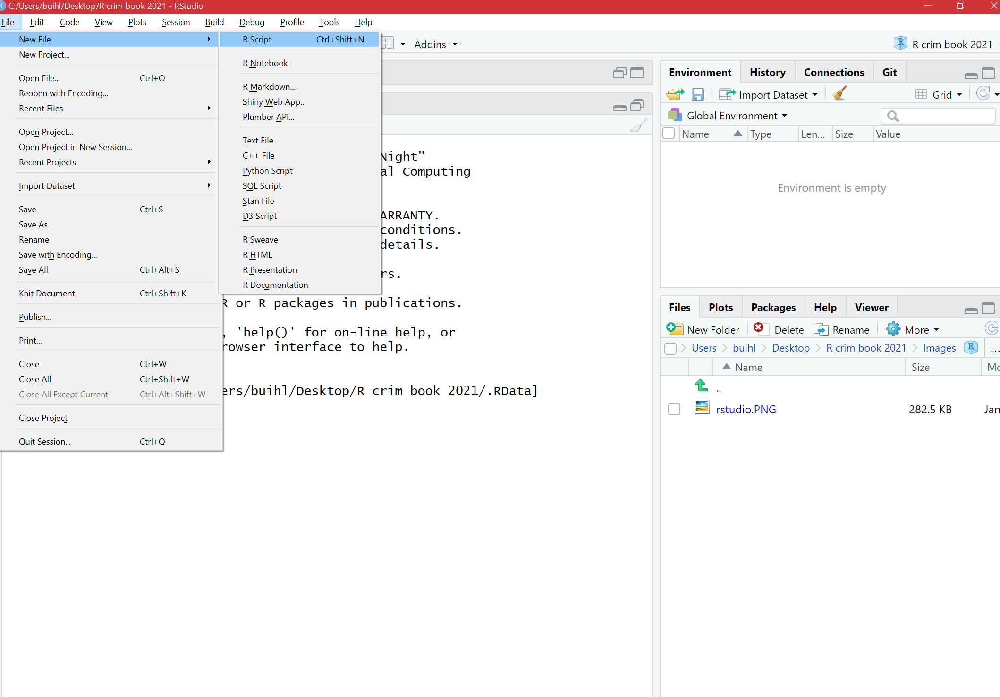
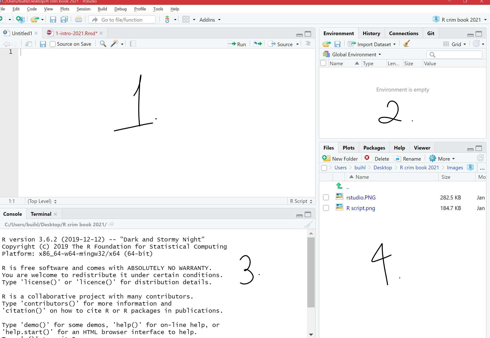

# A first lesson about R

In this lesson, you will be introduced to the programming language, `R`. After installing the related software and getting a basic idea of the R Studio interface, you will learn three `R` basics: operators, objects, and packages. 

Unlike other statistical software like SPSS and STATA, `R` is a free, open-source software for performing statistical analysis and data visualization. In addition, `R` offers more analytical solutions, flexibility, and customization than these commonly used statistical software, and its popularity has increased substantially over the years. 

We learn `R` because we hope that this is an important tool that you will continue to use in future. As it is free and has a community feel to it where anyone can create and upload new techniques, the idea is that you can use `R` long after this course. Even if data analysis is not in the future for you, learning how to conduct and interpret statistical output is a good skill to have – much of our knowledge of the world includes statistics, so understanding the numbers and how they were derived are advantages. `R` uses a language called **object-oriented programming**, and though it may seem daunting at first, practice makes familiarity. Also, you can impress your friends with all your coding. 


## Install R & R Studio


As `R` and `R Studio` are free software, you should be able to install these on your own machines at home. You may be working with different IT, so there are different options to allow a successful install. Our first activity will be to decide what approach to working with `R` and `R Studio` will be best for you. 


### Activity 1: Identifying your operating system

In this activity, you need to answer a question about your computer/IT that you will be working with for this class. That question is: 

- **What is your operating system**? Operating system refers to the software that your computer is running to deliver the basic functions. You may have, for example: 

  + *Windows or Linux* - if you have these, you are most likely going to have an easy time installing `R` and `R Studio`, so you should give the installation instructions below a try
  + *Apple* - if you have a Mac, there are some extra steps to install `R` and `R Studio`. Specifically, there will be an additional programme to download called Xcode, and additional steps to take.  
  + *Chromebook* - Installing `R` and `R Studio` on a Chromebook involves installing Linux. Like with a Mac, there are some additional steps you will need to take, and some patience.
  
In your group google sheets, write down which operating system you have. This will guide which directions to follow later. 


### Activity 2: Install R & R Studio


#### Some notes specific to your operating system. 

Before you move on to the installation steps, look at your answer from Activity 1, and read or watch the advice specific to your operating system:

- Windows: click [here](https://www.youtube.com/watch?v=VLWaED9jTiA) for instructions 
- Chromebook: read the tutorial [here](https://blog.sellorm.com/2018/12/20/installing-r-and-rstudio-on-a-chromebook/)
- Mac, follow the guidance in the video [here](https://www.youtube.com/watch?v=cX532N_XLIs&list=PLqzoL9-eJTNDw71zWePXyHx3_cm_fMP8S) and then, you will also need to install command line tools, for that you can watch another video [here](https://www.youtube.com/watch?v=3Yd9J_dhSfY) 
- Linux: for ubuntu see the video [here](https://www.youtube.com/watch?v=kF0-FH-xBiE) and if you have questions, let the teaching team know!


Once you have watched or read the instructions for your relevant operating system, you are now ready to actually have a go at downloading the software for yourself. Before you start, write in the google doc any questions or concerns, and once ready, install! 


#### Install `R`: {-}

1. Go to [https://www.r-project.org/](https://www.r-project.org/) 

2. Click the [download R](https://cran.r-project.org/mirrors.html) link under the *Getting Started* heading 

3. You will be asked to select a Comprehensive R Archive Network (CRAN) mirror. Click the URL closest to your location

4. Click whichever download link is appropriate for your operating system (see above).

5. Then click the *install R for the first-time* link and proceed to install `R`


#### Install R Studio: {-}

1. Go to [https://rstudio.com/](https://rstudio.com/)

2. Click the *Download* link

3. Scroll down and then click the DOWNLOAD button for the free version of
`RStudio`

4. You will be taken to a website to download the free version of `RStudio` that is appropriate for your computer. Download and then install it.


#### Plan B: accessing R Studio remotely throught a web browser

It might be that the above does not work and you find that there are some issues specific to your computer, or something just is not working. In that case, you have two options: 


- *Option 1:* You can remotely access one of the university PCs from your browser (Firefox, Chrome, Safari, etc). You can find instructions how to do this [here](https://www.itservices.manchester.ac.uk/students/pc-on-campus/remote-cluster-access/) , and the university IT helpdesk can help you access this too. If you do this, you will be able to use the version of `RStudio` installed in the computer clusters. 

- *Option 2*: You can access an online version of `R Studio`, which you can access through any web browser (Firefox, Chrome, Safari, etc). To do this, you visit [https://rstudio.cloud/](https://rstudio.cloud/), click on 'get started for free', choose the free account, and click on 'sign up'. Then you can always visit this website and log in to use `R Studio` in the cloud. Note that you should start a `New Project` and name it *Modelling Crime Data*, and then all your work will be saved in this project. 


## Open up and explore RStudio

In this session we will focus in developing basic familiarity with R Studio. You can use R without using R Studio, but R Studio is an app that makes it easier to work with R. 

R Studio is what we call an IDE, an **integrated development environment**. It is a fancy way of saying that it is a cool interface designed to write programming code. Every time you open up R Studio you are in fact starting a R session. R Studio automatically runs R in the background. We will be interacting with R in this course unit via R Studio.


 

When you first open R Studio, you will see (as in the image above) that there are 3 main windows. The bigger one to your left is the console. If you read the text in the console you will see that R Studio is indeed opening R and you can see what version of R you are running. Since R is constantly being updated the version you installed is likely more recent that the one we used at time of writing.

#### Activity 3: Opening up the script pane

The view in R Studio is structured so that you have 4 open windows in a regular session. However when you first open, you might be starting with only 3. To open the script pane (the one missing) click in the *File* drop down Menu, select *New File*, then *R Script*.



You will now see the 4 window areas in display. On each of these areas you can shift between different views and panels. You can also use your mouse to re-size the different windows if that is convenient.



### The four panes of R Studio

The purposes of the four panes in Figure above are the following:


1. **Script and data view**: where you type your programming code that tells `R` what you want to do. These are essentially instructions that you type and save as a **script**, so that you can return to it later to remember what you did and to share it with others so that they can reproduce what you did.


2. **Environment and history view**: 
  i) *2.1 Environment* tab- gives you the names of all the (data) objects that you have defined during your current `R` session, including number of observations and rows in those objects. We learn more about objects later. 


  ii) *2.2 History* tab- shows you a history of all the code you have previously evaluated in the main console. One of the key advantages of doing data analysis this way - with code versus with a point and click interface like Excel or ArcGIS is that you are producing a written record of every step you take in the analysis. First time around it will take you time to write these instructions, it may be slower than pointing and clicking. And unlike with pointing and clicking you need to know the "words" and "grammar" of this language. 


3. **Main console**: this is considered `R's` heart, and it is where `R` evaluates the codes that you run. You can type your codes directly in the console, but for the sake of good habits, type them in the script and data view so you can save a record of them. Only type and run code from here if you want to debug or do some quick analysis.


4. **File directory, Plots, Packages, Help**:
  i) *4.1 Files* tab-  allows you to see the files in the folder that is currently set as your working directory. 

  ii) *4.2 Plots* tab- you will see any data visualizations that you produce here. You have not produced any yet, so it is empty now.

  iii) *4.3 Packages* tab- you will see the packages that are currently available to install. We will explain what these are soon, but know that they are an essential feature when working with `R`.

  iv) *4.4 Help* tab- you can access further information on the various packages. 


  
#### Activity 4: Interacting with the 4 panes

In the previous activity, you opened up the 'script' pane. We now write some code in it, and see what happens. 

To do this, go to your open version of `R Studio`, and type in the script pane the following: 


```r
print("Hello world!")
```


When you have typed this, you will have typed your first bit of code. Yet nothing is happening? That is because you also have to **RUN** the code. 

You can do this by highlighting the code you wish to run, and clicking on 'run' in the top right hand corner: 


When you 'run' the code, it will print the text 'Hello World!' in the bottom pane, which is the **console**. That means you have written and executed your first line of code.

In the rest of the session, we will be unpacking how this all works, and getting more familiar and comfortable with using `R Studio`. 


To recap: the **script** is where you write your programming code. A script is nothing but a text file with some code on it. Unlike other programs for data analysis you may have used in the past (Excel, SPSS), you need to interact with R by means of writing down instructions and asking R to evaluate those instructions. R is an *interpreted* programming language: you write instructions (code) that the R engine has to interpret in order to do something. And all the instructions we write can and should be saved in a script, so that you can return later to what you did.

One of the key advantages of doing spatial data analysis this way - with code versus with a point and click interface like ArcGIS or MapInfo (or even QGIS) is that you are producing a written record of every step you take in the analysis. First time around it will take you time to write these instructions, it may be slower than pointing and clicking. And unlike with pointing and clicking you need to know the "words" and "grammar" of this language. 

The advantage of doing analysis this way is that once you have written your instructions and saved them in a file, you will be able to share it with others and run it every time you want in a matter of seconds. This creates a *reproducible* record of your analysis: something that your collaborators or someone else anywhere (including your future self, the one that will have forgotten how to do the stuff) could run and get the same results than you did at some point earlier. This makes science more transparent and transparency brings with it many advantages. For example, it makes your research more trustworthy. Don't underestimate how critical this is. **Reproducibility** is becoming a key criteria to assess good quality research. The University of Manchester [just joined the UK Reproducibility Network](https://www.staffnet.manchester.ac.uk/news/display/?id=25496), and is promoting this good practice. If you're interested you can join [the Open Science working group](https://research-it.manchester.ac.uk/news/2019/05/30/uom-open-science-working-group/) or the reading club [ReproducibiliTea](https://reproducibilitea.org/journal-clubs/#Manchester). You can read up on reproducibility and its importance [here](http://theconversation.com/the-science-reproducibility-crisis-and-what-can-be-done-about-it-74198) or get Stuart Richie's book [Science Fictions](https://www.goodreads.com/book/show/52199285-science-fictions) for an engaging further read.


## Customising the RStudio look

R Studio allows you to customise the way it looks. Working with white backgrounds is not generally a good idea if you care about your eyesight. If you don't want to end up with dry eyes not only it is good you follow the 20-20-20 rule (every 20 minutes look for 20 seconds to an object located 20 feet away from you), but it may also be a good idea to use more eye friendly screen displays. 

Click in the *Tools* menu and select *Global options*. This will open up a pop up window with various options. Select *Appearance*. In this section you can change the font type and size, but also the kind of theme background that R will use in the various windows. 


You can make any changes you'd like to here, including the theme background that `R` will use as the interface.

For example, you may choose a darker theme like 'tomorrow night bright'.


=======

As indicated above, the window in the bottom left corner is the main **console**.You will see that the words "I love maps" appear printed there.  If rather than using R Studio you were working directly from R, that's all you would get: the main console where you can write code interactively (rather than all the different windows you see in R Studio). You can write your code directly in the main console and execute it line by line in an interactive fashion. However, we will be running code from scripts, so that you get used to the idea of properly documenting all the steps you take,


### Functions

**Functions**  *do* things. They are called by a certain name, usually a name which represents what they do, and they are followed by brackets `()`. Within the brackets, you can put whatever it is that you want the function to work with. For example, the code we wrote in Activity 4 was the `print()` function. This function told `R` to print into the console whatever we put in the brackets ("Hello World!"). 


Same idea with a personalised greeting: if you want to print 'Hello Reka', you will need to have "Hello Reka" inside the brackets:


```r
print("Hello Reka")
```

```
## [1] "Hello Reka"
```


There are so many functions in `R`. We will be learning many of them throughout our class. `Print` is fun, but most of the time, we will be using functions to help us with our data analysis. For example, getting the minimum, maximum, or mean of a list of numbers. `R` does this using functions in a very similar way. 

For example, if we have a bunch of numbers, we just find the appropriate function to get the summary we want: 


```r
mean(10, 34, 5, 3, 77)
```

```
## [1] 10
```

```r
min(10, 34, 5, 3, 77)
```

```
## [1] 3
```

```r
max(10, 34, 5, 3, 77)
```

```
## [1] 77
```


How can you find the function you need? Throughout this class, you will learn a list that appears at the top of each lesson. A recommendation is to also create a 'function cookbook', where you write down a list of functions, what the functions do, and some examples. Here is an example: 


You can use google to make your cookbook, and the website [stackoverflow](https://stackoverflow.com/), in particular, can help you find the function you need. But be wary, especially in the beginning, that you understand what the function does. There can be several different functions for the same action. One good approach is to add a function of interest to your cookbook and ask the teaching team about what it does, and how it might be different to other functions that do the same thing.


#### Activity 5: Play around with functions

Have a guess (or google) about what you think is the function to get the median. Once you have your answer, write it in the shared google docs. Then, use it to get the median of the numbers 10, 34, 5, 3, 77. 

Write the answer in your shared google doc (or note it down for yourself if in the quiet room).

The answer is further below, after the note: 


**NOTE:** `R` is case-sensitive! For example:


```r
# Calculating the logarithm 
Log(100)

# ERROR!
```


```r
# Instead, it should be:
log(100)
```

```
## [1] 4.60517
```


 Okay, now you know these, the answer to Activity 6 was...
 
 
 

```r
median(10, 34, 5, 3, 77)
```

```
## [1] 10
```


 
Now let us move on to our second key topic: objects! 


### Objects 


Everything that exists in `R` is an **object**. Think of objects as boxes where you put things in. Imagine a big, empty cardboard box. We can create this big empty box in R by simply giving it a name. Usually, you want your object/box to have a good descriptive name, which will tell people what is in it. Imagine moving house. If you have a cardboard box full of places, you might want to label it "plates". That way, when carrying, you know to be careful, and when unpacking, you know its contents will go in the kitchen. On the other hand, if you named it "box1", then this is a lot less helpful when it comes to unpacking. 


#### Activity 6: Creating an object

Let us create an object called 'plates'. To do this, you go to your script, and type 'plates'. 


But if you run this code, you will get an error. Let's see: 


You see the error 'Error! Object plates not found'. This is because you have not yet put anything inside the plates 'box'. Remember objects are like boxes,so there must be something inside our object 'plates'. In order for this object to exist, you have to put something inside it, or in `R`-speak *assign it some value*.

Therefore, we make an object by using an *assignment operator* ( `<-` ). In other words, we assign something to an object (i.e., put something in the box). For example:


```r
plates <- "yellow plate"
```


Now if we run this, we will see no error message, but instead, we will see the `plates` object appear in our *environment pane*: 


Here are some more examples to illustrate: 


```r
# Putting '10' in the 'a' box
a <- 10

# Putting 'Hello!' in the 'abc123' box
abc123 <- "Hello!"
```


In these examples, we are putting the value of `10` into the object `a`, and the value of 'Hello!' into the object `abc123`. 

Earlier, we introduced you to the Environment and History pane. We mentioned that it lists objects you defined. After making the 'a' and 'abc123' objects, they should appear in that very pane under the `Environment` tab. 


#### Types of objects

Why are objects important? We will be storing everything in our data analysis process in these objects. Depending on what is inside them, they can become a different type of object. Here are some examples: 

**Data structures** are important objects that store your data, and there are five main types but we focus on three for this course:

1. *(atomic) vector*: an ordered set of elements that are of the same *class*. Vectors are a basic data structure in `R`. Below are five different classes of vectors:


```r
# 1. numeric vector with three elements
my_1st_vector <- c(0.5, 8.9, 0.6) 

# 2. integer vector with addition of L at the end of the value
my_2nd_vector <- c(1L, 2L, 3L)  

# 3. logical vector
my_3rd_vector <- c(TRUE, FALSE, FALSE) 
# 'my_4th_vector' creates a logical vector using abbreviations of True and False, but you should use the full words instead
my_4th_vector <- c(T, F) 

# 4. character vector
my_5th_vector <- c("a", "b", "c") 

# 5. complex vector (we will not use this for our class)
my_6th_vector <- c(1+0i, 2+4i) 
```


2. *lists*: technically they, too, are vectors but they are more complex because they are not restricted on the length, structure, or class of the included elements. For example, to create a list containing strings, numbers, vectors and a logical, use the `list()` function, and inside the brackets, put everything tat you want to combine into a list:


```r
list_data <- list("teal", "sky blue", c(10, 5, 10), TRUE, 68.26, 95.46, 99.7) 
```


Above, we created `list_data`, an object that contains all those things that we put inside the `list()` function. This function serves to create a list from combining everything that is put inside its brackets. 

Use the `class()` function to confirm that the objects have been defined as a list


```r
class(list_data)
```

```
## [1] "list"
```


3. *data frames*: also stores elements but differ from lists because they are defined by their number of columns and rows; the vectors (columns) must be of the same length. Data frames can contain different classes but each column must be of the same class. For example, if you want to combine some related vectors to make a data frame on violent American cities, use the function `data.frame()`:


```r
# Making some relevant vectors
TopVioCities <- c("St. Louis", "Detroit", "Baltimore") # some violent US cities
VioRatePer1k = c(20.8, 20.6, 20.3) # their violence rates per 1,000 persons
State <- c("Missouri", "Michigan", "Maryland") # in what states are these cities found

#Join them to make a data frame called 'df'
df<-data.frame(TopVioCities, VioRatePer1k, State)
```


We can then view the data frame, 'df', with the `View()` function:


```r
View(df)
```


#### Activity 7: Doing things to objects

We have learned what functions are (i.e., things that do things) and what are objects (i.e., the boxes that hold things). We also saw some functions which helped us create objects. Functions can also do things to objects. For example, we saw the function `class()` that told us about what kind of object list_data was, and `View()` which allowed us to have a look at our dataframe we called `df`.

Let us look back at our `plates` object. Remember it was the object that held our kitchen items. We added 'yellow plate' to it. Now let us add some more items and let us use the concatenate `c()` function for this again: 


```r
plates <- c("yellow plate", "purple plate", "silver plate", "orange bowl")
```


Let us say that we suddenly forgot what was in our object called 'plates'. Like what we learned earlier, we use the function `print()` to see what is inside this object:


```r
print(plates)
```

```
## [1] "yellow plate" "purple plate" "silver plate" "orange bowl"
```


This can apply to obtaining the mean, the minimum, and maximum. You could assign those statistics to an object this time:


```r
nums <- c(10, 34, 5, 3, 77)
```


Now if we want to know the mean, we can take the mean of the object `nums`, which we just created:


```r
mean(nums)
```

```
## [1] 25.8
```


The object we will use most frequently though is data frames. These hold your data in a format whereby each column represents a variable, and each row an observation. 

Just earlier, we had created a dataframe called `df` previously. If you have not yet copied this over into your own `R Studio`, do this now. You should have the object `df` in your environment. When you run `View(df)`, you should see this dataset:


To do something to an entire dataframe, we would use the name of the object (`df`) to refer to it. In the case of the `View()` function, we want to see the whole thing, so we will call `View(df)`. On the other hand, if we want to refer to only one variable in the data, (remember back to term 1 - each varible is held in each column) there is a special notation to do this. 

To refer to a variable (column) inside a dataframe, you use:


$dataframe name + \$ + variable name$


For example, to refer to the variable `VioRatePer1k`, we use the notation `df$VioRatePer1k`. 

And if we wanted to View only that column, we use: 


```r
View(df$VioRatePer1k)
```

You should see: 


Say we wanted to know the mean violence rate across our units of analysis, the cities, for example, we would take the numeric column to calculate this: 


```r
mean(df$VioRatePer1k)
```

```
## [1] 20.56667
```


## Packages 


**Packages** are a very important element of `R`. 


Packages are elements that add the functionality of R. What most packages do is they introduce new functions that allow you to ask R to do new different things. Anybody can write a package, so consequently R packages vary on quality and complexity. You can find packages in different places, as well, from official repositories (which means they have passed a minimum of quality control), something called Git Hub (a webpage where software developers post work in progress), to personal webpages (danger danger!). 


Throughout the course, and hopefully afterwards, you will find yourself installing numerous open source software packages that allow `R` to do new and different things. There are loads of packages out there. In early 2020, there were over 150,000 packages available. Anyone can write one, so you will need to be careful on which ones you use as the quality can vary. Official repositories, like [CRAN](https://cran.r-project.org/), are your best bet for packages as they will have passed some quality controls. 

You can see what packages are available in your local install by looking at the *packages* tab in the *File directory, Plots, Packages* pane. 


{width=35%}


A number of the packages we will use belong to a set of packages called **tidyverse**. These packages help make your data tidy. According to Statistician and Chief Scientist at `RStudio`, Hadley Wickham, transforming your data into *tidy data* is one of the most important steps of the data analysis process. It will ensure your data are in the format you need to conduct your analyses. We will also be using the simple features package **sf** and many more associated with spatial data analysis. 

Packages can be installed using the `install.packages()` function. Remember that while you only need to install packages once, they need to be loaded with the `library()`function each time you open up `RStudio`. Let us install the package `dplyr` from `tidyverse` and load it:


```r
library(dplyr)
```

```
## 
## Attaching package: 'dplyr'
```

```
## The following objects are masked from 'package:stats':
## 
##     filter, lag
```

```
## The following objects are masked from 'package:base':
## 
##     intersect, setdiff, setequal, union
```


A lot of code and activity appears in the console. Warnings may manifest. Most of the time, the warnings explain what is being loaded and confirm that the package is successfully loaded. If there is an error, you will have to figure out what the warnings are telling you to successfully load the package. This happens and is normal.

To double check that you have actually installed `dplyr`, go to that *File Directory, Plots, Packages* pane and click on the *Packages* tab. The list of packages is in alphabetical order and `dplyr` should be there. If there is a tick in its box, it means that this package is currently loaded and you can use it; if there is no tick, it means that it is inactive, and you will have to bring it up with `library()`, or just tick its box (Figure 1.6). 


{width=35%}


 
On *masking*:  sometimes packages introduce functions that have the same name as those that are already loaded into your session. When that happens, the newly loaded ones will override the previous ones. You can still use them but you will have to refer to them explicitly by bringing them up by specifying to which package they belong with `library()`.


How do you find out what a package does? You look at the relevant documentation. In the Packages window scroll down until you find the new package we installed listed. Here you will see the name of the package (dplyr), a brief description of what the program is about, and the version you have installed (an indication that a package is a good package is that it has gone through several versions, that means that someone is making sure the package gets regular updates and improvements). 

Click in the name *dplyr*. You will see that R Studio has now brought you to the Help tab. Here is where you find the help files for this package, including all the available documentation.

Every beginner in R will find these help files a bit confusing. But after a while, their format and structure will begin to make sense to you. Click where it says *User guides, package vignettes, and other documentation*. Documentation in R has become much better since people started to write **vignettes** for their packages. They are little tutorials that explain with examples what each package does. Click in the *cowsay::cowsay_tutorial* that you see listed here (the html link). What you will find there is an html file that gives you a detailed tutorial on this package. You don't need to read it now, but remember that this is one way to find help when using R. You will learn to love vignettes.


## Exploring data

Now that we know the basic component, let's play around with using R as we will throughout the course, for some data analysis. 

We will get some data by installing a package which has data in it as well as functions, and then go on to produce some basic summaries. This should give some practice!

### Activity 8: Playing around with data


We are going to look at some data that are part of the *fivethirtyeight* package. This package contains data sets and code behind the stories in [this particular online newspaper](http://fivethirtyeight.com/). This package is not part of the base installation of R, so you will need to install it first. I won't give you the code for it. See if you can figure it out by looking at previous examples. Discuss and write in the google doc what you think the code will be. 


Done? Ok, now we are going to look at the data sets that are included in this package. Remember first we have to load the package if we want to use it:


```r
library("fivethirtyeight")
```

```
## Some larger datasets need to be installed separately, like senators and
## house_district_forecast. To install these, we recommend you install the
## fivethirtyeightdata package by running:
## install.packages('fivethirtyeightdata', repos =
## 'https://fivethirtyeightdata.github.io/drat/', type = 'source')
```

```r
data(package="fivethirtyeight") #This function will return all the data frames that are available in the named package.
```

Notice that this package has some data sets that relate to stories covered in this newspaper that had a criminological angle. Let's look for example at the `hate_crimes` data set. How do you that? First we have to load the data frame into our global environment. To do so use the following code:


```r
data("hate_crimes")
```

This function will search among all the *loaded* packages and locate the `hate_crimes` data set. Notice that it now appears in the global environment, although it also says "promise" next to it. To see the data in full you need to do something to it first. So let's do that.

Every object in R can have **attributes**. These are: names; dimensions (for matrices and arrays: number of rows and columns) and dimensions names; class of object (numeric, character, etc.); length (for a vector this will be the number of elements in the vector); and other user-defined. You can access the attributes of an object using the `attributes()` function. Let's query R for the attributes of this data frame.


```r
attributes(hate_crimes)
```

```
## $row.names
##  [1]  1  2  3  4  5  6  7  8  9 10 11 12 13 14 15 16 17 18 19 20 21 22 23 24 25
## [26] 26 27 28 29 30 31 32 33 34 35 36 37 38 39 40 41 42 43 44 45 46 47 48 49 50
## [51] 51
## 
## $class
## [1] "tbl_df"     "tbl"        "data.frame"
## 
## $names
##  [1] "state"                       "state_abbrev"               
##  [3] "median_house_inc"            "share_unemp_seas"           
##  [5] "share_pop_metro"             "share_pop_hs"               
##  [7] "share_non_citizen"           "share_white_poverty"        
##  [9] "gini_index"                  "share_non_white"            
## [11] "share_vote_trump"            "hate_crimes_per_100k_splc"  
## [13] "avg_hatecrimes_per_100k_fbi"
```


This prints out the row names (not very exciting here..) the class (see above when we used `class()` function) and the names, which are the column headers - or the *names of the variables within this data set*. You can see there are things like state, and share who voted trump (in the 2016 election, not most recent!). 

Now use the `View()` function to glance at your data frame. What you get there is a spreadsheet with 12 variables and 51 observations. Each variable in this case is providing you with information (demographics, voting patterns, and hate crime) about each of the US states.  


Ok, let's now have a quick look at the data. There are so many different ways of producing summary stats for data stored in R that is impossible to cover them all! We will just introduce a few functions that you may find useful for summarising data. Before we do any of that it is important you get a sense for what is available in this data set. Go to the help tab and in the search box input the name of the data frame, this will take you to the documentation for this data frame. Here you can see a list of the available variables.


Let's start with the *mean*. This function takes as an argument the numeric variable for which you want to obtain the mean. You have done this above, so it should be familiar now! If you want to obtain the mean of the variable that gives us the proportion of people that voted for Donald Trump you can use the following expression:


```r
mean(hate_crimes$share_vote_trump)
```

```
## [1] 0.49
```

Another function you may want to use with numeric variables is `summary()`:


```r
summary(hate_crimes$share_vote_trump)
```

```
##    Min. 1st Qu.  Median    Mean 3rd Qu.    Max. 
##   0.040   0.415   0.490   0.490   0.575   0.700
```

This gives you the five number summary (minimum, first quartile, median, third quartile, and maximum, plus the mean and the count of missing values if there are any). 

You don't have to specify a variable you can ask for these summaries from the whole data frame:


```r
summary(hate_crimes)
```

```
##     state           state_abbrev       median_house_inc share_unemp_seas 
##  Length:51          Length:51          Min.   :35521    Min.   :0.02800  
##  Class :character   Class :character   1st Qu.:48657    1st Qu.:0.04200  
##  Mode  :character   Mode  :character   Median :54916    Median :0.05100  
##                                        Mean   :55224    Mean   :0.04957  
##                                        3rd Qu.:60719    3rd Qu.:0.05750  
##                                        Max.   :76165    Max.   :0.07300  
##                                                                          
##  share_pop_metro   share_pop_hs    share_non_citizen share_white_poverty
##  Min.   :0.3100   Min.   :0.7990   Min.   :0.01000   Min.   :0.04000    
##  1st Qu.:0.6300   1st Qu.:0.8405   1st Qu.:0.03000   1st Qu.:0.07500    
##  Median :0.7900   Median :0.8740   Median :0.04500   Median :0.09000    
##  Mean   :0.7502   Mean   :0.8691   Mean   :0.05458   Mean   :0.09176    
##  3rd Qu.:0.8950   3rd Qu.:0.8980   3rd Qu.:0.08000   3rd Qu.:0.10000    
##  Max.   :1.0000   Max.   :0.9180   Max.   :0.13000   Max.   :0.17000    
##                                    NA's   :3                            
##    gini_index     share_non_white  share_vote_trump hate_crimes_per_100k_splc
##  Min.   :0.4190   Min.   :0.0600   Min.   :0.040    Min.   :0.06745          
##  1st Qu.:0.4400   1st Qu.:0.1950   1st Qu.:0.415    1st Qu.:0.14271          
##  Median :0.4540   Median :0.2800   Median :0.490    Median :0.22620          
##  Mean   :0.4538   Mean   :0.3157   Mean   :0.490    Mean   :0.30409          
##  3rd Qu.:0.4665   3rd Qu.:0.4200   3rd Qu.:0.575    3rd Qu.:0.35694          
##  Max.   :0.5320   Max.   :0.8100   Max.   :0.700    Max.   :1.52230          
##                                                     NA's   :4                
##  avg_hatecrimes_per_100k_fbi
##  Min.   : 0.2669            
##  1st Qu.: 1.2931            
##  Median : 1.9871            
##  Mean   : 2.3676            
##  3rd Qu.: 3.1843            
##  Max.   :10.9535            
##  NA's   :1
```

There are multiple ways of getting results in R. Particularly for basic and intermediate-level statistical analysis many core functions and packages can give you the answer that you are looking for. For example, there are a variety of packages that allow you to look at summary statistics using functions defined within those packages. You will need to install these packages before you can use them. 

I am only going to introduce one of them here `skimr`. You will need to install it before anything else. 


Once you have loaded the *skimr* package you can use it. Its main function is *skim*. Like *summary* for data frames, skim presents results for all the columns and the statistics will depend on the class of the variable. 


```r
skim(hate_crimes)
```


Hopefully in your statistical modules you had taken previously, you have learned some things about how to graphically display variables. So you may have some memory about the amount of work involved with this. Hopefully R will offer some respite. Of course, there are many different ways of producing graphics in R. In this course we rely on a package called *ggplot2*, which is part of the tidyverse set of packages mentioned earlier. 


```r
library(ggplot2)
```

Then we will use one of its functions to create a scatterplot. 


```r
ggplot(hate_crimes, aes(x=share_vote_trump, y=avg_hatecrimes_per_100k_fbi)) +
    geom_point(shape=1) +
     geom_smooth(method=lm)
```

```
## `geom_smooth()` using formula 'y ~ x'
```

```
## Warning: Removed 1 rows containing non-finite values (stat_smooth).
```

```
## Warning: Removed 1 rows containing missing values (geom_point).
```


What do you think this graphic is telling you? Discuss and write in your shared google docs. 


Graphing is very powerful in R, and much of the spatial visualisation we will produce throughout the module will build on this. If you are not already familiar with this, I recommend a read of the data visualisation chapter of R for Data Science [https://r4ds.had.co.nz/data-visualisation.html](https://r4ds.had.co.nz/data-visualisation.html)


## Getting organised: R Projects

One thing that can help you tremendously throughout this module is keeping your code organised.R Studio helps with this by virtue of something called **R Projects**.

Technically, a R Studio project is just a directory with the name of the project, and a few files and folders created by R Studio for internal purposes. This is where you should hold your scripts, your data, and reports. You can manage this folder with your own operating system manager (discussed earlier, e.g., Windows) or through the R Studio file manager (that you access in the bottom right corner set of windows in R Studio).

When a project is reopened, R Studio opens every file and data view that was open when the project was closed last time around. Trust me, this is a really helpful thing! If you create a project for this module, you can keep everything in once place, and refer back to your old code and your learnings throughout the module. 


#### Activity 9: Saving your work and projects

First things first, hopefully you have already created a separate folder on your desktop, or dropbox, or something like this. Now save the script you've been working on into this folder. By clicking on "File" and "Save as...".


Then navigate to your folder for this module, and for your script make sure to give it some meaningful name like week1lab.R or something like this. Then click 'save'.


Now, go back to "File" and select "New project..."


Then in the options that appear choose "Existing Directory". This is because you already have a folder for this work, this is where you saved your script just before. For me this was my folder called 'crime_mapping' you saw above.


So select 'Existing Directory', and on the next page use the "Browse" button to select this folder (the directory) where you saved the script earlier. Once you have done this, click on 'Create Project' on the bottom.


This will now open up a new R Studio window with your project. In the future, you can start right back up where you finished last time by navigating to the .Rproj file, and double clicking it. It helps you keep everything in one place, and lets R read everything from that folder.


With simple projects a single script file and a data file is all you may have. But with more complex projects, things can rapidly become messy. So you may want to create subdirectories within this project folder. I typically use the following structure in my own work to put all files of a certain type in the same subdirectory:

+ *Scripts and code*: Here I put all the text files with my analytic code, including rmarkdown files which is something we will introduce much later in the semester.

+ *Source data*: Here I put the original data. I tend not to touch this once I have obtained the original data.

+ *Documentation*: This is the subdirectory where I place all the data documentation (e.g., codebooks, questionnaires, etc.)

+ *Modified data*: All analysis involve doing transformations and changing things in the original data files. You don't want to mess up the original data files, so what you should do is create new data files as soon as you start changing your source data. I go so far as to place them in a different subdirectory.

+ *Literature*: Analysis is all about answering research questions. There is always a literature about these questions. I place the relevant literature for the analytic project I am conducting in this subdirectory.

+ *Reports and write up*: Here is where I file all the reports and data visualisations that are associated with my analysis.

If you come to my office, you will see it is a very messy place. But my computer is, in contrast, a very tidy environment. You should aim for your computer workspace to be very organised as well. 


You can read up here on why projects are useful here: [https://www.r-bloggers.com/2020/01/rstudio-projects-and-working-directories-a-beginners-guide/](https://www.r-bloggers.com/2020/01/rstudio-projects-and-working-directories-a-beginners-guide/)


